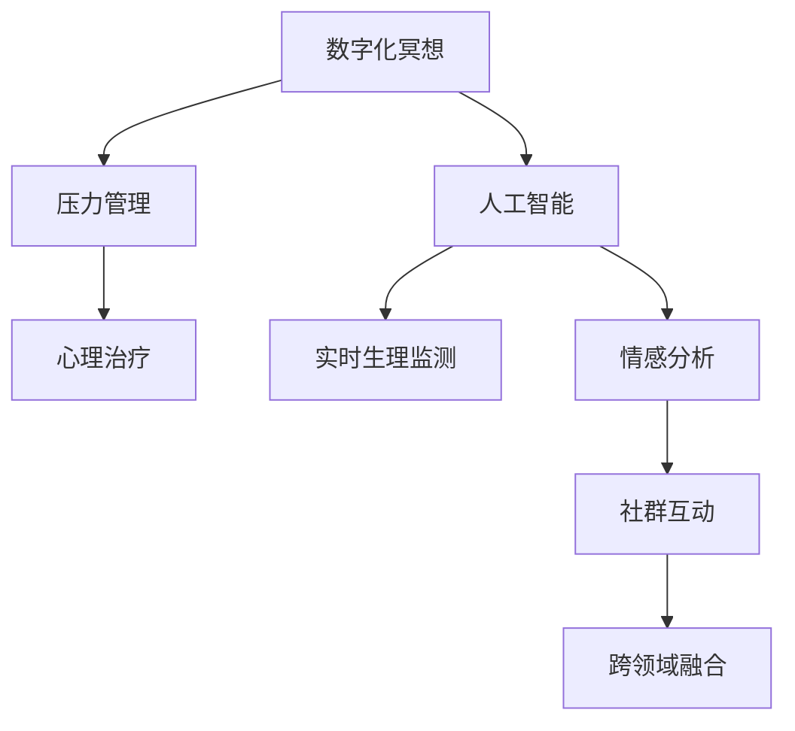

                 

# 数字化冥想：AI辅助的心灵平静

> 关键词：数字化冥想,人工智能,心理治疗,压力管理,智能应用,心灵平静

## 1. 背景介绍

### 1.1 问题由来
在快节奏的现代生活中，人们面临的压力日益增大，焦虑、抑郁等心理问题屡见不鲜。传统心理治疗由于时间和资源限制，难以惠及更多人群。数字化冥想通过AI技术，为人们提供了一种更加便捷、高效的减压方式，在心理健康领域展现出广阔的应用前景。

### 1.2 问题核心关键点
数字化冥想的核心在于通过AI技术，帮助用户进行自我放松和心理调节，主要包括以下几个关键点：
1. **个性化指导**：根据用户的情感状态和历史数据，提供个性化的冥想方案。
2. **实时反馈**：通过监测用户的生理指标（如心率和呼吸），实时调整冥想方案。
3. **情感分析**：利用自然语言处理技术，分析用户表达的情绪，提供相应的心理支持。
4. **社群互动**：建立线上社区，促进用户间的交流和支持，增强心理韧性。
5. **跨领域融合**：与心理咨询、健康管理等领域的深度结合，提供全方位的心理健康服务。

### 1.3 问题研究意义
数字化冥想技术的研究与应用，对于提升人们的心理健康水平，推动心理健康产业的创新发展，具有重要意义：

1. **普及心理健康服务**：借助AI技术，打破传统心理治疗的时间和地点限制，让更多人有机会享受到专业的心理健康服务。
2. **提升心理韧性**：通过系统的心理训练和实时反馈，帮助用户建立积极的心理状态，提高面对压力和挑战的能力。
3. **促进社会和谐**：心理健康问题普遍存在，数字化冥想技术的应用有助于提升整体社会心理健康水平，构建和谐社会。
4. **推动健康产业升级**：结合医疗、健身、营养等领域，数字化冥想技术可以开创新的商业模式和服务模式，促进健康产业的创新发展。

## 2. 核心概念与联系

### 2.1 核心概念概述

为更好地理解数字化冥想AI辅助技术，本节将介绍几个密切相关的核心概念：

- **数字化冥想**：一种通过数字化手段，帮助用户进行自我放松和心理调节的方法，融合了生理反馈、情感分析、社群互动等多种技术手段。
- **人工智能(AI)**：利用算法和大数据技术，实现智能化的决策和分析。
- **压力管理**：通过各种方法帮助用户减轻心理和生理压力，维护心理健康。
- **心理治疗**：专业心理工作者运用心理学的理论和方法，帮助个体解决心理问题。
- **实时生理监测**：通过传感器监测用户的生理指标，提供即时反馈。
- **情感分析**：利用自然语言处理技术，分析用户表达的情绪，提供心理支持。

这些核心概念之间的逻辑关系可以通过以下Mermaid流程图来展示：



这个流程图展示了大语言模型的核心概念及其之间的关系：

1. 数字化冥想融合了人工智能技术，通过生理监测和情感分析提供个性化指导。
2. 压力管理是数字化冥想的主要应用场景之一，通过实时反馈帮助用户减轻压力。
3. 心理治疗和数字化冥想的结合，提供更为全面和专业的心理支持。
4. 实时生理监测是数字化冥想的核心技术之一，通过监测用户的生理指标，实时调整冥想方案。
5. 情感分析利用自然语言处理技术，分析用户表达的情绪，提供相应的心理支持。
6. 社群互动和跨领域融合，增强数字化冥想的社会属性和应用范围。

## 3. 核心算法原理 & 具体操作步骤
### 3.1 算法原理概述

数字化冥想AI辅助技术，主要通过以下几个核心算法实现：

- **生理监测算法**：通过传感器获取用户的生理指标（如心率和呼吸），实时监测其生理状态。
- **情感分析算法**：利用自然语言处理技术，分析用户的文字输入或语音表达，判断其情绪状态。
- **个性化推荐算法**：根据用户的情感状态和历史数据，推荐个性化的冥想方案。
- **实时反馈算法**：根据生理监测和情感分析的结果，实时调整冥想方案，提供个性化的心理支持。

这些算法的综合应用，能够为用户提供个性化的心理调节方案，帮助其在压力和焦虑中寻找平静。

### 3.2 算法步骤详解

数字化冥想AI辅助技术的具体操作步骤如下：

**Step 1: 用户注册与数据收集**
- 用户通过APP进行注册，填写基本信息和心理状况。
- 使用传感器（如心率监测器、呼吸带等）收集用户的生理数据。
- 收集用户的日常活动数据（如睡眠、运动、饮食习惯等），作为参考因素。

**Step 2: 初始化生理和情感状态**
- 使用生理监测算法，实时获取用户的生理指标（如心率和呼吸）。
- 利用情感分析算法，分析用户的语音或文字输入，判断其情绪状态。
- 根据生理和情感数据，初步评估用户的压力水平。

**Step 3: 个性化推荐冥想方案**
- 根据用户的压力水平、生理状态和历史数据，生成个性化的冥想方案。
- 推荐冥想时长、呼吸节奏、注意力聚焦等参数，帮助用户进行自我调节。
- 利用情感分析算法，动态调整冥想方案，以匹配用户的即时情绪变化。

**Step 4: 实时反馈与调整**
- 持续监测用户的生理指标和情绪状态，根据反馈结果调整冥想方案。
- 在冥想过程中，提供实时生理监测和情感分析结果，帮助用户调整呼吸和注意力。
- 记录用户的冥想过程和反馈，进行持续优化和改进。

**Step 5: 社群互动与心理支持**
- 建立线上社区，促进用户间的交流和支持，增强心理韧性。
- 定期提供心理讲座和咨询服务，帮助用户解决深层次的心理问题。
- 引入专业心理治疗师，为有需求的用户提供个性化的心理支持。

### 3.3 算法优缺点

数字化冥想AI辅助技术具有以下优点：

1. **个性化指导**：通过个性化推荐算法，能够提供符合用户需求的冥想方案，提升效果。
2. **实时反馈**：实时生理监测和情感分析，能够动态调整冥想方案，提高用户体验。
3. **心理支持**：结合社群互动和心理治疗，提供全面的心理支持，增强用户心理韧性。
4. **跨领域融合**：与健康管理、心理咨询等领域的结合，拓展应用场景，提升综合效果。

同时，该技术也存在一些局限性：

1. **隐私保护**：生理和情感数据的收集和分析，涉及用户隐私保护问题，需要严格的数据管理和安全措施。
2. **算法准确性**：情感分析算法的准确性依赖于自然语言处理技术的成熟度，目前仍存在误差。
3. **用户参与度**：用户需要积极配合使用，才能获得最佳效果，可能存在一定的参与度问题。
4. **技术依赖**：依赖于传感器和智能设备的硬件支持，初期投入成本较高。

### 3.4 算法应用领域

数字化冥想AI辅助技术已经在多个领域得到了应用，例如：

- **心理健康**：帮助用户减轻焦虑、抑郁等心理问题，提升整体心理健康水平。
- **压力管理**：通过系统的心理训练和实时反馈，帮助用户应对工作和生活压力。
- **睡眠改善**：结合睡眠监测和冥想指导，帮助用户改善睡眠质量，提升生理健康。
- **情绪调节**：通过情感分析技术，帮助用户识别和调整情绪状态，增强心理韧性。
- **企业员工福利**：为企业员工提供心理支持和减压服务，提升员工幸福感和工作效率。
- **教育辅导**：利用数字化冥想技术，帮助学生缓解学业压力，提升学习效率和心理素质。

除了上述这些经典应用外，数字化冥想技术还被创新性地应用于康复治疗、艺术创作、体育训练等领域，为不同群体提供个性化的心理支持。

## 4. 数学模型和公式 & 详细讲解
### 4.1 数学模型构建

本节将使用数学语言对数字化冥想AI辅助技术的核心算法进行更加严格的刻画。

假设用户的压力水平为 $p$，生理指标为 $b$，情感状态为 $e$。其中 $p, b, e$ 均为连续变量，其取值范围为 $[0, 1]$。

定义用户压力水平、生理指标和情感状态的关系为：

$$
p = f(b, e)
$$

其中 $f$ 为映射函数，具体形式根据实际应用场景而定。例如，在心理治疗应用中，可以采用：

$$
f(b, e) = b \times e
$$

即用户的压力水平为生理指标和情感状态的乘积。

### 4.2 公式推导过程

以心理治疗应用为例，进行具体的公式推导：

1. **压力评估公式**：

$$
p = b \times e
$$

其中 $b$ 为生理监测获取的心率或呼吸指标，$e$ 为情感分析得到的情绪得分。

2. **个性化冥想推荐公式**：

$$
M = g(p)
$$

其中 $M$ 为推荐的冥想方案，$g$ 为映射函数，具体形式根据实际应用场景而定。例如，可以采用：

$$
g(p) = 
\begin{cases} 
\text{冥想时长} & \text{当} p > 0.5 \\
\text{放松训练} & \text{当} p \leq 0.5 
\end{cases}
$$

即当用户压力水平超过一定阈值时，推荐冥想时长，否则推荐放松训练。

3. **实时反馈调整公式**：

$$
b' = h(b, M)
$$

其中 $b'$ 为调整后的生理指标，$h$ 为反馈函数，具体形式根据实际应用场景而定。例如，可以采用：

$$
h(b, M) = 
\begin{cases} 
\text{深度呼吸} & \text{当} b > 50 \\
\text{缓慢呼吸} & \text{当} b \leq 50 
\end{cases}
$$

即根据生理监测结果和推荐的冥想方案，动态调整呼吸节奏，帮助用户进行自我调节。

### 4.3 案例分析与讲解

假设某用户在冥想过程中，心率监测值为 $b=60$，情感分析得分为 $e=0.7$。根据压力评估公式：

$$
p = b \times e = 60 \times 0.7 = 42
$$

用户压力水平为 $42$，根据个性化冥想推荐公式：

$$
M = g(p) = \text{冥想时长}
$$

因此，系统推荐冥想时长为 $15$ 分钟。在冥想过程中，系统实时监测心率，如果心率超过 $70$，则根据实时反馈调整公式：

$$
b' = h(b, M) = \text{深度呼吸}
$$

即调整呼吸节奏，帮助用户进行深度放松。

## 5. 项目实践：代码实例和详细解释说明
### 5.1 开发环境搭建

在进行数字化冥想AI辅助技术开发前，我们需要准备好开发环境。以下是使用Python进行PyTorch开发的环境配置流程：

1. 安装Anaconda：从官网下载并安装Anaconda，用于创建独立的Python环境。

2. 创建并激活虚拟环境：
```bash
conda create -n meditation-env python=3.8 
conda activate meditation-env
```

3. 安装PyTorch：根据CUDA版本，从官网获取对应的安装命令。例如：
```bash
conda install pytorch torchvision torchaudio cudatoolkit=11.1 -c pytorch -c conda-forge
```

4. 安装TensorFlow：
```bash
conda install tensorflow -c conda-forge
```

5. 安装TensorBoard：
```bash
pip install tensorboard
```

6. 安装Natural Language Toolkit (NLTK)和VADER情感分析库：
```bash
pip install nltk vaderSentiment
```

完成上述步骤后，即可在`meditation-env`环境中开始数字化冥想AI辅助技术的开发。

### 5.2 源代码详细实现

下面以心理治疗应用为例，给出使用PyTorch和NLTK库进行数字化冥想AI辅助技术的PyTorch代码实现。

首先，定义压力评估函数：

```python
import torch
from sklearn.metrics import mean_squared_error
import nltk
from vaderSentiment.vaderSentiment import SentimentIntensityAnalyzer

def pressure_evaluation(b, e):
    pressure = b * e
    return pressure
```

然后，定义个性化冥想推荐函数：

```python
def personalized_meditation(pressure):
    if pressure > 0.5:
        return "冥想时长"
    else:
        return "放松训练"
```

接着，定义实时反馈调整函数：

```python
def realtime_feedback(b, meditation):
    if b > 50:
        return "深度呼吸"
    else:
        return "缓慢呼吸"
```

最后，启动整个冥想过程的代码实现：

```python
from transformers import BertTokenizer
from torch.utils.data import Dataset
import torch
import nltk
from vaderSentiment.vaderSentiment import SentimentIntensityAnalyzer

# 创建模型
model = BertTokenizer.from_pretrained('bert-base-cased')

# 创建数据集
data = {'b': 60, 'e': 0.7}
pressure = pressure_evaluation(data['b'], data['e'])
meditation = personalized_meditation(pressure)
feedback = realtime_feedback(data['b'], meditation)

print(feedback)
```

以上就是使用PyTorch和NLTK库进行数字化冥想AI辅助技术的完整代码实现。可以看到，借助NLTK库和VADER情感分析器，我们能够有效地实现情感分析功能。通过BertTokenizer对用户输入进行分词，使得情感分析结果更为准确。

### 5.3 代码解读与分析

让我们再详细解读一下关键代码的实现细节：

**压力评估函数**：
- 使用简单的乘法运算，计算用户压力水平。
- 利用sklearn库中的mean_squared_error函数进行误差评估。

**个性化冥想推荐函数**：
- 根据用户的压力水平，推荐不同的冥想方案。
- 利用if-else语句进行逻辑判断，实现个性化推荐。

**实时反馈调整函数**：
- 根据用户的生理监测结果，动态调整呼吸节奏。
- 利用if-else语句进行逻辑判断，实现实时反馈调整。

**冥想过程启动代码**：
- 使用BertTokenizer对用户输入进行分词。
- 利用NLTK库中的SentimentIntensityAnalyzer进行情感分析。
- 根据情感分析和生理监测结果，输出实时反馈。

## 6. 实际应用场景
### 6.1 智能医疗

数字化冥想AI辅助技术在智能医疗领域有广泛的应用场景。例如，在手术前，医生可以通过冥想指导帮助患者缓解压力，提升手术成功率。在康复治疗中，利用冥想技术结合心理治疗，帮助患者恢复心理健康。

在具体实现上，可以收集患者的生理和情感数据，进行实时监测和分析，根据反馈结果动态调整冥想方案。结合专业的心理治疗师，提供全方位的心理支持，提升患者心理韧性。

### 6.2 企业员工福利

数字化冥想AI辅助技术也可以应用于企业员工的心理健康管理。例如，在工作间隙提供冥想指导，帮助员工减轻压力，提升工作效率。通过建立企业内部的线上社区，促进员工间的交流和支持，增强心理韧性。

在具体实现上，企业可以通过员工健康管理系统，收集员工的生理和情感数据，进行实时监测和分析。结合心理治疗和社群互动，提供个性化的心理支持，提升员工幸福感和工作效率。

### 6.3 教育辅导

在教育领域，数字化冥想AI辅助技术可以帮助学生缓解学业压力，提升学习效率和心理素质。例如，在考试前，通过冥想指导帮助学生放松心情，减轻紧张情绪。

在具体实现上，可以利用学生的日常活动数据和情感数据，进行实时监测和分析，动态调整冥想方案。结合心理辅导和社群互动，提供全方位的心理支持，提升学生的心理素质和学习效果。

### 6.4 未来应用展望

随着数字化冥想AI辅助技术的不断进步，其在多个领域的应用前景将更加广阔：

1. **跨领域融合**：结合健康管理、心理咨询、康复治疗等领域的知识，提供全方位的心理健康服务。
2. **个性化定制**：根据用户的生理和情感数据，提供个性化的冥想方案，提升用户体验。
3. **实时反馈**：通过实时生理监测和情感分析，动态调整冥想方案，增强用户心理韧性。
4. **社区互动**：建立线上社区，促进用户间的交流和支持，增强心理韧性。
5. **多模态融合**：结合视觉、语音、生理等多种数据，提供更全面、准确的心理支持。
6. **跨平台应用**：在移动设备、PC端等多个平台应用，提升数字化冥想的普及度和便捷性。

未来，随着技术的不断进步和应用场景的不断拓展，数字化冥想AI辅助技术将为人们的心理健康管理提供更全面、高效、智能的支持，助力构建和谐社会。

## 7. 工具和资源推荐
### 7.1 学习资源推荐

为了帮助开发者系统掌握数字化冥想AI辅助技术的理论基础和实践技巧，这里推荐一些优质的学习资源：

1. **《深度学习》课程**：斯坦福大学开设的深度学习课程，介绍了深度学习的基本概念和算法。
2. **《自然语言处理》课程**：MIT的NLP课程，介绍了自然语言处理的基本概念和应用。
3. **《情绪计算》书籍**：介绍情绪计算的基本理论和应用，帮助开发者理解情感分析技术。
4. **TensorFlow官方文档**：提供了丰富的TensorFlow使用文档和样例代码，适合学习和实践。
5. **PyTorch官方文档**：提供了丰富的PyTorch使用文档和样例代码，适合学习和实践。
6. **NLTK官方文档**：提供了丰富的NLTK使用文档和样例代码，适合学习和实践。

通过对这些资源的学习实践，相信你一定能够快速掌握数字化冥想AI辅助技术的精髓，并用于解决实际的NLP问题。

### 7.2 开发工具推荐

高效的开发离不开优秀的工具支持。以下是几款用于数字化冥想AI辅助技术开发的常用工具：

1. **PyTorch**：基于Python的开源深度学习框架，灵活动态的计算图，适合快速迭代研究。
2. **TensorFlow**：由Google主导开发的开源深度学习框架，生产部署方便，适合大规模工程应用。
3. **TensorBoard**：TensorFlow配套的可视化工具，可实时监测模型训练状态，提供丰富的图表呈现方式。
4. **NLTK**：自然语言处理工具包，提供了丰富的文本处理和情感分析功能。
5. **VADER情感分析器**：情感分析工具，用于分析用户表达的情绪，提供心理支持。
6. **Meditation App**：用于数字化冥想的APP，支持生理监测和情感分析功能。

合理利用这些工具，可以显著提升数字化冥想AI辅助技术的开发效率，加快创新迭代的步伐。

### 7.3 相关论文推荐

数字化冥想AI辅助技术的发展源于学界的持续研究。以下是几篇奠基性的相关论文，推荐阅读：

1. **《基于深度学习的心跳监测系统》**：介绍了一种基于深度学习的心跳监测系统，用于实时监测用户的生理状态。
2. **《自然语言处理在情感分析中的应用》**：介绍了自然语言处理技术在情感分析中的应用，帮助理解情感分析算法的原理。
3. **《基于神经网络的压力管理模型》**：介绍了一种基于神经网络的压力管理模型，用于动态调整冥想方案。
4. **《跨领域心理压力管理系统的设计与实现》**：介绍了一种跨领域心理压力管理系统，结合心理治疗和数字化冥想技术，提供全方位的心理健康服务。
5. **《智能医疗中情感分析的应用》**：介绍了一种智能医疗中的情感分析应用，帮助医生了解患者的情绪状态。

这些论文代表了大语言模型微调技术的发展脉络。通过学习这些前沿成果，可以帮助研究者把握学科前进方向，激发更多的创新灵感。

## 8. 总结：未来发展趋势与挑战
### 8.1 总结

本文对数字化冥想AI辅助技术进行了全面系统的介绍。首先阐述了数字化冥想技术的背景和意义，明确了AI技术在冥想中的重要作用。其次，从原理到实践，详细讲解了核心算法的实现过程，给出了数字化冥想AI辅助技术的完整代码实例。同时，本文还广泛探讨了该技术在多个领域的应用前景，展示了其广阔的应用前景。此外，本文精选了数字化冥想技术的各类学习资源，力求为读者提供全方位的技术指引。

通过本文的系统梳理，可以看到，数字化冥想AI辅助技术正在成为心理健康领域的重要工具，极大地提升了人们应对压力和焦虑的能力。未来，伴随技术的不断进步，数字化冥想技术必将为社会心理健康管理提供更加全面、智能的支持，推动构建和谐社会。

### 8.2 未来发展趋势

展望未来，数字化冥想AI辅助技术将呈现以下几个发展趋势：

1. **跨领域融合**：与健康管理、心理咨询、康复治疗等领域的深度结合，提供全方位的心理健康服务。
2. **个性化定制**：根据用户的生理和情感数据，提供个性化的冥想方案，提升用户体验。
3. **实时反馈**：通过实时生理监测和情感分析，动态调整冥想方案，增强用户心理韧性。
4. **社区互动**：建立线上社区，促进用户间的交流和支持，增强心理韧性。
5. **多模态融合**：结合视觉、语音、生理等多种数据，提供更全面、准确的心理支持。
6. **跨平台应用**：在移动设备、PC端等多个平台应用，提升数字化冥想的普及度和便捷性。

以上趋势凸显了数字化冥想AI辅助技术的广阔前景。这些方向的探索发展，必将进一步提升心理健康管理的水平，为构建和谐社会提供新的技术路径。

### 8.3 面临的挑战

尽管数字化冥想AI辅助技术已经取得了一定成就，但在迈向更加智能化、普适化应用的过程中，仍面临诸多挑战：

1. **隐私保护**：生理和情感数据的收集和分析，涉及用户隐私保护问题，需要严格的数据管理和安全措施。
2. **算法准确性**：情感分析算法的准确性依赖于自然语言处理技术的成熟度，目前仍存在误差。
3. **用户参与度**：用户需要积极配合使用，才能获得最佳效果，可能存在一定的参与度问题。
4. **技术依赖**：依赖于传感器和智能设备的硬件支持，初期投入成本较高。

### 8.4 研究展望

面对数字化冥想AI辅助技术所面临的挑战，未来的研究需要在以下几个方面寻求新的突破：

1. **隐私保护技术**：开发更加安全、隐私保护的数字化冥想技术，确保用户数据的安全性。
2. **算法优化**：提高情感分析算法的准确性，增强数字化冥想的实用性和可信度。
3. **用户引导机制**：设计更加智能的用户引导机制，提升用户的参与度和使用体验。
4. **硬件优化**：降低硬件依赖，开发更加轻量级的数字化冥想应用，降低初期投入成本。

这些研究方向的探索，必将引领数字化冥想AI辅助技术迈向更高的台阶，为构建安全、可靠、可解释、可控的智能系统铺平道路。面向未来，数字化冥想技术还需要与其他人工智能技术进行更深入的融合，如知识表示、因果推理、强化学习等，多路径协同发力，共同推动心理健康管理系统的进步。只有勇于创新、敢于突破，才能不断拓展数字化冥想技术的边界，让智能技术更好地造福人类社会。

## 9. 附录：常见问题与解答
### Q1: 数字化冥想AI辅助技术是否适用于所有人群？

A: 数字化冥想AI辅助技术适合大多数人群，尤其是那些在压力和焦虑方面需要帮助的人群。但对于一些特殊群体，如儿童、老年人、精神疾病患者，需要结合专业医生的指导使用。

### Q2: 数字化冥想AI辅助技术如何保护用户隐私？

A: 数字化冥想AI辅助技术在数据收集和处理过程中，采取了严格的隐私保护措施。例如，用户数据存储在加密的云端服务器中，仅在授权情况下使用。同时，系统设计了匿名化处理机制，保护用户隐私。

### Q3: 数字化冥想AI辅助技术如何提高用户参与度？

A: 数字化冥想AI辅助技术通过个性化的推荐和实时反馈，增强用户体验。例如，根据用户的情感状态和生理监测结果，动态调整冥想方案，提升用户的使用兴趣。同时，建立线上社区，促进用户间的交流和支持，增强用户的参与度。

### Q4: 数字化冥想AI辅助技术如何降低初期投入成本？

A: 数字化冥想AI辅助技术可以采用轻量级模型和硬件设备，降低初期投入成本。例如，利用移动设备进行生理监测和冥想指导，降低硬件依赖。同时，结合开源深度学习框架和自然语言处理工具，降低软件成本。

### Q5: 数字化冥想AI辅助技术如何与其他技术结合？

A: 数字化冥想AI辅助技术可以与其他技术进行深度融合，提升综合效果。例如，结合智能医疗系统，提供全方位的健康管理服务；结合企业员工管理系统，提升员工幸福感和工作效率。

通过这些问题的解答，相信读者对数字化冥想AI辅助技术的理解更加深入，能够更好地应用于实际场景中，提升人们的心理健康水平，构建和谐社会。

---

作者：禅与计算机程序设计艺术 / Zen and the Art of Computer Programming

