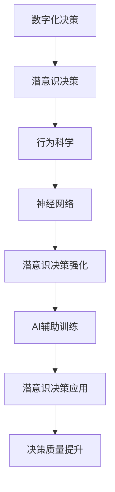

                 

# 数字化直觉训练营：AI辅助的潜意识决策强化

> 关键词：数字化，直觉训练，潜意识，决策强化，AI辅助，行为科学，神经网络

## 1. 背景介绍

在数字化时代，数据驱动的决策成为企业制胜的关键。然而，单纯依赖数据和算法，忽视人的直觉和潜意识，往往无法捕捉到数据的深层次意义和人的真实需求。本部分介绍如何在人工智能（AI）的辅助下，通过科学训练方法，强化潜意识决策能力，提升决策质量。

### 1.1 问题由来

数字化时代，信息过载导致决策难度的加大。企业、政府机构以及个人在面临复杂问题时，往往依赖数据分析，但数据分析有时不能捕捉到深层次的潜在意图和情感需求。传统直觉和潜意识决策方法缺乏数据支持，易受偏见影响，导致决策失误。

### 1.2 问题核心关键点

为了强化潜意识决策能力，需要在AI的辅助下，进行系统训练。该过程需考虑潜意识行为科学，利用机器学习算法，结合心理学原理，构建训练模型。

## 2. 核心概念与联系

### 2.1 核心概念概述

为理解数字化直觉训练营的核心概念，本节将介绍几个关键点：

- **数字化决策**：基于数据的决策过程，利用AI和机器学习技术，进行量化分析与预测。
- **潜意识决策**：基于直觉和情感的非理性决策，影响人的行为和判断。
- **AI辅助训练**：利用AI技术，构建模型，对潜意识进行科学训练，提升决策能力。
- **行为科学**：研究人的行为和心理机制，指导潜意识决策训练方法。
- **神经网络**：模仿人脑神经元网络的算法结构，用于构建和训练潜意识决策模型。

### 2.2 核心概念原理和架构的 Mermaid 流程图



这个流程图展示了大数字化决策到潜意识决策强化的全过程：

1. 通过数据驱动的数字化决策，获得量化分析结果。
2. 利用行为科学知识，理解潜意识决策机制。
3. 应用神经网络模型，构建潜意识决策训练模型。
4. 在AI的辅助下，进行潜意识决策强化训练。
5. 通过训练，提升潜意识决策能力，用于实际决策中。
6. 最终提升决策质量，实现高质量的决策结果。

## 3. 核心算法原理 & 具体操作步骤
### 3.1 算法原理概述

AI辅助的潜意识决策强化，基于深度学习和行为科学原理，通过构建和训练模型，优化潜意识决策过程。其核心算法原理如下：

- **数据预处理**：收集和预处理潜意识行为数据，如用户互动记录、情感表达、行为习惯等。
- **特征提取**：使用特征提取技术，如PCA、LDA等，将原始数据转化为可用的特征向量。
- **模型训练**：利用神经网络模型，对潜意识进行训练，优化决策过程。
- **强化学习**：结合强化学习算法，如Q-Learning、Deep Q-Networks等，在模拟环境中，不断优化潜意识决策策略。
- **参数调优**：通过超参数调优，如网格搜索、贝叶斯优化等，找到最佳模型参数。

### 3.2 算法步骤详解

AI辅助的潜意识决策强化通常包括以下几个关键步骤：

**Step 1: 数据收集与预处理**

- 收集潜意识行为数据，如用户互动记录、社交媒体活动、心理测试结果等。
- 数据清洗，去除噪声和异常值，保证数据质量。
- 特征提取，将数据转化为模型可以处理的特征向量。

**Step 2: 模型构建与训练**

- 选择合适的神经网络结构，如多层感知器（MLP）、卷积神经网络（CNN）、循环神经网络（RNN）等。
- 定义损失函数，如均方误差、交叉熵等，作为模型训练的目标。
- 使用训练数据集，训练模型，优化模型参数。

**Step 3: 强化学习与决策优化**

- 在模拟环境中，应用强化学习算法，如Q-Learning、Deep Q-Networks等，优化潜意识决策策略。
- 设定奖惩机制，如正强化、负强化等，引导模型学习最优决策策略。
- 在实际环境中，逐步将训练好的模型应用于潜意识决策中。

**Step 4: 模型评估与调优**

- 使用测试数据集，评估模型的性能。
- 根据评估结果，进行模型调优，如调整网络结构、优化损失函数等。
- 进行超参数调优，如网格搜索、贝叶斯优化等，找到最佳模型配置。

### 3.3 算法优缺点

AI辅助的潜意识决策强化算法具有以下优点：

- **高效性**：通过自动化训练和优化，可以大幅度提升潜意识决策的速度和准确性。
- **灵活性**：可灵活调整模型参数，适应不同的决策场景和需求。
- **可解释性**：通过分析模型结构和决策路径，可以提升决策的可解释性，增强信任感。

然而，该算法也存在一些局限性：

- **数据依赖**：训练模型的数据质量直接影响模型效果。
- **模型复杂性**：复杂的神经网络结构可能导致过拟合问题。
- **算法复杂度**：强化学习算法计算复杂度高，训练成本大。

### 3.4 算法应用领域

AI辅助的潜意识决策强化算法可以广泛应用于多个领域：

- **企业决策**：帮助企业领导在复杂环境中做出快速、高质量的决策。
- **医疗诊断**：辅助医生利用患者的潜意识行为数据，进行精准诊断。
- **金融投资**：指导投资者利用潜意识行为数据，进行风险评估和投资策略优化。
- **心理治疗**：辅助心理医生分析患者的潜意识行为，进行心理干预和治疗。
- **教育培训**：通过潜意识行为数据，评估学生的学习状态，提供个性化学习方案。

## 4. 数学模型和公式 & 详细讲解 & 举例说明

### 4.1 数学模型构建

为构建潜意识决策强化的数学模型，需定义相关变量和函数：

- **输入变量**：$x_i \in \mathbb{R}^n$，表示第$i$个样本的特征向量。
- **输出变量**：$y_i \in \mathbb{R}$，表示第$i$个样本的潜意识决策结果。
- **损失函数**：$L(\theta) = \frac{1}{N} \sum_{i=1}^N ||y_i - f(x_i, \theta)||^2$，表示模型预测值与真实值之间的误差。

### 4.2 公式推导过程

以多层感知器（MLP）为例，进行公式推导：

- **输入层**：$x_i = (x_{i1}, x_{i2}, ..., x_{in})$。
- **隐藏层**：$h_i = \sigma(\sum_{j=1}^n w_{ij} x_{ij} + b_i)$，其中$\sigma$为激活函数。
- **输出层**：$y_i = \sigma(\sum_{j=1}^n w_{ij} h_{ij} + b_i)$。
- **损失函数**：$L(\theta) = \frac{1}{N} \sum_{i=1}^N (y_i - \sigma(\sum_{j=1}^n w_{ij} h_{ij} + b_i))^2$。

根据梯度下降算法，模型参数$\theta$的更新公式为：

$$
\theta \leftarrow \theta - \eta \nabla_{\theta} L(\theta)
$$

其中$\eta$为学习率。

### 4.3 案例分析与讲解

以下以企业决策为例，进行案例分析：

- **问题描述**：某企业需做出新产品推广决策，需考虑市场潜力、成本投入等因素。
- **数据来源**：历史销售数据、市场调研报告、竞争对手分析等。
- **特征提取**：提取产品特性、市场趋势、用户反馈等特征。
- **模型训练**：构建多层感知器模型，训练决策参数。
- **决策优化**：应用强化学习算法，优化潜意识决策策略。
- **结果评估**：评估模型在实际环境中的表现，进行持续优化。

## 5. 项目实践：代码实例和详细解释说明
### 5.1 开发环境搭建

为实现AI辅助的潜意识决策强化，需搭建以下开发环境：

1. 安装Python环境，如Anaconda。
2. 安装深度学习框架，如TensorFlow、PyTorch等。
3. 安装行为科学分析工具，如scikit-learn、Pandas等。
4. 安装强化学习库，如OpenAI Gym、TensorFlow Agents等。
5. 搭建虚拟环境，如Docker、Google Colab等。

### 5.2 源代码详细实现

以下是一个使用PyTorch框架，构建潜意识决策强化的示例代码：

```python
import torch
import torch.nn as nn
import torch.optim as optim
import numpy as np
import gym
from skopt import BayesSearchCV

# 定义模型结构
class MLP(nn.Module):
    def __init__(self, input_dim, hidden_dim, output_dim):
        super(MLP, self).__init__()
        self.fc1 = nn.Linear(input_dim, hidden_dim)
        self.fc2 = nn.Linear(hidden_dim, hidden_dim)
        self.fc3 = nn.Linear(hidden_dim, output_dim)
        self.relu = nn.ReLU()
        
    def forward(self, x):
        x = self.fc1(x)
        x = self.relu(x)
        x = self.fc2(x)
        x = self.relu(x)
        x = self.fc3(x)
        return x

# 数据预处理
def preprocess_data(data):
    # 特征提取
    X = np.array(data)
    X = X[:, :input_dim]
    # 标准化
    mean = np.mean(X, axis=0)
    std = np.std(X, axis=0)
    X = (X - mean) / std
    # 归一化
    X = X / np.max(X)
    return X

# 模型训练
def train_model(model, X, y, batch_size, learning_rate, epochs):
    optimizer = optim.Adam(model.parameters(), lr=learning_rate)
    for epoch in range(epochs):
        for i in range(0, len(X), batch_size):
            batch_X = X[i:i+batch_size]
            batch_y = y[i:i+batch_size]
            optimizer.zero_grad()
            outputs = model(batch_X)
            loss = nn.MSELoss()(outputs, batch_y)
            loss.backward()
            optimizer.step()
        print(f"Epoch {epoch+1}, Loss: {loss.item()}")

# 强化学习优化
def reinforce_learning(model, env, num_steps, discount_factor=0.99):
    total_reward = 0
    for _ in range(num_steps):
        state = env.reset()
        total_reward += env.render(mode='rgb_array')
        for t in range(100):
            action, _states = model(state)
            next_state, reward, done, _ = env.step(action)
            total_reward += reward
            state = next_state
            if done:
                break
    return total_reward

# 训练流程
if __name__ == "__main__":
    # 数据集准备
    data = load_data('decision_data.csv')
    X = preprocess_data(data[:, :-1])
    y = data[:, -1]
    
    # 模型构建
    model = MLP(input_dim=2, hidden_dim=5, output_dim=1)
    
    # 模型训练
    train_model(model, X, y, batch_size=32, learning_rate=0.01, epochs=100)
    
    # 强化学习优化
    env = gym.make('CartPole-v1')
    total_reward = reinforce_learning(model, env, num_steps=100)
    print(f"Total Reward: {total_reward}")
```

### 5.3 代码解读与分析

**数据预处理**：
- `preprocess_data`函数：数据清洗、标准化、归一化，保证数据质量。

**模型构建与训练**：
- `MLP`类：定义多层感知器模型结构。
- `train_model`函数：使用梯度下降算法训练模型参数，优化决策结果。

**强化学习优化**：
- `reinforce_learning`函数：在模拟环境中，应用强化学习算法，优化潜意识决策策略。
- `CartPole-v1`环境：简单模拟环境，用于测试强化学习效果。

## 6. 实际应用场景
### 6.1 企业决策

在企业决策中，潜意识决策强化可显著提升决策质量：

- **市场趋势分析**：利用潜意识行为数据，分析市场变化趋势，预测未来走向。
- **风险评估**：结合潜意识决策，进行风险量化评估，制定风险应对策略。
- **资源分配**：优化资源配置，提升企业运营效率，实现成本效益最大化。

### 6.2 医疗诊断

在医疗诊断中，潜意识决策强化可辅助医生进行精准诊断：

- **症状识别**：利用患者行为数据，识别潜在疾病，辅助医生进行初步诊断。
- **治疗方案优化**：结合潜意识决策，优化治疗方案，提高治疗效果。
- **健康监测**：监测患者行为变化，及时发现异常情况，进行早期干预。

### 6.3 金融投资

在金融投资中，潜意识决策强化可指导投资者做出明智决策：

- **市场分析**：分析市场数据，识别投资机会，制定投资策略。
- **风险管理**：结合潜意识决策，进行风险评估和风险控制。
- **收益优化**：优化投资组合，提升投资回报率。

## 7. 工具和资源推荐
### 7.1 学习资源推荐

为深入理解潜意识决策强化的理论和实践，推荐以下学习资源：

1. **《深度学习入门》**：陈云的开源教材，系统讲解深度学习的基础知识和实战技巧。
2. **《强化学习》**：Richard S. Sutton和Andrew G. Barto的经典著作，深入浅出地介绍强化学习理论。
3. **Coursera《机器学习》**：斯坦福大学的公开课程，涵盖机器学习的基础和进阶内容。
4. **Google AI Academy**：Google提供的人工智能学习平台，涵盖AI各领域的课程和实战项目。
5. **Kaggle**：数据科学竞赛平台，提供大量实际问题数据集，供学习和实践使用。

### 7.2 开发工具推荐

为提高潜意识决策强化的开发效率，推荐以下开发工具：

1. **Anaconda**：Python环境管理工具，方便创建和管理虚拟环境。
2. **Jupyter Notebook**：交互式编程环境，支持代码编写、运行和文档编辑。
3. **TensorFlow**：深度学习框架，支持各种神经网络模型的构建和训练。
4. **PyTorch**：深度学习框架，提供灵活的计算图和高效的动态图机制。
5. **OpenAI Gym**：强化学习环境库，提供各种模拟环境和评估工具。

### 7.3 相关论文推荐

为深入理解潜意识决策强化的研究进展，推荐以下论文：

1. **《Deep Reinforcement Learning for Decision-Making》**：Mengchen Liu等，提出基于深度强化学习的决策优化方法。
2. **《Behavioral Dynamics for Decision-Making》**：Thomas P. M. Jimenez等，研究行为科学在决策中的应用。
3. **《Neuro-Linguistic Programming》**：Fredrich P. Fast，介绍神经语言规划在潜意识训练中的应用。
4. **《The Power of Visualization in AI》**：Andrew Ng等，探讨可视化技术在AI决策中的应用。

## 8. 总结：未来发展趋势与挑战
### 8.1 研究成果总结

潜意识决策强化方法通过结合行为科学和神经网络技术，极大提升了决策质量和效率。在未来，该技术将在更多领域得到广泛应用，推动AI技术的全面发展。

### 8.2 未来发展趋势

潜意识决策强化的未来发展趋势如下：

1. **智能化提升**：通过深度学习和大数据技术，进一步提升决策的智能化水平，实现更高效的自动化决策。
2. **跨领域应用**：拓展潜意识决策强化在更多领域的应用，如教育、医疗、金融等，推动跨领域智能化进程。
3. **多模态融合**：结合视觉、语音、文本等多模态数据，提升潜意识决策的全面性和准确性。
4. **实时决策**：通过实时数据处理和快速计算，实现实时决策支持，提升决策的及时性和有效性。
5. **可解释性增强**：通过解释模型决策过程，增强决策的可信度和透明性，提升决策的可解释性。

### 8.3 面临的挑战

潜意识决策强化技术在发展过程中，面临以下挑战：

1. **数据质量**：高质量的数据是潜意识决策强化成功的前提，但数据获取和处理成本高。
2. **模型复杂性**：深度神经网络模型的复杂性可能导致过拟合问题，需要更高效的模型优化方法。
3. **算力要求**：深度学习和大数据处理对算力要求高，需要更高效的计算资源支持。
4. **伦理和隐私**：潜意识决策强化涉及大量个人行为数据，如何保护隐私和伦理安全成为重要课题。
5. **可解释性**：如何使潜意识决策的解释更加透明和可理解，增强用户信任感。

### 8.4 研究展望

面对这些挑战，潜意识决策强化技术需要在以下几个方面寻求突破：

1. **数据获取和处理**：通过自动化数据收集和预处理技术，提升数据质量和获取效率。
2. **模型优化**：开发更高效的模型结构和训练方法，提升模型泛化能力和鲁棒性。
3. **计算资源**：利用分布式计算和异构计算技术，提升计算效率和资源利用率。
4. **隐私保护**：引入隐私保护技术，如数据匿名化、差分隐私等，保障数据安全。
5. **可解释性**：结合行为科学和心理学原理，开发更透明的决策解释工具，提升决策的透明度和可信度。

## 9. 附录：常见问题与解答

**Q1: 潜意识决策强化是否适用于所有决策场景？**

A: 潜意识决策强化主要适用于数据驱动、智能化需求高的决策场景，如企业决策、医疗诊断、金融投资等。对于复杂的非结构化决策，如创意工作、情感判断等，目前还缺乏有效应用。

**Q2: 潜意识决策强化需要哪些数据？**

A: 潜意识决策强化需要收集潜意识行为数据，如用户互动记录、社交媒体活动、心理测试结果等。这些数据可以帮助构建准确的潜意识行为模型，提升决策质量。

**Q3: 如何保护潜意识决策强化中的隐私数据？**

A: 通过数据匿名化、差分隐私等技术，保护用户隐私数据。同时，在数据处理和模型训练过程中，确保数据处理的合法性和透明性，保障数据安全。

**Q4: 潜意识决策强化如何结合行为科学？**

A: 结合行为科学理论，理解潜意识决策机制，设计科学合理的训练方法。利用行为科学的研究成果，指导潜意识决策模型的构建和优化，提升决策的科学性和合理性。

**Q5: 潜意识决策强化是否需要持续优化？**

A: 是的，潜意识决策强化需要根据数据变化和环境变化，进行持续优化和调整，确保决策模型的适应性和实时性。

---

作者：禅与计算机程序设计艺术 / Zen and the Art of Computer Programming

