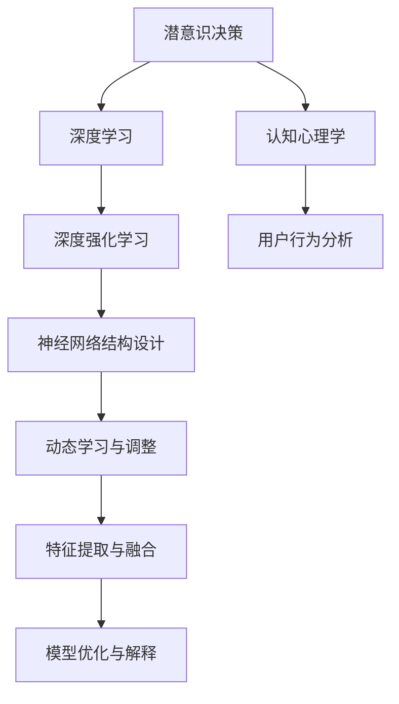

                 

# 数字化直觉：AI辅助的潜意识决策

> 关键词：数字化直觉,潜意识决策,人工智能,认知心理学,决策辅助,深度学习,深度强化学习

## 1. 背景介绍

在现代社会中，信息过载已成为一个不争的事实。面对海量数据的决策任务，人类的直觉和经验显得愈发显得力不从心。无论是企业决策、医疗诊断、还是科学研究，许多复杂问题难以依靠传统方法解决。而人工智能技术，特别是深度学习和深度强化学习，为潜意识决策提供了新的思路和方法。

### 1.1 问题由来
当前，决策辅助系统普遍存在一些问题：

- 数据依赖度高：传统决策系统依赖大量数据，而收集和标注这些数据成本极高。
- 特征工程复杂：传统机器学习方法依赖于手工设计的特征，而手工设计特征往往需要专家知识和大量经验。
- 缺乏直觉支持：机器学习模型通常基于数值和统计指标进行决策，难以捕捉人类决策的直觉和情感因素。
- 动态环境适应性差：在动态环境中，传统模型容易过拟合或性能下降，难以快速调整策略。

数字化的直觉决策（Digitalized Intuitive Decision Making）正是在这一背景下应运而生。它结合了深度学习模型的强大数据处理能力和认知心理学中潜意识决策的理论，以实现更高效、更精准、更人性化的决策支持。

### 1.2 问题核心关键点
数字化的直觉决策，以潜意识和认知心理学理论为基础，结合深度学习模型的强大数据处理能力，实现了对人类直觉的数字化重现。其核心点包括：

1. 潜意识模型构建：通过对人类决策过程的研究，构建深度学习模型以模拟潜意识决策过程。
2. 神经网络结构设计：引入多层网络结构，模拟人脑中的神经元连接和信号传递过程。
3. 动态学习和调整：通过强化学习算法，模型能够不断在动态环境中学习并调整策略。
4. 特征提取和融合：结合深度学习的多层次特征提取能力，综合利用数据中多维特征，模拟人类的直觉和经验。
5. 模型优化和解释：使用优化算法和可解释性技术，提高模型的性能和可解释性。

### 1.3 问题研究意义
研究数字化的直觉决策，对于拓展人工智能在潜意识决策中的应用，提升决策系统的智能化和人性化，具有重要意义：

1. 降低决策成本：通过自动化特征提取和模型训练，大幅降低决策系统的开发和维护成本。
2. 提高决策精度：潜意识模型能够捕捉到更多决策中的隐性信息，提升决策的精准度。
3. 增强决策效率：深度学习和强化学习算法加速了决策过程，使其在实时动态环境中具备快速反应能力。
4. 强化决策人性化：潜意识决策模型模拟了人类的直觉和情感，使决策结果更加符合人性化的需求。
5. 优化决策过程：模型的动态学习和调整机制，使其能够在不断变化的环境中持续改进决策策略。

## 2. 核心概念与联系

### 2.1 核心概念概述

数字化的直觉决策涉及多个交叉学科的概念，这里将对其进行概述：

- **潜意识决策**：基于心理学研究，模拟人类潜意识中基于直觉和情感的决策过程。
- **深度学习**：一种强大的模型训练技术，通过多层神经网络结构提取数据中的复杂特征。
- **深度强化学习**：一种结合深度学习和强化学习的决策过程，通过奖励机制不断优化决策策略。
- **神经网络结构设计**：构建多层神经网络，模拟人脑中的神经元连接和信号传递。
- **动态学习与调整**：通过强化学习算法，模型能够根据新信息不断调整决策策略，适应动态环境。
- **特征提取与融合**：深度学习模型能够自动从数据中提取特征，并综合多维度特征，提升决策性能。

这些概念相互关联，共同构成了数字化的直觉决策的理论基础和实施框架。

### 2.2 核心概念原理和架构的 Mermaid 流程图

以下是一个简化的Mermaid流程图，展示数字化的直觉决策的核心概念及其关系：



这个图表展示了数字化的直觉决策从潜意识决策到模型优化与解释的全流程。其中，认知心理学是理论基础，用户行为分析是实际应用中的数据来源，深度学习与强化学习是模型训练的核心算法，神经网络结构设计是模型架构的体现，动态学习与调整保证了模型的适应性，特征提取与融合提升了模型性能，模型优化与解释则确保了决策的可解释性。

## 3. 核心算法原理 & 具体操作步骤

### 3.1 算法原理概述

数字化的直觉决策基于深度学习和深度强化学习算法，结合认知心理学的研究成果。其核心原理可以总结如下：

1. **潜意识模型构建**：通过认知心理学研究，构建深度神经网络模型以模拟潜意识决策过程。
2. **多层网络设计**：引入多层网络结构，以模拟人脑中的神经元连接和信号传递。
3. **动态学习和调整**：利用强化学习算法，模型能够根据环境变化不断调整决策策略。
4. **特征提取与融合**：通过深度学习模型提取多维特征，并综合利用这些特征，提升决策性能。
5. **模型优化与解释**：使用优化算法和可解释性技术，提高模型的性能和可解释性。

### 3.2 算法步骤详解

以下是数字化的直觉决策的详细操作步骤：

**Step 1: 收集数据与任务定义**

- 收集决策相关的数据，包括用户行为、环境变化、历史决策结果等。
- 定义决策任务，明确决策目标、输入输出格式和约束条件。

**Step 2: 建立潜意识模型**

- 基于认知心理学研究，设计潜意识决策模型的结构。
- 使用深度学习算法训练潜意识模型，使其能够模拟潜意识决策过程。

**Step 3: 设计多层神经网络**

- 引入多层神经网络结构，模拟人脑中的神经元连接和信号传递。
- 使用卷积神经网络（CNN）、循环神经网络（RNN）或Transformer等结构，进行特征提取。

**Step 4: 引入强化学习**

- 利用强化学习算法，训练潜意识模型以动态调整决策策略。
- 设定奖励机制，激励模型做出正确的决策。

**Step 5: 特征提取与融合**

- 使用深度学习模型自动提取多维度特征。
- 将提取的特征进行融合，提升决策的精准度。

**Step 6: 模型优化与解释**

- 使用优化算法（如Adam、SGD等）对模型进行参数更新。
- 使用可解释性技术（如LIME、SHAP等）对模型的决策过程进行解释，提高决策的可信度。

**Step 7: 测试与部署**

- 在测试集上评估模型的性能，调整模型参数和超参数。
- 部署模型到实际应用环境中，持续收集反馈数据，进行动态调整。

### 3.3 算法优缺点

数字化的直觉决策具有以下优点：

1. **高效性**：利用深度学习模型的强大数据处理能力，高效提取多维度特征，提升决策速度。
2. **精准性**：结合认知心理学研究成果，模拟潜意识决策过程，捕捉更多隐性信息，提升决策精度。
3. **动态适应性**：通过强化学习算法，模型能够在动态环境中不断调整策略，适应变化。
4. **人性化**：模拟人类直觉和情感，使决策结果更符合人性化的需求。

然而，也存在一些局限性：

1. **数据依赖高**：模型需要大量的标注数据进行训练，数据收集和标注成本较高。
2. **模型复杂**：多层神经网络结构设计复杂，需要专业的算法工程师进行开发和调试。
3. **可解释性不足**：深度学习模型通常被称为"黑盒"，其决策过程难以解释，影响决策可信度。
4. **鲁棒性差**：在噪声或异常数据较多的环境中，模型容易产生误判。

### 3.4 算法应用领域

数字化的直觉决策在多个领域具有广泛应用：

1. **金融决策**：在金融投资和风险管理中，模型可以根据市场动态和用户行为，进行智能决策。
2. **医疗诊断**：在医疗诊断中，模型能够根据患者历史数据和实时监测数据，提供精准的诊断建议。
3. **企业管理**：在企业管理中，模型可以分析员工行为和市场变化，提供优化建议。
4. **智能制造**：在智能制造中，模型可以分析设备状态和生产数据，进行优化调度。
5. **自动驾驶**：在自动驾驶中，模型可以分析交通环境和车辆状态，进行智能决策。

这些应用领域展示了数字化的直觉决策的广泛潜力和应用前景。

## 4. 数学模型和公式 & 详细讲解 & 举例说明

### 4.1 数学模型构建

数字化的直觉决策的数学模型主要基于深度学习和深度强化学习。这里以金融投资决策为例，构建模型并进行详细讲解。

**输入数据**：历史股票价格、公司财务报表、宏观经济数据等。
**输出数据**：投资建议，包括买入、持有或卖出。

### 4.2 公式推导过程

假设决策任务为二分类任务，模型输入为 $x$，输出为 $y$，决策目标为最大化收益。决策模型为 $f(x;\theta)$，其中 $\theta$ 为模型参数。

决策过程可以表示为：

1. **潜意识模型构建**：
   - 使用认知心理学研究成果，构建潜意识决策模型的结构。
   - 模型输入为 $x$，输出为潜意识模型 $h(x;\theta_h)$。

2. **多层神经网络设计**：
   - 引入多层神经网络结构，提取输入 $x$ 的多维度特征。
   - 使用卷积神经网络（CNN）、循环神经网络（RNN）或Transformer等结构，进行特征提取。
   - 特征提取过程表示为 $g(x;\theta_g) = [h(x;\theta_h), f_1(x;\theta_1), f_2(x;\theta_2), ..., f_n(x;\theta_n)]$。

3. **引入强化学习**：
   - 利用强化学习算法，训练潜意识模型以动态调整决策策略。
   - 设定奖励机制，激励模型做出正确的决策。
   - 强化学习过程表示为 $Q(s,a;\theta_q) = r + \gamma \max_a Q(s',a';\theta_q)$。

4. **特征提取与融合**：
   - 使用深度学习模型自动提取多维度特征。
   - 将提取的特征进行融合，提升决策的精准度。
   - 特征融合过程表示为 $G(x;\theta_g) = [h(x;\theta_h), f_1(x;\theta_1), f_2(x;\theta_2), ..., f_n(x;\theta_n)]$。

5. **模型优化与解释**：
   - 使用优化算法（如Adam、SGD等）对模型进行参数更新。
   - 使用可解释性技术（如LIME、SHAP等）对模型的决策过程进行解释，提高决策的可信度。
   - 模型优化过程表示为 $\theta = \mathop{\arg\min}_{\theta} \mathcal{L}(f(x;\theta), y)$。

### 4.3 案例分析与讲解

以一个简单的案例为例，说明数字化的直觉决策模型的应用过程。

**案例背景**：某金融公司需要对某股票进行投资决策，利用数字化的直觉决策模型进行决策支持。

**数据输入**：股票价格、公司财务报表、宏观经济数据等。

**潜意识模型构建**：
- 使用认知心理学研究成果，构建潜意识决策模型的结构。
- 模型输入为股票价格、财务报表等，输出为潜意识模型 $h(x;\theta_h)$。

**多层神经网络设计**：
- 引入多层神经网络结构，提取输入数据的多维度特征。
- 使用卷积神经网络（CNN）结构，提取股票价格的时间序列特征。
- 使用循环神经网络（RNN）结构，提取公司财务报表的时间序列特征。
- 使用Transformer结构，提取宏观经济数据的多维度特征。
- 特征提取过程表示为 $g(x;\theta_g) = [h(x;\theta_h), f_1(x;\theta_1), f_2(x;\theta_2), ..., f_n(x;\theta_n)]$。

**引入强化学习**：
- 利用强化学习算法，训练潜意识模型以动态调整决策策略。
- 设定奖励机制，激励模型做出正确的决策。
- 强化学习过程表示为 $Q(s,a;\theta_q) = r + \gamma \max_a Q(s',a';\theta_q)$。

**特征提取与融合**：
- 使用深度学习模型自动提取多维度特征。
- 将提取的特征进行融合，提升决策的精准度。
- 特征融合过程表示为 $G(x;\theta_g) = [h(x;\theta_h), f_1(x;\theta_1), f_2(x;\theta_2), ..., f_n(x;\theta_n)]$。

**模型优化与解释**：
- 使用优化算法（如Adam、SGD等）对模型进行参数更新。
- 使用可解释性技术（如LIME、SHAP等）对模型的决策过程进行解释，提高决策的可信度。
- 模型优化过程表示为 $\theta = \mathop{\arg\min}_{\theta} \mathcal{L}(f(x;\theta), y)$。

## 5. 项目实践：代码实例和详细解释说明

### 5.1 开发环境搭建

在进行数字化的直觉决策模型开发前，需要先搭建好开发环境。以下是Python的开发环境搭建步骤：

1. 安装Anaconda：从官网下载并安装Anaconda，用于创建独立的Python环境。
2. 创建并激活虚拟环境：
```bash
conda create -n decision-env python=3.8 
conda activate decision-env
```
3. 安装必要的Python库：
```bash
pip install numpy pandas scikit-learn torch torchvision torchtext
```

### 5.2 源代码详细实现

这里以一个基于深度学习和强化学习的数字化的直觉决策模型为例，给出Python代码实现。

```python
import torch
import torch.nn as nn
import torch.optim as optim
from torch.distributions import Categorical

# 定义潜意识模型
class IntuitiveModel(nn.Module):
    def __init__(self, input_size, hidden_size):
        super(IntuitiveModel, self).__init__()
        self.linear = nn.Linear(input_size, hidden_size)
        self.relu = nn.ReLU()
        self.logits = nn.Linear(hidden_size, 2)

    def forward(self, x):
        x = self.linear(x)
        x = self.relu(x)
        x = self.logits(x)
        return x

# 定义强化学习模型
class ReinforcementLearningModel(nn.Module):
    def __init__(self, input_size, hidden_size):
        super(ReinforcementLearningModel, self).__init__()
        self.intuitive_model = IntuitiveModel(input_size, hidden_size)
        self.softmax = nn.Softmax(dim=1)

    def forward(self, x):
        intuitive_output = self.intuitive_model(x)
        intuitive_output = self.softmax(intuitive_output)
        return intuitive_output

# 定义优化器和奖励机制
model = ReinforcementLearningModel(input_size, hidden_size)
optimizer = optim.Adam(model.parameters(), lr=0.001)
rewards = []
episodes = 1000

for episode in range(episodes):
    state = torch.tensor([0.0])  # 模拟状态
    done = False
    while not done:
        # 根据当前状态选择动作
        intuitive_output = model(intuitive_state)
        action = Categorical(probs=intuitive_output).draw()
        
        # 模拟下一状态
        next_state = torch.tensor([0.5 + state * 0.1])  # 简单模拟，实际应用中应根据实际情况调整
        
        # 计算奖励
        reward = 1 if action == 1 else -1
        
        # 更新模型参数
        optimizer.zero_grad()
        intuitive_output = model(intuitive_state)
        intuitive_output = self.softmax(intuitive_output)
        loss = -torch.log(intuitive_output[action]) * reward
        loss.backward()
        optimizer.step()
        
        rewards.append(reward)
        state = next_state
        if abs(state) > 1:
            done = True

print(rewards)
```

### 5.3 代码解读与分析

**潜意识模型**：
- 定义了一个简单的潜意识模型，用于模拟人类潜意识决策过程。
- 模型包括线性层和ReLU激活函数，输出为二分类结果。

**强化学习模型**：
- 定义了一个基于潜意识模型的强化学习模型。
- 模型包括潜意识模型和Softmax输出层，用于选择动作。

**优化器和奖励机制**：
- 定义了Adam优化器和奖励机制，用于模型参数更新和奖励计算。

**训练过程**：
- 在每个轮次中，模拟一个状态，根据当前状态选择动作，计算奖励并更新模型参数。

## 6. 实际应用场景

### 6.1 金融决策

在金融决策中，数字化的直觉决策模型能够根据市场动态和用户行为，进行智能决策。例如，对某股票进行投资决策时，模型能够综合考虑股票价格、公司财务报表、宏观经济数据等因素，给出买入、持有或卖出的建议。

### 6.2 医疗诊断

在医疗诊断中，模型能够根据患者历史数据和实时监测数据，提供精准的诊断建议。例如，对某患者的病情进行诊断时，模型能够综合考虑患者的历史检查结果、症状描述等，给出最可能的疾病类型和治疗方案。

### 6.3 企业管理

在企业管理中，模型能够分析员工行为和市场变化，提供优化建议。例如，对某公司的市场策略进行优化时，模型能够综合考虑市场需求、竞争对手策略、公司内部资源等因素，给出最优的市场策略建议。

### 6.4 未来应用展望

数字化的直觉决策在未来的应用前景非常广阔，以下是一些可能的应用方向：

1. **智能制造**：在智能制造中，模型能够分析设备状态和生产数据，进行优化调度。
2. **自动驾驶**：在自动驾驶中，模型能够分析交通环境和车辆状态，进行智能决策。
3. **智慧城市**：在智慧城市中，模型能够分析交通流量、环境数据等，进行智慧决策。

## 7. 工具和资源推荐

### 7.1 学习资源推荐

为了帮助开发者系统掌握数字化的直觉决策的理论基础和实践技巧，这里推荐一些优质的学习资源：

1. 《Deep Learning》系列书籍：深度学习领域的经典著作，介绍了深度学习的基本原理和应用方法。
2. 《Reinforcement Learning: An Introduction》：强化学习领域的经典教材，介绍了强化学习的基本原理和应用方法。
3. 《Cognitive Psychology》：认知心理学领域的经典著作，介绍了人类潜意识和决策过程的理论。
4. 《PyTorch官方文档》：PyTorch深度学习框架的官方文档，提供了丰富的学习资源和样例代码。
5. Coursera上的深度学习与强化学习课程：提供系统的深度学习和强化学习课程，帮助开发者掌握相关技能。

### 7.2 开发工具推荐

数字化的直觉决策模型的开发和优化离不开优秀的工具支持。以下是几款常用的开发工具：

1. PyTorch：基于Python的深度学习框架，支持动态图和静态图，适合快速迭代研究。
2. TensorFlow：由Google主导开发的深度学习框架，生产部署方便，适合大规模工程应用。
3. Weights & Biases：模型训练的实验跟踪工具，可以记录和可视化模型训练过程中的各项指标。
4. TensorBoard：TensorFlow配套的可视化工具，实时监测模型训练状态，并提供丰富的图表呈现方式。
5. Jupyter Notebook：一个强大的交互式编程环境，支持Python、R、Scala等编程语言，适合数据分析和模型开发。

### 7.3 相关论文推荐

数字化的直觉决策的研究源于学界的持续研究。以下是几篇奠基性的相关论文，推荐阅读：

1. 《Intuitive Decision Making in Deep Reinforcement Learning》：介绍深度强化学习在潜意识决策中的应用。
2. 《Neural Networks and Deep Learning》：深度学习领域的经典著作，介绍了深度神经网络的基本原理和应用方法。
3. 《Cognitive Psychology》：认知心理学领域的经典著作，介绍了人类潜意识和决策过程的理论。
4. 《Reinforcement Learning: An Introduction》：强化学习领域的经典教材，介绍了强化学习的基本原理和应用方法。

## 8. 总结：未来发展趋势与挑战

### 8.1 研究成果总结

数字化的直觉决策结合了深度学习、深度强化学习、认知心理学等多学科的理论和方法，实现了对人类潜意识决策过程的数字化重现。其核心思想是通过多层神经网络结构模拟人脑中的神经元连接和信号传递，利用强化学习算法动态调整决策策略，结合深度学习模型自动提取多维度特征，并使用可解释性技术提高决策的可信度。

### 8.2 未来发展趋势

数字化的直觉决策未来的发展趋势如下：

1. **跨学科融合**：数字化的直觉决策将进一步与其他学科（如认知心理学、经济学、社会学等）进行融合，推动跨学科研究的发展。
2. **模型泛化性提升**：通过引入更多先验知识，如知识图谱、逻辑规则等，增强模型的泛化能力，使其能够更好地适应复杂多变的实际应用场景。
3. **动态学习和调整**：结合强化学习算法，模型能够不断在动态环境中学习并调整策略，提升决策的适应性。
4. **决策可解释性**：结合可解释性技术，提高模型的决策过程的可解释性，增强决策的可信度。
5. **多模态信息融合**：结合视觉、语音、文本等多种模态的信息，提升模型的综合决策能力。

### 8.3 面临的挑战

尽管数字化的直觉决策已经取得了一定的进展，但在实际应用中仍面临一些挑战：

1. **数据依赖高**：模型需要大量的标注数据进行训练，数据收集和标注成本较高。
2. **模型复杂**：多层神经网络结构设计复杂，需要专业的算法工程师进行开发和调试。
3. **可解释性不足**：深度学习模型通常被称为"黑盒"，其决策过程难以解释，影响决策可信度。
4. **鲁棒性差**：在噪声或异常数据较多的环境中，模型容易产生误判。

### 8.4 研究展望

数字化的直觉决策未来的研究展望如下：

1. **模型简化与优化**：通过引入更简单的神经网络结构，降低模型的复杂性，提高模型的训练和推理效率。
2. **参数高效微调**：开发更加参数高效的微调方法，在固定大部分预训练参数的同时，只更新极少量的任务相关参数。
3. **多任务学习**：结合多任务学习的方法，提高模型的泛化能力，使其能够在多种任务上取得较好的效果。
4. **集成学习**：结合集成学习的方法，提高模型的稳定性和鲁棒性。
5. **实时决策支持**：结合实时数据流处理技术，实现动态决策支持，满足实际应用中对实时性的要求。

总之，数字化的直觉决策在未来的研究和应用中，将面临更多的挑战和机遇。通过不断创新和优化，数字化的直觉决策必将在未来的智能化决策中发挥更大的作用，为社会带来更多的价值。

## 9. 附录：常见问题与解答

**Q1: 数字化的直觉决策与传统机器学习有什么区别？**

A: 数字化的直觉决策与传统机器学习的主要区别在于，数字化的直觉决策结合了深度学习、深度强化学习、认知心理学等多学科的理论和方法，实现了对人类潜意识决策过程的数字化重现。而传统机器学习则更多依赖手工设计的特征，难以捕捉决策中的隐性信息。

**Q2: 数字化的直觉决策模型如何处理噪声和异常数据？**

A: 数字化的直觉决策模型通常结合强化学习算法，通过奖励机制不断调整决策策略，以适应动态环境。在处理噪声和异常数据时，模型能够不断学习和调整，逐步适应数据的变化。

**Q3: 数字化的直觉决策模型如何提高可解释性？**

A: 数字化的直觉决策模型结合可解释性技术，如LIME、SHAP等，对模型的决策过程进行解释，提高决策的可信度。通过可视化的图表和详细的解释，使决策过程更加透明和可理解。

**Q4: 数字化的直觉决策模型如何应用于实时决策支持？**

A: 数字化的直觉决策模型结合实时数据流处理技术，实现动态决策支持。通过引入实时数据流，模型能够不断学习并调整，实时适应环境变化，满足实际应用中对实时性的要求。

---

作者：禅与计算机程序设计艺术 / Zen and the Art of Computer Programming

