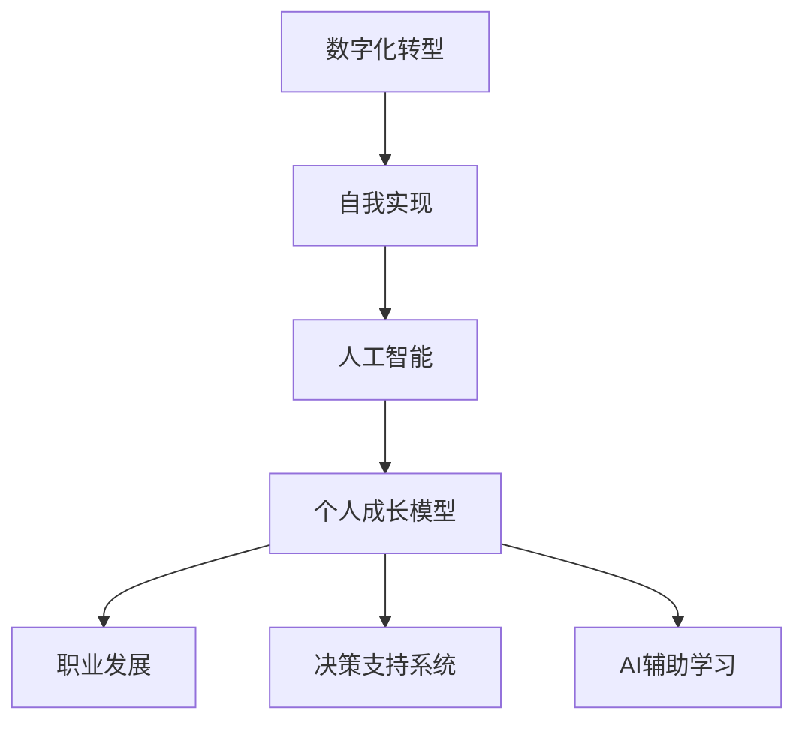

                 

# 数字化自我实现理论：AI辅助的个人成长模型

> 关键词：数字化转型,自我实现,人工智能,个人成长模型,职业发展,决策支持系统,AI辅助学习

## 1. 背景介绍

### 1.1 问题由来
随着科技的迅猛发展和互联网的普及，数字化已经成为各行各业转型升级的重要趋势。个人也不例外，数字化不仅改变了人们的日常生活和工作方式，更提供了自我实现和持续成长的新路径。在数字化浪潮中，人工智能(AI)作为一种强大的工具，为个人成长提供了前所未有的机遇与挑战。

**数字化的自我实现**是指通过数字化工具和平台，提升个人的学习、工作、生活等方面的能力，实现个人潜力的最大化。AI辅助的个人成长模型旨在借助人工智能技术，帮助个人在数字化时代中更加高效地成长和发展。这种模型能够利用AI的强大分析、推理和学习能力，为个人提供精准的决策支持、个性化学习计划和实时反馈，从而实现全方位的自我提升。

## 2. 核心概念与联系

### 2.1 核心概念概述

在讨论AI辅助的个人成长模型之前，我们先了解几个关键概念：

- **数字化转型**：指利用信息技术和互联网技术，将传统业务流程和组织模式进行数字化、智能化改造，提升企业或组织的竞争力和效率。
- **自我实现**：根据马斯洛的需求层次理论，自我实现是指个人潜能的最大化，包括创造性、个性、问题解决能力等多方面的发展。
- **人工智能(AI)**：一种通过算法和数据模型，使计算机系统具有类似人类的智能和学习能力的技术，包括机器学习、深度学习、自然语言处理等。
- **个人成长模型**：基于人工智能，针对个人发展需求设计的模型，能够提供个性化的学习路径、职业规划、健康管理等功能，帮助个人实现全面发展。
- **职业发展**：通过教育和培训等手段，提升个人的专业技能和职业素养，实现职业生涯的顺利发展和晋升。
- **决策支持系统**：一种利用数据分析和AI技术，为决策者提供实时、准确的数据支持，辅助决策的系统。
- **AI辅助学习**：通过AI技术，如推荐系统、个性化学习路径设计、学习效果评估等，提高学习效率和效果的个性化学习方式。

这些概念之间的逻辑关系可以通过以下Mermaid流程图来展示：



这个流程图展示了从数字化转型到人工智能，再到个人成长模型的整体架构，以及各模块之间的相互关系。

## 3. 核心算法原理 & 具体操作步骤
### 3.1 算法原理概述

AI辅助的个人成长模型基于数据驱动和机器学习原理，旨在通过收集和分析用户的行为数据、学习数据、职业数据等，提供个性化的成长建议和支持。其核心算法包括：

- **数据收集与预处理**：从用户的学习平台、工作记录、健康监控等渠道收集数据，并进行清洗、标准化和特征提取。
- **用户画像构建**：通过聚类、降维等算法，构建用户的个性化画像，描述其兴趣、能力和职业倾向等特征。
- **学习路径规划**：基于用户画像和目标，利用推荐算法生成个性化的学习路径，包括课程推荐、学习进度安排等。
- **职业发展规划**：结合用户的学习数据和职业数据，使用预测模型分析职业发展趋势，提供职业规划建议。
- **决策支持系统**：通过数据分析和AI模型，为用户提供实时的决策建议，如推荐求职机会、工作评估等。
- **效果评估与反馈**：实时跟踪用户的学习进度和职业发展情况，利用机器学习模型评估学习效果和职业规划的准确性，提供持续的反馈和改进建议。

### 3.2 算法步骤详解

以下详细介绍AI辅助的个人成长模型的算法步骤：

**Step 1: 数据收集与预处理**
- 从用户的在线学习平台、社交网络、工作记录、健康监控等渠道，收集数据。
- 数据预处理包括数据清洗、特征提取、归一化等步骤，确保数据质量。

**Step 2: 用户画像构建**
- 利用聚类算法对用户特征进行分类，构建用户画像。
- 通过降维算法（如PCA）减少数据维度，提取关键特征。

**Step 3: 学习路径规划**
- 使用推荐算法（如协同过滤、基于内容的推荐等）生成个性化学习路径。
- 结合时间序列分析，预测学习进度和效果，调整学习计划。

**Step 4: 职业发展规划**
- 利用预测模型（如决策树、随机森林等）分析职业发展趋势。
- 结合用户画像和职业数据，提供职业规划建议。

**Step 5: 决策支持系统**
- 通过数据分析和机器学习模型，提供实时决策支持。
- 结合用户反馈和最新数据，动态调整决策建议。

**Step 6: 效果评估与反馈**
- 实时跟踪用户的学习进度和职业发展情况。
- 利用机器学习模型评估学习效果和职业规划的准确性。
- 根据评估结果，提供持续的反馈和改进建议。

### 3.3 算法优缺点

AI辅助的个人成长模型具有以下优点：
- **个性化推荐**：能够根据用户画像和行为数据，提供精准的学习路径和职业规划建议。
- **实时反馈**：通过实时数据监测和分析，及时调整学习计划和职业发展策略。
- **高效决策**：利用AI模型提供实时的决策支持，帮助用户做出最优选择。
- **数据驱动**：基于大量数据和模型分析，提升决策的科学性和准确性。

同时，该模型也存在以下缺点：
- **数据隐私**：用户数据的收集和使用可能涉及隐私问题，需要严格的数据保护措施。
- **算法偏见**：如果数据或模型存在偏见，可能影响建议的公平性和准确性。
- **模型复杂度**：构建和维护AI模型需要较高的技术门槛，需要专业的知识和资源。
- **依赖环境**：模型的效果受限于数据质量和用户行为数据的丰富程度。

尽管存在这些局限性，AI辅助的个人成长模型仍是一种高效、智能的个人成长工具，能够帮助用户在数字化时代中实现自我超越和持续发展。

### 3.4 算法应用领域

AI辅助的个人成长模型在多个领域有广泛的应用，以下是几个典型的应用场景：

- **教育培训**：为学生提供个性化的学习路径和资源推荐，提升学习效果。
- **职业发展**：帮助职场人士制定职业规划，评估职业发展路径，推荐适合的岗位和培训课程。
- **健康管理**：利用健康数据和AI模型，提供个性化的健康管理方案，提升生活质量。
- **个人理财**：通过分析用户财务数据和消费行为，提供个性化的理财建议和投资规划。
- **心理咨询**：利用AI技术进行情绪分析，提供心理评估和咨询服务。

这些应用场景展示了AI辅助的个人成长模型在个人成长、职业规划、健康管理等领域的广泛潜力。

## 4. 数学模型和公式 & 详细讲解 & 举例说明

### 4.1 数学模型构建

AI辅助的个人成长模型涉及多个数学模型，包括聚类算法、推荐算法、预测模型等。以下是几个关键模型的构建和推导过程。

**用户画像构建**
- **K-means聚类**：假设用户特征向量为 $X$，聚类数为 $k$，通过迭代求解最优的聚类中心 $C$，使得 $X$ 到 $C$ 的距离最小。
- **公式推导**：$C = \mathop{\arg\min}_{C} \sum_{i=1}^n ||X_i - C_j||^2$，其中 $X_i$ 为用户特征向量，$C_j$ 为聚类中心。

**学习路径规划**
- **协同过滤算法**：基于用户历史行为数据和项目属性，推荐相似用户喜欢的项目。
- **公式推导**：$R_{ui} = \sum_{v \in N(u)} \frac{I_{uv} \times r_{vi}}{\sqrt{k_u \times k_v}}$，其中 $R_{ui}$ 为用户 $u$ 对项目 $i$ 的评分，$N(u)$ 为与用户 $u$ 相似的用户集，$r_{vi}$ 为相似用户 $v$ 对项目 $i$ 的评分，$k_u$ 和 $k_v$ 分别为用户 $u$ 和用户 $v$ 的评分数。

**职业发展规划**
- **随机森林预测**：利用决策树集成，对用户职业数据进行预测，评估职业发展趋势。
- **公式推导**：预测模型 $F(x)$ 为随机森林，$x$ 为输入特征，$y$ 为输出目标，$F(x) = \frac{1}{m} \sum_{i=1}^m T(x, \mathcal{T}_i)$，其中 $\mathcal{T}_i$ 为第 $i$ 棵决策树，$m$ 为树的数量。

### 4.2 公式推导过程

以下是几个关键模型的公式推导：

**K-means聚类算法**
- **K-means算法**：假设用户特征向量为 $X$，聚类数为 $k$，通过迭代求解最优的聚类中心 $C$，使得 $X$ 到 $C$ 的距离最小。
- **公式推导**：$C = \mathop{\arg\min}_{C} \sum_{i=1}^n ||X_i - C_j||^2$，其中 $X_i$ 为用户特征向量，$C_j$ 为聚类中心。

**协同过滤算法**
- **协同过滤算法**：基于用户历史行为数据和项目属性，推荐相似用户喜欢的项目。
- **公式推导**：$R_{ui} = \sum_{v \in N(u)} \frac{I_{uv} \times r_{vi}}{\sqrt{k_u \times k_v}}$，其中 $R_{ui}$ 为用户 $u$ 对项目 $i$ 的评分，$N(u)$ 为与用户 $u$ 相似的用户集，$r_{vi}$ 为相似用户 $v$ 对项目 $i$ 的评分，$k_u$ 和 $k_v$ 分别为用户 $u$ 和用户 $v$ 的评分数。

**随机森林预测模型**
- **随机森林预测**：利用决策树集成，对用户职业数据进行预测，评估职业发展趋势。
- **公式推导**：预测模型 $F(x)$ 为随机森林，$x$ 为输入特征，$y$ 为输出目标，$F(x) = \frac{1}{m} \sum_{i=1}^m T(x, \mathcal{T}_i)$，其中 $\mathcal{T}_i$ 为第 $i$ 棵决策树，$m$ 为树的数量。

### 4.3 案例分析与讲解

**案例分析1：个性化学习路径规划**
假设小明是一名大学生，希望提高数学成绩。使用AI辅助的个人成长模型，为其规划个性化学习路径。

1. **数据收集**：收集小明在MOOC平台上的学习数据、成绩数据、兴趣偏好等。
2. **用户画像构建**：通过K-means聚类算法，将小明与相似用户进行分类。
3. **学习路径规划**：使用协同过滤算法，推荐与小明相似用户喜欢的数学课程。
4. **实时反馈**：通过定期评估小明的课程学习效果，调整学习路径。

**案例分析2：职业发展规划**
假设小红是一名职场人士，希望提升自己的职业发展。使用AI辅助的个人成长模型，为其制定职业发展规划。

1. **数据收集**：收集小红的职业经历、技能证书、工作表现等数据。
2. **用户画像构建**：通过聚类算法，将小红与相似职业人士进行分类。
3. **职业发展规划**：使用随机森林预测模型，分析小红的职业发展趋势。
4. **实时反馈**：根据小红的职业发展情况，提供实时职业建议和培训课程推荐。

## 5. 项目实践：代码实例和详细解释说明

### 5.1 开发环境搭建

在进行AI辅助的个人成长模型开发前，我们需要准备好开发环境。以下是使用Python进行PyTorch开发的环境配置流程：

1. 安装Anaconda：从官网下载并安装Anaconda，用于创建独立的Python环境。

2. 创建并激活虚拟环境：
```bash
conda create -n ai-env python=3.8 
conda activate ai-env
```

3. 安装PyTorch：根据CUDA版本，从官网获取对应的安装命令。例如：
```bash
conda install pytorch torchvision torchaudio cudatoolkit=11.1 -c pytorch -c conda-forge
```

4. 安装TensorFlow：
```bash
conda install tensorflow
```

5. 安装各类工具包：
```bash
pip install numpy pandas scikit-learn matplotlib tqdm jupyter notebook ipython
```

完成上述步骤后，即可在`ai-env`环境中开始项目实践。

### 5.2 源代码详细实现

下面是使用PyTorch实现K-means聚类算法的代码示例：

```python
import torch
from sklearn.cluster import KMeans

# 假设用户特征向量为X
X = torch.randn(100, 10)  # 生成100个10维用户特征向量

# 设置聚类数k
k = 5

# 使用K-means聚类算法
kmeans = KMeans(n_clusters=k)
kmeans.fit(X.numpy())

# 获取聚类中心
centers = kmeans.cluster_centers_
```

**代码解读与分析**

1. **导入库**：导入必要的库，包括PyTorch和sklearn的K-means聚类算法。
2. **数据生成**：生成100个10维用户特征向量X。
3. **聚类数设置**：设置聚类数k为5。
4. **聚类算法应用**：使用K-means算法对X进行聚类，得到聚类中心centers。
5. **代码输出**：输出聚类中心。

### 5.3 代码解读与分析

**代码示例**

以下是使用Python实现协同过滤算法的代码示例：

```python
import numpy as np
from scipy.sparse import csr_matrix

# 假设用户行为矩阵U
U = np.array([[0, 1, 0, 1],
              [1, 0, 1, 0],
              [0, 0, 1, 0],
              [0, 1, 1, 0]])

# 设置相似用户数N
N = 2

# 计算相似用户集
similar_users = np.where(U @ U.T > 0.5)[0]

# 计算相似用户对项目的评分
similar_ratings = U[similar_users].dot(U[similar_users].T)

# 计算预测评分
predictions = np.dot(U[:, :N], similar_ratings) / np.sqrt(np.sum(U[:, :N] ** 2, axis=1))

# 输出预测评分
print(predictions)
```

**代码解读与分析**

1. **导入库**：导入必要的库，包括numpy和scipy的csr_matrix。
2. **用户行为矩阵U**：设置用户行为矩阵U，其中1表示用户对项目进行了行为。
3. **相似用户数设置**：设置相似用户数N为2。
4. **相似用户集计算**：计算与用户相似的用户集similar_users。
5. **相似用户对项目的评分**：计算相似用户对项目的评分similar_ratings。
6. **预测评分计算**：利用协同过滤算法，计算预测评分predictions。
7. **代码输出**：输出预测评分。

### 5.4 运行结果展示

**运行结果示例**

以下是使用Python实现随机森林预测模型的代码示例：

```python
from sklearn.ensemble import RandomForestRegressor
from sklearn.datasets import make_regression

# 生成回归数据
X, y = make_regression(n_samples=100, n_features=5, noise=0.1)

# 训练随机森林模型
rf = RandomForestRegressor(n_estimators=100, random_state=42)
rf.fit(X, y)

# 预测新数据
X_new = np.array([[1, 2, 3, 4, 5]])
prediction = rf.predict(X_new)

# 输出预测结果
print(prediction)
```

**代码解读与分析**

1. **导入库**：导入必要的库，包括sklearn的RandomForestRegressor和make_regression。
2. **回归数据生成**：生成100个样本，5个特征，噪声为0.1。
3. **随机森林模型训练**：设置随机森林参数，训练模型。
4. **新数据预测**：使用训练好的模型，预测新数据X_new的回归值。
5. **代码输出**：输出预测结果。

## 6. 实际应用场景

### 6.1 教育培训

AI辅助的个人成长模型在教育培训领域有广泛的应用。通过收集学生的在线学习数据、成绩数据、兴趣偏好等，帮助学生制定个性化的学习计划，推荐适合的课程和资源，提升学习效果。

**实际应用场景示例**

小明是一名大学生，希望提高数学成绩。使用AI辅助的个人成长模型，为其规划个性化学习路径：

1. **数据收集**：收集小明在MOOC平台上的学习数据、成绩数据、兴趣偏好等。
2. **用户画像构建**：通过K-means聚类算法，将小明与相似用户进行分类。
3. **学习路径规划**：使用协同过滤算法，推荐与小明相似用户喜欢的数学课程。
4. **实时反馈**：通过定期评估小明的课程学习效果，调整学习路径。

### 6.2 职业发展

在职业发展领域，AI辅助的个人成长模型可以帮助职场人士制定职业规划，评估职业发展路径，推荐适合的岗位和培训课程。

**实际应用场景示例**

小红是一名职场人士，希望提升自己的职业发展。使用AI辅助的个人成长模型，为其制定职业发展规划：

1. **数据收集**：收集小红的职业经历、技能证书、工作表现等数据。
2. **用户画像构建**：通过聚类算法，将小红与相似职业人士进行分类。
3. **职业发展规划**：使用随机森林预测模型，分析小红的职业发展趋势。
4. **实时反馈**：根据小红的职业发展情况，提供实时职业建议和培训课程推荐。

### 6.3 健康管理

在健康管理领域，AI辅助的个人成长模型可以利用健康数据和AI模型，提供个性化的健康管理方案，提升生活质量。

**实际应用场景示例**

小李希望改善自己的健康状况，使用AI辅助的个人成长模型，为其制定个性化的健康管理计划：

1. **数据收集**：收集小李的健康数据，如运动记录、饮食习惯、睡眠情况等。
2. **用户画像构建**：通过K-means聚类算法，将小李与相似健康管理人群进行分类。
3. **健康管理计划**：使用协同过滤算法，推荐适合小李的健康管理方案。
4. **实时反馈**：通过定期评估小李的健康管理效果，调整健康管理计划。

### 6.4 未来应用展望

**未来应用前景**

AI辅助的个人成长模型在教育培训、职业发展、健康管理等领域的应用前景广阔。未来，随着AI技术的进一步发展，这种模型将能够提供更加精准、智能的个人成长支持，为个人在数字化时代的自我实现提供更多可能性。

1. **跨领域融合**：未来的AI辅助模型将能够跨领域融合，提供多方面的成长支持，如学习、职业、健康等。
2. **数据驱动**：更多的数据来源将使得AI辅助模型更加智能，能够提供更加个性化的建议。
3. **实时反馈**：实时数据监测和分析将使得AI辅助模型能够及时调整，提供持续的反馈和改进建议。
4. **模型优化**：模型的持续优化将使得AI辅助模型更加高效和准确。

## 7. 工具和资源推荐

### 7.1 学习资源推荐

为了帮助开发者系统掌握AI辅助的个人成长模型的理论基础和实践技巧，这里推荐一些优质的学习资源：

1. **《深度学习》系列书籍**：吴恩达教授的深度学习课程，深入浅出地介绍了深度学习的基本概念和前沿技术。
2. **《Python深度学习》书籍**：Francois Chollet的深度学习框架Keras入门教程，适合Python开发者快速上手深度学习。
3. **Coursera、edX等在线课程平台**：提供大量AI相关课程，涵盖深度学习、机器学习、自然语言处理等前沿话题。
4. **Kaggle数据竞赛**：通过实际数据竞赛，提升数据处理和模型训练的能力。
5. **GitHub开源项目**：如TensorFlow、PyTorch等，提供了大量开源代码和示例，适合学习参考。

通过对这些资源的学习实践，相信你一定能够快速掌握AI辅助的个人成长模型的精髓，并用于解决实际的NLP问题。

### 7.2 开发工具推荐

高效的开发离不开优秀的工具支持。以下是几款用于AI辅助的个人成长模型开发的常用工具：

1. PyTorch：基于Python的开源深度学习框架，灵活动态的计算图，适合快速迭代研究。大部分预训练语言模型都有PyTorch版本的实现。
2. TensorFlow：由Google主导开发的开源深度学习框架，生产部署方便，适合大规模工程应用。同样有丰富的预训练语言模型资源。
3. Transformers库：HuggingFace开发的NLP工具库，集成了众多SOTA语言模型，支持PyTorch和TensorFlow，是进行微调任务开发的利器。
4. Weights & Biases：模型训练的实验跟踪工具，可以记录和可视化模型训练过程中的各项指标，方便对比和调优。与主流深度学习框架无缝集成。
5. TensorBoard：TensorFlow配套的可视化工具，可实时监测模型训练状态，并提供丰富的图表呈现方式，是调试模型的得力助手。
6. Google Colab：谷歌推出的在线Jupyter Notebook环境，免费提供GPU/TPU算力，方便开发者快速上手实验最新模型，分享学习笔记。

合理利用这些工具，可以显著提升AI辅助的个人成长模型的开发效率，加快创新迭代的步伐。

### 7.3 相关论文推荐

AI辅助的个人成长模型涉及多个前沿技术，以下是几篇奠基性的相关论文，推荐阅读：

1. **《深度学习》**：吴恩达教授的深度学习课程，介绍了深度学习的基本概念和算法。
2. **《Transformer从原理到实践》**：大模型技术专家撰写的博客系列，深入浅出地介绍了Transformer原理、BERT模型、微调技术等前沿话题。
3. **《自然语言处理与深度学习》**：斯坦福大学开设的NLP明星课程，提供Lecture视频和配套作业，带你入门NLP领域的基本概念和经典模型。
4. **《Transformers库文档》**：HuggingFace开发的NLP工具库的官方文档，提供了海量预训练模型和完整的微调样例代码，是上手实践的必备资料。
5. **《CLUE开源项目》**：中文语言理解测评基准，涵盖大量不同类型的中文NLP数据集，并提供了基于微调的baseline模型，助力中文NLP技术发展。

这些论文代表了大语言模型微调技术的发展脉络。通过学习这些前沿成果，可以帮助研究者把握学科前进方向，激发更多的创新灵感。

## 8. 总结：未来发展趋势与挑战

### 8.1 总结

本文对AI辅助的个人成长模型进行了全面系统的介绍。首先阐述了数字化转型和自我实现的概念，明确了AI辅助的个人成长模型的研究背景和意义。其次，从原理到实践，详细讲解了AI辅助模型的算法步骤和操作步骤，提供了完整的代码实例。同时，本文还广泛探讨了AI辅助模型在教育培训、职业发展、健康管理等领域的实际应用，展示了其广阔的应用前景。此外，本文精选了模型开发所需的学习资源、开发工具和相关论文，力求为开发者提供全方位的技术指引。

通过本文的系统梳理，可以看到，AI辅助的个人成长模型在数字化时代中具有重要的应用价值，能够帮助个人在教育、职业、健康等多方面实现自我提升和自我实现。AI辅助模型的广泛应用，将使得个人成长更加高效、智能和个性化，为个人在数字化时代中实现全面发展提供新的可能性。

### 8.2 未来发展趋势

展望未来，AI辅助的个人成长模型将呈现以下几个发展趋势：

1. **跨领域融合**：未来的AI辅助模型将能够跨领域融合，提供多方面的成长支持，如学习、职业、健康等。
2. **数据驱动**：更多的数据来源将使得AI辅助模型更加智能，能够提供更加个性化的建议。
3. **实时反馈**：实时数据监测和分析将使得AI辅助模型能够及时调整，提供持续的反馈和改进建议。
4. **模型优化**：模型的持续优化将使得AI辅助模型更加高效和准确。

这些趋势凸显了AI辅助的个人成长模型在数字化时代的广阔前景。这些方向的探索发展，必将进一步提升AI辅助模型的应用效果，为个人在数字化时代的自我实现提供更多的支持和帮助。

### 8.3 面临的挑战

尽管AI辅助的个人成长模型已经取得了显著的成效，但在迈向更加智能化、普适化应用的过程中，它仍面临诸多挑战：

1. **数据隐私**：用户数据的收集和使用可能涉及隐私问题，需要严格的数据保护措施。
2. **算法偏见**：如果数据或模型存在偏见，可能影响建议的公平性和准确性。
3. **模型复杂度**：构建和维护AI模型需要较高的技术门槛，需要专业的知识和资源。
4. **依赖环境**：模型的效果受限于数据质量和用户行为数据的丰富程度。
5. **持续优化**：模型的性能提升需要不断优化算法和调整模型参数。

尽管存在这些挑战，AI辅助的个人成长模型仍具有广阔的应用前景，需要通过不断的技术创新和优化，逐步克服这些挑战，实现更加智能、高效的个人成长支持。

### 8.4 研究展望

面对AI辅助的个人成长模型所面临的挑战，未来的研究需要在以下几个方面寻求新的突破：

1. **数据隐私保护**：开发隐私保护技术，如差分隐私、联邦学习等，保护用户数据隐私。
2. **算法公平性**：研究公平性算法，减少数据和模型的偏见，提高建议的公平性。
3. **模型轻量化**：研究轻量化模型，如量化加速、剪枝优化等，提高模型的实时性。
4. **跨领域融合**：研究多模态融合算法，将文本、图像、声音等多模态数据进行融合，提供更加全面的成长支持。
5. **持续优化**：研究自适应学习算法，通过在线学习不断优化模型，提高模型的动态适应能力。

这些研究方向的探索，必将引领AI辅助的个人成长模型迈向更高的台阶，为个人在数字化时代的自我实现提供更全面、更智能的支持。面向未来，AI辅助的个人成长模型还需要与其他AI技术进行更深入的融合，如知识表示、因果推理、强化学习等，多路径协同发力，共同推动个人成长技术的进步。只有勇于创新、敢于突破，才能不断拓展AI辅助模型的边界，让智能技术更好地造福人类社会。

## 9. 附录：常见问题与解答

**Q1：AI辅助的个人成长模型是否适用于所有人群？**

A: AI辅助的个人成长模型可以适用于大多数人群，但需要根据不同人群的特点进行定制。例如，对于儿童和青少年的成长支持，需要更加注重心理健康和行为指导；对于老年人的健康管理，需要更加关注慢性病管理和生活护理。因此，模型的应用需要结合具体人群的需求进行优化。

**Q2：AI辅助的个人成长模型如何保证建议的准确性？**

A: AI辅助的个人成长模型通过收集大量用户数据和反馈，利用机器学习算法进行分析和预测。建议的准确性主要取决于数据的质量和算法的性能。为保证建议的准确性，可以采用以下措施：
1. **数据清洗和预处理**：确保数据的质量和完整性。
2. **模型训练和优化**：使用高质量的数据进行模型训练，并进行持续优化。
3. **反馈机制**：建立反馈机制，根据用户反馈不断调整模型参数和建议内容。
4. **多模型融合**：结合多个模型的预测结果，提高建议的可靠性。

**Q3：AI辅助的个人成长模型是否会导致用户隐私泄露？**

A: 用户隐私保护是AI辅助个人成长模型的重要关注点。为避免隐私泄露，可以采取以下措施：
1. **数据匿名化**：对用户数据进行匿名化处理，保护用户隐私。
2. **差分隐私**：在数据收集和处理过程中，使用差分隐私技术，防止隐私泄露。
3. **联邦学习**：在模型训练过程中，采用联邦学习技术，使得数据在本地处理，不涉及集中式数据存储。
4. **透明度和可解释性**：确保模型的透明度和可解释性，让用户了解数据使用和模型决策过程。

**Q4：AI辅助的个人成长模型是否需要持续更新和维护？**

A: 是的，AI辅助的个人成长模型需要持续更新和维护，以适应数据分布的变化和用户需求的变化。模型的持续优化和更新可以通过以下措施实现：
1. **定期数据收集**：定期收集用户的新数据，更新模型。
2. **模型重训练**：定期重训练模型，保持模型的最新状态。
3. **用户反馈机制**：建立用户反馈机制，根据用户反馈不断改进模型。
4. **模型版本管理**：使用版本管理工具，记录模型更新历史，便于追踪和回滚。

**Q5：AI辅助的个人成长模型在实际应用中需要注意哪些问题？**

A: 在实际应用中，AI辅助的个人成长模型需要注意以下问题：
1. **数据隐私**：保护用户数据隐私，避免数据泄露。
2. **模型偏见**：避免模型中的偏见和歧视，提供公平的建议。
3. **实时性**：确保模型的实时性，满足用户即时需求。
4. **可解释性**：提高模型的可解释性，增强用户信任。
5. **可靠性**：确保模型的可靠性，避免误导性建议。
6. **持续优化**：定期优化模型，保持模型的最新状态。

综上所述，AI辅助的个人成长模型在数字化时代的自我实现中具有重要的应用价值，能够帮助个人在教育、职业、健康等多方面实现自我提升和自我实现。尽管面临数据隐私、算法偏见等挑战，但通过不断的技术创新和优化，AI辅助模型必将在未来发挥更大的作用，为个人在数字化时代的全面发展提供更多的支持和帮助。

