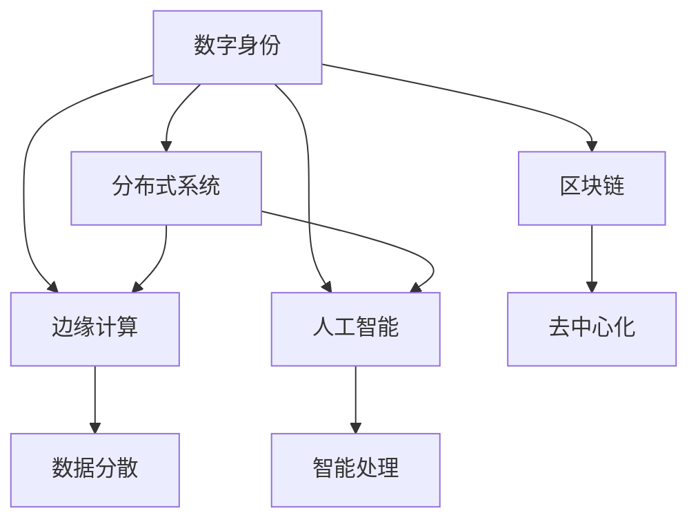

                 

# 数字化身份与全球脑：重塑人类社会关系

> 关键词：数字化身份,全球脑,区块链,数字身份,分布式系统,边缘计算,人工智能,社会治理,人类行为,未来趋势

## 1. 背景介绍

### 1.1 问题由来
随着信息技术的飞速发展，数字化已经渗透到生活的方方面面，数字身份成为人类社会关系中不可或缺的一部分。数字身份不仅仅是一串数字，它是数字时代的身份证，是个人在虚拟空间中的虚拟存在。数字身份的普及和应用，极大地改变了人类的生活方式和社交关系。

### 1.2 问题核心关键点
当前，数字身份的应用主要集中在安全认证、数字支付、社交网络等领域。然而，随着数字身份的广泛使用，其安全性、隐私保护、跨系统互认等问题也日益凸显。特别是分布式系统、边缘计算等新兴技术的发展，为数字身份的设计和实现带来了新的挑战。

### 1.3 问题研究意义
研究数字身份的设计原理和实现技术，对于提升数字社会的基础设施安全性，保障用户隐私，推动数字身份的标准化和互认，具有重要意义。数字身份的应用可以带来更安全、便捷、个性化的互联网体验，同时也是构建数字化社会的基础。

## 2. 核心概念与联系

### 2.1 核心概念概述

为更好地理解数字身份的原理和应用，本节将介绍几个关键概念：

- 数字身份(Digital Identity)：是用户在数字空间中的虚拟身份，通过一定方式存储和展示用户相关信息。常见的形式包括电子证书、数字钱包、社交账号等。
- 分布式系统(Distributed System)：由多台独立计算机组成，通过网络实现数据共享和协同工作。常见的应用包括区块链、云计算、分布式数据库等。
- 边缘计算(Edge Computing)：数据处理和存储不再集中于中心服务器，而是分布在网络边缘的多个节点上，以提升响应速度和处理能力。
- 人工智能(Artificial Intelligence)：使计算机具有智能行为的技术，包括机器学习、深度学习、自然语言处理等。
- 区块链(Blockchain)：一种去中心化的分布式账本技术，具有去中心化、透明、不可篡改等特点，广泛应用于数字货币、供应链管理等领域。

这些核心概念之间的逻辑关系可以通过以下Mermaid流程图来展示：



这个流程图展示了大语言模型的核心概念及其之间的关系：

1. 数字身份通过分布式系统、边缘计算、人工智能和区块链等技术手段实现。
2. 分布式系统实现数据的分散存储和协同处理。
3. 边缘计算将数据处理和存储分布在网络边缘的节点上，提升响应速度和处理能力。
4. 人工智能通过机器学习和深度学习等技术，实现智能决策和行为。
5. 区块链通过去中心化、透明、不可篡改等特性，保障数字身份的安全和隐私。

这些核心概念共同构成了数字身份的实现框架，使其能够在各种场景下发挥重要作用。通过理解这些核心概念，我们可以更好地把握数字身份的工作原理和优化方向。

## 3. 核心算法原理 & 具体操作步骤
### 3.1 算法原理概述

数字身份的设计和实现涉及多个核心算法和技术，主要包括数据加密、身份验证、分布式存储、共识机制等。本节将详细介绍这些核心算法及其应用原理。

### 3.2 算法步骤详解

#### 3.2.1 数据加密算法
数字身份的核心在于保护用户的敏感信息，因此数据加密是数字身份设计的首要任务。常用的数据加密算法包括对称加密、非对称加密和哈希函数。

- 对称加密：使用同一个密钥对数据进行加密和解密。常见的算法有AES、DES等。
- 非对称加密：使用一对公钥和私钥进行加密和解密。常见的算法有RSA、ECC等。
- 哈希函数：将任意长度的消息压缩成固定长度的哈希值，常用于数字签名和数据校验。常见的算法有SHA-256、MD5等。

#### 3.2.2 身份验证算法
身份验证是数字身份实现的关键环节，通过一定方式验证用户身份的真实性。常用的身份验证算法包括Kerberos、OAuth、OpenID Connect等。

- Kerberos：基于对称加密的认证协议，通过票据交换实现用户身份验证。
- OAuth：基于令牌的身份验证机制，允许用户授权第三方应用访问其资源。
- OpenID Connect：基于OAuth 2.0协议的身份验证和认证扩展，支持单点登录和用户信息交换。

#### 3.2.3 分布式存储算法
分布式存储是将数据分散存储在网络中的多个节点上，以提升系统的可靠性和可扩展性。常见的分布式存储算法包括GFS、Hadoop、Ceph等。

- GFS：Google文件系统，用于大规模数据存储和处理。
- Hadoop：分布式计算框架，支持大规模数据存储和分析。
- Ceph：分布式文件系统，支持大规模数据存储和分布式数据中心。

#### 3.2.4 共识机制
共识机制是分布式系统中用于达成共识的协议，保障数据的一致性和安全性。常用的共识机制包括PoS、PoW、DPoS等。

- PoS：基于权益证明的共识机制，通过持有一定数量的代币参与共识。
- PoW：基于工作证明的共识机制，通过挖矿获取新的区块。
- DPoS：基于权益证明的分布式共识算法，通过选定的节点参与共识。

### 3.3 算法优缺点

数字身份的设计和实现涉及多个核心算法和技术，具有以下优点和缺点：

#### 优点
1. 数据加密算法可以保障用户敏感信息的安全性。
2. 身份验证算法可以验证用户身份的真实性。
3. 分布式存储算法可以提升系统的可靠性和可扩展性。
4. 共识机制可以保障数据的一致性和安全性。

#### 缺点
1. 数据加密算法对计算资源和加密强度有较高要求，可能影响系统性能。
2. 身份验证算法需要进行复杂的票据交换或令牌授权，增加了系统复杂性。
3. 分布式存储算法需要搭建复杂的分布式系统，增加了系统维护成本。
4. 共识机制需要消耗大量计算资源，可能影响系统性能。

### 3.4 算法应用领域

数字身份的应用领域非常广泛，涵盖了金融、医疗、教育、政府等多个行业。以下是一些具体的应用场景：

- 金融：数字身份在金融领域可以用于数字支付、身份认证、信用评估等。
- 医疗：数字身份可以用于电子病历、医疗支付、药品追溯等。
- 教育：数字身份可以用于在线教育、认证考试、学生管理等。
- 政府：数字身份可以用于身份验证、社会治理、公共服务等方面。

除了上述这些经典应用外，数字身份还可以应用于数字版权、供应链管理、智能合约等领域，为各行各业带来新的机遇和挑战。

## 4. 数学模型和公式 & 详细讲解 & 举例说明
### 4.1 数学模型构建

本节将使用数学语言对数字身份的设计原理和实现技术进行更加严格的刻画。

假设用户U具有敏感信息I，数字身份设计器D需要设计一个安全的数字身份系统，实现用户身份的存储和验证。数学模型如下：

- 设计者D选择加密算法E，对敏感信息I进行加密，得到密文C。
- 设计者D将密文C存储在数字身份S中。
- 用户U需要验证数字身份S的有效性，使用验证算法V对数字身份S进行验证，判断是否为真实身份。

数学模型如下：

$$
S = E(I)
$$

$$
V(S) = \begin{cases}
\text{True}, & \text{if } E(I) = V(S) \\
\text{False}, & \text{otherwise}
\end{cases}
$$

其中，$E$表示加密算法，$V$表示验证算法。

### 4.2 公式推导过程

以AES加密算法为例，推导数据加密的过程。

假设用户U的敏感信息I为明文，设计者D使用AES算法对I进行加密，得到密文C。AES算法使用同一个密钥K对I进行加密和解密，过程如下：

1. 设计者D将I和K输入到AES加密算法中，得到密文C。
2. 用户U需要将密文C解密，得到明文I。

推导过程如下：

$$
C = AES(I, K)
$$

$$
I = AES^{-1}(C, K)
$$

其中，$AES$表示AES加密算法，$AES^{-1}$表示AES解密算法。

### 4.3 案例分析与讲解

以OAuth身份验证为例，讲解其具体实现过程。

假设用户U希望授权第三方应用A访问其资源。OAuth 2.0协议步骤如下：

1. 用户U使用用户名和密码登录到身份提供者IDP。
2. IDP向用户U发放访问令牌T。
3. 用户U将T提供给应用A。
4. 应用A使用T向IDP验证用户的身份。
5. IDP验证T的有效性，授权应用A访问用户U的资源。

实现过程如下：

1. 用户U登录IDP，输入用户名和密码。
2. IDP验证用户名和密码，发放访问令牌T。
3. 用户U将T提供给应用A，应用A使用T向IDP验证身份。
4. IDP验证T的有效性，授权应用A访问用户U的资源。

## 5. 项目实践：代码实例和详细解释说明
### 5.1 开发环境搭建

在进行数字身份的实践前，我们需要准备好开发环境。以下是使用Python进行加密、验证、分布式存储等组件的开发环境配置流程：

1. 安装Python：从官网下载并安装Python，选择最新版本。
2. 安装必要的Python库：使用pip安装numpy、pandas、pycryptodome等库。
3. 安装分布式存储库：使用pip安装Hadoop、Ceph等分布式存储库。
4. 安装共识机制库：使用pip安装Consensus、PoS、PoW等共识机制库。

完成上述步骤后，即可在Python环境中开始数字身份的实践。

### 5.2 源代码详细实现

这里我们以OAuth身份验证为例，给出使用Python进行OAuth身份验证的代码实现。

```python
from flask import Flask, request, jsonify
from oauthlib.oauth2 import BackendApplicationClient
from requests_oauthlib import OAuth2Session
import hashlib

app = Flask(__name__)

# 客户端ID和机密
client = BackendApplicationClient(client_id='your_client_id', client_secret='your_client_secret')

# 获取令牌
@app.route('/token', methods=['POST'])
def get_token():
    # 获取客户端ID和机密
    client_id = request.json.get('client_id')
    client_secret = request.json.get('client_secret')
    # 使用OAuth2Session创建OAuth2对象
    oauth2 = OAuth2Session(client)
    # 发送请求获取访问令牌
    token = oauth2.fetch_token(token_url='https://idp.com/token', client_id=client_id, client_secret=client_secret)
    return jsonify(token)

# 验证令牌
@app.route('/verify', methods=['POST'])
def verify_token():
    # 获取令牌
    token = request.json.get('token')
    # 使用OAuth2Session创建OAuth2对象
    oauth2 = OAuth2Session(client)
    # 发送请求验证令牌的有效性
    response = oauth2.fetch_token(token_url='https://idp.com/token/verify', token=token)
    return jsonify(response)

if __name__ == '__main__':
    app.run()
```

以上代码实现了OAuth 2.0协议中的令牌获取和令牌验证功能。具体实现步骤如下：

1. 创建Flask应用，定义两个路由：获取令牌和验证令牌。
2. 使用BackendApplicationClient类创建OAuth2客户端。
3. 获取客户端ID和机密。
4. 使用OAuth2Session创建OAuth2对象。
5. 发送请求获取访问令牌。
6. 验证令牌的有效性。

### 5.3 代码解读与分析

让我们再详细解读一下关键代码的实现细节：

- Flask应用：使用Flask框架构建Web服务，接收HTTP请求。
- OAuth2Session类：用于OAuth2协议中的令牌获取和令牌验证。
- BackendApplicationClient类：用于OAuth2协议中的客户端认证。
- 令牌获取过程：获取客户端ID和机密，使用OAuth2Session发送请求获取访问令牌。
- 令牌验证过程：获取令牌，使用OAuth2Session发送请求验证令牌的有效性。

这些代码通过简单而有效的逻辑实现，展示了OAuth 2.0协议的实现原理。开发者可以根据实际需求，进行更复杂的身份验证逻辑设计。

### 5.4 运行结果展示

运行上述代码，可以在浏览器中输入`http://localhost:5000/token`和`http://localhost:5000/verify`，分别获取和验证令牌。如果令牌有效，会返回令牌信息，否则返回错误信息。

## 6. 实际应用场景
### 6.1 金融身份验证

金融领域是数字身份应用的重要领域，数字身份可以用于数字支付、身份认证、信用评估等。以数字支付为例，用户可以使用数字身份进行转账、支付等操作，无需携带实体卡，方便快捷。

### 6.2 医疗电子病历

数字身份在医疗领域可以用于电子病历、医疗支付、药品追溯等。医生可以使用数字身份访问患者的电子病历，提高诊疗效率。患者可以使用数字身份查询自己的病历信息，增强隐私保护。

### 6.3 政府电子证照

政府部门可以使用数字身份进行身份验证、社会治理、公共服务等方面。以电子身份证为例，用户可以使用数字身份进行身份验证，无需携带实体身份证，方便快捷。

### 6.4 未来应用展望

随着数字身份技术的不断发展，数字身份将广泛应用于各个领域，为人类社会带来新的变革。

未来，数字身份将与人工智能、区块链等技术深度融合，实现更智能、安全、便捷的身份管理。例如，结合区块链技术，数字身份可以实现跨系统互认，保障用户隐私。结合人工智能技术，数字身份可以实现更智能的身份验证，提升用户体验。

## 7. 工具和资源推荐
### 7.1 学习资源推荐

为了帮助开发者系统掌握数字身份的设计原理和实现技术，这里推荐一些优质的学习资源：

1. 《数字身份设计与实现》系列博文：由数字身份专家撰写，深入浅出地介绍了数字身份的原理和实现方法。

2. 《OAuth 2.0协议》书籍：介绍OAuth 2.0协议的详细介绍和应用案例。

3. 《区块链技术与应用》书籍：介绍区块链技术的基本原理和应用场景。

4. 《分布式系统设计与实现》书籍：介绍分布式系统架构和设计方法。

5. 《人工智能原理与实践》书籍：介绍人工智能的基本原理和实现方法。

通过对这些资源的学习实践，相信你一定能够快速掌握数字身份的设计和实现技术，并用于解决实际的数字身份问题。

### 7.2 开发工具推荐

高效的开发离不开优秀的工具支持。以下是几款用于数字身份开发的常用工具：

1. Python：Python是一门功能强大的编程语言，易于学习，广泛应用于数字身份的开发。

2. Flask：Python的轻量级Web框架，易于搭建Web服务，适合快速迭代研究。

3. OAuth2Session：用于OAuth2协议中的令牌获取和令牌验证，支持Python和多种语言。

4. Consensus：用于分布式系统中共识机制的实现。

5. PoS：用于分布式系统中基于权益证明的共识机制。

6. PoW：用于分布式系统中基于工作证明的共识机制。

合理利用这些工具，可以显著提升数字身份的开发效率，加快创新迭代的步伐。

### 7.3 相关论文推荐

数字身份的应用领域非常广泛，涉及多个前沿技术。以下是几篇奠基性的相关论文，推荐阅读：

1. "Digital Identity: A Review of Key Issues and Approaches"：概述数字身份的基本概念和设计原理。

2. "OAuth 2.0: The Engine of Modern Application Access"：介绍OAuth 2.0协议的详细介绍和应用案例。

3. "Blockchain Technology: A Review of Consensus Algorithms"：介绍区块链技术的基本原理和共识算法。

4. "Distributed Systems: Concepts and Design"：介绍分布式系统架构和设计方法。

5. "Artificial Intelligence: Foundations of Computational Agents"：介绍人工智能的基本原理和实现方法。

这些论文代表了大语言模型微调技术的发展脉络。通过学习这些前沿成果，可以帮助研究者把握学科前进方向，激发更多的创新灵感。

## 8. 总结：未来发展趋势与挑战

### 8.1 总结

本文对数字身份的设计原理和实现技术进行了全面系统的介绍。首先阐述了数字身份的设计背景和意义，明确了数字身份在金融、医疗、政府等领域的应用价值。其次，从原理到实践，详细讲解了数字身份的核心算法和技术实现，给出了数字身份的代码实例。同时，本文还广泛探讨了数字身份在实际应用中的场景，展示了数字身份的广泛应用前景。

通过本文的系统梳理，可以看到，数字身份的设计和实现涉及多个前沿技术，具有广泛的应用前景。数字身份的应用可以带来更安全、便捷、个性化的互联网体验，同时也是构建数字化社会的基础。未来，伴随数字身份技术的不断发展，数字身份必将在更广阔的应用领域大放异彩，深刻影响人类的生产生活方式。

### 8.2 未来发展趋势

展望未来，数字身份技术将呈现以下几个发展趋势：

1. 分布式系统将进一步普及，数字身份将与分布式系统深度融合，实现更智能、安全、便捷的身份管理。

2. 区块链技术将进一步发展，数字身份将与区块链技术深度融合，实现跨系统互认，保障用户隐私。

3. 人工智能技术将进一步发展，数字身份将与人工智能技术深度融合，实现更智能的身份验证，提升用户体验。

4. 边缘计算将进一步发展，数字身份将与边缘计算深度融合，实现更智能、安全、便捷的身份管理。

5. 隐私保护技术将进一步发展，数字身份将与隐私保护技术深度融合，保障用户隐私安全。

这些发展趋势将进一步提升数字身份的应用价值，为人类社会带来新的变革。

### 8.3 面临的挑战

尽管数字身份技术已经取得了瞩目成就，但在迈向更加智能化、普适化应用的过程中，它仍面临着诸多挑战：

1. 安全性问题：数字身份涉及大量敏感信息，如何保障其安全性是一个重要问题。

2. 隐私保护问题：数字身份需要平衡用户隐私和身份验证之间的关系，确保用户隐私得到充分保护。

3. 跨系统互认问题：不同系统之间的身份互认是一个难题，需要设计统一的标准和协议。

4. 计算资源消耗问题：数字身份涉及大量计算资源，如何降低计算资源消耗是一个重要问题。

5. 可扩展性问题：数字身份需要支持大规模用户，如何设计可扩展的架构是一个重要问题。

6. 标准化问题：数字身份需要设计统一的标准和协议，确保各系统之间的互操作性。

这些挑战需要各方共同努力，才能实现数字身份技术的全面普及和应用。

### 8.4 研究展望

未来，数字身份技术需要在以下几个方面进行深入研究：

1. 设计更加安全和高效的加密算法。

2. 研究更加智能和便捷的身份验证方法。

3. 研究更加智能和可扩展的数字身份系统。

4. 研究更加智能和安全的分布式存储和共识机制。

5. 研究更加智能和安全的隐私保护技术。

6. 研究更加智能和安全的区块链技术。

这些研究方向的探索将引领数字身份技术迈向更高的台阶，为构建数字化社会提供更加坚实的基础。

## 9. 附录：常见问题与解答

**Q1：数字身份的安全性如何保障？**

A: 数字身份的安全性保障主要依赖于加密算法和共识机制。设计者应选择安全可靠的加密算法和共识机制，确保数字身份的安全性。同时，用户应妥善保管自己的数字身份信息，防止泄露。

**Q2：数字身份与传统身份相比，有哪些优势？**

A: 数字身份相比传统身份，具有以下优势：

1. 便捷性：用户只需记住数字身份的凭证，无需携带实体卡。

2. 安全性：数字身份通过加密算法和共识机制保障安全，防止信息泄露。

3. 可扩展性：数字身份可以跨系统互认，支持大规模用户。

**Q3：数字身份在实际应用中，有哪些挑战？**

A: 数字身份在实际应用中，面临以下挑战：

1. 安全性问题：数字身份涉及大量敏感信息，如何保障其安全性是一个重要问题。

2. 隐私保护问题：数字身份需要平衡用户隐私和身份验证之间的关系，确保用户隐私得到充分保护。

3. 跨系统互认问题：不同系统之间的身份互认是一个难题，需要设计统一的标准和协议。

4. 计算资源消耗问题：数字身份涉及大量计算资源，如何降低计算资源消耗是一个重要问题。

5. 可扩展性问题：数字身份需要支持大规模用户，如何设计可扩展的架构是一个重要问题。

6. 标准化问题：数字身份需要设计统一的标准和协议，确保各系统之间的互操作性。

这些挑战需要各方共同努力，才能实现数字身份技术的全面普及和应用。

**Q4：数字身份的应用场景有哪些？**

A: 数字身份的应用场景非常广泛，包括金融、医疗、政府、教育等多个领域。以下是一些具体的应用场景：

1. 金融：数字身份用于数字支付、身份认证、信用评估等。

2. 医疗：数字身份用于电子病历、医疗支付、药品追溯等。

3. 政府：数字身份用于身份验证、社会治理、公共服务等方面。

4. 教育：数字身份用于在线教育、认证考试、学生管理等。

5. 社会治理：数字身份用于身份验证、社会治理、公共服务等方面。

6. 数字版权：数字身份用于数字版权保护、版权登记等。

7. 供应链管理：数字身份用于供应链管理、溯源等。

8. 智能合约：数字身份用于智能合约、身份验证等。

这些应用场景展示了数字身份的广泛应用前景，将深刻影响人类的生产生活方式。

**Q5：数字身份的未来发展趋势有哪些？**

A: 数字身份的未来发展趋势主要包括：

1. 分布式系统将进一步普及，数字身份将与分布式系统深度融合，实现更智能、安全、便捷的身份管理。

2. 区块链技术将进一步发展，数字身份将与区块链技术深度融合，实现跨系统互认，保障用户隐私。

3. 人工智能技术将进一步发展，数字身份将与人工智能技术深度融合，实现更智能的身份验证，提升用户体验。

4. 边缘计算将进一步发展，数字身份将与边缘计算深度融合，实现更智能、安全、便捷的身份管理。

5. 隐私保护技术将进一步发展，数字身份将与隐私保护技术深度融合，保障用户隐私安全。

这些发展趋势将进一步提升数字身份的应用价值，为人类社会带来新的变革。

---

作者：禅与计算机程序设计艺术 / Zen and the Art of Computer Programming

