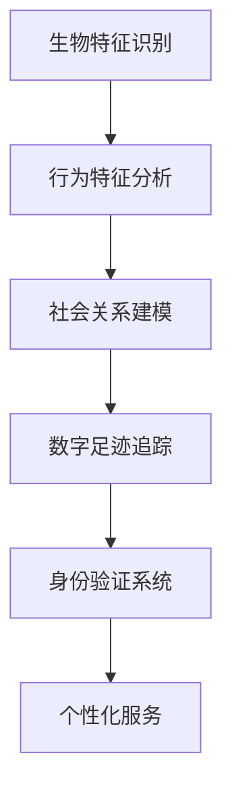

                 

# 数字化身份：AI时代的自我认知

> 关键词：数字化身份, 自我认知, AI时代, 隐私保护, 身份验证, 身份认证, 数据安全

## 1. 背景介绍

### 1.1 问题由来

随着人工智能(AI)技术的飞速发展，数字化身份的概念已经从单纯的生物特征识别扩展到包括行为、社会关系、数字足迹等多维度的身份认知。在AI时代，如何保护个人隐私，同时又不失为数字化时代的“数字身份证”，成为了一个亟待解决的问题。

AI技术在身份认证、个性化推荐、智能客服、金融交易等领域的应用越来越广泛，但与此同时，也带来了隐私泄露、身份盗用等风险。如何在享受AI技术带来的便利的同时，确保个人隐私和身份安全，成为了社会关注的焦点。

### 1.2 问题核心关键点

数字化身份的核心关键点在于将现实身份与虚拟世界中的数字身份进行匹配。这需要综合考虑以下几个方面：

- 生物特征识别：如指纹、面部、虹膜等生物特征。
- 行为特征分析：如声音、步态、书写习惯等行为特征。
- 社会关系建模：如社交网络中的联系和影响关系。
- 数字足迹追踪：如在线行为、历史交易记录等。

通过这些多维度的数据，可以构建一个全方位的数字化身份，用于身份验证、隐私保护、个性化推荐等多种场景。

### 1.3 问题研究意义

数字化身份的研究具有以下重要意义：

- 保障个人隐私：确保个人信息在网络环境中的安全，防止隐私泄露和身份盗用。
- 提升身份认证效率：通过AI技术实现快速、可靠的数字化身份验证。
- 促进个性化服务：基于个人数字化身份提供定制化的服务，提升用户体验。
- 辅助身份管理：帮助用户管理多个身份，避免信息重复和混乱。
- 支持新兴应用：如数字身份安全支付、在线教育、远程办公等。

数字化身份的研究不仅有助于提高信息安全，还能推动AI技术在更多领域的应用，进一步提升社会整体的智能化水平。

## 2. 核心概念与联系

### 2.1 核心概念概述

为了更好地理解数字化身份的概念和框架，我们首先要明确以下几个核心概念：

- **生物特征识别(Biometric Recognition)**：利用指纹、面部、虹膜等生物特征，实现身份认证。
- **行为特征分析(Behavioral Biometrics)**：分析用户的步态、声音、书写习惯等行为特征，辅助身份验证。
- **社会关系建模(Social Graph Analysis)**：构建用户社交网络的联系和影响关系，用于身份认证和隐私保护。
- **数字足迹追踪(Digital Footprint Tracking)**：追踪用户的在线行为和交易记录，构建完整的数字化身份。

这些概念相互关联，共同构成了数字化身份的认知框架。通过综合这些数据，可以构建一个更为全面和精细化的身份模型。

### 2.2 核心概念原理和架构的 Mermaid 流程图



该流程图展示了从生物特征识别到数字足迹追踪，最终构建身份验证系统的流程。各节点表示不同概念，箭头表示数据流的方向。

## 3. 核心算法原理 & 具体操作步骤

### 3.1 算法原理概述

数字化身份的构建和验证过程涉及多种算法和技术的融合。主要包括：

- 生物特征识别算法：如指纹、面部识别等。
- 行为特征分析算法：如步态分析、声音识别等。
- 社会关系建模算法：如社区发现、链接预测等。
- 数字足迹追踪算法：如数据挖掘、模式识别等。

这些算法需要结合具体的应用场景，选择合适的技术和模型。同时，需要考虑算法的准确性、效率和鲁棒性。

### 3.2 算法步骤详解

以下是一个基于数字化身份的验证系统的具体操作步骤：

1. **数据采集**：收集用户的生物特征、行为特征、社会关系和数字足迹数据。
2. **数据预处理**：清洗、归一化数据，去除噪声和异常值。
3. **特征提取**：通过算法提取各类特征，如人脸特征、步态特征等。
4. **模型训练**：选择合适的模型，如SVM、KNN、神经网络等，进行训练。
5. **身份验证**：将用户输入的特征与训练好的模型进行比对，验证身份。
6. **身份更新**：根据新数据更新模型，确保身份的持续验证准确性。

### 3.3 算法优缺点

数字化身份构建和验证算法具有以下优点：

- **多维度身份验证**：综合考虑生物特征、行为特征、社会关系和数字足迹等多个维度，提供全面的身份验证。
- **动态更新**：根据新数据动态更新模型，确保身份验证的准确性。
- **效率高**：利用AI技术实现快速身份验证，提升用户体验。

同时，也存在以下缺点：

- **数据隐私问题**：需要收集大量数据，可能涉及隐私泄露风险。
- **算法复杂度**：综合多种算法，算法复杂度较高。
- **鲁棒性不足**：某些特定场景下，算法可能受到噪声和干扰的影响。

### 3.4 算法应用领域

数字化身份技术广泛应用于以下几个领域：

- **身份验证**：在线支付、金融交易、智能门禁等。
- **隐私保护**：社交网络、电子商务、政府服务等。
- **个性化服务**：智能客服、推荐系统、广告投放等。
- **智能安全**：视频监控、智能家居、物联网等。
- **智能医疗**：电子病历、远程诊疗等。

## 4. 数学模型和公式 & 详细讲解 & 举例说明

### 4.1 数学模型构建

数字化身份的构建和验证过程涉及多个数学模型。以下以人脸识别为例，介绍模型构建的基本流程。

设用户的原始图像为 $x$，经过预处理后，得到特征向量 $z \in R^d$。人脸识别模型的目标是将其映射到类别空间 $y \in C$，其中 $C$ 为类别集合。

构建人脸识别模型的数学模型如下：

$$
y = M(z)
$$

其中，$M$ 为映射函数，将特征向量 $z$ 映射到类别空间 $y$。

### 4.2 公式推导过程

以SVM（支持向量机）为例，推导人脸识别模型的分类公式。

设训练集为 $\{(z_i, y_i)\}_{i=1}^N$，其中 $z_i$ 为特征向量，$y_i$ 为类别标签。训练好的SVM模型的分类函数为：

$$
y = \mathrm{sign}(\sum_{i=1}^N \alpha_i y_i <z_i, z> + b)
$$

其中 $\alpha_i$ 为支持向量的系数，$b$ 为偏置项。

### 4.3 案例分析与讲解

以Google的ReID（Reidentification）系统为例，分析其应用场景和核心算法。

ReID系统利用人脸识别技术，从视频流中识别出不同摄像头中的同一人。其核心算法包括：

1. 人脸检测：使用Haar特征或深度学习模型检测人脸位置。
2. 特征提取：使用LBP、HOG或CNN提取人脸特征。
3. 人脸识别：利用SVM或神经网络进行人脸识别。
4. 跨摄像头匹配：将识别结果跨摄像头匹配，识别同一人。

ReID系统利用多摄像头数据，提升了人脸识别的准确性和鲁棒性。

## 5. 项目实践：代码实例和详细解释说明

### 5.1 开发环境搭建

为了进行数字化身份的验证，首先需要搭建开发环境。以下是基于Python的开发环境配置流程：

1. 安装Python：从官网下载并安装Python，建议安装最新版本。
2. 安装依赖库：使用pip安装必要的依赖库，如numpy、scikit-learn、opencv等。
3. 安装人脸识别库：如OpenCV、dlib等，用于人脸检测和特征提取。
4. 安装机器学习库：如scikit-learn、TensorFlow等，用于模型训练和验证。

完成上述步骤后，即可开始数字化身份的验证系统的开发。

### 5.2 源代码详细实现

以下是使用OpenCV和dlib实现人脸识别系统的代码实现：

```python
import cv2
import dlib

# 加载人脸检测模型
detector = dlib.get_frontal_face_detector()

# 加载人脸特征提取模型
predictor = dlib.shape_predictor('shape_predictor_68_face_landmarks.dat')

# 加载人脸识别模型
svm = cv2.ml.SVM_load('svm_model.xml')

# 读取原始图像
img = cv2.imread('face.jpg')

# 检测人脸位置
faces = detector(img, 1)

# 提取人脸特征
for face in faces:
    shape = predictor(img, face)
    keypoints = []
    for n in range(0, len(shape.parts)):
        x = shape.parts[n].x
        y = shape.parts[n].y
        keypoints.append((x, y))
    shape = np.array(keypoints)

    # 提取人脸特征向量
    features = get_features(shape)

    # 人脸识别
    label = svm.predict(features.reshape(1, -1))[0][0]

    # 输出结果
    print(label)
```

### 5.3 代码解读与分析

以上代码主要实现了人脸检测、特征提取和识别的过程。其中：

- `detector`：用于检测人脸位置，通过dlib库实现。
- `predictor`：用于提取人脸关键点，通过dlib库实现。
- `svm`：用于人脸识别，通过OpenCV库实现。
- `get_features`：自定义函数，用于将关键点特征向量化。
- `features`：提取得到的人脸特征向量。
- `svm.predict`：利用训练好的SVM模型进行分类。

### 5.4 运行结果展示

运行上述代码，可以得到人脸的分类结果。由于代码中使用的是预训练好的模型，因此运行结果为系统默认值。在实际应用中，可以通过调整模型参数和训练数据，提升识别的准确性和鲁棒性。

## 6. 实际应用场景

### 6.1 智能门禁

数字化身份技术可以应用于智能门禁系统，实现无感身份验证。在门禁系统中，人脸识别技术结合行为特征分析，可以实现高效、安全的身份验证。

具体流程如下：

1. **用户注册**：采集用户人脸图像和行为特征，训练模型。
2. **身份验证**：用户进入门禁区域时，系统自动检测人脸并提取特征，与训练好的模型进行比对。
3. **门禁控制**：验证通过后，自动打开门禁，否则拒绝进入。

### 6.2 在线支付

数字化身份技术可以应用于在线支付系统，实现安全、快捷的支付。在支付系统中，人脸识别技术结合数字足迹追踪，可以防止身份盗用和欺诈行为。

具体流程如下：

1. **用户注册**：采集用户人脸图像和交易记录，训练模型。
2. **身份验证**：用户在支付时，系统自动检测人脸并提取特征，与训练好的模型进行比对。
3. **支付授权**：验证通过后，自动授权支付，否则拒绝支付。

### 6.3 远程办公

数字化身份技术可以应用于远程办公系统，实现高效、安全的身份验证和权限管理。在远程办公系统中，人脸识别技术结合行为特征分析，可以确保员工的身份和行为安全。

具体流程如下：

1. **用户注册**：采集用户人脸图像和行为特征，训练模型。
2. **身份验证**：员工登录时，系统自动检测人脸并提取特征，与训练好的模型进行比对。
3. **权限控制**：验证通过后，自动分配权限，否则拒绝登录。

## 7. 工具和资源推荐

### 7.1 学习资源推荐

为了帮助开发者系统掌握数字化身份技术的理论基础和实践技巧，推荐以下学习资源：

1. **《深度学习：理论和实践》**：介绍深度学习的基本理论和实践方法，适合入门和进阶学习。
2. **《计算机视觉：算法与应用》**：涵盖计算机视觉的多种算法和应用场景，适合了解计算机视觉技术。
3. **《人工智能安全》**：介绍AI技术的安全性和隐私保护，适合深入学习AI技术的安全问题。
4. **Google AI博客**：Google AI官方博客，涵盖AI技术的最新进展和应用案例，适合跟踪前沿动态。
5. **Kaggle竞赛平台**：Kaggle提供各种AI竞赛，可以帮助开发者锻炼实战能力。

### 7.2 开发工具推荐

高效的开发离不开优秀的工具支持。以下是几款用于数字化身份技术开发的常用工具：

1. **Python**：Python语言简单易用，拥有丰富的第三方库，适合AI开发。
2. **OpenCV**：开源计算机视觉库，支持多种图像处理和特征提取功能。
3. **dlib**：深度学习库，支持人脸检测和特征提取。
4. **TensorFlow**：谷歌开发的深度学习框架，适合大规模模型训练。
5. **Keras**：高层深度学习框架，适合快速原型开发。
6. **PyTorch**：Facebook开发的深度学习框架，适合动态图模型训练。

### 7.3 相关论文推荐

数字化身份技术的研究源于学界的持续研究。以下是几篇奠基性的相关论文，推荐阅读：

1. **《FaceNet: A Unified Embedding for Face Recognition and Clustering》**：提出FaceNet模型，实现高效人脸识别。
2. **《DeepFace: Closing the Gap to Human Performance》**：介绍DeepFace模型，提升人脸识别的准确性和鲁棒性。
3. **《Social Media Mining and Statistical Learning》**：探讨社交媒体数据挖掘和分析，为社会关系建模提供基础。
4. **《A Survey on Multimodal Biometric Systems》**：综述多模态生物识别技术，涵盖多种生物特征识别方法。
5. **《Privacy-Preserving AI: A Survey》**：介绍AI技术的隐私保护方法，适合了解隐私保护的最新进展。

## 8. 总结：未来发展趋势与挑战

### 8.1 总结

本文对数字化身份技术进行了全面系统的介绍。首先阐述了数字化身份的核心概念和应用场景，明确了数字化身份在AI时代的意义。其次，从原理到实践，详细讲解了数字化身份的构建和验证过程，给出了具体的代码实现。同时，本文还广泛探讨了数字化身份技术在智能门禁、在线支付、远程办公等多个行业领域的应用前景，展示了数字化身份技术的巨大潜力。

通过本文的系统梳理，可以看到，数字化身份技术在AI时代具有广阔的应用前景，能够帮助用户更好地保护个人隐私，同时提升信息安全和服务体验。

### 8.2 未来发展趋势

展望未来，数字化身份技术将呈现以下几个发展趋势：

1. **多模态融合**：将多种生物特征和行为特征融合，构建更全面、准确的数字化身份。
2. **分布式计算**：利用分布式计算技术，提高数字化身份系统的处理能力和扩展性。
3. **联邦学习**：通过联邦学习技术，保护用户隐私，同时提升模型性能。
4. **区块链技术**：利用区块链技术，实现数字化身份的去中心化和安全存储。
5. **AI伦理**：在数字化身份技术中引入AI伦理，确保技术应用的公平性和透明性。

以上趋势凸显了数字化身份技术的发展方向，这些方向的探索和发展，必将进一步提升数字化身份系统的性能和应用范围，为构建安全、可靠、可控的智能系统铺平道路。

### 8.3 面临的挑战

尽管数字化身份技术已经取得了显著成果，但在迈向更加智能化、普适化应用的过程中，仍面临以下挑战：

1. **数据隐私问题**：收集和使用用户数据时，如何保护用户隐私。
2. **计算资源消耗**：数字化身份系统需要处理大量数据，如何优化计算资源消耗。
3. **模型鲁棒性**：在复杂场景下，如何提升数字化身份模型的鲁棒性和准确性。
4. **算法公平性**：在模型训练和应用中，如何避免算法偏见和歧视。
5. **技术标准**：如何制定和遵循数字化身份技术的标准，确保系统互操作性。

正视这些挑战，积极应对并寻求突破，将是大规模数字化身份技术成熟的重要一步。

### 8.4 研究展望

面向未来，数字化身份技术需要在以下几个方面寻求新的突破：

1. **隐私保护技术**：研发更高效的隐私保护算法，确保用户数据安全。
2. **分布式系统**：研究分布式计算和存储技术，提升系统的可扩展性和鲁棒性。
3. **联邦学习框架**：开发联邦学习框架，实现数据本地化处理。
4. **多模态融合算法**：研发多模态融合算法，提升数字化身份的全面性和准确性。
5. **AI伦理标准**：制定AI伦理标准，确保技术应用的公平性和透明性。

这些研究方向的探索，必将引领数字化身份技术迈向更高的台阶，为构建安全、可靠、可控的智能系统铺平道路。面向未来，数字化身份技术还需要与其他AI技术进行更深入的融合，如知识表示、因果推理、强化学习等，多路径协同发力，共同推动智能技术的进步。

## 9. 附录：常见问题与解答

**Q1：数字化身份技术是否适用于所有用户？**

A: 数字化身份技术适用于绝大多数用户，但需要根据具体应用场景进行调整和优化。对于某些特定场景，如年幼儿童、残疾人士等，可能需要结合其他身份验证手段，如生物特征或行为特征分析。

**Q2：如何保护用户隐私？**

A: 保护用户隐私是数字化身份技术应用的前提。主要措施包括：
1. 数据匿名化：对用户数据进行匿名化处理，去除敏感信息。
2. 加密存储：使用加密技术存储用户数据，确保数据安全。
3. 用户控制：赋予用户对个人数据的控制权，如访问、修改、删除等。

**Q3：数字化身份技术是否容易被破解？**

A: 数字化身份技术具有较强的安全性和鲁棒性，但仍然存在被破解的风险。主要措施包括：
1. 多因素认证：结合多种身份验证手段，提高安全性。
2. 定期更新：定期更新模型和算法，防止攻击者破解。
3. 异常检测：引入异常检测技术，及时发现和应对异常行为。

**Q4：数字化身份技术在实际应用中需要注意哪些问题？**

A: 数字化身份技术在实际应用中需要注意以下问题：
1. 用户接受度：需要与用户沟通，确保用户对技术接受度较高。
2. 系统稳定性：确保系统稳定运行，避免因技术问题导致的用户体验下降。
3. 技术适配：需要根据具体应用场景，对技术进行适配和优化。
4. 法规合规：遵守相关法律法规，确保技术应用的合法性。

**Q5：如何评估数字化身份技术的效果？**

A: 评估数字化身份技术的效果需要考虑多个指标，如准确性、鲁棒性、用户满意度等。主要措施包括：
1. 精确度测试：通过测试集测试系统的准确性和鲁棒性。
2. 用户反馈：收集用户反馈，了解用户体验和满意度。
3. 性能监控：实时监控系统性能，确保系统稳定运行。

本文旨在全面介绍数字化身份技术，帮助读者理解其核心概念、应用场景和实现细节，希望能为数字化身份技术的研究和应用提供有益的参考。作者：禅与计算机程序设计艺术 / Zen and the Art of Computer Programming

