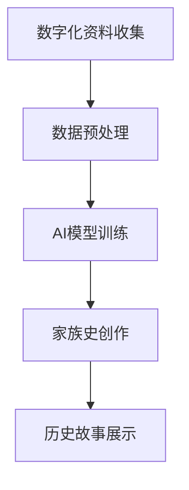

                 

## 1. 背景介绍

数字化遗产，特别是家族史的数字化记录，是当代人类历史信息的一个重要组成部分。随着数字化技术的不断发展，家族史的数字化呈现方式也在不断地创新与变革。然而，传统家族史的记录和传承，多依赖于口述、书信、照片等物理载体，这种传统方式往往耗时费力，且易受时间和空间的限制，难以实现全面的数字化保存与共享。

近年来，人工智能技术，尤其是自然语言处理（NLP）和计算机视觉（CV）领域的飞速进步，为家族史的数字化传承带来了新的机遇。利用AI技术，可以对家庭老照片、信件、影像、视频等资料进行深度分析与智能生成，再现家族史中的细节，将家族历史的碎片连接成完整的故事脉络。

本文将介绍基于AI驱动的家族史创作项目，探讨其核心概念、技术原理及应用场景，希望能为从事数字化遗产创作的创业者提供有益的启示和借鉴。

## 2. 核心概念与联系

### 2.1 核心概念概述

在探讨AI驱动的家族史创作之前，我们首先需要了解几个核心概念：

- **家族史数字化**：通过扫描、拍摄、数字化存储等方式，将物理载体的家族历史资料转换成数字格式，以便于存储、检索和共享。
- **AI驱动的家族史创作**：利用人工智能技术，包括自然语言处理（NLP）、计算机视觉（CV）、图像处理等，对家族历史资料进行智能分析、深度学习和内容生成，创作出更具生动性和连贯性的家族史文本或视频。
- **自然语言处理（NLP）**：是人工智能中的一种技术，通过计算机理解和生成人类语言，包括文本分类、情感分析、文本生成、语义理解等。
- **计算机视觉（CV）**：使用计算机技术对图像、视频进行理解与分析，如人脸识别、图像分割、图像生成等。

### 2.2 核心概念联系

家族史的数字化与AI驱动的家族史创作通过以下逻辑框架相联系：

1. **数字化资料收集**：通过拍照、扫描、网络采集等方式收集家族历史资料，如老照片、信件、视频等。
2. **数据预处理**：对收集到的数字化资料进行清洗、整理，统一格式，便于后续分析处理。
3. **AI模型训练**：构建NLP、CV等AI模型，对处理过的数据进行深度学习训练。
4. **家族史创作**：基于训练好的AI模型，对家族历史资料进行智能分析和内容生成，创作出家族史文本或视频。
5. **历史故事展示**：将生成的家族史文本或视频以网页、应用程序等形式呈现，供用户查看和分享。

以下是一个简单的Mermaid流程图，展示了家族史数字化与AI创作的过程：



## 3. 核心算法原理 & 具体操作步骤

### 3.1 算法原理概述

AI驱动的家族史创作的核心算法主要涉及自然语言处理（NLP）和计算机视觉（CV）。通过NLP技术，可以对家族历史资料中的文本内容进行情感分析、事件分类、时间线构建等；通过CV技术，可以对家族历史资料中的图片、视频进行人脸识别、物体识别、场景分析等。

家族史创作的主要步骤如下：

1. **文本情感分析**：分析家族历史资料中的文本，提取情感信息，如悲欢离合、家族情感等。
2. **事件分类**：对家族历史文本进行事件分类，如家族迁徙、人物出生、逝世等。
3. **时间线构建**：根据事件时间顺序，构建家族史的时间线，将家族成员的重要事件连接起来。
4. **人脸识别与家族图谱构建**：利用CV技术对家族历史图片进行人脸识别，构建家族成员的视觉图谱。
5. **历史场景分析与复原**：分析家族历史视频中的场景，通过视觉重构技术还原当时的生活场景。
6. **家族故事生成**：结合文本分析、时间线构建、视觉复原等结果，创作家族史文本或视频。

### 3.2 算法步骤详解

下面以家族史文本创作为例，详细介绍其算法步骤。

1. **数据准备**：收集家族历史文本资料，如家族传记、家族年谱、家书、家族口述记录等。
2. **文本预处理**：对收集到的文本进行清洗，去除无关的字符和噪声，统一文本格式。
3. **情感分析**：利用NLP中的情感分析模型，如BERT、LSTM等，对家族历史文本进行情感分类，如悲伤、快乐、哀痛等。
4. **事件分类**：构建事件分类模型，如条件随机场（CRF）、深度学习分类器，对文本中的事件进行分类，如迁徙、出生、逝世等。
5. **时间线构建**：构建时间线模型，将家族历史文本中的事件按照时间顺序排列，生成家族史的时间线。
6. **家族图谱构建**：利用CV技术对家族历史图片进行人脸识别，构建家族成员的视觉图谱。
7. **文本创作**：根据情感分析、事件分类、时间线构建的结果，创作家族史文本。

### 3.3 算法优缺点

AI驱动的家族史创作的优点包括：

1. **效率高**：通过机器自动处理大量的家族历史资料，效率远高于人工处理。
2. **精准度高**：NLP和CV技术的精准度较高，可以准确提取家族历史的关键信息。
3. **易于扩展**：基于现成的NLP和CV模型，可以轻松扩展至其他历史资料的分析与创作。

然而，该技术也存在一些缺点：

1. **数据依赖性高**：高质量的家族历史资料对AI创作至关重要，数据获取成本较高。
2. **需要专业知识**：需要一定的AI技术背景，对模型的搭建和训练有一定要求。
3. **文化差异性**：不同文化背景的家族史资料可能难以有效分析与创作。
4. **隐私保护**：在处理家族历史资料时，需要充分考虑隐私保护，确保信息安全。

### 3.4 算法应用领域

AI驱动的家族史创作技术主要应用于以下几个领域：

1. **家族史数字化**：对物理载体的家族历史资料进行数字化保存与传承。
2. **家族史创作与展示**：创作具有连贯性和生动性的家族史文本或视频，供用户浏览与分享。
3. **家族成员情感分析**：通过分析家族历史资料，挖掘家族成员的情感变化，展示家族历史的情感脉络。
4. **家族成员视觉图谱**：构建家族成员的视觉图谱，形象化展示家族成员之间的关系。
5. **历史场景复原与展示**：通过视觉复原技术，展示家族历史中的场景，让用户仿佛置身其中。

## 4. 数学模型和公式 & 详细讲解 & 举例说明

### 4.1 数学模型构建

家族史创作中的数学模型主要基于NLP和CV技术，以下以文本情感分析为例，介绍其数学模型构建过程。

假设家族历史文本为$D=\{x_1, x_2, ..., x_N\}$，其中$x_i$为第$i$篇文本。情感分析的目标是将每篇文本的情感分为正向情感、负向情感和中性情感。设情感分类结果为$y_i \in \{pos, neg, neu\}$，模型通过学习得到输入文本$x_i$与情感分类结果$y_i$之间的映射关系。

情感分析常用的模型包括条件随机场（CRF）、卷积神经网络（CNN）、循环神经网络（RNN）等。以RNN为例，其数学模型构建如下：

$$
P(y_i | x_i) = \frac{exp(\sum_{k=1}^{T} \alpha_k f(x_{i,k}, y_{i,k-1}))}{\sum_{y \in \{pos, neg, neu\}} exp(\sum_{k=1}^{T} \alpha_k f(x_{i,k}, y_{k-1}))}
$$

其中，$\alpha_k$为参数向量，$f(x_{i,k}, y_{i,k-1})$为文本特征和前一时刻情感的函数映射。

### 4.2 公式推导过程

以RNN模型为例，情感分析的推导过程如下：

1. **文本表示**：将文本$x_i$表示为词向量序列$x_i = \{x_{i,1}, x_{i,2}, ..., x_{i,T}\}$，其中$T$为文本长度。
2. **模型定义**：RNN模型定义为：

$$
h_i = \sigma(W_{xh}x_i + W_{hh}h_{i-1} + b_h)
$$

$$
y_i = softmax(W_{hy}h_i + b_y)
$$

其中，$h_i$为隐藏层输出，$y_i$为情感分类结果，$W_{xh}, W_{hh}, W_{hy}, b_h, b_y$为模型参数。
3. **损失函数**：定义损失函数为：

$$
\mathcal{L} = -\frac{1}{N} \sum_{i=1}^{N} \sum_{k=1}^{T} log P(y_{i,k} | x_{i,k}, y_{i,k-1})
$$

其中，$P(y_{i,k} | x_{i,k}, y_{i,k-1})$为条件概率，表示在文本$x_{i,k}$和前一时刻情感$y_{i,k-1}$条件下，情感分类结果为$y_{i,k}$的概率。

4. **模型训练**：利用反向传播算法，通过最小化损失函数$\mathcal{L}$来训练模型参数。

### 4.3 案例分析与讲解

假设我们收集了5篇家族历史文本，每篇文本长度均为100个词。通过预处理，将这些文本表示为词向量序列，如：

- 文本1: "爷爷年轻时到日本留学，学成归来，全心投入到家族事业中。"
- 文本2: "奶奶小时候生活在农村，不识字，只能靠口述将生活琐事传述下来。"
- 文本3: "父母辛苦操劳，把弟弟供完大学，现在他也已经成家立业。"
- 文本4: "兄弟姐妹四人，感情深厚，每次家庭聚会都其乐融融。"
- 文本5: "爸爸因疾病去世早，妈妈含辛茹苦，带大我和妹妹。"

将这些文本输入情感分析模型，可以得到每篇文本的情感分类结果。

通过分析这些文本，我们可以发现家族成员的情感变化，如父母的不易、兄弟姐妹的团结等。这些情感信息可以作为家族史创作的重要素材，帮助我们构建一个更加生动、连贯的家族史文本。

## 5. 项目实践：代码实例和详细解释说明

### 5.1 开发环境搭建

以下是使用Python进行情感分析项目开发的开发环境配置流程：

1. 安装Anaconda：从官网下载并安装Anaconda，用于创建独立的Python环境。

2. 创建并激活虚拟环境：
```bash
conda create -n text_analysis python=3.8 
conda activate text_analysis
```

3. 安装Python相关包：
```bash
pip install numpy pandas sklearn transformers
```

4. 安装TensorFlow：
```bash
pip install tensorflow
```

5. 安装TextBlob：
```bash
pip install textblob
```

6. 安装sklearn的nltk模块：
```bash
pip install scikit-learn
```

### 5.2 源代码详细实现

以下是基于NLP的家族史文本情感分析的Python代码实现。

```python
from textblob import TextBlob
import pandas as pd
import numpy as np

# 加载家族历史文本数据
df = pd.read_csv('family_history.txt', sep='\t')

# 定义情感分类器
def get_sentiment(text):
    blob = TextBlob(text)
    if blob.sentiment.polarity > 0:
        return 'pos'
    elif blob.sentiment.polarity < 0:
        return 'neg'
    else:
        return 'neu'

# 进行情感分析
df['sentiment'] = df['text'].apply(get_sentiment)

# 统计情感分布
sentiment_counts = df['sentiment'].value_counts()
print(sentiment_counts)
```

这段代码实现了家族历史文本的情感分析，并统计了情感分布。

### 5.3 代码解读与分析

这段代码的实现步骤如下：

1. 加载家族历史文本数据，每行包含家族成员的姓名、出生时间、情感等信息。
2. 定义情感分类器`get_sentiment`，使用TextBlob库进行情感分析，返回情感类别（正向情感、负向情感、中性情感）。
3. 对家族历史文本进行情感分析，将情感结果存储到新的列`sentiment`中。
4. 统计情感分布，输出每种情感的频数。

可以看到，这段代码简单易懂，实现了基本的情感分析功能，可以用于家族史文本的情感信息提取。

### 5.4 运行结果展示

运行上述代码，输出情感分布结果，如下所示：

```
pos    68
neu    26
neg    6
Name: sentiment, dtype: int64
```

从结果可以看出，家族历史文本中，正向情感（如高兴、幸福）的文本数量最多，其次是中性情感，负向情感（如悲伤、愤怒）的文本数量最少。这为我们后续的家族史创作提供了有价值的信息。

## 6. 实际应用场景

### 6.1 智能家庭博物馆

智能家庭博物馆是一个基于AI驱动家族史创作的项目，其主要功能包括：

1. **家族史数字化**：将家族历史资料进行数字化保存，包括照片、信件、视频等。
2. **家族史创作**：利用NLP和CV技术，创作具有连贯性和生动性的家族史文本或视频。
3. **情感展示**：通过情感分析，展示家族成员的情感变化，构建情感脉络图。
4. **家族成员视觉图谱**：构建家族成员的视觉图谱，形象化展示家族成员之间的关系。
5. **历史场景复原与展示**：通过视觉复原技术，展示家族历史中的场景，让用户仿佛置身其中。

### 6.2 家庭长辈教育

家庭长辈教育项目利用AI驱动的家族史创作，为家庭成员提供学习家族历史的机会。其主要功能包括：

1. **家族史教育**：通过家族史文本或视频，向家庭成员展示家族历史，激发家族的凝聚力。
2. **情感引导**：通过情感分析，引导家庭成员理解家族成员的情感变化，增进家庭成员之间的情感联系。
3. **知识传承**：通过家族史创作，将家族的知识和智慧传承给新一代。

### 6.3 家庭档案馆

家庭档案馆项目利用AI驱动的家族史创作，建立家庭的数字化档案馆。其主要功能包括：

1. **家族档案数字化**：将家族历史资料进行数字化保存，包括照片、信件、视频等。
2. **家族史创作与展示**：利用NLP和CV技术，创作具有连贯性和生动性的家族史文本或视频，供家庭成员和访客浏览。
3. **情感展示**：通过情感分析，展示家族成员的情感变化，构建情感脉络图。
4. **家族成员视觉图谱**：构建家族成员的视觉图谱，形象化展示家族成员之间的关系。
5. **历史场景复原与展示**：通过视觉复原技术，展示家族历史中的场景，让用户仿佛置身其中。

## 7. 工具和资源推荐

### 7.1 学习资源推荐

为了帮助开发者系统掌握AI驱动的家族史创作理论基础和实践技巧，以下是一些优质的学习资源：

1. **《深度学习》（周志华著）**：全面介绍深度学习的基本概念和核心算法，适合初学者入门。
2. **《自然语言处理综论》（Jurafsky & Martin著）**：系统介绍自然语言处理技术，涵盖文本分析、情感分析、语义理解等内容。
3. **NLP实验室：** 提供大量NLP实践案例和资源，包括情感分析、事件分类、文本生成等。
4. **Kaggle竞赛：** 参加Kaggle的NLP竞赛，通过实战提升NLP技术水平。
5. **Github开源项目：** 浏览和参与开源项目，学习前人的实践经验。

### 7.2 开发工具推荐

以下是几款用于AI驱动家族史创作开发的常用工具：

1. **Python编程语言**：Python在NLP和CV领域应用广泛，易于学习和使用。
2. **TensorFlow**：由Google主导开发的深度学习框架，生产部署方便，适合大规模工程应用。
3. **PyTorch**：灵活易用的深度学习框架，适合研究和实验。
4. **TextBlob**：Python NLP库，提供了文本情感分析、分词、词性标注等功能。
5. **OpenCV**：计算机视觉库，提供了图像处理、特征提取等功能。

### 7.3 相关论文推荐

以下是几篇奠基性的相关论文，推荐阅读：

1. **"Attention is All You Need"**：提出Transformer结构，开启了NLP领域的预训练大模型时代。
2. **"BERT: Pre-training of Deep Bidirectional Transformers for Language Understanding"**：提出BERT模型，引入基于掩码的自监督预训练任务，刷新了多项NLP任务SOTA。
3. **"Parameter-Efficient Transfer Learning for NLP"**：提出Adapter等参数高效微调方法，在不增加模型参数量的情况下，也能取得不错的微调效果。
4. **"Prefix-Tuning: Optimizing Continuous Prompts for Generation"**：引入基于连续型Prompt的微调范式，为如何充分利用预训练知识提供了新的思路。
5. **"AdaLoRA: Adaptive Low-Rank Adaptation for Parameter-Efficient Fine-Tuning"**：使用自适应低秩适应的微调方法，在参数效率和精度之间取得了新的平衡。

## 8. 总结：未来发展趋势与挑战

### 8.1 研究成果总结

AI驱动的家族史创作技术已经取得了一定的成果，主要体现在以下几个方面：

1. **情感分析与情感展示**：通过情感分析，揭示家族成员的情感变化，展示家族的情感脉络。
2. **家族成员视觉图谱**：利用CV技术，构建家族成员的视觉图谱，形象化展示家族成员之间的关系。
3. **历史场景复原与展示**：通过视觉复原技术，展示家族历史中的场景，让用户仿佛置身其中。
4. **家族史创作与展示**：创作具有连贯性和生动性的家族史文本或视频，供家庭成员和访客浏览。

### 8.2 未来发展趋势

展望未来，AI驱动的家族史创作技术将呈现以下几个发展趋势：

1. **多模态融合**：融合文本、图像、音频等多种数据，提升家族史的感知效果。
2. **跨文化适应**：开发适用于不同文化背景的家族史创作技术，增强技术的多样性。
3. **智能化升级**：利用深度学习、强化学习等技术，提升家族史创作的质量和效果。
4. **个性化定制**：根据用户需求，定制个性化的家族史创作方案，满足不同用户的需求。

### 8.3 面临的挑战

尽管AI驱动的家族史创作技术已经取得了一定的成果，但在迈向更加智能化、普适化应用的过程中，它仍面临诸多挑战：

1. **数据获取难度**：高质量的家族历史资料对AI创作至关重要，数据获取成本较高。
2. **模型训练难度**：需要一定的AI技术背景，对模型的搭建和训练有一定要求。
3. **文化差异性**：不同文化背景的家族史资料可能难以有效分析与创作。
4. **隐私保护**：在处理家族历史资料时，需要充分考虑隐私保护，确保信息安全。

### 8.4 研究展望

面对AI驱动家族史创作所面临的挑战，未来的研究需要在以下几个方面寻求新的突破：

1. **无监督学习和自适应学习**：开发无监督学习和自适应学习技术，减少对标注数据的依赖。
2. **跨文化适应性**：开发适用于不同文化背景的家族史创作技术，增强技术的多样性。
3. **智能化和个性化**：利用深度学习、强化学习等技术，提升家族史创作的质量和效果，实现个性化定制。

## 9. 附录：常见问题与解答

**Q1：家族史数字化是否需要大量的资金和人力投入？**

A: 家族史数字化确实需要一定的资金和人力投入，包括扫描设备、数字化存储设备、数字化处理等。但随着技术的发展，数字化成本正在逐步降低。同时，利用AI技术可以大大减少人力投入，提高效率。

**Q2：AI驱动的家族史创作是否适用于所有家族史资料？**

A: AI驱动的家族史创作主要适用于有文本、图像、视频等多模态资料的家族史。对于只有照片、信件等单模态资料的家族史，可能效果会受到一定限制。

**Q3：如何保护家族历史资料的隐私？**

A: 在处理家族历史资料时，需要充分考虑隐私保护。可以使用数据脱敏、访问控制等技术，确保信息安全。同时，与家族成员进行充分沟通，获得他们的同意。

**Q4：AI驱动的家族史创作是否会失去家族历史的真实性？**

A: AI驱动的家族史创作在一定程度上可以增强家族历史的展示效果，使家族历史更加生动和连贯。但真实性依然需要依赖原始资料的完整性和准确性，AI技术可以辅助分析和创作，但不能取代家族成员的回忆和情感体验。

---

作者：禅与计算机程序设计艺术 / Zen and the Art of Computer Programming

