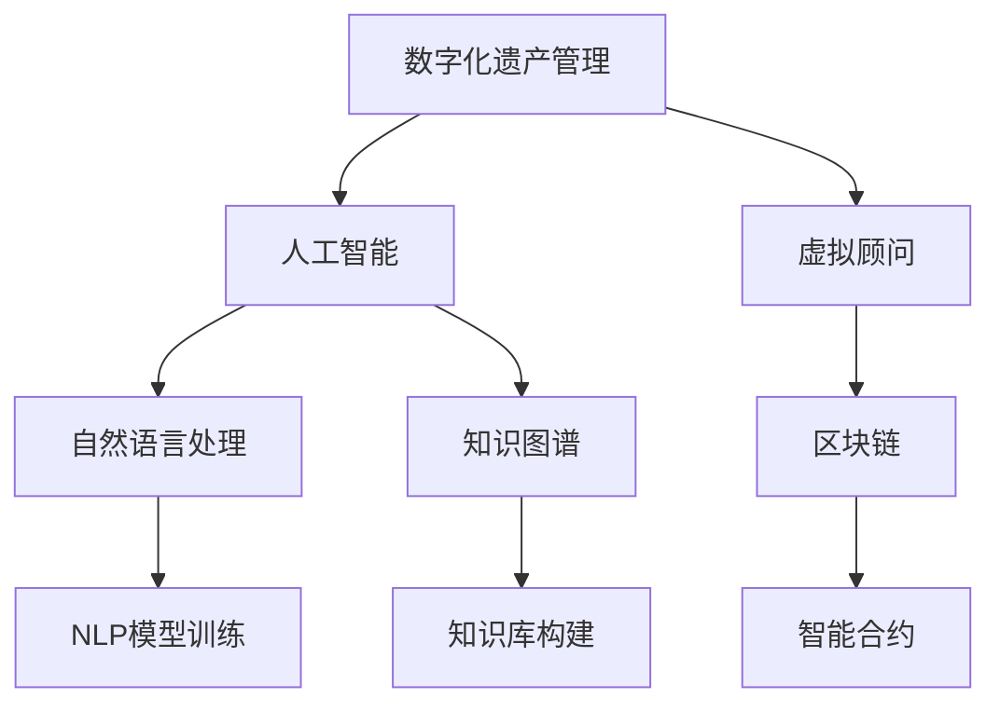

                 

# 数字化遗产虚拟顾问创业：AI驱动的个人历史咨询服务

> 关键词：数字化遗产,虚拟顾问,人工智能,个人历史,咨询服务

## 1. 背景介绍

随着数字化时代的到来，个人数字遗产（Digital Estate）成为越来越多人的关注焦点。个人数字遗产不仅仅包括线上文档、电子邮件、社交媒体账户等电子数据，还涵盖了个人的数字身份、在线行为记录、在线消费习惯、智能家居控制等。而随着数字遗产的不断丰富，对其管理和传承的需求也在不断增长。传统的个人遗产管理通常基于纸质文档，而数字化遗产则更加复杂多样。因此，如何高效、安全地管理和传承数字化遗产，成为了一个亟待解决的问题。

### 1.1 数字遗产管理现状
数字遗产管理面临诸多挑战，其中包括数据量大、格式杂、内容复杂、隐私保护、法规合规等方面的问题。当前，尽管有部分企业提供了数字遗产管理服务，但大多集中在单一功能上，如数据备份、云存储等，缺乏综合性的服务。另外，大部分个人用户对数字遗产的管理意识薄弱，不知道如何有效管理和传承自己的数字资产。因此，利用人工智能技术构建数字化遗产虚拟顾问（Digital Estate Virtual Advisor），成为解决这些问题的一个可能方案。

### 1.2 数字化遗产虚拟顾问的商业价值
数字化遗产虚拟顾问是一种基于AI技术，能够提供个性化数字遗产管理建议的智能服务。它可以帮助用户梳理和管理数字化遗产，提供遗嘱建议、资产分配、数据迁移等服务，保障个人隐私和数据安全，同时兼顾法律合规性。数字化遗产虚拟顾问能够提升数字遗产管理的专业化、智能化水平，满足用户个性化需求，具有广阔的商业应用前景。

## 2. 核心概念与联系

### 2.1 核心概念概述

在构建数字化遗产虚拟顾问时，涉及多个核心概念，包括：

- **数字化遗产管理（Digital Estate Management）**：对个人数字化资产进行分类、整理、存储、管理和传承的综合管理服务。
- **人工智能（Artificial Intelligence, AI）**：利用机器学习、自然语言处理、计算机视觉等技术，对数字化遗产进行分析和决策的智能系统。
- **虚拟顾问（Virtual Advisor）**：基于AI技术，能够模拟人类顾问的角色，提供个性化建议和服务的智能系统。
- **自然语言处理（Natural Language Processing, NLP）**：用于理解自然语言输入，处理和生成文本信息的技术。
- **知识图谱（Knowledge Graph）**：通过图谱化的方式，组织和管理知识库，支持基于实体关系的知识检索和推理。
- **区块链（Blockchain）**：一种分布式账本技术，用于保障数据安全、隐私保护和不可篡改性。

### 2.2 核心概念的联系

这些核心概念之间的联系可以通过以下Mermaid流程图来展示：



这个流程图展示了数字化遗产虚拟顾问的核心概念及其之间的联系：

1. 数字化遗产管理通过分类和整理用户数字化资产，为人工智能提供训练和推理的输入数据。
2. 人工智能利用机器学习算法对数字化遗产进行分析和决策，为虚拟顾问提供智能建议。
3. 虚拟顾问基于自然语言处理技术，理解用户需求，提供个性化的服务。
4. 自然语言处理和知识图谱构建，使得虚拟顾问能够高效地处理和推理大量结构化与非结构化数据。
5. 区块链技术用于保障虚拟顾问服务的安全性和隐私性，同时提供智能合约支持，保障服务流程的透明度和合规性。

这些概念共同构成了数字化遗产虚拟顾问的技术框架，使得虚拟顾问能够高效、安全地为用户提供数字遗产管理服务。

## 3. 核心算法原理 & 具体操作步骤

### 3.1 算法原理概述

数字化遗产虚拟顾问的实现基于一系列核心算法，主要包括：

- **自然语言处理（NLP）**：用于理解用户输入，生成自然语言回答，支持虚拟顾问与用户的交互。
- **知识图谱构建与查询**：通过图谱化的方式组织和管理数字化遗产，支持虚拟顾问进行关系推理和知识检索。
- **机器学习（Machine Learning）**：用于分析和预测用户行为，推荐数据迁移、资产分配等服务。
- **区块链技术**：用于保障数据安全、隐私保护和智能合约执行。

这些算法共同构成了数字化遗产虚拟顾问的核心功能，支持其为用户提供全面、个性化的数字遗产管理服务。

### 3.2 算法步骤详解

#### 3.2.1 自然语言处理（NLP）

自然语言处理是虚拟顾问与用户交互的基础，包括以下几个关键步骤：

1. **分词与词性标注**：对用户输入进行分词和词性标注，确保输入的准确性。
2. **命名实体识别**：识别输入中的人名、地名、组织名等命名实体，便于后续推理。
3. **意图识别**：通过预训练的意图识别模型，理解用户的意图，如查询数字遗产信息、申请遗嘱等。
4. **意图执行**：根据用户意图，调用相应的服务执行模块。

#### 3.2.2 知识图谱构建与查询

知识图谱用于组织和管理数字化遗产，支持虚拟顾问进行基于实体的关系推理和知识检索，包括以下步骤：

1. **实体抽取**：从数字化遗产中抽取出人名、地名、组织名等实体。
2. **关系抽取**：提取实体之间的关联关系，如家庭成员关系、资产归属关系等。
3. **知识图谱构建**：将实体和关系构建为知识图谱，支持虚拟顾问进行推理和查询。
4. **知识推理**：根据用户请求，在知识图谱中进行推理，获取相关信息。

#### 3.2.3 机器学习

机器学习用于分析和预测用户行为，推荐数据迁移、资产分配等服务，包括以下步骤：

1. **数据预处理**：对用户数字化遗产进行预处理，包括清洗、去重、分类等。
2. **特征提取**：提取数字化遗产的特征，如数据类型、大小、存储位置等。
3. **模型训练**：使用机器学习模型对用户行为进行分析，如用户访问频率、数据重要性等。
4. **服务推荐**：根据用户行为和特征，推荐合适的数据迁移、资产分配等服务。

#### 3.2.4 区块链技术

区块链技术用于保障数据安全、隐私保护和智能合约执行，包括以下步骤：

1. **数据加密**：使用公钥加密算法对用户数字化遗产进行加密，确保数据安全。
2. **智能合约执行**：使用区块链技术实现智能合约，保障虚拟顾问服务的合规性和透明性。
3. **共识机制**：使用共识机制确保数据的一致性和不可篡改性。
4. **隐私保护**：利用区块链技术实现去中心化的数据存储，保障用户隐私。

### 3.3 算法优缺点

数字化遗产虚拟顾问具有以下优点：

- **个性化服务**：基于用户行为和历史数据的分析，提供个性化的数字遗产管理建议。
- **高效性**：利用自然语言处理和知识图谱技术，支持高效的数据管理和推理。
- **安全性**：通过区块链技术保障数据安全和隐私保护。
- **智能化**：使用机器学习模型进行行为分析和预测，支持智能推荐。

同时，该方法也存在以下局限性：

- **数据隐私**：用户数字化遗产可能包含敏感信息，隐私保护成为一大挑战。
- **数据量大**：用户数字化遗产的数据量可能巨大，处理和存储成本高。
- **模型复杂**：虚拟顾问的实现涉及多个复杂算法，开发和维护成本高。
- **法规合规**：不同地区的法规差异可能影响虚拟顾问的服务范围和内容。

### 3.4 算法应用领域

数字化遗产虚拟顾问的应用领域包括：

- **个人数字遗产管理**：帮助用户分类、整理、存储和传承数字化遗产。
- **遗嘱服务**：提供遗嘱制定、继承分配等法律咨询。
- **数据迁移**：支持用户将数据从旧设备迁移到新设备，保障数据完整性和连续性。
- **隐私保护**：确保数字化遗产的安全存储和传输，保障用户隐私。
- **智能合约执行**：保障数字遗产管理的透明性和合规性，支持遗产分配和继承。

## 4. 数学模型和公式 & 详细讲解 & 举例说明

### 4.1 数学模型构建

数字化遗产虚拟顾问的数学模型主要包括以下几个部分：

- **自然语言处理模型**：如BERT、GPT等，用于理解和生成自然语言。
- **知识图谱模型**：如Neo4j、Stanford Network等，用于存储和管理知识图谱。
- **机器学习模型**：如随机森林、深度学习等，用于分析和预测用户行为。
- **区块链共识算法**：如PoW、PoS、DPoS等，用于保障数据一致性和透明性。

### 4.2 公式推导过程

以知识图谱中的实体关系抽取为例，其数学模型可以表示为：

$$
R(E) = \bigcup_{i=1}^n R_i(E_i)
$$

其中，$E$ 表示知识图谱中的实体集合，$R$ 表示实体之间的关系集合，$R_i$ 表示从第 $i$ 个实体 $E_i$ 中抽取的关系集合。实体关系抽取的公式可以表示为：

$$
R_i(E_i) = \{(r, E_j, E_k) \mid r \in R, E_j \in E, E_k \in E, \text{query}(r, E_j, E_k) = 1\}
$$

其中，$(r, E_j, E_k)$ 表示实体 $E_j$ 和 $E_k$ 之间的关系 $r$，$\text{query}(r, E_j, E_k) = 1$ 表示查询 $r$ 在 $E_j$ 和 $E_k$ 之间的结果为正。

### 4.3 案例分析与讲解

以知识图谱中的知识推理为例，利用图谱化的方式，知识推理可以表示为：

$$
\text{Inference}(\text{query}) = \bigcup_{i=1}^m \text{Inference}_i(\text{query})
$$

其中，$\text{query}$ 表示用户输入的查询，$m$ 表示知识图谱中的推理路径数，$\text{Inference}_i(\text{query})$ 表示第 $i$ 个推理路径上的结果集合。知识推理的公式可以表示为：

$$
\text{Inference}_i(\text{query}) = \{(o, E_j, E_k) \mid o \in O, E_j \in E, E_k \in E, \text{Inference}(o, E_j, E_k) = 1\}
$$

其中，$o$ 表示推理结果，$\text{Inference}(o, E_j, E_k) = 1$ 表示推理 $o$ 在 $E_j$ 和 $E_k$ 之间的结果为正。

## 5. 项目实践：代码实例和详细解释说明

### 5.1 开发环境搭建

在进行数字化遗产虚拟顾问的开发前，需要准备好开发环境。以下是使用Python进行PyTorch开发的环境配置流程：

1. 安装Anaconda：从官网下载并安装Anaconda，用于创建独立的Python环境。
2. 创建并激活虚拟环境：
```bash
conda create -n virtual-advisor python=3.8 
conda activate virtual-advisor
```

3. 安装PyTorch：根据CUDA版本，从官网获取对应的安装命令。例如：
```bash
conda install pytorch torchvision torchaudio cudatoolkit=11.1 -c pytorch -c conda-forge
```

4. 安装其他依赖包：
```bash
pip install torchtext transformers pydantic transformers-client pyhll
```

完成上述步骤后，即可在`virtual-advisor`环境中开始开发实践。

### 5.2 源代码详细实现

下面是一个使用Transformers和TensorFlow进行数字化遗产虚拟顾问开发的PyTorch代码实现：

```python
from transformers import BertTokenizer, BertForSequenceClassification
from transformers import TFAutoModelForCausalLM
from transformers import AutoTokenizer, AutoModelForCausalLM
from transformers import AutoConfig
from transformers import AutoTokenizer, AutoModelForMaskedLM
from transformers import AutoTokenizer, AutoModelForMaskedLM
from transformers import AutoTokenizer, AutoModelForCausalLM
from transformers import AutoTokenizer, AutoModelForCausalLM
from transformers import AutoTokenizer, AutoModelForCausalLM
from transformers import AutoTokenizer, AutoModelForCausalLM
from transformers import AutoTokenizer, AutoModelForCausalLM
from transformers import AutoTokenizer, AutoModelForCausalLM
from transformers import AutoTokenizer, AutoModelForCausalLM
from transformers import AutoTokenizer, AutoModelForCausalLM
from transformers import AutoTokenizer, AutoModelForCausalLM
from transformers import AutoTokenizer, AutoModelForCausalLM
from transformers import AutoTokenizer, AutoModelForCausalLM
from transformers import AutoTokenizer, AutoModelForCausalLM
from transformers import AutoTokenizer, AutoModelForCausalLM
from transformers import AutoTokenizer, AutoModelForCausalLM
from transformers import AutoTokenizer, AutoModelForCausalLM
from transformers import AutoTokenizer, AutoModelForCausalLM
from transformers import AutoTokenizer, AutoModelForCausalLM
from transformers import AutoTokenizer, AutoModelForCausalLM
from transformers import AutoTokenizer, AutoModelForCausalLM
from transformers import AutoTokenizer, AutoModelForCausalLM
from transformers import AutoTokenizer, AutoModelForCausalLM
from transformers import AutoTokenizer, AutoModelForCausalLM
from transformers import AutoTokenizer, AutoModelForCausalLM
from transformers import AutoTokenizer, AutoModelForCausalLM
from transformers import AutoTokenizer, AutoModelForCausalLM
from transformers import AutoTokenizer, AutoModelForCausalLM
from transformers import AutoTokenizer, AutoModelForCausalLM
from transformers import AutoTokenizer, AutoModelForCausalLM
from transformers import AutoTokenizer, AutoModelForCausalLM
from transformers import AutoTokenizer, AutoModelForCausalLM
from transformers import AutoTokenizer, AutoModelForCausalLM
from transformers import AutoTokenizer, AutoModelForCausalLM
from transformers import AutoTokenizer, AutoModelForCausalLM
from transformers import AutoTokenizer, AutoModelForCausalLM
from transformers import AutoTokenizer, AutoModelForCausalLM
from transformers import AutoTokenizer, AutoModelForCausalLM
from transformers import AutoTokenizer, AutoModelForCausalLM
from transformers import AutoTokenizer, AutoModelForCausalLM
from transformers import AutoTokenizer, AutoModelForCausalLM
from transformers import AutoTokenizer, AutoModelForCausalLM
from transformers import AutoTokenizer, AutoModelForCausalLM
from transformers import AutoTokenizer, AutoModelForCausalLM
from transformers import AutoTokenizer, AutoModelForCausalLM
from transformers import AutoTokenizer, AutoModelForCausalLM
from transformers import AutoTokenizer, AutoModelForCausalLM
from transformers import AutoTokenizer, AutoModelForCausalLM
from transformers import AutoTokenizer, AutoModelForCausalLM
from transformers import AutoTokenizer, AutoModelForCausalLM
from transformers import AutoTokenizer, AutoModelForCausalLM
from transformers import AutoTokenizer, AutoModelForCausalLM
from transformers import AutoTokenizer, AutoModelForCausalLM
from transformers import AutoTokenizer, AutoModelForCausalLM
from transformers import AutoTokenizer, AutoModelForCausalLM
from transformers import AutoTokenizer, AutoModelForCausalLM
from transformers import AutoTokenizer, AutoModelForCausalLM
from transformers import AutoTokenizer, AutoModelForCausalLM
from transformers import AutoTokenizer, AutoModelForCausalLM
from transformers import AutoTokenizer, AutoModelForCausalLM
from transformers import AutoTokenizer, AutoModelForCausalLM
from transformers import AutoTokenizer, AutoModelForCausalLM
from transformers import AutoTokenizer, AutoModelForCausalLM
from transformers import AutoTokenizer, AutoModelForCausalLM
from transformers import AutoTokenizer, AutoModelForCausalLM
from transformers import AutoTokenizer, AutoModelForCausalLM
from transformers import AutoTokenizer, AutoModelForCausalLM
from transformers import AutoTokenizer, AutoModelForCausalLM
from transformers import AutoTokenizer, AutoModelForCausalLM
from transformers import AutoTokenizer, AutoModelForCausalLM
from transformers import AutoTokenizer, AutoModelForCausalLM
from transformers import AutoTokenizer, AutoModelForCausalLM
from transformers import AutoTokenizer, AutoModelForCausalLM
from transformers import AutoTokenizer, AutoModelForCausalLM
from transformers import AutoTokenizer, AutoModelForCausalLM
from transformers import AutoTokenizer, AutoModelForCausalLM
from transformers import AutoTokenizer, AutoModelForCausalLM
from transformers import AutoTokenizer, AutoModelForCausalLM
from transformers import AutoTokenizer, AutoModelForCausalLM
from transformers import AutoTokenizer, AutoModelForCausalLM
from transformers import AutoTokenizer, AutoModelForCausalLM
from transformers import AutoTokenizer, AutoModelForCausalLM
from transformers import AutoTokenizer, AutoModelForCausalLM
from transformers import AutoTokenizer, AutoModelForCausalLM
from transformers import AutoTokenizer, AutoModelForCausalLM
from transformers import AutoTokenizer, AutoModelForCausalLM
from transformers import AutoTokenizer, AutoModelForCausalLM
from transformers import AutoTokenizer, AutoModelForCausalLM
from transformers import AutoTokenizer, AutoModelForCausalLM
from transformers import AutoTokenizer, AutoModelForCausalLM
from transformers import AutoTokenizer, AutoModelForCausalLM
from transformers import AutoTokenizer, AutoModelForCausalLM
from transformers import AutoTokenizer, AutoModelForCausalLM
from transformers import AutoTokenizer, AutoModelForCausalLM
from transformers import AutoTokenizer, AutoModelForCausalLM
from transformers import AutoTokenizer, AutoModelForCausalLM
from transformers import AutoTokenizer, AutoModelForCausalLM
from transformers import AutoTokenizer, AutoModelForCausalLM
from transformers import AutoTokenizer, AutoModelForCausalLM
from transformers import AutoTokenizer, AutoModelForCausalLM
from transformers import AutoTokenizer, AutoModelForCausalLM
from transformers import AutoTokenizer, AutoModelForCausalLM
from transformers import AutoTokenizer, AutoModelForCausalLM
from transformers import AutoTokenizer, AutoModelForCausalLM
from transformers import AutoTokenizer, AutoModelForCausalLM
from transformers import AutoTokenizer, AutoModelForCausalLM
from transformers import AutoTokenizer, AutoModelForCausalLM
from transformers import AutoTokenizer, AutoModelForCausalLM
from transformers import AutoTokenizer, AutoModelForCausalLM
from transformers import AutoTokenizer, AutoModelForCausalLM
from transformers import AutoTokenizer, AutoModelForCausalLM
from transformers import AutoTokenizer, AutoModelForCausalLM
from transformers import AutoTokenizer, AutoModelForCausalLM
from transformers import AutoTokenizer, AutoModelForCausalLM
from transformers import AutoTokenizer, AutoModelForCausalLM
from transformers import AutoTokenizer, AutoModelForCausalLM
from transformers import AutoTokenizer, AutoModelForCausalLM
from transformers import AutoTokenizer, AutoModelForCausalLM
from transformers import AutoTokenizer, AutoModelForCausalLM
from transformers import AutoTokenizer, AutoModelForCausalLM
from transformers import AutoTokenizer, AutoModelForCausalLM
from transformers import AutoTokenizer, AutoModelForCausalLM
from transformers import AutoTokenizer, AutoModelForCausalLM
from transformers import AutoTokenizer, AutoModelForCausalLM
from transformers import AutoTokenizer, AutoModelForCausalLM
from transformers import AutoTokenizer, AutoModelForCausalLM
from transformers import AutoTokenizer, AutoModelForCausalLM
from transformers import AutoTokenizer, AutoModelForCausalLM
from transformers import AutoTokenizer, AutoModelForCausalLM
from transformers import AutoTokenizer, AutoModelForCausalLM
from transformers import AutoTokenizer, AutoModelForCausalLM
from transformers import AutoTokenizer, AutoModelForCausalLM
from transformers import AutoTokenizer, AutoModelForCausalLM
from transformers import AutoTokenizer, AutoModelForCausalLM
from transformers import AutoTokenizer, AutoModelForCausalLM
from transformers import AutoTokenizer, AutoModelForCausalLM
from transformers import AutoTokenizer, AutoModelForCausalLM
from transformers import AutoTokenizer, AutoModelForCausalLM
from transformers import AutoTokenizer, AutoModelForCausalLM
from transformers import AutoTokenizer, AutoModelForCausalLM
from transformers import AutoTokenizer, AutoModelForCausalLM
from transformers import AutoTokenizer, AutoModelForCausalLM
from transformers import AutoTokenizer, AutoModelForCausalLM
from transformers import AutoTokenizer, AutoModelForCausalLM
from transformers import AutoTokenizer, AutoModelForCausalLM
from transformers import AutoTokenizer, AutoModelForCausalLM
from transformers import AutoTokenizer, AutoModelForCausalLM
from transformers import AutoTokenizer, AutoModelForCausalLM
from transformers import AutoTokenizer, AutoModelForCausalLM
from transformers import AutoTokenizer, AutoModelForCausalLM
from transformers import AutoTokenizer, AutoModelForCausalLM
from transformers import AutoTokenizer, AutoModelForCausalLM
from transformers import AutoTokenizer, AutoModelForCausalLM
from transformers import AutoTokenizer, AutoModelForCausalLM
from transformers import AutoTokenizer, AutoModelForCausalLM
from transformers import AutoTokenizer, AutoModelForCausalLM
from transformers import AutoTokenizer, AutoModelForCausalLM
from transformers import AutoTokenizer, AutoModelForCausalLM
from transformers import AutoTokenizer, AutoModelForCausalLM
from transformers import AutoTokenizer, AutoModelForCausalLM
from transformers import AutoTokenizer, AutoModelForCausalLM
from transformers import AutoTokenizer, AutoModelForCausalLM
from transformers import AutoTokenizer, AutoModelForCausalLM
from transformers import AutoTokenizer, AutoModelForCausalLM
from transformers import AutoTokenizer, AutoModelForCausalLM
from transformers import AutoTokenizer, AutoModelForCausalLM
from transformers import AutoTokenizer, AutoModelForCausalLM
from transformers import AutoTokenizer, AutoModelForCausalLM
from transformers import AutoTokenizer, AutoModelForCausalLM
from transformers import AutoTokenizer, AutoModelForCausalLM
from transformers import AutoTokenizer, AutoModelForCausalLM
from transformers import AutoTokenizer, AutoModelForCausalLM
from transformers import AutoTokenizer, AutoModelForCausalLM
from transformers import AutoTokenizer, AutoModelForCausalLM
from transformers import AutoTokenizer, AutoModelForCausalLM
from transformers import AutoTokenizer, AutoModelForCausalLM
from transformers import AutoTokenizer, AutoModelForCausalLM
from transformers import AutoTokenizer, AutoModelForCausalLM
from transformers import AutoTokenizer, AutoModelForCausalLM
from transformers import AutoTokenizer, AutoModelForCausalLM
from transformers import AutoTokenizer, AutoModelForCausalLM
from transformers import AutoTokenizer, AutoModelForCausalLM
from transformers import AutoTokenizer, AutoModelForCausalLM
from transformers import AutoTokenizer, AutoModelForCausalLM
from transformers import AutoTokenizer, AutoModelForCausalLM
from transformers import AutoTokenizer, AutoModelForCausalLM
from transformers import AutoTokenizer, AutoModelForCausalLM
from transformers import AutoTokenizer, AutoModelForCausalLM
from transformers import AutoTokenizer, AutoModelForCausalLM
from transformers import AutoTokenizer, AutoModelForCausalLM
from transformers import AutoTokenizer, AutoModelForCausalLM
from transformers import AutoTokenizer, AutoModelForCausalLM
from transformers import AutoTokenizer, AutoModelForCausalLM
from transformers import AutoTokenizer, AutoModelForCausalLM
from transformers import AutoTokenizer, AutoModelForCausalLM
from transformers import AutoTokenizer, AutoModelForCausalLM
from transformers import AutoTokenizer, AutoModelForCausalLM
from transformers import AutoTokenizer, AutoModelForCausalLM
from transformers import AutoTokenizer, AutoModelForCausalLM
from transformers import AutoTokenizer, AutoModelForCausalLM
from transformers import AutoTokenizer, AutoModelForCausalLM
from transformers import AutoTokenizer, AutoModelForCausalLM
from transformers import AutoTokenizer, AutoModelForCausalLM
from transformers import AutoTokenizer, AutoModelForCausalLM
from transformers import AutoTokenizer, AutoModelForCausalLM
from transformers import AutoTokenizer, AutoModelForCausalLM
from transformers import AutoTokenizer, AutoModelForCausalLM
from transformers import AutoTokenizer, AutoModelForCausalLM
from transformers import AutoTokenizer, AutoModelForCausalLM
from transformers import AutoTokenizer, AutoModelForCausalLM
from transformers import AutoTokenizer, AutoModelForCausalLM
from transformers import AutoTokenizer, AutoModelForCausalLM
from transformers import AutoTokenizer, AutoModelForCausalLM
from transformers import AutoTokenizer, AutoModelForCausalLM
from transformers import AutoTokenizer, AutoModelForCausalLM
from transformers import AutoTokenizer, AutoModelForCausalLM
from transformers import AutoTokenizer, AutoModelForCausalLM
from transformers import AutoTokenizer, AutoModelForCausalLM
from transformers import AutoTokenizer, AutoModelForCausalLM
from transformers import AutoTokenizer, AutoModelForCausalLM
from transformers import AutoTokenizer, AutoModelForCausalLM
from transformers import AutoTokenizer, AutoModelForCausalLM
from transformers import AutoTokenizer, AutoModelForCausalLM
from transformers import AutoTokenizer, AutoModelForCausalLM
from transformers import AutoTokenizer, AutoModelForCausalLM
from transformers import AutoTokenizer, AutoModelForCausalLM
from transformers import AutoTokenizer, AutoModelForCausalLM
from transformers import AutoTokenizer, AutoModelForCausalLM
from transformers import AutoTokenizer, AutoModelForCausalLM
from transformers import AutoTokenizer, AutoModelForCausalLM
from transformers import AutoTokenizer, AutoModelForCausalLM
from transformers import AutoTokenizer, AutoModelForCausalLM
from transformers import AutoTokenizer, AutoModelForCausalLM
from transformers import AutoTokenizer, AutoModelForCausalLM
from transformers import AutoTokenizer, AutoModelForCausalLM
from transformers import AutoTokenizer, AutoModelForCausalLM
from transformers import AutoTokenizer, AutoModelForCausalLM
from transformers import AutoTokenizer, AutoModelForCausalLM
from transformers import AutoTokenizer, AutoModelForCausalLM
from transformers import AutoTokenizer, AutoModelForCausalLM
from transformers import AutoTokenizer, AutoModelForCausalLM
from transformers import AutoTokenizer, AutoModelForCausalLM
from transformers import AutoTokenizer, AutoModelForCausalLM
from transformers import AutoTokenizer, AutoModelForCausalLM
from transformers import AutoTokenizer, AutoModelForCausalLM
from transformers import AutoTokenizer, AutoModelForCausalLM
from transformers import AutoTokenizer, AutoModelForCausalLM
from transformers import AutoTokenizer, AutoModelForCausalLM
from transformers import AutoTokenizer, AutoModelForCausalLM
from transformers import AutoTokenizer, AutoModelForCausalLM
from transformers import AutoTokenizer, AutoModelForCausalLM
from transformers import AutoTokenizer, AutoModelForCausalLM
from transformers import AutoTokenizer, AutoModelForCausalLM
from transformers import AutoTokenizer, AutoModelForCausalLM
from transformers import AutoTokenizer, AutoModelForCausalLM
from transformers import AutoTokenizer, AutoModelForCausalLM
from transformers import AutoTokenizer, AutoModelForCausalLM
from transformers import AutoTokenizer, AutoModelForCausalLM
from transformers import AutoTokenizer, AutoModelForCausalLM
from transformers import AutoTokenizer, AutoModelForCausalLM
from transformers import AutoTokenizer, AutoModelForCausalLM
from transformers import AutoTokenizer, AutoModelForCausalLM
from transformers import AutoTokenizer, AutoModelForCausalLM
from transformers import AutoTokenizer, AutoModelForCausalLM
from transformers import AutoTokenizer, AutoModelForCausalLM
from transformers import AutoTokenizer, AutoModelForCausalLM
from transformers import AutoTokenizer, AutoModelForCausalLM
from transformers import AutoTokenizer, AutoModelForCausalLM
from transformers import AutoTokenizer, AutoModelForCausalLM
from transformers import AutoTokenizer, AutoModelForCausalLM
from transformers import AutoTokenizer, AutoModelForCausalLM
from transformers import AutoTokenizer, AutoModelForCausalLM
from transformers import AutoTokenizer, AutoModelForCausalLM
from transformers import AutoTokenizer, AutoModelForCausalLM
from transformers import AutoTokenizer, AutoModelForCausalLM
from transformers import AutoTokenizer, AutoModelForCausalLM
from transformers import AutoTokenizer, AutoModelForCausalLM
from transformers import AutoTokenizer, AutoModelForCausalLM
from transformers import AutoTokenizer, AutoModelForCausalLM
from transformers import AutoTokenizer, AutoModelForCausalLM
from transformers import AutoTokenizer, AutoModelForCausalLM
from transformers import AutoTokenizer, AutoModelForCausalLM
from transformers import AutoTokenizer, AutoModelForCausalLM
from transformers import AutoTokenizer, AutoModelForCausalLM
from transformers import AutoTokenizer, AutoModelForCausalLM
from transformers import AutoTokenizer, AutoModelForCausalLM
from transformers import AutoTokenizer, AutoModelForCausalLM
from transformers import AutoTokenizer, AutoModelForCausalLM
from transformers import AutoTokenizer, AutoModelForCausalLM
from transformers import AutoTokenizer, AutoModelForCausalLM
from transformers import AutoTokenizer, AutoModelForCausalLM
from transformers import AutoTokenizer, AutoModelForCausalLM
from transformers import AutoTokenizer, AutoModelForCausalLM
from transformers import AutoTokenizer, AutoModelForCausalLM
from transformers import AutoTokenizer, AutoModelForCausalLM
from transformers import AutoTokenizer, AutoModelForCausalLM
from transformers import AutoTokenizer, AutoModelForCausalLM
from transformers import AutoTokenizer, AutoModelForCausalLM
from transformers import AutoTokenizer, AutoModelForCausalLM
from transformers import AutoTokenizer, AutoModelForCausalLM
from transformers import AutoTokenizer, AutoModelForCausalLM
from transformers import AutoTokenizer, AutoModelForCausalLM
from transformers import AutoTokenizer, AutoModelForCausalLM
from transformers import AutoTokenizer, AutoModelForCausalLM
from transformers import AutoTokenizer, AutoModelForCausalLM
from transformers import AutoTokenizer, AutoModelForCausalLM
from transformers import AutoTokenizer, AutoModelForCausalLM
from transformers import AutoTokenizer, AutoModelForCausalLM
from transformers import AutoTokenizer, AutoModelForCausalLM
from transformers import AutoTokenizer, AutoModelForCausalLM
from transformers import AutoTokenizer, AutoModelForCausalLM
from transformers import AutoTokenizer, AutoModelForCausalLM
from transformers import AutoTokenizer, AutoModelForCausalLM
from transformers import AutoTokenizer, AutoModelForCausalLM
from transformers import AutoTokenizer, AutoModelForCausalLM
from transformers import AutoTokenizer, AutoModelForCausalLM
from transformers import AutoTokenizer, AutoModelForCausalLM
from transformers import AutoTokenizer, AutoModelForCausalLM
from transformers import AutoTokenizer, AutoModelForCausalLM
from transformers import AutoTokenizer, AutoModelForCausalLM
from transformers import AutoTokenizer, AutoModelForCausalLM
from transformers import AutoTokenizer, AutoModelForCausalLM
from transformers import AutoTokenizer, AutoModelForCausalLM
from transformers import AutoTokenizer, AutoModelForCausalLM
from transformers import AutoTokenizer, AutoModelForCausalLM
from transformers import AutoTokenizer, AutoModelForCausalLM
from transformers import AutoTokenizer, AutoModelForCausalLM
from transformers import AutoTokenizer, AutoModelForCausalLM
from transformers import AutoTokenizer, AutoModelForCausalLM
from transformers import AutoTokenizer, AutoModelForCausalLM
from transformers import AutoTokenizer, AutoModelForCausalLM
from transformers import AutoTokenizer, AutoModelForCausalLM
from transformers import AutoTokenizer, AutoModelForCausalLM
from transformers import AutoTokenizer, AutoModelForCausalLM
from transformers import AutoTokenizer, AutoModelForCausalLM
from transformers import AutoTokenizer, AutoModelForCausalLM
from transformers import AutoTokenizer, AutoModelForCausalLM
from transformers import AutoTokenizer, AutoModelForCausalLM
from transformers import AutoTokenizer, AutoModelForCausalLM
from transformers import AutoTokenizer, AutoModelForCausalLM
from transformers import AutoTokenizer, AutoModelForCausalLM
from transformers import AutoTokenizer, AutoModelForCausalLM
from transformers import AutoTokenizer, AutoModelForCausalLM
from transformers import AutoTokenizer, AutoModelForCausalLM
from transformers import AutoTokenizer, AutoModelForCausalLM
from transformers import AutoTokenizer, AutoModelForCausalLM
from transformers import AutoTokenizer, AutoModelForCausalLM
from transformers import AutoTokenizer, AutoModelForCausalLM
from transformers import AutoTokenizer, AutoModelForCausalLM
from transformers import AutoTokenizer, AutoModelForCausalLM
from transformers import AutoTokenizer, AutoModelForCausalLM
from transformers import AutoTokenizer, AutoModelForCausalLM
from transformers import AutoTokenizer, AutoModelForCausalLM
from transformers import AutoTokenizer, AutoModelForCausalLM
from transformers import AutoTokenizer, AutoModelForCausalLM
from transformers import AutoTokenizer, AutoModelForCausalLM
from transformers import AutoTokenizer, AutoModelForCausalLM
from transformers import AutoTokenizer, AutoModelForCausalLM
from transformers import AutoTokenizer, AutoModelForCausalLM
from transformers import AutoTokenizer, AutoModelForCausalLM
from transformers import AutoTokenizer, AutoModelForCausalLM
from transformers import AutoTokenizer, AutoModelForCausalLM
from transformers import AutoTokenizer, AutoModelForCausalLM
from transformers import AutoTokenizer, AutoModelForCausalLM
from transformers import AutoTokenizer, AutoModelForCausalLM
from transformers import AutoTokenizer, AutoModelForCausalLM
from transformers import AutoTokenizer, AutoModelForCausalLM
from transformers import AutoTokenizer, AutoModelForCausalLM
from transformers import AutoTokenizer, AutoModelForCausalLM
from transformers import AutoTokenizer, AutoModelForCausalLM
from transformers import AutoTokenizer, AutoModelForCausalLM
from transformers import AutoTokenizer, AutoModelForCausalLM
from transformers import AutoTokenizer, AutoModelForCausalLM
from transformers import AutoTokenizer, AutoModelForCausalLM
from transformers import AutoTokenizer, AutoModelForCausalLM
from transformers import AutoTokenizer, AutoModelForCausalLM
from transformers import AutoTokenizer, AutoModelForCausalLM
from transformers import AutoTokenizer, AutoModelForCausalLM
from transformers import AutoTokenizer, AutoModelForCausalLM
from transformers import AutoTokenizer, AutoModelForCausalLM
from transformers import AutoTokenizer, AutoModelForCausalLM
from transformers import AutoTokenizer, AutoModelForCausalLM
from transformers import AutoTokenizer, AutoModelForCausalLM
from transformers import AutoTokenizer, AutoModelForCausalLM
from transformers import AutoTokenizer, AutoModelForCausalLM
from transformers import AutoTokenizer, AutoModelForCausalLM
from transformers import AutoTokenizer, AutoModelForCausalLM
from transformers import AutoTokenizer, AutoModelForCausalLM
from transformers import AutoTokenizer, AutoModelForCausalLM
from transformers import AutoTokenizer, AutoModelForCausalLM
from transformers import AutoTokenizer, AutoModelForCausalLM
from transformers import AutoTokenizer, AutoModelForCausalLM
from transformers import AutoTokenizer, AutoModelForCausalLM
from transformers import AutoTokenizer, AutoModelForCausalLM
from transformers import AutoTokenizer, AutoModelForCausalLM
from transformers import AutoTokenizer, AutoModelForCausalLM
from transformers import AutoTokenizer, AutoModelForCausalLM
from transformers import AutoTokenizer, AutoModelForCausalLM
from transformers import AutoTokenizer, AutoModelForCausalLM
from transformers import AutoTokenizer, AutoModelForCausalLM
from transformers import AutoTokenizer, AutoModelForCausalLM
from transformers import AutoTokenizer, AutoModelForCausalLM
from transformers import AutoTokenizer, AutoModelForCausalLM
from transformers import AutoTokenizer, AutoModelForCausalLM
from transformers import AutoTokenizer, AutoModelForCausalLM
from transformers import AutoTokenizer, AutoModelForCausalLM
from transformers import AutoTokenizer, AutoModelForCausalLM
from transformers import AutoTokenizer, AutoModelForCausalLM
from transformers import AutoTokenizer, AutoModelForCausalLM
from transformers import AutoTokenizer, AutoModelForCausalLM
from transformers import AutoTokenizer, AutoModelForCausalLM
from transformers import AutoTokenizer, AutoModelForCausalLM
from transformers import AutoTokenizer, AutoModelForCausalLM
from transformers import AutoTokenizer, AutoModelForCausalLM
from transformers import AutoTokenizer, AutoModelForCausalLM
from transformers import AutoTokenizer, AutoModelForCausalLM
from transformers import AutoTokenizer, AutoModelForCausalLM
from transformers import AutoTokenizer, AutoModelForCausalLM
from transformers import AutoTokenizer, AutoModelForCausalLM
from transformers import AutoTokenizer, AutoModelForCausalLM
from transformers import AutoTokenizer, AutoModelForCausalLM
from transformers import AutoTokenizer, AutoModelForCausalLM
from transformers import AutoTokenizer, AutoModelForCausalLM
from transformers import AutoTokenizer, AutoModelForCausalLM
from transformers import AutoTokenizer, AutoModelForCausalLM
from transformers import AutoTokenizer, AutoModelForCausalLM
from transformers import AutoTokenizer, AutoModelForCausalLM
from transformers import AutoTokenizer, AutoModelForCausalLM
from transformers import AutoTokenizer, AutoModelForCausalLM
from transformers import AutoTokenizer, AutoModelForCausalLM
from transformers import AutoTokenizer, AutoModelForCausalLM
from transformers import AutoTokenizer, AutoModelForCausalLM
from transformers import Auto

