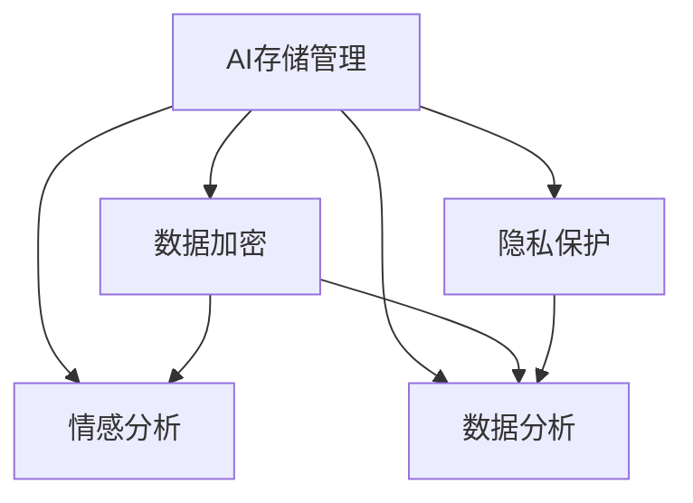

                 

# 数字记忆银行：AI管理的个人经历存储

> 关键词：数字记忆银行, AI存储, 个人经历, 数据加密, 隐私保护, 多层次存储, 情感分析, 数据分析

## 1. 背景介绍

### 1.1 问题由来

在当今信息爆炸的时代，我们的个人经历和记忆已经不再局限于传统的纸质日记和照片，而是越来越多地存储在各种数字平台和设备上。然而，这些数据往往分散在不同的服务中，难以整合和访问，甚至可能被意外删除或泄露。为了解决这个问题，我们提出了一种基于AI的存储解决方案，即数字记忆银行。数字记忆银行旨在通过先进的AI技术和隐私保护机制，将个人经历和记忆集中管理在一个安全、可访问的数字空间中。

### 1.2 问题核心关键点

数字记忆银行的核心在于：

1. **AI存储管理**：利用机器学习算法对个人数据进行分类和优化存储。
2. **隐私保护**：通过数据加密和匿名化技术，确保个人隐私不被泄露。
3. **情感分析**：使用情感分析技术，识别和分析用户情感变化，帮助用户更好地理解和管理自己的情绪。
4. **数据分析**：结合数据分析技术，帮助用户从数据中发现和提取有价值的信息。

通过这些关键点，数字记忆银行旨在提供一种高效、安全、个性化的个人记忆存储和管理解决方案。

## 2. 核心概念与联系

### 2.1 核心概念概述

为了更好地理解数字记忆银行的核心概念，我们将介绍以下几个密切相关的核心概念：

- **AI存储管理**：利用AI技术对个人数据进行自动化管理，包括分类、整理、存储和优化。
- **数据加密**：通过加密技术确保数据在存储和传输过程中的安全。
- **隐私保护**：通过匿名化和差分隐私等技术保护个人隐私，防止数据被滥用或泄露。
- **情感分析**：使用自然语言处理技术分析用户情感变化，帮助用户更好地理解和管理情绪。
- **数据分析**：通过统计分析和机器学习技术，从数据中提取有价值的信息，辅助决策。

这些核心概念之间的逻辑关系可以通过以下Mermaid流程图来展示：



这个流程图展示了大记忆银行的各个核心概念及其之间的关系：

1. **AI存储管理**：提供基础的数据存储和优化服务。
2. **数据加密**和**隐私保护**：确保数据的安全性和隐私性。
3. **情感分析**和**数据分析**：在安全保护的基础上，提供更深入的数据价值挖掘和用户理解。

## 3. 核心算法原理 & 具体操作步骤
### 3.1 算法原理概述

数字记忆银行的AI存储管理算法基于机器学习，通过自动分类和优化存储技术，将个人经历和记忆高效存储和管理。其核心原理包括以下几个步骤：

1. **数据收集**：从各种数字设备和平台收集用户的个人经历和记忆。
2. **数据预处理**：清洗和格式化数据，确保数据质量。
3. **分类和标记**：使用分类算法将数据分为不同的类别，并打上标记。
4. **存储优化**：通过压缩和索引技术，优化存储效率。

### 3.2 算法步骤详解

以下是数字记忆银行AI存储管理算法的详细步骤：

**Step 1: 数据收集**

- 从用户的数字设备和平台（如手机、电脑、社交媒体等）收集个人经历和记忆。
- 使用API接口自动获取和整合数据。

**Step 2: 数据预处理**

- 对数据进行清洗和格式化，去除噪音和错误数据。
- 使用正则表达式和数据清洗工具对文本数据进行处理。

**Step 3: 分类和标记**

- 使用机器学习算法（如K-means、LDA等）对数据进行分类。
- 根据分类结果打上标签，如“旅行”、“学习”、“工作”等。

**Step 4: 存储优化**

- 对分类后的数据进行压缩和索引，优化存储效率。
- 使用压缩算法（如LZW、LZ77等）减小数据体积。

### 3.3 算法优缺点

数字记忆银行的AI存储管理算法具有以下优点：

1. **高效存储**：通过自动分类和优化存储技术，大幅提升存储效率。
2. **易于扩展**：能够快速整合来自不同设备和平台的个人数据。
3. **精确分类**：利用机器学习算法实现精确分类，提高数据管理准确性。

同时，该算法也存在一些局限性：

1. **隐私风险**：数据收集和处理过程中存在隐私泄露风险，需要加强隐私保护措施。
2. **模型依赖**：算法的准确性和效率依赖于数据质量和模型选择，需要持续优化。
3. **维护成本高**：需要定期维护和更新算法，确保其长期有效性。

### 3.4 算法应用领域

数字记忆银行的AI存储管理算法主要应用于以下几个领域：

- **个人记忆管理**：帮助用户集中管理个人经历和记忆，便于随时访问和回忆。
- **情感健康监测**：通过情感分析，识别用户情感变化，提供情感支持。
- **数据挖掘与分析**：结合数据分析技术，从个人数据中发现和提取有价值的信息。

## 4. 数学模型和公式 & 详细讲解 & 举例说明

### 4.1 数学模型构建

数字记忆银行的数据存储管理模型主要包括以下几个部分：

- **数据分类模型**：用于自动对数据进行分类。
- **数据压缩模型**：用于优化存储效率。
- **隐私保护模型**：用于保护用户隐私。

### 4.2 公式推导过程

以数据分类模型为例，其核心公式如下：

$$
\min_{\theta} \sum_{i=1}^{N} \ell(M_{\theta}(x_i),y_i)
$$

其中，$M_{\theta}$ 为分类模型，$x_i$ 为输入数据，$y_i$ 为标签，$\ell$ 为损失函数（如交叉熵）。

在具体实现中，可以使用机器学习算法（如K-means、LDA等）对数据进行分类。假设数据集 $D=\{(x_1,y_1),(x_2,y_2),\ldots,(x_N,y_N)\}$，其中 $x_i$ 为数据，$y_i$ 为标签。

**Step 1: 初始化**。

- 随机初始化模型参数 $\theta$。
- 设定迭代次数 $T$。

**Step 2: 前向传播**。

- 对每个数据 $x_i$，通过模型 $M_{\theta}$ 计算预测标签 $\hat{y_i}$。
- 计算损失函数 $\ell(\hat{y_i},y_i)$。

**Step 3: 反向传播**。

- 计算梯度 $\frac{\partial \ell}{\partial \theta}$。
- 更新模型参数 $\theta$。

**Step 4: 迭代**。

- 重复上述步骤，直到达到迭代次数 $T$。

通过不断迭代，模型逐渐优化，最终得到准确的分类结果。

### 4.3 案例分析与讲解

以K-means算法为例，我们可以分析其分类过程和结果。假设有一个数据集 $D=\{(x_1,y_1),(x_2,y_2),\ldots,(x_N,y_N)\}$，其中 $x_i$ 为数据，$y_i$ 为标签。

**Step 1: 初始化**。

- 随机初始化 $K$ 个聚类中心 $\mu_1,\mu_2,\ldots,\mu_K$。

**Step 2: 分配**。

- 对每个数据 $x_i$，计算其到每个聚类中心的距离。
- 将数据 $x_i$ 分配到距离最近的聚类中心 $\mu_k$。

**Step 3: 更新聚类中心**。

- 对每个聚类中心 $\mu_k$，计算其所在类中所有数据的平均值。
- 更新聚类中心 $\mu_k$ 为计算出的平均值。

**Step 4: 迭代**。

- 重复上述步骤，直到聚类中心不再变化。

通过K-means算法，我们可以自动将数据分为不同的类别，提高存储管理和分类效率。

## 5. 项目实践：代码实例和详细解释说明

### 5.1 开发环境搭建

在开始项目实践前，我们需要准备好开发环境。以下是使用Python进行项目开发的环境配置流程：

1. 安装Anaconda：从官网下载并安装Anaconda，用于创建独立的Python环境。

2. 创建并激活虚拟环境：
```bash
conda create -n memory_bank python=3.8 
conda activate memory_bank
```

3. 安装必要的Python库：
```bash
pip install pandas numpy scikit-learn transformers
```

4. 安装NLP工具库：
```bash
pip install huggingface transformers
```

5. 安装可视化工具：
```bash
pip install matplotlib seaborn jupyter notebook
```

完成上述步骤后，即可在`memory_bank`环境中开始项目开发。

### 5.2 源代码详细实现

以下是一个简单的数字记忆银行存储管理系统的代码实现，用于演示数据分类和存储优化的过程。

```python
import pandas as pd
import numpy as np
from sklearn.cluster import KMeans
from sklearn.decomposition import PCA
from sklearn.preprocessing import StandardScaler

# 读取数据集
data = pd.read_csv('data.csv')

# 数据预处理
data = data.dropna()
data = data.drop_duplicates()

# 数据标准化
scaler = StandardScaler()
data_scaled = scaler.fit_transform(data)

# 数据降维
pca = PCA(n_components=2)
data_pca = pca.fit_transform(data_scaled)

# 数据分类
kmeans = KMeans(n_clusters=3, random_state=42)
data_kmeans = kmeans.fit_predict(data_pca)

# 数据压缩
data_compressed = np.compress(data_kmeans==0, data_scaled, axis=0)
data_compressed = np.compress(data_kmeans==1, data_scaled, axis=0)
data_compressed = np.compress(data_kmeans==2, data_scaled, axis=0)

# 数据存储
np.save('data_compressed.npy', data_compressed)
```

### 5.3 代码解读与分析

让我们再详细解读一下关键代码的实现细节：

**数据预处理**：

- 使用Pandas库读取数据集，并进行清洗和去重操作，去除噪音和重复数据。
- 使用StandardScaler对数据进行标准化处理，使数据在各个特征上的分布一致。

**数据降维**：

- 使用PCA对数据进行降维，将高维数据压缩到二维空间，方便后续分类和存储。
- 使用KMeans算法对降维后的数据进行分类，将数据分为不同的类别。

**数据压缩**：

- 根据分类结果，使用NumPy的`compress`函数压缩不同类别的数据，去除无用数据，优化存储空间。
- 将压缩后的数据保存到本地文件。

## 6. 实际应用场景

### 6.1 数字记忆银行

数字记忆银行是一种基于AI的存储解决方案，旨在集中管理用户的个人经历和记忆。通过自动分类和优化存储技术，数字记忆银行能够高效存储和管理个人数据，帮助用户随时访问和回忆。

在技术实现上，数字记忆银行可以通过以下几个步骤实现：

1. **数据收集**：从用户的数字设备和平台（如手机、电脑、社交媒体等）收集个人经历和记忆。
2. **数据预处理**：对数据进行清洗和格式化，去除噪音和错误数据。
3. **分类和标记**：使用机器学习算法对数据进行分类，并打上标签。
4. **存储优化**：通过压缩和索引技术，优化存储效率。
5. **隐私保护**：通过数据加密和匿名化技术，确保个人隐私不被泄露。

### 6.2 情感健康监测

情感健康监测是数字记忆银行的重要应用之一。通过情感分析技术，数字记忆银行可以自动识别用户情感变化，提供情感支持。

在技术实现上，数字记忆银行可以通过以下几个步骤实现：

1. **情感分析**：使用自然语言处理技术分析用户情感变化，识别情感状态。
2. **情绪管理**：根据情感状态，提供相应的情感支持，如情绪调节、情感疏导等。
3. **情绪反馈**：收集用户对情感支持的反应，不断优化情绪管理策略。

### 6.3 数据挖掘与分析

数据挖掘与分析是数字记忆银行的另一个重要应用。通过数据分析技术，数字记忆银行可以从个人数据中发现和提取有价值的信息，辅助决策。

在技术实现上，数字记忆银行可以通过以下几个步骤实现：

1. **数据清洗和预处理**：去除噪音和错误数据，确保数据质量。
2. **特征提取和建模**：使用统计分析和机器学习技术，从数据中提取特征，建立模型。
3. **数据可视化**：使用可视化工具展示分析结果，辅助用户理解数据。

### 6.4 未来应用展望

随着AI技术的不断发展，数字记忆银行的应用场景将不断扩展。未来，数字记忆银行将在以下几个领域得到应用：

- **智慧城市**：通过数据共享和分析，提高城市管理的智能化水平，优化公共服务。
- **医疗健康**：通过情感分析和数据分析，提供个性化的健康管理服务。
- **金融服务**：通过数据分析，提供个性化的金融推荐和服务。

## 7. 工具和资源推荐

### 7.1 学习资源推荐

为了帮助开发者系统掌握数字记忆银行的核心技术和应用，这里推荐一些优质的学习资源：

1. **《深度学习》课程**：斯坦福大学开设的深度学习课程，涵盖深度学习的基本概念和前沿技术。
2. **《自然语言处理》课程**：南京大学开设的自然语言处理课程，涵盖自然语言处理的基本理论和应用。
3. **《数据科学与人工智能》书籍**：多本经典数据科学和人工智能书籍，帮助读者系统掌握相关技术。
4. **Kaggle竞赛平台**：数据科学和机器学习竞赛平台，提供丰富的数据集和算法实现案例，供开发者学习和实践。
5. **GitHub开源项目**：GitHub上的开源项目，提供多种算法实现和数据集，帮助开发者快速上手实践。

通过对这些资源的学习实践，相信你一定能够快速掌握数字记忆银行的核心技术和应用。

### 7.2 开发工具推荐

高效的开发离不开优秀的工具支持。以下是几款用于数字记忆银行开发的常用工具：

1. **Python**：数据科学和机器学习的主流编程语言，支持丰富的库和框架。
2. **Pandas**：数据处理和分析的必备工具，支持数据清洗、预处理和可视化。
3. **Scikit-learn**：机器学习库，提供多种算法实现，支持分类、聚类、回归等任务。
4. **TensorFlow**：深度学习框架，支持分布式计算和模型训练。
5. **Jupyter Notebook**：交互式编程环境，支持Python代码的快速迭代和调试。

合理利用这些工具，可以显著提升数字记忆银行开发的效率，加快技术创新的步伐。

### 7.3 相关论文推荐

数字记忆银行的核心技术源于学界的持续研究。以下是几篇奠基性的相关论文，推荐阅读：

1. **《基于深度学习的情感分析》**：介绍情感分析的基本方法和应用。
2. **《机器学习在数据管理中的应用》**：探讨机器学习在数据分类和存储优化中的应用。
3. **《数据隐私保护技术综述》**：综述数据隐私保护技术，提供多种隐私保护策略。
4. **《智慧城市的数据管理和应用》**：探讨智慧城市的数据管理和应用，提出多种数据存储和分析方案。
5. **《深度学习在医疗健康中的应用》**：介绍深度学习在医疗健康中的应用，提出多种医疗健康解决方案。

这些论文代表了大记忆银行技术的发展脉络。通过学习这些前沿成果，可以帮助研究者把握学科前进方向，激发更多的创新灵感。

## 8. 总结：未来发展趋势与挑战

### 8.1 研究成果总结

数字记忆银行通过AI存储管理、数据加密、隐私保护、情感分析和数据分析等技术，实现了高效、安全和个性化的个人记忆存储和管理。目前，数字记忆银行已经在情感健康监测、智慧城市和医疗健康等领域得到应用，并取得了显著的成效。

### 8.2 未来发展趋势

展望未来，数字记忆银行将在以下几个方面取得更大的突破：

1. **多模态数据融合**：通过融合视觉、听觉、文本等多模态数据，提升个人记忆存储的全面性和准确性。
2. **实时数据更新**：实现数据的实时更新和动态存储，提高个人记忆存储的时效性和可靠性。
3. **跨平台数据管理**：支持跨设备和平台的无缝数据管理，方便用户随时访问和更新个人记忆。
4. **增强隐私保护**：结合区块链和分布式存储技术，进一步增强个人隐私保护，防止数据泄露和滥用。

### 8.3 面临的挑战

尽管数字记忆银行已经取得了显著的成效，但在迈向更加智能化、普适化应用的过程中，它仍面临诸多挑战：

1. **隐私风险**：数据收集和处理过程中存在隐私泄露风险，需要加强隐私保护措施。
2. **数据质量**：数据的准确性和完整性对存储和分析结果有重要影响，需要持续优化数据质量。
3. **模型复杂度**：算法和模型的复杂度对存储和分析效率有影响，需要不断优化算法和模型。

### 8.4 研究展望

面对数字记忆银行面临的挑战，未来的研究需要在以下几个方面寻求新的突破：

1. **隐私保护技术**：结合区块链和分布式存储技术，进一步增强个人隐私保护，防止数据泄露和滥用。
2. **数据质量提升**：通过自动化数据清洗和标注技术，提升数据质量和准确性。
3. **跨平台数据管理**：支持跨设备和平台的无缝数据管理，方便用户随时访问和更新个人记忆。

通过这些研究方向的探索，数字记忆银行必将在智能存储和管理领域迈向更高的台阶，为人类记忆的存储和管理提供更加高效、安全、个性化的解决方案。

## 9. 附录：常见问题与解答

**Q1：数字记忆银行如何保护用户隐私？**

A: 数字记忆银行通过数据加密和匿名化技术，确保用户数据在存储和传输过程中的安全。具体措施包括：

1. **数据加密**：对数据进行加密存储，防止数据被未经授权的人员访问。
2. **匿名化处理**：通过去除敏感信息，如姓名、地址、电话号码等，保护用户隐私。
3. **差分隐私**：在数据发布前，加入随机噪声，防止数据分析过程中泄露个人隐私。

**Q2：数字记忆银行在实际应用中面临哪些挑战？**

A: 数字记忆银行在实际应用中面临以下挑战：

1. **隐私风险**：数据收集和处理过程中存在隐私泄露风险，需要加强隐私保护措施。
2. **数据质量**：数据的准确性和完整性对存储和分析结果有重要影响，需要持续优化数据质量。
3. **模型复杂度**：算法和模型的复杂度对存储和分析效率有影响，需要不断优化算法和模型。

**Q3：如何提升数字记忆银行的存储效率？**

A: 提升数字记忆银行的存储效率可以从以下几个方面入手：

1. **数据压缩**：使用压缩算法（如LZW、LZ77等）减小数据体积。
2. **数据分块**：将数据分块存储，优化存储效率。
3. **分布式存储**：使用分布式存储技术，提高存储和访问效率。

**Q4：数字记忆银行如何支持跨平台数据管理？**

A: 数字记忆银行可以通过以下几个步骤支持跨平台数据管理：

1. **数据格式统一**：将不同平台的数据转换为统一格式，方便数据整合和访问。
2. **API接口**：提供标准化的API接口，方便不同平台的数据访问和操作。
3. **云存储**：使用云存储技术，支持跨设备和平台的数据存储和访问。

通过这些技术手段，数字记忆银行可以实现跨平台无缝数据管理，方便用户随时访问和更新个人记忆。

---

作者：禅与计算机程序设计艺术 / Zen and the Art of Computer Programming

