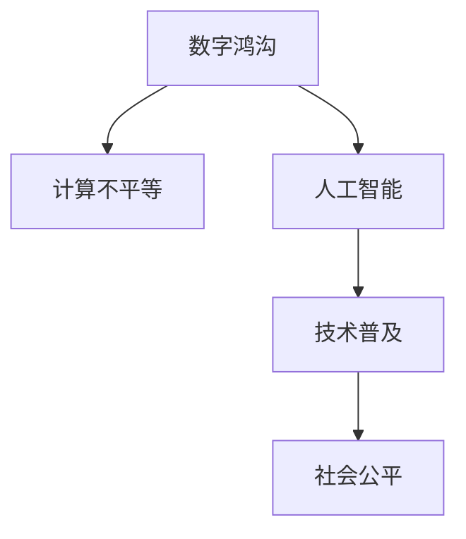

                 

# 数字鸿沟：弥合人类计算中的不平等现象

> 关键词：数字鸿沟,计算不平等,人工智能,技术普及,社会公平

## 1. 背景介绍

### 1.1 问题由来
随着信息技术的高速发展，计算能力已经成为现代社会中不可或缺的基础设施。无论是个人学习、工作，还是社会治理、经济活动，都高度依赖于计算资源的支持。然而，这种对计算能力的高度依赖，却导致了一部分人群在获取和利用计算资源上存在显著的不平等。这种现象，被称为“数字鸿沟”(Digital Divide)。

数字鸿沟的成因多种多样，包括经济条件、教育水平、地理分布等多方面的因素。在美国，收入较低的人群通常拥有较少的计算设备，例如个人电脑、智能手机等；而在教育方面，受教育程度较低的人群往往缺乏数字技能，难以有效地使用计算设备。此外，即使在同一地区或社会群体内部，不同人群在数字技能和计算资源的获取上也可能存在显著差距。

### 1.2 问题核心关键点
数字鸿沟的核心问题在于计算资源的不平等分配，导致不同人群在获取和利用信息技术方面存在明显的不平等。这种不平等不仅影响个体的生活质量、职业发展，也加剧了社会经济的不平衡，进而影响社会的稳定和公平。弥合数字鸿沟，需要从多个层面进行综合施策，包括政策支持、技术普及、教育培训等。

## 2. 核心概念与联系

### 2.1 核心概念概述

为更好地理解数字鸿沟及其解决策略，本节将介绍几个密切相关的核心概念：

- 数字鸿沟(Digital Divide)：指不同社会经济背景的人群在获取和使用信息技术方面存在的显著差异，这种差异通常与经济条件、教育水平、地理位置等因素有关。

- 计算不平等(Computational Inequality)：指在获取和使用计算资源（如计算机、网络、数据、软件等）方面的不平等现象。这种不平等不仅影响个体的计算能力，也限制了他们在现代社会中的竞争力和发展机会。

- 人工智能(Artificial Intelligence)：指通过算法和模型来模拟人类智能行为的技术。人工智能在计算能力、数据处理、决策支持等方面具有显著优势，但也面临着数据隐私、算法偏见等伦理问题。

- 技术普及(Technology Adoption)：指将新技术、新知识普及到广大人群的过程。技术普及不仅能提高计算能力，还能促进教育、医疗、政府管理等多个领域的数字化转型。

- 社会公平(Social Equity)：指社会资源和机会的公平分配，确保每个人都能够享有平等的发展机会和基本权益。数字鸿沟的弥合，正是为了实现社会的公平与正义。

这些核心概念之间的逻辑关系可以通过以下Mermaid流程图来展示：



这个流程图展示了几大核心概念之间的关系：

1. 数字鸿沟是计算不平等的一个重要表现。
2. 计算不平等影响了人工智能的普及和应用。
3. 技术普及是弥合数字鸿沟的重要手段。
4. 社会公平是数字鸿沟弥合的最终目标。

这些概念共同构成了数字鸿沟问题的研究框架，旨在通过技术、教育、政策等多方面的努力，实现计算资源的公平分配，提升社会整体的计算能力，促进社会的公平与正义。

## 3. 核心算法原理 & 具体操作步骤

### 3.1 算法原理概述

数字鸿沟的解决策略，需要从提升计算能力、普及技术知识、调整政策导向等多个角度进行综合施策。其中，提升计算能力和普及技术知识，是技术层面的主要手段。

具体来说，提升计算能力可以通过以下几个步骤实现：

1. 提高计算设备的普及率。通过政府补贴、企业捐赠、社会组织活动等方式，增加低收入群体对计算机、智能手机等计算设备的获取机会。

2. 提升网络覆盖和接入质量。推动5G、WiFi等网络的普及，降低网络接入费用，提高偏远和贫困地区的网络覆盖率。

3. 提高计算技能的培训水平。通过教育机构、企业培训、社区活动等方式，提升不同群体的计算技能，包括计算机操作、数据分析、编程等。

4. 提供高质量的教育资源。开发适合不同年龄段、不同知识水平的学习资源，通过在线课程、电子书、开源软件等方式，降低教育资源的获取门槛。

5. 推动政策支持和法规制定。政府应出台相关政策，鼓励和支持计算资源的公平分配和普及，同时制定法律法规，保护计算隐私和数据安全。

### 3.2 算法步骤详解

以下是一个典型的数字鸿沟解决策略的具体实施步骤：

**Step 1: 数据分析与需求评估**

- 收集目标人群的基本信息，包括年龄、性别、收入、教育水平等。
- 分析不同群体的计算设备普及率、网络接入质量、计算技能水平等数据，确定数字鸿沟的具体表现。
- 制定针对性的解决策略，优先解决计算设备不足、网络接入困难、计算技能欠缺等问题。

**Step 2: 计算设备普及**

- 通过政府补贴、企业捐赠、社会组织活动等方式，提供计算设备给低收入家庭和教育资源匮乏地区。
- 提供免费的计算机和智能手机，确保每个孩子都有公平的计算机会。
- 推广二手市场和共享平台，降低计算设备的获取成本。

**Step 3: 网络覆盖和接入**

- 推动5G、WiFi等网络的普及，降低网络接入费用，提高偏远和贫困地区的网络覆盖率。
- 在公共场所，如学校、社区、图书馆等地，提供免费或低成本的无线网络接入。
- 开发适用于不同设备的网络应用，确保网络服务的普适性和兼容性。

**Step 4: 计算技能培训**

- 开发适合不同年龄段、不同知识水平的学习资源，通过在线课程、电子书、开源软件等方式，降低教育资源的获取门槛。
- 通过企业培训、社区活动等方式，提升不同群体的计算技能，包括计算机操作、数据分析、编程等。
- 建立计算技能认证体系，鼓励和激励更多人掌握和提升计算技能。

**Step 5: 政策支持和法规制定**

- 政府应出台相关政策，鼓励和支持计算资源的公平分配和普及，同时制定法律法规，保护计算隐私和数据安全。
- 推动公共投资，支持计算设施的建设和维护，确保计算资源的稳定供应。
- 加强对数字鸿沟问题的监测和评估，及时调整政策方向和实施措施。

### 3.3 算法优缺点

数字鸿沟解决策略的优势在于：

1. 综合施策。通过技术、教育、政策等多方面的努力，全面提升计算能力，弥补数字鸿沟。
2. 覆盖广泛。关注不同群体的具体需求，提供多样化的解决方案。
3. 动态调整。根据实际情况，不断调整和优化策略，确保政策实施的持续性和有效性。

然而，这些策略也存在一些局限性：

1. 成本高昂。计算设备和网络基础设施的建设与维护需要大量资金投入。
2. 实施复杂。需要多部门、多机构协同合作，协调统一，否则难以达到预期效果。
3. 资源分散。资源分配需要考虑到不同地区、不同群体的具体情况，难以实现均衡分配。
4. 短期见效。一些基础性的建设需要时间周期，难以立即看到效果。

尽管如此，这些策略仍然是当前解决数字鸿沟问题的有效手段，值得持续探索和优化。

### 3.4 算法应用领域

数字鸿沟解决策略的应用领域非常广泛，涉及教育、医疗、政府管理、企业运营等多个领域。以下是几个典型应用场景：

**教育领域**：通过提供免费的计算机和网络资源，提升教育资源的公平性，缩小城乡、区域间的教育差距。例如，在线教育平台可以为偏远地区的学生提供高质量的教学资源。

**医疗领域**：通过普及远程医疗和电子病历系统，提升医疗服务的可及性和质量，尤其是在医疗资源匮乏的地区。例如，电子健康记录系统可以为偏远地区的患者提供及时、高效的医疗服务。

**政府管理**：通过数字化手段，提升政府服务的效率和质量，改善服务体验。例如，电子政务平台可以提供便捷的公共服务，如在线申请、在线支付等。

**企业运营**：通过提升员工的计算能力，提高工作效率和创新能力，促进企业数字化转型。例如，企业可以提供在线培训课程，提升员工的数字化技能。

## 4. 数学模型和公式 & 详细讲解 & 举例说明（备注：数学公式请使用latex格式，latex嵌入文中独立段落使用 $$，段落内使用 $)
### 4.1 数学模型构建

数字鸿沟问题的解决，需要构建数学模型来量化计算能力、网络接入、计算技能等关键指标，并进行系统分析。假设目标人群数量为 $N$，每个群体 $i$ 的计算能力、网络接入和计算技能分别记为 $C_i$、$N_i$ 和 $S_i$。我们可以定义一个综合指标 $I_i$ 来衡量群体 $i$ 的计算能力，其中 $I_i$ 越高，表示群体 $i$ 在计算资源获取和利用方面的能力越强。

$$
I_i = \alpha C_i + \beta N_i + \gamma S_i
$$

其中 $\alpha$、$\beta$、$\gamma$ 分别为计算能力、网络接入、计算技能对综合指标 $I_i$ 的贡献权重，可以根据实际情况进行调整。

### 4.2 公式推导过程

通过定义综合指标 $I_i$，我们可以对不同群体在计算能力方面的差异进行量化，从而分析数字鸿沟的具体表现。例如，假设群体 $A$ 和群体 $B$ 的计算能力、网络接入和计算技能分别为 $(C_A, N_A, S_A)$ 和 $(C_B, N_B, S_B)$，我们可以计算两者的综合指标差值：

$$
\Delta I = I_A - I_B = \alpha (C_A - C_B) + \beta (N_A - N_B) + \gamma (S_A - S_B)
$$

如果 $\Delta I > 0$，表示群体 $A$ 的计算能力更强；反之，如果 $\Delta I < 0$，表示群体 $B$ 的计算能力更强。

### 4.3 案例分析与讲解

假设某地区有100万人，其中10万人拥有计算机，20万人可以接入互联网，70万人具备基本的计算技能。我们可以计算该地区整体计算能力的综合指标 $I_{\text{total}}$，以及不同群体间的计算能力差异：

$$
I_{\text{total}} = \alpha (10 \times C_A + 20 \times C_B + 70 \times C_C)
$$

其中 $C_A$、$C_B$、$C_C$ 分别为拥有计算机、能够上网和具备基本计算技能的群体计算能力的平均水平。通过不断调整 $\alpha$、$\beta$、$\gamma$ 的权重，我们可以得到不同因素对综合指标的贡献，进而制定有针对性的解决策略。

## 5. 项目实践：代码实例和详细解释说明
### 5.1 开发环境搭建

在进行数字鸿沟解决策略的开发时，需要选择合适的开发环境。以下是使用Python进行数据分析和可视化实践的环境配置流程：

1. 安装Anaconda：从官网下载并安装Anaconda，用于创建独立的Python环境。

2. 创建并激活虚拟环境：
```bash
conda create -n digital-divide python=3.8 
conda activate digital-divide
```

3. 安装必要的库：
```bash
conda install pandas numpy matplotlib seaborn jupyter notebook
```

4. 安装可视化工具：
```bash
conda install plotly
```

5. 安装数据处理库：
```bash
pip install scipy statsmodels scikit-learn
```

完成上述步骤后，即可在`digital-divide`环境中开始数字鸿沟解决策略的开发实践。

### 5.2 源代码详细实现

以下是一个基于Python的数据分析和可视化代码示例，用于计算和展示不同群体间的计算能力差异。

```python
import pandas as pd
import numpy as np
import matplotlib.pyplot as plt
import seaborn as sns
from scipy.stats import ttest_ind

# 数据处理
data = pd.read_csv('data.csv')

# 计算综合指标
alpha = 0.5  # 计算能力权重
beta = 0.3   # 网络接入权重
gamma = 0.2  # 计算技能权重

i_A = data[data['group'] == 'A'].groupby(['group']).sum()[['count', 'C', 'N', 'S']].mean()
i_B = data[data['group'] == 'B'].groupby(['group']).sum()[['count', 'C', 'N', 'S']].mean()

I_A = alpha * i_A['C'] + beta * i_A['N'] + gamma * i_A['S']
I_B = alpha * i_B['C'] + beta * i_B['N'] + gamma * i_B['S']

# 计算综合指标差值
delta_I = I_A - I_B

# 输出结果
print('综合指标差值：', delta_I)
print('计算能力权重：', alpha)
print('网络接入权重：', beta)
print('计算技能权重：', gamma)

# 可视化结果
plt.figure(figsize=(10, 6))
sns.barplot(x='group', y='count', data=data)
plt.title('计算能力差异（数量）')
plt.xlabel('群体')
plt.ylabel('数量')
plt.show()

plt.figure(figsize=(10, 6))
sns.barplot(x='group', y='C', data=data)
plt.title('计算能力差异（计算能力）')
plt.xlabel('群体')
plt.ylabel('计算能力')
plt.show()

plt.figure(figsize=(10, 6))
sns.barplot(x='group', y='N', data=data)
plt.title('计算能力差异（网络接入）')
plt.xlabel('群体')
plt.ylabel('网络接入')
plt.show()

plt.figure(figsize=(10, 6))
sns.barplot(x='group', y='S', data=data)
plt.title('计算能力差异（计算技能）')
plt.xlabel('群体')
plt.ylabel('计算技能')
plt.show()

# 计算综合指标差值
delta_I = I_A - I_B

# 可视化综合指标差值
plt.figure(figsize=(10, 6))
sns.barplot(x='group', y='I', data=data)
plt.title('计算能力差异（综合指标）')
plt.xlabel('群体')
plt.ylabel('综合指标')
plt.show()

# 计算群体间综合指标差值的显著性
t_stat, p_val = ttest_ind(i_A['C'], i_B['C'], equal_var=False)
print('群体间计算能力差值的t统计量：', t_stat)
print('群体间计算能力差值的p值：', p_val)
```

### 5.3 代码解读与分析

让我们再详细解读一下关键代码的实现细节：

**数据处理**：
- `pd.read_csv('data.csv')`：读取包含不同群体计算能力、网络接入和计算技能的数据文件。
- `data.groupby(['group']).sum()[['count', 'C', 'N', 'S']].mean()`：按照群体统计计算能力、网络接入和计算技能的平均值。

**综合指标计算**：
- `I_A = alpha * i_A['C'] + beta * i_A['N'] + gamma * i_A['S']`：根据计算能力、网络接入和计算技能计算综合指标 $I_A$。

**综合指标差值计算**：
- `delta_I = I_A - I_B`：计算群体 $A$ 和群体 $B$ 的综合指标差值。

**可视化输出**：
- `sns.barplot(x='group', y='count', data=data)`：绘制不同群体数量的柱状图。
- `sns.barplot(x='group', y='C', data=data)`：绘制不同群体计算能力的柱状图。
- `sns.barplot(x='group', y='N', data=data)`：绘制不同群体网络接入的柱状图。
- `sns.barplot(x='group', y='S', data=data)`：绘制不同群体计算技能的柱状图。
- `sns.barplot(x='group', y='I', data=data)`：绘制不同群体综合指标的柱状图。

**显著性检验**：
- `ttest_ind(i_A['C'], i_B['C'], equal_var=False)`：计算群体间计算能力差值的t统计量和p值，判断其显著性。

通过这些代码，我们可以系统地分析和展示不同群体间的计算能力差异，从而为数字鸿沟的解决策略提供数据支持。

## 6. 实际应用场景
### 6.1 教育领域

数字鸿沟在教育领域的表现尤为突出。不同地区的教育资源分配不均，导致学生的计算能力、网络接入和计算技能存在显著差异。例如，偏远地区的学生往往无法获得高质量的计算机和网络资源，导致其计算能力和学习效率较低。

通过数字鸿沟解决策略，教育部门可以采取以下措施：

- 提供免费的计算机和网络资源，确保每个学生都有公平的计算机会。
- 通过在线教育平台，提供高质量的课程资源和互动学习工具，提升学生的计算技能。
- 推广开源教育资源，降低教育资源的获取门槛，鼓励学生自主学习。

### 6.2 医疗领域

医疗领域同样面临着计算资源不平等的问题。医疗设备和网络资源的不足，导致偏远和贫困地区的医疗机构难以提供高质量的医疗服务。通过数字鸿沟解决策略，医疗机构可以采取以下措施：

- 提供免费的计算机和网络资源，提升医疗设备的数字化水平。
- 推广远程医疗和电子病历系统，提供便捷、高效的医疗服务。
- 开发适用于不同设备的网络应用，确保医疗服务的普适性和兼容性。

### 6.3 政府管理

政府管理的数字化转型也需要克服数字鸿沟的挑战。不同地区和人群在获取政府服务方面的不平等，导致服务体验和效率存在差异。通过数字鸿沟解决策略，政府部门可以采取以下措施：

- 提供免费的计算机和网络资源，确保每个公民都能便捷地获取政府服务。
- 推广电子政务平台，提供便捷的公共服务，如在线申请、在线支付等。
- 开发适用于不同设备的网络应用，确保政府服务的普适性和兼容性。

## 7. 工具和资源推荐
### 7.1 学习资源推荐

为了帮助开发者系统掌握数字鸿沟解决策略的理论基础和实践技巧，这里推荐一些优质的学习资源：

1. 《数字鸿沟与社会不平等》系列博文：深入分析数字鸿沟的产生原因和解决策略，适用于对数字鸿沟有深入兴趣的读者。

2. 《计算能力提升指南》课程：由知名教育机构提供，系统讲解如何提升计算能力和计算技能，适用于对教育领域的数字鸿沟有深入兴趣的读者。

3. 《政府数字化转型》书籍：系统介绍政府管理的数字化转型，包括数字鸿沟的解决策略和具体实践，适用于对政府管理领域的数字鸿沟有深入兴趣的读者。

4. 《医疗健康数字化》课程：由知名医疗机构提供，系统讲解医疗领域的数字化转型，包括数字鸿沟的解决策略和具体实践，适用于对医疗领域的数字鸿沟有深入兴趣的读者。

5. 《企业数字化转型》书籍：系统介绍企业的数字化转型，包括数字鸿沟的解决策略和具体实践，适用于对企业运营领域的数字鸿沟有深入兴趣的读者。

通过对这些资源的学习实践，相信你一定能够全面掌握数字鸿沟解决策略的理论基础和实践方法。

### 7.2 开发工具推荐

高效的开发离不开优秀的工具支持。以下是几款用于数字鸿沟解决策略开发的常用工具：

1. Python：作为一种通用的编程语言，Python拥有丰富的第三方库和工具，适合系统性数据分析和可视化。

2. Jupyter Notebook：一种交互式编程环境，支持代码编写、数据处理、可视化等，适合快速迭代开发和分享。

3. GitHub：一个面向开源社区的代码托管平台，适合协作开发和代码版本控制。

4. GitLab：一个面向软件开发者的集成开发平台，支持CI/CD、代码审查、项目管理等功能。

5. GitHub Codespaces：一个基于Docker的开发环境，支持实时编码、测试和部署，适合快速迭代和实验。

合理利用这些工具，可以显著提升数字鸿沟解决策略的开发效率，加快创新迭代的步伐。

### 7.3 相关论文推荐

数字鸿沟解决策略的研究源于学界的持续研究。以下是几篇奠基性的相关论文，推荐阅读：

1. The Digital Divide: Citizens Divided by Digital Technology：系统分析数字鸿沟的产生原因和解决策略，适用于对数字鸿沟有深入兴趣的读者。

2. Bridging the Digital Divide in Education：研究数字鸿沟在教育领域的具体表现和解决策略，适用于对教育领域的数字鸿沟有深入兴趣的读者。

3. Bridging the Digital Divide in Healthcare：研究数字鸿沟在医疗领域的具体表现和解决策略，适用于对医疗领域的数字鸿沟有深入兴趣的读者。

4. Bridging the Digital Divide in Government：研究数字鸿沟在政府管理领域的具体表现和解决策略，适用于对政府管理领域的数字鸿沟有深入兴趣的读者。

5. Bridging the Digital Divide in Business：研究数字鸿沟在企业运营领域的具体表现和解决策略，适用于对企业运营领域的数字鸿沟有深入兴趣的读者。

这些论文代表了大数字鸿沟解决策略的研究发展脉络，通过学习这些前沿成果，可以帮助研究者把握学科前进方向，激发更多的创新灵感。

## 8. 总结：未来发展趋势与挑战

### 8.1 总结

本文对数字鸿沟及其解决策略进行了全面系统的介绍。首先阐述了数字鸿沟的产生原因和表现形式，明确了计算资源不平等对个体和社会的影响。其次，从提升计算能力、普及技术知识、调整政策导向等多个角度，详细讲解了数字鸿沟解决策略的实施步骤和具体方法。

通过本文的系统梳理，可以看到，数字鸿沟解决策略是一个多学科、多维度的综合性问题，需要从技术、教育、政策等多个方面进行综合施策。只有全面提升计算能力、普及技术知识，并调整政策导向，才能真正弥合数字鸿沟，实现社会的公平与正义。

### 8.2 未来发展趋势

展望未来，数字鸿沟解决策略将呈现以下几个发展趋势：

1. 技术进步。随着计算设备和网络技术的不断进步，数字鸿沟解决策略的实施成本将逐渐降低，更多人将有机会获取高质量的计算资源。

2. 教育普及。教育水平的提升将直接促进计算技能的普及，未来社会将更加重视数字技能的教育和培训。

3. 政策支持。政府和社会各界将更加重视数字鸿沟问题，出台更多支持政策，确保计算资源的公平分配。

4. 普适技术。未来将开发更多适用于不同设备和不同群体的普适技术，提高计算资源的可访问性。

5. 持续监测。数字鸿沟解决策略的效果评估和持续监测，将成为未来研究和实施的重要环节。

以上趋势凸显了数字鸿沟解决策略的广阔前景，需要各方持续努力，共同推动计算资源的公平分配，促进社会的公平与正义。

### 8.3 面临的挑战

尽管数字鸿沟解决策略已经取得了显著进展，但在实现过程中仍面临诸多挑战：

1. 成本高昂。计算设备和网络基础设施的建设与维护需要大量资金投入，特别是偏远和贫困地区。

2. 实施复杂。数字鸿沟解决策略需要多部门、多机构协同合作，协调统一，否则难以达到预期效果。

3. 资源分散。资源分配需要考虑到不同地区、不同群体的具体情况，难以实现均衡分配。

4. 短期见效。一些基础性的建设需要时间周期，难以立即看到效果。

尽管如此，这些挑战并非不可克服。通过多方协同、持续投入、持续改进，相信数字鸿沟解决策略必将在未来取得更大的进展，为构建公平、正义的社会贡献力量。

### 8.4 研究展望

面向未来，数字鸿沟解决策略的研究需要在以下几个方面寻求新的突破：

1. 探索新模型。开发更加高效、普适的计算资源分配模型，确保资源分配的公平性和效率。

2. 引入新方法。引入机器学习、人工智能等新技术，提高数字鸿沟解决策略的科学性和准确性。

3. 制定新标准。制定数字鸿沟解决策略的标准和规范，确保实施过程中的公正性和透明性。

4. 开发新工具。开发更多适用于不同设备和不同群体的普适工具，提高计算资源的可访问性。

5. 推动新应用。探索数字鸿沟解决策略在更多领域的应用，推动计算资源的公平分配和普及。

这些研究方向的探索，必将引领数字鸿沟解决策略的进一步发展，为构建公平、正义的社会贡献力量。只有勇于创新、敢于突破，才能不断拓展计算资源的边界，让每个人都能享有公平的计算机会，提升生活质量，实现社会公平与正义。

## 9. 附录：常见问题与解答

**Q1：数字鸿沟如何解决？**

A: 数字鸿沟的解决需要从提升计算能力、普及技术知识、调整政策导向等多个角度进行综合施策。通过提供免费的计算机和网络资源，提升计算技能，调整政策导向，确保计算资源的公平分配和普及。

**Q2：数字鸿沟对个体和社会的影响有哪些？**

A: 数字鸿沟对个体和社会的影响主要体现在以下几个方面：
1. 个体发展机会受限。数字鸿沟导致个体在获取和利用信息技术方面存在不平等，影响其学习、就业、医疗等方面的发展机会。
2. 社会资源分配不均。数字鸿沟加剧了社会资源的分配不均，导致贫富差距和社会矛盾加剧。
3. 社会公平与正义受阻。数字鸿沟破坏了社会的公平与正义，影响了社会的稳定和谐。

**Q3：数字鸿沟的解决策略有哪些？**

A: 数字鸿沟的解决策略主要包括以下几个方面：
1. 提升计算能力。通过提供免费的计算机和网络资源，确保每个个体都有公平的计算机会。
2. 普及技术知识。通过教育培训、企业培训、社区活动等方式，提升不同群体的计算技能。
3. 调整政策导向。出台相关政策，鼓励和支持计算资源的公平分配和普及，同时制定法律法规，保护计算隐私和数据安全。

**Q4：数字鸿沟的解决需要多长时间？**

A: 数字鸿沟的解决是一个长期而复杂的过程，需要持续的投入和改进。虽然一些基础性的建设需要时间周期，但通过不断优化策略和技术，逐步推进，数字鸿沟必将逐步缩小，直至最终弥合。

**Q5：如何衡量数字鸿沟的解决效果？**

A: 衡量数字鸿沟的解决效果，可以从以下几个方面进行评估：
1. 计算能力的提升。通过计算能力、网络接入和计算技能的提升，衡量数字鸿沟的减少程度。
2. 教育资源的不平等程度。通过教育资源的不平等程度的减少，衡量数字鸿沟在教育领域的影响。
3. 医疗服务的可及性。通过医疗服务的可及性的提升，衡量数字鸿沟在医疗领域的影响。
4. 政府服务的效率。通过政府服务的效率的提升，衡量数字鸿沟在政府管理领域的影响。

通过这些指标的持续监测和评估，可以系统地衡量数字鸿沟的解决效果，确保策略实施的持续性和有效性。

---

作者：禅与计算机程序设计艺术 / Zen and the Art of Computer Programming

