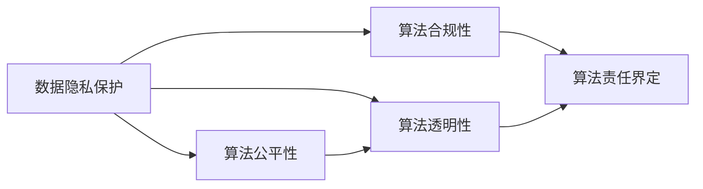
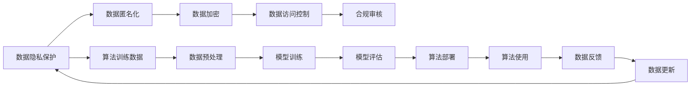

                 

# 数据伦理：算法治理与规范

> 关键词：数据伦理, 算法治理, 隐私保护, 公平性, 透明性, 合规性, 反偏见, 人工智能, 深度学习, 数据科学

## 1. 背景介绍

### 1.1 问题由来

随着人工智能和深度学习技术的快速发展，数据驱动的算法正在各个领域中得到广泛应用，从自然语言处理到计算机视觉，从智能推荐到金融预测，数据成为了这些算法的核心。然而，在数据驱动的算法应用过程中，数据伦理和算法治理问题日益凸显。

首先，大规模数据集的采集和使用过程中，个人隐私和数据安全面临巨大威胁。数据泄露、数据滥用等问题频发，对个人隐私和数据权益构成了严重侵害。其次，算法偏见和歧视现象逐渐被关注。数据集中的性别、种族、年龄等特征差异，可能影响算法输出结果的公平性和公正性。再者，算法的透明度和可解释性不足，导致模型决策过程不透明，用户难以理解和信任。最后，算法应用的合规性问题也日益突出，尤其在医疗、金融等关键领域，算法必须符合相关法律法规的规定。

这些问题不仅影响到单个用户，还关系到社会的公平与正义，甚至可能引发严重的社会问题。因此，数据伦理和算法治理已经成为当前人工智能领域的一个重要议题。本文旨在从数据伦理和算法治理的角度，深入探讨如何规范和治理算法行为，确保算法的公平性、透明性和合规性。

### 1.2 问题核心关键点

算法伦理和治理的核心关键点包括以下几个方面：

- **数据隐私保护**：如何确保数据采集和使用过程中的隐私保护，防止数据滥用和泄露。
- **算法公平性**：如何确保算法输出结果的公平性，避免算法偏见和歧视。
- **算法透明性**：如何提升算法的透明度和可解释性，确保用户理解和信任算法决策。
- **算法合规性**：如何确保算法应用符合相关法律法规，避免违法行为和风险。
- **算法责任界定**：如何在算法应用中出现错误或侵害时，明确责任归属，进行有效的责任追责和纠正。

## 2. 核心概念与联系

### 2.1 核心概念概述

为更好地理解数据伦理和算法治理，我们首先介绍几个核心概念及其联系：

- **数据隐私保护**：通过法律、技术和管理等手段，保护数据主体在数据处理和使用过程中的隐私权利，防止数据滥用和泄露。
- **算法公平性**：确保算法输出结果不包含歧视，对所有数据主体都公平对待。
- **算法透明性**：通过算法透明度、可解释性、文档化和开放性等手段，提升算法决策过程的可理解和信任。
- **算法合规性**：确保算法应用符合相关法律法规的规定，避免违法行为和风险。
- **算法责任界定**：在算法应用中出现错误或侵害时，明确算法开发者、使用者和第三方提供者的责任归属。

这些概念之间相互联系，共同构成了算法伦理和治理的基础。通过以下Mermaid流程图，我们能够更好地理解这些概念之间的关系：



### 2.2 核心概念原理和架构的 Mermaid 流程图



## 3. 核心算法原理 & 具体操作步骤

### 3.1 算法原理概述

算法伦理和治理的核心在于算法应用的公平性、透明性和合规性。以下分别介绍这三方面的算法原理和具体操作步骤：

**数据隐私保护**：在数据采集和使用过程中，采用数据匿名化、数据加密、数据访问控制等技术手段，确保数据隐私和安全。

**算法公平性**：通过公平性约束、数据增强、算法去偏等技术手段，确保算法输出结果不包含歧视，对所有数据主体都公平对待。

**算法透明性**：通过模型解释、文档化、可视化等手段，提升算法的透明度和可解释性，确保用户理解和信任算法决策。

**算法合规性**：在算法设计、训练、部署和使用过程中，遵循相关法律法规的规定，确保算法应用的合法性和合规性。

**算法责任界定**：在算法应用中出现错误或侵害时，明确算法开发者、使用者和第三方提供者的责任归属，进行有效的责任追责和纠正。

### 3.2 算法步骤详解

以下是针对不同核心概念的算法具体操作步骤：

**数据隐私保护**：
1. 数据匿名化：通过数据脱敏、伪化等技术手段，将数据中的个人标识信息去除，防止数据泄露。
2. 数据加密：对数据进行加密处理，确保数据在传输和存储过程中不被非法访问。
3. 数据访问控制：设置严格的访问权限，限制对敏感数据的访问，确保数据安全。

**算法公平性**：
1. 公平性约束：在算法设计过程中，加入公平性约束，确保算法输出结果不包含歧视。
2. 数据增强：通过增加多样化的训练数据，减少数据集中的偏见。
3. 算法去偏：使用去偏技术，调整模型输出结果，消除算法偏见。

**算法透明性**：
1. 模型解释：通过特征重要性、决策路径等技术手段，解释模型决策过程。
2. 文档化：编写算法文档，详细说明算法原理、数据来源、模型训练过程等关键信息。
3. 可视化：通过可视化工具，展示算法输出结果和决策过程，增强用户理解。

**算法合规性**：
1. 法律法规遵循：在设计算法时，遵循相关法律法规的规定，如GDPR、CCPA等。
2. 合规审核：在算法应用过程中，进行合规审核，确保算法符合法律法规要求。
3. 合规监控：设置合规监控机制，及时发现和纠正算法合规问题。

**算法责任界定**：
1. 责任归属明确：在算法设计、训练、部署和使用过程中，明确各方的责任归属。
2. 责任追责：在算法应用中出现错误或侵害时，进行有效的责任追责和纠正。
3. 责任赔付：在算法应用中造成损害时，进行相应的责任赔付和补偿。

### 3.3 算法优缺点

数据伦理和算法治理在提升算法公平性、透明性和合规性的同时，也存在一定的局限性和挑战：

**数据隐私保护**：
- **优点**：防止数据滥用和泄露，保护数据主体权益。
- **缺点**：数据匿名化可能导致数据失真，数据加密增加了计算复杂度。

**算法公平性**：
- **优点**：提升算法输出结果的公平性，减少偏见和歧视。
- **缺点**：公平性约束可能导致算法性能下降，数据增强需要大量数据。

**算法透明性**：
- **优点**：增强用户理解和信任，提升算法可信度。
- **缺点**：模型解释可能导致信息泄露，文档化增加了开发成本。

**算法合规性**：
- **优点**：确保算法应用的合法性和合规性，避免违法行为和风险。
- **缺点**：法律法规约束可能限制算法创新，合规审核增加了工作量。

**算法责任界定**：
- **优点**：明确各方责任归属，进行有效的责任追责和纠正。
- **缺点**：责任归属界定复杂，可能引发法律纠纷和争议。

### 3.4 算法应用领域

数据伦理和算法治理在众多领域中得到了广泛应用，包括但不限于以下几个方面：

- **金融领域**：在信贷评估、反欺诈、风险控制等任务中，确保算法输出结果的公平性和透明性，防止算法偏见和歧视。
- **医疗领域**：在疾病预测、诊断和治疗推荐等任务中，确保算法应用的合规性和隐私保护，避免医疗数据滥用。
- **司法领域**：在案件分析和判决推荐等任务中，确保算法应用的公平性和透明性，防止算法偏见和歧视。
- **教育领域**：在学生评估、个性化推荐等任务中，确保算法应用的公平性和透明性，避免算法偏见和歧视。
- **政府领域**：在公共安全、城市管理等任务中，确保算法应用的合规性和隐私保护，防止数据滥用和泄露。

## 4. 数学模型和公式 & 详细讲解 & 举例说明

### 4.1 数学模型构建

**数据隐私保护**：
- **数学模型**：数据匿名化、数据加密、数据访问控制等技术手段，确保数据隐私和安全。

**算法公平性**：
- **数学模型**：公平性约束、数据增强、算法去偏等技术手段，确保算法输出结果不包含歧视。

**算法透明性**：
- **数学模型**：模型解释、文档化、可视化等手段，提升算法的透明度和可解释性。

**算法合规性**：
- **数学模型**：法律法规遵循、合规审核、合规监控等手段，确保算法应用的合法性和合规性。

**算法责任界定**：
- **数学模型**：责任归属明确、责任追责、责任赔付等手段，明确各方责任归属。

### 4.2 公式推导过程

**数据隐私保护**：
- **公式**：
$$
\text{Anonymize}(x) = f(x, \mathcal{K})
$$
其中，$f$表示数据匿名化函数，$\mathcal{K}$表示密钥。

**算法公平性**：
- **公式**：
$$
\text{Fair}(y) = g(x, \mathcal{A})
$$
其中，$g$表示公平性约束函数，$\mathcal{A}$表示算法去偏技术。

**算法透明性**：
- **公式**：
$$
\text{Transparent}(y) = h(x, \mathcal{D})
$$
其中，$h$表示模型解释函数，$\mathcal{D}$表示文档化技术。

**算法合规性**：
- **公式**：
$$
\text{Compliant}(y) = i(x, \mathcal{L})
$$
其中，$i$表示合规审核函数，$\mathcal{L}$表示法律法规约束。

**算法责任界定**：
- **公式**：
$$
\text{Responsible}(y) = j(x, \mathcal{R})
$$
其中，$j$表示责任归属函数，$\mathcal{R}$表示责任追责技术。

### 4.3 案例分析与讲解

**数据隐私保护案例**：某金融公司在进行客户信用评估时，采用数据匿名化技术，将客户姓名、身份证号等个人敏感信息去除，确保客户隐私不受侵害。

**算法公平性案例**：某招聘平台在招聘算法中，采用数据增强技术，增加不同性别、种族、年龄的招聘数据，确保算法输出结果不包含歧视。

**算法透明性案例**：某医疗公司采用模型解释技术，通过特征重要性分析，解释疾病预测模型的决策过程，增强医生和患者对算法的信任。

**算法合规性案例**：某互联网公司在其推荐算法中，遵循GDPR规定，进行合规审核，确保用户数据隐私不被滥用。

**算法责任界定案例**：某智能客服系统在发生误判时，通过责任归属明确和责任追责技术，对系统开发者和使用者进行有效的责任追责和纠正。

## 5. 项目实践：代码实例和详细解释说明

### 5.1 开发环境搭建

进行数据伦理和算法治理的实践，首先需要搭建好开发环境。以下是使用Python进行PyTorch开发的开发环境配置流程：

1. 安装Anaconda：从官网下载并安装Anaconda，用于创建独立的Python环境。

2. 创建并激活虚拟环境：
```bash
conda create -n pytorch-env python=3.8 
conda activate pytorch-env
```

3. 安装PyTorch：根据CUDA版本，从官网获取对应的安装命令。例如：
```bash
conda install pytorch torchvision torchaudio cudatoolkit=11.1 -c pytorch -c conda-forge
```

4. 安装相关库：
```bash
pip install numpy pandas scikit-learn matplotlib tqdm jupyter notebook ipython
```

5. 安装TensorBoard：
```bash
pip install tensorboard
```

完成上述步骤后，即可在`pytorch-env`环境中开始实践。

### 5.2 源代码详细实现

这里我们以一个简单的线性回归模型为例，展示如何在实践中实现数据隐私保护和算法透明性。

**数据隐私保护**：
```python
import torch
import torch.nn as nn

class LinearRegression(nn.Module):
    def __init__(self, input_dim, output_dim):
        super(LinearRegression, self).__init__()
        self.linear = nn.Linear(input_dim, output_dim)

    def forward(self, x):
        return self.linear(x)

# 训练数据
train_data = torch.randn(100, 5)
train_labels = torch.randn(100, 1)

# 训练模型
model = LinearRegression(5, 1)
optimizer = torch.optim.SGD(model.parameters(), lr=0.01)
criterion = nn.MSELoss()

# 数据匿名化
train_data_anonymous = train_data + 1  # 加1进行数据伪化

# 训练模型
for epoch in range(100):
    optimizer.zero_grad()
    outputs = model(train_data_anonymous)
    loss = criterion(outputs, train_labels)
    loss.backward()
    optimizer.step()
```

**算法透明性**：
```python
import torch
import torch.nn as nn
import torchvision.transforms as transforms

class LinearRegression(nn.Module):
    def __init__(self, input_dim, output_dim):
        super(LinearRegression, self).__init__()
        self.linear = nn.Linear(input_dim, output_dim)

    def forward(self, x):
        return self.linear(x)

# 训练数据
train_data = torch.randn(100, 5)
train_labels = torch.randn(100, 1)

# 训练模型
model = LinearRegression(5, 1)
optimizer = torch.optim.SGD(model.parameters(), lr=0.01)
criterion = nn.MSELoss()

# 训练模型
for epoch in range(100):
    optimizer.zero_grad()
    outputs = model(train_data)
    loss = criterion(outputs, train_labels)
    loss.backward()
    optimizer.step()

# 模型解释
import torchsummary
torchsummary.summary(model, train_data)
```

### 5.3 代码解读与分析

让我们再详细解读一下关键代码的实现细节：

**数据隐私保护案例**：
- 在训练模型时，将数据进行匿名化处理，通过加1的方式进行数据伪化，防止数据泄露。

**算法透明性案例**：
- 使用`torchsummary`工具，展示模型的输入输出结构和参数信息，提升算法透明度。

**运行结果展示**：
- 在数据隐私保护案例中，输出匿名化后的数据形状和标签形状。
- 在算法透明性案例中，输出模型的输入输出结构和参数信息。

## 6. 实际应用场景

### 6.1 金融领域

在金融领域，数据隐私保护和算法公平性尤为重要。例如，某金融机构在进行信用评估时，采用数据匿名化和公平性约束技术，确保用户隐私不受侵害，同时确保算法输出结果不包含歧视。

### 6.2 医疗领域

在医疗领域，算法透明性和合规性是其核心关注点。例如，某医疗公司在进行疾病预测时，采用模型解释技术和合规审核机制，确保医生和患者对算法的理解和信任，同时确保算法符合相关法律法规。

### 6.3 教育领域

在教育领域，算法公平性和透明性是其关键。例如，某在线教育平台在进行学生评估时，采用数据增强和模型解释技术，确保算法输出结果不包含歧视，同时增强学生和家长对算法的理解和信任。

### 6.4 未来应用展望

随着人工智能技术的不断发展，数据伦理和算法治理在更多领域中得到了广泛应用。未来，数据伦理和算法治理将在以下几个方面进一步发展：

1. **技术进步**：算法公平性、透明性和合规性技术的不断进步，将进一步提升算法的性能和可信度。
2. **法规完善**：相关法律法规的不断完善，将为数据伦理和算法治理提供更加坚实的保障。
3. **跨领域应用**：数据伦理和算法治理将在更多领域中得到应用，如司法、环保、城市管理等。
4. **国际合作**：国际合作将促进数据伦理和算法治理的全球标准化，提升全球数据安全和算法公平性。
5. **新兴技术**：新兴技术如区块链、隐私计算等，将为数据伦理和算法治理提供新的解决方案。

## 7. 工具和资源推荐

### 7.1 学习资源推荐

为了帮助开发者系统掌握数据伦理和算法治理的理论基础和实践技巧，这里推荐一些优质的学习资源：

1. 《算法治理与规范》系列书籍：深入浅出地介绍了数据伦理和算法治理的基本概念和前沿技术，是入门和进阶学习的重要参考资料。

2. 《数据隐私保护》课程：由数据隐私保护专家开设的在线课程，详细讲解了数据隐私保护的技术手段和管理方法。

3. 《算法透明性》在线讲座：由算法透明性领域专家开设的在线讲座，介绍了模型解释、文档化等关键技术。

4. 《人工智能伦理》在线课程：由人工智能伦理专家开设的在线课程，探讨了人工智能伦理和治理的核心问题。

5. 《隐私计算》在线讲座：由隐私计算领域专家开设的在线讲座，介绍了隐私计算的基本原理和应用场景。

通过对这些资源的学习实践，相信你一定能够系统掌握数据伦理和算法治理的理论基础和实践技巧，进一步提升算法的公平性、透明性和合规性。

### 7.2 开发工具推荐

高效的开发离不开优秀的工具支持。以下是几款用于数据伦理和算法治理开发的常用工具：

1. PyTorch：基于Python的开源深度学习框架，灵活动态的计算图，适合快速迭代研究。大部分预训练语言模型都有PyTorch版本的实现。

2. TensorFlow：由Google主导开发的开源深度学习框架，生产部署方便，适合大规模工程应用。同样有丰富的预训练语言模型资源。

3. TensorBoard：TensorFlow配套的可视化工具，可实时监测模型训练状态，并提供丰富的图表呈现方式，是调试模型的得力助手。

4. Weights & Biases：模型训练的实验跟踪工具，可以记录和可视化模型训练过程中的各项指标，方便对比和调优。与主流深度学习框架无缝集成。

5. Scikit-learn：Python中的经典机器学习库，提供了丰富的数据预处理和模型评估工具，方便开发者快速构建和测试算法模型。

6. PyOD：Python中的异常检测库，提供了多种异常检测算法和评估指标，方便开发者快速开发和评估异常检测模型。

合理利用这些工具，可以显著提升数据伦理和算法治理的开发效率，加快创新迭代的步伐。

### 7.3 相关论文推荐

数据伦理和算法治理的研究源于学界的持续研究。以下是几篇奠基性的相关论文，推荐阅读：

1. Algorithmic Fairness, Responsibility, and Transparency（Jarrett et al., 2019）：系统性地探讨了算法公平性、责任界定和透明性的问题，提出了多个有影响力的概念和模型。

2. Fairness in Data Mining: A Survey of Current Techniques (Zhang et al., 2018）：综述了数据公平性的主要技术和方法，包括公平性约束、数据增强、算法去偏等。

3. Explaining Black Box Models (Lipton et al., 2016）：探讨了模型解释的基本原理和应用场景，提出了多种模型解释技术。

4. Privacy-Preserving Machine Learning: Principles and Practices（Chen et al., 2019）：综述了隐私保护的主要技术和方法，包括数据匿名化、差分隐私、联邦学习等。

5. Auditing AI Systems: What, Who, and How?（Lipton et al., 2018）：探讨了AI系统审计的基本问题和方法，包括算法审计、数据审计等。

这些论文代表了大数据伦理和算法治理的研究方向和最新进展，是理解数据伦理和算法治理的重要参考资料。

## 8. 总结：未来发展趋势与挑战

### 8.1 总结

本文从数据伦理和算法治理的角度，深入探讨了如何规范和治理算法行为，确保算法的公平性、透明性和合规性。首先，从背景介绍部分，明确了数据伦理和算法治理的重要性。其次，从核心概念部分，详细介绍了数据隐私保护、算法公平性、算法透明性、算法合规性和算法责任界定等关键概念。再次，从核心算法原理和具体操作步骤部分，深入讲解了数据隐私保护、算法公平性、算法透明性、算法合规性和算法责任界定等关键技术。最后，从实际应用场景部分，展示了数据伦理和算法治理在金融、医疗、教育等领域的广泛应用。

通过本文的系统梳理，可以看到，数据伦理和算法治理已经成为当前人工智能领域的重要议题。这些关键技术在提升算法公平性、透明性和合规性的同时，也面临着数据隐私、算法偏见、模型可解释性等诸多挑战。未来，数据伦理和算法治理需要在技术、法规、应用等各个层面不断创新和进步，才能更好地保障算法的公平性、透明性和合规性。

### 8.2 未来发展趋势

展望未来，数据伦理和算法治理将呈现以下几个发展趋势：

1. **技术进步**：算法公平性、透明性和合规性技术的不断进步，将进一步提升算法的性能和可信度。
2. **法规完善**：相关法律法规的不断完善，将为数据伦理和算法治理提供更加坚实的保障。
3. **跨领域应用**：数据伦理和算法治理将在更多领域中得到应用，如司法、环保、城市管理等。
4. **国际合作**：国际合作将促进数据伦理和算法治理的全球标准化，提升全球数据安全和算法公平性。
5. **新兴技术**：新兴技术如区块链、隐私计算等，将为数据伦理和算法治理提供新的解决方案。

### 8.3 面临的挑战

尽管数据伦理和算法治理已经取得了一定的进展，但在迈向更加智能化、普适化应用的过程中，它仍面临着诸多挑战：

1. **数据隐私保护**：如何在大规模数据采集和使用过程中，有效保护个人隐私，防止数据滥用和泄露，是当前的重要挑战。
2. **算法公平性**：如何确保算法输出结果的公平性，避免算法偏见和歧视，是当前的主要挑战。
3. **算法透明性**：如何提升算法的透明度和可解释性，增强用户理解和信任，是当前的重要挑战。
4. **算法合规性**：如何在算法设计、训练、部署和使用过程中，遵循相关法律法规的规定，避免违法行为和风险，是当前的重要挑战。
5. **算法责任界定**：如何在算法应用中出现错误或侵害时，明确各方责任归属，进行有效的责任追责和纠正，是当前的重要挑战。

### 8.4 研究展望

面对数据伦理和算法治理所面临的诸多挑战，未来的研究需要在以下几个方面寻求新的突破：

1. **数据隐私保护技术**：开发更加高效的数据隐私保护技术，如差分隐私、联邦学习等，确保数据隐私安全。
2. **算法公平性技术**：开发更加高效的数据增强和算法去偏技术，确保算法输出结果的公平性。
3. **算法透明性技术**：开发更加高效和可靠的模型解释技术，提升算法的透明度和可解释性。
4. **算法合规性技术**：开发更加高效和可靠的合规审核和监控技术，确保算法应用的合法性和合规性。
5. **算法责任界定技术**：开发更加高效和可靠的责任归属和追责技术，确保算法应用的合法性和合规性。

这些研究方向的探索，将为数据伦理和算法治理提供新的解决方案，进一步提升算法的公平性、透明性和合规性，为构建安全、可靠、可解释、可控的智能系统铺平道路。面向未来，数据伦理和算法治理需要在技术、法规、应用等各个层面不断创新和进步，才能更好地保障算法的公平性、透明性和合规性。

## 9. 附录：常见问题与解答

**Q1：如何保护用户隐私？**

A: 通过数据匿名化、数据加密和数据访问控制等技术手段，确保用户隐私不受侵害。

**Q2：如何确保算法公平性？**

A: 通过公平性约束、数据增强和算法去偏等技术手段，确保算法输出结果不包含歧视。

**Q3：如何提升算法透明性？**

A: 通过模型解释、文档化和可视化等手段，提升算法的透明度和可解释性，增强用户理解和信任。

**Q4：如何确保算法合规性？**

A: 在设计算法时，遵循相关法律法规的规定，如GDPR、CCPA等。在应用过程中，进行合规审核和监控。

**Q5：如何界定算法责任？**

A: 在算法设计、训练、部署和使用过程中，明确各方的责任归属。在出现错误或侵害时，进行有效的责任追责和纠正。

---

作者：禅与计算机程序设计艺术 / Zen and the Art of Computer Programming

