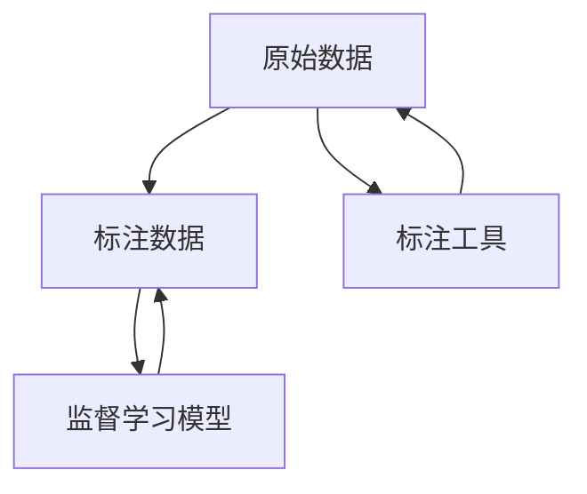

                 

# 数据标注：人工智能背后的无名英雄

> 关键词：数据标注, 人工智能, 机器学习, 深度学习, 模型训练, 语义理解, 自然语言处理, 知识图谱

## 1. 背景介绍

### 1.1 问题由来

人工智能（AI）技术在各个领域的应用正逐渐走向深入。从语音识别到图像分类，从自动驾驶到智能推荐，深度学习模型的卓越性能在很大程度上归功于大规模、高质量的数据训练。然而，这些数据通常需要经过繁琐的标注过程，才能被模型利用。数据标注不仅是人工智能开发的关键环节，也是耗时耗力、成本高昂的瓶颈之一。因此，深入理解数据标注的重要性、面临的挑战以及如何优化这一过程，对于推动AI技术的普及和应用至关重要。

### 1.2 问题核心关键点

数据标注之所以被视为“人工智能背后的无名英雄”，主要有以下几点原因：

- **数据质量直接影响模型性能**：标注数据的质量和多样性直接决定了模型的学习效果。低质量或偏差的数据会导致模型泛化能力差，影响最终的预测准确性。
- **标注工作量大且复杂**：高质量标注通常需要标注专家耗费大量时间和精力，尤其是在自然语言处理（NLP）、计算机视觉等领域，标注任务具有高度的复杂性和主观性。
- **成本高昂**：标注过程往往需要投入大量人力和资源，尤其是对于大规模数据集和复杂任务，成本甚至可能超过模型的训练成本。
- **需求量大且紧迫**：随着AI技术的不断进步，对标注数据的需求也在不断增加，尤其是在新兴应用领域，数据标注往往成为制约技术发展的关键因素。

## 2. 核心概念与联系

### 2.1 核心概念概述

数据标注是人工智能技术中不可或缺的一部分，它涉及从原始数据中提取有用的信息，并将其转化为机器可以理解的形式。这一过程包括标注数据的收集、清洗、预处理、编码以及监督学习模型的训练等环节。以下是一些核心概念及其之间的联系：

- **原始数据**：从各种来源收集的原始数据，包括文本、图像、音频、视频等。
- **标注数据**：原始数据经过标注专家的人工处理，添加了标签、类别、边界框等有用信息。
- **标注工具**：用于数据标注的软件工具，包括图像标注工具、文本标注工具等。
- **监督学习模型**：利用标注数据进行训练的机器学习模型，如线性回归、决策树、支持向量机、深度神经网络等。
- **标注标准**：为确保标注数据的一致性和质量，制定的标注规范和标准。
- **数据集划分**：将标注数据划分为训练集、验证集和测试集，供模型训练、调参和评估使用。

这些核心概念之间的联系可以通过以下Mermaid流程图来展示：



这个流程图展示了数据标注的主要流程：从原始数据到标注数据的生成，再到监督学习模型的训练和评估。标注数据是连接原始数据和模型的桥梁，确保了模型的训练质量和性能。

## 3. 核心算法原理 & 具体操作步骤
### 3.1 算法原理概述

数据标注的原理是利用人类专家的知识和经验，从原始数据中提取有用的信息，并将其转化为机器可理解的形式。这一过程通常包括以下几个步骤：

1. **数据收集**：从各种来源收集原始数据，如自然语言文本、图像、音频、视频等。
2. **数据清洗**：对原始数据进行清洗，去除噪声、冗余和异常值，保证数据质量。
3. **数据预处理**：对清洗后的数据进行标准化、归一化和格式转换等预处理操作。
4. **标注规范制定**：制定标注规范和标准，确保标注结果的一致性和准确性。
5. **标注执行**：使用标注工具和平台，由人工专家进行数据标注。
6. **标注审核**：对标注结果进行审核，确保标注数据的质量和一致性。
7. **模型训练**：使用标注数据训练监督学习模型，进行模型评估和优化。
8. **应用部署**：将训练好的模型部署到实际应用中，进行预测和推理。

### 3.2 算法步骤详解

以下是数据标注的详细步骤：

**Step 1: 数据收集**
- 从各种来源收集原始数据，如公开数据集、用户上传数据、第三方API等。
- 使用网络爬虫工具自动获取大量数据，如文本、图像、音频、视频等。

**Step 2: 数据清洗**
- 对原始数据进行清洗，去除噪声、冗余和异常值。
- 使用数据清洗工具和算法，如缺失值填补、异常值检测、去重等。

**Step 3: 数据预处理**
- 对清洗后的数据进行标准化、归一化和格式转换等预处理操作。
- 将数据转化为机器可以理解的格式，如特征向量、图像像素值等。

**Step 4: 标注规范制定**
- 制定标注规范和标准，确保标注结果的一致性和准确性。
- 定义标签的命名规范、类别划分标准、标注格式等。

**Step 5: 标注执行**
- 使用标注工具和平台，由人工专家进行数据标注。
- 标注工具包括图像标注软件（如LabelImg、VGG Image Annotator）、文本标注工具（如Labelbox、Prodigy）等。

**Step 6: 标注审核**
- 对标注结果进行审核，确保标注数据的质量和一致性。
- 标注审核可以采用随机抽样、人工审查、自动检测等方法。

**Step 7: 模型训练**
- 使用标注数据训练监督学习模型，进行模型评估和优化。
- 使用交叉验证、超参数调优等方法提高模型性能。

**Step 8: 应用部署**
- 将训练好的模型部署到实际应用中，进行预测和推理。
- 使用API接口、SDK等技术，将模型集成到应用系统中。

### 3.3 算法优缺点

数据标注具有以下优点：

1. **提高模型性能**：标注数据是监督学习模型的基础，通过高质量标注，模型可以更好地学习数据的分布和规律，提升预测准确性。
2. **促进知识共享**：标注数据是知识共享的重要载体，标注过程中形成的标准和规范可以推广到其他项目中。
3. **推动技术发展**：标注数据驱动了深度学习、计算机视觉、自然语言处理等技术的发展，成为推动AI技术进步的关键因素。

然而，数据标注也存在一些缺点：

1. **标注成本高**：标注数据需要大量的人工干预，成本高昂，尤其是在数据量大的情况下。
2. **标注质量难以保证**：标注过程依赖标注专家的专业知识和经验，标注质量难以完全控制。
3. **标注速度慢**：标注过程通常需要耗费大量时间，尤其是对于复杂的标注任务。

### 3.4 算法应用领域

数据标注在各个领域中都有广泛应用，主要包括以下几个方面：

- **自然语言处理（NLP）**：文本分类、情感分析、机器翻译、命名实体识别等任务都需要标注数据进行训练。
- **计算机视觉（CV）**：图像分类、目标检测、图像分割、人脸识别等任务需要标注数据进行训练。
- **语音识别**：语音转文本、语音情感分析、语音指令识别等任务需要标注数据进行训练。
- **推荐系统**：个性化推荐、商品评价、用户行为分析等任务需要标注数据进行训练。
- **医疗领域**：医学影像诊断、疾病分类、基因序列分析等任务需要标注数据进行训练。

这些应用领域展示了数据标注在人工智能技术中的广泛应用，标注数据作为模型训练的“粮食”，其重要性不言而喻。

## 4. 数学模型和公式 & 详细讲解  
### 4.1 数学模型构建

在数据标注中，通常使用监督学习模型进行训练。假设我们有一组标注数据集 $D=\{(x_i, y_i)\}_{i=1}^N$，其中 $x_i$ 表示输入数据，$y_i$ 表示标注结果。我们的目标是通过训练一个监督学习模型 $M$，使得 $M(x_i)$ 能够尽可能地接近 $y_i$。

定义模型 $M$ 的损失函数为 $\mathcal{L}(M, D)$，其中 $\mathcal{L}$ 表示损失函数，$D$ 表示数据集。常见的损失函数包括交叉熵损失、均方误差损失等。我们的目标是找到最优的模型参数 $\theta$，使得 $\mathcal{L}(M_\theta, D)$ 最小化。

### 4.2 公式推导过程

以交叉熵损失函数为例，其公式如下：

$$
\mathcal{L}(M, D) = -\frac{1}{N} \sum_{i=1}^N \sum_{j=1}^C y_{ij} \log M_{\theta}(x_i, j) + (1-y_{ij}) \log (1-M_{\theta}(x_i, j))
$$

其中 $C$ 表示类别数，$y_{ij}$ 表示样本 $i$ 在类别 $j$ 上的标注结果。$M_{\theta}(x_i, j)$ 表示模型 $M_\theta$ 在输入数据 $x_i$ 上的预测结果。

模型的预测结果可以表示为 $M_\theta(x_i, j) = \frac{\exp(z_i^j)}{\sum_{k=1}^C \exp(z_i^k)}$，其中 $z_i^j$ 表示输入数据 $x_i$ 在类别 $j$ 上的预测向量。

### 4.3 案例分析与讲解

以图像分类任务为例，假设我们有一组标注数据集 $D=\{(x_i, y_i)\}_{i=1}^N$，其中 $x_i$ 表示图像数据，$y_i$ 表示图像所属的类别。我们的目标是通过训练一个监督学习模型 $M$，使得 $M(x_i)$ 能够尽可能地接近 $y_i$。

首先，我们需要将图像数据 $x_i$ 转化为机器可以理解的特征向量 $x_i'$，使用卷积神经网络（CNN）模型进行预处理。然后，通过训练一个多分类模型 $M_\theta$，使其能够根据特征向量 $x_i'$ 预测图像的类别 $y_i$。

具体步骤如下：

1. **数据预处理**：使用数据增强技术（如旋转、翻转、裁剪）扩充数据集。
2. **模型训练**：使用交叉熵损失函数训练模型 $M_\theta$，不断优化模型参数 $\theta$。
3. **模型评估**：在验证集上评估模型性能，调整超参数进行优化。
4. **模型应用**：使用训练好的模型 $M_\theta$ 对新的图像数据进行分类预测。

## 5. 项目实践：代码实例和详细解释说明
### 5.1 开发环境搭建

在进行数据标注项目实践前，我们需要准备好开发环境。以下是使用Python进行PyTorch开发的环境配置流程：

1. 安装Anaconda：从官网下载并安装Anaconda，用于创建独立的Python环境。

2. 创建并激活虚拟环境：
```bash
conda create -n pytorch-env python=3.8 
conda activate pytorch-env
```

3. 安装PyTorch：根据CUDA版本，从官网获取对应的安装命令。例如：
```bash
conda install pytorch torchvision torchaudio cudatoolkit=11.1 -c pytorch -c conda-forge
```

4. 安装相关库：
```bash
pip install torch numpy pandas sklearn scikit-learn matplotlib tqdm jupyter notebook ipython
```

5. 安装标注工具：
```bash
pip install labelbox vggimganntator
```

完成上述步骤后，即可在`pytorch-env`环境中开始数据标注实践。

### 5.2 源代码详细实现

这里以图像分类任务为例，使用Labelbox标注工具和PyTorch框架进行代码实现。

```python
import torch
from torchvision import datasets, transforms
from torch.utils.data import DataLoader
from torchvision.models import resnet18
from torch import nn, optim
from labelbox import LabelboxClient

# 初始化Labelbox客户端
client = LabelboxClient('YOUR_API_KEY')

# 定义模型
model = resnet18(pretrained=True)
model.fc = nn.Linear(512, 10) # 输出10个类别

# 定义损失函数和优化器
criterion = nn.CrossEntropyLoss()
optimizer = optim.SGD(model.parameters(), lr=0.01, momentum=0.9)

# 加载数据集
transform = transforms.Compose([
    transforms.Resize(256),
    transforms.CenterCrop(224),
    transforms.ToTensor(),
    transforms.Normalize(mean=[0.485, 0.456, 0.406], std=[0.229, 0.224, 0.225])
])
train_dataset = datasets.CIFAR10(root='data', train=True, download=True, transform=transform)
test_dataset = datasets.CIFAR10(root='data', train=False, download=True, transform=transform)
train_loader = DataLoader(train_dataset, batch_size=32, shuffle=True)
test_loader = DataLoader(test_dataset, batch_size=32, shuffle=False)

# 定义训练函数
def train_epoch(model, data_loader, criterion, optimizer):
    model.train()
    total_loss = 0
    for images, labels in data_loader:
        images = images.to(device)
        labels = labels.to(device)
        optimizer.zero_grad()
        outputs = model(images)
        loss = criterion(outputs, labels)
        loss.backward()
        optimizer.step()
        total_loss += loss.item()
    return total_loss / len(data_loader)

# 定义评估函数
def evaluate(model, data_loader, criterion):
    model.eval()
    total_loss = 0
    correct = 0
    with torch.no_grad():
        for images, labels in data_loader:
            images = images.to(device)
            labels = labels.to(device)
            outputs = model(images)
            loss = criterion(outputs, labels)
            total_loss += loss.item()
            _, predicted = outputs.max(1)
            correct += (predicted == labels).sum().item()
    return total_loss / len(data_loader), correct / len(data_loader.dataset)

# 训练模型
device = torch.device('cuda' if torch.cuda.is_available() else 'cpu')
model.to(device)
for epoch in range(10):
    train_loss = train_epoch(model, train_loader, criterion, optimizer)
    test_loss, test_acc = evaluate(model, test_loader, criterion)
    print(f'Epoch {epoch+1}, train loss: {train_loss:.4f}, test loss: {test_loss:.4f}, test acc: {test_acc:.4f}')

# 标注数据
labels = client.dataset.get_labels()
data = client.dataset.get_data()

for i in range(len(data)):
    image = data[i]['images'][0]
    label = labels[data[i]['label_id']]
    client.project.add_item(image, label)
```

以上就是使用PyTorch进行图像分类任务数据标注的完整代码实现。可以看到，使用Labelbox标注工具可以方便地进行数据标注，而PyTorch框架则提供了强大的模型训练和评估能力。

### 5.3 代码解读与分析

让我们再详细解读一下关键代码的实现细节：

**Labelbox初始化**：
- 使用LabelboxClient初始化客户端，并通过API密钥进行认证。
- Labelbox是一个云端数据标注平台，支持多种标注任务，如图像标注、文本标注、注释等。

**模型定义**：
- 使用预训练的ResNet18模型，替换全连接层，使其能够输出10个类别的预测。
- 定义损失函数为交叉熵损失函数，优化器为SGD。

**数据加载**：
- 定义数据增强和归一化操作。
- 使用CIFAR10数据集，将其分为训练集和测试集。
- 使用DataLoader加载数据集，进行批次化训练和推理。

**训练函数**：
- 定义训练函数，包含模型前向传播、损失计算、梯度更新等步骤。
- 在每个epoch结束时，计算训练集和测试集的损失和精度。

**标注函数**：
- 定义评估函数，用于计算模型在测试集上的表现。
- 通过Labelbox客户端将训练好的模型应用于新的数据标注任务。

通过上述代码实现，我们可以看到，数据标注和模型训练是紧密联系的，标注数据是训练模型的基础，而模型训练的性能反过来也影响标注数据的质量。

## 6. 实际应用场景
### 6.1 智能推荐系统

数据标注在智能推荐系统中扮演着重要角色。推荐系统的核心在于理解用户行为和物品特征，通过标注数据进行模型训练，推荐系统能够更好地匹配用户需求和物品属性，从而提高推荐效果。

在推荐系统中，标注数据可以来自于用户行为记录、商品描述、用户评价等。通过对这些数据进行标注，推荐系统能够学习到用户的偏好、物品的属性等信息，从而进行精准推荐。例如，电商平台可以通过用户浏览历史和点击行为，标注出用户的偏好和评分，训练推荐模型进行个性化推荐。

### 6.2 医疗影像诊断

医疗影像诊断是数据标注的重要应用领域之一。医疗影像数据通常包含大量复杂的特征和细节，标注专家需要对其标注边界、分类等信息。通过对医疗影像数据进行标注，训练模型可以更好地理解影像特征，进行病变检测和分类。

例如，放射科医生可以通过标注大量X光片、CT扫描、MRI等医学影像，训练深度学习模型进行病变检测。模型在训练过程中，通过标注数据学习到影像特征，能够准确地识别出肿瘤、炎症、病变等异常情况。

### 6.3 智能客服系统

智能客服系统的标注数据通常来自于用户的咨询记录和交互日志。通过对这些数据进行标注，训练模型可以更好地理解用户的意图和需求，进行智能对话和回答。

例如，客服系统可以通过标注大量用户的咨询记录，训练自然语言处理模型进行意图识别和回答生成。模型在训练过程中，通过标注数据学习到用户的语言习惯和需求，能够提供更加精准和自然的对话服务。

### 6.4 未来应用展望

随着数据标注技术的发展，未来数据标注将在更多领域发挥重要作用。以下是一些未来应用展望：

1. **自动化标注**：随着人工智能技术的发展，自动化标注技术将逐渐成熟。自动化标注可以大大降低人工标注的成本和时间，提高标注效率。
2. **跨领域标注**：跨领域标注技术将使得数据标注在更多领域和任务中得到应用。例如，语音识别、图像识别、自然语言处理等领域可以共享标注数据，提高数据利用率。
3. **实时标注**：实时标注技术将使得数据标注更加高效和灵活。实时标注可以在用户行为发生时，立即进行数据标注，提高标注数据的时效性和相关性。
4. **多模态标注**：多模态标注技术将使得数据标注能够同时处理多种数据类型，如文本、图像、语音等，提高标注数据的多样性和丰富性。

这些应用展望展示了数据标注技术的广泛应用前景，数据标注不仅是AI技术的基石，也是推动AI技术不断发展的关键因素。

## 7. 工具和资源推荐
### 7.1 学习资源推荐

为了帮助开发者系统掌握数据标注的理论基础和实践技巧，这里推荐一些优质的学习资源：

1. **《深度学习入门：基于Python的理论与实现》**：介绍深度学习的基本概念和常用模型，包括数据预处理和标注。
2. **CS231n：卷积神经网络课程**：斯坦福大学开设的计算机视觉课程，涵盖数据预处理和标注。
3. **《自然语言处理综论》**：介绍自然语言处理的基本理论和常用技术，包括数据标注。
4. **Labelbox官方文档**：Labelbox是一个云端数据标注平台，提供详细的使用手册和API文档。
5. **Semantic Scholar**：一个学术搜索引擎，可以查找和下载大量与数据标注相关的论文和资源。

通过对这些资源的学习实践，相信你一定能够快速掌握数据标注的精髓，并用于解决实际的标注问题。

### 7.2 开发工具推荐

高效的开发离不开优秀的工具支持。以下是几款用于数据标注开发的常用工具：

1. **Labelbox**：云端数据标注平台，支持图像、文本、注释等多种标注任务。
2. **VGG Image Annotator**：图像标注工具，支持标注边界框、标签等信息。
3. **LabelImg**：图像标注工具，支持批量标注、实时标注等。
4. **Prodigy**：文本标注工具，支持标注命名实体、情感分析等信息。
5. **Labelbox CLI**：Labelbox的命令行工具，支持批量导出、批量上传等操作。

合理利用这些工具，可以显著提升数据标注任务的开发效率，加快创新迭代的步伐。

### 7.3 相关论文推荐

数据标注在各个领域中都有广泛应用，以下是几篇奠基性的相关论文，推荐阅读：

1. **《深度学习入门：基于Python的理论与实现》**：介绍深度学习的基本概念和常用模型，包括数据预处理和标注。
2. **CS231n：卷积神经网络课程**：斯坦福大学开设的计算机视觉课程，涵盖数据预处理和标注。
3. **《自然语言处理综论》**：介绍自然语言处理的基本理论和常用技术，包括数据标注。
4. **Labelbox官方文档**：Labelbox是一个云端数据标注平台，提供详细的使用手册和API文档。
5. **Semantic Scholar**：一个学术搜索引擎，可以查找和下载大量与数据标注相关的论文和资源。

这些论文代表了大数据标注技术的发展脉络，通过学习这些前沿成果，可以帮助研究者把握学科前进方向，激发更多的创新灵感。

## 8. 总结：未来发展趋势与挑战
### 8.1 研究成果总结

本文对数据标注在人工智能技术中的重要性、面临的挑战以及如何优化这一过程进行了全面系统的介绍。首先阐述了数据标注在人工智能开发中的核心地位，明确了其对模型性能、知识共享、技术发展等方面的重要性。其次，从原理到实践，详细讲解了数据标注的数学模型和关键步骤，给出了数据标注任务开发的完整代码实例。同时，本文还广泛探讨了数据标注在多个行业领域的应用前景，展示了其广泛应用的价值。

通过本文的系统梳理，可以看到，数据标注在人工智能技术中的重要地位，标注数据作为模型的“粮食”，其重要性不言而喻。然而，数据标注也面临着标注成本高、标注质量难保证、标注速度慢等挑战。未来，如何优化数据标注过程，降低标注成本，提高标注质量，提高标注速度，将是数据标注技术发展的重要方向。

### 8.2 未来发展趋势

展望未来，数据标注技术将呈现以下几个发展趋势：

1. **自动化标注**：随着人工智能技术的发展，自动化标注技术将逐渐成熟。自动化标注可以大大降低人工标注的成本和时

