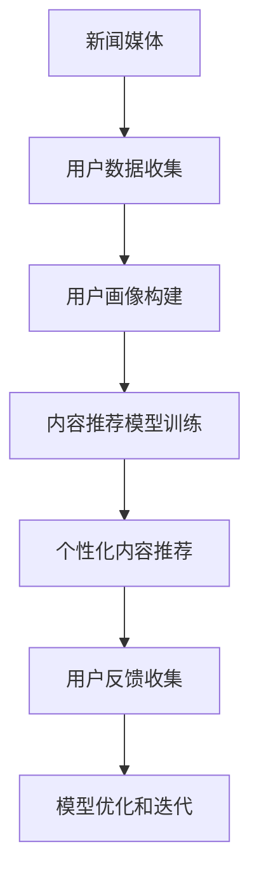

                 

# 新闻媒体如何在注意力经济中求生存

## 1. 背景介绍

随着互联网和数字媒体的兴起，传统的纸质和广播电视新闻媒体面临着前所未有的挑战。信息爆炸和用户注意力的争夺愈发激烈，导致广告收入和发行量下降，行业整体盈利能力受挫。在这样的环境下，新闻媒体如何抓住用户注意力、提升用户参与度，成为其生存和发展的关键。

本文将探讨注意力经济时代下，新闻媒体如何通过数据分析、个性化推荐、智能内容生成等手段，吸引用户注意力，提升商业价值，实现可持续发展。通过系统分析新闻媒体面临的机遇与挑战，结合实际案例和最新技术，为新闻媒体提供一套全面的生存策略。

## 2. 核心概念与联系

### 2.1 核心概念概述

- **注意力经济 (Attention Economy)**：指在信息过载的社会中，个体和组织通过争夺用户注意力来获取市场和资源的过程。媒体和内容提供商需要通过提升内容质量和用户体验，获取并保持用户关注。

- **个性化推荐系统 (Personalized Recommendation System)**：利用用户行为数据和内容特征，为用户提供符合其兴趣和偏好的推荐，提升用户参与度和留存率。

- **自然语言处理 (NLP)**：涉及计算机对人类语言的理解、处理和生成，是智能内容生成、文本挖掘、情感分析等技术的基础。

- **情感分析 (Sentiment Analysis)**：通过对文本情感的计算和分类，了解用户对新闻内容的情感倾向，从而指导内容策划和分发策略。

- **数据挖掘 (Data Mining)**：从大量数据中挖掘出有用的信息，包括用户兴趣、新闻事件的热度等，为内容推荐和优化提供数据支撑。

### 2.2 核心概念原理和架构的 Mermaid 流程图



此流程图展示了新闻媒体在注意力经济中生存和发展的核心流程。首先，媒体收集用户数据，构建用户画像；然后，训练个性化推荐模型，进行内容推荐；收集用户反馈，进行模型优化和迭代，从而形成闭环。

## 3. 核心算法原理 & 具体操作步骤

### 3.1 算法原理概述

新闻媒体的生存与发展，依赖于对用户注意力的有效争夺。在这一过程中，算法和技术的运用至关重要。算法原理包括用户画像构建、推荐系统训练和优化、内容生成与分析等多个环节。

### 3.2 算法步骤详解

#### 3.2.1 用户画像构建

1. **数据收集**：通过网站访问日志、社交媒体互动、用户反馈等多种渠道，收集用户行为数据和个人信息。
2. **数据清洗和预处理**：处理缺失值、异常值，进行特征选择和归一化，准备训练数据。
3. **画像构建**：使用聚类、分类等算法，构建用户兴趣、行为习惯、消费偏好等画像。

#### 3.2.2 个性化推荐系统训练

1. **数据准备**：将用户画像和内容特征（如标题、作者、发布时间等）组成特征向量。
2. **模型选择**：选择合适推荐算法，如协同过滤、矩阵分解、深度学习等。
3. **模型训练**：使用历史数据训练推荐模型，调整参数以提高推荐精度。

#### 3.2.3 模型优化与迭代

1. **在线学习**：通过在线学习算法，不断更新推荐模型，适应用户兴趣的变化。
2. **AB测试**：通过A/B测试，对比不同推荐策略的效果，优化推荐算法。
3. **反馈循环**：根据用户反馈和点击行为，更新用户画像和推荐模型，形成正向反馈循环。

### 3.3 算法优缺点

#### 3.3.1 优点

- **个性化强**：通过大数据分析和用户画像，提供高度个性化的内容推荐，提升用户满意度和留存率。
- **可扩展性好**：基于算法和数据驱动的推荐系统，可以灵活适应不同平台和内容类型，具备良好的可扩展性。
- **精准度高**：利用机器学习算法，能够准确预测用户偏好，提升推荐内容的相关性和吸引力。

#### 3.3.2 缺点

- **数据隐私问题**：用户数据隐私保护成为一大挑战，需严格遵守法律法规，确保数据安全。
- **冷启动问题**：新用户或内容初期缺乏历史数据，可能导致推荐效果不佳。
- **过度个性化**：过度依赖个性化推荐，可能导致内容多样性下降，用户逐渐形成信息茧房。

### 3.4 算法应用领域

个性化推荐系统广泛应用于新闻媒体、电商平台、视频网站等，成为提升用户体验和用户留存的重要工具。通过精准推荐，新闻媒体可以有效提升用户参与度，吸引广告投放，实现商业价值最大化。

## 4. 数学模型和公式 & 详细讲解 & 举例说明

### 4.1 数学模型构建

#### 4.1.1 协同过滤模型

协同过滤是一种基于用户兴趣和项目特征的推荐方法。其核心思想是通过找到兴趣相似的用户和物品，进行推荐。协同过滤模型通常包含两个主要部分：用户-物品矩阵和用户-用户矩阵。

假设用户集合为 $U$，物品集合为 $I$，用户对物品的评分矩阵为 $R_{ui}$，用户-用户矩阵为 $P$。协同过滤模型的目标是预测用户 $u$ 对物品 $i$ 的评分，即 $\hat{r}_{ui}$。

#### 4.1.2 矩阵分解模型

矩阵分解模型是一种通过将用户-物品评分矩阵分解为两个低秩矩阵来进行推荐的方法。分解后的矩阵为 $P$ 和 $Q$，用户对物品的评分预测公式为：

$$ \hat{r}_{ui} = P_u \cdot Q_i^T $$

其中 $P_u$ 和 $Q_i$ 分别为用户和物品的低秩向量。

### 4.2 公式推导过程

#### 4.2.1 协同过滤

协同过滤模型的基本形式为：

$$ r_{ui} = \frac{\sum_{v\in N(u)} \alpha_v \cdot r_{vi}}{\sqrt{\sum_{v\in N(u)} \alpha_v^2} + \sqrt{\sum_{j\in I} p_j^2}} $$

其中 $N(u)$ 为用户 $u$ 的邻居集合，$\alpha_v$ 和 $p_j$ 分别为用户 $v$ 和物品 $j$ 的相似度权重。

#### 4.2.2 矩阵分解

矩阵分解模型的预测公式为：

$$ \hat{r}_{ui} = \sum_{k=1}^{K} P_{uk} \cdot Q_{ik} $$

其中 $K$ 为分解的维度，$P_{uk}$ 和 $Q_{ik}$ 分别为用户和物品的低秩向量。

### 4.3 案例分析与讲解

#### 4.3.1 案例一：Netflix推荐系统

Netflix 的推荐系统采用了基于矩阵分解的协同过滤算法。用户对电影的评分数据被分解为两个低秩矩阵 $P$ 和 $Q$，每个用户的评分预测值可以通过低秩矩阵的点积计算得到。通过不断更新这两个矩阵，Netflix 能够提供高精度的个性化推荐。

#### 4.3.2 案例二：Amazon推荐系统

Amazon 的推荐系统采用基于协同过滤的算法，通过分析用户和物品的相似度，提供个性化的商品推荐。Amazon 还结合了深度学习算法，进一步提升了推荐效果。

## 5. 项目实践：代码实例和详细解释说明

### 5.1 开发环境搭建

新闻媒体的推荐系统开发通常需要搭建Python环境，并使用相关的数据分析和机器学习库。以下是一个简单的Python环境搭建流程：

1. 安装Python：从官网下载并安装Python 3.x版本。
2. 安装Pip：在终端中运行 `python -m pip install pip`。
3. 安装相关库：使用Pip安装推荐系统开发所需的库，如Scikit-Learn、TensorFlow、PyTorch等。

### 5.2 源代码详细实现

以下是一个基于TensorFlow的协同过滤推荐系统代码实现：

```python
import tensorflow as tf
from tensorflow.keras.layers import Embedding, Dense, Flatten, Dot, Concatenate
from tensorflow.keras.models import Model

# 用户和物品的特征向量
user_vector_size = 50
item_vector_size = 50

# 构建模型
user_input = Input(shape=(1,))
item_input = Input(shape=(1,))
user_embedding = Embedding(input_dim=1000, output_dim=user_vector_size)(user_input)
item_embedding = Embedding(input_dim=1000, output_dim=item_vector_size)(item_input)
user_item_dot = Dot(axes=1)([user_embedding, item_embedding])
item_vector = Flatten()(item_embedding)
user_vector = Flatten()(user_embedding)
concat = Concatenate()([user_vector, item_vector])
prediction = Dense(1, activation='sigmoid')(concat)

# 定义模型
model = Model(inputs=[user_input, item_input], outputs=prediction)
model.compile(optimizer='adam', loss='binary_crossentropy', metrics=['accuracy'])

# 训练模型
model.fit([user_input_train, item_input_train], user_item_train, epochs=10, batch_size=32)
```

### 5.3 代码解读与分析

该代码实现了一个简单的基于协同过滤的推荐系统。模型输入为用户和物品的特征向量，输出为预测用户对物品的评分。模型结构包括用户和物品的嵌入层、点积层、拼接层和输出层。通过训练数据，模型可以学习到用户和物品之间的相似度，进而进行推荐。

### 5.4 运行结果展示

训练结束后，可以使用测试集进行模型评估。以下是一个简单的评估代码：

```python
from sklearn.metrics import mean_absolute_error

# 使用测试集进行评估
test_loss, test_acc = model.evaluate([user_input_test, item_input_test], user_item_test, verbose=2)
print('Test Accuracy:', test_acc)

# 计算MAE
y_pred = model.predict([user_input_test, item_input_test])
y_pred = np.round(y_pred)
mae = mean_absolute_error(user_item_test, y_pred)
print('Mean Absolute Error:', mae)
```

## 6. 实际应用场景

### 6.1 视频平台

视频平台如Netflix、YouTube等，通过个性化推荐系统，为用户提供符合其兴趣的视频内容。平台使用协同过滤、深度学习等算法，结合用户观看行为、评分数据等，进行内容推荐。通过精准推荐，视频平台能够提高用户观看时长和满意度，增加广告收入。

### 6.2 新闻媒体

新闻媒体通过个性化推荐系统，提升用户点击率和订阅量。通过分析用户阅读历史和兴趣画像，媒体能够提供精准的新闻推荐，增加用户粘性。例如，BBC的News Now应用，使用推荐算法根据用户喜好推送新闻内容，提高用户留存率。

### 6.3 电商平台

电商平台如Amazon、淘宝等，通过个性化推荐系统，提升用户购买转化率和复购率。平台利用用户行为数据、商品标签等信息，提供个性化商品推荐，增加用户购买决策。例如，Amazon的推荐系统使用协同过滤和矩阵分解算法，结合用户和商品的多维特征，进行精准推荐。

## 7. 工具和资源推荐

### 7.1 学习资源推荐

- **Coursera《Recommender Systems Specialization》**：提供推荐系统基础和高级课程，包括协同过滤、矩阵分解等算法。
- **Udacity《Machine Learning Engineer Nanodegree》**：涵盖机器学习基础和推荐系统开发，提供丰富的项目实践。
- **Deep Learning with Python**：深度学习实战书籍，涵盖推荐系统的算法和实现细节。
- **Recommender Systems Handbook**：推荐系统经典书籍，涵盖推荐算法和实践经验。

### 7.2 开发工具推荐

- **TensorFlow**：谷歌开源的深度学习框架，适合构建复杂的推荐系统。
- **PyTorch**：Facebook开源的深度学习框架，易于使用，支持动态图。
- **Scikit-Learn**：Python科学计算库，适合构建协同过滤推荐系统。

### 7.3 相关论文推荐

- **Bell, K., & Koren, Y. (2007).**
- **He, X., Koren, Y., & Chen, K. (2008).**
- **Koren, Y., Bell, K., & Volinsky, C. (2009).**

## 8. 总结：未来发展趋势与挑战

### 8.1 研究成果总结

本文探讨了新闻媒体在注意力经济中求生存的策略，通过数据驱动的个性化推荐系统，提升用户参与度和商业价值。推荐系统已经在多个行业得到广泛应用，展示了其强大的潜力和价值。

### 8.2 未来发展趋势

- **深度学习与自然语言处理结合**：未来推荐系统将更多结合深度学习和自然语言处理技术，提升内容理解和生成能力，提供更加精准的推荐。
- **跨平台跨领域推荐**：推荐系统将不仅仅局限于单一平台和单一领域，实现跨平台、跨领域的推荐，提供更丰富的用户体验。
- **实时推荐与动态调整**：通过实时数据流处理技术，实现推荐系统的动态调整，适应用户行为变化，提供更及时的内容推荐。

### 8.3 面临的挑战

- **数据隐私与安全**：用户数据隐私保护成为一大挑战，需严格遵守法律法规，确保数据安全。
- **冷启动问题**：新用户或新内容初期缺乏历史数据，可能导致推荐效果不佳。
- **算法复杂度**：深度学习算法复杂度较高，需要大量计算资源和存储空间。

### 8.4 研究展望

未来的研究将集中在以下几个方面：
- **算法优化与简化**：通过算法优化和简化，降低推荐系统的计算复杂度，提升实时推荐能力。
- **跨模态推荐**：结合视觉、语音等多模态数据，提升推荐系统的理解和生成能力。
- **个性化与多样性平衡**：在提升个性化推荐的同时，保持内容的多样性，避免信息茧房。

## 9. 附录：常见问题与解答

**Q1：如何评估推荐系统的效果？**

A: 推荐系统的效果通常通过以下几个指标进行评估：
- **准确率 (Precision)**：预测正例中实际正例的比例。
- **召回率 (Recall)**：实际正例中被预测正例的比例。
- **F1分数 (F1 Score)**：精确率和召回率的调和平均数。
- **平均绝对误差 (Mean Absolute Error, MAE)**：预测值与实际值差的绝对值的平均值。
- **R平方 (R-squared, R²)**：预测值与实际值差值的方差占实际值方差的比例。

**Q2：如何缓解冷启动问题？**

A: 冷启动问题可以通过以下方法缓解：
- **利用先验知识**：结合领域专家知识，进行预训练或手动输入推荐。
- **多模态融合**：结合用户行为数据、社交网络数据等多种信息源，提供更全面的用户画像。
- **零样本学习**：通过文本描述和标签信息，进行零样本学习，进行内容推荐。

**Q3：如何确保推荐系统的公平性和透明性？**

A: 推荐系统的公平性和透明性可以通过以下方法保证：
- **数据预处理**：去除数据中的偏见和歧视，确保推荐算法不产生歧视性输出。
- **算法设计**：在设计推荐算法时，加入公平性约束，避免算法输出不公正的内容。
- **用户反馈**：收集用户反馈，定期评估推荐系统的公平性和透明性，进行优化调整。

作者：禅与计算机程序设计艺术 / Zen and the Art of Computer Programming

