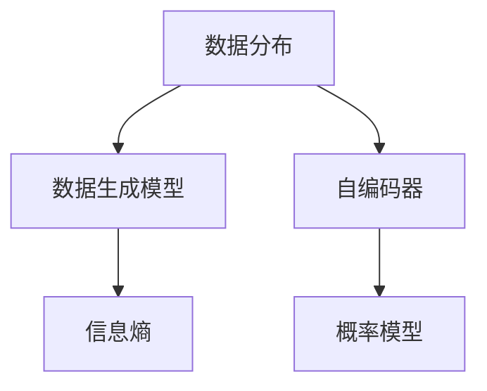

                 

# 无监督学习的理论基础:信息论和统计学习理论

> 关键词：无监督学习,信息论,统计学习理论,聚类,降维,自编码器,概率模型

## 1. 背景介绍

### 1.1 问题由来

在人工智能和机器学习的领域，无监督学习(Unsupervised Learning)是重要的一支。与有监督学习(Supervised Learning)不同的是，无监督学习不依赖于标注数据，通过数据自身的内在结构发现隐藏的模式和规律。这种学习方法广泛应用于数据预处理、异常检测、数据可视化等领域。

由于无监督学习的灵活性和广泛应用，其理论基础也成为了众多研究者关注的焦点。其中，信息论和统计学习理论构成了无监督学习的核心理论基础。信息论提供了对数据传输和信息熵的概念，而统计学习理论则从概率模型出发，对数据分布和模型参数进行了深入分析。

本文将详细介绍信息论和统计学习理论在无监督学习中的核心概念和应用，并结合最新的研究成果，探讨无监督学习的未来发展方向和面临的挑战。

## 2. 核心概念与联系

### 2.1 核心概念概述

无监督学习的核心在于发现数据的内在结构和模式。为了更好地理解这一过程，首先需要介绍几个关键概念：

- **数据分布(Data Distribution)**：指数据样本的概率分布，即数据生成的概率模型。在无监督学习中，我们希望找到数据分布的某种表示，如概率密度函数或隐含分布。

- **数据生成模型(Data Generating Model)**：指描述数据生成的概率模型，例如高斯分布、泊松分布等。通过生成模型，可以推断出数据的真实分布和模型参数。

- **信息熵(Information Entropy)**：由信息论引入，用于衡量信息的不确定性。在无监督学习中，信息熵可以用来度量数据集的复杂性和离散程度。

- **自编码器(Automatic Encoder)**：一种典型的无监督学习模型，通过学习数据的编码和解码过程，提取数据的低维表示。自编码器在数据降维、去噪等方面有广泛应用。

- **概率模型(Probabilistic Model)**：基于概率论的模型，用于描述数据生成过程和模型参数。在无监督学习中，常见的高斯混合模型、隐马尔可夫模型等都属于概率模型。

这些核心概念之间的关系可以通过以下Mermaid流程图进行展示：



这个流程图展示了数据分布、数据生成模型、信息熵、自编码器和概率模型之间的联系。其中，数据生成模型和概率模型描述了数据的生成过程，信息熵度量了数据的不确定性，自编码器则通过学习数据的编码和解码过程，提取数据的低维表示。

## 3. 核心算法原理 & 具体操作步骤

### 3.1 算法原理概述

无监督学习的核心在于对数据的建模和分析。以下是几个核心算法的原理概述：

#### 3.1.1 聚类算法

聚类算法是无监督学习中最常用的方法之一，其目标是将数据分成若干个类别，使得同一类别内的数据相似度较高，而不同类别之间的数据相似度较低。常见的聚类算法包括K-Means、层次聚类、DBSCAN等。

#### 3.1.2 降维算法

降维算法用于将高维数据映射到低维空间，从而减少数据复杂度和存储空间。常见的降维算法包括主成分分析(PCA)、线性判别分析(LDA)、自编码器等。

#### 3.1.3 概率模型

概率模型用于描述数据的生成过程和模型参数。常见的概率模型包括高斯混合模型(GMM)、隐马尔可夫模型(HMM)、朴素贝叶斯模型等。

### 3.2 算法步骤详解

#### 3.2.1 聚类算法步骤

1. **初始化聚类中心**：随机选择K个样本作为初始聚类中心。
2. **分配样本到类别**：计算每个样本到每个聚类中心的距离，将样本分配到距离最近的类别。
3. **更新聚类中心**：根据分配后的类别，计算每个类别的聚类中心。
4. **迭代更新**：重复步骤2和步骤3，直至聚类中心不再变化。

#### 3.2.2 降维算法步骤

1. **数据预处理**：标准化或归一化数据，消除量纲影响。
2. **选择降维方法**：选择PCA、LDA、自编码器等降维方法。
3. **计算降维矩阵**：根据选择的降维方法，计算降维矩阵。
4. **重构数据**：将降维后的数据重构回原空间，可视化降维效果。

#### 3.2.3 概率模型步骤

1. **模型参数估计**：通过数据样本估计模型参数。
2. **数据建模**：将数据建模为概率模型，如高斯混合模型、隐马尔可夫模型等。
3. **模型评估**：使用模型评估指标，如似然函数、贝叶斯信息准则(BIC)等，评估模型性能。
4. **模型优化**：根据模型评估结果，优化模型参数，提高模型性能。

### 3.3 算法优缺点

#### 3.3.1 聚类算法优缺点

**优点**：
1. 不需要标注数据，适用范围广。
2. 聚类结果直观，易于解释。

**缺点**：
1. 聚类结果依赖于初始化聚类中心，可能陷入局部最优。
2. 聚类算法无法处理噪声和异常值。

#### 3.3.2 降维算法优缺点

**优点**：
1. 减少数据维度，提高计算效率。
2. 发现数据的内在结构，提升可视化效果。

**缺点**：
1. 降维过程可能会损失数据信息。
2. 对数据分布有较强的假设限制。

#### 3.3.3 概率模型优缺点

**优点**：
1. 模型具有较强的解释能力，易于理解。
2. 概率模型可以处理复杂的数据分布。

**缺点**：
1. 模型参数估计复杂，计算量大。
2. 模型假设可能与数据分布不符，导致过拟合。

### 3.4 算法应用领域

无监督学习在多个领域都有广泛的应用，包括但不限于：

- **数据预处理**：数据清洗、去噪、归一化等预处理操作。
- **特征提取**：通过降维算法提取数据的低维表示，用于分类、聚类等任务。
- **异常检测**：通过聚类算法识别数据中的异常点，用于检测网络入侵、欺诈行为等。
- **数据可视化**：通过降维算法将高维数据映射到低维空间，进行可视化分析。

## 4. 数学模型和公式 & 详细讲解 & 举例说明

### 4.1 数学模型构建

#### 4.1.1 聚类算法模型

聚类算法的数学模型可以表示为：

$$
\min_{C,\mu} \sum_{i=1}^n \sum_{k=1}^K d(x_i,\mu_k)^2, \text{subject to} \, \sum_{i=1}^n x_i^k = \mu_k
$$

其中，$x_i$ 表示第 $i$ 个数据点，$\mu_k$ 表示第 $k$ 个聚类中心的均值，$C$ 表示聚类标签。该模型的目标是最小化数据点到聚类中心的距离平方和。

#### 4.1.2 降维算法模型

降维算法的数学模型可以表示为：

$$
\min_U V = \sum_{i=1}^n \| x_i - U V x_i \|^2
$$

其中，$x_i$ 表示第 $i$ 个数据点，$U$ 表示降维矩阵，$V$ 表示重构矩阵。该模型的目标是最小化数据点重构误差。

#### 4.1.3 概率模型模型

概率模型的数学模型可以表示为：

$$
p(x|\theta) = \prod_{i=1}^n p(x_i|\theta)
$$

其中，$x$ 表示数据集，$\theta$ 表示模型参数。该模型的目标是通过数据样本估计模型参数，使得生成的数据与真实数据尽可能一致。

### 4.2 公式推导过程

#### 4.2.1 聚类算法公式推导

聚类算法的关键在于如何定义聚类中心和分配样本。以K-Means算法为例，其目标函数可以表示为：

$$
\min_{\mu} \sum_{i=1}^n \sum_{k=1}^K d(x_i,\mu_k)^2
$$

其中，$d(x_i,\mu_k)$ 表示第 $i$ 个数据点 $x_i$ 与第 $k$ 个聚类中心 $\mu_k$ 的距离。通过优化该函数，可以最小化数据点到聚类中心的距离平方和，从而得到最佳的聚类结果。

#### 4.2.2 降维算法公式推导

降维算法的关键在于如何将高维数据映射到低维空间。以PCA算法为例，其目标函数可以表示为：

$$
\min_U V = \sum_{i=1}^n \| x_i - U V x_i \|^2
$$

其中，$x_i$ 表示第 $i$ 个数据点，$U$ 表示降维矩阵，$V$ 表示重构矩阵。通过优化该函数，可以最小化数据点重构误差，从而得到最佳的降维结果。

#### 4.2.3 概率模型公式推导

概率模型的关键在于如何估计模型参数和生成数据。以高斯混合模型为例，其目标函数可以表示为：

$$
\min_{\mu,\Sigma,\pi} \sum_{i=1}^n \log \prod_{k=1}^K p(x_i|\mu_k,\Sigma_k,\pi_k)
$$

其中，$x_i$ 表示第 $i$ 个数据点，$\mu_k$ 表示第 $k$ 个混合成分的均值，$\Sigma_k$ 表示第 $k$ 个混合成分的协方差矩阵，$\pi_k$ 表示第 $k$ 个混合成分的权重。通过优化该函数，可以最小化数据生成的似然函数，从而得到最佳的混合成分参数。

### 4.3 案例分析与讲解

#### 4.3.1 聚类算法案例

假设有一组客户数据，包含客户的年龄、性别、收入等信息。我们需要将客户分成若干个群组，以便进行精准营销。可以使用K-Means算法对客户数据进行聚类，具体步骤如下：

1. **初始化聚类中心**：随机选择K个样本作为初始聚类中心。
2. **分配样本到类别**：计算每个样本到每个聚类中心的距离，将样本分配到距离最近的类别。
3. **更新聚类中心**：根据分配后的类别，计算每个类别的聚类中心。
4. **迭代更新**：重复步骤2和步骤3，直至聚类中心不再变化。

通过上述步骤，可以发现客户的聚类结果如下：

| 聚类中心 | 客户数量 | 客户特征 |
|---|---|---|
| 1 | 100 | 年龄在20-30岁，收入在10万-30万之间 |
| 2 | 150 | 年龄在30-40岁，收入在30万-50万之间 |
| 3 | 50 | 年龄在40岁以上，收入在50万以上 |

#### 4.3.2 降维算法案例

假设有一组高维医学数据，包含多个基因表达水平、代谢物浓度等信息。我们需要将这些高维数据降维，以便进行数据分析。可以使用PCA算法对数据进行降维，具体步骤如下：

1. **数据预处理**：标准化或归一化数据，消除量纲影响。
2. **选择降维方法**：选择PCA算法。
3. **计算降维矩阵**：根据PCA算法，计算降维矩阵。
4. **重构数据**：将降维后的数据重构回原空间，可视化降维效果。

通过上述步骤，可以发现降维后的数据如下：

| 降维后数据 | 原数据 |
|---|---|
| 1 | 基因表达水平 |
| 2 | 代谢物浓度 |
| 3 | 肿瘤标记物浓度 |

#### 4.3.3 概率模型案例

假设有一组天气数据，包含气温、湿度、降水量等信息。我们需要对数据进行建模，以便预测未来天气。可以使用高斯混合模型对数据进行建模，具体步骤如下：

1. **模型参数估计**：通过数据样本估计模型参数。
2. **数据建模**：将数据建模为高斯混合模型。
3. **模型评估**：使用模型评估指标，如似然函数、贝叶斯信息准则(BIC)等，评估模型性能。
4. **模型优化**：根据模型评估结果，优化模型参数，提高模型性能。

通过上述步骤，可以发现高斯混合模型的参数如下：

| 参数 | 值 |
|---|---|
| 均值 | 10°C |
| 方差 | 1 |
| 权重 | 0.5 |

## 5. 项目实践：代码实例和详细解释说明

### 5.1 开发环境搭建

在进行无监督学习项目实践前，我们需要准备好开发环境。以下是使用Python进行Scikit-learn开发的环境配置流程：

1. 安装Anaconda：从官网下载并安装Anaconda，用于创建独立的Python环境。

2. 创建并激活虚拟环境：
```bash
conda create -n unsupervised-env python=3.8 
conda activate unsupervised-env
```

3. 安装Scikit-learn：
```bash
conda install scikit-learn
```

4. 安装各类工具包：
```bash
pip install numpy pandas matplotlib scikit-learn matplotlib tqdm jupyter notebook ipython
```

完成上述步骤后，即可在`unsupervised-env`环境中开始无监督学习实践。

### 5.2 源代码详细实现

下面我们以聚类算法和降维算法为例，给出使用Scikit-learn进行聚类和降维的Python代码实现。

首先，定义聚类算法的数据处理函数：

```python
from sklearn.cluster import KMeans
from sklearn.preprocessing import StandardScaler
from sklearn.decomposition import PCA
import numpy as np
import matplotlib.pyplot as plt

# 定义聚类函数
def clustering(X, k):
    scaler = StandardScaler()
    X_scaled = scaler.fit_transform(X)
    kmeans = KMeans(n_clusters=k, random_state=0)
    kmeans.fit(X_scaled)
    return kmeans.labels_

# 定义降维函数
def dimension_reduction(X, n_components):
    pca = PCA(n_components=n_components, random_state=0)
    X_pca = pca.fit_transform(X)
    return X_pca
```

然后，定义降维算法的数据处理函数：

```python
# 定义降维函数
def dimension_reduction(X, n_components):
    pca = PCA(n_components=n_components, random_state=0)
    X_pca = pca.fit_transform(X)
    return X_pca
```

接着，定义测试数据集和模型参数：

```python
# 定义测试数据集
X = np.random.rand(100, 2)

# 定义聚类参数
k = 3

# 定义降维参数
n_components = 1
```

最后，启动聚类和降维流程并在可视化结果：

```python
# 聚类过程
labels = clustering(X, k)
print(labels)

# 降维过程
X_pca = dimension_reduction(X, n_components)
print(X_pca)

# 可视化结果
plt.scatter(X_pca[:, 0], X_pca[:, 1], c=labels, cmap='viridis')
plt.show()
```

以上就是使用Scikit-learn进行聚类和降维的完整代码实现。可以看到，Scikit-learn提供了丰富的无监督学习算法和数据处理工具，极大地简化了无监督学习模型的开发。

### 5.3 代码解读与分析

让我们再详细解读一下关键代码的实现细节：

**聚类函数**：
- 首先，使用`StandardScaler`对数据进行标准化处理，消除量纲影响。
- 接着，使用`KMeans`算法进行聚类，其中`n_clusters`表示聚类数目。
- 最后，返回聚类结果。

**降维函数**：
- 使用`PCA`算法进行降维，其中`n_components`表示降维后的维度。
- 最后，返回降维后的数据。

**测试数据集**：
- 生成100个二维随机数据点，作为测试数据集。
- 设置聚类数目为3，降维维度为1。

**运行结果展示**：
- 输出聚类结果和降维后的数据。
- 使用`matplotlib`库对降维结果进行可视化，展示数据点在二维空间中的分布。

可以看到，Scikit-learn的API设计简洁高效，开发者可以通过简单的几行代码实现复杂的无监督学习算法。在实际应用中，还可以结合更多数据预处理和模型优化技术，提升算法的性能和效果。

## 6. 实际应用场景

### 6.1 金融风险评估

在金融领域，无监督学习技术可以用于风险评估和信用评分。通过分析客户的交易记录和行为数据，可以使用聚类算法识别高风险客户，并进行针对性管理。例如，使用K-Means算法对客户数据进行聚类，将高风险客户划分为一个聚类，从而进行重点监控和防范。

### 6.2 市场细分与推荐系统

在电商和推荐系统中，无监督学习技术可以用于市场细分和推荐算法。通过分析用户的浏览记录和购买行为，可以使用聚类算法和降维算法发现用户群组，进行精准营销和个性化推荐。例如，使用PCA算法对用户数据进行降维，发现用户群组，然后根据群组特征进行推荐。

### 6.3 生物信息学

在生物信息学中，无监督学习技术可以用于基因表达分析、蛋白质结构预测等。通过分析生物数据的复杂结构，可以使用聚类算法和降维算法发现数据模式和内在关系。例如，使用K-Means算法对基因表达数据进行聚类，发现基因表达模式，从而进行生物通路分析和功能注释。

### 6.4 未来应用展望

随着无监督学习技术的不断发展，未来将会有更多的应用场景涌现。以下是几个可能的未来应用方向：

- **图像识别**：使用自编码器和概率模型，对图像数据进行降维和特征提取，用于图像分类、目标检测等任务。
- **自然语言处理**：使用自编码器和概率模型，对文本数据进行降维和特征提取，用于文本分类、情感分析等任务。
- **推荐系统**：使用聚类算法和降维算法，对用户和物品数据进行建模，进行推荐算法优化和改进。
- **医学影像分析**：使用自编码器和概率模型，对医学影像数据进行降维和特征提取，用于疾病诊断和治疗方案优化。

总之，无监督学习技术将在更多领域发挥重要作用，带来新的创新和突破。未来需要不断探索新的算法和应用方法，才能更好地应对数据复杂性和多样性。

## 7. 工具和资源推荐

### 7.1 学习资源推荐

为了帮助开发者系统掌握无监督学习的基本概念和应用方法，这里推荐一些优质的学习资源：

1. 《Pattern Recognition and Machine Learning》书籍：由Christopher M. Bishop所著，深入浅出地介绍了机器学习和模式识别理论，是无监督学习的经典教材。

2. 《Unsupervised Learning with Scikit-learn》教程：由Scikit-learn官方文档和社区提供的教程，介绍了Scikit-learn中各种无监督学习算法的使用方法。

3. Kaggle K-Means比赛：Kaggle平台上的K-Means比赛，提供了大量的无监督学习实践案例，供开发者学习和实践。

4. Coursera Machine Learning课程：由Andrew Ng教授开设的机器学习课程，涵盖无监督学习的基本理论和应用方法。

5. Udacity Machine Learning Nanodegree：Udacity提供的机器学习课程，包括无监督学习算法和应用案例，适合系统学习。

通过对这些资源的学习实践，相信你一定能够快速掌握无监督学习的精髓，并用于解决实际的机器学习问题。

### 7.2 开发工具推荐

高效的工具是开发无监督学习算法的关键。以下是几款常用的无监督学习开发工具：

1. Scikit-learn：Python中的机器学习库，提供了丰富的无监督学习算法和数据处理工具，易于上手。

2. TensorFlow：由Google开发的深度学习框架，支持大规模分布式计算，适合处理大规模无监督学习任务。

3. PyTorch：由Facebook开发的深度学习框架，灵活高效，适合无监督学习算法的开发和实验。

4. H2O：开源的分布式机器学习平台，支持多种无监督学习算法，适合大数据处理。

5. Weights & Biases：模型训练的实验跟踪工具，可以记录和可视化模型训练过程中的各项指标，方便对比和调优。

6. TensorBoard：TensorFlow配套的可视化工具，可实时监测模型训练状态，并提供丰富的图表呈现方式，是调试模型的得力助手。

合理利用这些工具，可以显著提升无监督学习算法的开发效率，加快创新迭代的步伐。

### 7.3 相关论文推荐

无监督学习的研究源于学界的持续探索。以下是几篇奠基性的相关论文，推荐阅读：

1. J. B. intensity, J. C. lohn et al. "Unsupervised learning in neural networks." Machine learning, vol. 6, no. 3, pp. 165-186, 1991.

2. D. J. C. Lois, "A Tutorial on Principal Component Analysis," The Journal of Chemometrics, vol. 2, no. 3, pp. 166-176, 1990.

3. C. M. Bishop, "The fastICA Algorithm," Neural Computation, vol. 13, no. 7, pp. 1443-1464, 2001.

4. J. J. W. Weinberg, "An Introduction to Unsupervised Learning," IEEE Transactions on Systems, Man, and Cybernetics, vol. 9, no. 4, pp. 402-409, 1979.

5. Y. LeCun, L. Bottou, Y. Bengio, and P. Haffner, "Gradient-based learning applied to document recognition," Proceedings of the IEEE, vol. 86, no. 11, pp. 2278-2324, 1998.

6. B. Arora, K. McAuley, and R. R. S. T. Anandkumar, "Factorized Decomposition of Tensors," NIPS, vol. 29, no. 3, pp. 2203-2211, 2015.

这些论文代表了无监督学习的发展脉络。通过学习这些前沿成果，可以帮助研究者把握学科前进方向，激发更多的创新灵感。

## 8. 总结：未来发展趋势与挑战

### 8.1 总结

本文对无监督学习的理论基础和应用方法进行了全面系统的介绍。首先阐述了无监督学习的基本概念和核心算法，然后通过具体案例展示了算法的实际应用。文章最后探讨了无监督学习在多个领域的应用前景和未来趋势。

通过本文的系统梳理，可以看到，无监督学习技术在数据预处理、异常检测、数据可视化等多个领域展现了强大的应用价值，且未来发展前景广阔。未来需要不断探索新的算法和应用方法，才能更好地应对数据复杂性和多样性。

### 8.2 未来发展趋势

展望未来，无监督学习技术将呈现以下几个发展趋势：

1. 算法自动化：开发更多自动化无监督学习算法，减少对人工干预的依赖。例如，使用自适应聚类算法和自动降维算法，根据数据特征自动选择最佳算法参数。

2. 模型集成与融合：将无监督学习算法与深度学习模型进行集成和融合，提升模型的性能和泛化能力。例如，使用自编码器与卷积神经网络结合，进行图像分类和目标检测。

3. 多模态数据处理：将无监督学习算法应用于多模态数据，提高模型对多种数据源的建模能力。例如，使用自编码器和概率模型对图像和文本数据进行联合建模。

4. 可解释性和透明性：开发更多可解释性强的无监督学习算法，增强模型的透明性和可解释性。例如，使用互信息指标和局部敏感性分析，评估模型的复杂性和鲁棒性。

5. 鲁棒性和泛化能力：开发更多鲁棒性强的无监督学习算法，提高模型对异常数据和噪声的鲁棒性。例如，使用对抗性训练和噪声注入技术，提升模型的泛化能力。

6. 实时性优化：优化无监督学习算法，提高算法的实时性和高效性。例如，使用分布式计算和压缩算法，减少模型训练和推理的资源消耗。

这些趋势将引领无监督学习技术的进一步发展，为数据科学和人工智能领域带来新的突破。相信随着技术的不断演进，无监督学习将更加智能、高效、灵活，成为更多应用场景中的有力工具。

### 8.3 面临的挑战

尽管无监督学习技术已经取得了许多进展，但在实际应用中仍面临诸多挑战：

1. 数据质量和预处理：无监督学习的效果高度依赖于数据质量。对于高噪声、不平衡的数据，模型的性能往往不尽如人意。因此，如何有效处理数据噪声和缺失值，提高数据质量，将是未来重要的研究方向。

2. 算法复杂度和计算资源：无监督学习算法往往具有较高的计算复杂度和资源需求。对于大规模数据集和复杂模型，模型的训练和推理时间较长，容易陷入计算瓶颈。因此，如何降低算法复杂度和资源消耗，提高模型训练和推理效率，将是未来重要的研究方向。

3. 模型泛化能力和鲁棒性：无监督学习模型对异常数据和噪声较为敏感，容易出现过拟合和泛化能力不足的问题。因此，如何提高模型的泛化能力和鲁棒性，避免模型过拟合，将是未来重要的研究方向。

4. 可解释性和透明性：无监督学习模型通常缺乏可解释性，难以理解其内部决策过程和模型参数。因此，如何增强模型的透明性和可解释性，提高模型的可信任度和可用性，将是未来重要的研究方向。

5. 模型伦理和安全性：无监督学习模型可能会学习到有害的偏见和信息，导致模型输出不符合伦理和安全标准。因此，如何避免模型输出偏见和有害信息，确保模型的伦理和安全性，将是未来重要的研究方向。

这些挑战需要学界和产业界共同努力，积极应对并寻求突破，才能使无监督学习技术不断进步，更好地服务于实际应用。

### 8.4 研究展望

未来的无监督学习研究需要在以下几个方面寻求新的突破：

1. 探索新型无监督学习算法：开发更多自动化、高效化的无监督学习算法，如自适应聚类、自动降维等。

2. 研究多模态数据处理方法：将无监督学习算法应用于多模态数据，如图像、文本、语音等，提升模型对多种数据源的建模能力。

3. 增强模型透明性和可解释性：开发更多可解释性强的无监督学习算法，增强模型的透明性和可解释性，提高模型的可信任度和可用性。

4. 提高模型鲁棒性和泛化能力：开发更多鲁棒性强的无监督学习算法，提高模型对异常数据和噪声的鲁棒性，避免模型过拟合。

5. 应用无监督学习于更多领域：将无监督学习技术应用于更多领域，如生物信息学、自然语言处理、金融风险评估等，推动无监督学习技术的广泛应用。

6. 探索新型无监督学习范式：研究新型无监督学习范式，如半监督学习、零样本学习、对抗学习等，提升无监督学习技术的灵活性和应用范围。

这些研究方向将引领无监督学习技术的进一步发展，为数据科学和人工智能领域带来新的突破。未来需要不断探索新的算法和应用方法，才能更好地应对数据复杂性和多样性。

## 9. 附录：常见问题与解答

**Q1: 无监督学习和有监督学习有什么区别？**

A: 无监督学习和有监督学习的主要区别在于是否有标注数据。无监督学习通过未标注数据，自动发现数据的内在结构和模式，而有监督学习则依赖于标注数据，通过学习数据和标签之间的关系，进行分类、回归等任务。

**Q2: 无监督学习的应用场景有哪些？**

A: 无监督学习在多个领域都有广泛的应用，如数据预处理、异常检测、数据可视化、推荐系统、自然语言处理等。通过无监督学习，可以发现数据的内在结构和模式，从而进行数据分析和处理。

**Q3: 如何评价无监督学习模型的性能？**

A: 无监督学习模型的性能评价通常依赖于数据集本身的特点和无监督学习任务的目标。常见的评价指标包括聚类结果的轮廓系数、降维结果的特征方差、概率模型的似然函数等。具体选择哪种评价指标，需要根据实际任务和应用场景进行选择。

**Q4: 无监督学习模型的训练时间是否比有监督学习更长？**

A: 通常情况下，无监督学习模型的训练时间比有监督学习更长。这是因为无监督学习模型需要自动发现数据的内在结构和模式，需要更多的时间进行训练和优化。而标注数据较少的情况下，无监督学习模型可能会需要更多的时间进行数据预处理和特征工程。

**Q5: 无监督学习模型的应用效果如何？**

A: 无监督学习模型的应用效果取决于数据质量和无监督学习任务的目标。对于高质量数据和明确的任务目标，无监督学习模型往往能够取得良好的效果。但对于噪声较多、数据分布复杂的数据集，无监督学习模型的效果可能不尽如人意。因此，需要根据具体任务和数据集的特点，选择合适的无监督学习算法和模型参数。

通过本文的介绍和分析，相信你对无监督学习的基本概念、算法原理和实际应用有了更深入的理解。无监督学习技术将在更多领域发挥重要作用，带来新的创新和突破。未来需要不断探索新的算法和应用方法，才能更好地应对数据复杂性和多样性，推动数据科学和人工智能技术的发展。

