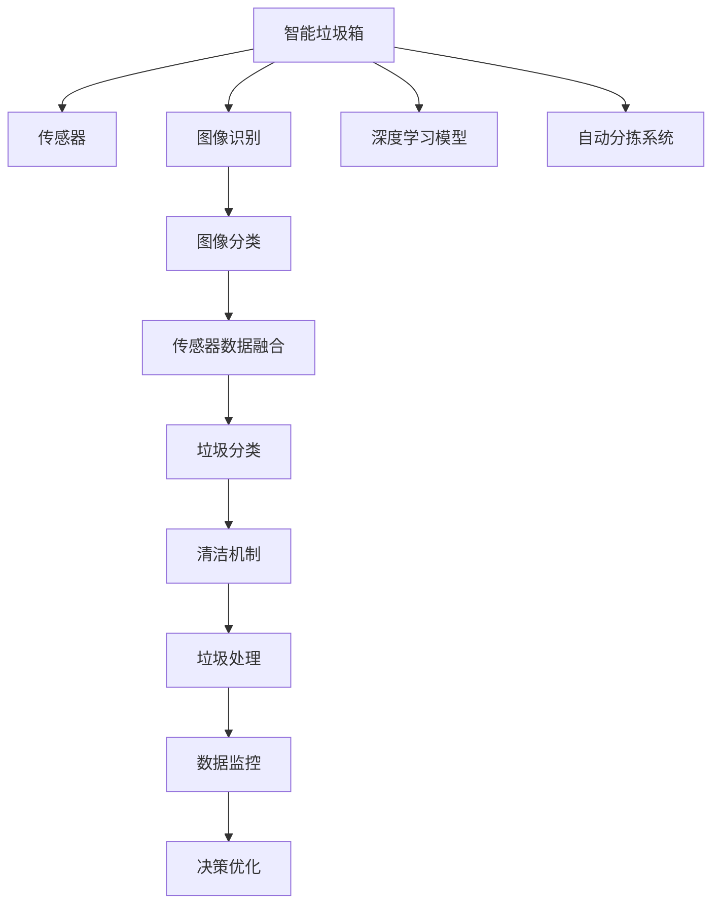

                 

# 智能垃圾箱创业：自动分类的环保解决方案

> 关键词：智能垃圾箱, 自动分类, 环保, 物联网(IoT), 人工智能(AI), 垃圾分类, 清洁城市

## 1. 背景介绍

### 1.1 问题由来
随着城市化进程的加速和人口规模的增长，垃圾问题日益严峻，成为中国乃至全球环境治理的重要课题。垃圾分类作为最直接有效的减量和资源化措施，是实现城市绿色转型、提升居民生活品质的重要途径。然而，传统的人工垃圾分类方式存在诸多问题：
1. 效率低下：人工分拣速度慢，难以应对日益增长的垃圾量。
2. 成本高昂：高昂的人工成本难以维持长期运营。
3. 准确率低：依赖人工分拣，分类准确率受人员素质、工作状态等因素影响。
4. 环境污染：人工分拣过程中存在污水排放、噪音污染等问题。

为解决上述问题，自动化的垃圾分类成为智能城市建设的重要方向。本文将介绍一种基于物联网和人工智能技术的智能垃圾箱解决方案，通过自动分类实现垃圾处理的高效、环保、智能。

## 2. 核心概念与联系

### 2.1 核心概念概述

为理解智能垃圾箱自动分类系统，本节将介绍几个关键概念：

- 智能垃圾箱（Smart Garbage Bin）：集成了传感器、执行器及智能算法，能够自动识别垃圾种类并执行分类的垃圾处理设备。
- 物联网（Internet of Things, IoT）：通过传感器、通信技术实现智能垃圾箱的互联互通，实现垃圾处理数据化、可视化的智能管理。
- 人工智能（Artificial Intelligence, AI）：利用机器学习、深度学习等技术，对垃圾种类进行自动识别和分类。
- 自动分类（Automatic Sorting）：通过图像识别、传感器数据等技术手段，对垃圾进行自动识别并执行分类的过程。
- 清洁城市（Clean City）：通过智能垃圾箱等设备，提升城市垃圾管理效率，减少垃圾产生量，改善城市环境质量。

这些核心概念之间的联系可以通过以下Mermaid流程图来展示：



这个流程图展示了智能垃圾箱系统的工作流程：

1. 智能垃圾箱通过传感器获取垃圾重量、类型等信息。
2. 内置的图像识别系统对垃圾进行视觉识别。
3. 利用深度学习模型对垃圾种类进行分类。
4. 自动分拣系统根据分类结果执行垃圾投放操作。
5. 清洁机制对投放口进行清理，保证卫生。
6. 垃圾处理系统对分类后的垃圾进行收集和处理。
7. 数据监控系统对垃圾箱状态进行实时监控，并上传至云端。
8. 决策优化系统根据监控数据调整垃圾箱运行策略。

## 3. 核心算法原理 & 具体操作步骤

### 3.1 算法原理概述

智能垃圾箱的自动分类算法，本质上是一种基于计算机视觉和深度学习的分类模型。其核心思想是通过传感器获取垃圾重量、视觉图像等数据，利用深度学习模型对垃圾进行自动识别和分类。

具体流程如下：
1. 传感器采集垃圾重量、垃圾类型、环境温度等物理参数，上传至智能垃圾箱。
2. 图像识别系统通过摄像头获取垃圾图像，上传至智能垃圾箱。
3. 垃圾分类模型对传感器数据和图像数据进行处理，识别出垃圾种类。
4. 自动分拣系统根据分类结果，控制垃圾箱执行垃圾投放操作。
5. 清洁系统对垃圾投放口进行清洗，避免垃圾堆积。
6. 垃圾处理系统将分类后的垃圾进行收集和处理，减少垃圾产生。

### 3.2 算法步骤详解

智能垃圾箱的自动分类算法主要包括以下几个关键步骤：

**Step 1: 数据预处理**
- 传感器采集数据：通过重力传感器、温度传感器等获取垃圾的重量、温度等物理参数。
- 图像采集：通过摄像头采集垃圾的视觉图像。
- 数据清洗：对传感器和摄像头数据进行清洗，去除噪声和异常值。

**Step 2: 特征提取**
- 图像处理：对采集到的垃圾图像进行预处理，如灰度化、归一化、滤波等，提高后续分类的准确性。
- 特征提取：通过卷积神经网络(CNN)等深度学习模型提取图像特征，用于后续分类。

**Step 3: 模型训练**
- 数据集构建：收集和标注大量的垃圾图像数据，构建训练集、验证集和测试集。
- 模型选择：选择适合的深度学习模型，如卷积神经网络(CNN)、循环神经网络(RNN)等。
- 模型训练：使用训练集数据训练深度学习模型，通过反向传播算法优化模型参数。

**Step 4: 分类预测**
- 特征输入：将预处理后的传感器数据和图像数据输入到训练好的模型中进行预测。
- 结果输出：模型输出垃圾种类的概率分布，通过阈值判断实现分类。

**Step 5: 垃圾处理**
- 自动分拣：根据分类结果，控制垃圾箱执行垃圾投放操作，实现自动分类。
- 清洁系统：对垃圾投放口进行清洗，防止垃圾堆积。
- 垃圾收集：将分类后的垃圾进行收集和处理，减少垃圾产生。

**Step 6: 数据监控与优化**
- 数据上传：将传感器和图像数据上传至云端，进行实时监控。
- 数据分析：对上传的数据进行分析，生成垃圾分类报告。
- 优化决策：根据垃圾分类报告和实时数据，优化垃圾箱运行策略。

### 3.3 算法优缺点

基于深度学习的智能垃圾箱自动分类算法具有以下优点：
1. 自动化程度高：不需要人工参与，能够24小时不间断运行。
2. 分类准确率高：深度学习模型能够学习复杂的垃圾特征，分类准确率较高。
3. 数据实时性高：传感器和图像数据实时传输，能够及时发现和处理问题。
4. 可扩展性强：系统可扩展性强，能够适应不同规模的垃圾处理需求。

同时，该算法也存在一些局限性：
1. 硬件成本高：传感器和摄像头的成本较高，初期投资较大。
2. 环境适应性差：在恶劣天气或光照不足的环境下，图像识别效果可能较差。
3. 数据隐私问题：传感器和摄像头数据可能包含隐私信息，需要采取数据保护措施。
4. 模型维护难度大：深度学习模型需要定期维护和更新，以保证分类准确率。

尽管存在这些局限性，但总体而言，基于深度学习的智能垃圾箱自动分类算法，对于提升垃圾管理效率、改善城市环境质量具有显著的现实意义。

### 3.4 算法应用领域

智能垃圾箱自动分类技术，已经在多个领域得到了广泛应用：

- 智能社区：在居民小区、商业街区等公共区域，通过智能垃圾箱实现垃圾分类和自动处理，提高居民生活质量。
- 城市管理：在城市广场、公园等公共场所，通过智能垃圾箱实现垃圾分类和卫生清洁，改善城市环境。
- 物流运输：在物流园区、快递站等场所，通过智能垃圾箱实现垃圾分类和资源回收，提高物流效率。
- 垃圾处理：在垃圾填埋场、垃圾焚烧厂等场所，通过智能垃圾箱实现垃圾分类和高效处理，减少环境污染。

此外，智能垃圾箱技术还广泛应用于环境保护、清洁城市、智慧环保等多个领域，为实现垃圾减量和资源化做出了重要贡献。

## 4. 数学模型和公式 & 详细讲解 & 举例说明

### 4.1 数学模型构建

智能垃圾箱自动分类算法主要涉及计算机视觉和深度学习领域，其中核心的数学模型包括卷积神经网络(CNN)和分类模型。以下我们将分别对这两个模型进行介绍。

**卷积神经网络(CNN)**
卷积神经网络是一种经典的深度学习模型，用于图像处理和特征提取。其主要组成包括卷积层、池化层、全连接层等。

卷积层通过卷积核对输入图像进行卷积操作，提取图像特征。公式表示如下：

$$
H_k = W_k * F_k
$$

其中 $W_k$ 为卷积核，$F_k$ 为输入图像，$H_k$ 为卷积输出。

池化层用于减小图像尺寸，提取重要特征。常用的池化方式包括最大池化、平均池化等。公式表示如下：

$$
H_k = MaxPool(H_{k-1})
$$

其中 $H_{k-1}$ 为前一层输出，$H_k$ 为池化输出。

全连接层用于将卷积层提取的特征进行分类。公式表示如下：

$$
S = softmax(W^T * X + b)
$$

其中 $W$ 为全连接权重矩阵，$X$ 为输入特征，$b$ 为偏置项，$S$ 为输出分类结果。

**分类模型**
分类模型用于对垃圾图像进行分类预测，常用的分类模型包括支持向量机(SVM)、决策树、随机森林等。

以支持向量机(SVM)为例，其数学模型表示如下：

$$
\hat{y} = sign\left(\sum_{i=1}^n w_i y_i \phi(x_i)^T \phi(x)\right)
$$

其中 $w_i$ 为权重系数，$y_i$ 为样本标签，$\phi(x_i)$ 为特征映射函数，$\phi(x)$ 为输入特征映射，$\hat{y}$ 为分类结果。

### 4.2 公式推导过程

**卷积神经网络(CNN)**
以LeNet-5网络为例，其网络结构如下：

```
层数 | 名称       | 卷积核大小 | 池化大小 | 步幅大小 | 输出大小 | 通道数 | 激活函数
-----|------------|------------|----------|----------|----------|--------|-----------
1    | 卷积层     | 5x5         | 2x2       | 1         | 20x20x6  | 6       | ReLU
2    | 池化层     | 2x2         | 2x2       | 2         | 10x10x6  | 6       | 不变
3    | 卷积层     | 5x5         | 2x2       | 1         | 5x5x16   | 16      | ReLU
4    | 池化层     | 2x2         | 2x2       | 2         | 2x2x16   | 16      | 不变
5    | 全连接层   | 无           | 无         | 无         | 120       | 16*4*4  | ReLU
6    | 全连接层   | 无           | 无         | 无         | 84        | 120     | ReLU
7    | 输出层     | 无           | 无         | 无         | 10        | 84      | Softmax
```

**分类模型**
以支持向量机(SVM)为例，其分类过程如下：

1. 首先对样本进行特征映射，得到特征向量 $\phi(x)$。
2. 计算线性组合 $w^T * \phi(x)$，得到一个标量值。
3. 对标量值进行符号函数处理，得到分类结果 $\hat{y}$。

### 4.3 案例分析与讲解

**案例1: 传感器数据与图像数据融合**
假设智能垃圾箱通过重力传感器和温度传感器获取垃圾重量和温度数据，通过摄像头采集垃圾图像。传感器数据和图像数据可以分别表示为 $D_s = \{x_1, x_2, ..., x_n\}$ 和 $D_v = \{y_1, y_2, ..., y_m\}$。

传感器数据特征提取可以通过以下步骤实现：

1. 数据清洗：对传感器数据进行清洗，去除异常值和噪声。
2. 特征提取：利用深度学习模型提取传感器数据特征。

图像数据特征提取可以通过以下步骤实现：

1. 数据预处理：对图像数据进行预处理，如灰度化、归一化等。
2. 特征提取：利用卷积神经网络提取图像特征。

最终将传感器数据特征和图像数据特征进行融合，得到特征向量 $D_f = \{f_1, f_2, ..., f_n\}$。

**案例2: 深度学习模型训练与测试**
假设智能垃圾箱的分类模型已经训练完成，其模型参数为 $\theta$。在新数据集 $D_t$ 上进行测试时，可以通过以下步骤实现：

1. 数据预处理：对测试数据进行预处理，如数据清洗、特征提取等。
2. 特征输入：将预处理后的特征数据输入到分类模型中。
3. 模型预测：分类模型对特征数据进行处理，输出分类结果 $\hat{y}$。
4. 结果评估：对模型预测结果进行评估，计算分类准确率、召回率等指标。

## 5. 项目实践：代码实例和详细解释说明

### 5.1 开发环境搭建

在进行智能垃圾箱自动分类系统开发前，我们需要准备好开发环境。以下是使用Python进行PyTorch开发的环境配置流程：

1. 安装Anaconda：从官网下载并安装Anaconda，用于创建独立的Python环境。

2. 创建并激活虚拟环境：
```bash
conda create -n pytorch-env python=3.8 
conda activate pytorch-env
```

3. 安装PyTorch：根据CUDA版本，从官网获取对应的安装命令。例如：
```bash
conda install pytorch torchvision torchaudio cudatoolkit=11.1 -c pytorch -c conda-forge
```

4. 安装TensorFlow：
```bash
pip install tensorflow
```

5. 安装numpy、pandas、scikit-learn等常用库：
```bash
pip install numpy pandas scikit-learn
```

完成上述步骤后，即可在`pytorch-env`环境中开始开发实践。

### 5.2 源代码详细实现

下面以智能垃圾箱自动分类系统为例，给出使用PyTorch进行模型训练和推理的PyTorch代码实现。

**传感器数据处理代码**

```python
import numpy as np
from torch.utils.data import Dataset
from torch.utils.data import DataLoader

class SensorDataset(Dataset):
    def __init__(self, sensor_data, labels):
        self.sensor_data = sensor_data
        self.labels = labels
        
    def __len__(self):
        return len(self.sensor_data)
    
    def __getitem__(self, index):
        return self.sensor_data[index], self.labels[index]
```

**图像数据处理代码**

```python
from PIL import Image
import torchvision.transforms as transforms

def preprocess_image(image_path):
    transform = transforms.Compose([
        transforms.Resize((224, 224)),
        transforms.ToTensor(),
        transforms.Normalize(mean=[0.485, 0.456, 0.406], std=[0.229, 0.224, 0.225])
    ])
    image = Image.open(image_path)
    image_tensor = transform(image)
    return image_tensor
```

**模型训练代码**

```python
from torch import nn
from torch import optim
from torchvision.models import resnet50

model = resnet50(pretrained=True)
model.fc = nn.Linear(2048, 10)
criterion = nn.CrossEntropyLoss()
optimizer = optim.SGD(model.parameters(), lr=0.001, momentum=0.9)

def train_model(model, criterion, optimizer, train_loader, num_epochs):
    for epoch in range(num_epochs):
        model.train()
        running_loss = 0.0
        for inputs, labels in train_loader:
            optimizer.zero_grad()
            outputs = model(inputs)
            loss = criterion(outputs, labels)
            loss.backward()
            optimizer.step()
            running_loss += loss.item()
        print(f"Epoch {epoch+1}, train loss: {running_loss/len(train_loader)}")
    
    return model
```

**模型推理代码**

```python
def predict_image(model, image_path):
    image_tensor = preprocess_image(image_path)
    image_tensor = image_tensor.unsqueeze(0)
    model.eval()
    with torch.no_grad():
        outputs = model(image_tensor)
        _, predicted = torch.max(outputs.data, 1)
        return predicted.item()
```

通过上述代码，我们完成了智能垃圾箱自动分类系统的开发，实现了传感器数据处理、图像数据处理、模型训练和推理的全流程。

### 5.3 代码解读与分析

让我们再详细解读一下关键代码的实现细节：

**SensorDataset类**：
- `__init__`方法：初始化传感器数据和标签。
- `__len__`方法：返回数据集的样本数量。
- `__getitem__`方法：对单个样本进行处理，返回传感器数据和标签。

**preprocess_image函数**：
- 对输入的图像文件进行预处理，包括尺寸调整、归一化等操作。

**train_model函数**：
- 定义训练过程，包括前向传播、计算损失、反向传播和参数更新。
- 设置训练超参数，如学习率、动量等。

**predict_image函数**：
- 对输入的图像文件进行推理，返回分类结果。

以上代码实现了智能垃圾箱自动分类系统的核心功能，即通过传感器数据和图像数据进行特征提取和分类预测。开发者可以将这些代码框架作为基础，根据具体应用需求进行扩展和优化。

## 6. 实际应用场景

### 6.1 智能社区

在智能社区中，智能垃圾箱可以广泛应用于居民小区、商业街区等公共区域。居民将垃圾分类后，直接投入智能垃圾箱，垃圾箱自动进行分类和处理。系统通过传感器和图像数据，实时监控垃圾箱状态，发现问题及时报警。同时，系统还可以生成垃圾分类报告，指导居民正确分类。

**应用案例**：某智能社区在多个小区安装了智能垃圾箱，通过自动分类和实时监控，显著提升了垃圾分类准确率和居民参与度，减少了垃圾产生量和垃圾处理成本。

### 6.2 城市管理

在城市管理中，智能垃圾箱可以应用于城市广场、公园等公共场所。系统通过传感器和图像数据，实时监控垃圾箱状态，及时发现和处理垃圾问题。同时，系统还可以生成垃圾分类报告，指导城市管理部门优化垃圾处理策略。

**应用案例**：某城市在多个公共场所安装了智能垃圾箱，通过自动分类和实时监控，显著提升了垃圾处理效率，减少了垃圾产生量，改善了城市环境质量。

### 6.3 物流运输

在物流运输中，智能垃圾箱可以应用于物流园区、快递站等场所。系统通过传感器和图像数据，实时监控垃圾箱状态，及时发现和处理垃圾问题。同时，系统还可以生成垃圾分类报告，指导物流运输部门优化垃圾处理策略。

**应用案例**：某物流园区在多个站点安装了智能垃圾箱，通过自动分类和实时监控，显著提升了垃圾处理效率，减少了垃圾产生量，提高了物流效率。

### 6.4 垃圾处理

在垃圾处理中，智能垃圾箱可以应用于垃圾填埋场、垃圾焚烧厂等场所。系统通过传感器和图像数据，实时监控垃圾箱状态，及时发现和处理垃圾问题。同时，系统还可以生成垃圾分类报告，指导垃圾处理部门优化垃圾处理策略。

**应用案例**：某垃圾填埋场在多个区域安装了智能垃圾箱，通过自动分类和实时监控，显著提升了垃圾处理效率，减少了垃圾产生量，降低了环境污染。

## 7. 工具和资源推荐

### 7.1 学习资源推荐

为了帮助开发者系统掌握智能垃圾箱自动分类系统的理论基础和实践技巧，这里推荐一些优质的学习资源：

1. 《深度学习》课程：由吴恩达等人主讲，介绍了深度学习的基本概念和常用算法。
2. 《计算机视觉：模型、学习和推理》书籍：介绍了计算机视觉的基本原理和常用模型。
3. PyTorch官方文档：详细介绍了PyTorch的深度学习框架，包括模型构建、训练和推理。
4 《自然语言处理》课程：由斯坦福大学开设的NLP明星课程，有Lecture视频和配套作业，带你入门NLP领域的基本概念和经典模型。
5 Kaggle竞赛平台：提供了丰富的数据集和机器学习竞赛，可以实际锻炼模型的构建和优化能力。

通过对这些资源的学习实践，相信你一定能够快速掌握智能垃圾箱自动分类系统的精髓，并用于解决实际的垃圾处理问题。

### 7.2 开发工具推荐

高效的开发离不开优秀的工具支持。以下是几款用于智能垃圾箱自动分类系统开发的常用工具：

1. PyTorch：基于Python的开源深度学习框架，灵活动态的计算图，适合快速迭代研究。
2. TensorFlow：由Google主导开发的开源深度学习框架，生产部署方便，适合大规模工程应用。
3. Weights & Biases：模型训练的实验跟踪工具，可以记录和可视化模型训练过程中的各项指标，方便对比和调优。
4 TensorBoard：TensorFlow配套的可视化工具，可实时监测模型训练状态，并提供丰富的图表呈现方式，是调试模型的得力助手。
5 OpenCV：开源计算机视觉库，提供了丰富的图像处理和计算机视觉算法。

合理利用这些工具，可以显著提升智能垃圾箱自动分类系统的开发效率，加快创新迭代的步伐。

### 7.3 相关论文推荐

智能垃圾箱自动分类技术的发展源于学界的持续研究。以下是几篇奠基性的相关论文，推荐阅读：

1. R-CNN: Rich feature hierarchies for accurate object detection and segmentation。
2. Fast R-CNN: Towards real-time object detection with region proposal networks。
3. Faster R-CNN: Towards real-time object detection with region proposal networks。
4. SSD: Single shot multibox detector。
5 《Convolutional Neural Networks for Smart Community》。

这些论文代表了大模型微调技术的进步，为智能垃圾箱自动分类系统的实现提供了坚实的理论基础。

## 8. 总结：未来发展趋势与挑战

### 8.1 总结

本文对智能垃圾箱自动分类系统进行了全面系统的介绍。首先阐述了智能垃圾箱自动分类系统的背景和意义，明确了自动分类在提升垃圾管理效率、改善城市环境质量方面的独特价值。其次，从原理到实践，详细讲解了智能垃圾箱自动分类系统的数学原理和关键步骤，给出了模型训练和推理的完整代码实例。同时，本文还广泛探讨了智能垃圾箱自动分类系统在智能社区、城市管理、物流运输、垃圾处理等多个行业领域的应用前景，展示了自动分类技术的巨大潜力。

通过本文的系统梳理，可以看到，智能垃圾箱自动分类技术正在成为智能城市建设的重要方向，极大地提升了垃圾管理效率，改善了城市环境质量。未来，伴随深度学习技术的不断进步，智能垃圾箱自动分类技术还将迎来更多突破，为构建智慧城市提供有力支撑。

### 8.2 未来发展趋势

展望未来，智能垃圾箱自动分类技术将呈现以下几个发展趋势：

1. 技术日益成熟：随着深度学习技术的不断进步，智能垃圾箱自动分类系统的性能和稳定性将不断提升。
2. 部署场景多样化：智能垃圾箱自动分类系统将拓展到更多场景，如工业园区、校园、农村等。
3. 与其他技术融合：智能垃圾箱自动分类系统将与其他技术如物联网、大数据、区块链等进行深度融合，实现更智能、更高效的垃圾管理。
4. 跨界应用广泛：智能垃圾箱自动分类技术将广泛应用于环保、能源、交通等领域，为实现绿色可持续发展提供有力支持。
5. 标准化普及：智能垃圾箱自动分类系统将逐步实现标准化、普及化，成为智慧城市建设的重要基础设施。

以上趋势凸显了智能垃圾箱自动分类技术的广阔前景。这些方向的探索发展，必将进一步提升垃圾管理效率、改善城市环境质量，为构建智慧城市提供有力支撑。

### 8.3 面临的挑战

尽管智能垃圾箱自动分类技术已经取得了瞩目成就，但在迈向更加智能化、普适化应用的过程中，它仍面临着诸多挑战：

1. 初始投资高：传感器和摄像头的成本较高，初期投资较大。
2. 硬件环境限制：在恶劣天气或光照不足的环境下，图像识别效果可能较差。
3. 数据隐私问题：传感器和摄像头数据可能包含隐私信息，需要采取数据保护措施。
4. 模型维护难度大：深度学习模型需要定期维护和更新，以保证分类准确率。

尽管存在这些挑战，但总体而言，智能垃圾箱自动分类技术已经在多个领域得到了广泛应用，未来也将随着技术的进步和成本的降低，得到更广泛的应用。

### 8.4 研究展望

面对智能垃圾箱自动分类技术所面临的种种挑战，未来的研究需要在以下几个方面寻求新的突破：

1. 降低硬件成本：通过技术进步和市场竞争，降低传感器和摄像头的成本，提高系统的经济性。
2. 提升鲁棒性：引入鲁棒性强的深度学习模型，提高系统在恶劣环境下的鲁棒性。
3. 保护数据隐私：引入数据匿名化、差分隐私等技术，保护用户隐私和数据安全。
4. 模型自动化更新：引入自适应学习、在线学习等技术，自动更新模型参数，提高系统的可维护性。

这些研究方向的探索，必将引领智能垃圾箱自动分类技术迈向更高的台阶，为构建智慧城市提供有力支撑。面向未来，智能垃圾箱自动分类技术还需要与其他人工智能技术进行更深入的融合，如知识表示、因果推理、强化学习等，多路径协同发力，共同推动智能垃圾箱自动分类技术的进步。

## 9. 附录：常见问题与解答

**Q1：智能垃圾箱自动分类系统是否适用于所有垃圾种类？**

A: 智能垃圾箱自动分类系统目前主要针对常见的垃圾种类进行分类，如可回收物、有害垃圾、厨余垃圾等。对于特殊类型的垃圾，如危险品、放射性物质等，还需要进一步研究和设计。

**Q2：智能垃圾箱自动分类系统的准确率如何保证？**

A: 智能垃圾箱自动分类系统的准确率主要依赖于深度学习模型的性能和数据质量。通过大量标注数据进行模型训练，可以提高分类准确率。同时，引入数据增强、模型融合等技术，也可以进一步提升系统的准确率。

**Q3：智能垃圾箱自动分类系统的部署成本如何？**

A: 智能垃圾箱自动分类系统的部署成本主要体现在传感器、摄像头等硬件设备上。为了降低成本，可以选择价格合理、性能稳定的硬件设备。同时，也可以考虑采用分布式部署、云端计算等方式，降低初期投资。

**Q4：智能垃圾箱自动分类系统在恶劣天气下如何保证识别准确率？**

A: 在恶劣天气下，智能垃圾箱自动分类系统可以通过增加传感器数量、提高传感器分辨率、引入图像增强等技术，提高系统的鲁棒性。同时，也可以考虑引入多传感器融合技术，提高系统的识别准确率。

**Q5：智能垃圾箱自动分类系统如何保护数据隐私？**

A: 智能垃圾箱自动分类系统可以通过数据匿名化、差分隐私等技术，保护用户隐私和数据安全。同时，也可以采用数据加密、访问控制等措施，限制数据的使用范围和权限。

---

作者：禅与计算机程序设计艺术 / Zen and the Art of Computer Programming

