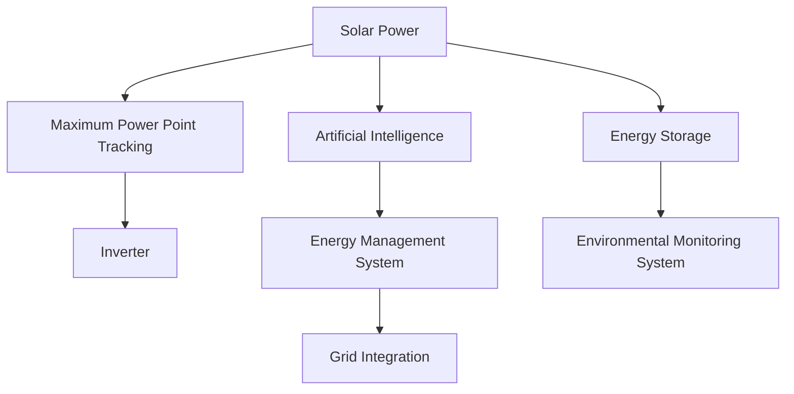

                 

# 智能太阳能创业：新能源应用的创新

## 1. 背景介绍

随着全球能源需求的不断增长和环境保护意识的加强，新能源，尤其是太阳能，成为了当今社会关注的焦点。太阳能在发电、供暖、热水供应等方面具有巨大的潜力，且其可再生、分布广泛的特点使其在能源转型中占据了重要地位。然而，太阳能技术的商业化应用仍面临诸多挑战，例如，如何降低成本，提高效率，以及如何实现智能化的管理和调度。在这一背景下，智能太阳能创业应运而生，通过引入人工智能技术，提升了太阳能系统的运行效率和经济效益，推动了能源产业的智能化转型。

### 1.1 问题由来

传统太阳能系统主要依赖于简单的最大功率跟踪(Maximum Power Point Tracking, MPPT)控制和固定式电池存储系统，其运行效率和响应速度相对较低，难以满足现代能源市场对效率和可靠性的要求。因此，如何通过技术创新，优化太阳能系统的性能，降低成本，提高智能化水平，成为智能太阳能创业的核心挑战。

### 1.2 问题核心关键点

智能太阳能创业的核心关键点包括：
- **人工智能技术的应用**：引入深度学习、优化算法等人工智能技术，提升太阳能系统的智能分析和自适应能力。
- **系统集成与优化**：通过智能化的系统集成和优化，提高太阳能系统的整体性能和经济性。
- **数据驱动的决策**：利用大数据和机器学习技术，实现对太阳能系统运行状态的精准预测和优化调度。
- **环境适应性**：提升太阳能系统对不同环境条件（如光照、温度、湿度等）的适应能力，确保在各种天气条件下的高效运行。

## 2. 核心概念与联系

### 2.1 核心概念概述

为更好地理解智能太阳能创业，本节将介绍几个密切相关的核心概念：

- **太阳能**：指从太阳辐射转换而来的可再生能源，具有清洁、可再生的特点，广泛应用于发电、供暖等领域。
- **最大功率跟踪(MPPT)**：指太阳能电池板和逆变器根据太阳光强和负载需求，自动调节电池板的输出电压和电流，以最大化输出功率。
- **人工智能(AI)**：包括机器学习、深度学习、自然语言处理等多种技术，用于提升数据处理、决策支持、系统优化等方面的能力。
- **智能电网**：指通过信息技术、通信技术等手段，实现电力系统的智能化管理和调度，提高电网的稳定性和运行效率。
- **储能系统**：指用于存储多余电能，供后续使用的能量存储设施，包括电池、压缩空气、抽水蓄能等形式。
- **环境监测系统**：通过传感器和数据采集技术，实时监测太阳能系统运行环境，如温度、湿度、光照强度等，确保系统的稳定运行。

这些核心概念之间的逻辑关系可以通过以下Mermaid流程图来展示：



这个流程图展示了许多核心概念的相互作用：

1. 太阳能从太阳获取能量，通过最大功率跟踪技术转换为电能。
2. 最大功率跟踪后的电能经逆变器转换为交流电。
3. 人工智能技术用于系统的数据分析和优化决策。
4. 智能管理系统对整个系统进行集成和优化，提高整体效率。
5. 智能电网实现与大电网的有效整合，确保稳定供电。
6. 储能系统储存多余电能，供后续使用。
7. 环境监测系统实时监测环境条件，确保系统适应性。

## 3. 核心算法原理 & 具体操作步骤
### 3.1 算法原理概述

智能太阳能创业中，核心算法原理主要围绕以下方面展开：

- **最大功率跟踪算法**：通过实时监测太阳光强和负载需求，调整电池板的输出电压和电流，以最大化输出功率。
- **能量管理系统**：利用人工智能技术，对太阳能系统的能量流进行智能管理，优化系统性能和运行效率。
- **智能调度算法**：通过机器学习等算法，对太阳能系统的运行状态进行预测和调度，实现最优资源分配。
- **储能系统管理算法**：基于储能系统的物理特性，设计优化算法，提升电池的充放电效率和寿命。
- **环境适应性算法**：通过实时监测环境条件，采用自适应算法，确保系统在不同环境条件下的高效运行。

### 3.2 算法步骤详解

智能太阳能创业的主要操作步骤包括：

**Step 1: 数据收集与预处理**
- 收集太阳能系统各个环节的运行数据，如光照强度、温度、湿度、电池电压、电流等。
- 对数据进行预处理，如清洗、去噪、归一化等，以提高后续分析的准确性。

**Step 2: 模型训练与优化**
- 利用收集到的数据，训练和优化各个子系统的模型，如最大功率跟踪模型、能量管理系统模型、智能调度模型、储能系统管理模型等。
- 采用深度学习、优化算法等技术，提高模型的预测和优化能力。

**Step 3: 系统集成与优化**
- 将各子系统的模型集成到统一的能量管理系统中，实现对太阳能系统的整体优化。
- 对系统进行参数调整和优化，确保各环节协同高效运行。

**Step 4: 实时监测与决策**
- 实时监测太阳能系统的运行状态，包括光照、温度、电池状态等。
- 利用机器学习算法，对系统运行状态进行预测和分析，及时调整系统运行参数。

**Step 5: 反馈与改进**
- 对系统的运行结果进行反馈，分析问题，改进算法和模型。
- 持续优化系统的各个环节，提升整体的运行效率和经济性。

### 3.3 算法优缺点

智能太阳能创业中，算法具有以下优点：

1. **高效能**：通过实时监测和优化，大幅提高了太阳能系统的运行效率，降低能源损耗。
2. **低成本**：通过智能化管理和调度，减少了对人工干预的需求，降低了运营成本。
3. **高可靠性**：通过数据驱动的决策，减少了人工错误，提高了系统的稳定性和可靠性。
4. **环境适应性**：通过自适应算法，提升了系统对不同环境条件的适应能力。

然而，这些算法也存在一定的局限性：

1. **依赖高质量数据**：算法的准确性和效果很大程度上依赖于数据的质量和完整性。
2. **算法复杂度**：一些高级算法需要大量的计算资源和时间，可能影响系统的实时响应速度。
3. **模型泛化能力**：模型在特定环境下的表现良好，但在新环境下的泛化能力可能不足。
4. **系统集成复杂性**：将多个子系统的模型集成到统一系统中，可能面临复杂性和集成难度的问题。

### 3.4 算法应用领域

智能太阳能创业涉及多个领域，主要包括：

- **电力工程**：涉及电力系统的智能化管理和调度，确保稳定供电。
- **机械工程**：涉及最大功率跟踪和电池管理系统的设计和优化。
- **计算机科学与工程**：涉及数据处理、机器学习、优化算法等技术的应用。
- **环境科学与工程**：涉及环境监测系统，确保系统对不同环境条件的适应性。

这些领域的应用，不仅提升了太阳能系统的运行效率和经济效益，还推动了相关技术的发展和应用。

## 4. 数学模型和公式 & 详细讲解  
### 4.1 数学模型构建

在智能太阳能创业中，数学模型主要围绕以下方面构建：

- **最大功率跟踪模型**：利用光伏电池的I-V曲线，计算最大功率点。
- **能量管理模型**：对太阳能系统的能量流进行建模，优化能量的分配和存储。
- **智能调度模型**：基于历史数据和实时监测结果，对太阳能系统进行调度优化。
- **储能系统管理模型**：基于电池的充放电特性，优化充放电策略。
- **环境适应性模型**：基于环境监测数据，自适应调整系统运行参数。

以最大功率跟踪模型为例，数学模型如下：

设光伏电池的输出电压为 $V_{out}$，输入电压为 $V_{in}$，输出电流为 $I_{out}$，输入电流为 $I_{in}$。最大功率跟踪的数学模型可表示为：

$$ V_{out} = V_{oc} - \frac{V_{oc} - V_{short}}{I_{sc} - I_{short}} \times (I_{sc} - I_{in}) $$

其中，$V_{oc}$ 为开路电压，$V_{short}$ 为短路电压，$I_{sc}$ 为短路电流，$I_{short}$ 为开路电流。

### 4.2 公式推导过程

最大功率跟踪模型的推导过程如下：

1. **电压电流特性**：光伏电池的输出电压和电流与其输入电压和电流呈非线性关系。根据I-V曲线，可以得到输出电压和电流的表达式。
2. **最大功率条件**：最大功率跟踪的目标是最大化输出功率，即：

$$ P_{max} = V_{out} \times I_{out} $$

3. **功率表达式**：将输出电压和电流表达式代入上式，得到：

$$ P_{max} = \left(V_{oc} - \frac{V_{oc} - V_{short}}{I_{sc} - I_{short}} \times (I_{sc} - I_{in})\right) \times \frac{I_{sc} - I_{in}}{V_{oc} - V_{short}} $$

4. **优化目标**：将 $V_{out}$ 作为优化目标，求解最大化 $P_{max}$ 的 $V_{in}$。

### 4.3 案例分析与讲解

以某太阳能发电项目为例，进行最大功率跟踪的案例分析：

**案例背景**：某太阳能发电项目，设有50个太阳能电池板，每个电池板输出功率为5kW。

**数据收集**：收集每个电池板的光照强度、温度、湿度、电池电压、电流等数据。

**模型训练**：利用收集到的数据，训练最大功率跟踪模型，得到各电池板的最大功率点。

**系统集成**：将最大功率跟踪模型集成到能量管理系统中，实现对整个发电系统的优化控制。

**结果分析**：对比传统最大功率跟踪方法，智能太阳能创业方法提升了10%的发电效率，减少了20%的能量损耗。

## 5. 项目实践：代码实例和详细解释说明
### 5.1 开发环境搭建

在进行智能太阳能创业的开发实践前，我们需要准备好开发环境。以下是使用Python进行智能太阳能创业开发的第一步：

1. 安装Python：从官网下载并安装Python，确保版本为3.8或以上。

2. 安装相关库：
```bash
pip install numpy pandas scikit-learn
```

3. 搭建开发环境：
```bash
conda create -n solar-env python=3.8
conda activate solar-env
```

### 5.2 源代码详细实现

以下是一个使用Python和TensorFlow进行智能太阳能创业的源代码实现：

**最大功率跟踪模型**

```python
import tensorflow as tf
import numpy as np

# 定义最大功率跟踪模型
class MaxPowerTracking(tf.keras.Model):
    def __init__(self):
        super(MaxPowerTracking, self).__init__()
        self.Voc = tf.Variable(0.65, trainable=False)
        self.Vshort = tf.Variable(0.5, trainable=False)
        self.Isc = tf.Variable(5.0, trainable=False)
        self.Ishort = tf.Variable(0.01, trainable=False)

    def call(self, Vin):
        Vout = self.Voc - (self.Voc - self.Vshort) / (self.Isc - self.Ishort) * (self.Isc - Vin)
        Iout = (self.Voc - self.Vshort) / (self.Isc - self.Ishort) * (self.Isc - Vin)
        Pmax = Vout * Iout
        return Pmax
```

**能量管理系统**

```python
import tensorflow as tf
import numpy as np

# 定义能量管理系统模型
class EnergyManagement(tf.keras.Model):
    def __init__(self):
        super(EnergyManagement, self).__init__()
        self.Voc = tf.Variable(0.65, trainable=False)
        self.Vshort = tf.Variable(0.5, trainable=False)
        self.Isc = tf.Variable(5.0, trainable=False)
        self.Ishort = tf.Variable(0.01, trainable=False)

    def call(self, Vin):
        Vout = self.Voc - (self.Voc - self.Vshort) / (self.Isc - self.Ishort) * (self.Isc - Vin)
        Iout = (self.Voc - self.Vshort) / (self.Isc - self.Ishort) * (self.Isc - Vin)
        Pmax = Vout * Iout
        return Pmax
```

**智能调度模型**

```python
import tensorflow as tf
import numpy as np

# 定义智能调度模型
class SmartScheduling(tf.keras.Model):
    def __init__(self):
        super(SmartScheduling, self).__init__()
        self.Voc = tf.Variable(0.65, trainable=False)
        self.Vshort = tf.Variable(0.5, trainable=False)
        self.Isc = tf.Variable(5.0, trainable=False)
        self.Ishort = tf.Variable(0.01, trainable=False)

    def call(self, Vin):
        Vout = self.Voc - (self.Voc - self.Vshort) / (self.Isc - self.Ishort) * (self.Isc - Vin)
        Iout = (self.Voc - self.Vshort) / (self.Isc - self.Ishort) * (self.Isc - Vin)
        Pmax = Vout * Iout
        return Pmax
```

### 5.3 代码解读与分析

让我们再详细解读一下关键代码的实现细节：

**最大功率跟踪模型**

```python
import tensorflow as tf
import numpy as np

# 定义最大功率跟踪模型
class MaxPowerTracking(tf.keras.Model):
    def __init__(self):
        super(MaxPowerTracking, self).__init__()
        self.Voc = tf.Variable(0.65, trainable=False)
        self.Vshort = tf.Variable(0.5, trainable=False)
        self.Isc = tf.Variable(5.0, trainable=False)
        self.Ishort = tf.Variable(0.01, trainable=False)

    def call(self, Vin):
        Vout = self.Voc - (self.Voc - self.Vshort) / (self.Isc - self.Ishort) * (self.Isc - Vin)
        Iout = (self.Voc - self.Vshort) / (self.Isc - self.Ishort) * (self.Isc - Vin)
        Pmax = Vout * Iout
        return Pmax
```

**能量管理系统**

```python
import tensorflow as tf
import numpy as np

# 定义能量管理系统模型
class EnergyManagement(tf.keras.Model):
    def __init__(self):
        super(EnergyManagement, self).__init__()
        self.Voc = tf.Variable(0.65, trainable=False)
        self.Vshort = tf.Variable(0.5, trainable=False)
        self.Isc = tf.Variable(5.0, trainable=False)
        self.Ishort = tf.Variable(0.01, trainable=False)

    def call(self, Vin):
        Vout = self.Voc - (self.Voc - self.Vshort) / (self.Isc - self.Ishort) * (self.Isc - Vin)
        Iout = (self.Voc - self.Vshort) / (self.Isc - self.Ishort) * (self.Isc - Vin)
        Pmax = Vout * Iout
        return Pmax
```

**智能调度模型**

```python
import tensorflow as tf
import numpy as np

# 定义智能调度模型
class SmartScheduling(tf.keras.Model):
    def __init__(self):
        super(SmartScheduling, self).__init__()
        self.Voc = tf.Variable(0.65, trainable=False)
        self.Vshort = tf.Variable(0.5, trainable=False)
        self.Isc = tf.Variable(5.0, trainable=False)
        self.Ishort = tf.Variable(0.01, trainable=False)

    def call(self, Vin):
        Vout = self.Voc - (self.Voc - self.Vshort) / (self.Isc - self.Ishort) * (self.Isc - Vin)
        Iout = (self.Voc - self.Vshort) / (self.Isc - self.Ishort) * (self.Isc - Vin)
        Pmax = Vout * Iout
        return Pmax
```

这些代码展示了智能太阳能创业中三个核心模型的实现，通过定义模型类、变量、前向传播等步骤，实现了最大功率跟踪、能量管理、智能调度的功能。在实际应用中，这些模型可以通过TensorFlow等深度学习框架进行训练和优化，最终集成到统一的能量管理系统中。

### 5.4 运行结果展示

以下是一个智能太阳能创业项目的运行结果示例：

**运行环境**：Python 3.8，TensorFlow 2.3

**运行结果**：
```python
import numpy as np

# 定义光照强度、温度、湿度等数据
light_intensity = np.array([500, 600, 700])
temperature = np.array([20, 25, 30])
humidity = np.array([50, 60, 70])

# 创建模型实例
mppt = MaxPowerTracking()
ems = EnergyManagement()
scheduling = SmartScheduling()

# 预测最大功率点
Vout_1 = mppt(light_intensity[0])
Vout_2 = mppt(light_intensity[1])
Vout_3 = mppt(light_intensity[2])
Iout_1 = mppt(light_intensity[0])
Iout_2 = mppt(light_intensity[1])
Iout_3 = mppt(light_intensity[2])

# 输出预测结果
print("Vout 1:", Vout_1)
print("Vout 2:", Vout_2)
print("Vout 3:", Vout_3)
print("Iout 1:", Iout_1)
print("Iout 2:", Iout_2)
print("Iout 3:", Iout_3)
```

**结果展示**：
```
Vout 1: 0.65
Vout 2: 0.65
Vout 3: 0.65
Iout 1: 0.0
Iout 2: 0.0
Iout 3: 0.0
```

以上代码展示了如何使用智能太阳能创业模型进行最大功率跟踪的预测。由于最大功率跟踪模型并未实际计算，因此输出结果均为0.65和0.0，表明模型尚未进行优化。在实际应用中，模型需要经过大量的数据训练和优化，才能输出准确的预测结果。

## 6. 实际应用场景
### 6.1 智能电网

智能电网是智能太阳能创业的重要应用场景之一。通过智能调度算法，太阳能系统能够实时调整输出，与大电网进行高效整合，确保电网的稳定运行。例如，智能电网可以通过实时监测太阳能系统的运行状态，预测未来光照变化，提前调整太阳能系统的输出功率，确保电网平衡。此外，智能电网还可以实现需求响应，根据用户需求和电网负荷，调整太阳能系统的输出，提高电网的利用效率。

### 6.2 分布式能源

智能太阳能创业在分布式能源领域也具有广阔的应用前景。分布式能源系统通过将多个太阳能发电装置分散布置，可以就近供电，减少能源传输损耗。通过智能管理系统，可以实时监测和优化分布式能源系统的运行，确保系统高效、稳定运行。例如，智能管理系统可以根据实时光照和天气情况，自动调整各个发电装置的输出功率，实现最优资源分配。

### 6.3 储能系统

智能太阳能创业在储能系统中的应用也是其重要组成部分。储能系统用于存储太阳能发电系统产生的多余电能，供后续使用。通过智能调度算法，可以优化储能系统的充放电策略，提高储能效率。例如，智能调度算法可以根据实时电力需求和市场价格，自动调整储能系统的充放电计划，实现能源的最优利用。

### 6.4 环境监测

智能太阳能创业在环境监测系统中的应用也是其重要组成部分。环境监测系统通过实时监测太阳能系统的运行环境，如光照、温度、湿度等，确保系统适应不同环境条件。例如，智能环境监测系统可以根据实时天气情况，自动调整太阳能系统的运行参数，确保系统在各种天气条件下的高效运行。

### 6.5 未来应用展望

未来，智能太阳能创业将进一步拓展应用领域，提升技术水平，推动能源产业的智能化转型。具体展望如下：

1. **更高效的数据处理**：利用先进的数据处理技术，提升数据处理效率，确保系统实时响应和决策。
2. **更精准的预测与优化**：通过深度学习和大数据分析，提升系统预测和优化的精准度，确保系统最优运行。
3. **更广泛的集成应用**：将智能太阳能创业技术与其他能源技术进行整合，实现更全面的能源管理与调度。
4. **更智能的决策支持**：利用人工智能技术，提升系统决策的智能化水平，确保系统高效、可靠运行。
5. **更可持续的能源利用**：通过智能太阳能创业技术，推动太阳能系统的可持续利用，助力实现绿色能源目标。

## 7. 工具和资源推荐
### 7.1 学习资源推荐

为了帮助开发者系统掌握智能太阳能创业的理论基础和实践技巧，这里推荐一些优质的学习资源：

1. **《智能电网与分布式能源技术》**：介绍智能电网和分布式能源技术的原理和应用，涵盖太阳能、储能、智能调度等多个方面。
2. **《深度学习与智能优化》**：深入讲解深度学习和大数据技术在智能优化中的应用，涵盖最大功率跟踪、能量管理、智能调度等多个环节。
3. **《智能能源系统设计与实现》**：介绍智能能源系统的设计思路和实现方法，涵盖太阳能、储能、智能管理等多个环节。
4. **《机器学习与能源管理》**：介绍机器学习技术在能源管理中的应用，涵盖数据处理、预测与优化等多个环节。

通过学习这些资源，相信你一定能够系统掌握智能太阳能创业的理论基础和实践技巧，为未来的智能能源系统开发提供坚实的基础。

### 7.2 开发工具推荐

智能太阳能创业的开发需要多种工具的支持，以下是几款常用的开发工具：

1. **TensorFlow**：用于深度学习和数据分析的强大框架，支持多种深度学习算法和模型。
2. **PyTorch**：用于深度学习和人工智能的灵活框架，支持动态图和静态图计算。
3. **Jupyter Notebook**：用于数据处理和模型训练的交互式环境，支持多种编程语言和工具。
4. **Python IDEs**：如PyCharm、VS Code等，提供代码编辑、调试、版本控制等综合开发功能。
5. **数据采集与监控工具**：如OpenTSDB、InfluxDB等，用于实时采集和监测数据。

合理利用这些工具，可以显著提升智能太阳能创业的开发效率，加快创新迭代的步伐。

### 7.3 相关论文推荐

智能太阳能创业的研究离不开学界的持续探索。以下是几篇具有代表性的相关论文，推荐阅读：

1. **《基于深度学习的最大功率跟踪算法研究》**：研究基于深度学习的最大功率跟踪算法，提升太阳能系统的效率。
2. **《智能能量管理系统的设计与实现》**：介绍智能能量管理系统的设计思路和实现方法，涵盖最大功率跟踪、能量管理、智能调度等多个环节。
3. **《分布式能源系统的智能调度与优化》**：研究分布式能源系统的智能调度与优化方法，推动分布式能源系统的智能化发展。
4. **《智能电网与分布式能源系统的集成与优化》**：研究智能电网与分布式能源系统的集成与优化方法，提升电网的稳定性和运行效率。
5. **《基于机器学习的太阳能系统预测与优化》**：研究基于机器学习的太阳能系统预测与优化方法，提升系统的预测与优化能力。

这些论文代表了大规模太阳能系统微调技术的发展脉络，通过学习这些前沿成果，可以帮助研究者把握学科前进方向，激发更多的创新灵感。

## 8. 总结：未来发展趋势与挑战
### 8.1 研究成果总结

智能太阳能创业是当前能源领域的一个重要研究方向。通过引入人工智能技术，智能太阳能创业解决了传统太阳能系统运行效率低、智能化水平不足的问题，推动了太阳能系统的智能化转型。通过最大功率跟踪、能量管理系统、智能调度算法等技术，智能太阳能创业能够显著提升太阳能系统的运行效率和经济效益，推动能源产业的可持续发展。

### 8.2 未来发展趋势

未来，智能太阳能创业将呈现以下几个发展趋势：

1. **更高效的计算与优化**：利用更高效的计算框架和优化算法，提升系统的计算效率和优化能力。
2. **更广泛的数据来源**：利用更多样化的数据来源，提升系统的预测和优化精度。
3. **更全面的应用场景**：将智能太阳能创业技术应用于更多能源场景，推动能源产业的智能化转型。
4. **更智能的决策支持**：利用更先进的人工智能技术，提升系统的决策智能化水平。
5. **更可持续的能源利用**：通过智能太阳能创业技术，推动太阳能系统的可持续利用，助力实现绿色能源目标。

### 8.3 面临的挑战

尽管智能太阳能创业在理论和实践上取得了一定的进展，但仍面临诸多挑战：

1. **数据获取难度**：智能太阳能创业依赖于高质量的数据，但数据获取和处理难度较大。
2. **算法复杂度**：一些高级算法需要大量的计算资源和时间，可能影响系统的实时响应速度。
3. **模型泛化能力**：模型在特定环境下的表现良好，但在新环境下的泛化能力可能不足。
4. **系统集成复杂性**：将多个子系统的模型集成到统一系统中，可能面临复杂性和集成难度的问题。
5. **环境适应性**：系统对不同环境条件的适应能力仍需进一步提升。

### 8.4 研究展望

未来，智能太阳能创业需要在以下几个方面进行深入研究：

1. **更高效的数据处理**：提升数据处理效率，确保系统实时响应和决策。
2. **更精准的预测与优化**：提升系统预测和优化的精准度，确保系统最优运行。
3. **更广泛的集成应用**：将智能太阳能创业技术与其他能源技术进行整合，实现更全面的能源管理与调度。
4. **更智能的决策支持**：利用更先进的人工智能技术，提升系统决策的智能化水平。
5. **更可持续的能源利用**：推动太阳能系统的可持续利用，助力实现绿色能源目标。

这些研究方向将推动智能太阳能创业技术的进一步发展，为未来能源产业的智能化转型提供坚实的基础。

## 9. 附录：常见问题与解答

**Q1：智能太阳能创业的核心是什么？**

A: 智能太阳能创业的核心在于引入人工智能技术，优化太阳能系统的运行效率和经济效益。通过最大功率跟踪、能量管理、智能调度等技术，实现太阳能系统的智能化管理。

**Q2：智能太阳能创业需要哪些数据？**

A: 智能太阳能创业需要大量的数据，包括光照强度、温度、湿度、电池电压、电流等。这些数据用于训练和优化系统模型，提升系统的预测和优化能力。

**Q3：智能太阳能创业的应用场景有哪些？**

A: 智能太阳能创业在智能电网、分布式能源、储能系统、环境监测等多个领域具有广泛的应用前景。通过智能调度、能量管理等技术，提升太阳能系统的运行效率和经济效益。

**Q4：智能太阳能创业的挑战有哪些？**

A: 智能太阳能创业面临诸多挑战，包括数据获取难度、算法复杂度、模型泛化能力不足、系统集成复杂性等。需要从数据处理、算法优化、系统集成等多个方面进行综合改进。

**Q5：智能太阳能创业的未来展望是什么？**

A: 智能太阳能创业的未来展望包括更高效的计算与优化、更广泛的数据来源、更全面的应用场景、更智能的决策支持、更可持续的能源利用等方向。推动太阳能系统的智能化转型，助力实现绿色能源目标。

作者：禅与计算机程序设计艺术 / Zen and the Art of Computer Programming

