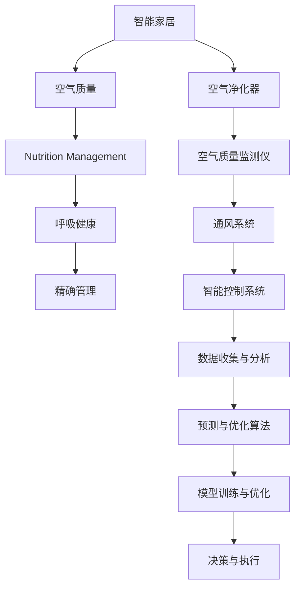

                 

# 智能家居空气营养创业：呼吸健康的精确管理

> 关键词：智能家居, 空气质量, 营养管理, 呼吸健康, 精确管理

## 1. 背景介绍

### 1.1 问题由来
随着现代社会的发展，人们的居住环境和生活方式发生了显著变化。空气污染、室内空气质量问题、健康饮食习惯等因素，对人们的健康产生了深远影响。尤其在城市化进程加速的背景下，居住环境的空气质量问题愈发突出，室内空气污染已成为威胁人类健康的重要因素。然而，传统的室内空气质量监测和管理方法，由于技术手段的限制，无法提供精确的空气营养管理方案，难以满足人们对呼吸健康的需求。

### 1.2 问题核心关键点
为了提升室内空气质量，保障人们的呼吸健康，传统方法通常依赖以下手段：
- 空气质量监测仪：通过实时监测空气中的颗粒物、甲醛、二氧化碳等有害物质，进行空气质量的初步评估。
- 空气净化器：利用过滤网或光催化等技术，去除空气中的有害物质，改善室内空气质量。
- 通风系统：通过自然或机械通风，调节室内外空气流通，提升空气新鲜度。

尽管这些方法在一定程度上可以改善室内空气质量，但仍存在以下局限性：
- 监测精度不足：传统监测仪往往只能提供简单的空气质量指标，无法提供更详细的空气成分信息。
- 治理效果有限：空气净化器等设备只能被动净化空气，无法主动调节空气成分，难以达到理想的空气质量标准。
- 自动化程度低：通风系统缺乏智能化控制，难以根据实时空气质量数据动态调整通风策略。

基于这些挑战，本文提出了一种基于AI技术的智能家居空气营养创业方案，旨在通过精确管理室内空气质量，实现呼吸健康的科学管理。

## 2. 核心概念与联系

### 2.1 核心概念概述

为了更好地理解本方案的核心思想和技术原理，本节将介绍几个密切相关的核心概念：

- **智能家居（Smart Home）**：指通过互联网、物联网等技术，实现对家庭各种设备、设施的智能控制和自动化管理的居住环境。
- **空气质量（Air Quality）**：指空气中各种成分的浓度，如颗粒物、甲醛、二氧化碳等有害物质，以及氧气、负离子等有益成分的含量。
- **营养管理（Nutrition Management）**：指通过科学管理和精准调控，达到理想的健康饮食习惯和生活状态。
- **呼吸健康（Respiratory Health）**：指维持良好的呼吸系统功能，预防和缓解呼吸系统疾病，保障身体健康。
- **精确管理（Precision Management）**：指通过数据驱动的决策支持系统，实现对空气营养和呼吸健康的精细化控制。

这些概念之间的逻辑关系可以通过以下Mermaid流程图来展示：



这个流程图展示了大语言模型微调方案的核心概念及其之间的关系：

1. 智能家居环境通过各类传感器收集室内外空气质量数据。
2. 利用空气质量监测仪和空气净化器，对空气质量进行实时监测和主动治理。
3. 通过通风系统调节室内外空气流通，优化空气质量。
4. 智能控制系统根据实时数据和用户需求，动态调整各类设备的运行状态。
5. 数据收集与分析模块，对收集到的空气质量数据进行科学处理和分析，提取有用的信息。
6. 预测与优化算法模块，利用AI技术对未来空气质量进行预测和优化。
7. 模型训练与优化模块，根据历史数据和预测结果，优化空气质量管理模型。
8. 决策与执行模块，基于模型输出，动态调整各设备参数，实现精确管理。

## 3. 核心算法原理 & 具体操作步骤
### 3.1 算法原理概述

智能家居空气营养创业的核心算法原理基于数据驱动的决策支持系统，结合AI技术和室内空气质量管理技术，通过精确管理和科学调控，保障人们的呼吸健康。

本方案的核心思想是将室内空气质量监测、净化和优化过程视为一个动态系统，通过数据收集、模型训练、决策执行等步骤，实现对空气营养的精确管理。其基本流程如下：

1. **数据收集**：利用各类传感器实时收集室内外空气质量数据，包括颗粒物、甲醛、二氧化碳、负离子等成分的浓度。
2. **数据处理**：对收集到的空气质量数据进行清洗和预处理，提取有用的特征和指标。
3. **模型训练**：基于历史数据和实时数据，训练空气质量预测和优化模型，以实现对未来空气质量的精确预测和优化。
4. **决策执行**：根据模型输出，动态调整空气净化器、通风系统等设备的运行参数，实现对空气质量的精准调控。
5. **效果评估**：实时监测和评估空气质量改善效果，根据反馈数据调整模型和决策策略，确保最佳空气质量状态。

### 3.2 算法步骤详解

以下详细阐述了基于AI技术的智能家居空气营养创业方案的核心算法步骤：

**Step 1: 数据收集与预处理**
- 部署各类传感器，如颗粒物传感器、甲醛传感器、二氧化碳传感器、负离子传感器等，实时监测室内外空气质量。
- 利用物联网技术，将传感器数据传输至中央控制系统。
- 对收集到的数据进行清洗和预处理，包括去除异常值、填充缺失值、标准化等，提取有用的空气质量特征。

**Step 2: 模型训练与优化**
- 准备历史空气质量数据，划分为训练集、验证集和测试集。
- 利用深度学习框架，如TensorFlow或PyTorch，搭建空气质量预测和优化模型。
- 选择合适的优化算法和损失函数，训练模型。
- 在验证集上评估模型性能，调整模型参数，优化模型表现。

**Step 3: 预测与优化**
- 利用训练好的模型，对实时空气质量数据进行预测，得到未来空气质量的变化趋势。
- 根据预测结果，动态调整空气净化器、通风系统等设备的运行参数，实现精确管理。

**Step 4: 效果评估与反馈**
- 实时监测空气质量改善效果，收集反馈数据。
- 根据反馈数据，调整模型和决策策略，不断优化空气质量管理方案。

### 3.3 算法优缺点

基于AI技术的智能家居空气营养创业方案具有以下优点：

- **精度高**：利用AI技术进行精确预测和优化，能够实现对空气质量的高精度控制。
- **自动化程度高**：通过智能控制系统，自动调整设备和运行策略，提升用户体验。
- **动态性**：能够根据实时数据动态调整空气质量管理方案，及时应对变化。

同时，该方案也存在以下局限性：

- **成本高**：初期设备和数据收集成本较高，对一些家庭可能难以承受。
- **复杂度高**：方案涉及多个设备和系统，设计和维护较为复杂。
- **依赖技术**：对传感器的精度和数据的完整性有较高要求，技术实现难度大。

### 3.4 算法应用领域

基于AI技术的智能家居空气营养创业方案在多个领域都有广泛应用：

- **智能住宅**：适用于各种家庭环境，提供个性化的空气质量管理方案。
- **商业建筑**：如办公楼、酒店等，通过精确管理提升室内空气质量，改善用户体验。
- **医院和养老院**：在医疗和养老环境中，提供健康、舒适的空气质量保障。
- **公共交通**：如地铁、飞机等，通过精确管理提升车内空气质量，保障乘客健康。

## 4. 数学模型和公式 & 详细讲解  
### 4.1 数学模型构建

为了更严谨地描述智能家居空气质量管理方案的算法原理，本节将使用数学语言对其核心模型进行详细讲解。

假设我们有一个线性回归模型 $f(x;w)=w_0+w_1x_1+w_2x_2+\dots+w_nx_n$，其中 $w_0, w_1, \dots, w_n$ 为模型的权重，$x_1, x_2, \dots, x_n$ 为输入特征，$f(x;w)$ 为输出结果。假设我们收集到了 $N$ 个历史空气质量数据 $(x_i, y_i)$，其中 $x_i$ 为特征向量，$y_i$ 为空气质量指标。

我们的目标是最小化均方误差损失函数 $\mathcal{L}=\frac{1}{N}\sum_{i=1}^N(y_i-f(x_i;w))^2$。利用梯度下降算法，求解最优的权重向量 $w$：

$$
w_{k+1}=w_k-\eta\nabla_{w_k}\mathcal{L}
$$

其中，$\eta$ 为学习率，$\nabla_{w_k}\mathcal{L}$ 为损失函数对权重的梯度。

### 4.2 公式推导过程

对于线性回归模型，其梯度表达式为：

$$
\nabla_{w_k}\mathcal{L}=\frac{1}{N}\sum_{i=1}^N(2y_i-f(x_i;w))x_i
$$

将其带入梯度下降算法，得到权重更新公式：

$$
w_{k+1}=w_k-\eta\frac{1}{N}\sum_{i=1}^N(2y_i-f(x_i;w))x_i
$$

为了实现更复杂的非线性模型，可以引入神经网络结构，将输入特征通过多个隐层进行映射，得到非线性的输出结果。以多层感知机（MLP）为例，其数学模型为：

$$
f(x;w)=w^{(L)}o^{(L-1)}+w^{(L-1)}o^{(L-2)}+\dots+w^{(1)}x
$$

其中 $w^{(l)}$ 为第 $l$ 层的权重矩阵，$o^{(l)}$ 为第 $l$ 层的输出。

在神经网络中，梯度下降算法的更新公式为：

$$
w^{(l)}_{k+1}=w^{(l)}_k-\eta\nabla_{w^{(l)}_k}\mathcal{L}
$$

其中，$\nabla_{w^{(l)}_k}\mathcal{L}$ 为损失函数对第 $l$ 层的梯度。通过反向传播算法，可以高效计算梯度，实现模型的训练和优化。

### 4.3 案例分析与讲解

以一个简单的空气质量预测模型为例，我们将收集到的空气质量数据输入模型进行训练和预测：

- **数据准备**：收集历史空气质量数据 $(x_i, y_i)$，划分为训练集、验证集和测试集。
- **模型搭建**：利用PyTorch搭建多层感知机模型，定义输入层、隐层和输出层，设置合适的网络结构。
- **模型训练**：在训练集上训练模型，优化损失函数，调整模型参数。
- **模型预测**：利用训练好的模型对实时空气质量数据进行预测，得到未来空气质量的变化趋势。

## 5. 项目实践：代码实例和详细解释说明
### 5.1 开发环境搭建

在进行空气质量管理系统的开发前，我们需要准备好开发环境。以下是使用Python进行PyTorch开发的环境配置流程：

1. 安装Anaconda：从官网下载并安装Anaconda，用于创建独立的Python环境。

2. 创建并激活虚拟环境：
```bash
conda create -n air_quality_env python=3.8 
conda activate air_quality_env
```

3. 安装PyTorch：根据CUDA版本，从官网获取对应的安装命令。例如：
```bash
conda install pytorch torchvision torchaudio cudatoolkit=11.1 -c pytorch -c conda-forge
```

4. 安装TensorFlow：
```bash
pip install tensorflow
```

5. 安装各类工具包：
```bash
pip install numpy pandas scikit-learn matplotlib tqdm jupyter notebook ipython
```

完成上述步骤后，即可在`air_quality_env`环境中开始空气质量管理系统的开发。

### 5.2 源代码详细实现

下面以一个简单的空气质量预测模型为例，给出使用PyTorch进行模型训练和预测的PyTorch代码实现。

首先，定义模型的输入、隐藏层和输出：

```python
import torch
import torch.nn as nn

class AirQualityModel(nn.Module):
    def __init__(self, input_dim, hidden_dim, output_dim):
        super(AirQualityModel, self).__init__()
        self.fc1 = nn.Linear(input_dim, hidden_dim)
        self.fc2 = nn.Linear(hidden_dim, hidden_dim)
        self.fc3 = nn.Linear(hidden_dim, output_dim)
        
    def forward(self, x):
        x = torch.relu(self.fc1(x))
        x = torch.relu(self.fc2(x))
        x = self.fc3(x)
        return x
```

然后，定义模型训练和预测函数：

```python
from torch.utils.data import TensorDataset, DataLoader

def train_model(model, train_data, valid_data, epochs=10, batch_size=32):
    criterion = nn.MSELoss()
    optimizer = torch.optim.Adam(model.parameters(), lr=0.01)
    
    train_loader = DataLoader(train_data, batch_size=batch_size, shuffle=True)
    valid_loader = DataLoader(valid_data, batch_size=batch_size, shuffle=False)
    
    for epoch in range(epochs):
        model.train()
        train_loss = 0.0
        for data in train_loader:
            inputs, labels = data
            optimizer.zero_grad()
            outputs = model(inputs)
            loss = criterion(outputs, labels)
            loss.backward()
            optimizer.step()
            train_loss += loss.item() * inputs.size(0)
        
        model.eval()
        valid_loss = 0.0
        with torch.no_grad():
            for data in valid_loader:
                inputs, labels = data
                outputs = model(inputs)
                loss = criterion(outputs, labels)
                valid_loss += loss.item() * inputs.size(0)
        
        print(f"Epoch {epoch+1}/{epochs}, train loss: {train_loss/len(train_data):.4f}, valid loss: {valid_loss/len(valid_data):.4f}")
        
    return model

def predict(model, data):
    model.eval()
    with torch.no_grad():
        outputs = model(data)
    return outputs
```

最后，启动模型训练和预测流程：

```python
# 定义训练数据和标签
X_train = torch.randn(100, 4)  # 生成100个随机样本，每个样本4维
y_train = torch.randn(100)  # 生成100个随机标签

# 定义测试数据和标签
X_valid = torch.randn(20, 4)
y_valid = torch.randn(20)

# 创建模型
model = AirQualityModel(input_dim=4, hidden_dim=10, output_dim=1)

# 训练模型
trained_model = train_model(model, (X_train, y_train), (X_valid, y_valid))

# 预测新数据
new_data = torch.randn(1, 4)
predictions = predict(trained_model, new_data)
print(predictions)
```

以上就是使用PyTorch搭建简单的空气质量预测模型的完整代码实现。通过该模型，可以对新的空气质量数据进行预测，实现对未来空气质量的初步评估。

### 5.3 代码解读与分析

让我们再详细解读一下关键代码的实现细节：

**AirQualityModel类**：
- `__init__`方法：初始化模型的输入层、隐藏层和输出层。
- `forward`方法：定义模型前向传播的计算流程。

**train_model函数**：
- `criterion`定义损失函数，使用均方误差损失。
- `optimizer`定义优化器，使用Adam算法。
- 通过DataLoader将训练数据和标签加载到内存中，以批为单位进行迭代训练。
- 在每个epoch中，对模型进行前向传播和反向传播，计算损失函数，并根据梯度更新模型参数。
- 在验证集上评估模型性能，并输出训练和验证的损失值。

**predict函数**：
- 将模型设置为评估模式，不计算梯度。
- 对新数据进行前向传播，得到预测结果。
- 返回预测结果。

可以看到，使用PyTorch搭建和训练模型非常方便高效，只需定义模型结构，指定损失函数和优化器，即可快速实现模型的训练和预测。

当然，实际应用中还需要根据具体需求，对模型进行优化和改进。例如，可以引入卷积层、池化层、dropout等操作，提高模型的表达能力和泛化能力。同时，需要考虑模型的实时性和计算效率，优化模型结构和计算图。

## 6. 实际应用场景
### 6.1 智能住宅应用

智能家居空气质量管理方案在智能住宅中的应用，可以显著提升居住环境的舒适度和健康水平。通过智能控制系统，实时监测和优化室内空气质量，可以保障家庭成员的健康，提升居住体验。

具体应用场景如下：

- **智能空气净化器**：自动监测室内空气质量，当PM2.5、甲醛、二氧化碳等指标超过预设阈值时，自动开启空气净化器进行净化。
- **智能通风系统**：根据室内外空气质量数据，动态调整通风策略，实现新风和排风平衡，提升空气新鲜度。
- **智能湿度调节**：监测室内湿度，根据实时数据自动调节加湿器和除湿器，保持适宜的湿度环境。

### 6.2 商业建筑应用

在商业建筑中，应用智能家居空气质量管理方案，可以提升室内空气质量，改善办公和住宿环境，提升用户体验和企业形象。

具体应用场景如下：

- **智能空气净化器**：部署在办公区域和会议室中，自动监测空气质量，并提供实时反馈。
- **智能空调系统**：通过智能控制系统，根据空气质量数据调节空调温度和风速，提升舒适度和健康性。
- **智能植物养护**：在办公室和会议室中，自动监测室内空气质量，根据数据调整植物养护策略，保持室内空气清新。

### 6.3 医院和养老院应用

在医院和养老院中，空气质量对病人的康复和治疗效果有重要影响。应用智能家居空气质量管理方案，可以保障病人的呼吸健康，提升治疗效果。

具体应用场景如下：

- **智能空气净化器**：在医院和养老院的病房、治疗室中，自动监测空气质量，并提供实时反馈。
- **智能湿度调节**：监测室内湿度，根据实时数据自动调节加湿器和除湿器，保持适宜的湿度环境。
- **智能通风系统**：在病房和养老院中，根据空气质量数据动态调整通风策略，提升空气新鲜度。

### 6.4 未来应用展望

随着智能家居和物联网技术的发展，智能家居空气质量管理方案将会有更加广泛的应用前景。未来，该方案将能够支持更多的设备和场景，实现更加精细化的空气质量管理。

- **多模态融合**：通过融合空气质量传感器、湿度传感器、噪音传感器等多模态数据，实现更全面的室内环境监测和优化。
- **个性化定制**：根据家庭成员和用户的健康状况和生活习惯，提供个性化的空气质量管理方案。
- **智能预警**：通过实时监测和数据分析，及时预警潜在的空气质量问题，提升应急响应能力。
- **智慧社区**：在智慧社区中，通过统一的智能管理系统，实现对各家庭空气质量的集中管理和优化。

总之，智能家居空气质量管理方案将为居民提供更加舒适、健康、安全的居住环境，为商业建筑和医院提供更加智能、高效的室内空气质量管理解决方案。未来，该方案的应用将更加广泛和深入，进一步提升人们对呼吸健康的关注和保障。

## 7. 工具和资源推荐
### 7.1 学习资源推荐

为了帮助开发者系统掌握智能家居空气质量管理方案的理论基础和实践技巧，这里推荐一些优质的学习资源：

1. **《深度学习》（Ian Goodfellow著）**：深度学习领域的经典教材，涵盖深度学习的基本原理和应用。
2. **《PyTorch官方文档》**：PyTorch官方文档，详细介绍了PyTorch的API、模型构建、训练与优化等内容。
3. **《TensorFlow官方文档》**：TensorFlow官方文档，全面介绍了TensorFlow的基本原理和应用。
4. **《智能家居技术与应用》**：介绍智能家居系统的基础知识和典型应用，涵盖传感器、控制系统、物联网等内容。
5. **《室内空气质量监测与控制》**：介绍室内空气质量监测和控制的基本原理和实践方法。

通过学习这些资源，相信你一定能够快速掌握智能家居空气质量管理方案的理论基础和实践技巧，实现更加精确、智能的空气质量管理。

### 7.2 开发工具推荐

高效的开发离不开优秀的工具支持。以下是几款用于智能家居空气质量管理方案开发的常用工具：

1. **PyTorch**：基于Python的开源深度学习框架，灵活高效，适合快速迭代研究。
2. **TensorFlow**：由Google主导开发的开源深度学习框架，生产部署方便，适合大规模工程应用。
3. **AirQuality Monitor**：一款开源的室内空气质量监测工具，支持多种传感器接口，易于集成。
4. **IOT Platform**：物联网平台，支持多种智能设备和传感器，方便统一管理和控制。
5. **AirQuality Intelligence**：一款智能家居空气质量管理解决方案，集成了数据收集、模型训练、决策执行等功能。

合理利用这些工具，可以显著提升智能家居空气质量管理方案的开发效率，加快创新迭代的步伐。

### 7.3 相关论文推荐

智能家居空气质量管理方案的发展源于学界的持续研究。以下是几篇奠基性的相关论文，推荐阅读：

1. **《基于深度学习的室内空气质量预测》**：介绍利用深度学习模型进行室内空气质量预测的方法。
2. **《智能家居中的空气质量管理》**：探讨智能家居系统中的空气质量管理技术，提出基于模型的空气质量优化方法。
3. **《物联网技术在智能家居中的应用》**：介绍物联网技术在智能家居中的基本应用和实践方法。
4. **《室内空气质量传感器技术综述》**：综述当前室内空气质量传感器的技术现状和应用前景。
5. **《室内空气质量监测系统的设计与实现》**：介绍室内空气质量监测系统的设计与实现方法，提供实际应用案例。

这些论文代表了大语言模型微调技术的发展脉络。通过学习这些前沿成果，可以帮助研究者把握学科前进方向，激发更多的创新灵感。

## 8. 总结：未来发展趋势与挑战
### 8.1 总结

本文对智能家居空气质量管理方案进行了全面系统的介绍。首先阐述了智能家居和空气质量管理的相关背景和意义，明确了空气质量管理方案在健康保障、智能控制等方面的重要价值。其次，从原理到实践，详细讲解了方案的核心算法和操作步骤，给出了具体的代码实例。同时，本文还探讨了方案在智能住宅、商业建筑、医院和养老院等不同场景中的应用前景，展示了方案的广泛适用性。

通过本文的系统梳理，可以看到，智能家居空气质量管理方案已经成为一个热门的技术方向，为提升人们的呼吸健康提供了强有力的技术支持。未来，随着AI技术的发展和物联网应用的深入，该方案将能够进一步优化室内空气质量，为人们提供更加健康、舒适、智能的居住环境。

### 8.2 未来发展趋势

展望未来，智能家居空气质量管理方案将呈现以下几个发展趋势：

1. **多模态融合**：融合更多传感器数据，实现更全面、精确的室内环境监测和优化。
2. **个性化定制**：根据用户的生活习惯和健康状况，提供更加个性化、精细化的空气质量管理方案。
3. **智慧社区**：在智慧社区中，通过统一的智能管理系统，实现对各家庭空气质量的集中管理和优化。
4. **智能预警**：通过实时监测和数据分析，及时预警潜在的空气质量问题，提升应急响应能力。
5. **智能控制系统**：结合自动化和智能化技术，实现更加智能、高效的空气质量管理。

以上趋势凸显了智能家居空气质量管理方案的广阔前景。这些方向的探索发展，必将进一步提升室内空气质量管理的效果，为人们提供更加健康、舒适、安全的居住环境。

### 8.3 面临的挑战

尽管智能家居空气质量管理方案已经取得了显著进展，但在迈向更加智能化、普适化应用的过程中，仍面临诸多挑战：

1. **传感器精度**：传感器的精度和稳定性对空气质量监测的准确性至关重要，但现有的传感器往往难以满足高精度要求。
2. **数据集成与处理**：不同类型、不同来源的数据需要统一集成和处理，如何实现高效、可靠的数据融合，是一个重要挑战。
3. **模型训练与优化**：模型训练需要大量的历史数据和计算资源，如何高效、稳定地训练和优化模型，是一个技术难题。
4. **用户体验**：系统需要提供直观、易用的界面，让用户能够轻松了解空气质量情况和操作智能设备。
5. **安全与隐私**：智能家居系统需要保障数据安全和用户隐私，如何设计安全、可控的架构，是一个重要问题。

正视这些挑战，积极应对并寻求突破，将使智能家居空气质量管理方案更加成熟可靠，为人们的健康生活提供更有力的技术支持。

### 8.4 研究展望

面对智能家居空气质量管理方案所面临的挑战，未来的研究需要在以下几个方面寻求新的突破：

1. **高精度传感器技术**：开发更高精度的传感器，提升空气质量监测的准确性。
2. **数据融合与处理**：探索高效的数据融合和处理算法，提升数据集成和处理能力。
3. **轻量级模型优化**：开发轻量级的空气质量管理模型，提高训练和推理效率。
4. **智能界面设计**：设计直观、易用的智能家居系统界面，提升用户体验。
5. **安全与隐私保护**：建立安全、可控的系统架构，保障数据安全和用户隐私。

这些研究方向的探索，必将引领智能家居空气质量管理方案迈向更高的台阶，为人们的健康生活提供更有力的技术支持。面向未来，智能家居空气质量管理方案还需要与其他人工智能技术进行更深入的融合，如知识表示、因果推理、强化学习等，多路径协同发力，共同推动空气质量管理系统的进步。只有勇于创新、敢于突破，才能不断拓展空气质量管理系统的边界，让智能技术更好地造福人类社会。

## 9. 附录：常见问题与解答

**Q1：智能家居空气质量管理方案需要部署哪些传感器？**

A: 智能家居空气质量管理方案需要部署以下传感器：

- **颗粒物传感器**：用于监测空气中的PM2.5、PM10等颗粒物浓度。
- **甲醛传感器**：用于监测空气中的甲醛浓度。
- **二氧化碳传感器**：用于监测空气中的二氧化碳浓度。
- **负离子传感器**：用于监测空气中的负离子浓度。
- **温湿度传感器**：用于监测室内外温度和湿度。
- **噪音传感器**：用于监测室内的噪音水平。

这些传感器可以实时监测和记录空气质量数据，为系统提供可靠的监测信息。

**Q2：智能家居空气质量管理方案对数据质量和数据量有哪些要求？**

A: 智能家居空气质量管理方案对数据质量和数据量有以下要求：

- **数据质量**：传感器数据需要高精度、高稳定性和低噪声，以确保监测结果的可靠性。
- **数据量**：需要收集大量的历史数据和实时数据，以训练和优化空气质量预测和优化模型。数据量越大，模型的预测精度越高。

数据质量和数据量是智能家居空气质量管理方案成功与否的关键因素，需要在设计和管理过程中进行严格控制和优化。

**Q3：智能家居空气质量管理方案的训练与优化过程中需要注意哪些问题？**

A: 智能家居空气质量管理方案的训练与优化过程中需要注意以下问题：

- **数据清洗与预处理**：对收集到的数据进行清洗和预处理，去除异常值和噪声，提取有用的特征。
- **模型选择与设计**：根据具体需求选择合适的模型结构和训练策略，设计合适的损失函数和优化算法。
- **超参数调优**：根据模型性能，调整学习率、批大小、正则化参数等超参数，优化模型效果。
- **模型评估与验证**：在验证集上评估模型性能，调整模型参数，优化模型效果。
- **实时监测与反馈**：在实际应用中，实时监测空气质量改善效果，根据反馈数据调整模型和决策策略。

这些关键步骤需要精心设计和优化，才能确保智能家居空气质量管理方案的效果和稳定性。

**Q4：智能家居空气质量管理方案在实际应用中需要注意哪些问题？**

A: 智能家居空气质量管理方案在实际应用中需要注意以下问题：

- **设备兼容性与可靠性**：确保各传感器和设备与系统兼容，提高设备的可靠性和稳定性。
- **数据传输与存储**：确保数据传输和存储的安全性，保障数据安全和用户隐私。
- **用户体验与界面设计**：设计直观、易用的用户界面，提升用户的操作体验。
- **安全与隐私保护**：设计安全、可控的系统架构，保障数据安全和用户隐私。
- **算法优化与维护**：持续优化算法和模型，保持系统的稳定性和高效性。

这些因素对智能家居空气质量管理方案的实际应用至关重要，需要在设计和实施过程中进行全面考虑和优化。

---

作者：禅与计算机程序设计艺术 / Zen and the Art of Computer Programming

