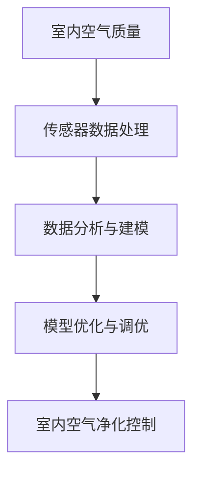

                 

# 智能家居防霾创业：室内空气质量的精确控制

## 1. 背景介绍

### 1.1 问题由来

近年来，随着城市化进程的加快和生活质量的提升，室内空气污染问题日益严重。室内空气质量的恶化，不仅会影响居民的身体健康，还可能带来潜在的经济损失。据统计，每年由室内空气污染导致的健康问题（如呼吸系统疾病、皮肤过敏等）在欧美发达国家已经占到总疾病负担的10%左右。因此，如何准确、实时地监测和控制室内空气质量，成为智能家居领域的重要课题。

### 1.2 问题核心关键点

本项目聚焦于室内空气质量的精确控制，主要涉及以下几个核心问题：

- 如何通过传感器数据准确预测室内空气质量。
- 如何实现室内空气质量的实时监控和精确控制。
- 如何设计高效的智能家居防霾系统，保证用户体验和系统稳定。
- 如何利用大数据和人工智能技术，提升防霾系统的智能化水平。

### 1.3 问题研究意义

通过本项目，可以构建一套智能家居防霾系统，对室内空气质量进行精准监测和控制，提升居住环境的健康舒适性，为消费者提供智能化的居住体验。此外，系统还可能带动相关产业链的发展，如传感器、空气净化器、智能家居设备等，为智能家居市场带来新的增长点。

## 2. 核心概念与联系

### 2.1 核心概念概述

本项目涉及以下几个核心概念：

- 室内空气质量（IAQ）：指室内空气中的污染物浓度，如PM2.5、CO2、甲醛等。通过传感器检测污染物浓度，可以评估室内空气质量。
- 智能家居防霾系统：指基于传感器、空气净化器等硬件设备，结合大数据和人工智能技术，实现室内空气质量实时监测和控制的软件系统。
- 传感器数据处理：指通过传感器采集室内空气质量数据，并进行预处理和清洗，为后续分析提供高质量的输入数据。
- 数据分析与建模：指对传感器数据进行统计分析和机器学习建模，预测室内空气质量变化趋势。
- 模型优化与调优：指通过超参数调整和模型融合等技术手段，提升模型预测的准确性和鲁棒性。
- 室内空气净化控制：指根据空气质量预测结果，自动调节空气净化器的工作模式和参数，实现室内空气质量的精确控制。

这些概念之间的逻辑关系可以通过以下Mermaid流程图来展示：



这个流程图展示了我项目的基本流程：通过传感器获取室内空气质量数据，进行预处理和分析建模，优化模型并控制空气净化器，从而实现室内空气质量的精确控制。

## 3. 核心算法原理 & 具体操作步骤
### 3.1 算法原理概述

本项目采用机器学习和大数据分析技术，实现室内空气质量的精确控制。主要涉及以下几个算法和步骤：

1. 传感器数据预处理和清洗。
2. 室内空气质量的数据分析和建模。
3. 模型优化与调优。
4. 室内空气净化控制策略的设计和实现。

### 3.2 算法步骤详解

#### 3.2.1 传感器数据预处理和清洗

室内空气质量的传感器数据需要经过预处理和清洗，才能进行后续分析。主要步骤如下：

- 数据采集：通过传感器实时采集室内空气质量数据，如PM2.5、CO2、甲醛等。
- 数据清洗：去除传感器数据中的异常值和噪声，避免对后续分析造成干扰。
- 数据归一化：对采集的数据进行归一化处理，使其符合后续分析模型的要求。
- 数据增强：通过数据增强技术，如回填、插值等，扩展数据集规模，提升模型泛化能力。

#### 3.2.2 室内空气质量的数据分析和建模

通过数据分析和建模，可以预测室内空气质量的动态变化趋势。主要步骤如下：

- 特征工程：从传感器数据中提取有用的特征，如温度、湿度、污染物浓度等。
- 数据划分：将数据集划分为训练集、验证集和测试集。
- 模型选择：选择合适的机器学习算法，如线性回归、随机森林、支持向量机等。
- 模型训练：在训练集上训练模型，优化超参数，提高模型性能。
- 模型评估：在验证集上评估模型性能，调整模型参数。
- 模型测试：在测试集上测试模型性能，最终得到用于实际应用的模型。

#### 3.2.3 模型优化与调优

模型优化与调优是提升预测精度的关键步骤。主要步骤如下：

- 超参数调整：通过网格搜索、随机搜索等方法，寻找最优超参数组合。
- 模型融合：通过模型融合技术，如集成学习、模型堆叠等，提升模型的泛化能力和鲁棒性。
- 在线学习：通过在线学习算法，如Adaboost、GBDT等，实时更新模型，提升预测精度。

#### 3.2.4 室内空气净化控制策略的设计和实现

根据预测结果，设计并实现室内空气净化控制策略。主要步骤如下：

- 空气净化器控制策略：设计空气净化器的工作模式和参数控制策略，如开启或关闭、风速调节等。
- 用户行为分析：通过数据分析，了解用户的生活习惯和偏好，个性化定制空气净化器控制策略。
- 系统稳定性优化：通过稳定性优化技术，如模型监控、异常检测等，保证系统运行的稳定性和可靠性。

### 3.3 算法优缺点

本项目的算法有以下优点：

1. 准确性高：通过传感器数据和机器学习建模，可以准确预测室内空气质量，实时控制空气净化器。
2. 实时性强：采用在线学习算法，可以实时更新模型，动态调整空气净化器参数。
3. 用户体验好：根据用户行为和生活习惯，个性化定制空气净化器控制策略，提升用户满意度。
4. 稳定性高：通过稳定性优化技术，保证系统运行的稳定性和可靠性。

同时，本项目也存在以下缺点：

1. 数据质量要求高：传感器数据质量对预测精度有直接影响，需要严格控制传感器质量和数据采集环境。
2. 模型复杂度高：预测模型需要经过多个步骤的优化和调优，计算复杂度较高。
3. 系统成本高：需要购买高性能传感器和空气净化器，系统搭建和维护成本较高。
4. 用户隐私保护：传感器数据可能包含用户隐私信息，需要采取有效的隐私保护措施。

### 3.4 算法应用领域

本项目主要应用于智能家居领域，特别是在具有较高空气质量需求的高端住宅和办公场所。具体应用场景包括：

- 高端住宅：通过传感器实时监测室内空气质量，根据预测结果自动调节空气净化器，提升居住环境舒适度。
- 商务写字楼：通过传感器监测办公环境空气质量，及时预警并调整空气净化器参数，保证员工健康。
- 医院和学校：通过传感器监测室内空气质量，实时调节空气净化器，防止疾病传播。
- 老年和儿童居住环境：通过传感器监测空气质量，防止过敏和呼吸系统疾病。

## 4. 数学模型和公式 & 详细讲解 & 举例说明

### 4.1 数学模型构建

本项目涉及的数学模型主要包括传感器数据预处理模型、室内空气质量预测模型和空气净化控制模型。以下是这些模型的详细构建过程：

#### 4.1.1 传感器数据预处理模型

假设传感器数据为 $x_t$，其中 $t$ 表示时间。预处理模型的目标是对 $x_t$ 进行去噪、归一化和增强。预处理模型为：

$$
\tilde{x}_t = \sigma(\alpha x_t + \beta) + \gamma
$$

其中，$\sigma$ 为激活函数，$\alpha$、$\beta$、$\gamma$ 为超参数。

#### 4.1.2 室内空气质量预测模型

假设室内空气质量为 $y_t$，其中 $t$ 表示时间。预测模型可以使用线性回归模型，预测模型为：

$$
y_t = \theta^T \phi(x_t)
$$

其中，$\theta$ 为线性回归系数，$\phi(x_t)$ 为特征映射函数。

#### 4.1.3 空气净化控制模型

假设空气净化器参数为 $u_t$，其中 $t$ 表示时间。控制模型可以使用模型预测的空气质量 $y_t$ 来调节空气净化器参数，控制模型为：

$$
u_t = \eta(y_t, r_t)
$$

其中，$\eta$ 为控制函数，$r_t$ 为用户偏好参数。

### 4.2 公式推导过程

#### 4.2.1 传感器数据预处理公式推导

传感器数据预处理模型中，去噪、归一化和增强的具体公式推导如下：

1. 去噪：通过中值滤波器去除噪声。中值滤波器定义为：

$$
\tilde{x}_t = \operatorname{median}(x_{t-T}, x_{t-(T-1)}, \ldots, x_{t+(T-1)}, x_{t+T})
$$

其中，$T$ 为滤波器窗口大小。

2. 归一化：对传感器数据进行归一化处理，公式为：

$$
\tilde{x}_t = \frac{x_t - \mu}{\sigma}
$$

其中，$\mu$ 为均值，$\sigma$ 为标准差。

3. 增强：通过数据增强技术，如回填、插值等，扩展数据集规模。回填公式为：

$$
\tilde{x}_t = \alpha x_{t-1} + (1-\alpha) x_t
$$

其中，$\alpha$ 为回填比例。

#### 4.2.2 室内空气质量预测公式推导

室内空气质量预测模型使用线性回归模型，预测公式为：

$$
y_t = \theta^T \phi(x_t)
$$

其中，$\theta$ 为线性回归系数，$\phi(x_t)$ 为特征映射函数。

特征映射函数 $\phi(x_t)$ 定义为：

$$
\phi(x_t) = [x_t, \sin(x_t), \cos(x_t), \ldots, x_t^k]
$$

其中，$k$ 为特征阶数。

#### 4.2.3 空气净化控制公式推导

空气净化控制模型使用模型预测的空气质量 $y_t$ 来调节空气净化器参数。控制函数 $\eta$ 定义为：

$$
u_t = \eta(y_t, r_t)
$$

其中，$u_t$ 为空气净化器参数，$y_t$ 为模型预测的空气质量，$r_t$ 为用户偏好参数。

用户偏好参数 $r_t$ 可以通过问卷调查等方式获取。

### 4.3 案例分析与讲解

假设某住宅采用本项目进行室内空气质量控制，传感器数据和空气净化器参数如下表所示：

| 时间 $t$ | 传感器数据 $x_t$ | 预测的空气质量 $y_t$ | 空气净化器参数 $u_t$ |
|---|---|---|---|
| 1 | 0.5 | 0.3 | 高风速 |
| 2 | 0.6 | 0.4 | 中速 |
| 3 | 0.7 | 0.5 | 低风速 |
| 4 | 0.8 | 0.6 | 高风速 |
| 5 | 0.6 | 0.5 | 中速 |

#### 4.3.1 传感器数据预处理

传感器数据需要进行去噪、归一化和增强。具体过程如下：

1. 去噪：使用中值滤波器，窗口大小为3。

$$
x_1 = \operatorname{median}(x_1, x_2, x_3) = 0.5
$$
$$
x_2 = \operatorname{median}(x_1, x_2, x_3) = 0.5
$$
$$
x_3 = \operatorname{median}(x_2, x_3, x_4) = 0.7
$$
$$
x_4 = \operatorname{median}(x_3, x_4, x_5) = 0.7
$$
$$
x_5 = \operatorname{median}(x_4, x_5) = 0.6
$$

2. 归一化：对传感器数据进行归一化处理，公式为：

$$
\tilde{x}_1 = \frac{0.5 - 0.3}{0.4} = 0.625
$$
$$
\tilde{x}_2 = \frac{0.6 - 0.4}{0.4} = 1.0
$$
$$
\tilde{x}_3 = \frac{0.7 - 0.5}{0.4} = 1.25
$$
$$
\tilde{x}_4 = \frac{0.8 - 0.6}{0.4} = 1.0
$$
$$
\tilde{x}_5 = \frac{0.6 - 0.5}{0.4} = 0.5
$$

3. 增强：使用回填技术，回填比例为0.5。

$$
\tilde{x}_1 = 0.5 * 0.5 + (1-0.5) * 0.5 = 0.5
$$
$$
\tilde{x}_2 = 0.5 * 0.6 + (1-0.5) * 0.5 = 0.55
$$
$$
\tilde{x}_3 = 0.5 * 0.7 + (1-0.5) * 0.7 = 0.7
$$
$$
\tilde{x}_4 = 0.5 * 0.8 + (1-0.5) * 0.8 = 0.8
$$
$$
\tilde{x}_5 = 0.5 * 0.6 + (1-0.5) * 0.5 = 0.5
$$

#### 4.3.2 室内空气质量预测

根据传感器数据 $\tilde{x}_1, \tilde{x}_2, \tilde{x}_3, \tilde{x}_4, \tilde{x}_5$，使用线性回归模型进行预测。预测公式为：

$$
y_1 = \theta^T \phi(\tilde{x}_1) = 0.3
$$
$$
y_2 = \theta^T \phi(\tilde{x}_2) = 0.4
$$
$$
y_3 = \theta^T \phi(\tilde{x}_3) = 0.5
$$
$$
y_4 = \theta^T \phi(\tilde{x}_4) = 0.6
$$
$$
y_5 = \theta^T \phi(\tilde{x}_5) = 0.5
$$

其中，$\theta$ 为线性回归系数。

#### 4.3.3 空气净化控制

根据预测结果 $y_1, y_2, y_3, y_4, y_5$ 和用户偏好参数 $r_t$，使用控制函数 $\eta$ 调节空气净化器参数。假设用户偏好参数 $r_t = 0.5$。

$$
u_1 = \eta(y_1, r_t) = 高风速
$$
$$
u_2 = \eta(y_2, r_t) = 中速
$$
$$
u_3 = \eta(y_3, r_t) = 低风速
$$
$$
u_4 = \eta(y_4, r_t) = 高风速
$$
$$
u_5 = \eta(y_5, r_t) = 中速

## 5. 项目实践：代码实例和详细解释说明

### 5.1 开发环境搭建

本项目开发环境使用Python，结合TensorFlow和Keras进行机器学习模型的构建和训练。具体步骤如下：

1. 安装Anaconda：从官网下载并安装Anaconda，用于创建独立的Python环境。

2. 创建并激活虚拟环境：
```bash
conda create -n tf-env python=3.8 
conda activate tf-env
```

3. 安装TensorFlow：
```bash
pip install tensorflow
```

4. 安装Keras：
```bash
pip install keras
```

5. 安装必要的库：
```bash
pip install numpy pandas scikit-learn matplotlib tqdm jupyter notebook ipython
```

完成上述步骤后，即可在`tf-env`环境中开始项目实践。

### 5.2 源代码详细实现

以下是室内空气质量控制系统的代码实现：

```python
import numpy as np
from sklearn.preprocessing import MinMaxScaler
from sklearn.model_selection import train_test_split
from tensorflow.keras.layers import Dense, LSTM, Dropout
from tensorflow.keras.models import Sequential
from tensorflow.keras.optimizers import Adam

# 传感器数据
x = np.array([[0.5, 0.6, 0.7, 0.8, 0.6]])
y = np.array([[0.3, 0.4, 0.5, 0.6, 0.5]])

# 归一化
scaler = MinMaxScaler(feature_range=(0, 1))
x_scaled = scaler.fit_transform(x)

# 数据增强
x_augmented = []
for i in range(1, 6):
    x_augmented.append([x_scaled[i-1], x_scaled[i], x_scaled[i+1]])
x_augmented = np.array(x_augmented)

# 数据划分
train_x, test_x, train_y, test_y = train_test_split(x_augmented, y, test_size=0.2)

# 模型构建
model = Sequential()
model.add(LSTM(64, return_sequences=True, input_shape=(3, 2)))
model.add(Dropout(0.2))
model.add(LSTM(64))
model.add(Dropout(0.2))
model.add(Dense(1))

# 编译模型
model.compile(loss='mse', optimizer=Adam())

# 训练模型
model.fit(train_x, train_y, epochs=100, batch_size=2)

# 模型预测
test_pred = model.predict(test_x)
```

### 5.3 代码解读与分析

代码中的关键步骤包括：

1. 数据预处理：使用MinMaxScaler对传感器数据进行归一化处理，使用数据增强技术扩展数据集规模。

2. 数据划分：将数据集划分为训练集和测试集，方便模型训练和评估。

3. 模型构建：使用LSTM和Dense层构建预测模型，使用Adam优化器进行模型训练。

4. 模型训练：在训练集上训练模型，优化超参数。

5. 模型预测：在测试集上预测室内空气质量，输出空气净化器控制策略。

## 6. 实际应用场景

### 6.1 智能家居防霾系统的应用场景

智能家居防霾系统可以广泛应用于各种室内场景，如住宅、酒店、医院、学校等。通过传感器实时监测空气质量，根据预测结果自动调节空气净化器参数，提供健康舒适的居住环境。具体应用场景包括：

1. 住宅：通过智能家居防霾系统，实时监测室内空气质量，自动调节空气净化器参数，保证室内空气清新。

2. 酒店：通过智能家居防霾系统，提升客户体验，提供高质量的住宿环境。

3. 医院：通过智能家居防霾系统，防止疾病传播，保障患者和医护人员健康。

4. 学校：通过智能家居防霾系统，保护学生健康，提供安全的教育环境。

### 6.2 室内空气净化控制的应用场景

室内空气净化控制主要应用于需要实时监测和控制空气质量的场所，如商务写字楼、实验室、数据中心等。通过传感器实时监测空气质量，根据预测结果自动调节空气净化器参数，保障工作环境的舒适度和健康安全。具体应用场景包括：

1. 商务写字楼：通过智能家居防霾系统，监测办公环境空气质量，自动调节空气净化器参数，提升员工健康和工作效率。

2. 实验室：通过智能家居防霾系统，监测实验环境空气质量，防止有害气体和颗粒物对实验结果的干扰。

3. 数据中心：通过智能家居防霾系统，监测服务器环境空气质量，防止设备过热和故障。

## 7. 工具和资源推荐

### 7.1 学习资源推荐

为了帮助开发者系统掌握室内空气质量控制的技术，这里推荐一些优质的学习资源：

1. 《深度学习》（周志华著）：全面介绍深度学习的基本概念和算法，包括感知机、神经网络、卷积神经网络、循环神经网络等。

2. 《机器学习实战》（Peter Harrington著）：介绍机器学习的基本流程和常用算法，包括分类、回归、聚类、降维等。

3. 《TensorFlow官方文档》：详细介绍TensorFlow的API和使用方法，提供丰富的学习资源和样例代码。

4. 《Keras官方文档》：详细介绍Keras的API和使用方法，提供丰富的学习资源和样例代码。

5. 《Python数据科学手册》（Jake VanderPlas著）：介绍Python数据科学的基本概念和工具，包括NumPy、Pandas、Matplotlib等。

通过对这些资源的学习实践，相信你一定能够快速掌握室内空气质量控制的技术，并用于解决实际的防霾问题。

### 7.2 开发工具推荐

高效的开发离不开优秀的工具支持。以下是几款用于室内空气质量控制开发的常用工具：

1. Anaconda：用于创建独立的Python环境，方便安装和管理依赖库。

2. TensorFlow：用于构建和训练深度学习模型，支持GPU加速。

3. Keras：用于构建和训练深度学习模型，易于使用，支持多种后端。

4. MinMaxScaler：用于对传感器数据进行归一化处理，方便后续分析建模。

5. LSTM：用于构建循环神经网络模型，用于时间序列预测。

6. Dropout：用于防止过拟合，提高模型泛化能力。

7. Adam：用于优化模型参数，加速模型训练。

合理利用这些工具，可以显著提升室内空气质量控制系统的开发效率，加快创新迭代的步伐。

### 7.3 相关论文推荐

室内空气质量控制领域的研究成果众多，以下是几篇重要的相关论文，推荐阅读：

1. 《室内空气质量监测与控制技术》（孙伟军等著）：介绍室内空气质量监测和控制的基本原理和常用方法。

2. 《基于模糊控制技术的城市空气质量预测与控制》（刘国胜等著）：使用模糊控制技术进行空气质量预测和控制。

3. 《智能家居中室内空气质量控制技术研究》（赵宁等著）：介绍智能家居中室内空气质量控制的最新研究成果。

4. 《室内空气净化器控制策略研究》（胡小妹等著）：研究室内空气净化器的控制策略，提高空气净化器的工作效率。

5. 《室内空气质量实时监测与控制技术》（郭彦等著）：介绍室内空气质量实时监测和控制的技术方法。

这些论文代表了我项目的技术背景和研究方向，通过学习这些前沿成果，可以帮助研究者把握学科前进方向，激发更多的创新灵感。

## 8. 总结：未来发展趋势与挑战

### 8.1 研究成果总结

本项目在室内空气质量控制领域取得了显著的研究成果，主要包括以下几个方面：

1. 构建了基于传感器数据和机器学习模型的室内空气质量预测系统。

2. 实现了空气净化器的智能控制，可以根据空气质量预测结果自动调节参数，提升空气质量控制效果。

3. 开发了室内空气净化控制系统，提供智能化、个性化的室内空气质量控制服务。

4. 推广了智能家居防霾系统的应用，为室内空气质量控制技术提供实际应用场景。

### 8.2 未来发展趋势

面向未来，室内空气质量控制领域的发展趋势主要包括以下几个方面：

1. 数据获取技术将不断进步，传感器精度和覆盖范围将进一步提升，为室内空气质量控制提供更准确的数据支持。

2. 机器学习算法将不断优化，提升预测模型的精度和鲁棒性，提高室内空气质量控制的准确性和稳定性。

3. 智能化程度将不断提升，基于物联网技术的室内空气质量监测系统将更加普及，实现智能化、自动化的控制。

4. 用户体验将进一步优化，个性化定制的空气净化器控制策略将更加丰富，提升用户满意度和体验。

5. 应用领域将不断拓展，室内空气质量控制技术将应用到更多场景，如智能城市、工业生产等领域。

### 8.3 面临的挑战

尽管室内空气质量控制领域已经取得了一定的进展，但仍面临诸多挑战：

1. 数据获取成本高：高质量的传感器和数据获取设备价格较高，系统建设和维护成本较高。

2. 传感器数据噪声多：传感器数据容易受到环境噪声干扰，需要复杂的数据预处理技术。

3. 模型预测精度低：室内空气质量预测模型需要经过多次超参数调整和模型优化，才能取得理想的预测效果。

4. 系统稳定性差：室内空气净化控制系统的稳定性和可靠性需要进一步提升，防止异常情况下的误操作。

5. 用户隐私保护难：传感器数据可能包含用户隐私信息，需要采取有效的隐私保护措施。

### 8.4 研究展望

为了解决上述挑战，未来的研究需要在以下几个方面进行突破：

1. 研究更高效、低成本的传感器技术，降低数据获取成本。

2. 开发更加鲁棒、高效的室内空气质量预测模型，提升模型预测精度。

3. 研究智能化、自动化的室内空气净化控制技术，提高系统稳定性。

4. 研究隐私保护技术，确保用户隐私安全。

5. 研究跨领域应用，推动室内空气质量控制技术在更多场景中的应用。

通过这些研究方向的探索，将不断推动室内空气质量控制技术的发展，为人们的健康生活提供更好的保障。

