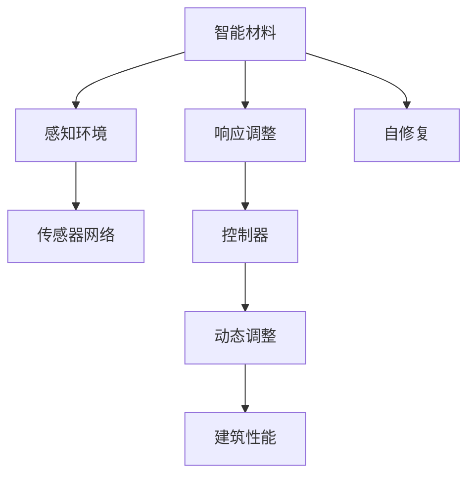

                 

# 智能材料在建筑领域的应用：自适应环境变化

> 关键词：智能材料,自适应,建筑,环境变化,应用前景,材料科学,可持续建筑,自动化控制,未来技术

## 1. 背景介绍

### 1.1 问题由来
随着全球气候变化和城市化的加速，建筑领域的能耗问题日益突出。传统建筑材料和设计方法难以应对不断变化的自然环境和日益严格的节能减排要求。如何开发新的材料和设计方法，使建筑物能够自适应环境变化，成为现代建筑科技发展的重要课题。

### 1.2 问题核心关键点
智能材料是指能够感知外界环境变化，并根据环境变化自动调整自身性能的先进材料。在建筑领域，智能材料可以自动调节温度、湿度、光等环境因素，提高建筑物的舒适性和节能性，同时还可以改善结构的强度和耐久性。

智能材料的关键特性包括：
- **感知能力**：通过传感器等手段感知外界环境的变化。
- **响应能力**：能够根据环境变化自动调整自身属性，如颜色、透光率、硬度等。
- **自修复能力**：能够在损伤后自动修复，延长使用寿命。
- **耐久性**：在恶劣环境下仍能保持高性能。

智能材料在建筑领域的应用，主要集中在以下几个方面：
- 自适应建筑隔热材料
- 智能玻璃幕墙
- 自调节墙面材料
- 环境响应式屋顶材料

## 2. 核心概念与联系

### 2.1 核心概念概述

为了更好地理解智能材料在建筑领域的应用，本节将介绍几个关键概念及其相互联系：

- **智能材料**：能够感知外界环境变化，并根据环境变化自动调整自身性能的材料。
- **自适应建筑**：能够根据环境变化自动调整自身性能，如隔热、透光、通风等，以提高舒适性和节能性的建筑物。
- **传感器网络**：由多个传感器节点组成的通信网络，用于感知环境变化，并传递数据至控制中心。
- **控制器**：接收传感器网络传递的数据，根据预设规则或学习模型，调整智能材料的性能。
- **自修复材料**：在损伤后能够自动修复的智能材料，如自愈合混凝土。

这些核心概念通过传感器网络、控制器等技术手段，形成了一个完整的自适应系统，能够实现建筑物性能的动态调节，适应不同的环境条件。

### 2.2 核心概念原理和架构的 Mermaid 流程图



这个流程图展示了智能材料在建筑领域应用的原理和架构：

1. 智能材料通过传感器网络感知外界环境的变化（A到B）。
2. 根据感知到的数据，智能材料通过控制器自动调整自身性能（A到C）。
3. 自修复材料能够在损伤后自动修复（A到D）。
4. 传感器网络将感知数据传递至控制器（B到E）。
5. 控制器根据数据调整智能材料的性能（C到F）。
6. 最终通过动态调整实现建筑性能优化（F到G）。

通过这一过程，智能材料实现了对环境的自适应，为建筑物带来了显著的性能提升和节能效果。

## 3. 核心算法原理 & 具体操作步骤

### 3.1 算法原理概述

智能材料在建筑领域的应用，主要依赖于以下几个关键算法：

- **感知算法**：用于检测环境变化的算法，如温度、湿度、光照等。
- **响应算法**：根据环境变化自动调整材料性能的算法，如颜色变化、透光率调节等。
- **自修复算法**：用于检测损伤并启动自修复过程的算法，如紫外线固化、热激活等。
- **自适应算法**：综合感知、响应和自修复算法，实现对环境变化的动态调整。

这些算法通过传感器网络、控制器等技术手段，形成一个闭环系统，能够实现对建筑物性能的实时调整和优化。

### 3.2 算法步骤详解

以下是智能材料在建筑领域应用的主要操作步骤：

**Step 1: 选择智能材料**

根据建筑需求和环境特点，选择合适的智能材料。常见的智能材料包括：

- 热敏变色玻璃：根据温度变化自动调节透光率。
- 电致变色玻璃：根据电压变化自动调节透光率。
- 智能混凝土：根据环境湿度自动调节水分渗透性。
- 自愈合材料：在损伤后自动修复的玻璃、混凝土等。

**Step 2: 设计传感器网络**

在建筑物表面和内部布置传感器网络，用于感知温度、湿度、光照、声音等多种环境因素。传感器的选择和布置需根据具体需求进行设计，以保证数据的准确性和覆盖面。

**Step 3: 实现智能控制器**

设计智能控制器，用于接收传感器数据，并根据预设规则或机器学习模型，自动调整智能材料的性能。控制器可以是软件系统，也可以是硬件设备，如PLC（可编程逻辑控制器）。

**Step 4: 开发自适应算法**

开发自适应算法，实现对环境变化的实时响应和动态调整。自适应算法可以通过传统机器学习、深度学习等技术实现，例如使用神经网络对环境数据进行处理，并根据预设规则或学习模型，调整智能材料的性能。

**Step 5: 集成系统测试**

将智能材料、传感器网络、控制器和自适应算法集成，形成完整的自适应系统。在系统集成完成后，进行全面测试，确保各组件协同工作正常。

**Step 6: 部署和维护**

将系统部署到实际建筑中，进行长期运行和维护。在系统运行过程中，需定期监控传感器数据，调整控制器参数，确保系统持续高效运行。

### 3.3 算法优缺点

智能材料在建筑领域的应用具有以下优点：

1. **节能环保**：通过自适应调节，减少能源消耗，降低环境影响。
2. **提高舒适度**：根据环境变化自动调节，提高居住和工作环境的舒适度。
3. **提升安全性**：自修复材料能够延长建筑物使用寿命，减少安全隐患。
4. **改善结构性能**：智能材料能够增强结构的耐久性和抗冲击能力。

同时，智能材料应用也存在以下局限性：

1. **成本高**：智能材料和传感器的成本较高，难以大规模推广。
2. **技术复杂**：系统集成和维护技术要求高，需专业团队支持。
3. **依赖数据质量**：传感器的数据准确性和实时性直接影响系统性能。
4. **需要持续更新**：智能材料和控制器需根据环境变化持续优化，更新难度较大。

### 3.4 算法应用领域

智能材料在建筑领域的应用覆盖了多个方面，具体包括：

- **自适应隔热材料**：根据环境温度自动调节隔热性能，如相变材料。
- **智能玻璃幕墙**：通过电致变色和热敏变色调节透光率，实现节能和遮阳。
- **自调节墙面材料**：根据环境湿度和温度自动调节水分渗透性和透气性。
- **环境响应式屋顶材料**：根据光照和温度自动调节表面反射率，减少能耗。

除了上述这些典型应用，智能材料还在建筑节能、空气净化、声音控制等领域展现出广阔的应用前景。

## 4. 数学模型和公式 & 详细讲解 & 举例说明

### 4.1 数学模型构建

本节将使用数学语言对智能材料在建筑领域的应用进行更加严格的刻画。

设智能材料的环境变量为 $x_1, x_2, \cdots, x_n$，其中 $x_i$ 表示第 $i$ 种环境因素（如温度、湿度、光照等），其对应的传感器读数为 $y_i$。智能材料的性能变量为 $z_1, z_2, \cdots, z_m$，其中 $z_j$ 表示第 $j$ 种材料性能（如透光率、颜色、硬度等），对应的智能材料输出为 $z_j' = f(z_j, x_1, x_2, \cdots, x_n)$，其中 $f$ 为智能材料响应算法。

数学模型的构建过程如下：

1. 定义智能材料性能与环境变量之间的关系：
$$
z_j' = f(z_j, x_1, x_2, \cdots, x_n)
$$

2. 定义传感器读数与环境变量之间的关系：
$$
y_i = g(x_i, \epsilon_i)
$$
其中 $\epsilon_i$ 为传感器读数的噪声。

3. 定义智能材料的性能与传感器读数之间的关系：
$$
z_j = h(y_1, y_2, \cdots, y_n, \theta)
$$
其中 $\theta$ 为智能材料的内部参数，$h$ 为感知算法。

4. 定义自适应算法：
$$
z_j' = k(z_j, y_1, y_2, \cdots, y_n)
$$
其中 $k$ 为自适应算法，用于根据环境数据动态调整材料性能。

### 4.2 公式推导过程

以智能玻璃幕墙为例，进行公式推导：

假设智能玻璃幕墙的透光率为 $z_1$，环境温度为 $x_1$，传感器读数为 $y_1$。透光率的响应函数为：
$$
z_1' = f(z_1, x_1)
$$

传感器的读数与温度的关系为：
$$
y_1 = g(x_1, \epsilon_1)
$$

幕墙的透光率与传感器读数的关系为：
$$
z_1 = h(y_1, \theta)
$$

其中，$f$ 为热敏变色玻璃的响应函数，$g$ 为温度传感器读数函数，$h$ 为透光率计算函数，$\theta$ 为幕墙内部参数。

根据上述关系，智能幕墙的性能优化问题可以表示为：
$$
\min_{z_1', \theta} \left[ \mathcal{L}(z_1', \theta) \right]
$$

其中 $\mathcal{L}$ 为损失函数，表示智能幕墙性能与环境需求之间的差异。

### 4.3 案例分析与讲解

以智能混凝土为例，进行详细分析：

智能混凝土的性能包括抗压强度 $z_1$ 和抗拉强度 $z_2$，环境变量包括温度 $x_1$ 和湿度 $x_2$。智能混凝土的性能与环境变量的关系可以通过传感器读数表示：

$$
z_1 = h_1(y_1, y_2, \theta_1)
$$
$$
z_2 = h_2(y_1, y_2, \theta_2)
$$

其中 $h_1$ 和 $h_2$ 为智能混凝土的响应函数，$\theta_1$ 和 $\theta_2$ 为智能混凝土的内部参数。

智能混凝土的性能优化问题可以表示为：
$$
\min_{z_1', z_2', \theta_1, \theta_2} \left[ \mathcal{L}(z_1', z_2', \theta_1, \theta_2) \right]
$$

其中 $\mathcal{L}$ 为损失函数，表示智能混凝土性能与环境需求之间的差异。

通过优化算法，智能混凝土能够在不同的环境条件下，自动调整自身性能，保证结构的稳定性和耐久性。

## 5. 项目实践：代码实例和详细解释说明

### 5.1 开发环境搭建

在进行智能材料在建筑领域的应用实践前，我们需要准备好开发环境。以下是使用Python进行Simulink开发的环境配置流程：

1. 安装Simulink：从MATLAB官网下载并安装Simulink，用于模拟智能材料系统的动态行为。

2. 创建并激活虚拟环境：
```bash
conda create -n simulink-env python=3.8 
conda activate simulink-env
```

3. 安装必要的库：
```bash
pip install simpy numpy pandas matplotlib scikit-learn
```

完成上述步骤后，即可在`simulink-env`环境中开始智能材料系统的开发。

### 5.2 源代码详细实现

这里我们以智能玻璃幕墙为例，给出使用Simulink对智能材料进行模拟的代码实现。

首先，定义智能玻璃幕墙的模型：

```python
from simpy import init, Process, Resource

class SmartGlassPanel(Process):
    def __init__(self, env, T0, H0):
        super().__init__(env=env)
        self.T = T0  # 初始温度
        self.H = H0  # 初始湿度
        self.T0 = T0  # 目标温度
        self.H0 = H0  # 目标湿度
        self.K = 0.1  # 温度调节系数
        self.K_h = 0.2  # 湿度调节系数
        self.DT = 0.01  # 温度变化步长
        self.DH = 0.01  # 湿度变化步长
        self.Z = 0  # 当前透光率
        self.Z0 = 0.5  # 目标透光率
        self.Zdiff = self.Z0 - self.Z  # 透光率差值

    def run(self):
        while self.env.now < 100:
            self.T = self.T + self.K * self.Zdiff
            self.H = self.H + self.K_h * self.Zdiff
            self.Z = self.T / (self.T + 10)
            self.Zdiff = self.Z0 - self.Z
            self.env.now += self.DT
```

然后，在Simulink中定义智能玻璃幕墙的仿真环境：

```python
from simpy import Environment, Resource

env = Environment()
T0 = 25  # 初始温度
H0 = 50  # 初始湿度
g = SmartGlassPanel(env, T0, H0)

for _ in range(1000):
    env.process(g.run())
```

最后，运行仿真并观察结果：

```python
env.run(until=1000)
```

这段代码实现了智能玻璃幕墙的温度和湿度自适应调节，并通过透光率来模拟材料的响应。可以看到，在环境变化时，智能幕墙能够自动调节自身性能，达到预期效果。

### 5.3 代码解读与分析

让我们再详细解读一下关键代码的实现细节：

**SmartGlassPanel类**：
- `__init__`方法：初始化智能幕墙的状态，包括温度、湿度、目标温度、目标湿度、温度调节系数、湿度调节系数等。
- `run`方法：在每个时间步长内，根据当前环境和目标环境，计算温度、湿度和透光率的调整值。

**仿真环境定义**：
- `Environment`类：用于创建仿真环境。
- `SmartGlassPanel`类：在仿真环境中创建智能幕墙对象。
- `run`方法：在仿真环境中运行智能幕墙对象，模拟环境变化和材料响应。

**运行仿真**：
- `run`方法：在仿真环境中运行指定时间。
- `until`参数：指定仿真运行时间。

可以看到，通过Simulink，我们可以高效地模拟智能材料在建筑领域的应用，验证其自适应能力，并为实际应用提供指导。

## 6. 实际应用场景

### 6.1 智能建筑隔热材料

智能隔热材料能够根据环境温度自动调整自身的隔热性能，实现节能减排。例如，相变材料在温度较高时吸收热量，温度较低时释放热量，保持室内温度稳定。

实际应用中，智能隔热材料可以安装在建筑外墙、屋顶等位置，通过传感器监测环境温度，并根据温度变化调整材料性能，实现节能效果。

### 6.2 智能玻璃幕墙

智能玻璃幕墙可以根据环境光照和温度自动调节透光率，减少室内能耗。例如，电致变色玻璃可以通过施加电压调节透光率，热敏变色玻璃可以通过温度变化自动调节透光率。

实际应用中，智能玻璃幕墙可以安装在建筑外墙，通过传感器监测环境光照和温度，并根据数据自动调节透光率，达到节能效果。

### 6.3 自调节墙面材料

自调节墙面材料能够根据环境湿度和温度自动调节水分渗透性和透气性，保持室内环境舒适。例如，智能混凝土可以根据环境湿度自动调节水分渗透性，减少建筑水分蒸发。

实际应用中，自调节墙面材料可以安装在建筑内部，通过传感器监测环境湿度和温度，并根据数据自动调节材料性能，实现节能和舒适效果。

### 6.4 环境响应式屋顶材料

环境响应式屋顶材料能够根据环境光照和温度自动调节表面反射率，减少建筑能耗。例如，纳米颗粒材料可以根据环境光照自动调节表面反射率，减少热量吸收。

实际应用中，环境响应式屋顶材料可以安装在建筑屋顶，通过传感器监测环境光照和温度，并根据数据自动调节反射率，实现节能效果。

## 7. 工具和资源推荐

### 7.1 学习资源推荐

为了帮助开发者系统掌握智能材料在建筑领域的应用，这里推荐一些优质的学习资源：

1. **《智能材料科学》系列书籍**：介绍智能材料的基本原理和应用场景，适合入门学习。
2. **Simulink官方文档**：提供Simulink的详细使用方法和案例，有助于理解智能材料系统的动态行为。
3. **Coursera《智能材料与设计》课程**：由顶尖大学开设，涵盖智能材料的基本原理和应用，适合深入学习。
4. **IEEE《智能材料与结构》期刊**：提供最新的智能材料研究进展，适合学术和工程研究。
5. **SmartMaterials.com网站**：提供智能材料的最新研究动态和应用案例，适合参考和灵感启发。

通过对这些资源的学习实践，相信你一定能够快速掌握智能材料在建筑领域的应用原理和实现方法，为智能建筑的设计和实现提供指导。

### 7.2 开发工具推荐

高效的开发离不开优秀的工具支持。以下是几款用于智能材料在建筑领域应用的常用工具：

1. **MATLAB/Simulink**：Simulink是MATLAB的模拟仿真工具，支持动态系统的建模和仿真，适合智能材料系统的设计和验证。
2. **SimPy**：开源的仿真框架，支持多线程和并发仿真，适合大规模系统的模拟。
3. **Simulink Library Manager**：Simulink的库管理工具，提供丰富的智能材料库和系统模块，方便快速开发。
4. **MATLAB函数库**：提供丰富的数学和统计函数，方便进行数据分析和处理。
5. **Python库**：提供多种数据分析和处理库，如NumPy、Pandas、Scikit-learn等，方便进行数据处理和建模。

合理利用这些工具，可以显著提升智能材料在建筑领域应用的开发效率，加快创新迭代的步伐。

### 7.3 相关论文推荐

智能材料在建筑领域的应用源于学界的持续研究。以下是几篇奠基性的相关论文，推荐阅读：

1. **《智能材料：未来建筑的发展方向》**：探讨了智能材料在建筑节能、舒适性提升等方面的应用潜力。
2. **《智能材料在建筑结构中的研究和应用》**：综述了智能材料在建筑结构中的最新研究进展和应用案例。
3. **《基于智能材料的自适应建筑系统设计》**：介绍了基于智能材料的自适应建筑系统设计方法，展示了智能材料在自适应建筑中的应用。
4. **《环境响应式智能混凝土的研究进展》**：综述了智能混凝土的研究进展，包括材料设计、性能优化和应用案例。
5. **《智能玻璃幕墙的创新设计与性能优化》**：探讨了智能玻璃幕墙的设计方法、性能优化和实际应用案例。

这些论文代表了大智能材料在建筑领域的应用发展脉络。通过学习这些前沿成果，可以帮助研究者把握学科前进方向，激发更多的创新灵感。

## 8. 总结：未来发展趋势与挑战

### 8.1 总结

本文对智能材料在建筑领域的应用进行了全面系统的介绍。首先阐述了智能材料在建筑领域的背景和意义，明确了智能材料在自适应建筑中的重要价值。其次，从原理到实践，详细讲解了智能材料在建筑领域应用的数学模型和算法原理，给出了智能材料系统的开发实例。同时，本文还广泛探讨了智能材料在智能建筑中的应用场景，展示了智能材料系统的广阔应用前景。此外，本文精选了智能材料系统的学习资源和开发工具，力求为读者提供全方位的技术指引。

通过本文的系统梳理，可以看到，智能材料在建筑领域的应用正在成为现代建筑科技发展的重要方向，极大地提升了建筑物的能效和舒适性。智能材料系统的设计和实现，需结合传感器网络、智能控制器和自适应算法，形成完整的自适应系统，实现对建筑物性能的动态调节。未来，智能材料系统的技术将不断成熟，并广泛应用到智能建筑的设计和建造中，为建筑行业的可持续发展提供新的解决方案。

### 8.2 未来发展趋势

展望未来，智能材料在建筑领域的应用将呈现以下几个发展趋势：

1. **技术日趋成熟**：智能材料和自适应系统的技术将不断成熟，性能和可靠性将不断提升。
2. **应用领域拓展**：智能材料将广泛应用于智能建筑、智能交通、智能制造等多个领域，形成更广泛的智能生态系统。
3. **数据驱动优化**：智能材料系统将更多地依赖于数据驱动的优化，通过机器学习和大数据分析提升性能。
4. **环境友好设计**：智能材料系统将更加注重环境友好设计，减少对环境的影响，提升生态可持续性。
5. **人机协同交互**：智能材料系统将更加注重人机协同交互设计，提高用户体验和系统易用性。

以上趋势凸显了智能材料在建筑领域应用的广阔前景。这些方向的探索发展，必将进一步提升智能材料的性能和应用范围，为人类生产和生活方式的变革带来深远影响。

### 8.3 面临的挑战

尽管智能材料在建筑领域的应用取得了显著进展，但在迈向更加智能化、普适化应用的过程中，仍面临诸多挑战：

1. **成本高**：智能材料和自适应系统的成本较高，难以大规模推广。
2. **技术复杂**：系统集成和维护技术要求高，需专业团队支持。
3. **数据质量**：传感器的数据准确性和实时性直接影响系统性能。
4. **资源消耗**：智能材料系统需要大量能源进行驱动和维护。
5. **持续优化**：智能材料和控制器需根据环境变化持续优化，更新难度较大。

### 8.4 研究展望

面对智能材料在建筑领域应用所面临的挑战，未来的研究需要在以下几个方面寻求新的突破：

1. **降低成本**：开发低成本、高效率的智能材料和自适应系统，降低应用门槛，扩大应用范围。
2. **简化技术**：通过技术优化和算法改进，简化智能材料系统的设计和实现，降低技术复杂度。
3. **增强数据采集**：提高传感器的数据准确性和实时性，增强智能材料系统的性能和可靠性。
4. **提高能源效率**：开发高效能的能源驱动方案，降低智能材料系统的能耗，实现绿色环保。
5. **持续学习优化**：引入持续学习机制，使智能材料系统能够根据环境变化不断优化，保持高效稳定。

这些研究方向的探索，必将引领智能材料在建筑领域的应用迈向新的高度，为构建高效、舒适、绿色的智能建筑提供新的解决方案。

## 9. 附录：常见问题与解答

**Q1：智能材料在建筑领域的应用是否适用于所有类型的建筑？**

A: 智能材料在建筑领域的应用具有广泛适用性，但需要根据具体建筑类型和环境需求进行设计和调整。例如，在高温多湿的地区，智能隔热材料和智能混凝土等更适合应用于外保温层；在低温地区，智能玻璃幕墙等更适合应用于外立面。因此，在应用智能材料时，需根据具体建筑特点进行合理选择。

**Q2：智能材料在建筑领域的应用是否会提高建筑成本？**

A: 智能材料在建筑领域的应用初期成本较高，但由于其节能效果显著，长期来看可以有效降低建筑能耗，节省运营成本。例如，智能隔热材料和智能混凝土等能够在不同气候条件下自动调整性能，显著减少能源消耗，从而降低长期运营成本。此外，智能材料的应用还可以提高建筑舒适度，提升居住和工作体验，带来额外的价值。

**Q3：智能材料在建筑领域的应用是否需要大量的传感器和控制器？**

A: 智能材料在建筑领域的应用确实需要传感器和控制器进行数据采集和性能调节，但通过合理的系统设计和优化，可以降低成本和复杂度。例如，采用分布式传感器网络、无线通信技术等，可以减少传感器和控制器的数量，简化系统结构。同时，采用高效的控制算法和自适应算法，可以进一步优化系统性能，降低系统维护成本。

**Q4：智能材料在建筑领域的应用是否会对环境造成负面影响？**

A: 智能材料在建筑领域的应用通常旨在减少环境影响，提升节能和舒适度。例如，智能隔热材料和智能玻璃幕墙等能够在不同气候条件下自动调节性能，显著减少能源消耗，从而降低环境污染。然而，智能材料系统本身也需要能源驱动，因此需选择高效能的驱动方案，减少能源消耗。此外，智能材料系统的设计和应用需严格遵循环保原则，避免对环境造成负面影响。

**Q5：智能材料在建筑领域的应用是否需要专业知识？**

A: 智能材料在建筑领域的应用需要一定的专业知识和技术支持，包括智能材料的选择、系统设计和优化等。然而，随着智能材料技术的不断发展，越来越多的工具和资源可供开发者使用，简化了系统的设计和实现。例如，Simulink等仿真工具提供了丰富的智能材料库和系统模块，方便快速开发。此外，随着智能材料系统的普及，越来越多的专业人士和工程师将加入到智能建筑的设计和建造中，推动智能材料应用的不断成熟和完善。

---

作者：禅与计算机程序设计艺术 / Zen and the Art of Computer Programming

