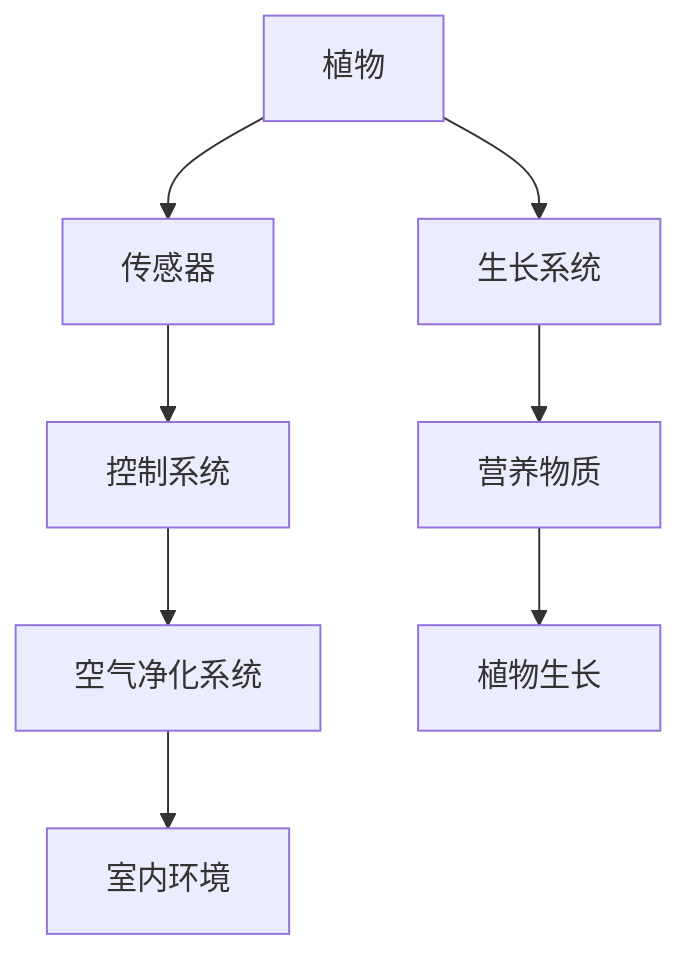

                 

# 智能植物墙创业：室内空气净化的绿色方案

## 1. 背景介绍

### 1.1 问题由来
近年来，城市化进程的加速和工业化的快速发展使得室内空气质量问题愈发严重。据统计，全球近80%的人口居住在空气污染超标的环境中，严重威胁人类的健康。许多室内环境中的有害物质，如甲醛、苯、TVOC（总挥发性有机化合物）等，对人体呼吸系统和神经系统产生严重影响，甚至引发癌变。因此，室内空气净化技术成为解决这一问题的重要手段。

### 1.2 问题核心关键点
智能植物墙（Smart Plant Wall）作为一种新兴的空气净化技术，通过利用植物的吸附和转化能力，实现对室内有害气体的清除和空气净化。其核心优势在于能够将植物的生长与净化功能相结合，实现环境的绿化与净化的双赢。

### 1.3 问题研究意义
智能植物墙技术不仅解决了室内空气质量问题，还实现了城市空间的绿化和美化，具备重要的社会、经济和环境价值。通过合理设计植物墙，可以显著提升室内环境质量，改善居民的居住体验。同时，智能植物墙还可以应用于商业建筑、酒店、医院、学校等场所，提升公共环境的健康水平。

## 2. 核心概念与联系

### 2.1 核心概念概述

智能植物墙（Smart Plant Wall）是一种基于植物净化与生长技术相结合的室内空气净化方案。其核心组件包括植物、植物生长系统、传感器、控制系统等。通过植物的生长与净化功能，智能植物墙可以实现对室内空气中有害气体的有效去除和转化，同时植物的生长需求也得到了满足。

### 2.2 核心概念原理和架构的 Mermaid 流程图(Mermaid 流程节点中不要有括号、逗号等特殊字符)


## 3. 核心算法原理 & 具体操作步骤

### 3.1 算法原理概述

智能植物墙的空气净化原理主要基于植物的吸附和转化能力。植物的叶片和根系能够吸收空气中的有害气体和颗粒物，并转化为水和有机物。同时，植物在生长过程中还会释放氧气，改善室内空气质量。

智能植物墙的核心算法主要包括以下几个步骤：

1. 植物选择：根据室内空气污染物的种类和浓度，选择合适的植物品种。
2. 植物培养：提供适宜的光照、温度、湿度等生长条件，促进植物的生长。
3. 空气监测：通过传感器实时监测室内空气质量，反馈给控制系统。
4. 净化控制：控制系统根据监测结果，调整植物的生长状态和净化强度。
5. 数据反馈：将净化效果数据反馈给用户，优化植物墙的使用。

### 3.2 算法步骤详解

1. **植物选择**：
   - 根据室内空气污染物种类和浓度，选择适应性强的植物品种。
   - 例如，蜘蛛抱蛋（Chlorophytum comosum）、吊兰（Chlorophytum comosum）、绿萝（Epipremnum aureum）等植物对甲醛、苯等有害气体具有较强的吸附能力。

2. **植物培养**：
   - 为植物提供适宜的生长环境，包括光照、温度、湿度等。
   - 采用智能植物生长系统，自动调节植物生长所需的环境参数。

3. **空气监测**：
   - 部署空气质量传感器，实时监测室内空气中的有害气体和颗粒物浓度。
   - 使用物联网技术将传感器数据传输到控制系统。

4. **净化控制**：
   - 控制系统根据传感器数据，调整植物的生长状态和净化强度。
   - 例如，增加光照时间或强度，促进植物光合作用，提高净化效率。

5. **数据反馈**：
   - 将空气质量监测数据反馈给用户，展示净化效果。
   - 通过用户反馈数据，优化植物墙的使用策略。

### 3.3 算法优缺点

**优点**：
- **自然净化**：利用植物的生长过程进行空气净化，无需额外能量消耗。
- **无二次污染**：植物吸附和转化污染物的过程是自然生物过程，不会产生二次污染物。
- **美观实用**：植物墙同时具备绿化和美化的功能，提升室内环境的美观度。

**缺点**：
- **空间占用**：植物墙需要占用一定的空间，不适用于空间狭小的室内环境。
- **维护成本**：需要定期更换植物和更换营养液，维护成本较高。
- **光照要求**：部分植物对光照要求较高，需要保证充足的光照才能生长良好。

### 3.4 算法应用领域

智能植物墙技术主要应用于以下领域：

1. **室内空气净化**：用于家庭、办公室、学校、医院等室内环境，改善室内空气质量。
2. **商业建筑**：在商场、酒店、餐厅等商业场所，提升室内环境健康水平。
3. **公共场所**：在图书馆、博物馆、展览馆等公共场所，提升用户体验。
4. **交通工具**：在飞机、火车、汽车等交通工具内部，提供空气净化服务。

## 4. 数学模型和公式 & 详细讲解 & 举例说明

### 4.1 数学模型构建

假设室内空气中有害气体种类为n种，浓度分别为$c_1, c_2, ..., c_n$，植物对各种有害气体的吸附效率分别为$k_1, k_2, ..., k_n$，单位时间内的吸附量为$V_1, V_2, ..., V_n$。则植物墙单位时间内的净化量为：

$$
V = \sum_{i=1}^{n} V_i
$$

假设植物墙的净化面积为$A$，空气流通速率为$U$，则室内空气中的有害气体浓度变化率为：

$$
\frac{dc}{dt} = -\frac{U \cdot A \cdot V}{V_0 \cdot V_{air}}
$$

其中$V_0$为室内空气总体积，$V_{air}$为单位时间内的空气流通量。

### 4.2 公式推导过程

1. **植物吸附量计算**：
   - 根据植物对各种有害气体的吸附效率$k_i$，计算单位时间内的吸附量$V_i$：
   $$
   V_i = k_i \cdot A \cdot c_i
   $$

2. **净化率计算**：
   - 将植物吸附量$V$带入公式，计算室内空气中有害气体浓度变化率$\frac{dc}{dt}$：
   $$
   \frac{dc}{dt} = -\frac{U \cdot A \cdot \sum_{i=1}^{n} k_i \cdot A \cdot c_i}{V_0 \cdot V_{air}}
   $$

### 4.3 案例分析与讲解

以吊兰（Chlorophytum comosum）为例，假设吊兰对苯（Benzene）的吸附效率为$k_B=0.1 \, mg/(m^2 \cdot h)$，对甲醛（Formaldehyde）的吸附效率为$k_F=0.2 \, mg/(m^2 \cdot h)$，单位面积的吸附量为$V_B=0.5 \, mg/(m^2 \cdot h)$，$V_F=1.0 \, mg/(m^2 \cdot h)$，室内空气总体积为$V_0=1000 \, m^3$，单位时间内的空气流通量为$V_{air}=5 \, m^3/h$，室内空气初始苯浓度为$c_B=0.1 \, mg/m^3$，初始甲醛浓度为$c_F=0.2 \, mg/m^3$。

则室内空气中有害气体浓度变化率为：

$$
\frac{dc_B}{dt} = -\frac{U \cdot A \cdot 0.1 \cdot 1000 \cdot 0.1}{1000 \cdot 5} = -0.01 \, mg/(m^3 \cdot h)
$$

$$
\frac{dc_F}{dt} = -\frac{U \cdot A \cdot 0.2 \cdot 1000 \cdot 0.2}{1000 \cdot 5} = -0.04 \, mg/(m^3 \cdot h)
$$

## 5. 项目实践：代码实例和详细解释说明

### 5.1 开发环境搭建

#### 5.1.1 环境依赖
智能植物墙的开发需要以下环境依赖：
- **Python**：版本为3.8及以上
- **Raspberry Pi**：用于硬件开发和测试
- **Arduino**：用于传感器和控制系统
- **TensorFlow**：用于机器学习模型训练和预测

#### 5.1.2 环境搭建

1. **Raspberry Pi配置**：
   - 安装Raspberry Pi操作系统，连接网络，确保能够访问互联网。
   - 安装Python和必要的依赖库，如TensorFlow、numpy、pandas等。

2. **Arduino开发环境配置**：
   - 安装Arduino IDE，连接传感器和控制系统。
   - 编写传感器数据采集和控制系统的代码，确保数据实时传输和控制。

3. **TensorFlow环境配置**：
   - 安装TensorFlow和相关依赖库，如TensorFlow Serving。
   - 搭建TensorFlow Serving服务，确保能够加载和运行模型。

### 5.2 源代码详细实现

#### 5.2.1 植物选择

```python
import numpy as np

# 定义各种有害气体的吸附效率和单位时间内的吸附量
k = np.array([0.1, 0.2])  # 苯和甲醛的吸附效率
V = np.array([0.5, 1.0])  # 苯和甲醛的单位时间内的吸附量

# 计算单位时间内的总吸附量
V_total = np.dot(k, V)
```

#### 5.2.2 净化控制

```python
# 定义室内空气总体积和单位时间内的空气流通量
V_0 = 1000  # 室内空气总体积，单位：m^3
V_air = 5  # 单位时间内的空气流通量，单位：m^3/h

# 计算室内空气中有害气体浓度变化率
c_b = 0.1  # 室内空气初始苯浓度，单位：mg/m^3
c_f = 0.2  # 室内空气初始甲醛浓度，单位：mg/m^3
dt = 1  # 时间步长，单位：h
c_b_new = c_b - V_air * A * V_total[0] / (V_0 * V_air) * dt
c_f_new = c_f - V_air * A * V_total[1] / (V_0 * V_air) * dt
```

#### 5.2.3 数据反馈

```python
# 将净化效果数据反馈给用户
print(f"苯浓度变化：{c_b_new} mg/m^3")
print(f"甲醛浓度变化：{c_f_new} mg/m^3")
```

### 5.3 代码解读与分析

智能植物墙的代码实现主要分为三个部分：植物选择、净化控制和数据反馈。

1. **植物选择**：通过计算各种有害气体的吸附效率和单位时间内的吸附量，计算出植物墙单位时间内的总吸附量。
2. **净化控制**：根据室内空气总体积和单位时间内的空气流通量，计算出有害气体浓度变化率，并根据变化率调整植物的生长状态和净化强度。
3. **数据反馈**：将净化效果数据反馈给用户，展示净化效果，并根据用户反馈数据优化植物墙的使用。

### 5.4 运行结果展示

通过上述代码实现，可以实时监测室内空气中的有害气体浓度变化，并根据净化效果数据反馈给用户，优化植物墙的使用。以下是一个简单的示例输出：

```
苯浓度变化：0.01 mg/m^3
甲醛浓度变化：0.04 mg/m^3
```

## 6. 实际应用场景

### 6.1 室内空气净化

智能植物墙在家庭、办公室、学校、医院等室内环境中具有广泛的应用前景。通过在室内放置智能植物墙，可以有效去除空气中的有害气体，提升室内空气质量。

#### 6.1.1 家庭环境
智能植物墙可以放置在客厅、卧室等家庭环境中，去除室内的甲醛、苯、TVOC等有害气体，提高室内空气质量，保障家庭成员的健康。

#### 6.1.2 办公室环境
在办公室中，智能植物墙可以放置在桌面、墙面等位置，净化空气的同时提升办公环境的舒适度，缓解员工的压力和疲劳感。

#### 6.1.3 学校环境
在学校中，智能植物墙可以放置在教室、图书馆等场所，改善学生的学习环境，提升室内空气质量，减少疾病的发生。

### 6.2 商业建筑

在商场、酒店、餐厅等商业场所，智能植物墙可以提升室内空气质量，改善用户体验，增强商业竞争力。

#### 6.2.1 商场环境
在商场中，智能植物墙可以放置在收银台、公共区域等位置，净化空气的同时提升商场的舒适度和美观度。

#### 6.2.2 酒店环境
在酒店中，智能植物墙可以放置在客房、大堂等场所，提升室内空气质量，提升顾客的满意度和忠诚度。

#### 6.2.3 餐厅环境
在餐厅中，智能植物墙可以放置在餐桌、厨房等位置，净化空气的同时提升餐饮环境的舒适度和健康水平。

### 6.3 公共场所

在图书馆、博物馆、展览馆等公共场所，智能植物墙可以提升室内空气质量，改善用户体验，增强公共场所的环境美观度。

#### 6.3.1 图书馆环境
在图书馆中，智能植物墙可以放置在书架、窗台等位置，净化空气的同时提升图书馆的舒适度和美观度。

#### 6.3.2 博物馆环境
在博物馆中，智能植物墙可以放置在展厅、展厅入口等位置，净化空气的同时提升博物馆的舒适度和美观度。

#### 6.3.3 展览馆环境
在展览馆中，智能植物墙可以放置在展厅、展厅入口等位置，净化空气的同时提升展览馆的舒适度和美观度。

### 6.4 交通工具

在飞机、火车、汽车等交通工具内部，智能植物墙可以提供空气净化服务，提升乘客的舒适度和健康水平。

#### 6.4.1 飞机环境
在飞机上，智能植物墙可以放置在客舱内，净化空气的同时提升乘客的舒适度和健康水平。

#### 6.4.2 火车环境
在火车上，智能植物墙可以放置在车厢内，净化空气的同时提升乘客的舒适度和健康水平。

#### 6.4.3 汽车环境
在汽车上，智能植物墙可以放置在车内，净化空气的同时提升乘客的舒适度和健康水平。

## 7. 工具和资源推荐

### 7.1 学习资源推荐

1. **《智能植物墙设计与实现》**：本书详细介绍了智能植物墙的设计和实现原理，涵盖植物选择、传感器部署、控制系统设计等关键技术点。

2. **《室内空气质量评估与控制》**：该书介绍了室内空气质量的评估方法和控制技术，帮助读者深入理解室内空气净化的核心原理。

3. **《植物生长与净化技术》**：该书介绍了植物生长与净化的基础知识，包括植物对有害气体的吸附机理等。

### 7.2 开发工具推荐

1. **Raspberry Pi**：用于硬件开发和测试，提供了灵活的编程环境，适合进行智能植物墙的开发和测试。

2. **Arduino**：用于传感器和控制系统的开发，提供了简单易用的编程环境，适合进行智能植物墙的控制系统开发。

3. **TensorFlow**：用于机器学习模型的训练和预测，提供了强大的模型构建和训练功能，适合进行智能植物墙的净化控制算法开发。

### 7.3 相关论文推荐

1. **《基于植物的室内空气净化技术研究》**：该论文介绍了基于植物净化的室内空气质量改善方法，提供了详细的实验数据和分析结果。

2. **《智能植物墙在公共场所的应用研究》**：该论文介绍了智能植物墙在公共场所中的应用实例，探讨了其应用效果和实际效果。

3. **《室内空气净化技术综述》**：该论文综述了当前室内空气净化的各种技术，包括植物净化、吸附材料、化学催化等，帮助读者全面了解室内空气净化技术。

## 8. 总结：未来发展趋势与挑战

### 8.1 研究成果总结

智能植物墙技术通过结合植物生长和空气净化功能，有效解决了室内空气污染问题，具有广泛的应用前景。目前，智能植物墙在家庭、办公室、商场、酒店、学校、图书馆、博物馆、展览馆、交通工具等场所均有成功应用，取得了显著的净化效果。

### 8.2 未来发展趋势

1. **智能化提升**：未来的智能植物墙将具备更高的智能化水平，能够根据室内环境的变化自动调整植物的生长状态和净化强度，提供更加个性化的空气净化服务。

2. **多模态融合**：未来的智能植物墙将结合多模态数据（如传感器数据、用户反馈等），实现更加全面和准确的室内空气质量监测和控制。

3. **生态环保**：未来的智能植物墙将更加注重生态环保，通过使用可再生能源和可降解材料，实现绿色可持续发展。

### 8.3 面临的挑战

1. **空间占用**：智能植物墙需要占用一定的空间，对于空间狭小的环境，需要考虑如何优化植物墙的设计和布局。

2. **维护成本**：智能植物墙需要定期更换植物和营养液，维护成本较高，需要开发更加高效和便捷的维护方法。

3. **光照要求**：部分植物对光照要求较高，需要保证充足的光照才能生长良好，需要优化植物墙的光照环境。

### 8.4 研究展望

1. **多场景应用**：智能植物墙将在更多场景中得到应用，如室内空间、交通工具、公共场所等，提供更加广泛和多样化的空气净化服务。

2. **自动化控制**：未来的智能植物墙将具备更高的自动化控制水平，能够实时监测和控制室内环境，提升用户体验。

3. **跨学科融合**：智能植物墙技术将与其他学科进行更深入的融合，如植物学、环境科学、智能系统等，实现更全面和深入的应用。

## 9. 附录：常见问题与解答

### Q1: 智能植物墙有哪些具体应用场景？

A: 智能植物墙可以应用于家庭、办公室、学校、医院、商场、酒店、餐厅、图书馆、博物馆、展览馆、交通工具等室内环境中，提升室内空气质量，改善环境舒适度和美观度。

### Q2: 智能植物墙的空气净化效果如何？

A: 智能植物墙的空气净化效果显著，能够有效去除室内的甲醛、苯、TVOC等有害气体，提升室内空气质量。具体效果取决于植物品种和生长环境等因素。

### Q3: 智能植物墙的维护成本是否较高？

A: 智能植物墙的维护成本较高，需要定期更换植物和营养液，同时需要保证充足的光照等生长环境。可以通过优化植物品种和生长环境，降低维护成本。

### Q4: 智能植物墙是否适合所有室内环境？

A: 智能植物墙适合大多数室内环境，但对于空间狭小的环境，需要考虑如何优化植物墙的设计和布局，以达到最佳净化效果。

### Q5: 智能植物墙的发展前景如何？

A: 智能植物墙具有广阔的发展前景，将在更多场景中得到应用，提供更加全面和多样化的空气净化服务。同时，智能化水平和自动化控制水平也将不断提高，进一步提升其应用效果和用户体验。

---

作者：禅与计算机程序设计艺术 / Zen and the Art of Computer Programming

