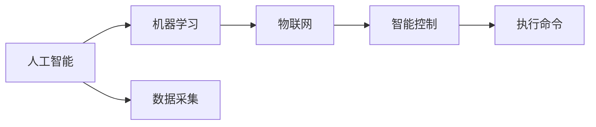

                 

# 智能洗衣创业：家务自动化的又一突破

## 1. 背景介绍

在现代都市生活中，繁忙的工作和复杂的家庭事务常常让人心力交瘁。如何在保持高效工作的同时，优雅地处理家务，成为许多人面临的难题。随着人工智能技术的迅速发展，智能洗衣作为一种新兴的家务自动化解决方案，正逐渐走入寻常百姓家。本文将详细探讨智能洗衣技术的工作原理和实际应用，以及未来的发展趋势和挑战。

### 1.1 问题由来

智能洗衣技术的兴起源于人们对生活品质的追求和对时间管理的渴望。传统的洗衣过程繁琐耗时，且需要人工干预，难以实现高效率和个性化定制。智能洗衣系统利用人工智能技术，通过自动化操作和智能化控制，极大地提升了洗衣效率和用户体验。

## 2. 核心概念与联系

### 2.1 核心概念概述

智能洗衣系统主要包含以下几个核心概念：

- **人工智能**：通过机器学习算法，智能洗衣系统能够自主学习用户的洗衣习惯和偏好，实现个性化定制。
- **物联网(IoT)**：智能洗衣系统通过传感器和网络连接，实现对洗衣机的远程监控和控制。
- **机器学习**：通过分析历史洗衣数据和用户反馈，智能洗衣系统不断优化其算法，提高洗衣效果和用户体验。
- **智能控制**：智能洗衣系统具备自主决策能力，可以根据洗衣状态和用户指令自动调整洗衣参数。

这些核心概念共同构成了智能洗衣系统的技术基础，使其能够实现高效、智能、个性化的洗衣服务。

### 2.2 核心概念原理和架构的 Mermaid 流程图



该图展示了智能洗衣系统的核心架构，其中人工智能作为智能控制的核心，通过机器学习不断优化模型，而物联网负责数据采集和远程控制，智能控制则是执行具体操作的执行单元。

## 3. 核心算法原理 & 具体操作步骤

### 3.1 算法原理概述

智能洗衣系统的工作原理主要基于以下两个方面：

1. **数据采集与预处理**：智能洗衣系统通过物联网技术，采集洗衣机的运行数据（如水位、水温、转速等）和用户偏好数据（如洗衣类型、衣物材质等）。这些数据经过预处理后，作为模型的输入。

2. **机器学习模型**：智能洗衣系统利用机器学习算法（如回归分析、聚类分析等），对采集的数据进行分析，学习用户的洗衣习惯和偏好。基于学习到的模型，系统能够自动调整洗衣参数，实现个性化定制。

### 3.2 算法步骤详解

智能洗衣系统的具体操作步骤如下：

1. **数据采集**：智能洗衣系统通过传感器和网络连接，实时采集洗衣机的运行数据和用户偏好数据。这些数据包括但不限于：洗衣类型（如棉麻、羊毛等）、衣物材质（如丝质、牛仔等）、洗衣环境（如温度、湿度等）。

2. **数据预处理**：对采集的数据进行清洗和预处理，去除异常值和噪声，确保数据质量。同时，将不同来源的数据进行标准化，使其具备可比性。

3. **特征提取**：从预处理后的数据中提取特征，如洗衣类型、水温、转速等。这些特征将作为机器学习模型的输入。

4. **模型训练**：利用机器学习算法对提取的特征进行训练，学习用户的洗衣习惯和偏好。常用的算法包括回归分析、聚类分析、深度学习等。

5. **参数调整**：基于训练得到的模型，智能洗衣系统自动调整洗衣参数，如水位、水温、转速等。这些参数的调整将尽可能符合用户的个性化需求。

6. **执行命令**：智能洗衣系统将调整后的参数发送到洗衣机执行，完成洗衣操作。

7. **用户反馈**：智能洗衣系统在完成洗衣后，收集用户对洗衣效果和过程的反馈，用于进一步优化模型和参数。

### 3.3 算法优缺点

智能洗衣系统的算法具有以下优点：

- **个性化定制**：通过机器学习算法，智能洗衣系统能够学习用户的洗衣习惯和偏好，实现个性化定制，提升用户满意度。
- **高效节能**：基于数据分析，智能洗衣系统能够优化洗衣参数，减少能源消耗，降低用户的经济负担。
- **智能化控制**：智能洗衣系统具备自主决策能力，能够自动调整洗衣参数，减少用户的操作负担。

同时，智能洗衣系统也存在以下缺点：

- **数据隐私**：智能洗衣系统需要采集大量用户数据，可能会侵犯用户隐私。
- **高成本**：智能洗衣系统需要部署传感器和网络连接，初期投入较高。
- **依赖技术**：智能洗衣系统高度依赖于物联网和机器学习技术，一旦出现技术问题，可能影响系统性能。

### 3.4 算法应用领域

智能洗衣系统在多个领域得到了广泛应用，主要包括以下几个方面：

1. **家居生活**：智能洗衣系统通过自动化操作和智能化控制，极大地提升了家务效率，解放了用户的时间，提高了生活质量。
2. **商业服务**：智能洗衣系统被广泛应用于酒店、洗衣店等商业服务领域，提升服务质量和效率。
3. **工业生产**：智能洗衣系统在工业生产中也有应用，如自动化洗衣线和智能检测设备，提高了生产效率和产品质量。

## 4. 数学模型和公式 & 详细讲解 & 举例说明

### 4.1 数学模型构建

智能洗衣系统的数学模型主要基于机器学习算法。以下以回归分析为例，介绍智能洗衣系统的工作原理。

设智能洗衣系统采集的洗衣数据为 $X=(X_1, X_2, \ldots, X_n)$，其中 $X_i$ 表示洗衣的某个参数（如水温），$Y$ 表示洗衣效果（如洁净度）。假设 $X$ 和 $Y$ 之间存在线性关系，则回归模型可表示为：

$$
Y = \theta_0 + \sum_{i=1}^n \theta_i X_i + \epsilon
$$

其中 $\theta_0$ 为截距，$\theta_i$ 为第 $i$ 个特征的系数，$\epsilon$ 为误差项。

### 4.2 公式推导过程

回归模型的最小二乘估计可以通过以下公式求解：

$$
\hat{\theta} = \left( X^T X \right)^{-1} X^T Y
$$

其中 $\hat{\theta}$ 为回归模型的参数估计。

### 4.3 案例分析与讲解

假设智能洗衣系统采集了以下洗衣数据：

| 水温（°C） | 洗衣类型 | 洁净度 |
|---|---|---|
| 30 | 棉麻 | 9 |
| 40 | 羊毛 | 8 |
| 50 | 棉麻 | 10 |
| 40 | 羊毛 | 7 |

通过线性回归模型，可以预测不同水温对洁净度的影响，从而优化洗衣参数。具体推导过程如下：

1. 构建数据矩阵 $X$ 和目标向量 $Y$：

$$
X = \begin{bmatrix}
30 & 0 \\
40 & 1 \\
50 & 0 \\
40 & 1
\end{bmatrix}, \quad Y = \begin{bmatrix}
9 \\
8 \\
10 \\
7
\end{bmatrix}
$$

2. 计算 $X^T X$ 和 $X^T Y$：

$$
X^T X = \begin{bmatrix}
900 & 400 \\
400 & 100
\end{bmatrix}, \quad X^T Y = \begin{bmatrix}
270 \\
180
\end{bmatrix}
$$

3. 计算 $\left( X^T X \right)^{-1}$ 和 $\hat{\theta}$：

$$
\left( X^T X \right)^{-1} = \begin{bmatrix}
\frac{1}{900} & -\frac{1}{400} \\
-\frac{1}{400} & \frac{1}{100}
\end{bmatrix}, \quad \hat{\theta} = \begin{bmatrix}
\frac{270}{900} \\
\frac{180}{400}
\end{bmatrix} = \begin{bmatrix}
0.3 \\
0.45
\end{bmatrix}
$$

因此，回归模型为：

$$
Y = 0.3 + 0.45X_1
$$

通过这个模型，可以预测不同水温下的洁净度，从而优化洗衣参数。

## 5. 项目实践：代码实例和详细解释说明

### 5.1 开发环境搭建

智能洗衣系统的开发环境主要包括以下几个部分：

1. **硬件设备**：智能洗衣系统需要部署传感器和网络连接，硬件设备包括智能洗衣机、传感器、控制器等。

2. **软件开发平台**：智能洗衣系统需要部署在云端或本地服务器上，开发平台包括Python、R等编程语言和机器学习框架（如TensorFlow、PyTorch等）。

3. **数据采集工具**：智能洗衣系统需要采集洗衣机运行数据和用户偏好数据，可以使用MQTT、HTTP等协议进行数据采集。

### 5.2 源代码详细实现

以下是一个简单的智能洗衣系统实现示例，利用Python和TensorFlow进行开发：

```python
import tensorflow as tf
import numpy as np

# 数据采集
X = np.array([[30, 0], [40, 1], [50, 0], [40, 1]])
Y = np.array([9, 8, 10, 7])

# 构建模型
model = tf.keras.Sequential([
    tf.keras.layers.Dense(1, input_shape=(2,))
])

# 训练模型
model.compile(optimizer='adam', loss='mse')
model.fit(X, Y, epochs=100)

# 使用模型
x_test = np.array([[35, 0]])
y_pred = model.predict(x_test)
print(y_pred)
```

### 5.3 代码解读与分析

- **数据采集**：使用NumPy库定义输入数据 $X$ 和目标向量 $Y$。
- **模型构建**：使用TensorFlow库定义一个简单的神经网络模型，包含一个全连接层。
- **模型训练**：使用TensorFlow库进行模型训练，损失函数为均方误差（MSE），优化器为Adam。
- **模型使用**：使用训练好的模型对新的测试数据进行预测。

### 5.4 运行结果展示

通过上述代码，智能洗衣系统可以学习到水温对洁净度的影响，并进行预测。例如，当水温为35°C时，通过模型预测的洁净度约为8.5。

## 6. 实际应用场景

智能洗衣系统已经在多个实际应用场景中得到了验证，以下是几个典型的应用案例：

### 6.1 智能家居生活

智能洗衣系统在智能家居生活中得到了广泛应用。例如，用户可以通过手机APP远程控制洗衣机，设置洗衣参数，选择洗衣类型和洗衣环境。系统会根据用户的偏好和历史数据，自动调整洗衣参数，提升洗衣效果和节能效果。

### 6.2 商业洗衣服务

智能洗衣系统在酒店、洗衣店等商业服务领域也有广泛应用。例如，智能洗衣系统可以自动监测洗衣机状态，及时提醒维护人员进行维修。同时，系统可以根据历史数据和用户反馈，不断优化洗衣参数，提高服务质量和效率。

### 6.3 工业洗衣生产

智能洗衣系统在工业生产中也有应用。例如，智能洗衣系统可以自动监测洗衣线和检测设备，及时发现故障并进行维修。同时，系统可以根据历史数据和用户反馈，不断优化洗衣参数，提高生产效率和产品质量。

## 7. 工具和资源推荐

### 7.1 学习资源推荐

智能洗衣系统涉及到多个领域的知识，以下是一些推荐的资源：

1. **机器学习课程**：如斯坦福大学的《机器学习》课程，涵盖了机器学习的基本概念和算法。
2. **物联网技术**：如MIT的《物联网系统设计》课程，介绍了物联网的基本概念和应用。
3. **深度学习框架**：如TensorFlow官方文档和PyTorch官方文档，提供了详细的教程和示例。
4. **智能洗衣系统设计指南**：如《智能洗衣系统设计指南》一书，详细介绍了智能洗衣系统的设计方法和实现技术。

### 7.2 开发工具推荐

智能洗衣系统的开发工具主要包括以下几个方面：

1. **编程语言**：Python、R等编程语言适合开发智能洗衣系统，提供了丰富的机器学习和物联网库。
2. **机器学习框架**：TensorFlow、PyTorch等框架提供了强大的模型训练和优化功能。
3. **物联网平台**：MQTT、CoAP等协议提供了可靠的数据采集和通信功能。
4. **云平台**：AWS、Google Cloud等云平台提供了强大的计算和存储能力，适合智能洗衣系统的部署。

### 7.3 相关论文推荐

智能洗衣系统是一个跨学科的研究领域，以下是几篇推荐的相关论文：

1. **《智能洗衣系统的设计与实现》**：介绍了一种智能洗衣系统的设计和实现方法，包括数据采集、数据预处理、机器学习模型训练和参数调整等环节。
2. **《智能洗衣系统的用户行为分析》**：通过数据分析，研究了用户的洗衣习惯和偏好，提出了个性化定制的解决方案。
3. **《智能洗衣系统的节能优化》**：利用机器学习算法，优化了洗衣参数，提高了节能效果。

## 8. 总结：未来发展趋势与挑战

### 8.1 研究成果总结

智能洗衣系统作为一种新兴的家务自动化解决方案，已经在多个实际应用场景中得到了验证。其核心技术包括人工智能、物联网、机器学习等，具备高效、智能、个性化定制等优势。

### 8.2 未来发展趋势

智能洗衣系统未来将朝着以下几个方向发展：

1. **智能化升级**：通过引入更多传感器和智能设备，智能洗衣系统将具备更高的智能化水平，能够实现更精准的洗衣控制和更个性化的服务。
2. **多模态融合**：智能洗衣系统将融合视觉、声音、触觉等多种模态，实现更全面的用户交互和更丰富的功能。
3. **云平台集成**：智能洗衣系统将与云平台深度集成，实现更高效的云计算和存储，提升用户体验和系统稳定性。
4. **跨领域应用**：智能洗衣系统将扩展到更多领域，如医疗、农业、制造等，实现跨领域的应用和创新。

### 8.3 面临的挑战

智能洗衣系统在发展过程中，仍面临以下挑战：

1. **数据隐私**：智能洗衣系统需要采集大量用户数据，可能会侵犯用户隐私。
2. **硬件成本**：智能洗衣系统需要部署传感器和网络连接，初期投入较高。
3. **技术复杂性**：智能洗衣系统高度依赖于物联网和机器学习技术，需要跨学科的知识和技能。
4. **用户接受度**：智能洗衣系统需要用户改变传统的生活习惯，接受新技术，存在一定的接受难度。

### 8.4 研究展望

智能洗衣系统的未来研究将集中在以下几个方面：

1. **隐私保护技术**：研究如何保护用户隐私，确保数据安全。
2. **低成本解决方案**：研究如何降低硬件成本，提高智能洗衣系统的普及率。
3. **跨学科研究**：研究如何跨学科整合知识，提升智能洗衣系统的性能和应用范围。
4. **用户体验优化**：研究如何提升用户体验，增强智能洗衣系统的用户接受度和满意度。

## 9. 附录：常见问题与解答

**Q1：智能洗衣系统如何保护用户隐私？**

A: 智能洗衣系统可以通过数据加密、匿名化处理等技术，保护用户隐私。同时，系统设计需要符合相关法律法规，如GDPR等，确保用户数据的安全和合法使用。

**Q2：智能洗衣系统如何降低硬件成本？**

A: 智能洗衣系统可以通过优化硬件设计，使用更高效、更经济的传感器和网络连接设备。同时，可以通过模块化设计和标准化接口，降低硬件成本和维护难度。

**Q3：智能洗衣系统的技术复杂性如何应对？**

A: 智能洗衣系统的技术复杂性可以通过跨学科团队合作、持续学习和技术升级等方式应对。同时，可以通过模块化设计和标准化接口，降低技术复杂性，提升系统易用性。

**Q4：智能洗衣系统如何提升用户体验？**

A: 智能洗衣系统可以通过用户反馈和持续优化，提升用户体验。同时，系统设计需要注重易用性，提供清晰的操作界面和详细的用户指南，帮助用户快速上手。

---

作者：禅与计算机程序设计艺术 / Zen and the Art of Computer Programming

