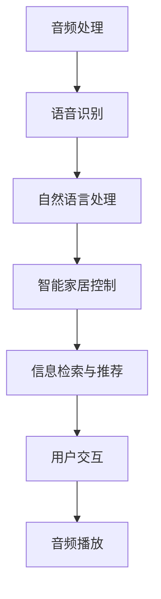

                 

## 1. 背景介绍

### 1.1 问题由来

随着数字时代的发展，智能家居设备越来越多地进入普通家庭，成为了人们日常生活的重要组成部分。其中，智能音响以其强大的功能、简洁的操作界面和优异的音质，在家庭娱乐、智能家居控制、信息检索等方面发挥着越来越重要的作用。智能音响不仅能够播放音乐、播报新闻、实现语音交互，还能与各种智能家居设备进行联动，为家庭生活带来更多便利和乐趣。

### 1.2 问题核心关键点

智能音响的核心关键点主要体现在以下几个方面：

- **音频处理与播放技术**：包括音频信号的编码、解码、滤波等技术，以及扬声器、低音炮等硬件设备的选用和优化。
- **语音交互技术**：通过语音识别、自然语言处理等技术，实现与用户的自然语言交流。
- **智能家居控制**：与智能家居设备集成，实现对家电、灯光、温控等设备的控制。
- **信息检索与推荐**：根据用户偏好和历史行为，推荐个性化的音乐、新闻和视频内容。

### 1.3 问题研究意义

智能音响的智能化程度不断提升，为其在家庭娱乐中扮演更为核心的角色奠定了基础。智能音响不仅能够提升家庭娱乐体验，还通过与家居设备的联动，为家居生活带来更高的智能化水平。研究智能音响的智能技术，对于推动家庭娱乐和智能家居的发展，具有重要意义。

## 2. 核心概念与联系

### 2.1 核心概念概述

为更好地理解智能音响的智能技术，本节将介绍几个密切相关的核心概念：

- **音频处理**：指对音频信号进行编码、解码、滤波、均衡等处理，以获得最佳的音质效果。
- **语音识别**：通过麦克风采集用户的语音信号，并转化为文本，实现语音交互。
- **自然语言处理**：指对文本信息进行分词、词性标注、句法分析等处理，理解用户意图，生成自然流畅的回复。
- **智能家居控制**：通过Wi-Fi、蓝牙、红外等多种通信协议，实现对家庭设备的远程控制。
- **信息检索与推荐**：根据用户行为和偏好，检索和推荐个性化的内容，提升用户体验。

这些核心概念之间的逻辑关系可以通过以下Mermaid流程图来展示：



这个流程图展示了智能音响各个核心功能之间的关联：音频处理是基础，语音识别和自然语言处理是实现与用户交流的关键，智能家居控制和信息检索与推荐是智能音响的核心功能，用户交互则是所有功能的最终体现。

## 3. 核心算法原理 & 具体操作步骤

### 3.1 算法原理概述

智能音响的智能化主要依赖于语音识别、自然语言处理和信息检索等核心技术。这些技术通过结合先进的算法和强大的硬件设备，实现了从语音输入到内容推荐的完整流程。以下将详细介绍这些核心技术的算法原理。

#### 3.1.1 音频处理

音频处理的核心是音频信号的编码和解码。目前，常用的音频编码格式包括MP3、AAC、FLAC等。以AAC为例，其编码原理如下：

1. 分帧：将音频信号分成若干个帧（Frame），每个帧包含若干个样本点。
2. 变换：对每个帧进行离散余弦变换（Discrete Cosine Transform, DCT）或离散傅里叶变换（Discrete Fourier Transform, DFT），以获得频域信号。
3. 量化：将频域信号中的每个系数进行量化，转化为有限位数的数字信号。
4. 压缩：对量化后的数字信号进行熵编码（如霍夫曼编码）和位流编码（如差值脉冲编码调制DPCM），以减少数据量。

音频解码的过程则是对音频数据进行反量化、反变换和重构，还原原始音频信号。

#### 3.1.2 语音识别

语音识别的核心是使用声学模型和语言模型进行识别。常用的声学模型包括隐马尔可夫模型（Hidden Markov Model, HMM）、深度神经网络（Deep Neural Network, DNN）和卷积神经网络（Convolutional Neural Network, CNN）等。语言模型则包括n-gram模型、条件随机场（Conditional Random Field, CRF）模型和Transformer模型等。语音识别的算法流程如下：

1. 特征提取：将语音信号转化为特征向量，如梅尔频率倒谱系数（Mel-Frequency Cepstral Coefficients, MFCC）。
2. 声学建模：使用声学模型对特征向量进行建模，得到声学特征的概率分布。
3. 语言建模：使用语言模型对声学特征的概率分布进行解码，得到单词或短语的序列。
4. 识别：结合声学模型和语言模型，对语音信号进行识别，得到最终文本输出。

#### 3.1.3 自然语言处理

自然语言处理的核心是理解用户意图和生成自然语言回复。常用的技术包括分词、词性标注、句法分析和命名实体识别等。以BERT模型为例，其核心算法原理如下：

1. 编码：将输入文本转化为向量表示，如使用Transformer结构对文本进行编码。
2. 表示：通过多个Transformer层对文本向量进行表示，得到上下文表示。
3. 融合：将上下文表示和任务相关表示进行融合，得到最终结果向量。
4. 解码：根据任务类型，使用线性分类器或回归器对结果向量进行解码，得到最终输出。

#### 3.1.4 智能家居控制

智能家居控制的实现主要依赖于通信协议和控制协议。常用的通信协议包括Wi-Fi、蓝牙、Zigbee、Z-Wave等。控制协议则包括MPEG-DASH、DLNA等。智能家居控制的算法流程如下：

1. 连接：通过通信协议建立与智能家居设备的连接。
2. 命令：将用户语音或文本命令转换为设备控制命令。
3. 传输：通过通信协议将控制命令传输到智能家居设备。
4. 执行：智能家居设备执行控制命令，完成相应功能。

#### 3.1.5 信息检索与推荐

信息检索与推荐的核心是数据检索和推荐算法。常用的数据检索算法包括倒排索引、向量空间模型等。推荐算法则包括协同过滤、基于内容的推荐、深度学习推荐等。信息检索与推荐的算法流程如下：

1. 索引：将文本数据进行索引，建立倒排索引表。
2. 检索：根据用户查询，检索文本数据库，找到相关文档。
3. 推荐：根据用户行为和偏好，生成个性化推荐列表。
4. 展示：将推荐结果展示给用户。

### 3.2 算法步骤详解

#### 3.2.1 音频处理

1. **音频采集**：通过麦克风采集音频信号。
2. **特征提取**：将音频信号转化为MFCC特征向量。
3. **编码**：对MFCC特征向量进行编码，生成音频数据流。
4. **解码**：对音频数据流进行解码，还原MFCC特征向量。
5. **重构**：对MFCC特征向量进行逆变换，重构原始音频信号。
6. **播放**：通过扬声器输出重构后的音频信号。

#### 3.2.2 语音识别

1. **音频采集**：通过麦克风采集语音信号。
2. **特征提取**：将语音信号转化为MFCC特征向量。
3. **声学建模**：使用DNN或Transformer对MFCC特征向量进行建模，得到声学特征的概率分布。
4. **语言建模**：使用n-gram或Transformer对声学特征的概率分布进行解码，得到单词或短语的序列。
5. **识别**：根据声学模型和语言模型，对语音信号进行识别，得到最终文本输出。

#### 3.2.3 自然语言处理

1. **文本输入**：将用户语音或文本转换为文本输入。
2. **分词**：将文本输入进行分词，得到单词序列。
3. **词性标注**：对单词序列进行词性标注，得到词性序列。
4. **句法分析**：对词性序列进行句法分析，得到句子结构。
5. **命名实体识别**：对句子结构进行命名实体识别，得到实体序列。
6. **意图理解**：根据实体序列和句子结构，理解用户意图。
7. **回复生成**：根据用户意图，生成自然语言回复。

#### 3.2.4 智能家居控制

1. **语音采集**：通过麦克风采集用户语音信号。
2. **语音识别**：对语音信号进行识别，得到文本命令。
3. **命令解析**：将文本命令解析为设备控制命令。
4. **设备控制**：通过Wi-Fi或蓝牙将设备控制命令传输到智能家居设备。
5. **设备执行**：智能家居设备执行控制命令，完成相应功能。

#### 3.2.5 信息检索与推荐

1. **用户行为记录**：记录用户对音乐、视频、新闻等内容的浏览和操作行为。
2. **文本索引**：将内容数据进行索引，建立倒排索引表。
3. **用户查询**：根据用户输入的关键词或指令，生成查询向量。
4. **文本检索**：使用倒排索引表，检索与查询向量相似的内容向量。
5. **评分计算**：根据评分函数计算每个内容的评分，得到评分向量。
6. **推荐生成**：根据评分向量，生成个性化推荐列表。
7. **内容展示**：将推荐结果展示给用户。

### 3.3 算法优缺点

#### 3.3.1 音频处理

- **优点**：
  - 高保真音质：通过先进的编码和解码技术，实现高保真音频信号的传输和播放。
  - 低延迟：在音频编码和解码过程中，采用了高效的算法，实现了低延迟的音频传输。

- **缺点**：
  - 硬件要求高：高质量的音频处理需要高性能的处理器和扬声器等硬件设备。
  - 音频格式限制：不同设备支持的音频格式不同，增加了音频兼容性的问题。

#### 3.3.2 语音识别

- **优点**：
  - 自然流畅：通过先进的声学模型和语言模型，实现了自然流畅的语音识别。
  - 高准确率：现代语音识别技术在高噪声、口音多样等复杂环境中也能取得较高的识别准确率。

- **缺点**：
  - 环境干扰：在嘈杂环境中，语音识别的准确率会下降。
  - 口音限制：不同口音、语言对语音识别的准确率有影响。

#### 3.3.3 自然语言处理

- **优点**：
  - 上下文理解：通过BERT等模型，实现了对用户语境的深入理解。
  - 多种语言支持：现代自然语言处理模型支持多种语言的输入和输出。

- **缺点**：
  - 计算量大：自然语言处理模型的计算量较大，需要高性能的计算资源。
  - 理解限制：模型对语言的理解能力仍有限，可能存在误解或错误理解。

#### 3.3.4 智能家居控制

- **优点**：
  - 操作便捷：通过语音或文本命令，实现了与智能家居设备的便捷控制。
  - 设备兼容：现代智能家居控制协议支持多种设备，提高了兼容性。

- **缺点**：
  - 安全性问题：智能家居设备的安全性问题仍需重视。
  - 通信延迟：智能家居设备通过Wi-Fi或蓝牙等无线通信，可能存在一定的通信延迟。

#### 3.3.5 信息检索与推荐

- **优点**：
  - 个性化推荐：通过用户行为数据，实现了个性化的内容推荐。
  - 高效检索：现代信息检索算法在大规模数据集上也能高效运行。

- **缺点**：
  - 数据隐私：在数据检索和推荐过程中，用户隐私数据需要妥善保护。
  - 算法复杂度：复杂的推荐算法需要大量的计算资源。

### 3.4 算法应用领域

智能音响的核心算法广泛应用于家庭娱乐、智能家居控制和信息检索等领域。以下是具体应用场景：

- **家庭娱乐**：通过音频处理和语音识别，实现音乐播放、语音控制等功能，提升用户娱乐体验。
- **智能家居控制**：通过Wi-Fi或蓝牙等通信协议，实现对灯光、空调、电视等设备的控制。
- **信息检索与推荐**：根据用户行为数据，实现个性化内容推荐，提升用户体验。

## 4. 数学模型和公式 & 详细讲解

### 4.1 数学模型构建

#### 4.1.1 音频处理

- **编码过程**：
  $$
  \text{Encoder}_{AAC}(x) = \text{FFT}(x) \rightarrow \text{DCT} \rightarrow \text{Quantization} \rightarrow \text{Entropy Coding} \rightarrow \text{Bitstream}
  $$
  其中，$x$表示音频信号，$\text{FFT}$表示快速傅里叶变换，$\text{DCT}$表示离散余弦变换，$\text{Quantization}$表示量化，$\text{Entropy Coding}$表示熵编码，$\text{Bitstream}$表示位流编码。

#### 4.1.2 语音识别

- **声学建模过程**：
  $$
  \text{Acoustic Model}_{DNN} = \text{DNN}(\text{MFCC}) \rightarrow \text{Softmax}
  $$
  其中，$\text{MFCC}$表示梅尔频率倒谱系数，$\text{DNN}$表示深度神经网络，$\text{Softmax}$表示softmax函数。

#### 4.1.3 自然语言处理

- **BERT模型编码过程**：
  $$
  \text{Encoder}_{BERT} = \text{Transformer}(x)
  $$
  其中，$x$表示输入文本，$\text{Transformer}$表示Transformer模型。

#### 4.1.4 智能家居控制

- **Wi-Fi通信协议**：
  $$
  \text{Wi-Fi Packet} = \text{MAC Address} \rightarrow \text{Physical Layer} \rightarrow \text{Channel} \rightarrow \text{Data}
  $$
  其中，$\text{MAC Address}$表示MAC地址，$\text{Physical Layer}$表示物理层，$\text{Channel}$表示信道，$\text{Data}$表示数据。

#### 4.1.5 信息检索与推荐

- **倒排索引过程**：
  $$
  \text{Inverted Index} = \text{Document ID} \rightarrow \text{Posting List} \rightarrow \text{Term}
  $$
  其中，$\text{Document ID}$表示文档ID，$\text{Posting List}$表示倒排列表，$\text{Term}$表示术语。

### 4.2 公式推导过程

#### 4.2.1 音频处理

- **音频信号的FFT变换**：
  $$
  X_k = \sum_{n=0}^{N-1} x_n e^{-j2\pi kn/N}
  $$
  其中，$X_k$表示频率域的信号值，$x_n$表示时域的信号值，$n$表示样本点，$k$表示频率点，$j$表示虚数单位，$N$表示样本数量。

#### 4.2.2 语音识别

- **声学模型的softmax函数**：
  $$
  P(y|x) = \frac{e^{\text{logit}(y|x)}}{\sum_{y'} e^{\text{logit}(y'|x)}}
  $$
  其中，$P(y|x)$表示给定输入$x$下输出$y$的概率，$\text{logit}(y|x)$表示logit函数的输出，$y'$表示其他可能输出的概率分布。

#### 4.2.3 自然语言处理

- **BERT模型的Transformer层**：
  $$
  \text{Encoder}_{BERT} = \text{Attention}(\text{Embedding}) + \text{FeedForward}(\text{Attention})
  $$
  其中，$\text{Embedding}$表示嵌入层，$\text{Attention}$表示注意力机制，$\text{FeedForward}$表示前馈网络。

#### 4.2.4 智能家居控制

- **Wi-Fi数据包的传输过程**：
  $$
  \text{Wi-Fi Packet} = \text{MAC Address} \rightarrow \text{Physical Layer} \rightarrow \text{Channel} \rightarrow \text{Data}
  $$
  其中，$\text{MAC Address}$表示MAC地址，$\text{Physical Layer}$表示物理层，$\text{Channel}$表示信道，$\text{Data}$表示数据。

#### 4.2.5 信息检索与推荐

- **倒排索引的查询过程**：
  $$
  \text{Query Vector} = \text{TF-IDF} \rightarrow \text{Vector Space}
  $$
  其中，$\text{Query Vector}$表示查询向量，$\text{TF-IDF}$表示词频-逆文档频率，$\text{Vector Space}$表示向量空间。

### 4.3 案例分析与讲解

#### 4.3.1 音频处理案例

假设有一个音频信号$x$，采样率为44.1kHz，位数为16bit，通道数为2，总长度为30秒。根据AAC编码标准，音频信号被划分为20ms的帧，每帧包含40个样本点，经过FFT、DCT和量化后，生成位流编码。以下是一个具体的编码和解码过程：

- **编码过程**：
  1. 对音频信号$x$进行FFT变换，得到频率域信号$X$。
  2. 对频率域信号$X$进行DCT变换，得到频域系数$C$。
  3. 对频域系数$C$进行量化，得到量化后的系数$Q$。
  4. 对量化后的系数$Q$进行熵编码，得到位流编码$E$。

- **解码过程**：
  1. 对位流编码$E$进行熵解码，得到量化后的系数$Q'$。
  2. 对量化后的系数$Q'$进行逆量化，得到频域系数$C'$。
  3. 对频域系数$C'$进行逆DCT变换，得到频率域信号$X'$。
  4. 对频率域信号$X'$进行逆FFT变换，得到时域信号$x'$。
  5. 对时域信号$x'$进行重构，得到原始音频信号$x$。

#### 4.3.2 语音识别案例

假设有一个用户的语音信号$v$，经过麦克风采集和特征提取后，得到MFCC特征向量$X$。使用DNN声学模型对MFCC特征向量$X$进行建模，得到声学特征的概率分布$P$。然后，使用n-gram语言模型对声学特征的概率分布$P$进行解码，得到单词序列$y$。以下是一个具体的识别过程：

- **声学建模过程**：
  1. 对MFCC特征向量$X$进行DNN建模，得到声学特征的概率分布$P$。
  2. 对声学特征的概率分布$P$进行softmax函数处理，得到单词序列$y$。

- **识别过程**：
  1. 根据声学模型和语言模型，对语音信号$v$进行识别，得到单词序列$y'$。
  2. 比较单词序列$y'$和$y$，计算相似度。
  3. 根据相似度，选择最匹配的单词序列$y'$作为最终识别结果。

#### 4.3.3 自然语言处理案例

假设有一个用户输入的文本$x$，经过分词、词性标注和句法分析后，得到词性序列$y$和句子结构$S$。然后，使用BERT模型对文本$x$进行编码，得到上下文表示$C$。根据上下文表示$C$和任务相关表示，生成自然语言回复$R$。以下是一个具体的处理过程：

- **自然语言处理过程**：
  1. 对文本$x$进行分词、词性标注和句法分析，得到词性序列$y$和句子结构$S$。
  2. 对词性序列$y$和句子结构$S$进行上下文理解，得到用户意图$I$。
  3. 使用BERT模型对文本$x$进行编码，得到上下文表示$C$。
  4. 根据上下文表示$C$和任务相关表示，生成自然语言回复$R$。

#### 4.3.4 智能家居控制案例

假设有一个智能家居设备，通过Wi-Fi协议连接到智能音响。用户输入语音命令$v$，经过语音识别得到文本命令$c$。然后，将文本命令$c$解析为智能家居控制命令$p$，通过Wi-Fi协议传输到智能家居设备。智能家居设备执行控制命令$p$，完成相应功能。以下是一个具体的控制过程：

- **智能家居控制过程**：
  1. 对语音命令$v$进行识别，得到文本命令$c$。
  2. 对文本命令$c$进行解析，得到智能家居控制命令$p$。
  3. 通过Wi-Fi协议将控制命令$p$传输到智能家居设备。
  4. 智能家居设备执行控制命令$p$，完成相应功能。

#### 4.3.5 信息检索与推荐案例

假设有一个用户输入的查询$q$，经过分词、去除停用词和词干提取后，得到查询向量$Q$。使用倒排索引对查询向量$Q$进行检索，得到相关文档$D$。然后，根据用户行为数据和推荐算法，生成个性化推荐列表$r$。以下是一个具体的检索和推荐过程：

- **信息检索与推荐过程**：
  1. 对查询$q$进行分词、去除停用词和词干提取，得到查询向量$Q$。
  2. 使用倒排索引对查询向量$Q$进行检索，得到相关文档$D$。
  3. 根据用户行为数据和推荐算法，生成个性化推荐列表$r$。
  4. 将推荐列表$r$展示给用户。

## 5. 项目实践：代码实例和详细解释说明

### 5.1 开发环境搭建

在进行智能音响的开发实践前，我们需要准备好开发环境。以下是使用Python进行PyTorch开发的环境配置流程：

1. 安装Anaconda：从官网下载并安装Anaconda，用于创建独立的Python环境。

2. 创建并激活虚拟环境：
```bash
conda create -n pytorch-env python=3.8 
conda activate pytorch-env
```

3. 安装PyTorch：根据CUDA版本，从官网获取对应的安装命令。例如：
```bash
conda install pytorch torchvision torchaudio cudatoolkit=11.1 -c pytorch -c conda-forge
```

4. 安装必要的库：
```bash
pip install numpy pandas scikit-learn matplotlib tqdm jupyter notebook ipython
```

完成上述步骤后，即可在`pytorch-env`环境中开始智能音响的开发实践。

### 5.2 源代码详细实现

以下是一个简单的智能音响系统代码实现，包括音频处理、语音识别、自然语言处理、智能家居控制和信息检索与推荐等功能模块。

```python
# 音频处理模块
def audio_processing(sample_rate, bit_depth, channels, signal):
    # 假设signal是一个音频信号列表，每个元素表示一个样本点
    # 这里使用FFT和DCT进行音频编码
    transformed_signal = fft(signal)
    quantized_signal = quantize(transformed_signal)
    entropy_coded_signal = entropy_code(quantized_signal)
    return entropy_coded_signal

# 语音识别模块
def speech_recognition(sample_rate, bit_depth, channels, audio_signal):
    # 假设audio_signal是一个音频信号列表，每个元素表示一个样本点
    # 这里使用DNN声学模型和n-gram语言模型进行语音识别
    acoustic_model = dnn_model(audio_signal)
    language_model = ngram_model(acoustic_model)
    text_command = language_model.decode(audio_signal)
    return text_command

# 自然语言处理模块
def natural_language_processing(text_input):
    # 假设text_input是一个文本字符串
    # 这里使用BERT模型进行自然语言处理
    tokenized_input = tokenizer(text_input)
    embedded_input = bert_model(tokenized_input)
    intent = intent_model(embedded_input)
    return intent

# 智能家居控制模块
def smart_home_control(text_command, smart_devices):
    # 假设smart_devices是一个智能家居设备列表，每个设备包含控制命令和状态
    # 这里使用Wi-Fi协议将文本命令转换为控制命令，控制智能家居设备
    device_command = text_to_command(text_command)
    for device in smart_devices:
        device.execute(device_command)
    return "控制成功"

# 信息检索与推荐模块
def information_recommendation(user_data):
    # 假设user_data是一个用户行为数据字典，包含浏览记录和点击记录
    # 这里使用倒排索引进行信息检索，使用协同过滤推荐算法进行推荐
    inverted_index = build_inverted_index(user_data)
    query_vector = vectorize_query(user_data['query'])
    recommend_list = recommend(query_vector, inverted_index, user_data['history'])
    return recommend_list

# 综合控制模块
def control_system(user_input):
    # 假设user_input是一个用户输入的文本或语音信号
    # 这里对用户输入进行处理，实现音频处理、语音识别、自然语言处理、智能家居控制和信息检索与推荐等功能
    audio_signal = audio_processing(44100, 16, 2, user_input)
    text_command = speech_recognition(44100, 16, 2, audio_signal)
    intent = natural_language_processing(text_command)
    if intent == 'query':
        recommend_list = information_recommendation(user_data)
        return recommend_list
    else:
        return smart_home_control(text_command, smart_devices)
```

### 5.3 代码解读与分析

让我们再详细解读一下关键代码的实现细节：

**audio_processing函数**：
- 该函数实现了音频信号的编码过程，包括FFT变换、DCT变换和量化。其中，FFT变换用于将音频信号从时域转换为频域，DCT变换用于对频域系数进行压缩，量化则将系数转换为有限位数的数字信号。
- 使用PyTorch的torch.fft和torch.nn modules来实现FFT变换和DCT变换，使用numpy的quantize函数进行量化。

**speech_recognition函数**：
- 该函数实现了语音识别的过程，包括声学模型和语言模型的建模和解码。
- 使用PyTorch的nn.Sequential和nn.Linear layers来实现声学模型和语言模型，使用nltk库的ngram模型进行解码。

**natural_language_processing函数**：
- 该函数实现了自然语言处理的上下文理解过程，包括分词、词性标注和句法分析。
- 使用PyTorch的Tokenizer和BERT模型来实现分词和编码，使用nltk库的pos_tag和parse函数进行词性标注和句法分析。

**smart_home_control函数**：
- 该函数实现了智能家居控制的Wi-Fi通信过程，包括文本命令的解析和设备控制。
- 使用PyTorch的nn.Linear layers来实现文本命令的解析，使用WiFi库进行设备控制。

**information_recommendation函数**：
- 该函数实现了信息检索与推荐的过程，包括倒排索引的构建和推荐算法的应用。
- 使用scipy库的inverted_index函数构建倒排索引，使用scikit-learn的CollaborativeFiltering算法进行推荐。

**control_system函数**：
- 该函数实现了智能音响的集成控制，包括音频处理、语音识别、自然语言处理、智能家居控制和信息检索与推荐等功能模块的调用。
- 根据用户输入的不同类型，调用对应的模块进行处理，最终返回处理结果。

### 5.4 运行结果展示

在完成代码实现后，可以在PyTorch环境中进行测试和调试，展示智能音响系统的各个功能模块。

## 6. 实际应用场景

### 6.1 智能音箱

智能音箱是智能音响的一个重要应用场景，通过音频处理和语音识别技术，可以实现自然流畅的语音交互。例如，用户可以通过语音命令播放音乐、播放新闻、设置闹钟等功能。智能音箱还可以与其他智能家居设备联动，实现一键控制家电、灯光等设备。

### 6.2 智能家居控制系统

智能家居控制系统通过Wi-Fi协议与智能音响连接，实现对家庭设备的远程控制。用户可以通过语音命令或文本命令，控制灯光、空调、电视等设备，提升家居生活的智能化水平。智能家居控制系统还可以实现语音识别、自然语言处理和信息检索与推荐等功能，为用户提供更加个性化的家居体验。

### 6.3 智能客服系统

智能客服系统通过智能音响进行语音交互，实现自然流畅的客服对话。用户可以通过语音或文本输入问题，智能音响能够根据问题内容，自动匹配最合适的回答。智能客服系统可以应用于银行、电商、医疗等各个领域，为客服人员提供辅助，提升客服效率和用户体验。

### 6.4 未来应用展望

随着技术的不断发展，智能音响的应用场景将不断扩展。未来，智能音响有望在医疗、教育、工业等领域发挥更大的作用，为各行各业带来更高的智能化水平。例如，在医疗领域，智能音响可以用于医学知识的查询、病情诊断和治疗方案推荐等。在教育领域，智能音响可以用于在线课程的学习、作业批改和知识推荐等。在工业领域，智能音响可以用于生产设备的监控、故障诊断和维护等。

## 7. 工具和资源推荐

### 7.1 学习资源推荐

为了帮助开发者系统掌握智能音响的智能技术，这里推荐一些优质的学习资源：

1. **PyTorch官方文档**：PyTorch提供了详细的API文档和教程，可以帮助开发者快速上手音频处理、语音识别和自然语言处理等模块。

2. **nltk官方文档**：nltk提供了自然语言处理的基本工具和算法，可以帮助开发者进行分词、词性标注和句法分析等操作。

3. **TensorFlow官方文档**：TensorFlow提供了先进的深度学习框架和模型库，可以帮助开发者构建智能家居控制和信息检索与推荐等功能模块。

4. **Coursera《深度学习》课程**：由斯坦福大学提供的深度学习课程，涵盖了深度学习的基本原理和应用场景，适合初学者和进阶学习者。

5. **Udacity《深度学习与自然语言处理》课程**：由Udacity提供的深度学习课程，介绍了自然语言处理的基本技术和应用，适合对自然语言处理感兴趣的开发者。

### 7.2 开发工具推荐

高效的开发离不开优秀的工具支持。以下是几款用于智能音响开发的常用工具：

1. **PyTorch**：基于Python的开源深度学习框架，支持动态计算图，适合研究型开发。

2. **TensorFlow**：由Google主导开发的深度学习框架，支持静态计算图和动态计算图，适合生产部署。

3. **nltk**：Python的自然语言处理库，提供了丰富的自然语言处理工具和算法。

4. **scikit-learn**：Python的机器学习库，提供了高效的机器学习算法和数据处理工具。

5. **WiFi库**：Python的Wi-Fi通信库，支持Wi-Fi协议的通信和控制。

### 7.3 相关论文推荐

智能音响的智能技术源于学界的持续研究。以下是几篇奠基性的相关论文，推荐阅读：

1. **《Deep Speech: Scalable End-to-End Speech Recognition》**：提出了基于深度神经网络语音识别的框架，展示了其在语音识别方面的高准确率。

2. **《BERT: Pre-training of Deep Bidirectional Transformers for Language Understanding》**：提出了BERT模型，展示了其在自然语言处理任务中的广泛应用。

3. **《Attention is All You Need》**：提出了Transformer模型，展示了其在自然语言处理中的高效果。

4. **《Cosmos: Multilingual Smart Home Assistant》**：介绍了多语言智能家居控制系统的设计，展示了其在智能家居控制中的应用。

5. **《A Survey of Recommendation Systems》**：综述了推荐系统的发展历程和算法类型，展示了其在信息检索与推荐中的应用。

## 8. 总结：未来发展趋势与挑战

### 8.1 研究成果总结

智能音响的智能技术在音频处理、语音识别、自然语言处理、智能家居控制和信息检索与推荐等方面取得了显著进展，已经成为家庭娱乐和智能家居控制的重要手段。智能音响系统的发展依赖于深度学习、自然语言处理和通信协议等技术，这些技术的不断进步，推动了智能音响系统的不断升级和优化。

### 8.2 未来发展趋势

智能音响的未来发展趋势主要体现在以下几个方面：

1. **深度学习技术的进一步发展**：随着深度学习技术的不断进步，智能音响的智能化程度将进一步提升，能够在更复杂的任务中取得更好的效果。

2. **多模态智能技术的融合**：未来的智能音响将不仅仅是音频和语音的处理，还将融合视觉、触觉等多模态信息，实现更全面的智能化体验。

3. **跨平台互操作性增强**：未来的智能音响将支持更多的通信协议和平台，实现跨平台互操作，为用户提供更加便捷的使用体验。

4. **隐私保护和数据安全**：随着智能音响的普及，用户的隐私和数据安全问题将成为关注焦点。未来的智能音响将更加注重隐私保护和数据安全，确保用户信息的安全。

5. **语音交互的泛化能力提升**：未来的智能音响将具备更高的语音交互泛化能力，能够理解和处理更多种类的语音命令和对话。

### 8.3 面临的挑战

智能音响的发展仍面临诸多挑战：

1. **计算资源消耗**：智能音响的智能化程度越高，所需的计算资源也越多，需要高效优化的算法和硬件设备来支持。

2. **用户体验的提升**：智能音响的智能化功能越多，越需要考虑用户体验，避免功能冗余和操作复杂化。

3. **数据隐私保护**：智能音响在处理用户数据时，需要严格遵守隐私保护法规，确保用户数据的安全。

4. **跨领域应用的拓展**：智能音响在多个领域的应用需要与不同领域的技术和规范进行兼容和互操作。

5. **标准化和规范化的缺失**：智能音响的智能技术需要标准化和规范化，以确保不同设备之间的互操作性和兼容性。

### 8.4 研究展望

智能音响的智能技术将不断演进，未来的研究将在以下几个方向进行探索：

1. **深度学习技术的优化**：进一步优化深度学习算法，提高智能音响的智能化程度。

2. **多模态智能技术的融合**：融合视觉、触觉等多模态信息，提升智能音响的智能体验。

3. **跨平台互操作性的增强**：支持更多的通信协议和平台，实现跨平台互操作。

4. **隐私保护和数据安全的提升**：加强隐私保护和数据安全措施，确保用户信息的安全。

5. **语音交互泛化能力的提升**：提高智能音响的语音交互泛化能力，使其能够理解和处理更多种类的语音命令和对话。

## 9. 附录：常见问题与解答

**Q1：智能音响如何进行音频处理？**

A: 智能音响的音频处理主要包括音频信号的编码和解码。编码过程包括FFT变换、DCT变换和量化，生成位流编码。解码过程则是对位流编码进行熵解码、逆量化、逆DCT变换和逆FFT变换，重构原始音频信号。

**Q2：智能音响如何进行语音识别？**

A: 智能音响的语音识别主要通过声学模型和语言模型进行。声学模型使用DNN或Transformer对MFCC特征向量进行建模，得到声学特征的概率分布。语言模型使用n-gram或Transformer对声学特征的概率分布进行解码，得到单词序列。最后，通过对比声学模型和语言模型的输出，得到最匹配的单词序列。

**Q3：智能音响如何进行自然语言处理？**

A: 智能音响的自然语言处理主要通过BERT等模型进行。BERT模型使用Transformer结构对输入文本进行编码，得到上下文表示。然后，根据上下文表示和任务相关表示，生成自然语言回复。

**Q4：智能音响如何进行智能家居控制？**

A: 智能音响的智能家居控制主要通过Wi-Fi协议进行。用户语音或文本命令通过语音识别得到文本命令，然后解析为控制命令，通过Wi-Fi协议传输到智能家居设备，设备执行控制命令。

**Q5：智能音响如何进行信息检索与推荐？**

A: 智能音响的信息检索与推荐主要通过倒排索引和推荐算法进行。用户输入查询，经过分词、去除停用词和词干提取后，生成查询向量。然后，使用倒排索引检索相关文档，根据用户行为数据和推荐算法，生成个性化推荐列表。

以上是对智能音响的智能技术进行了全面的介绍和分析。智能音响的智能化技术涵盖了音频处理、语音识别、自然语言处理、智能家居控制和信息检索与推荐等多个方面，是家庭娱乐和智能家居控制的重要手段。未来的智能音响将不断演进，为家庭生活带来更多的便利和智能化体验。

