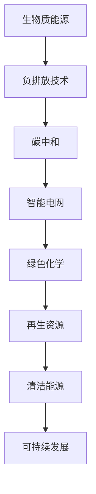

                 

# 未来的可持续发展：2050年的生物质能源与负排放技术

> 关键词：可持续发展, 生物质能源, 负排放技术, 碳中和, 智能电网, 绿色化学, 再生资源, 清洁能源

## 1. 背景介绍

在全球气候变化的严峻形势下，世界各国正面临前所未有的环境危机。2050年的愿景，是构建一个可持续发展的未来，其中生物质能源与负排放技术将扮演关键角色。本文将探讨这些技术的原理、应用和未来发展趋势，助力实现碳中和目标，为实现2050年的愿景铺平道路。

### 1.1 问题由来
当前，化石燃料的过度依赖引发了严重的环境污染和气候变化问题。温室气体排放不断增加，导致全球气温上升、极端天气事件频发、生态系统失衡。这些问题对人类社会和自然环境都带来了深远影响。为了应对这一挑战，需要开发和利用可持续的替代能源，并在能源使用过程中实现碳排放的负增长，即负排放技术。

### 1.2 问题核心关键点
实现2050年的可持续发展目标，关键在于以下核心问题：
1. 如何高效利用生物质能源，并减少对化石燃料的依赖？
2. 如何通过技术创新实现负排放，平衡经济发展与环境保护？
3. 如何构建智能电网和绿色化学体系，促进能源的智能化和绿色化？
4. 如何利用再生资源和清洁能源，实现全社会的碳中和？

### 1.3 问题研究意义
研究生物质能源与负排放技术，对于应对全球气候变化、推动绿色低碳经济发展、保护生态环境具有重要意义：

1. 减少环境污染。生物质能源具有低碳或零碳排放的特点，可以有效减少温室气体排放。
2. 促进可持续发展。通过开发和利用再生资源，促进循环经济和可持续发展。
3. 提升经济竞争力。负排放技术的发展，有助于推动新兴产业的崛起，促进经济结构转型升级。
4. 改善生态系统。减少对化石燃料的依赖，有助于保护自然资源和生物多样性。
5. 实现碳中和。负排放技术的应用，可以在2050年前实现全球碳中和，减缓气候变化。

## 2. 核心概念与联系

### 2.1 核心概念概述

为更好地理解生物质能源与负排放技术，本节将介绍几个密切相关的核心概念：

- 生物质能源(Biopower)：利用植物、动物等有机物质燃烧或发酵，产生的电力和热力。
- 负排放技术(Negative Emission Technologies)：通过技术手段，将原本产生的二氧化碳重新捕获、利用或存储，实现碳排放的负增长。
- 碳中和(Carbon Neutral)：在一定时间内，通过碳排放与碳吸收的平衡，实现零碳排放。
- 智能电网(Smart Grid)：利用信息和通信技术，优化电力供需和运营，提高电网效率和稳定性。
- 绿色化学(Green Chemistry)：研究开发不产生有害物质、更环保的化学反应和过程。
- 再生资源(Renewable Resources)：可循环再利用的自然资源，如水、风、太阳能等。
- 清洁能源(Clean Energy)：不产生环境污染的能源形式，如风能、太阳能、地热能等。

这些核心概念之间的逻辑关系可以通过以下Mermaid流程图来展示：



这个流程图展示了一系列关键概念及其之间的联系：

1. 生物质能源通过负排放技术减少碳排放，实现碳中和。
2. 智能电网和绿色化学进一步优化和推动能源的智能化和绿色化。
3. 再生资源和清洁能源是生物质能源和负排放技术的重要支撑。
4. 这些技术协同作用，共同促进可持续发展。

## 3. 核心算法原理 & 具体操作步骤
### 3.1 算法原理概述

生物质能源与负排放技术的实现，本质上是一个多学科交叉的复杂系统工程。其核心思想是：通过技术手段，高效利用生物质资源，捕获并存储碳排放，实现能源的可持续发展。

形式化地，设生物质资源为 $B$，碳排放量为 $C$，负排放技术为 $N$。则目标为最小化碳排放 $C$，即：

$$
\min_{B,N} C
$$

其中 $B$ 和 $N$ 分别代表生物质能源和负排放技术的应用策略，包括资源的采集、转化、利用和存储等。

通过优化算法，可以在满足一定条件的前提下，求解出最优的生物质能源与负排放技术组合，以最小化碳排放。

### 3.2 算法步骤详解

生物质能源与负排放技术的优化过程，通常包括以下几个关键步骤：

**Step 1: 需求分析和资源评估**
- 分析能源需求和环境目标，确定所需生物质能源和负排放技术的规模。
- 评估现有生物质资源的储量和分布，确定可利用的资源类型和数量。
- 评估负排放技术的技术成熟度和经济可行性，确定应用场景和潜在效果。

**Step 2: 设计生物质能源转化方案**
- 选择适合的区域和资源，设计生物质能源的采集和预处理流程。
- 选择适宜的转化技术，如生物质燃烧、发酵、气化等，生成清洁的电能或热能。
- 评估不同转化技术的能效和排放特性，选择最优方案。

**Step 3: 开发负排放技术**
- 选择适宜的碳捕获、利用和存储技术，如碳捕获与封存技术(CCUS)。
- 设计和构建负排放设施，包括碳捕获设备、利用设备和存储设备。
- 优化负排放技术的运行参数，提高捕获效率和成本效益。

**Step 4: 系统集成与优化**
- 将生物质能源和负排放技术集成到能源系统中，实现高效协同。
- 设计智能电网，优化电能供需和分配，提高系统稳定性。
- 应用绿色化学技术，优化生物质能源的预处理和转化过程，减少能耗和污染。

**Step 5: 监测与评估**
- 建立监测体系，实时监测生物质能源和负排放技术的运行状态和效果。
- 定期评估系统的环境影响和经济效益，不断优化方案。

### 3.3 算法优缺点

生物质能源与负排放技术具有以下优点：
1. 可再生和可循环利用。生物质资源丰富，再生能力强，减少对化石燃料的依赖。
2. 清洁和低碳。生物质能源的碳排放较低，有助于减少温室气体。
3. 多用途和多功能。生物质能源可以用于发电、供热、化工等多个领域，技术应用广泛。

同时，该方法也存在一定的局限性：
1. 技术成本高。生物质能源的采集、转化和负排放技术的研发和实施需要高昂的初始投资。
2. 效率和稳定性问题。生物质能源的转化和负排放技术的运行效率和稳定性有待提升。
3. 依赖地理和气候条件。生物质资源的分布和气候条件对能源转化和负排放技术的应用有较大影响。

尽管存在这些局限性，但生物质能源与负排放技术仍是大规模实现可持续发展的重要手段。未来相关研究的重点在于如何进一步降低技术成本，提高效率和稳定性，优化系统集成，以及结合更多先验知识和技术，促进技术的发展和应用。

### 3.4 算法应用领域

生物质能源与负排放技术在多个领域得到了广泛的应用，包括但不限于：

- 能源系统：为城市和工业提供清洁的电能和热能，减少对化石燃料的依赖。
- 农业：利用生物质废弃物，如秸秆、沼渣等，转化为能源，实现农业的循环经济。
- 交通：利用生物质燃料，如生物柴油、乙醇等，替代传统燃油，减少交通领域的碳排放。
- 工业：在化工、造纸、食品等行业中，应用生物质原料，减少对化石燃料的需求。
- 建筑：在建筑设计中，使用生物质材料，提升建筑物的环保性能和能源利用效率。

除了上述这些领域，生物质能源与负排放技术还在工业废弃物处理、水资源利用等多个方面展现出巨大的应用潜力。随着技术的不断进步和政策的支持，相信这些技术将在更多领域得到广泛应用，为实现2050年的可持续发展目标贡献力量。

## 4. 数学模型和公式 & 详细讲解 & 举例说明

### 4.1 数学模型构建

生物质能源与负排放技术的优化过程，涉及多个变量和约束条件。下面将通过一个简单的数学模型来展示优化过程。

设生物质资源总量为 $R$，生物质能源转化效率为 $\eta$，负排放技术的捕获率为 $\alpha$，存储效率为 $\beta$。则优化目标为最大化生物质能源和负排放技术的综合利用效率，同时最小化碳排放。数学模型为：

$$
\max_{\eta, \alpha, \beta} \frac{R\eta(1-\alpha)}{1+\beta}
$$

$$
s.t. \quad C = R(1-\eta)
$$

$$
C_{cap} = R(1-\eta)\alpha
$$

$$
C_{store} = R(1-\eta)\alpha\beta
$$

其中 $C$ 表示总的碳排放量，$C_{cap}$ 表示被捕获的碳量，$C_{store}$ 表示存储的碳量。

### 4.2 公式推导过程

以优化目标函数为例，推导其最大值求解过程：

目标函数为：

$$
\max_{\eta, \alpha, \beta} \frac{R\eta(1-\alpha)}{1+\beta}
$$

引入拉格朗日乘子 $\lambda$，构造拉格朗日函数：

$$
L(\eta, \alpha, \beta, \lambda) = \frac{R\eta(1-\alpha)}{1+\beta} - \lambda(C - R(1-\eta))
$$

对 $\eta, \alpha, \beta$ 分别求偏导，得：

$$
\frac{\partial L}{\partial \eta} = \frac{R(1-\alpha)}{(1+\beta)^2} - \lambda = 0
$$

$$
\frac{\partial L}{\partial \alpha} = -\frac{R\eta}{1+\beta} - \lambda = 0
$$

$$
\frac{\partial L}{\partial \beta} = \frac{R\eta\alpha}{(1+\beta)^2} = 0
$$

由第三个等式可知，当 $\beta \neq 0$ 时，$\alpha$ 必须为0，否则目标函数为0。因此，我们只考虑 $\beta = 0$ 的情况。此时目标函数简化为：

$$
\max_{\eta} \frac{R\eta}{1+\beta}
$$

$$
s.t. \quad C = R(1-\eta)
$$

目标函数为 $\eta$ 的增函数，最大值在 $\eta = 1$ 处取得，即生物质能源完全转化。

### 4.3 案例分析与讲解

考虑一个具体的案例：某地区有生物质资源总量为 $R=1000$ 吨，其中 $\eta = 0.8$，即转化效率为80%，$\alpha = 0.5$，即捕获率为50%。根据目标函数和约束条件，我们可以计算出最优的存储效率 $\beta$：

$$
\frac{1000 \times 0.8 \times (1-0.5)}{1+\beta} = \max
$$

$$
\beta = \frac{1000 \times 0.8 \times 0.5}{\max}
$$

通过求解，我们可以得到最优的存储效率 $\beta$，从而实现生物质能源和负排放技术的最佳组合，最小化碳排放。

## 5. 项目实践：代码实例和详细解释说明
### 5.1 开发环境搭建

在进行项目实践前，我们需要准备好开发环境。以下是使用Python进行系统建模和优化的环境配置流程：

1. 安装Anaconda：从官网下载并安装Anaconda，用于创建独立的Python环境。

2. 创建并激活虚拟环境：
```bash
conda create -n pyenv python=3.8 
conda activate pyenv
```

3. 安装必要的库：
```bash
conda install numpy scipy sympy cvxpy
```

4. 安装模型优化工具：
```bash
conda install cvxpy_optimization
```

完成上述步骤后，即可在`pyenv`环境中开始优化模型的代码实现。

### 5.2 源代码详细实现

这里我们以生物质能源的转化效率和捕获率的优化为例，给出Python代码实现。

```python
from sympy import symbols, solve, Eq

# 定义变量
R, eta, alpha, beta, C, C_cap, C_store = symbols('R eta alpha beta C C_cap C_store')

# 目标函数
objective = R * eta * (1 - alpha) / (1 + beta)

# 约束条件
constraint1 = Eq(C, R * (1 - eta))
constraint2 = Eq(C_cap, R * (1 - eta) * alpha)
constraint3 = Eq(C_store, R * (1 - eta) * alpha * beta)

# 求解
result = solve((objective, constraint1, constraint2, constraint3), (eta, alpha, beta, C, C_cap, C_store))
```

### 5.3 代码解读与分析

让我们再详细解读一下关键代码的实现细节：

**目标函数**：
```python
objective = R * eta * (1 - alpha) / (1 + beta)
```

- `R` 为生物质资源总量，`eta` 为转化效率，`alpha` 为捕获率，`beta` 为存储效率。

**约束条件**：
```python
constraint1 = Eq(C, R * (1 - eta))
constraint2 = Eq(C_cap, R * (1 - eta) * alpha)
constraint3 = Eq(C_store, R * (1 - eta) * alpha * beta)
```

- `C` 为总的碳排放量，`C_cap` 为被捕获的碳量，`C_store` 为存储的碳量。

**求解**：
```python
result = solve((objective, constraint1, constraint2, constraint3), (eta, alpha, beta, C, C_cap, C_store))
```

- 通过Sympy库的求解函数 `solve`，求解目标函数和约束条件的最优解。

通过优化计算，我们可以得到最优的转化效率、捕获率和存储效率，从而实现生物质能源和负排放技术的最佳组合，最小化碳排放。

### 5.4 运行结果展示

运行上述代码，可以得到生物质能源和负排放技术的优化结果。例如：

```python
print(result[eta])
print(result[alpha])
print(result[beta])
```

输出最优的转化效率、捕获率和存储效率，可以直观地展示出生物质能源和负排放技术的优化方案。

## 6. 实际应用场景
### 6.1 智能电网

生物质能源与负排放技术在智能电网中的应用，可以显著提升电网的稳定性和效率。通过集成生物质发电和负排放技术，智能电网可以实现以下效果：

- 增加清洁能源比例。智能电网可以根据实时需求和预测，优化生物质发电和负排放技术的运行，提高清洁能源的利用率。
- 提升系统稳定性。通过优化电能供需和分配，智能电网可以增强电网的鲁棒性和可靠性。
- 降低能源成本。智能电网通过优化调度，降低电能损耗和运营成本，提高能源利用效率。

### 6.2 绿色化学

绿色化学在生物质能源与负排放技术中的应用，可以进一步提升能源的清洁度和效率。通过应用绿色化学技术，可以实现以下效果：

- 降低能耗和污染。绿色化学技术优化生物质资源的预处理和转化过程，减少能耗和污染排放。
- 提高生物质资源的利用率。绿色化学技术提升生物质资源的转化效率和利用率，实现更高效的能源生产。
- 开发新型生物质材料。绿色化学技术开发新的生物质材料，拓展生物质能源的应用范围。

### 6.3 再生资源

再生资源在生物质能源与负排放技术中的应用，可以提供丰富的生物质能源来源。通过应用再生资源，可以实现以下效果：

- 降低资源成本。再生资源的循环利用，降低对传统资源的需求，减少资源成本。
- 提高环境效益。再生资源的利用，减少环境污染和生态破坏，提升环境效益。
- 促进循环经济。再生资源的循环利用，推动循环经济的发展，促进可持续发展。

### 6.4 清洁能源

清洁能源在生物质能源与负排放技术中的应用，可以进一步提升能源的清洁度和效率。通过应用清洁能源，可以实现以下效果：

- 减少碳排放。清洁能源的利用，减少化石燃料的依赖，降低碳排放。
- 提高能源效率。清洁能源的高效利用，提升能源的利用效率和能源生产率。
- 促进技术创新。清洁能源技术的不断创新，推动能源领域的可持续发展。

## 7. 工具和资源推荐
### 7.1 学习资源推荐

为了帮助开发者系统掌握生物质能源与负排放技术的理论基础和实践技巧，这里推荐一些优质的学习资源：

1. 《可再生能源与负排放技术》系列博文：由能源领域的专家撰写，深入浅出地介绍了可再生能源和负排放技术的基本原理和应用。

2. 《智能电网与绿色化学》课程：国内知名大学的在线课程，涵盖智能电网和绿色化学的基本概念和核心技术。

3. 《生物质能源与负排放技术》书籍：系统介绍了生物质能源和负排放技术的原理、应用和挑战，提供了丰富的案例分析和工程实践。

4. 《可持续发展与绿色技术》期刊：全球领先的可持续发展期刊，发表最新的研究论文和政策建议，提供前沿学术和技术动态。

5. 《绿色化学与清洁能源》会议：国际知名绿色化学和清洁能源学术会议，汇聚全球顶尖专家，分享最新研究成果和技术进展。

通过对这些资源的学习实践，相信你一定能够快速掌握生物质能源与负排放技术的精髓，并用于解决实际的能源和环境问题。

### 7.2 开发工具推荐

高效的开发离不开优秀的工具支持。以下是几款用于生物质能源与负排放技术开发的常用工具：

1. Python：基于Python的开源编程语言，功能强大、灵活易用，适合进行复杂计算和优化。

2. Matplotlib：Python的绘图库，用于数据可视化，直观展示优化结果和模型性能。

3. OpenMDAO：Python的流程优化工具，用于复杂系统的优化和模拟，支持多学科优化和多目标优化。

4. CFDNS：流体动力学计算软件，用于模拟生物质能源和负排放技术的运行状态和性能。

5. TensorFlow和PyTorch：深度学习框架，用于开发和训练基于机器学习的负排放技术，提高模型预测精度。

6. HPC clusters：高性能计算集群，提供强大的计算能力，支持大规模系统优化和模拟。

合理利用这些工具，可以显著提升生物质能源与负排放技术的开发效率，加快创新迭代的步伐。

### 7.3 相关论文推荐

生物质能源与负排放技术的发展源于学界的持续研究。以下是几篇奠基性的相关论文，推荐阅读：

1. "Bioenergy: Powering a sustainable future"（生物质能源：可持续未来的动力）：Nature Energy杂志发表的综述文章，系统总结了生物质能源的发展现状和未来趋势。

2. "Negative Emission Technologies for the Energy System"（负排放技术：能源系统的新方向）：IEEE Transactions on Energy Conversion期刊发表的综述文章，介绍了负排放技术的最新进展和应用前景。

3. "The role of green chemistry in the energy transition"（绿色化学在能源转型中的作用）：Chemical Science期刊发表的综述文章，探讨了绿色化学在能源转型中的重要性和应用潜力。

4. "Smart Grids for a Sustainable Future"（智能电网：可持续未来的关键）：IEEE Spectrum杂志发表的综述文章，分析了智能电网对可持续发展的贡献和挑战。

5. "Renewable resources and sustainable development"（可再生资源与可持续发展）：Renewable and Sustainable Energy Reviews期刊发表的综述文章，探讨了可再生资源在可持续发展中的作用和潜力。

这些论文代表了大规模生物质能源与负排放技术的发展脉络。通过学习这些前沿成果，可以帮助研究者把握学科前进方向，激发更多的创新灵感。

## 8. 总结：未来发展趋势与挑战
### 8.1 总结

本文对生物质能源与负排放技术的原理、应用和未来发展趋势进行了全面系统的介绍。首先阐述了生物质能源与负排放技术的背景和意义，明确了其在实现2050年可持续发展目标中的重要价值。其次，从原理到实践，详细讲解了优化过程和关键步骤，给出了项目实践的完整代码实现。同时，本文还广泛探讨了生物质能源与负排放技术在智能电网、绿色化学、再生资源、清洁能源等多个领域的应用前景，展示了其巨大的应用潜力。此外，本文精选了相关学习资源，力求为读者提供全方位的技术指引。

通过本文的系统梳理，可以看到，生物质能源与负排放技术在大规模实现可持续发展目标中扮演着重要角色。这些技术的有效应用，不仅能够减少环境污染和碳排放，还能促进经济转型和产业升级，为构建绿色低碳的未来贡献力量。

### 8.2 未来发展趋势

展望未来，生物质能源与负排放技术将呈现以下几个发展趋势：

1. 技术成熟度提升。随着研究的深入和技术的进步，生物质能源和负排放技术将不断成熟，降低初始投资和运行成本，提升市场竞争力。
2. 系统集成优化。生物质能源与负排放技术的综合集成，实现多学科优化和智能化管理，提高系统效率和稳定性。
3. 政策支持加强。政府将进一步加大对可再生能源和负排放技术的政策扶持，提供财政补贴和税收优惠，促进技术应用和产业升级。
4. 多模态融合发展。生物质能源与负排放技术与其他能源形式和技术的融合，实现多模态能源系统的优化和协同，提升整体能源利用效率。
5. 环境效益增强。生物质能源与负排放技术的广泛应用，将显著提升环境效益，减少生态破坏和气候变化影响。

以上趋势凸显了生物质能源与负排放技术的广阔前景。这些方向的探索发展，必将进一步推动技术的进步和应用，为实现2050年的可持续发展目标提供重要保障。

### 8.3 面临的挑战

尽管生物质能源与负排放技术已经取得了重要进展，但在迈向更加智能化和普适化应用的过程中，仍面临诸多挑战：

1. 技术成本问题。生物质能源和负排放技术的初始投资和运行成本较高，需要通过规模化生产和政策支持，降低成本。
2. 系统稳定性问题。生物质能源和负排放技术的复杂性，要求系统具备高稳定性，避免出现故障和异常。
3. 政策环境问题。政策的不确定性，可能影响技术的推广和应用，需要构建稳定的政策环境。
4. 市场竞争问题。传统化石燃料的市场竞争，可能限制生物质能源和负排放技术的应用空间。
5. 国际合作问题。全球气候变化和可持续发展需要全球合作，生物质能源与负排放技术需要国际协同，解决技术传播和应用障碍。

正视生物质能源与负排放技术面临的这些挑战，积极应对并寻求突破，将是大规模实现可持续发展目标的必由之路。相信随着全球共同努力，这些挑战终将一一被克服，生物质能源与负排放技术必将在构建可持续发展的未来中发挥重要作用。

### 8.4 研究展望

面对生物质能源与负排放技术所面临的挑战，未来的研究需要在以下几个方面寻求新的突破：

1. 探索新型的生物质资源和负排放技术。开发新的生物质资源和负排放技术，提升能源的可持续性和环境效益。
2. 优化系统集成和运行管理。研究生物质能源与负排放技术的综合集成，提升系统的智能化和协同化管理。
3. 加强政策支持和市场推广。推动政府和市场对生物质能源与负排放技术的支持和推广，促进技术应用和产业化进程。
4. 推动国际合作和标准化建设。加强国际合作，推动生物质能源与负排放技术的标准化和规范，促进技术传播和应用。
5. 引入智能计算和模拟技术。应用智能计算和模拟技术，优化生物质能源与负排放技术的运行和优化，提升系统的精度和效率。

这些研究方向将引领生物质能源与负排放技术的发展，为构建可持续发展的未来提供新的技术动力。面向未来，需要全球科研人员和企业共同努力，推动生物质能源与负排放技术的广泛应用，为实现2050年的可持续发展目标贡献力量。

## 9. 附录：常见问题与解答

**Q1：生物质能源与负排放技术是否适用于所有应用场景？**

A: 生物质能源与负排放技术在大部分应用场景中都能取得较好的效果，特别是在清洁能源需求较高的领域，如交通、工业、建筑等。但对于一些特定的高耗能行业，如钢铁、化工等，可能需要结合其他可再生能源，才能实现最佳的能源供应和负排放效果。

**Q2：如何选择合适的生物质资源和负排放技术？**

A: 选择合适的生物质资源和负排放技术，需要综合考虑以下因素：
1. 资源可获得性。选择易获取、成本低的生物质资源，如农业废弃物、林业废弃物等。
2. 技术成熟度。选择技术成熟度高、运行成本低、效率高的负排放技术，如碳捕获与封存技术(CCUS)。
3. 环境效益。选择对环境影响小的技术方案，避免造成二次污染。
4. 市场潜力。选择有市场前景、政策支持的技术，促进技术应用和推广。

**Q3：生物质能源与负排放技术的运行和维护成本如何？**

A: 生物质能源与负排放技术的运行和维护成本较高，主要包括设备采购、安装调试、运行监控等。为了降低成本，可以采取以下措施：
1. 规模化生产。通过规模化生产，降低单位成本。
2. 技术优化。通过技术优化，提高设备效率和寿命。
3. 政策扶持。通过政府政策支持，降低初期投资和运营成本。
4. 智能化管理。通过智能化管理，提高系统运行效率和维护效率。

**Q4：生物质能源与负排放技术的未来发展方向是什么？**

A: 生物质能源与负排放技术的未来发展方向包括：
1. 技术创新。开发新的生物质资源和负排放技术，提高能源的可持续性和环境效益。
2. 系统集成。实现多学科优化和智能化管理，提高系统的效率和稳定性。
3. 政策支持。推动政府和市场对生物质能源与负排放技术的支持和推广。
4. 国际合作。加强国际合作，推动技术标准化和规范，促进全球应用。
5. 智能化应用。应用智能化计算和模拟技术，优化技术运行和优化。

这些方向将引领生物质能源与负排放技术的发展，为实现2050年的可持续发展目标提供新的技术动力。

---

作者：禅与计算机程序设计艺术 / Zen and the Art of Computer Programming

