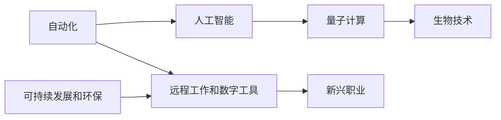

                 

# 未来的工作方式：2050年的职业选择与就业趋势

## 1. 背景介绍

### 1.1 问题由来

随着科技的飞速发展，未来的工作方式将迎来翻天覆地的变化。从自动化和人工智能的兴起，到量子计算和生物技术的突破，这些技术的融合将彻底重塑劳动市场，引发新的职业选择和就业趋势。2050年的世界，将会与今天有着截然不同的劳动生态，本文将详细探讨这一变化，帮助读者理解和应对未来的职业挑战。

### 1.2 问题核心关键点

未来的工作方式，将受到以下关键因素的影响：
- **自动化和人工智能**：自动化技术和大数据驱动的人工智能将替代许多重复性、低技能的工作。
- **量子计算和生物技术**：量子计算机和生物技术的发展，将推动新领域如药物设计、材料科学等产生大量新兴职业。
- **可持续发展和环保**：全球对可持续发展和环保的重视，将催生大量相关职业，如绿色能源工程师、碳减排专家等。
- **远程工作和数字工具**：全球化和疫情推动的远程工作趋势，将使数字工具和在线协作成为标准配置。

这些变化将深刻影响职业选择和就业趋势，要求职场人士不断学习和适应新技术，以保持竞争力。

## 2. 核心概念与联系

### 2.1 核心概念概述

理解未来的工作方式，首先需要把握以下几个核心概念：

- **自动化**：通过机器人、自动化软件等技术，自动完成重复性、标准化的工作流程。
- **人工智能**：利用机器学习、深度学习等技术，使计算机具备类似人类的智能，以处理复杂任务。
- **量子计算**：利用量子叠加和纠缠等物理特性，实现远超传统计算能力的处理能力。
- **生物技术**：结合生物学和工程学，开发新药物、新材料，改善人类健康和生活质量。
- **可持续发展和环保**：关注环境保护和资源可持续利用，发展绿色技术，应对气候变化。
- **远程工作和数字工具**：依赖网络和数字工具，实现地理位置的自由选择和灵活工作方式。

这些概念之间的联系和相互作用，将共同塑造未来的劳动市场。

### 2.2 核心概念原理和架构的 Mermaid 流程图



## 3. 核心算法原理 & 具体操作步骤

### 3.1 算法原理概述

未来的工作方式将受到多种算法和技术的影响，核心算法原理包括：

- **机器学习和深度学习**：通过大量数据训练模型，自动化学习和决策。
- **强化学习**：通过奖励机制，使机器不断优化决策策略，适应复杂环境。
- **自然语言处理(NLP)**：使计算机理解、处理和生成人类语言。
- **图像识别和计算机视觉**：使计算机识别和分析图像信息。
- **物联网(IoT)**：连接物理世界和数字世界，实现数据互联。

### 3.2 算法步骤详解

1. **数据准备**：收集并预处理相关数据，如历史就业数据、技术发展趋势等。
2. **模型选择**：选择合适的算法模型，如随机森林、神经网络等。
3. **模型训练**：在准备好的数据上训练模型，优化参数。
4. **结果分析**：分析训练结果，预测未来职业和就业趋势。
5. **验证和调整**：使用新数据验证预测结果，调整模型参数。

### 3.3 算法优缺点

**优点**：
- **高效性**：自动化训练过程，缩短时间成本。
- **准确性**：数据驱动的决策，减少人为偏差。
- **可扩展性**：适应多领域、多维度数据的预测。

**缺点**：
- **数据依赖性**：模型预测依赖于数据质量。
- **算法复杂性**：模型训练和优化复杂，需要专业技能。
- **解释性不足**：部分算法模型输出难以解释，缺乏透明性。

### 3.4 算法应用领域

这些算法原理在多个领域均有广泛应用，例如：

- **金融**：自动化交易、风险管理、信用评分等。
- **医疗**：疾病诊断、个性化治疗、医疗资源优化等。
- **制造业**：智能制造、供应链优化、质量控制等。
- **交通**：自动驾驶、智能交通管理、物流优化等。
- **能源**：智能电网、可再生能源优化、能源消耗预测等。
- **环保**：碳排放监测、环境数据分析、绿色技术评估等。

## 4. 数学模型和公式 & 详细讲解 & 举例说明

### 4.1 数学模型构建

构建数学模型时，通常包括以下几个步骤：

1. **定义目标变量**：如就业人数、职业比例等。
2. **设定影响因素**：如技术发展、政策变化等。
3. **建立数学表达式**：如线性回归、逻辑回归等。
4. **确定误差函数**：如均方误差、交叉熵等。

### 4.2 公式推导过程

以线性回归模型为例，假设目标变量为 $y$，影响因素为 $x_1, x_2, ..., x_n$，则线性回归模型可以表示为：

$$
y = \beta_0 + \beta_1x_1 + \beta_2x_2 + ... + \beta_nx_n + \epsilon
$$

其中 $\beta_i$ 为回归系数，$\epsilon$ 为误差项。通过最小化误差函数（如均方误差），求解 $\beta_i$ 的值。

### 4.3 案例分析与讲解

假设我们预测2050年某个城市的技术类职业比例，收集到影响因素包括大学技术类课程招生人数、科技企业数量、科技研发投入等。建立线性回归模型，通过历史数据训练得到回归系数 $\beta_i$，即可预测未来的职业比例。

## 5. 项目实践：代码实例和详细解释说明

### 5.1 开发环境搭建

为了进行项目实践，需要以下开发环境：

- **Python 3.x**：推荐使用 Python 3.8 及以上版本。
- **Pandas**：用于数据处理和分析。
- **NumPy**：用于科学计算。
- **Scikit-learn**：用于建立和训练机器学习模型。
- **Jupyter Notebook**：交互式数据分析和模型训练。

### 5.2 源代码详细实现

下面是一个简单的线性回归模型预测职业比例的 Python 代码示例：

```python
import pandas as pd
from sklearn.linear_model import LinearRegression
from sklearn.metrics import mean_squared_error

# 读取数据
data = pd.read_csv('employment_data.csv')

# 定义目标变量和影响因素
y = data['occupation_ratio']
X = data[['university_technology_enrollment', 'tech_firms_count', 'tech_research_investment']]

# 建立线性回归模型
model = LinearRegression()
model.fit(X, y)

# 预测未来职业比例
future_data = pd.DataFrame({'university_technology_enrollment': [10000], 'tech_firms_count': [5000], 'tech_research_investment': [1000]})
future_predictions = model.predict(future_data)
print(future_predictions)
```

### 5.3 代码解读与分析

代码中，我们首先读取了历史就业数据，将其分为目标变量和影响因素。然后使用 `LinearRegression` 类构建线性回归模型，并通过 `fit` 方法进行模型训练。最后，用新的数据 `future_data` 进行预测，并打印输出预测结果。

## 6. 实际应用场景

### 6.1 智能制造

自动化和人工智能技术在智能制造中得到广泛应用，通过自动化生产线、智能仓储系统等，提高生产效率和质量。例如，机器人和自动化设备可以处理重复性、高危性工作，减轻工人负担。

### 6.2 金融科技

量子计算和人工智能在金融科技中的应用，将大幅提升金融服务的效率和准确性。例如，量子计算机能够处理海量数据，优化投资组合和风险管理。

### 6.3 生物医疗

生物技术和人工智能在医疗领域的应用，如基因编辑、药物研发、智能诊断等，将带来医疗服务的革命性改变。例如，AI 可以通过分析大量病历数据，辅助医生制定治疗方案。

### 6.4 环保科技

可持续发展和环保技术的发展，将催生大量绿色就业岗位。例如，绿色能源工程师、碳减排专家等，将助力全球应对气候变化。

### 6.5 远程工作

全球化和疫情推动的远程工作趋势，将使数字工具和在线协作成为标准配置。例如，视频会议、在线协作工具将大大提高工作效率。

### 6.6 人工智能伦理

随着人工智能技术的普及，伦理问题也日益凸显。例如，算法偏见、数据隐私等问题需要引起重视，并制定相应的监管和治理措施。

## 7. 工具和资源推荐

### 7.1 学习资源推荐

- **Coursera**：提供大量机器学习和人工智能课程，涵盖理论基础和实践应用。
- **edX**：提供多所名校的计算机科学课程，包括深度学习、数据科学等。
- **Kaggle**：数据科学竞赛平台，提供实战经验和数据集。
- **GitHub**：开源社区，提供大量机器学习项目和代码示例。

### 7.2 开发工具推荐

- **PyTorch**：深度学习框架，支持分布式计算和模型优化。
- **TensorFlow**：谷歌开源的深度学习框架，支持动态计算图和生产部署。
- **Jupyter Notebook**：交互式数据分析和模型训练工具。
- **Anaconda**：Python发行版，支持多种科学计算库和数据分析工具。

### 7.3 相关论文推荐

- **"A Survey of Machine Learning Algorithms for Predictive Maintenance in Manufacturing"**：介绍机器学习在制造业中的应用，如预测性维护。
- **"Quantum computing in artificial intelligence: practical impacts and applications"**：探讨量子计算在人工智能中的应用和影响。
- **"Sustainable development in urban areas: Challenges, policies, and sustainable solutions"**：分析城市可持续发展中的挑战和解决方案。
- **"Remote work: A literature review and analysis of future trends"**：回顾远程工作的发展和未来趋势。
- **"Artificial intelligence ethics: An overview of current challenges and recommendations"**：探讨人工智能伦理问题，提出解决方案和建议。

## 8. 总结：未来发展趋势与挑战

### 8.1 研究成果总结

本文系统地介绍了自动化、人工智能、量子计算、生物技术、可持续发展和环保、远程工作和数字工具等关键概念，探讨了它们对未来工作方式的影响。通过实例分析，展示了机器学习在职业预测中的应用。

### 8.2 未来发展趋势

1. **技术融合**：自动化和人工智能将进一步融合，推动更多领域的智能化。
2. **新兴职业**：新职业的产生将带来大量就业机会，需要不断学习和适应。
3. **跨学科发展**：不同学科的交叉融合将推动更多创新和突破。
4. **全球化合作**：跨国合作将促进技术共享和人才流动。
5. **伦理和监管**：技术和伦理问题需同步发展，保障社会公平和可持续发展。

### 8.3 面临的挑战

1. **技能差距**：新技术的出现将导致部分技能过时，需要不断学习和更新。
2. **数据隐私**：数据驱动的决策需要严格的数据隐私保护。
3. **算法公平性**：确保算法决策的公平性，避免歧视和偏见。
4. **资源分配**：如何合理分配资源，最大化技术效益。
5. **伦理挑战**：人工智能技术带来的伦理问题需要综合考虑。

### 8.4 研究展望

未来的研究需要在以下几个方面寻求新的突破：

1. **终身学习**：开发终身学习算法，适应技术快速变化的环境。
2. **多学科协同**：促进多学科融合，推动交叉创新。
3. **伦理和法规**：制定伦理和法规，保障技术发展与社会伦理的协调。
4. **数据隐私保护**：研究新的数据隐私保护技术，确保数据安全。
5. **算力提升**：提升计算能力，推动更多复杂问题的解决。

通过持续的研究和探索，我们可以更好地应对未来的挑战，抓住机遇，推动技术进步和社会发展。

## 9. 附录：常见问题与解答

**Q1：未来就业市场将会如何变化？**

A: 未来就业市场将受到自动化和人工智能的深刻影响，许多重复性、低技能的工作将被替代，而新兴领域和跨学科岗位将带来大量就业机会。例如，智能制造、金融科技、生物医疗、环保科技等新兴领域将快速成长。

**Q2：我该如何应对未来就业市场的变化？**

A: 首先，不断学习和更新技能，适应新技术的应用。其次，关注新兴领域的发展，寻找机会和方向。最后，加强跨学科学习和合作，提升综合素质和竞争力。

**Q3：未来工作方式有哪些新特点？**

A: 未来的工作方式将更加灵活、远程和协作化。数字工具和在线协作将成为标配，人工智能和大数据将大幅提升工作效率和质量。同时，环保和可持续发展的理念将贯穿整个劳动市场。

**Q4：未来就业岗位将有哪些变化？**

A: 传统岗位将面临自动化和人工智能的冲击，许多重复性和低技能的工作将被替代。同时，新兴领域如智能制造、金融科技、生物医疗、环保科技等将产生大量新的就业岗位，需要不断学习和适应。

通过理解这些变化和挑战，我们可以更好地准备未来的就业市场，抓住机遇，迎接未来的挑战。

---

作者：禅与计算机程序设计艺术 / Zen and the Art of Computer Programming

