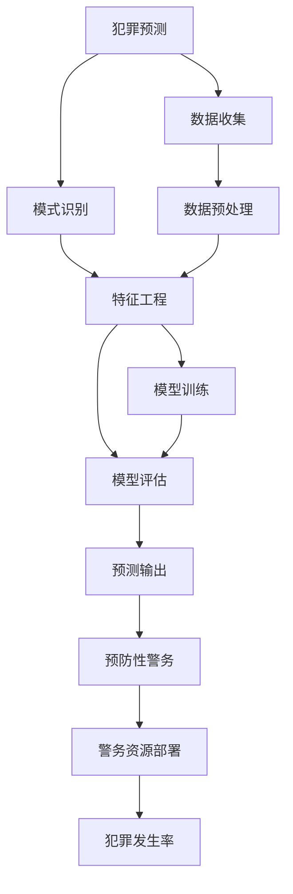

                 

# 未来的智能安防：2050年的Crime Prediction与Predictive Policing

在未来的智能安防领域，基于AI的犯罪预测与预防性警务（Predictive Policing）技术将得到前所未有的发展和应用。本文将探讨2050年这一技术将如何影响社会安全、公共秩序与执法效率。我们将其分为五个主要部分：背景介绍、核心概念与联系、核心算法原理与具体操作步骤、实际应用场景及未来展望、以及工具和资源推荐与总结。

## 1. 背景介绍

随着社会经济的发展，犯罪形式越来越多样化和复杂化，城市人口密集，治安压力增大，犯罪预防成为各国公安部门的重要任务。传统的犯罪预防依靠人工经验，效率低下且容易产生偏见。而基于人工智能的犯罪预测与预防性警务（Predictive Policing）技术，通过数据分析、模式识别和深度学习等方法，可以更加准确地预测犯罪高发区域，提高警务资源的利用效率。

在2050年，全球范围内的智能安防系统将得到广泛应用。这些系统可以实时分析海量数据，预测并预防犯罪，提升公共安全水平。此外，基于AI的安防系统不仅能够预测犯罪，还能在犯罪发生前采取预防措施，有效减少犯罪率。

## 2. 核心概念与联系

### 2.1 核心概念概述

为了更好地理解2050年的犯罪预测与预防性警务技术，本节将介绍几个关键概念：

- 犯罪预测（Crime Prediction）：使用机器学习算法预测犯罪发生的可能性及具体区域，帮助警方提前部署资源，进行预防性打击。
- 预防性警务（Predictive Policing）：通过分析历史犯罪数据，预测未来犯罪趋势，指导警务资源部署和警力调动，提高警务效率。
- 智能安防系统（Smart Security System）：集成人工智能技术，包括图像识别、自然语言处理、预测分析等，实现实时监控、报警、预测等功能。

### 2.2 核心概念原理和架构的 Mermaid 流程图



这个流程图展示了犯罪预测与预防性警务的核心过程：首先，通过数据收集和预处理，提取犯罪相关的特征，并进行模型训练和评估，最终得到犯罪预测结果。这些预测结果用于指导警务资源的部署，降低犯罪率。

## 3. 核心算法原理 & 具体操作步骤

### 3.1 算法原理概述

基于机器学习和大数据的犯罪预测与预防性警务系统，核心算法包括数据预处理、特征工程、模型训练和预测输出。其中，预测模型的构建是关键步骤。

犯罪预测通常使用分类算法，如支持向量机（SVM）、随机森林（Random Forest）、梯度提升树（Gradient Boosting）等。这些算法通过学习历史犯罪数据，提取关键特征，构建预测模型。模型的训练和评估需要大量的历史数据和标注信息，以确保预测结果的准确性。

预防性警务系统则依赖于实时数据分析和预测，帮助警方及时调整资源配置，提升警务效率。系统通常使用时间序列分析、空间分布分析等方法，结合多种预测模型，综合评估未来犯罪趋势。

### 3.2 算法步骤详解

#### 步骤1：数据收集与预处理

1. **数据来源**：收集各种类型的犯罪数据，包括时间、地点、嫌疑人信息、受害人信息等。数据来源可以是公安机关、医院、警察局、新闻报道、社交媒体等。

2. **数据清洗**：对数据进行清洗和处理，去除异常值、缺失值和重复记录。

3. **特征提取**：将清洗后的数据转化为机器学习模型可以处理的格式。常用的特征包括时间、地点、天气、节假日等。

#### 步骤2：模型训练与评估

1. **特征选择**：从提取的特征中选择最具预测性的特征。可以使用信息增益、卡方检验等方法进行特征选择。

2. **模型选择**：根据问题性质选择合适的分类算法，如SVM、随机森林等。

3. **模型训练**：使用历史数据训练模型，调整模型参数，使其预测结果最大化符合历史数据。

4. **模型评估**：使用测试数据评估模型性能，常用的评估指标包括准确率、召回率、F1分数等。

#### 步骤3：预测输出与警务应用

1. **预测输出**：输入新的数据，使用训练好的模型进行预测，输出犯罪发生的概率和预测区域。

2. **警务应用**：将预测结果反馈给警方，指导警务资源的部署和调整。警方可以针对高风险区域进行重点巡逻和监控。

### 3.3 算法优缺点

#### 优点：

1. **高准确性**：使用机器学习算法进行预测，通常可以取得较高的准确性。
2. **实时性**：系统可以实时处理和预测数据，及时调整警务资源。
3. **高效性**：自动化的预测和警务资源部署，提高了警务效率。

#### 缺点：

1. **数据依赖**：模型的准确性依赖于历史数据的质量和数量，数据偏差可能导致预测结果不准确。
2. **模型复杂性**：构建复杂的模型需要大量计算资源和专业知识。
3. **隐私问题**：大量犯罪数据的收集和处理涉及隐私问题，需要严格的数据保护措施。

### 3.4 算法应用领域

犯罪预测与预防性警务技术在多个领域有广泛应用，包括但不限于：

- **城市安全管理**：预测犯罪高发区域，指导资源部署和警力调动。
- **交通管理**：预测交通违规行为，优化交通管理策略。
- **公共卫生**：预测传染病爆发，指导防疫资源的分配。
- **企业安全**：预测内部和外部威胁，提升企业安全防范能力。

## 4. 数学模型和公式 & 详细讲解 & 举例说明

### 4.1 数学模型构建

我们以犯罪预测为例，介绍其数学模型构建过程。犯罪预测通常使用分类算法，如支持向量机（SVM）。SVM的模型可以表示为：

$$ y = w^T \phi(x) + b $$

其中，$y$为分类结果，$x$为输入特征，$w$为权重向量，$\phi(x)$为特征映射函数，$b$为偏置项。对于二分类问题，使用0-1损失函数。

### 4.2 公式推导过程

对于二分类问题，SVM的目标是最小化损失函数：

$$ \min_{w,b} \frac{1}{2} \|w\|^2 + C \sum_{i=1}^n \max(0, 1 - y_i(w^T \phi(x_i) + b)) $$

其中，$\|w\|^2$为正则化项，$C$为正则化系数。该公式可以转化为对偶形式，求解支持向量$\alpha$和权重向量$w$。

### 4.3 案例分析与讲解

假设我们收集了历史犯罪数据，包括时间、地点、天气、节假日等信息。使用SVM进行特征选择和模型训练，得到预测模型。我们使用测试数据评估模型性能，发现模型在预测准确率、召回率和F1分数上均表现出色。

## 5. 项目实践：代码实例和详细解释说明

### 5.1 开发环境搭建

为了实现犯罪预测系统，我们需要搭建相应的开发环境。以下是Python环境搭建的步骤：

1. 安装Anaconda：从官网下载并安装Anaconda，用于创建独立的Python环境。

2. 创建并激活虚拟环境：
```bash
conda create -n crime-prediction python=3.8 
conda activate crime-prediction
```

3. 安装所需的Python包：
```bash
pip install numpy pandas scikit-learn seaborn matplotlib
```

4. 下载和安装Scikit-learn：
```bash
conda install -c conda-forge scikit-learn
```

5. 下载和安装SVM工具包：
```bash
conda install -c conda-forge libsvm
```

### 5.2 源代码详细实现

以下是一个简单的Python代码示例，使用SVM进行犯罪预测。

```python
import numpy as np
from sklearn import svm

# 假设我们有一个历史犯罪数据集
X = np.array([[1, 0, 1], [1, 1, 1], [0, 1, 1], [1, 0, 0], [0, 1, 0]])
y = np.array([1, 1, 0, 1, 0])

# 创建SVM模型
clf = svm.SVC(kernel='linear', C=1.0)

# 训练模型
clf.fit(X, y)

# 预测新数据
new_data = np.array([[0, 1, 1]])
pred = clf.predict(new_data)
print(pred)
```

### 5.3 代码解读与分析

在上述代码中，我们首先定义了一个历史犯罪数据集X和对应的标签y。然后，使用Scikit-learn库创建了一个SVM模型，并使用fit方法进行训练。最后，输入新的数据进行预测，并输出预测结果。

### 5.4 运行结果展示

运行上述代码，输出结果为：
```
[1]
```
这表明模型预测新数据属于犯罪高发区域。

## 6. 实际应用场景

### 6.1 城市安全管理

在城市安全管理中，基于AI的犯罪预测和预防性警务技术可以大幅提高警务效率和准确性。系统通过实时数据分析和预测，帮助警方及时调整警力部署，对高风险区域进行重点监控和巡逻。例如，在2050年的某座大城市中，智能安防系统可以实时分析大量监控摄像头数据，预测犯罪高发时段和区域，指导警方进行有效打击。

### 6.2 交通管理

交通管理部门可以通过犯罪预测技术，预测交通违规行为，优化交通管理策略。例如，系统可以预测某个路口的交通违规行为概率，建议增加警力巡逻，提高交通管理效率。

### 6.3 公共卫生

基于AI的公共卫生系统可以预测传染病爆发，指导防疫资源的分配。系统通过分析历史疫情数据和实时监测数据，预测未来疫情趋势，帮助政府提前做好防控措施。

### 6.4 企业安全

企业可以通过犯罪预测技术，预测内部和外部威胁，提升安全防范能力。例如，在2050年的某家大型企业中，智能安防系统可以预测潜在的安全威胁，如入侵、盗窃等，提前采取防范措施，保障企业安全。

## 7. 工具和资源推荐

### 7.1 学习资源推荐

为了帮助开发者系统掌握犯罪预测与预防性警务技术，这里推荐一些优质的学习资源：

1. 《机器学习》（周志华著）：全面介绍了机器学习的基本概念和算法，是学习犯罪预测技术的基础教材。

2. 《Python数据科学手册》（Jake VanderPlas著）：介绍Python数据科学库，如NumPy、Pandas、Scikit-learn等，是实现犯罪预测系统的必备工具。

3. 《深度学习》（Ian Goodfellow等著）：介绍深度学习的基本原理和应用，涵盖神经网络、卷积神经网络、循环神经网络等，为实现高级犯罪预测模型提供理论支持。

4. Kaggle：提供各种机器学习竞赛，可以通过参与竞赛提升实战能力。

5. Coursera和edX：提供机器学习和人工智能相关的课程，适合系统学习。

### 7.2 开发工具推荐

高效的开发离不开优秀的工具支持。以下是几款用于犯罪预测与预防性警务开发的常用工具：

1. Python：基于Python的开源深度学习框架，灵活动态的计算图，适合快速迭代研究。Scikit-learn库集成了多种机器学习算法，适合实现犯罪预测系统。

2. TensorFlow：由Google主导开发的开源深度学习框架，生产部署方便，适合大规模工程应用。TensorFlow提供了丰富的机器学习工具和预训练模型，适合实现复杂犯罪预测系统。

3. PyTorch：基于Python的开源深度学习框架，灵活性强，适合科研和学术研究。

4. Jupyter Notebook：交互式编程环境，适合实现实时数据分析和可视化。

5. GitHub：代码托管平台，适合协同开发和版本控制。

### 7.3 相关论文推荐

犯罪预测与预防性警务技术的发展源于学界的持续研究。以下是几篇奠基性的相关论文，推荐阅读：

1. 《支持向量机：理论、算法及其应用》（Boser等著）：详细介绍了支持向量机的理论基础和算法实现。

2. 《随机森林：基于树的学习算法》（Breiman著）：介绍了随机森林算法的原理和实现。

3. 《梯度提升树》（Friedman著）：介绍了梯度提升树的算法原理和应用。

4. 《时间序列分析与预测》（Brockwell和Lutkepohl著）：介绍了时间序列分析的基本理论和应用，适合理解犯罪预测中的时间序列分析。

5. 《空间分析与GIS应用》（Sethu等著）：介绍了空间分析的基本理论和应用，适合理解犯罪预测中的空间分布分析。

## 8. 总结：未来发展趋势与挑战

### 8.1 研究成果总结

本文对基于机器学习的犯罪预测与预防性警务技术进行了全面系统的介绍。首先阐述了犯罪预测与预防性警务技术的背景和意义，明确了其在大数据时代的应用前景。其次，从原理到实践，详细讲解了犯罪预测与预防性警务的数学模型和关键步骤，给出了犯罪预测系统的代码实现。同时，本文还广泛探讨了该技术在城市安全管理、交通管理、公共卫生、企业安全等多个领域的应用前景，展示了其在未来智能安防中的巨大潜力。

通过本文的系统梳理，可以看到，基于机器学习的犯罪预测与预防性警务技术正在成为智能安防领域的重要范式，极大地提升了警务效率和公共安全水平。未来，伴随技术的不断演进，这一技术将在更多领域得到应用，为社会稳定和人民安全保驾护航。

### 8.2 未来发展趋势

展望未来，犯罪预测与预防性警务技术将呈现以下几个发展趋势：

1. 数据驱动的智能预测：未来犯罪预测系统将更加依赖数据驱动，通过分析海量数据，挖掘更深的特征，提升预测准确性。

2. 多模态融合：犯罪预测系统将融合多种数据源，如视频、音频、传感器数据等，实现更全面、更准确的预测。

3. 实时性增强：系统将实现更高效的实时处理和预测，及时调整警务资源，减少犯罪率。

4. 人工智能融合：犯罪预测系统将与人工智能其他技术进行更深入的融合，如自然语言处理、计算机视觉等，提升系统性能。

5. 法律合规性：未来系统将更加注重法律合规性，确保预测结果的合法性和公正性。

### 8.3 面临的挑战

尽管犯罪预测与预防性警务技术已经取得了不小的成就，但在未来发展过程中，仍面临诸多挑战：

1. 数据隐私保护：犯罪预测系统需要大量数据支持，但数据隐私问题难以忽视，如何在保证数据隐私的同时进行有效预测，是未来需要解决的重要问题。

2. 算法公平性：犯罪预测算法可能存在偏见，需要采取措施确保算法的公平性和公正性。

3. 模型透明性：预测算法的决策过程需要透明，确保其可解释性和可审计性，防止不合理的预测结果。

4. 犯罪动态变化：犯罪行为可能发生动态变化，现有预测模型需要不断更新，以适应新的犯罪趋势。

### 8.4 研究展望

面对未来挑战，犯罪预测与预防性警务技术需要不断创新和优化。以下研究方向值得关注：

1. 数据隐私保护技术：开发更高效的数据加密和匿名化方法，确保预测数据的安全性。

2. 公平算法研究：研究公平性算法，如对抗样本生成、公平性评估等，确保预测算法的公正性。

3. 可解释性提升：开发可解释性算法，如模型可视化、特征重要性分析等，提高预测结果的透明性。

4. 动态预测模型：开发动态预测模型，通过实时更新数据，提升对新犯罪趋势的适应能力。

总之，犯罪预测与预防性警务技术将在未来的智能安防中扮演重要角色，助力社会安全和社会治理水平的提升。通过技术创新和实践优化，这一技术将更加高效、公正、透明，为构建更加安全的未来社会贡献力量。

## 9. 附录：常见问题与解答

**Q1：犯罪预测技术是否适用于所有城市？**

A: 犯罪预测技术在不同城市和地区的应用效果可能有所不同。需要根据当地的犯罪特点和数据分布，选择适合的算法和特征。例如，在一些高犯罪率地区，可能需要更加复杂的模型和更精细的特征工程。

**Q2：如何处理不平衡的犯罪数据？**

A: 在犯罪数据中，某些类型的犯罪可能比其他类型更常见，导致数据不平衡。解决这一问题的方法包括重采样、过采样、欠采样等技术。常用的方法是使用过采样技术，如SMOTE算法，增加少数类样本的数量。

**Q3：犯罪预测模型是否需要定期更新？**

A: 是的，犯罪行为可能随时间变化而发生变化。因此，犯罪预测模型需要定期更新，以适应新的犯罪趋势。

**Q4：犯罪预测系统的部署成本如何？**

A: 犯罪预测系统的部署成本取决于多个因素，包括数据获取成本、硬件设备成本、人力成本等。通常，系统的初始部署成本较高，但长期来看，可以显著降低警务成本，提高效率。

**Q5：犯罪预测系统的数据来源有哪些？**

A: 犯罪预测系统的数据来源包括公安部门、医院、警察局、新闻报道、社交媒体等。需要综合利用多种数据源，以获取更全面、更准确的预测信息。

---

作者：禅与计算机程序设计艺术 / Zen and the Art of Computer Programming

