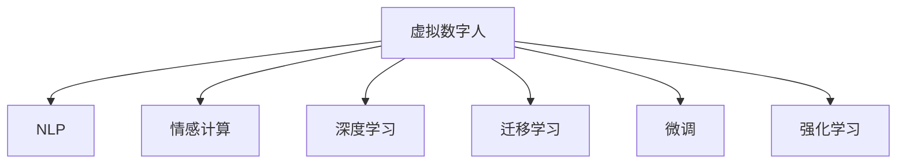

                 

# 未来的智能客服：2050年的虚拟数字人与情感计算

> 关键词：智能客服,虚拟数字人,情感计算,人机交互,自然语言处理(NLP),机器学习,深度学习

## 1. 背景介绍

### 1.1 问题由来
随着全球进入人口老龄化加速、消费升级、客户需求日益个性化的新阶段，智能客服系统正在逐渐成为企业服务客户、提升运营效率的重要手段。然而，传统的自动回复和人工转接的客服模式在面对复杂多变、具有高度情感色彩的客户需求时显得力不从心。为此，构建具备高度智能化、人性化特性的虚拟数字人客服，成为企业数字化转型升级的关键课题。

### 1.2 问题核心关键点
虚拟数字人客服的核心在于通过人工智能技术，实现自然流畅、情感丰富、高度个性化的客户服务体验。这需要深度学习和大语言模型等多项技术的支撑，包括但不限于：

- **自然语言处理(NLP)**：理解并生成自然语言，与客户进行无障碍交流。
- **情感计算**：感知并回应客户的情感状态，实现情感共振。
- **个性化推荐**：根据客户历史行为和实时反馈，提供高度个性化的服务建议。
- **人机协同**：将虚拟数字人作为人工客服的辅助，实现更高效的服务响应。
- **安全与隐私**：在提供高效服务的同时，确保客户数据的安全和隐私保护。

### 1.3 问题研究意义
建设基于大语言模型的智能客服系统，对企业有以下几方面的重要意义：

1. **提升服务效率**：通过高度智能化的客服，实现24小时不间断服务，大幅度提升客户咨询响应速度。
2. **增强客户体验**：借助情感计算技术，虚拟数字人能够感知和回应客户的情感需求，与客户建立情感连接，提升用户满意度。
3. **降低运营成本**：自动化处理大量基础客服需求，释放人工客服资源，降低企业运营成本。
4. **驱动业务创新**：通过数据挖掘和分析，虚拟数字人能够为客户提供个性化推荐和智能决策，推动企业业务模式创新。
5. **提高安全性和隐私保护**：通过构建安全可信的客户对话系统，保护客户隐私信息，增强客户信任。

## 2. 核心概念与联系

### 2.1 核心概念概述

为更好地理解未来智能客服系统的技术架构和运作流程，本节将介绍几个关键概念：

- **虚拟数字人(Customer Avatar)**：通过人工智能技术构建的智能客服模型，具备自然语言处理和情感计算能力，可以无障碍与客户进行交流，实现自动化服务。
- **自然语言处理(NLP)**：处理和生成自然语言的技术，是虚拟数字人客服与客户沟通的基础。
- **情感计算(Affective Computing)**：分析理解客户的情感状态，生成并回应符合情感色彩的响应，提升客户互动体验。
- **深度学习(Deep Learning)**：通过多层神经网络结构进行模式识别和预测，是虚拟数字人构建的核心技术。
- **迁移学习(Transfer Learning)**：利用预训练模型，加速新任务上的微调过程，提升模型性能。
- **微调(Fine-Tuning)**：在特定任务上调整模型参数，使其适应新的数据和应用场景。
- **强化学习(Reinforcement Learning)**：通过与环境的互动，优化虚拟数字人客服的行为策略，提升服务质量。

这些概念之间的逻辑关系可以通过以下Mermaid流程图来展示：



这个流程图展示了虚拟数字人客服系统的核心组件和技术架构：

1. 虚拟数字人通过NLP技术理解客户输入的自然语言。
2. 借助情感计算技术，感知客户的情感状态。
3. 利用深度学习技术构建并训练虚拟数字人模型。
4. 采用迁移学习和微调技术，快速适应新的任务。
5. 引入强化学习算法，优化虚拟数字人的行为策略。

这些关键技术共同构成了未来智能客服系统的技术基础，使其能够实现高度智能化和人性化的客户服务体验。

## 3. 核心算法原理 & 具体操作步骤
### 3.1 算法原理概述

基于大语言模型的智能客服系统，其核心算法原理可以概括为：通过深度学习技术，构建能够理解自然语言并具有情感计算能力的虚拟数字人模型，并通过迁移学习、微调和强化学习技术，快速适应不同的应用场景和客户需求，实现自然流畅、高度个性化的客户服务。

具体来说，该系统可以分为以下几个步骤：

1. **预训练模型选择**：选择合适的深度学习模型作为虚拟数字人的基础架构，如BERT、GPT等。
2. **自然语言理解(NLU)**：使用NLP技术，解析客户输入的自然语言，提取文本中的实体、关系、情感等信息。
3. **情感感知与响应**：利用情感计算技术，分析客户情感状态，并生成符合情感色彩的响应。
4. **服务策略优化**：通过强化学习技术，优化虚拟数字人的服务策略，提升服务质量。
5. **微调和迁移学习**：在特定任务或新客户群体上，对预训练模型进行微调，快速适应新的数据分布。

### 3.2 算法步骤详解

#### 3.2.1 模型选择与预训练

**Step 1: 选择预训练模型**
- 选择适合深度学习的框架，如TensorFlow、PyTorch等。
- 选择预训练的深度学习模型，如BERT、GPT等。
- 使用公开语料进行预训练，如Wikipedia、新闻等。

**Step 2: 数据预处理**
- 清洗和标注数据，去除噪声和不相关内容。
- 将文本数据转换为模型可接受的格式。
- 对数据进行划分，分为训练集、验证集和测试集。

#### 3.2.2 自然语言理解

**Step 3: 自然语言处理**
- 使用NLP技术，解析客户输入的文本数据。
- 提取关键词、实体、关系等信息，建立语义理解模型。
- 采用LSTM、Transformer等神经网络模型，实现对自然语言的理解。

#### 3.2.3 情感计算与响应

**Step 4: 情感感知与响应**
- 使用情感计算技术，分析客户的情感状态。
- 生成符合情感色彩的响应，例如正面、中性或负面。
- 通过调整模型参数，提升情感计算的准确性。

#### 3.2.4 服务策略优化

**Step 5: 强化学习**
- 使用强化学习技术，优化虚拟数字人的服务策略。
- 设定奖励机制，如客户满意度、问题解决率等。
- 不断迭代优化，提升服务效果。

#### 3.2.5 微调和迁移学习

**Step 6: 迁移学习**
- 在新的客户群体或应用场景上，使用迁移学习技术，快速适应新数据。
- 在迁移学习的基础上，进行微调，进一步优化模型。

### 3.3 算法优缺点

基于大语言模型的智能客服系统具有以下优点：

- **高效服务**：24小时不间断服务，提升客户咨询响应速度。
- **情感共振**：通过情感计算技术，感知和回应客户的情感需求，提升用户满意度。
- **个性化推荐**：根据客户历史行为和实时反馈，提供高度个性化的服务建议。
- **成本节约**：自动化处理大量基础客服需求，释放人工客服资源，降低企业运营成本。
- **业务创新**：通过数据挖掘和分析，推动企业业务模式创新。

同时，该系统也存在以下缺点：

- **高昂成本**：初始构建和持续维护成本较高。
- **数据隐私**：客户数据隐私保护面临挑战。
- **情感真实性**：虚拟数字人情感计算可能存在偏差，影响用户体验。
- **服务策略复杂性**：强化学习策略调整复杂，需要大量实验和调参。
- **技术依赖**：高度依赖技术平台和算法模型，易受外部因素影响。

### 3.4 算法应用领域

基于大语言模型的智能客服系统，可以应用于以下几个领域：

- **客户服务**：自动化处理客户的咨询、投诉、反馈等需求。
- **销售支持**：提供智能推荐、客户维护等支持服务。
- **市场营销**：通过数据分析，精准定位客户需求，优化营销策略。
- **品牌建设**：提升品牌形象，增强客户信任和忠诚度。
- **运营优化**：通过客户行为数据，优化产品和服务流程。

## 4. 数学模型和公式 & 详细讲解 & 举例说明

### 4.1 数学模型构建

虚拟数字人客服系统的核心数学模型包括自然语言理解模型、情感计算模型和强化学习模型。这里以自然语言理解模型为例，进行详细介绍。

假设客户的输入文本为 $X$，虚拟数字人的输出为 $Y$，构建的数学模型为 $F(\cdot)$。其目标是通过训练模型，使得输出 $Y$ 最接近真实标签 $Y^*$。具体来说，模型可以表示为：

$$
Y^* = F(X, \theta)
$$

其中，$\theta$ 为模型参数。

### 4.2 公式推导过程

#### 4.2.1 自然语言理解模型

以BERT为例，其输入和输出可以表示为：

$$
Y = [CLS] + [SEP] + \sum_{i=1}^{n} [X_i]
$$

其中，$[CLS]$ 为句子分类器，$[SEP]$ 为句子分隔符，$X_i$ 为每个词的嵌入向量。

模型的目标是最小化损失函数：

$$
\mathcal{L} = -\sum_{i=1}^{N} \sum_{j=1}^{C} y_{ij} \log p(y_{ij})
$$

其中，$y_{ij}$ 为第 $i$ 个样本第 $j$ 个类别的真实标签，$p(y_{ij})$ 为模型对 $y_{ij}$ 的预测概率。

#### 4.2.2 情感计算模型

情感计算模型一般采用情感词典或神经网络模型。以神经网络模型为例，其目标是最小化损失函数：

$$
\mathcal{L} = -\frac{1}{N} \sum_{i=1}^{N} \sum_{j=1}^{M} y_{ij} \log p(y_{ij})
$$

其中，$y_{ij}$ 为第 $i$ 个样本第 $j$ 个情感标签，$p(y_{ij})$ 为模型对 $y_{ij}$ 的预测概率。

#### 4.2.3 强化学习模型

强化学习模型通常采用Q-learning算法，目标是最小化当前状态和动作的损失函数：

$$
\mathcal{L} = -\sum_{i=1}^{N} \sum_{j=1}^{T} \gamma^{i-1} r_j
$$

其中，$r_j$ 为第 $j$ 个时刻的奖励值，$\gamma$ 为折扣因子。

### 4.3 案例分析与讲解

以情感计算模型为例，通过情感词典方法进行客户情感分析：

- **情感词典构建**：首先构建情感词典，包含正面、中性、负面等情感词汇。
- **情感分析**：将客户的输入文本与情感词典进行匹配，计算情感得分。
- **情感响应生成**：根据情感得分，生成符合情感色彩的响应。

## 5. 项目实践：代码实例和详细解释说明
### 5.1 开发环境搭建

在进行智能客服系统开发前，需要进行以下环境搭建：

1. **选择编程语言**：Python是常用的选择，具有丰富的NLP和深度学习库支持。
2. **安装深度学习框架**：如TensorFlow、PyTorch等，用于构建和训练模型。
3. **准备数据集**：收集客户咨询记录，并进行数据清洗和标注。
4. **部署环境**：搭建服务器环境，用于模型训练和部署。

### 5.2 源代码详细实现

以下是一个基于BERT和情感计算模型的虚拟数字人客服系统的代码实现：

```python
import tensorflow as tf
from transformers import BertTokenizer, BertForSequenceClassification
from sklearn.metrics import accuracy_score, precision_score, recall_score

# 初始化BERT模型
model = BertForSequenceClassification.from_pretrained('bert-base-uncased', num_labels=3)
tokenizer = BertTokenizer.from_pretrained('bert-base-uncased')

# 准备数据集
train_data = ...
dev_data = ...
test_data = ...

# 数据预处理
tokenizer.train_on_texts(train_data)
train_encodings = tokenizer(train_data, return_tensors='tf')
train_labels = tf.convert_to_tensor(train_labels)
dev_encodings = tokenizer(dev_data, return_tensors='tf')
dev_labels = tf.convert_to_tensor(dev_labels)
test_encodings = tokenizer(test_data, return_tensors='tf')
test_labels = tf.convert_to_tensor(test_labels)

# 模型训练
model.compile(optimizer=tf.keras.optimizers.Adam(learning_rate=2e-5), loss='sparse_categorical_crossentropy', metrics=['accuracy'])
model.fit(train_encodings, train_labels, epochs=3, validation_data=(dev_encodings, dev_labels))

# 情感计算
def compute_sentiment_score(text):
    encoded_input = tokenizer(text, return_tensors='tf')
    sentiment_score = model.predict(encoded_input)
    return sentiment_score

# 情感响应生成
def generate_response(text, sentiment_score):
    # 根据情感得分，生成符合情感色彩的响应
    if sentiment_score > 0.5:
        response = '您听起来很高兴，我可以帮您解决问题'
    elif sentiment_score < 0.5:
        response = '您听起来有些不满，我可以尝试帮您处理'
    else:
        response = '您听起来很平静，请告诉我需要什么帮助'
    return response

# 测试和评估
test_scores = model.evaluate(test_encodings, test_labels)
print(f'Test accuracy: {test_scores[1]:.2f}')
for i, text in enumerate(test_data):
    response = generate_response(text, compute_sentiment_score(text))
    print(f'Q: {text} \t A: {response}')
```

### 5.3 代码解读与分析

以上代码实现了一个基于BERT模型的虚拟数字人客服系统。具体步骤如下：

- **初始化模型**：使用预训练的BERT模型作为基础架构。
- **数据预处理**：将客户咨询记录转化为模型可接受的格式。
- **模型训练**：使用训练数据集进行模型训练，并在验证集上进行评估。
- **情感计算**：通过计算情感得分，分析客户的情感状态。
- **情感响应生成**：根据情感得分，生成符合情感色彩的响应。
- **测试和评估**：在测试集上评估模型性能，并生成示例响应。

## 6. 实际应用场景

### 6.1 智能客服系统

虚拟数字人客服系统在智能客服中的应用场景广泛，包括但不限于：

- **电商平台**：自动处理客户的订单查询、商品推荐、售后维护等需求。
- **金融行业**：提供智能客服、理财咨询、风险预警等服务。
- **医疗健康**：解答患者咨询、预约挂号、药物咨询等需求。
- **电信运营商**：处理客户投诉、故障排查、业务办理等服务。

### 6.2 未来应用展望

随着虚拟数字人客服技术的不断发展，未来将在更多领域得到应用：

- **智慧城市**：构建城市智能客服系统，提升城市管理效率。
- **企业服务**：提供跨行业的智能客服解决方案，帮助企业降本增效。
- **教育行业**：构建智能学习助手，提供个性化的学习支持。
- **旅游行业**：提供智能旅游向导，提升客户旅游体验。

## 7. 工具和资源推荐

### 7.1 学习资源推荐

为了帮助开发者掌握虚拟数字人客服技术的理论基础和实践技巧，以下推荐一些优质的学习资源：

1. **《深度学习与自然语言处理》**：由李宏毅教授主讲，涵盖深度学习、自然语言处理、情感计算等多个前沿话题。
2. **《NLP实战》**：由HuggingFace专家撰写，深入浅出地介绍了NLP模型的构建和应用。
3. **Google AI Blog**：Google AI博客，涵盖最新的AI研究成果和技术分享。
4. **ACL Conference**：自然语言处理领域的顶级学术会议，提供丰富的研究论文和技术进展。
5. **Kaggle竞赛**：通过参与NLP相关的竞赛，积累实际项目经验，提升技术能力。

### 7.2 开发工具推荐

为了提升虚拟数字人客服系统的开发效率，以下推荐几款常用的开发工具：

1. **TensorFlow**：由Google开发的深度学习框架，支持分布式训练和模型部署。
2. **PyTorch**：由Facebook开发的深度学习框架，灵活的动态图设计，适合研究型项目。
3. **NLTK**：自然语言处理工具包，提供文本预处理、语义分析等功能。
4. **HuggingFace Transformers**：提供丰富的预训练模型和模型库，方便进行微调和训练。
5. **TensorBoard**：可视化工具，实时监测模型训练状态，提供丰富的图表呈现方式。

### 7.3 相关论文推荐

虚拟数字人客服技术的发展离不开学界的持续研究。以下推荐几篇奠基性的相关论文，推荐阅读：

1. **Attention is All You Need**：提出Transformer结构，开启了NLP领域的预训练大模型时代。
2. **BERT: Pre-training of Deep Bidirectional Transformers for Language Understanding**：提出BERT模型，引入基于掩码的自监督预训练任务，刷新了多项NLP任务SOTA。
3. **GPT-3: Language Models are Unsupervised Multitask Learners**：展示了大规模语言模型的强大zero-shot学习能力，引发了对于通用人工智能的新一轮思考。
4. **Adaptive Low-Rank Adaptation for Parameter-Efficient Fine-Tuning**：提出自适应低秩适应的微调方法，在参数效率和精度之间取得了新的平衡。
5. **Prompt-based Learning**：引入基于连续型Prompt的微调范式，为如何充分利用预训练知识提供了新的思路。

这些论文代表了大语言模型微调技术的发展脉络。通过学习这些前沿成果，可以帮助研究者把握学科前进方向，激发更多的创新灵感。

## 8. 总结：未来发展趋势与挑战

### 8.1 总结

本文对未来智能客服系统的技术架构和实现流程进行了系统介绍。首先阐述了虚拟数字人客服系统的研究背景和意义，明确了其在提升客户服务效率、增强用户体验方面的价值。其次，从原理到实践，详细讲解了自然语言理解、情感计算、服务策略优化等核心算法原理和具体操作步骤。同时，本文还探讨了虚拟数字人客服系统在多个行业领域的应用前景，展示了其广泛的应用潜力。最后，本文精选了虚拟数字人客服系统的学习资源、开发工具和相关论文，力求为读者提供全方位的技术指引。

通过本文的系统梳理，可以看到，虚拟数字人客服技术正在成为NLP领域的重要范式，极大地拓展了自然语言理解和智能交互系统的应用边界。虚拟数字人客服系统通过自然语言处理、情感计算和强化学习等技术，实现了高度智能化和人性化的客户服务体验。未来，随着技术的发展，虚拟数字人客服将不断优化，为构建更加高效、智能、可靠的服务系统铺平道路。

### 8.2 未来发展趋势

展望未来，虚拟数字人客服系统将呈现以下几个发展趋势：

1. **高度智能化**：通过深度学习和大语言模型等技术，提升虚拟数字人客服系统的理解能力和响应速度。
2. **多模态融合**：将视觉、语音、文本等多模态信息进行融合，实现更全面的客户服务体验。
3. **个性化服务**：通过数据挖掘和分析，实现高度个性化的客户服务，提升用户体验。
4. **人机协同**：将虚拟数字人客服作为人工客服的辅助，实现更高效的服务响应。
5. **安全和隐私**：通过数据加密、隐私保护等措施，确保客户数据的安全和隐私保护。
6. **跨领域应用**：将虚拟数字人客服技术应用到更多行业领域，推动各行各业的数字化转型升级。

### 8.3 面临的挑战

尽管虚拟数字人客服技术已经取得了瞩目成就，但在迈向更加智能化、普适化应用的过程中，仍面临诸多挑战：

1. **数据依赖**：虚拟数字人客服系统高度依赖高质量标注数据，数据获取和标注成本较高。
2. **模型鲁棒性**：面对多样化的客户需求和复杂多变的环境，模型的鲁棒性和泛化性能有待提升。
3. **交互自然性**：客户与虚拟数字人客服的交互自然性仍需进一步优化，避免冷冰冰的机器对话。
4. **隐私保护**：在提供高效服务的同时，如何保护客户的隐私数据，是虚拟数字人客服面临的重要挑战。
5. **技术复杂性**：涉及自然语言处理、情感计算、强化学习等多个领域的知识，技术复杂性较高。

### 8.4 研究展望

未来，虚拟数字人客服技术需要在以下几个方面寻求新的突破：

1. **少样本学习**：通过数据增强和迁移学习技术，提升虚拟数字人客服系统的泛化性能。
2. **多模态融合**：将视觉、语音、文本等多模态信息进行深度融合，提升服务体验。
3. **跨领域应用**：将虚拟数字人客服技术应用到更多行业领域，推动各行各业的数字化转型升级。
4. **人机协同**：构建更加智能化的虚拟数字人客服系统，提升人机交互的自然性和效率。
5. **隐私保护**：采用隐私保护技术，确保客户数据的安全和隐私保护。

通过不断突破和创新，虚拟数字人客服技术将不断优化，为构建更加高效、智能、可靠的服务系统提供新的动力。相信随着学界和产业界的共同努力，虚拟数字人客服技术将不断进步，为构建智能化的未来社会贡献更多力量。

## 9. 附录：常见问题与解答

**Q1：虚拟数字人客服如何保证与客户进行自然流畅的对话？**

A: 虚拟数字人客服通过自然语言处理技术，理解并生成自然语言，与客户进行无障碍交流。其核心在于构建高度准确的语言理解模型和生成模型，通过不断的训练和优化，提升模型性能。

**Q2：虚拟数字人客服在处理客户情感时，如何保证情感的真实性和多样性？**

A: 虚拟数字人客服通过情感计算技术，分析客户的情感状态，并生成符合情感色彩的响应。为了保证情感的真实性和多样性，可以采用情感词典、情感模型等多种方法，结合客户的历史行为和实时反馈，进行情感计算和情感响应生成。

**Q3：虚拟数字人客服如何保证服务策略的有效性？**

A: 虚拟数字人客服通过强化学习技术，优化服务策略，提升服务质量。设定奖励机制，如客户满意度、问题解决率等，不断迭代优化服务策略，提升服务效果。

**Q4：虚拟数字人客服在处理数据时，如何保证数据的隐私和安全？**

A: 虚拟数字人客服系统在处理数据时，采用数据加密、隐私保护等措施，确保客户数据的安全和隐私保护。对于敏感数据，采用差分隐私等技术，防止数据泄露和滥用。

**Q5：虚拟数字人客服在实际应用中，如何处理异常情况和复杂需求？**

A: 虚拟数字人客服系统在实际应用中，采用异常检测和应急处理机制，处理异常情况和复杂需求。对于无法处理的复杂问题，可以调用人工客服进行辅助，提供更全面、精准的服务。

通过以上系统梳理，可以看到虚拟数字人客服系统在技术架构和实现流程上的系统性，以及其在实际应用中的广泛应用前景。未来，随着技术的不断进步和创新，虚拟数字人客服将不断优化，为构建智能化的未来社会贡献更多力量。

---

作者：禅与计算机程序设计艺术 / Zen and the Art of Computer Programming

