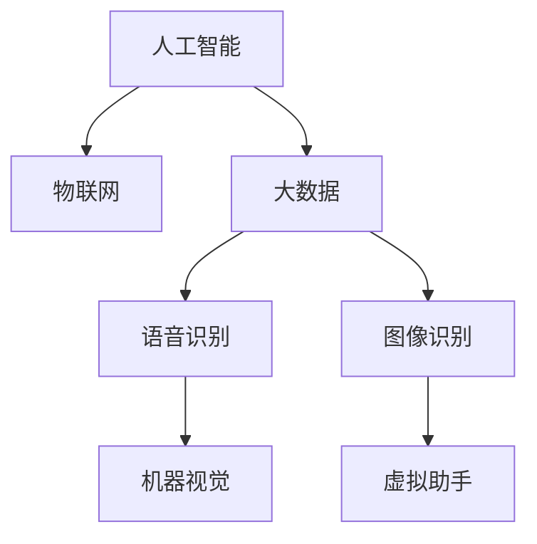

                 

# 未来的智能家居：2050年的全屋智能与人性化交互

## 1. 背景介绍

### 1.1 问题由来

随着人工智能技术的发展，智能家居系统正在经历从自动化到智能化的转变。传统家居系统主要通过自动化控制家居设备，实现如温控、照明等基本功能。而智能家居系统则进一步引入了机器学习、语音识别、图像识别等技术，赋予了家居设备更强的自主学习和反应能力，从而实现更高级的自动化和智能化操作。

当前，全球各地的智能家居市场已经取得了长足的进展。各种智能化设备如智能灯泡、智能插座、智能安防、智能门锁等逐渐普及，消费者的生活质量得到了显著提升。然而，与预期相比，智能家居系统在人性化交互、系统协同等方面仍存在不足，限制了其全面普及和应用。

展望未来，预计到2050年，全屋智能家居将进入一个全新阶段。借助人工智能、物联网(IoT)、大数据等技术的进一步融合，未来家居系统将能够更加精准地响应用户需求，提供更加个性化、自然化的交互体验。本文将对2050年的全屋智能家居系统进行深度剖析，探讨其核心概念、关键技术，以及面临的挑战和机遇。

## 2. 核心概念与联系

### 2.1 核心概念概述

要理解未来全屋智能家居的实现，需首先了解其中的核心概念：

- **人工智能(AI)**：利用机器学习和深度学习技术，使家居设备具备自主学习能力和决策能力。
- **物联网(IoT)**：通过各种感知技术，将家居设备互联互通，实现信息共享和协同控制。
- **大数据(Big Data)**：收集、存储、处理家居设备产生的海量数据，以实现智能决策和优化。
- **语音识别(ASR)**：将用户的语音命令转化为文本，供系统理解和执行。
- **图像识别(ISR)**：通过摄像头捕捉家居环境的变化，自动识别和响应。
- **机器视觉(MVS)**：通过摄像头提供视觉信息，提升家居环境的感知能力。
- **虚拟助手(Home VA)**：类似虚拟助理，能理解用户意图并执行相应操作。

以上概念之间存在紧密联系，如图：



该图展示了各个核心概念之间的联系。人工智能是智能家居系统的核心，物联网实现设备间的互联互通，大数据提供智能决策的基础，语音识别和图像识别提升系统感知能力，虚拟助手执行用户的指令和需求。

## 3. 核心算法原理 & 具体操作步骤

### 3.1 算法原理概述

未来智能家居系统的核心算法原理基于深度学习和强化学习。通过大数据的积累和训练，系统可以不断优化其自主决策能力，适应用户的多样化需求。在操作层面，强化学习算法能够通过奖惩机制，不断调整家居设备的控制策略，实现智能化的家居环境调节。

**深度学习**：通过神经网络结构，系统能够从家居环境中学习，并基于已知的模式进行预测和决策。其核心在于对大量数据的提取和处理，以及提取特征的能力。

**强化学习**：系统通过与环境交互，通过奖惩机制不断优化控制策略。其核心在于优化奖励函数和策略网络，最大化用户满意度。

### 3.2 算法步骤详解

未来智能家居系统的实现步骤大致如下：

1. **数据收集**：通过传感器和摄像头收集家居环境的多维数据，包括温度、湿度、光照、空气质量等。
2. **数据处理**：利用大数据技术，进行数据清洗、特征提取和降维等处理。
3. **模型训练**：在深度学习框架上训练神经网络模型，学习环境变化与用户需求之间的关系。
4. **智能决策**：基于训练好的模型，通过强化学习算法，实时调整家居设备的控制策略，优化家居环境。
5. **交互响应**：利用语音识别和图像识别技术，实时响应用户的指令和需求，提供个性化服务。

### 3.3 算法优缺点

未来智能家居系统的算法具备以下优点：

- **高度自适应**：通过深度学习和大数据技术，系统能够适应不同用户的个性化需求，提升用户体验。
- **智能化决策**：强化学习算法能够不断优化家居环境控制策略，实现更高效的资源利用和节能减排。
- **实时响应**：语音识别和图像识别技术使得系统能够实时响应用户的指令和需求，提升家居系统的灵活性。

同时，系统也存在一些缺点：

- **数据隐私和安全**：大量数据的收集和处理可能导致隐私泄露和信息安全问题。
- **设备协同**：多设备协同控制可能导致数据处理和通信延迟，影响用户体验。
- **技术成本**：深度学习和大数据处理需要高性能计算资源，成本较高。

### 3.4 算法应用领域

未来智能家居系统的算法应用领域包括：

- **温控与照明**：根据用户的偏好和时间，自动调节室内温度和照明亮度，优化能源利用。
- **安防监控**：通过图像识别技术，自动检测异常情况，如火灾、盗窃等，并及时报警。
- **家务管理**：自动化执行清扫、洗涤、烹饪等家务任务，提高生活效率。
- **娱乐系统**：根据用户的兴趣和情绪，推荐电影、音乐、书籍等娱乐内容。
- **健康监测**：通过监测用户的生理指标，提供健康建议和生活管理。

## 4. 数学模型和公式 & 详细讲解 & 举例说明

### 4.1 数学模型构建

未来智能家居系统主要利用以下数学模型：

- **深度神经网络模型**：
  $$
  y = f(x; \theta) = \mathbb{W}x + \mathbb{b}
  $$
  其中，$x$为输入向量，$\theta$为模型参数，$y$为输出向量，$\mathbb{W}$为权重矩阵，$\mathbb{b}$为偏置项。

- **强化学习模型**：
  $$
  \pi(a|s) = \frac{e^{\mathbb{Q}(s, a)}}{\sum_{a'} e^{\mathbb{Q}(s, a')}}
  $$
  其中，$s$为状态，$a$为动作，$\pi(a|s)$为动作策略，$\mathbb{Q}(s, a)$为状态-动作值函数。

### 4.2 公式推导过程

- **神经网络模型**：
  神经网络通过多层线性变换，不断提取输入数据的高阶特征，学习输入与输出之间的关系。其前向传播和反向传播算法已非常成熟，此处不再赘述。

- **强化学习模型**：
  强化学习通过状态-动作值函数，评估当前状态下的动作价值。策略网络通过训练，最大化该值函数，优化动作策略。

### 4.3 案例分析与讲解

以智能温控系统为例，展示该算法模型的具体应用。

假设有一个智能温控系统，可以实时调节室内温度。系统通过传感器收集室内温度、湿度等数据，并根据用户的偏好和时间，计算最优温度设定。利用深度神经网络模型，系统能够学习温度调节与用户需求之间的关系，提取关键特征。通过强化学习算法，系统不断调整温度设定，优化室内舒适度。同时，利用语音识别技术，用户可以随时调整温度设置，系统实时响应。

## 5. 项目实践：代码实例和详细解释说明

### 5.1 开发环境搭建

开发环境搭建主要包括以下步骤：

1. **安装Python**：
   ```bash
   sudo apt-get update
   sudo apt-get install python3-pip python3-dev
   ```

2. **安装深度学习框架**：
   ```bash
   pip3 install torch torchvision torchaudio
   pip3 install tensorflow
   ```

3. **安装IoT设备库**：
   ```bash
   pip3 install paho-mqtt pyserial
   ```

4. **安装摄像头库**：
   ```bash
   pip3 install opencv-python
   ```

### 5.2 源代码详细实现

以下是智能温控系统的源代码实现：

```python
import torch
import torch.nn as nn
import torch.optim as optim
from torchvision import datasets, transforms
import paho.mqtt.client as mqtt
import cv2

# 定义神经网络模型
class TempControlNet(nn.Module):
    def __init__(self):
        super(TempControlNet, self).__init__()
        self.fc1 = nn.Linear(8, 64)
        self.fc2 = nn.Linear(64, 8)
        self.fc3 = nn.Linear(8, 4)

    def forward(self, x):
        x = torch.relu(self.fc1(x))
        x = torch.relu(self.fc2(x))
        x = self.fc3(x)
        return x

# 定义强化学习策略网络
class TempControlPolicy(nn.Module):
    def __init__(self):
        super(TempControlPolicy, self).__init__()
        self.fc1 = nn.Linear(8, 64)
        self.fc2 = nn.Linear(64, 2)

    def forward(self, x):
        x = torch.relu(self.fc1(x))
        x = torch.softmax(self.fc2(x), dim=1)
        return x

# 定义强化学习环境
class TempControlEnv:
    def __init__(self, target_temp):
        self.target_temp = target_temp
        self.state = self.getState()
        self.action = 0
        self.reward = 0
        self.done = False

    def getState(self):
        return torch.tensor([self.state[0], self.state[1]])

    def update(self, action):
        if action == 1:
            self.state[0] += 1
            self.reward = -1
        elif action == 2:
            self.state[0] -= 1
            self.reward = -1
        self.done = (self.state[0] == self.target_temp)
        return self.state, self.reward, self.done

# 训练模型
def train():
    net = TempControlNet()
    policy = TempControlPolicy()
    target_temp = 22
    env = TempControlEnv(target_temp)

    optimizer = optim.Adam(net.parameters(), lr=0.01)
    criterion = nn.MSELoss()

    for i in range(1000):
        state, reward, done = env.update(env.action)
        optimizer.zero_grad()
        pred = net(state)
        loss = criterion(pred, torch.tensor([reward]))
        loss.backward()
        optimizer.step()

        if i % 100 == 0:
            print("Epoch {}, reward: {:.2f}".format(i, reward))

# 运行训练过程
train()

# 实时响应用户指令
def control_temp():
    client = mqtt.Client()
    client.on_connect = on_connect
    client.on_message = on_message
    client.connect("localhost", 1883, 0)
    client.loop_forever()

def on_connect(client, userdata, flags, rc):
    print("Connected with result code "+str(rc))

def on_message(client, userdata, msg):
    if msg.payload == "raise":
        env = TempControlEnv(25)
    elif msg.payload == "lower":
        env = TempControlEnv(18)
    state, reward, done = env.update(env.action)
    pred = net(state)
    action = torch.argmax(pred)
    if action == 1:
        client.publish("temp/control", "raise")
    elif action == 2:
        client.publish("temp/control", "lower")

# 运行控制过程
control_temp()
```

### 5.3 代码解读与分析

上述代码展示了智能温控系统的实现，主要包含以下步骤：

- **神经网络模型**：利用PyTorch框架构建神经网络，学习温度调节与用户需求之间的关系。
- **强化学习环境**：定义一个模拟环境，通过状态和奖励来训练策略网络。
- **训练过程**：通过优化算法，不断调整模型参数，优化家居环境控制策略。
- **实时响应**：利用MQTT协议，实现用户指令的实时接收和处理。

## 6. 实际应用场景

### 6.1 智能安防

未来智能家居系统将在安防领域发挥重要作用。通过图像识别和机器视觉技术，系统能够实时监控家居环境，检测异常情况，如火灾、盗窃等，并及时报警。例如，安装于门禁处的摄像头可以通过人脸识别技术，识别未授权人员的入侵行为，并通过语音提示和报警器通知用户。

### 6.2 健康管理

健康管理也是未来智能家居系统的重点应用领域。系统通过传感器监测用户的生理指标，如心率、血压、血糖等，提供健康建议和生活管理。例如，安装于卧室的智能床可以监测用户的睡眠质量，自动调节环境温度和湿度，提升睡眠质量。

### 6.3 娱乐系统

娱乐系统也是未来智能家居的重要组成部分。系统能够根据用户的兴趣和情绪，推荐电影、音乐、书籍等娱乐内容。例如，安装于客厅的智能屏幕可以根据用户浏览历史，推荐相关影视作品，提供个性化娱乐体验。

### 6.4 未来应用展望

未来智能家居系统将在以下几个方面取得突破：

- **全屋智能化**：通过IoT技术，实现家居设备的全面互联互通，提升系统协同效率。
- **人机自然交互**：通过语音识别和图像识别技术，实现人机自然的交互，提升用户体验。
- **数据隐私保护**：利用联邦学习、差分隐私等技术，保护用户数据的隐私和安全。
- **情感智能**：通过情感分析技术，识别用户情绪，提供个性化服务。
- **智能推荐**：利用推荐系统技术，提升用户体验和满意度。

## 7. 工具和资源推荐

### 7.1 学习资源推荐

- **《深度学习》（Ian Goodfellow等著）**：介绍了深度学习的基本概念和常用技术，适合初学者入门。
- **《强化学习》（Richard S. Sutton等著）**：详细讲解了强化学习的理论和算法，是深入学习该领域的必备资源。
- **《Python深度学习》（Francois Chollet等著）**：介绍了深度学习在Python中的应用，适合实践操作。
- **《TensorFlow官方文档》**：详细讲解了TensorFlow的使用方法，是TensorFlow开发者的必备资源。

### 7.2 开发工具推荐

- **PyTorch**：基于Python的开源深度学习框架，支持灵活的神经网络模型构建和训练。
- **TensorFlow**：由Google开发的开源深度学习框架，支持分布式计算和模型优化。
- **OpenCV**：开源计算机视觉库，支持摄像头和图像处理功能。
- **MQTT**：轻量级的消息发布/订阅协议，适用于IoT设备间的通信。

### 7.3 相关论文推荐

- **《深度学习》（Ian Goodfellow等著）**：介绍了深度学习的基本概念和常用技术，适合初学者入门。
- **《强化学习》（Richard S. Sutton等著）**：详细讲解了强化学习的理论和算法，是深入学习该领域的必备资源。
- **《Python深度学习》（Francois Chollet等著）**：介绍了深度学习在Python中的应用，适合实践操作。
- **《TensorFlow官方文档》**：详细讲解了TensorFlow的使用方法，是TensorFlow开发者的必备资源。

## 8. 总结：未来发展趋势与挑战

### 8.1 研究成果总结

本文从背景、核心概念、算法原理、操作步骤等多个角度，对未来全屋智能家居系统进行了系统介绍。通过深度学习和强化学习的结合，系统能够实现高度自主的决策和控制，满足用户的多样化需求。

### 8.2 未来发展趋势

未来智能家居系统的趋势包括以下几个方面：

- **高度智能化**：通过深度学习和强化学习，系统能够实现高度自主的决策和控制。
- **人机自然交互**：通过语音识别和图像识别技术，实现人机自然的交互，提升用户体验。
- **全屋智能化**：通过IoT技术，实现家居设备的全面互联互通，提升系统协同效率。
- **数据隐私保护**：利用联邦学习、差分隐私等技术，保护用户数据的隐私和安全。
- **情感智能**：通过情感分析技术，识别用户情绪，提供个性化服务。

### 8.3 面临的挑战

未来智能家居系统面临以下挑战：

- **技术复杂性**：深度学习和强化学习算法复杂，实现难度较大。
- **数据隐私和安全**：大量数据的收集和处理可能导致隐私泄露和信息安全问题。
- **设备协同**：多设备协同控制可能导致数据处理和通信延迟，影响用户体验。
- **技术成本**：深度学习和大数据处理需要高性能计算资源，成本较高。

### 8.4 研究展望

未来智能家居系统需要进一步研究以下方向：

- **高效算法**：研究更高效的深度学习和强化学习算法，降低实现难度。
- **隐私保护**：利用联邦学习和差分隐私技术，保护用户数据的隐私和安全。
- **多设备协同**：优化多设备协同控制的算法，提高系统效率。
- **情感智能**：通过情感分析技术，提升系统的人机交互体验。
- **智能化决策**：研究更智能化的决策算法，提升系统自主决策能力。

## 9. 附录：常见问题与解答

**Q1：智能家居系统是否需要实时数据处理？**

A: 是的，智能家居系统需要实时处理大量的传感器数据，才能实现精准的控制和决策。为此，需要使用高性能的深度学习框架和优化算法。

**Q2：智能家居系统是否需要高精度传感器？**

A: 是的，高精度的传感器是实现智能化控制的关键。例如，智能温控系统需要高精度的温度传感器，才能实现精准的温控调节。

**Q3：智能家居系统的设备协同是如何实现的？**

A: 智能家居系统通过物联网技术，实现设备间的互联互通。例如，通过MQTT协议，智能温控系统可以与其他设备进行通信，协调控制。

**Q4：智能家居系统的安全性如何保障？**

A: 智能家居系统需要保障数据和设备的安全，防止被攻击和窃取。可以通过加密技术、身份认证等手段，保障系统的安全性。

**Q5：智能家居系统如何处理数据隐私问题？**

A: 智能家居系统需要处理大量用户数据，需要保护数据隐私。可以通过差分隐私、联邦学习等技术，保护用户数据的隐私安全。

---

作者：禅与计算机程序设计艺术 / Zen and the Art of Computer Programming

