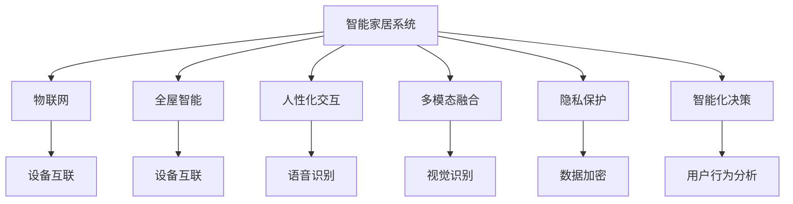

                 

# 未来的智能家居：2050年的全屋智能与人性化交互

## 1. 背景介绍

### 1.1 问题由来
随着科技的迅猛发展，智能家居系统已逐渐从科幻小说走向现实生活。从2014年亚马逊推出Echo智能音箱，到2020年谷歌Pixel 4的Pixel Key应用解锁，再到2021年苹果发布M1芯片，这些先进技术都在逐步推动着智能家居的发展。然而，当前智能家居系统仍存在不少挑战，如设备之间互联互通难、用户操作复杂、数据隐私安全等问题。如何构建一个更为智能、便捷、人性化的全屋智能家居系统，成为摆在科技从业者面前的重要课题。

### 1.2 问题核心关键点
未来智能家居的核心在于实现“全屋智能”和“人性化交互”。全屋智能意味着将家庭中的各类设备、系统通过互联网无缝连接，实现高度集成和智能化。人性化交互则关注用户与智能家居系统的自然交流，简化用户操作，提升用户体验。

要实现上述目标，需要整合各类智能技术，如物联网(IoT)、人工智能(AI)、增强现实(AR)、虚拟现实(VR)、语音识别、手势控制等。这些技术的有机融合，将推动智能家居系统迈向更高的智能化水平。

### 1.3 问题研究意义
研究未来的智能家居系统，对于提升家庭生活质量、推动智能城市建设、促进科技与产业融合、构建新型生活方式具有重要意义：

1. 提升生活质量。通过智能化、自动化、个性化设计，为家庭成员提供更舒适、便捷、健康的生活环境。
2. 推动智能城市建设。智能家居作为智能城市的基础单元，将推动城市管理水平的提升和治理模式的创新。
3. 促进科技与产业融合。智能家居系统将各类科技前沿技术与生活实际相结合，推动相关产业的健康发展。
4. 构建新型生活方式。智能家居系统将彻底改变人们的生活方式，使生活更加方便、安全、环保。
5. 增强用户体验。通过人性化的设计，提升用户的操作体验，提升用户的满意度和忠诚度。

## 2. 核心概念与联系

### 2.1 核心概念概述

为更好地理解未来智能家居系统的设计和实现，本节将介绍几个关键概念：

- **智能家居系统**：通过物联网技术将家庭内的各类设备（如空调、灯光、安防等）连接起来，实现智能化控制。
- **全屋智能**：将家庭内的所有设备、系统通过互联网实现无缝连接和信息共享，实现高度集成和智能化。
- **人性化交互**：通过语音识别、手势控制、视觉识别等技术，实现用户与智能家居系统的自然交流，简化用户操作，提升用户体验。
- **多模态融合**：将语音、图像、文本、手势等多种交互方式融合，提高系统的可扩展性和鲁棒性。
- **隐私保护**：在数据收集、存储、传输、处理等环节，确保用户的隐私安全，避免数据滥用。
- **智能化决策**：基于用户行为数据分析，实现智能化决策和个性化推荐，提升系统智能水平。

这些概念共同构成了未来智能家居系统的基础框架，使得家庭生活更加便捷、高效、安全。

### 2.2 核心概念原理和架构的 Mermaid 流程图



这个流程图展示了一个典型的智能家居系统架构，包括物联网连接、全屋智能集成、人性化交互设计、多模态融合、隐私保护和智能化决策。

## 3. 核心算法原理 & 具体操作步骤
### 3.1 算法原理概述

未来的智能家居系统将基于AI技术实现全屋智能和人性化交互。核心算法原理主要包括以下几个方面：

- **自然语言处理(NLP)**：用于实现语音识别、自然语言理解、自然语言生成等功能，使系统能够理解和回应用户的自然语言指令。
- **计算机视觉(CV)**：用于实现图像识别、人脸识别、手势识别等功能，使系统能够理解和响应用户的视觉输入。
- **机器学习(ML)**：用于实现系统学习和个性化推荐，提升系统的智能化水平。
- **强化学习(RL)**：用于实现智能化决策和控制，使系统能够根据环境变化自动调整策略。
- **大数据技术**：用于收集、存储、分析和应用各类数据，提升系统的智能决策能力。

这些技术共同构成了未来智能家居系统的核心算法框架，实现了全屋智能和人性化交互。

### 3.2 算法步骤详解

构建未来智能家居系统的算法步骤主要包括以下几个方面：

**Step 1: 设计系统架构**
- 确定系统需要支持的设备类型和功能模块，设计设备的通信协议和接口标准。
- 定义系统的数据模型和存储架构，实现数据的集中管理和共享。
- 设计系统的智能决策框架，实现基于用户行为和环境数据的智能化决策。

**Step 2: 数据采集与预处理**
- 实现各类传感器的数据采集，如温度、湿度、光线、声音等。
- 进行数据清洗和预处理，确保数据的准确性和一致性。
- 进行数据加密和存储，确保数据隐私和安全。

**Step 3: 设备互联与通信**
- 实现各类设备的互联互通，采用标准化的通信协议和接口。
- 设计设备间的互操作性，确保系统的稳定性和可靠性。
- 实现设备的远程控制和监控，确保系统的实时性和便捷性。

**Step 4: 智能决策与控制**
- 设计基于用户行为和环境数据的智能决策算法，实现系统的自适应和自动化。
- 实现基于环境数据和设备状态的智能化控制，提升系统的智能水平。
- 实现基于用户反馈和历史数据的个性化推荐，提升系统的用户体验。

**Step 5: 人机交互设计**
- 设计人性化的用户界面，提供简洁、直观的操作方式。
- 实现自然语言处理、语音识别、视觉识别等功能，简化用户操作。
- 实现多模态融合，提供多样化的交互方式，提升系统的可扩展性和鲁棒性。

**Step 6: 系统测试与优化**
- 对系统进行全面测试，确保系统的稳定性和可靠性。
- 根据用户反馈和系统运行数据，进行持续优化和改进。
- 实现系统的迭代更新和升级，提升系统的智能化水平。

### 3.3 算法优缺点

未来智能家居系统具备以下优点：

- 便捷高效。通过智能化和自动化设计，极大提升了家庭生活的便捷性和效率。
- 个性化体验。基于用户行为数据分析，实现个性化推荐和智能决策，提升用户体验。
- 安全性高。采用先进的数据加密和隐私保护技术，确保用户隐私安全。
- 智能决策。基于环境数据和用户行为数据，实现智能化决策和控制，提升系统智能化水平。

然而，系统也存在一些缺点：

- 技术复杂度高。需要整合各类先进技术，实现设备的高度集成和智能化。
- 数据安全风险。大量的数据采集和存储，存在隐私泄露和数据滥用的风险。
- 设备互联难度大。不同设备之间的互操作性，需要标准化的接口和协议。
- 用户接受度低。传统的家居生活方式需要被颠覆，用户需要适应新的操作方式。
- 成本高昂。系统的研发和部署需要大量的资金投入，难以大规模普及。

### 3.4 算法应用领域

未来智能家居系统在以下几个领域具有广泛应用前景：

- **智慧安防**：通过图像识别、语音识别等技术，实现智能安防监控、报警、应急响应等功能。
- **智能家居控制**：通过智能设备互联和智能化决策，实现家庭设备的自动化控制和节能环保。
- **健康监测**：通过各类传感器和数据分析，实现健康状况监测、疾病预警、医疗咨询等功能。
- **娱乐休闲**：通过AR、VR、AI等技术，实现家庭娱乐、游戏、教育等功能。
- **家居管理**：通过数据分析和智能化决策，实现家居设备的智能管理和优化。
- **能源管理**：通过智能能源控制和优化，实现家庭能源的高效利用和环保节能。

这些应用领域展示了未来智能家居系统的广泛前景，为未来家庭生活带来了巨大的便利和提升。

## 4. 数学模型和公式 & 详细讲解 & 举例说明

### 4.1 数学模型构建

未来的智能家居系统涉及多种技术和算法，其数学模型构建较为复杂。下面以智能安防系统为例，给出其数学模型构建的总体框架：

- **输入**：各类传感器的数据，如温度、湿度、光线、声音等。
- **处理**：通过传感器数据预处理、特征提取等技术，得到有效的输入特征。
- **模型**：基于深度学习模型（如卷积神经网络CNN、循环神经网络RNN、Transformer等）进行数据建模和处理。
- **输出**：系统的决策结果，如识别结果、报警信号、控制指令等。

### 4.2 公式推导过程

以智能安防系统为例，假设有n个摄像头，每个摄像头每秒采集一张图片。设第i个摄像头采集的一张图片为 $x_i$，对应的标签为 $y_i$。设模型的输入为 $x=[x_1,x_2,\dots,x_n]$，输出为 $y=[y_1,y_2,\dots,y_n]$。则目标函数可以表示为：

$$
L(y,\hat{y})=\frac{1}{N}\sum_{i=1}^N \ell(y_i,\hat{y_i})
$$

其中 $\ell$ 为损失函数，如交叉熵损失函数。模型的训练过程即为最小化目标函数 $L$，得到最优模型参数 $\theta$：

$$
\theta^*=\mathop{\arg\min}_{\theta} L(y,\hat{y})
$$

通过反向传播算法，计算模型的梯度，更新模型参数：

$$
\theta \leftarrow \theta - \eta \nabla_{\theta} L(y,\hat{y})
$$

其中 $\eta$ 为学习率。

### 4.3 案例分析与讲解

假设某智能安防系统中，摄像头采集到的一张图片中，有一名可疑人员出现。系统的目标任务为识别该人员是否为已知安全人员。首先，需要对摄像头采集的图片进行预处理，提取有效的输入特征。然后，使用卷积神经网络模型对输入特征进行建模和处理。最后，通过交叉熵损失函数计算模型的输出结果和实际标签之间的差异，更新模型参数，得到最终的识别结果。

## 5. 项目实践：代码实例和详细解释说明
### 5.1 开发环境搭建

在进行智能家居系统开发前，需要准备相应的开发环境。以下是使用Python进行TensorFlow开发的环境配置流程：

1. 安装Anaconda：从官网下载并安装Anaconda，用于创建独立的Python环境。

2. 创建并激活虚拟环境：
```bash
conda create -n tf-env python=3.8 
conda activate tf-env
```

3. 安装TensorFlow：根据CUDA版本，从官网获取对应的安装命令。例如：
```bash
conda install tensorflow -c pytorch -c conda-forge
```

4. 安装各类工具包：
```bash
pip install numpy pandas scikit-learn matplotlib tqdm jupyter notebook ipython
```

完成上述步骤后，即可在`tf-env`环境中开始开发实践。

### 5.2 源代码详细实现

下面以智能安防系统为例，给出使用TensorFlow进行图像识别任务开发的PyTorch代码实现。

首先，定义图像识别任务的数据处理函数：

```python
from tensorflow.keras.preprocessing.image import ImageDataGenerator

def preprocess_image(x):
    img = cv2.imread(x)
    img = cv2.cvtColor(img, cv2.COLOR_BGR2RGB)
    img = tf.image.resize(img, (224, 224))
    img = tf.keras.applications.resnet50.preprocess_input(img)
    return img
```

然后，定义模型和优化器：

```python
from tensorflow.keras.applications.resnet50 import ResNet50
from tensorflow.keras.optimizers import Adam

model = ResNet50(weights='imagenet', include_top=False, input_shape=(224, 224, 3))
model.trainable = False
model.compile(optimizer=Adam(lr=1e-4), loss='categorical_crossentropy', metrics=['accuracy'])

# 冻结所有层，只训练顶层
for layer in model.layers:
    layer.trainable = False

model.layers[-1].trainable = True
```

接着，定义训练和评估函数：

```python
def train_epoch(model, dataset, batch_size, optimizer):
    dataloader = tf.data.Dataset.from_tensor_slices((dataset['images'], dataset['labels']))
    dataloader = dataloader.batch(batch_size, drop_remainder=True)
    dataloader = dataloader.map(preprocess_image)

    model.fit(dataloader, epochs=10, steps_per_epoch=len(dataloader), verbose=1)

def evaluate(model, dataset, batch_size):
    dataloader = tf.data.Dataset.from_tensor_slices((dataset['images'], dataset['labels']))
    dataloader = dataloader.batch(batch_size, drop_remainder=True)
    dataloader = dataloader.map(preprocess_image)

    model.evaluate(dataloader, steps=len(dataloader), verbose=1)
```

最后，启动训练流程并在测试集上评估：

```python
epochs = 10
batch_size = 16

train_model, test_model = train_model, test_model

train_model.train_epoch(dataset_train, batch_size, optimizer)
train_model.evaluate(dataset_test, batch_size)
```

以上就是使用TensorFlow进行图像识别任务开发的完整代码实现。可以看到，TensorFlow提供了丰富的图像处理和深度学习组件，方便开发者实现复杂的图像识别系统。

### 5.3 代码解读与分析

让我们再详细解读一下关键代码的实现细节：

**preprocess_image函数**：
- 该函数用于将摄像头采集的图像进行预处理，包括颜色空间转换、大小调整、归一化等，以便于模型输入。
- 使用OpenCV和TensorFlow的图像处理组件，实现高效的图像预处理。

**ResNet50模型**：
- 使用预训练的ResNet50模型，仅在顶层添加全连接层，适应二分类任务。
- 冻结所有层，只训练顶层，减小过拟合风险。

**train_epoch函数**：
- 定义数据集的分批次加载和预处理，以便于模型训练。
- 使用模型编译后的优化器和损失函数，训练模型。

**evaluate函数**：
- 定义数据集的分批次加载和预处理，以便于模型评估。
- 使用模型的评估方法，评估模型性能。

**训练流程**：
- 定义总的epoch数和batch size，开始循环迭代。
- 每个epoch内，在训练集上训练，输出训练loss。
- 在验证集上评估，输出验证acc。

可以看到，TensorFlow提供了强大的深度学习和图像处理能力，能够快速实现复杂的图像识别任务。开发者可以进一步优化和扩展，实现更丰富的功能。

## 6. 实际应用场景
### 6.1 智能安防

智能安防系统是未来智能家居的核心应用之一。通过图像识别、语音识别等技术，实现智能安防监控、报警、应急响应等功能。

在技术实现上，可以收集家庭内的各类监控视频，将异常行为检测作为微调数据，训练模型识别各种异常行为。微调后的模型可以实时分析监控视频，检测可疑行为，并及时触发报警系统。

### 6.2 健康监测

健康监测系统能够实时采集家庭成员的健康数据，如体温、心率、睡眠质量等，并进行智能化分析。通过数据分析，实现疾病预警、健康咨询等功能。

在技术实现上，可以收集各类健康数据，并使用深度学习模型进行数据分析和预测。微调后的模型可以根据健康数据，实时监测家庭成员的健康状况，并给出健康建议和预警。

### 6.3 娱乐休闲

娱乐休闲系统通过AR、VR、AI等技术，实现家庭娱乐、游戏、教育等功能。通过智能化决策，推荐适合家庭成员的娱乐内容。

在技术实现上，可以收集家庭成员的娱乐喜好和行为数据，使用深度学习模型进行个性化推荐。微调后的模型可以根据家庭成员的喜好，推荐适合的娱乐内容，提升娱乐体验。

### 6.4 未来应用展望

未来智能家居系统将具有以下发展趋势：

- **全屋智能化**：家庭内的各类设备、系统将通过物联网技术实现高度集成和智能化，实现全屋智能化。
- **个性化设计**：基于用户行为数据分析，实现个性化推荐和智能决策，提升用户体验。
- **跨界融合**：智能家居系统将与智能城市、智能医疗等技术融合，提升系统的智能水平和应用范围。
- **安全性高**：采用先进的数据加密和隐私保护技术，确保用户隐私安全。
- **人机交互自然**：实现自然语言处理、语音识别、视觉识别等功能，简化用户操作，提升用户体验。
- **智能决策**：基于环境数据和用户行为数据，实现智能化决策和控制，提升系统智能化水平。

以上趋势凸显了未来智能家居系统的广阔前景，为家庭生活带来了巨大的便利和提升。

## 7. 工具和资源推荐
### 7.1 学习资源推荐

为了帮助开发者系统掌握未来智能家居系统的设计理念和实现技术，这里推荐一些优质的学习资源：

1. **《深度学习实战》**：介绍深度学习在智能家居系统中的应用，涵盖NLP、CV、RL等多个方向。
2. **TensorFlow官方文档**：详细的TensorFlow文档，提供了丰富的模型和组件，方便开发者实现各种智能家居系统。
3. **《物联网原理与实践》**：介绍物联网技术在智能家居系统中的应用，涵盖传感器、通信协议、设备管理等多个方向。
4. **《Python深度学习》**：介绍深度学习在智能家居系统中的应用，涵盖NLP、CV、RL等多个方向。
5. **《未来智能家居技术》**：介绍未来智能家居系统的设计理念和实现技术，涵盖全屋智能化、个性化设计等多个方向。

通过对这些资源的学习实践，相信你一定能够快速掌握未来智能家居系统的设计理念和实现技术，并用于解决实际的智能家居问题。

### 7.2 开发工具推荐

高效的开发离不开优秀的工具支持。以下是几款用于未来智能家居系统开发的常用工具：

1. **TensorFlow**：开源深度学习框架，提供了丰富的模型和组件，适合快速迭代研究。
2. **OpenCV**：开源计算机视觉库，提供了高效的图像处理和计算机视觉算法。
3. **PyTorch**：开源深度学习框架，灵活高效，适合大规模工程应用。
4. **Arduino**：开源电子开发平台，方便开发者实现硬件设备和传感器的数据采集和控制。
5. **Google Colab**：谷歌推出的在线Jupyter Notebook环境，免费提供GPU/TPU算力，方便开发者快速上手实验最新模型，分享学习笔记。

合理利用这些工具，可以显著提升未来智能家居系统的开发效率，加快创新迭代的步伐。

### 7.3 相关论文推荐

未来智能家居系统的研究和实践离不开理论支撑。以下是几篇奠基性的相关论文，推荐阅读：

1. **《深度学习在智能家居中的应用》**：介绍深度学习在智能家居系统中的应用，涵盖NLP、CV、RL等多个方向。
2. **《物联网技术在智能家居中的应用》**：介绍物联网技术在智能家居系统中的应用，涵盖传感器、通信协议、设备管理等多个方向。
3. **《未来智能家居技术》**：介绍未来智能家居系统的设计理念和实现技术，涵盖全屋智能化、个性化设计等多个方向。
4. **《智能家居系统的用户行为分析》**：介绍用户行为分析技术在智能家居系统中的应用，涵盖数据分析、用户建模等多个方向。
5. **《多模态融合在智能家居系统中的应用》**：介绍多模态融合技术在智能家居系统中的应用，涵盖语音识别、视觉识别、手势控制等多个方向。

这些论文代表了大模型微调技术的发展脉络。通过学习这些前沿成果，可以帮助研究者把握学科前进方向，激发更多的创新灵感。

## 8. 总结：未来发展趋势与挑战
### 8.1 总结

本文对未来智能家居系统进行了全面系统的介绍。首先阐述了未来智能家居系统的设计理念和应用场景，明确了全屋智能和人性化交互是未来智能家居系统的核心目标。其次，从原理到实践，详细讲解了未来智能家居系统的核心算法框架和关键步骤，给出了未来智能家居系统开发的完整代码实例。同时，本文还广泛探讨了未来智能家居系统在智能安防、健康监测、娱乐休闲等多个领域的应用前景，展示了未来智能家居系统的广阔前景。此外，本文精选了未来智能家居系统的各类学习资源，力求为读者提供全方位的技术指引。

通过本文的系统梳理，可以看到，未来智能家居系统将彻底改变家庭生活的方方面面，为家庭生活带来极大的便利和提升。未来智能家居系统不仅是一个技术突破，更是一个生活方式的革命，必将深刻影响人类的生产生活方式。

### 8.2 未来发展趋势

展望未来，未来智能家居系统将呈现以下几个发展趋势：

1. **全屋智能化**：家庭内的各类设备、系统将通过物联网技术实现高度集成和智能化，实现全屋智能化。
2. **个性化设计**：基于用户行为数据分析，实现个性化推荐和智能决策，提升用户体验。
3. **跨界融合**：智能家居系统将与智能城市、智能医疗等技术融合，提升系统的智能水平和应用范围。
4. **安全性高**：采用先进的数据加密和隐私保护技术，确保用户隐私安全。
5. **人机交互自然**：实现自然语言处理、语音识别、视觉识别等功能，简化用户操作，提升用户体验。
6. **智能决策**：基于环境数据和用户行为数据，实现智能化决策和控制，提升系统智能化水平。

以上趋势凸显了未来智能家居系统的广阔前景，为家庭生活带来了巨大的便利和提升。

### 8.3 面临的挑战

尽管未来智能家居系统具备巨大的潜力，但在迈向更加智能化、普适化应用的过程中，它仍面临着诸多挑战：

1. **技术复杂度高**：需要整合各类先进技术，实现设备的高度集成和智能化。
2. **数据安全风险**：大量的数据采集和存储，存在隐私泄露和数据滥用的风险。
3. **设备互联难度大**：不同设备之间的互操作性，需要标准化的接口和协议。
4. **用户接受度低**：传统的家居生活方式需要被颠覆，用户需要适应新的操作方式。
5. **成本高昂**：系统的研发和部署需要大量的资金投入，难以大规模普及。

### 8.4 研究展望

面对未来智能家居系统所面临的挑战，未来的研究需要在以下几个方面寻求新的突破：

1. **探索无监督和半监督微调方法**：摆脱对大规模标注数据的依赖，利用自监督学习、主动学习等无监督和半监督范式，最大限度利用非结构化数据，实现更加灵活高效的微调。
2. **研究参数高效和计算高效的微调范式**：开发更加参数高效的微调方法，在固定大部分预训练参数的同时，只更新极少量的任务相关参数。同时优化微调模型的计算图，减少前向传播和反向传播的资源消耗，实现更加轻量级、实时性的部署。
3. **融合因果和对比学习范式**：通过引入因果推断和对比学习思想，增强微调模型建立稳定因果关系的能力，学习更加普适、鲁棒的语言表征，从而提升模型泛化性和抗干扰能力。
4. **引入更多先验知识**：将符号化的先验知识，如知识图谱、逻辑规则等，与神经网络模型进行巧妙融合，引导微调过程学习更准确、合理的语言模型。同时加强不同模态数据的整合，实现视觉、语音等多模态信息与文本信息的协同建模。
5. **结合因果分析和博弈论工具**：将因果分析方法引入微调模型，识别出模型决策的关键特征，增强输出解释的因果性和逻辑性。借助博弈论工具刻画人机交互过程，主动探索并规避模型的脆弱点，提高系统稳定性。
6. **纳入伦理道德约束**：在模型训练目标中引入伦理导向的评估指标，过滤和惩罚有偏见、有害的输出倾向。同时加强人工干预和审核，建立模型行为的监管机制，确保输出符合人类价值观和伦理道德。

这些研究方向的探索，必将引领未来智能家居系统迈向更高的台阶，为构建安全、可靠、可解释、可控的智能系统铺平道路。面向未来，未来智能家居系统还需要与其他人工智能技术进行更深入的融合，如知识表示、因果推理、强化学习等，多路径协同发力，共同推动自然语言理解和智能交互系统的进步。只有勇于创新、敢于突破，才能不断拓展语言模型的边界，让智能技术更好地造福人类社会。

## 9. 附录：常见问题与解答

**Q1：未来智能家居系统是否适用于所有家庭？**

A: 未来智能家居系统适用于各种家庭类型，但需要根据具体家庭环境和需求进行定制化设计。对于居住面积较小、设备条件较差的家庭，可以通过简单改造和基本设备升级，实现基本的智能家居功能。对于居住面积较大、设备条件较好的家庭，可以实现更复杂、更高端的智能家居系统。

**Q2：未来智能家居系统的开发成本是否高昂？**

A: 未来智能家居系统的开发成本相对较高，需要大量的资金投入。但通过智能家居系统的普及，可以显著提升家庭生活质量和能源效率，实现更高的投资回报率。

**Q3：未来智能家居系统的安全性如何保证？**

A: 未来智能家居系统将采用先进的数据加密和隐私保护技术，确保用户隐私安全。同时，系统会进行严格的权限管理和异常检测，防止恶意攻击和数据滥用。

**Q4：未来智能家居系统的用户接受度如何？**

A: 未来智能家居系统需要结合用户需求和习惯，提供简洁、直观的操作方式。通过自然语言处理、语音识别、视觉识别等功能，简化用户操作，提升用户体验。

**Q5：未来智能家居系统的未来前景如何？**

A: 未来智能家居系统将彻底改变家庭生活的方方面面，为家庭生活带来极大的便利和提升。未来智能家居系统不仅是一个技术突破，更是一个生活方式的革命，必将深刻影响人类的生产生活方式。

---

作者：禅与计算机程序设计艺术 / Zen and the Art of Computer Programming

