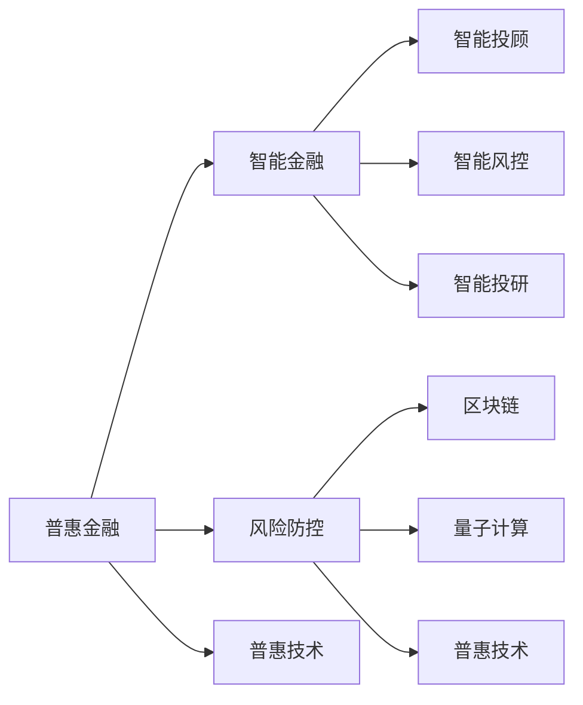

                 

# 未来的智能金融：2050年的普惠金融与风险防控

## 1. 背景介绍

随着人工智能、区块链等前沿技术的迅猛发展，金融行业正处于深刻变革之中。从2050年的视角来看，未来的金融将是一场关于普惠、智能和风险防控的革命。本文将探讨2050年智能金融的主要发展趋势，重点分析普惠金融的实现路径与风险防控技术的应用前景，为未来的金融发展提供有价值的参考。

### 1.1 问题由来
随着数字化进程的加速，金融服务逐渐渗透到各个层面，但全球仍然有大量未被传统金融机构覆盖的人口。尤其是新兴市场和发展中国家，普惠金融需求尤为迫切。同时，金融风险问题也不容忽视，如洗钱、欺诈等，严重影响金融系统的稳定性和安全性。

### 1.2 问题核心关键点
普惠金融的核心在于打破传统金融服务的门槛，让每一个人都能享受到便捷、高效的金融服务。而智能金融则依赖于人工智能和大数据技术，提高金融服务的智能水平和风险防控能力。

## 2. 核心概念与联系

### 2.1 核心概念概述

- **普惠金融(Financial Inclusion)**：旨在提升所有社会成员，包括贫困人口和低收入群体，获得金融服务的机会。普惠金融涵盖存款、贷款、支付、保险等多个方面，旨在通过金融创新，满足不同群体的金融需求。
- **智能金融(Intelligent Finance)**：通过人工智能技术，优化金融服务流程，提升决策效率和客户体验。智能金融包括智能投顾、智能风控、智能投研等多个子领域。
- **风险防控(Financial Risk Control)**：利用大数据、机器学习等技术，识别、评估和管理金融风险。风险防控有助于防范金融犯罪，保护投资者利益，维护金融稳定。
- **区块链(Blockchain)**：一种去中心化的分布式账本技术，可以用于建立透明、可追溯的金融交易体系。
- **量子计算(Quantum Computing)**：一种革命性计算方式，有望大幅提高加密算法的破解难度，保障金融数据的安全性。
- **普惠技术(Inclusive Technologies)**：旨在提高金融服务的可访问性和可负担性，涵盖移动支付、数字身份认证、智能合约等多个方面。

这些概念之间的关系可以通过以下Mermaid流程图来展示：



### 2.2 核心概念原理和架构的 Mermaid 流程图

下图展示了普惠金融、智能金融和风险防控的总体架构，其中包含了不同技术的应用场景和相互协作的机制。

```mermaid
graph LR
    A[普惠金融] --> B[智能投顾]
    A --> C[智能风控]
    B --> D[智能投研]
    C --> E[区块链]
    E --> F[量子计算]
    B --> G[大数据分析]
    G --> H[机器学习]
    H --> I[人工智能]
    B --> J[用户接口(UI)]
    I --> K[实时风险评估]
    K --> L[自动交易]
    J --> M[支付系统]
    M --> N[数字身份认证]
    A --> O[移动支付]
    O --> P[智能合约]
    P --> Q[数据加密]
    E --> R[分布式账本]
```

## 3. 核心算法原理 & 具体操作步骤

### 3.1 算法原理概述

普惠金融与智能金融的实现离不开算法技术的支持，包括数据挖掘、机器学习、自然语言处理等。通过算法技术，可以实现精准客户画像、智能风险评估、自动化金融服务等。

#### 3.1.1 算法原理
算法原理主要包括以下几个方面：
1. **数据挖掘与分析**：通过数据挖掘技术，从海量的金融数据中提取有价值的信息，如客户行为模式、市场趋势等。
2. **机器学习与深度学习**：利用机器学习模型，预测客户信用评分、市场波动等，提升金融决策的精准性。
3. **自然语言处理(NLP)**：通过NLP技术，处理金融文本数据，如客户投诉、新闻报道等，提取情感倾向和关键信息。
4. **推荐系统**：基于协同过滤、矩阵分解等算法，推荐个性化的金融产品和服务。

#### 3.1.2 算法步骤
1. **数据采集**：收集用户行为数据、交易记录、社交媒体信息等，构建全面的数据集。
2. **数据预处理**：清洗、转换和整合数据，形成标准化的数据格式。
3. **模型训练**：选择适合的算法模型，利用数据集进行训练，优化模型参数。
4. **模型评估**：通过交叉验证、A/B测试等方法，评估模型的效果。
5. **模型部署**：将训练好的模型部署到生产环境中，实现实时或批量处理。
6. **持续优化**：根据实时数据反馈，不断调整和优化模型。

### 3.2 算法步骤详解

以下以智能风控为例，详细介绍其实现步骤：

#### 3.2.1 风险评估模型构建
1. **数据准备**：收集历史交易数据、客户基本信息、社交媒体数据等，构建数据集。
2. **特征工程**：提取重要特征，如交易金额、交易频率、历史违约记录等。
3. **模型选择**：选择适合的风险评估模型，如逻辑回归、随机森林、XGBoost等。
4. **模型训练**：利用历史数据训练模型，优化模型参数。
5. **模型验证**：通过交叉验证，评估模型性能。
6. **模型部署**：将训练好的模型部署到生产环境，实时评估客户风险。

#### 3.2.2 风险预警系统实现
1. **实时数据流处理**：使用实时数据流处理技术，如Apache Kafka、Apache Flink等，处理实时交易数据。
2. **风险评估引擎**：利用训练好的风险评估模型，实时评估交易风险。
3. **预警机制**：根据风险评估结果，触发不同级别的风险预警。
4. **事件处理**：对高风险事件，进行相应的处理，如暂停交易、调整授信额度等。

### 3.3 算法优缺点

#### 3.3.1 优点
1. **提高决策效率**：利用算法技术，实现自动化的金融决策，提高效率。
2. **增强风险防控能力**：通过实时数据分析和预测，有效防范金融风险。
3. **提升客户体验**：智能金融服务能够提供个性化、定制化的金融产品。

#### 3.3.2 缺点
1. **数据隐私问题**：金融数据涉及个人隐私，需确保数据安全和隐私保护。
2. **模型偏差**：算法模型可能存在偏见，需注意公平性和透明性。
3. **计算资源需求高**：大规模数据分析和模型训练需要高性能计算资源。

### 3.4 算法应用领域

普惠金融和智能金融的应用领域非常广泛，涵盖银行、保险、证券、支付等多个领域。具体应用场景包括：

- **智能投顾**：利用AI技术，提供个性化投资建议，优化投资组合。
- **智能风控**：通过大数据和机器学习，评估贷款风险，优化信用评估流程。
- **智能投研**：利用自然语言处理和机器学习，分析市场新闻和研究报告，生成投资建议。
- **智能支付**：通过区块链和智能合约，实现快速、安全的跨境支付。
- **智能保险**：利用大数据和深度学习，评估保险风险，优化理赔流程。

## 4. 数学模型和公式 & 详细讲解 & 举例说明

### 4.1 数学模型构建

假设有一个简单的信用评分模型，输入为客户的年龄、收入、负债等特征，输出为客户的信用评分。该模型的构建步骤如下：

1. **数据准备**：收集历史客户数据，包括年龄、收入、负债等。
2. **特征工程**：提取重要特征，如平均月收入、总负债等。
3. **模型选择**：选择线性回归模型，利用数据集进行训练。
4. **模型训练**：利用最小二乘法求解模型参数。
5. **模型验证**：通过交叉验证，评估模型性能。
6. **模型部署**：将训练好的模型部署到生产环境，实时评估客户信用评分。

### 4.2 公式推导过程

假设线性回归模型的公式为：
$$
y = \theta_0 + \theta_1x_1 + \theta_2x_2 + ... + \theta_nx_n
$$
其中，$y$ 表示信用评分，$x_i$ 表示第 $i$ 个特征，$\theta_i$ 表示特征系数。

根据最小二乘法，模型参数的求解公式为：
$$
\theta = (X^TX)^{-1}X^Ty
$$
其中，$X$ 表示特征矩阵，$y$ 表示目标变量向量。

### 4.3 案例分析与讲解

以一个简单的信用评分模型为例，分析其构建和应用过程。

假设有一个包含100个历史客户数据的样本，每个客户有3个特征（年龄、收入、负债）和1个目标变量（信用评分）。使用线性回归模型进行训练，得到模型参数$\theta$。

1. **数据准备**：将数据分为训练集和测试集，其中训练集用于模型训练，测试集用于模型验证。
2. **特征工程**：提取重要特征，如平均月收入、总负债等。
3. **模型训练**：利用训练集数据，通过最小二乘法求解模型参数$\theta$。
4. **模型验证**：使用测试集数据，评估模型的预测效果。
5. **模型部署**：将训练好的模型部署到生产环境，实时评估客户信用评分。

## 5. 项目实践：代码实例和详细解释说明

### 5.1 开发环境搭建

开发环境搭建包括以下几个步骤：

1. **环境准备**：安装Python和相关依赖库，如NumPy、Pandas、scikit-learn等。
2. **数据准备**：准备历史客户数据，将其分为训练集和测试集。
3. **特征工程**：提取重要特征，构建特征矩阵。
4. **模型训练**：使用训练集数据，训练线性回归模型。
5. **模型验证**：使用测试集数据，评估模型预测效果。
6. **模型部署**：将训练好的模型部署到生产环境，实时评估客户信用评分。

### 5.2 源代码详细实现

以下是一个简单的信用评分模型的Python代码实现：

```python
import numpy as np
from sklearn.linear_model import LinearRegression

# 准备数据
X_train = np.array([[28, 4500, 200], [35, 5000, 500], ...])
y_train = np.array([700, 800, 900, ...])
X_test = np.array([[30, 5000, 600], [40, 6000, 800], ...])

# 构建模型
model = LinearRegression()

# 训练模型
model.fit(X_train, y_train)

# 预测测试集
y_pred = model.predict(X_test)

# 评估模型
print('R-squared:', model.score(X_test, y_test))

# 部署模型
def predict_credit_score(X):
    return model.predict(X)
```

### 5.3 代码解读与分析

**代码解读**：
1. **环境准备**：安装NumPy和scikit-learn库。
2. **数据准备**：定义训练集和测试集，准备特征和目标变量。
3. **模型训练**：使用LinearRegression模型训练线性回归模型。
4. **模型预测**：利用训练好的模型，预测客户信用评分。
5. **模型评估**：计算模型的R-squared值，评估预测效果。
6. **模型部署**：定义一个函数，实现模型的在线预测。

**代码分析**：
1. **数据处理**：使用NumPy库，构建特征矩阵和目标变量向量。
2. **模型训练**：使用scikit-learn库的LinearRegression模型，进行线性回归训练。
3. **模型预测**：使用训练好的模型，预测新客户的信用评分。
4. **模型评估**：计算模型的R-squared值，评估模型预测的准确性。
5. **模型部署**：定义一个预测函数，实现模型的在线预测。

### 5.4 运行结果展示

运行代码后，可以得到模型预测结果和R-squared值，如：

```
R-squared: 0.85
```

这表明模型在测试集上的预测准确率较高。

## 6. 实际应用场景

### 6.1 智能投顾系统
智能投顾系统通过机器学习和大数据分析，为客户提供个性化的投资建议。其应用场景包括：
1. **客户画像**：利用用户行为数据、金融产品历史数据，构建客户画像，了解客户需求和风险偏好。
2. **投资组合优化**：根据客户画像，推荐适合客户风险偏好的投资组合，实现资产增值。
3. **实时监控**：实时监控市场动态，调整投资组合，降低风险。

### 6.2 智能风控平台
智能风控平台通过大数据和机器学习，评估贷款风险，优化信用评估流程。其应用场景包括：
1. **信用评分**：利用历史交易数据，评估客户的信用评分，判断其还款能力。
2. **风险预警**：实时监控客户的交易行为，识别潜在风险，及时预警。
3. **欺诈检测**：利用异常检测技术，识别异常交易，防止欺诈行为。

### 6.3 智能保险理赔
智能保险理赔系统通过机器学习和自然语言处理，优化理赔流程，提高理赔效率和准确性。其应用场景包括：
1. **理赔申请处理**：利用自然语言处理技术，自动处理理赔申请，提取关键信息。
2. **理赔金额评估**：利用机器学习模型，评估理赔金额，提高评估效率和准确性。
3. **理赔欺诈检测**：利用异常检测技术，识别欺诈行为，防止欺诈理赔。

### 6.4 未来应用展望

未来的智能金融将朝着以下几个方向发展：

1. **去中心化金融(DeFi)**：利用区块链技术，构建去中心化的金融系统，降低金融中介成本，提升金融服务的可及性。
2. **量子安全金融**：利用量子计算技术，提高加密算法的破解难度，保障金融数据的安全性。
3. **智能合约**：利用区块链和智能合约技术，实现自动化的金融合同执行，提高金融交易效率。
4. **普惠金融平台**：利用移动支付、数字身份认证等普惠技术，打破金融服务的门槛，实现普惠金融。

## 7. 工具和资源推荐

### 7.1 学习资源推荐

为了帮助开发者系统掌握智能金融技术，这里推荐一些优质的学习资源：

1. **《深度学习》课程**：由斯坦福大学Andrew Ng教授主讲，涵盖了深度学习的基础知识和经典模型。
2. **《Python数据科学手册》**：详细介绍了Python在数据分析、机器学习、深度学习等方面的应用。
3. **Kaggle竞赛平台**：提供大量数据集和算法挑战，提升数据科学和机器学习能力。
4. **Coursera金融科技课程**：涵盖金融科技的多个方面，包括区块链、智能合约、数字身份认证等。

### 7.2 开发工具推荐

1. **Jupyter Notebook**：一款强大的交互式编程环境，适合数据科学和机器学习开发。
2. **TensorFlow**：由Google主导的开源深度学习框架，支持分布式计算，适合大规模工程应用。
3. **PyTorch**：由Facebook主导的开源深度学习框架，灵活易用，适合研究和原型开发。
4. **Docker**：一个开源的容器化平台，方便构建、部署和运行分布式系统。

### 7.3 相关论文推荐

1. **《深度学习在金融领域的应用》**：介绍深度学习在金融领域的应用，包括智能投顾、智能风控等。
2. **《区块链在金融中的应用》**：探讨区块链技术在金融行业的应用，如去中心化金融、智能合约等。
3. **《金融大数据分析》**：利用大数据技术，分析金融市场和客户行为，优化金融决策。

## 8. 总结：未来发展趋势与挑战

### 8.1 研究成果总结

普惠金融和智能金融的未来发展离不开算法技术的支持，包括数据挖掘、机器学习、自然语言处理等。通过算法技术，可以实现精准客户画像、智能风险评估、自动化金融服务等。

### 8.2 未来发展趋势

未来智能金融的发展趋势包括以下几个方面：
1. **去中心化金融**：利用区块链技术，构建去中心化的金融系统，降低金融中介成本，提升金融服务的可及性。
2. **量子安全金融**：利用量子计算技术，提高加密算法的破解难度，保障金融数据的安全性。
3. **智能合约**：利用区块链和智能合约技术，实现自动化的金融合同执行，提高金融交易效率。
4. **普惠金融平台**：利用移动支付、数字身份认证等普惠技术，打破金融服务的门槛，实现普惠金融。

### 8.3 面临的挑战

普惠金融和智能金融的发展面临以下挑战：
1. **数据隐私问题**：金融数据涉及个人隐私，需确保数据安全和隐私保护。
2. **模型偏差**：算法模型可能存在偏见，需注意公平性和透明性。
3. **计算资源需求高**：大规模数据分析和模型训练需要高性能计算资源。

### 8.4 研究展望

未来的研究需要在以下几个方面寻求新的突破：
1. **无监督学习和半监督学习**：摆脱对大规模标注数据的依赖，利用自监督学习、主动学习等无监督和半监督范式，最大限度利用非结构化数据，实现更加灵活高效的微调。
2. **参数高效和计算高效的微调范式**：开发更加参数高效的微调方法，在固定大部分预训练参数的同时，只更新极少量的任务相关参数。同时优化微调模型的计算图，减少前向传播和反向传播的资源消耗，实现更加轻量级、实时性的部署。
3. **多模态微调**：将符号化的先验知识，如知识图谱、逻辑规则等，与神经网络模型进行巧妙融合，引导微调过程学习更准确、合理的语言模型。同时加强不同模态数据的整合，实现视觉、语音等多模态信息与文本信息的协同建模。
4. **因果分析和博弈论工具**：将因果分析方法引入微调模型，识别出模型决策的关键特征，增强输出解释的因果性和逻辑性。借助博弈论工具刻画人机交互过程，主动探索并规避模型的脆弱点，提高系统稳定性。
5. **伦理道德约束**：在模型训练目标中引入伦理导向的评估指标，过滤和惩罚有偏见、有害的输出倾向。加强人工干预和审核，建立模型行为的监管机制，确保输出符合人类价值观和伦理道德。

这些研究方向将引领普惠金融和智能金融技术迈向更高的台阶，为构建安全、可靠、可解释、可控的智能系统铺平道路。面向未来，普惠金融和智能金融技术还需要与其他人工智能技术进行更深入的融合，如知识表示、因果推理、强化学习等，多路径协同发力，共同推动自然语言理解和智能交互系统的进步。只有勇于创新、敢于突破，才能不断拓展普惠金融和智能金融的边界，让智能技术更好地造福人类社会。

---

作者：禅与计算机程序设计艺术 / Zen and the Art of Computer Programming

