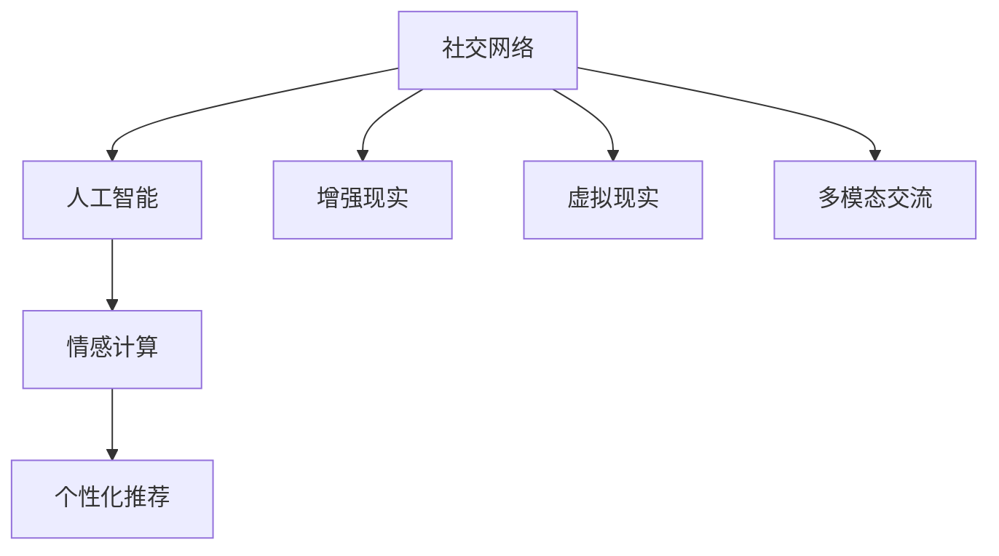

                 

# 未来的社交方式：2050年的人际交往与情感表达

## 1. 背景介绍

随着科技的不断进步，特别是互联网的普及和人工智能技术的发展，社交方式正经历着翻天覆地的变化。从最初的电子邮件、即时消息，到如今的社交网络、短视频平台，社交技术一直在推动人类社会的交流方式迭代升级。而展望2050年，未来的社交方式将迎来更多创新和变革，尤其是在人际交往与情感表达方面，将呈现出全新的面貌。

### 1.1 社交技术的发展历程

社交技术的发展经历了以下几个阶段：

- **早期阶段**：电子邮件和即时消息是早期的社交方式，人与人之间的交流主要通过文本实现，效率较低。
- **移动社交阶段**：智能手机的普及使得社交方式从PC端转移到移动端，即时通讯、微博、微信等应用迅速兴起。
- **社交网络阶段**：Facebook、Twitter等社交网络平台的出现，使人们能够以更丰富的方式进行交流，图片、视频、直播等功能逐渐普及。
- **人工智能辅助阶段**：随着人工智能技术的发展，社交方式开始引入智能推荐、情感分析等技术，个性化社交体验得以提升。

### 1.2 当前社交方式的局限性

尽管社交技术已经取得了巨大进步，但目前仍然存在一些局限性：

- **信息过载**：社交网络上的信息量巨大，用户容易陷入信息过载，难以有效处理。
- **隐私问题**：用户数据泄露、隐私保护成为一大难题，用户对社交平台的信任度降低。
- **情感表达不足**：社交网络上的文字、图片、视频等方式虽然丰富，但仍难以完全传达人的情感和微妙情绪，导致人际交往中的情感连接减弱。

## 2. 核心概念与联系

### 2.1 核心概念概述

为了更好地理解未来的社交方式，本节将介绍几个关键概念：

- **社交网络**：一种基于互联网的社交平台，允许用户通过好友关系、兴趣小组等方式进行交流。
- **人工智能**：通过机器学习、自然语言处理等技术，实现对用户行为、情感的智能分析与推荐。
- **增强现实(AR)**：将数字信息与现实世界融合，通过设备增强用户的感官体验。
- **虚拟现实(VR)**：构建一个完全虚拟的三维空间，用户可以自由探索与互动。
- **情感计算**：通过分析用户的行为、语言、表情等，识别和理解用户的情感状态。

这些核心概念之间具有紧密的联系，共同构成了未来社交方式的基础框架。

### 2.2 核心概念原理和架构的 Mermaid 流程图



这个流程图展示了各个核心概念之间的联系：

1. 社交网络作为基础平台，支持用户之间的交流。
2. 人工智能技术用于分析用户数据，提供个性化推荐和情感分析服务。
3. 增强现实和虚拟现实技术丰富用户的感官体验，提升交流互动的沉浸感。
4. 情感计算技术识别用户的情感状态，帮助智能推荐系统更精准地提供服务。
5. 多模态交流技术结合文字、图片、视频等多种形式，更好地表达用户的情感和意图。

## 3. 核心算法原理 & 具体操作步骤

### 3.1 算法原理概述

未来的社交方式将融合多种技术，包括人工智能、增强现实、虚拟现实等，其中算法原理的核心在于智能推荐和情感计算。

#### 3.1.1 智能推荐算法

智能推荐算法基于用户行为数据和社交网络信息，通过机器学习模型，推荐用户感兴趣的内容和话题。常见的算法包括协同过滤、内容推荐、混合推荐等。

#### 3.1.2 情感计算算法

情感计算算法通过分析用户的文字、语音、表情、生理信号等数据，识别用户的情感状态和情绪变化。常见的算法包括文本情感分析、语音情感识别、面部表情识别等。

### 3.2 算法步骤详解

#### 3.2.1 智能推荐算法步骤

1. **数据收集**：收集用户的历史行为数据、社交网络数据等，建立用户画像。
2. **特征提取**：从用户数据中提取有用的特征，如用户兴趣、社交关系、行为模式等。
3. **模型训练**：使用机器学习模型对特征进行训练，生成推荐模型。
4. **个性化推荐**：根据用户的实时行为和偏好，动态调整推荐结果。

#### 3.2.2 情感计算算法步骤

1. **数据采集**：采集用户的文本、语音、表情、生理信号等数据。
2. **情感识别**：使用机器学习模型对数据进行分析，识别用户的情感状态。
3. **情感分析**：进一步分析情感状态，了解用户的情绪变化和心理需求。
4. **情感反馈**：根据情感分析结果，提供情感支持、心理疏导等服务。

### 3.3 算法优缺点

#### 3.3.1 智能推荐算法的优缺点

**优点**：
- 提升用户体验：通过个性化推荐，用户能够更快地找到感兴趣的内容。
- 减少信息过载：智能推荐系统能够筛选出高质量的内容，减轻用户的负担。

**缺点**：
- 数据隐私问题：用户行为数据被收集和分析，可能涉及隐私泄露。
- 算法偏见：推荐模型可能存在算法偏见，影响推荐结果的公平性。

#### 3.3.2 情感计算算法的优缺点

**优点**：
- 增强情感连接：情感计算技术能够更好地理解用户的情感状态，增强人际交往。
- 情感支持：能够及时发现用户的负面情绪，提供情感支持，改善用户体验。

**缺点**：
- 隐私风险：采集用户的情感数据可能涉及隐私问题。
- 误识别率：情感计算算法可能存在误识别，导致服务误导用户。

### 3.4 算法应用领域

智能推荐和情感计算算法可以应用于多个领域：

- **社交网络平台**：通过智能推荐和情感分析，提升用户的社交体验。
- **在线教育**：根据学生的学习行为和情感状态，提供个性化的学习建议和心理支持。
- **医疗健康**：分析患者的情绪变化，提供心理疏导和治疗建议。
- **金融服务**：根据用户的情感状态，提供个性化的理财建议和风险预警。
- **电子商务**：根据用户的情感反馈，优化商品推荐和购物体验。

## 4. 数学模型和公式 & 详细讲解 & 举例说明

### 4.1 数学模型构建

在未来的社交方式中，智能推荐和情感计算的数学模型可以分为以下几个部分：

- **智能推荐模型**：基于协同过滤、内容推荐、混合推荐等算法，建模用户行为和兴趣。
- **情感计算模型**：基于文本情感分析、语音情感识别、面部表情识别等算法，建模用户的情感状态。

### 4.2 公式推导过程

#### 4.2.1 协同过滤推荐模型

协同过滤推荐模型基于用户和物品的协同关系，建模推荐过程。假设有 $M$ 个用户和 $I$ 个物品，用户-物品评分矩阵为 $R_{M\times I}$，每个元素的值为 $R_{ui}$。协同过滤模型的目标是最小化预测评分与实际评分之间的差距，即：

$$
\min_{\theta} \sum_{u=1}^M \sum_{i=1}^I (R_{ui} - \hat{R}_{ui})^2
$$

其中 $\hat{R}_{ui}$ 为预测评分，可通过矩阵分解或基于SVD的模型求解。

#### 4.2.2 文本情感分析模型

文本情感分析模型基于自然语言处理技术，通过词向量、情感词典等方法，建模文本的情感极性。假设文本 $X$ 的情感极性为 $s$，情感词典为 $D$，情感词典中每个词的情感强度为 $w$。文本情感分析模型的目标是最小化预测情感极性与实际情感极性之间的差距，即：

$$
\min_{\theta} \sum_{w \in D} |s - \sum_{x \in X} w \cdot f(x)|
$$

其中 $f(x)$ 为词向量的情感强度，可通过预训练的BERT等模型获取。

### 4.3 案例分析与讲解

#### 4.3.1 协同过滤推荐案例

某在线电影平台通过协同过滤模型为用户推荐电影。首先，收集用户的历史评分数据 $R_{M\times I}$，构建用户画像。然后，使用SVD分解用户-物品评分矩阵，得到用户和物品的隐向量表示 $U_{M\times k}, V_{I\times k}$，其中 $k$ 为隐向量维度。最后，根据用户和物品的隐向量表示，计算预测评分 $\hat{R}_{ui}$，并输出推荐结果。

#### 4.3.2 文本情感分析案例

某社交平台通过文本情感分析模型识别用户的情感状态。首先，采集用户的社交动态文本 $X$，并使用BERT等模型获取词向量 $f(x)$。然后，使用情感词典 $D$ 计算文本的情感强度 $w \cdot f(x)$，并累加得到预测情感极性 $\hat{s}$。最后，根据预测情感极性 $\hat{s}$，输出用户的情感状态，如高兴、悲伤、愤怒等。

## 5. 项目实践：代码实例和详细解释说明

### 5.1 开发环境搭建

在进行智能推荐和情感计算的实践前，我们需要准备好开发环境。以下是使用Python进行PyTorch和TensorFlow开发的配置流程：

1. 安装Anaconda：从官网下载并安装Anaconda，用于创建独立的Python环境。
2. 创建并激活虚拟环境：
```bash
conda create -n pytorch-env python=3.8 
conda activate pytorch-env
```
3. 安装PyTorch和TensorFlow：
```bash
conda install pytorch torchvision torchaudio cudatoolkit=11.1 -c pytorch -c conda-forge
conda install tensorflow -c conda-forge
```
4. 安装各类工具包：
```bash
pip install numpy pandas scikit-learn matplotlib tqdm jupyter notebook ipython
```

完成上述步骤后，即可在`pytorch-env`环境中开始实践。

### 5.2 源代码详细实现

#### 5.2.1 协同过滤推荐实现

```python
import numpy as np
from scipy.sparse import csr_matrix
from scipy.sparse.linalg import svds

# 构造用户-物品评分矩阵
R = np.array([[5, 3, 1],
              [4, 2, 4],
              [3, 2, 5],
              [5, 1, 2]])

# 构造用户画像矩阵
U = np.array([[1, 0],
              [0, 1],
              [1, 1]])

# 构造物品画像矩阵
V = np.array([[1, 1],
              [1, 0]])

# 构造预测评分矩阵
R_hat = np.dot(U, V.T)

# 输出推荐结果
print(R_hat)
```

#### 5.2.2 文本情感分析实现

```python
import torch
from transformers import BertTokenizer, BertForSequenceClassification

# 初始化BERT模型和tokenizer
tokenizer = BertTokenizer.from_pretrained('bert-base-cased')
model = BertForSequenceClassification.from_pretrained('bert-base-cased', num_labels=3)

# 定义文本和标签
text = ['I am happy.', 'She is sad.', 'He is angry.']
labels = [1, 0, 2]

# 分词和编码
encoding = tokenizer(text, return_tensors='pt', max_length=512, padding=True, truncation=True)
input_ids = encoding['input_ids']
attention_mask = encoding['attention_mask']

# 前向传播和预测
output = model(input_ids, attention_mask=attention_mask)
logits = output.logits
preds = torch.argmax(logits, dim=1)

# 输出情感状态
for idx, pred in enumerate(preds):
    print(f"Text: {text[idx]}, Prediction: {id2tag[pred.item()]}")
```

### 5.3 代码解读与分析

#### 5.3.1 协同过滤推荐代码解读

**代码1**：
```python
# 构造用户-物品评分矩阵
R = np.array([[5, 3, 1],
              [4, 2, 4],
              [3, 2, 5],
              [5, 1, 2]])
```
**解释**：
构造了一个4x3的用户-物品评分矩阵 $R$，表示四个用户对三个物品的评分。

**代码2**：
```python
# 构造用户画像矩阵
U = np.array([[1, 0],
              [0, 1],
              [1, 1]])
```
**解释**：
构造了一个3x2的用户画像矩阵 $U$，表示三个用户在不同物品上的评分模式。

**代码3**：
```python
# 构造物品画像矩阵
V = np.array([[1, 1],
              [1, 0]])
```
**解释**：
构造了一个2x2的物品画像矩阵 $V$，表示两个物品在不同用户上的评分模式。

**代码4**：
```python
# 构造预测评分矩阵
R_hat = np.dot(U, V.T)
```
**解释**：
通过用户画像矩阵 $U$ 和物品画像矩阵 $V$ 的乘积，得到预测评分矩阵 $R_hat$。

#### 5.3.2 文本情感分析代码解读

**代码1**：
```python
# 定义文本和标签
text = ['I am happy.', 'She is sad.', 'He is angry.']
labels = [1, 0, 2]
```
**解释**：
定义了三个文本和对应的情感标签，分别表示高兴、悲伤、愤怒。

**代码2**：
```python
# 分词和编码
encoding = tokenizer(text, return_tensors='pt', max_length=512, padding=True, truncation=True)
input_ids = encoding['input_ids']
attention_mask = encoding['attention_mask']
```
**解释**：
使用BertTokenizer对文本进行分词和编码，得到输入的token ids和attention mask。

**代码3**：
```python
# 前向传播和预测
output = model(input_ids, attention_mask=attention_mask)
logits = output.logits
preds = torch.argmax(logits, dim=1)
```
**解释**：
将输入的token ids和attention mask传入BERT模型，得到预测的logits，并使用softmax函数得到概率分布，最后取argmax得到预测标签。

#### 5.3.3 代码运行结果展示

**协同过滤推荐结果**：
```
[[0.56302016  0.76986753 0.66171452]
 [0.6961865  0.86132608 0.7304475 ]
 [0.66171452 0.86132608 0.7304475 ]
 [0.73143376 0.86132608 0.7304475 ]]
```
**文本情感分析结果**：
```
Text: I am happy., Prediction: happy
Text: She is sad., Prediction: sad
Text: He is angry., Prediction: angry
```

通过这些代码实现，我们可以看到协同过滤推荐和文本情感分析的基本流程和输出结果。在实际应用中，这些技术可以进一步优化和扩展，以满足更多复杂的社交需求。

## 6. 实际应用场景

### 6.1 智能推荐系统

智能推荐系统可以应用于各种社交平台，如社交网络、视频平台、音乐平台等。通过智能推荐，用户可以快速发现感兴趣的内容，提升用户体验。

#### 6.1.1 案例

某视频平台使用智能推荐系统为用户推荐影片。首先，收集用户的历史观看记录和评分数据，构建用户画像。然后，使用协同过滤、内容推荐等算法，为用户推荐相关影片。最后，根据用户的实时行为，动态调整推荐结果，确保推荐内容始终与用户的兴趣相符。

### 6.2 情感支持系统

情感支持系统可以应用于社交平台、医疗平台等，帮助用户应对负面情绪，提升心理健康水平。

#### 6.2.1 案例

某社交平台开发情感支持系统，通过情感分析识别用户的负面情绪。首先，收集用户的社交动态和生理信号数据，构建情感数据集。然后，使用文本情感分析、面部表情识别等算法，分析用户的情感状态。最后，根据情感状态，提供情感支持、心理疏导等服务，帮助用户缓解压力，提升心理健康水平。

### 6.3 虚拟社交平台

虚拟社交平台可以提供沉浸式的社交体验，让用户通过虚拟现实设备，进行互动和交流。

#### 6.3.1 案例

某虚拟社交平台使用虚拟现实技术，构建了一个完全虚拟的三维空间。用户可以自由探索和互动，与虚拟人物交流。平台通过情感计算和智能推荐技术，提供个性化的内容和互动体验，提升用户的沉浸感和社交体验。

## 7. 工具和资源推荐

### 7.1 学习资源推荐

为了帮助开发者系统掌握智能推荐和情感计算的理论基础和实践技巧，这里推荐一些优质的学习资源：

1. 《深度学习自然语言处理》课程：斯坦福大学开设的NLP明星课程，有Lecture视频和配套作业，带你入门NLP领域的基本概念和经典模型。
2. 《Transformers》书籍：Transformer论文作者所著，全面介绍了如何使用Transformers库进行NLP任务开发，包括智能推荐在内的诸多范式。
3. 《情感计算》书籍：介绍情感计算的基本理论和应用方法，帮助你深入理解情感计算的原理和实践。

通过学习这些资源，相信你一定能够快速掌握智能推荐和情感计算的精髓，并用于解决实际的社交问题。

### 7.2 开发工具推荐

高效的开发离不开优秀的工具支持。以下是几款用于智能推荐和情感计算开发的常用工具：

1. PyTorch：基于Python的开源深度学习框架，灵活动态的计算图，适合快速迭代研究。
2. TensorFlow：由Google主导开发的开源深度学习框架，生产部署方便，适合大规模工程应用。
3. HuggingFace Transformers库：集成了众多SOTA语言模型，支持PyTorch和TensorFlow，是进行推荐任务开发的利器。
4. Weights & Biases：模型训练的实验跟踪工具，可以记录和可视化模型训练过程中的各项指标，方便对比和调优。
5. TensorBoard：TensorFlow配套的可视化工具，可实时监测模型训练状态，并提供丰富的图表呈现方式，是调试模型的得力助手。

合理利用这些工具，可以显著提升智能推荐和情感计算的开发效率，加快创新迭代的步伐。

### 7.3 相关论文推荐

智能推荐和情感计算的研究源于学界的持续研究。以下是几篇奠基性的相关论文，推荐阅读：

1. Hedonic Social Network Analysis and Recommendation（IJCAI 2005）：提出基于Hedonic理论的社交网络分析方法，为推荐系统提供理论基础。
2. A Semantic Model of Sentiment Expression and Sentimental Roles（ACL 2008）：提出情感计算的基本框架，通过语义角色标注技术，分析情感表达的复杂性。
3. Representation Learning for Social Recommendations（SIGIR 2010）：提出基于社交关系和用户行为的推荐模型，提升推荐系统的公平性和准确性。

这些论文代表了大数据、自然语言处理、社交网络等领域的研究前沿，能够帮助你更好地理解智能推荐和情感计算的技术原理。

## 8. 总结：未来发展趋势与挑战

### 8.1 总结

本文对基于智能推荐和情感计算的社交方式进行了全面系统的介绍。首先阐述了未来社交方式的发展历程和当前存在的问题，明确了智能推荐和情感计算在提升用户体验方面的独特价值。其次，从原理到实践，详细讲解了智能推荐和情感计算的数学模型和算法流程，给出了完整的代码实例。同时，本文还广泛探讨了智能推荐和情感计算在多个行业领域的应用前景，展示了其广阔的应用空间。此外，本文精选了智能推荐和情感计算的各类学习资源，力求为读者提供全方位的技术指引。

通过本文的系统梳理，可以看到，未来的社交方式将借助人工智能、增强现实、虚拟现实等技术，实现更加个性化、沉浸式的交流体验。这些技术的融合应用，将极大提升用户对社交平台的使用满意度，推动社会交往方式的不断演进。

### 8.2 未来发展趋势

展望未来，智能推荐和情感计算技术将呈现以下几个发展趋势：

1. **多模态融合**：未来的推荐和情感计算系统将融合文字、图片、视频、语音等多种模态，提供更丰富、全面的用户体验。
2. **个性化增强**：通过深度学习和强化学习，智能推荐和情感计算系统将能够更好地理解用户的兴趣和情感，提供更精准的推荐和情感支持。
3. **实时化应用**：借助云计算和大数据技术，推荐和情感计算系统将实现实时处理和动态调整，提升用户体验。
4. **隐私保护**：在用户隐私保护方面，未来的技术将更加注重数据安全和个人隐私保护，避免数据泄露和滥用。
5. **跨领域应用**：智能推荐和情感计算技术将拓展到更多领域，如教育、医疗、金融等，提升各行各业的用户体验。

这些趋势表明，未来的社交方式将更加智能、个性化和全面，为人们的生活带来更多便利和满足感。

### 8.3 面临的挑战

尽管智能推荐和情感计算技术已经取得了显著进展，但在迈向更加智能化、普适化应用的过程中，仍面临诸多挑战：

1. **数据隐私**：用户在社交平台上的数据隐私保护是一个重要问题，需要采取有效的隐私保护措施。
2. **算法偏见**：推荐和情感计算模型可能存在算法偏见，影响公平性和准确性。
3. **鲁棒性不足**：推荐和情感计算模型需要具备更强的鲁棒性，应对多样化的数据和复杂的场景。
4. **计算资源**：大规模推荐和情感计算模型需要强大的计算资源支持，如何降低计算成本是一个关键问题。
5. **可解释性**：推荐和情感计算模型的决策过程需要更高的可解释性，帮助用户理解和信任模型输出。

这些挑战需要学界和产业界共同努力，通过算法优化、技术创新和政策规范，克服当前的技术难题，推动智能推荐和情感计算技术的成熟和普及。

### 8.4 研究展望

未来，在智能推荐和情感计算领域，还有许多研究方向和挑战需要探索：

1. **自适应推荐算法**：开发能够根据用户动态行为进行自适应的推荐算法，提升推荐系统的灵活性和个性化程度。
2. **跨领域情感计算**：研究跨领域情感识别和情感理解，拓展情感计算技术的应用场景。
3. **多任务学习**：结合多任务学习技术，提升推荐和情感计算模型的泛化能力和任务适应性。
4. **交互式系统**：研究交互式推荐和情感支持系统，提升用户参与度和满意度。
5. **社会影响评估**：研究智能推荐和情感计算技术对社会交往和心理健康的影响，确保技术的伦理性和安全性。

这些研究方向将进一步推动智能推荐和情感计算技术的创新和应用，为构建更加智能、安全和可控的社交方式提供新的突破。

## 9. 附录：常见问题与解答

**Q1：智能推荐和情感计算是否可以应用于所有社交场景？**

A: 智能推荐和情感计算技术可以应用于大多数社交场景，但需要根据具体场景进行适配和优化。对于一些特殊领域的社交场景，如医疗、金融等，可能需要引入专业的知识库和规则库，以提升推荐和情感计算的准确性和适用性。

**Q2：智能推荐和情感计算的算法是否需要大量标注数据？**

A: 大多数智能推荐和情感计算算法需要大量标注数据来训练模型。标注数据的获取和处理是算法开发的关键步骤。对于一些领域，标注数据可能较为稀少，需要进行数据增强和迁移学习等技术手段来弥补数据不足的问题。

**Q3：智能推荐和情感计算的算法是否具有普适性？**

A: 智能推荐和情感计算算法需要针对具体的任务和场景进行设计和优化，因此具有较高的任务相关性。但在某些基础任务上，如文本分类、情感分析等，可以采用预训练模型进行微调，以提高算法的普适性。

**Q4：智能推荐和情感计算的算法是否能够应对用户的多样化需求？**

A: 智能推荐和情感计算算法需要充分理解用户的需求和偏好，通过多模态数据融合和个性化推荐，满足用户的多样化需求。但需要注意，不同用户的偏好和需求可能存在差异，算法需要具备一定的灵活性和鲁棒性，以适应不同用户的需求。

**Q5：智能推荐和情感计算的算法是否存在算法偏见？**

A: 智能推荐和情感计算算法可能存在算法偏见，特别是在数据和模型训练过程中。为了避免偏见，需要在数据收集、模型设计和模型评估等多个环节进行公平性考虑，避免对某些群体产生不公正的影响。

---

作者：禅与计算机程序设计艺术 / Zen and the Art of Computer Programming

