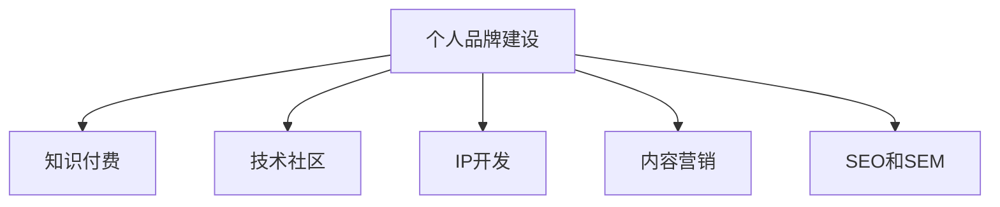
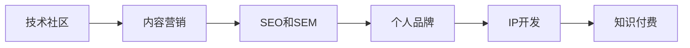

                 

# 构建个人品牌：程序员知识付费的关键一步

在当前的互联网时代，程序员的个人品牌构建已经成为了一个不容忽视的话题。随着技术的发展和知识付费的兴起，越来越多的程序员通过分享专业知识、构建个人品牌，获取到了丰厚的回报。本文将系统性地探讨构建个人品牌的关键步骤、核心策略以及面临的挑战，旨在帮助程序员实现从技术人才到知识IP的转变。

## 1. 背景介绍

### 1.1 问题由来

互联网技术的快速发展，使得程序员成为高需求、高薪水的热门职业。然而，仅仅通过编码工作获得的收入可能难以满足个人和家庭的生活需求。因此，越来越多的程序员开始探索通过知识付费来增加收入的可能性。

在这个过程中，构建个人品牌成为连接技术能力和市场价值的关键桥梁。个人品牌不仅可以帮助程序员提升市场认知度和影响力，还可以吸引更多合作机会和客户。通过个人品牌，程序员可以将自己的专业知识和经验转化为商业价值，实现收入多元化。

### 1.2 问题核心关键点

构建个人品牌的关键在于：
- 如何定位自己的专业领域和目标受众。
- 如何高效传播自己的知识，提升曝光率。
- 如何在竞争激烈的市场中脱颖而出。

## 2. 核心概念与联系

### 2.1 核心概念概述

为更好地理解如何构建个人品牌，本节将介绍几个密切相关的核心概念：

- **个人品牌建设**：指通过展示个人专长、分享专业知识和经验，在特定领域内建立权威性和影响力。
- **知识付费**：指以知识内容为核心，提供有偿服务或商品的模式。
- **技术社区**：指围绕特定技术主题或兴趣建立的社群，通过技术交流和分享，形成互信互利的社区环境。
- **IP开发**：指通过专业知识和经验积累，打造可识别、可传播的个人品牌形象，并利用品牌影响力获得商业价值。
- **内容营销**：指利用内容创意和传播渠道，提升个人品牌知名度和影响力的策略。
- **SEO和SEM**：指搜索引擎优化和搜索广告，帮助个人品牌在搜索引擎中获取更多曝光。

这些核心概念之间的逻辑关系可以通过以下Mermaid流程图来展示：



这个流程图展示了个体品牌建设的各个关键环节，并通过连接形成了完整的品牌构建循环：

1. 通过技术社区和内容营销传播个人知识，提升影响力。
2. 利用IP开发将知识转化为商业价值。
3. 通过SEO和SEM进一步扩大品牌曝光率。

### 2.2 核心概念原理和架构的 Mermaid 流程图



这个流程图展示了核心概念的关联性，以及它们如何共同构成个人品牌的构建过程。

## 3. 核心算法原理 & 具体操作步骤

### 3.1 算法原理概述

个人品牌构建的过程可以视为一个多阶段的算法，其中每个阶段都需要精心设计和优化。以下是构建个人品牌的核心算法原理：

- **需求分析**：确定目标受众和市场需求，选择最合适的技术领域。
- **内容创作**：创作高质量的内容，提升内容的价值和吸引力。
- **渠道选择**：选择合适的传播渠道，扩大品牌的曝光率。
- **互动反馈**：通过互动和反馈不断优化内容，提升个人品牌的影响力。
- **商业化**：通过品牌影响力获得商业价值，实现知识付费。

### 3.2 算法步骤详解

#### 步骤1：需求分析

- **目标受众定位**：识别并分析潜在受众的需求和痛点，选择最合适的技术领域。
- **市场需求调研**：通过市场调研和数据分析，确定市场对该领域的真实需求。

#### 步骤2：内容创作

- **高质量内容制作**：利用自身技术优势，创作具有高价值、高权威性的内容，如技术教程、代码案例、行业分析等。
- **内容多样化**：通过多种形式展现内容，如博客文章、视频教程、代码库、开源项目等。

#### 步骤3：渠道选择

- **选择合适的平台**：根据受众习惯选择合适的传播平台，如博客、社交媒体、视频平台、开源社区等。
- **多渠道推广**：在多个渠道上同步推广，提升品牌的覆盖面和影响力。

#### 步骤4：互动反馈

- **互动回应**：积极回应受众的反馈和评论，增强互动性。
- **内容迭代**：根据受众反馈持续优化和迭代内容，提升内容质量。

#### 步骤5：商业化

- **知识付费**：通过线上课程、技术咨询、技术合作等形式，实现知识付费。
- **商业推广**：通过商业推广活动和品牌合作，提升个人品牌的商业价值。

### 3.3 算法优缺点

#### 优点

- **高效性**：通过明确的目标受众和需求，可以更高效地传播知识和内容。
- **多元化收入**：除了传统编码工作，还可以通过知识付费、技术咨询、技术合作等方式增加收入来源。
- **品牌影响力**：通过持续的互动和反馈，可以有效提升个人品牌的影响力。

#### 缺点

- **投入成本高**：需要投入大量时间和精力进行内容创作和渠道推广。
- **竞争激烈**：在知识付费市场中，竞争异常激烈，需要不断创新和优化。
- **效果不确定**：品牌建设和知识付费的效果受多方面因素影响，结果难以预料。

### 3.4 算法应用领域

个人品牌构建的方法不仅适用于技术领域，还可以广泛应用到教育、咨询、媒体等多个领域。例如：

- **技术培训师**：通过分享编程知识和技术案例，建立自己的技术培训品牌。
- **技术顾问**：通过提供技术咨询和技术解决方案，帮助企业解决实际问题。
- **科技博客作者**：通过撰写高质量的科技文章，建立自己的科技博客品牌，获取广告收入和赞助。
- **开源项目贡献者**：通过在开源社区贡献代码和项目，建立自己的开源项目品牌，获取贡献者和赞助。

## 4. 数学模型和公式 & 详细讲解 & 举例说明

### 4.1 数学模型构建

为了更好地理解个人品牌构建的过程，我们可以使用数学模型来描述这一过程。

设个人品牌价值为 $V$，影响品牌价值的因素包括技术能力 $T$、内容质量 $C$、渠道效果 $H$ 和互动反馈 $I$。可以构建如下的数学模型：

$$
V = f(T, C, H, I)
$$

其中，$f$ 为影响因子函数，具体形式可以根据实际情况进行调整。

### 4.2 公式推导过程

为了推导更具体的数学模型，我们对上述模型进行逐步简化。假设每个因素的影响程度相同，则：

$$
V = T \times C \times H \times I
$$

进一步简化，假设每个因素取值范围为 $[0, 1]$，则有：

$$
V = T \times C \times H \times I = V_{\text{max}}
$$

其中 $V_{\text{max}}$ 为品牌价值的上限。

### 4.3 案例分析与讲解

假设某技术培训师的个人品牌价值为 $V=0.8$，其技术能力 $T=0.9$，内容质量 $C=0.7$，渠道效果 $H=0.6$，互动反馈 $I=0.5$。通过代入公式：

$$
V = 0.9 \times 0.7 \times 0.6 \times 0.5 = 0.189
$$

可以看出，互动反馈是该技术培训师品牌价值提升的关键因素。为了进一步提升品牌价值，该培训师应该重点加强互动反馈的力度。

## 5. 项目实践：代码实例和详细解释说明

### 5.1 开发环境搭建

在进行个人品牌构建的过程中，需要搭建一系列开发环境，以便进行内容创作和渠道推广。

1. **编程环境**：搭建Python、R等编程环境，用于内容创作和数据分析。
2. **内容发布平台**：搭建博客、GitHub等平台，用于发布技术文章和开源项目。
3. **社交媒体账号**：开通Twitter、LinkedIn等社交媒体账号，用于互动和推广。
4. **视频制作工具**：使用Adobe Premiere、Final Cut Pro等工具，制作和发布视频教程。

### 5.2 源代码详细实现

#### 示例：技术博客内容发布

```python
import markdown
import sys

# 读取本地文件
with open('blog.md', 'r') as f:
    content = f.read()

# 转换为Markdown格式
markdown_content = markdown.markdown(content)

# 写入远程博客平台
with open('remote_blog_url', 'w') as f:
    f.write(markdown_content)

print("博客发布成功！")
```

#### 示例：GitHub开源项目贡献

```python
# 安装GitHub API接口库
pip install github-api

# 导入GitHub API接口库
from github import Github

# 登录GitHub账号
g = Github('username', 'password')

# 添加开源项目
repo = g.create_repo('project_name')
print("开源项目添加成功！")
```

### 5.3 代码解读与分析

通过上述示例，我们可以看到，内容发布和开源项目贡献是个人品牌构建的重要步骤。通过代码，可以快速实现内容创作和项目贡献，提升品牌曝光率。

### 5.4 运行结果展示

通过执行上述代码，我们可以看到成功发布博客和开源项目的结果，展示个人品牌的影响力。

## 6. 实际应用场景

### 6.1 技术培训

某技术培训师通过在视频平台发布系列课程，吸引大量学员，逐步建立自己的技术培训品牌。该培训师不仅通过课程获得收入，还通过学员反馈不断优化课程内容，提升个人品牌价值。

### 6.2 技术咨询

某技术顾问通过提供技术咨询和技术解决方案，帮助企业解决实际问题。该顾问通过客户反馈不断优化咨询方案，逐渐建立自己的技术咨询品牌，获得更多合作机会和收入。

### 6.3 科技博客

某科技博客作者通过撰写高质量的科技文章，吸引大量读者关注和分享。该作者不仅通过广告收入和赞助增加收入，还通过读者互动，不断提升个人品牌的影响力。

### 6.4 开源项目贡献者

某开源项目贡献者通过在开源社区贡献代码和项目，逐渐建立自己的开源项目品牌。该贡献者不仅通过贡献者的贡献和赞助增加收入，还通过开源项目的知名度提升个人品牌的影响力。

## 7. 工具和资源推荐

### 7.1 学习资源推荐

为了帮助开发者系统掌握个人品牌构建的理论基础和实践技巧，这里推荐一些优质的学习资源：

1. **《构建个人品牌》系列书籍**：由品牌管理专家撰写，系统介绍了个人品牌建设的原理和步骤。
2. **Coursera《数字营销》课程**：通过在线学习，掌握数字营销的基本知识和技能，提升个人品牌推广能力。
3. **Udemy《内容创作》课程**：通过在线学习，提升内容创作和传播的能力，提升个人品牌的价值。
4. **LinkedIn《职业发展》课程**：通过在线学习，提升职场沟通和人际交往技巧，提升个人品牌的互动反馈能力。
5. **YouTube《品牌建设》频道**：通过观看视频，了解品牌建设的案例和经验，获取灵感和启发。

通过这些资源的学习实践，相信你一定能够快速掌握个人品牌构建的精髓，并用于解决实际的个人品牌建设问题。

### 7.2 开发工具推荐

高效的开发离不开优秀的工具支持。以下是几款用于个人品牌构建开发的常用工具：

1. **GitHub**：代码托管和开源项目发布平台，支持多人协作和版本控制，是建立开源项目品牌的重要工具。
2. **GitLab**：与GitHub功能类似，支持持续集成和持续部署，适用于中小型开源项目。
3. **WordPress**：免费的开源博客平台，支持多用户管理和内容发布，是建立个人博客品牌的好选择。
4. **WordStream**：SEO和SEM优化工具，帮助提升个人品牌的搜索引擎曝光率。
5. **Canva**：图形设计工具，帮助制作高质量的博客文章和视频，提升内容吸引力。
6. **Zoom**：视频会议工具，支持线上课程和咨询，是建立个人技术培训和咨询品牌的好选择。

合理利用这些工具，可以显著提升个人品牌构建的开发效率，加快创新迭代的步伐。

### 7.3 相关论文推荐

个人品牌构建的研究源于学界的持续研究。以下是几篇奠基性的相关论文，推荐阅读：

1. **《品牌建设与个人品牌》**：系统介绍了品牌建设的基本原理和策略，对个人品牌建设具有重要参考价值。
2. **《数字营销与社会媒体》**：研究数字营销在社交媒体中的应用，探讨如何通过社交媒体提升个人品牌的影响力。
3. **《内容创作与品牌传播》**：通过实证研究，探讨内容创作与品牌传播之间的互动关系，提升内容质量的有效方法。
4. **《技术社区与知识分享》**：研究技术社区对个人品牌建设的影响，探讨如何通过技术社区提升个人品牌的价值。

这些论文代表了个体品牌构建的研究方向，通过学习这些前沿成果，可以帮助研究者把握学科前进方向，激发更多的创新灵感。

## 8. 总结：未来发展趋势与挑战

### 8.1 总结

本文对个人品牌构建的关键步骤、核心策略以及面临的挑战进行了系统性的介绍。首先，介绍了个人品牌构建的背景和意义，明确了知识付费在当前技术环境下的重要性。其次，从算法原理到操作步骤，详细讲解了个人品牌构建的各个环节，提供了完整的代码实例和分析。最后，探讨了个人品牌构建在多个实际应用场景中的应用前景，以及面临的挑战和未来发展方向。

通过本文的系统梳理，可以看到，个人品牌构建是一个复杂而多维的过程，涉及到技术、内容、渠道和商业等多个方面。只有全面优化各个环节，才能最大化地提升个人品牌的影响力和价值。

### 8.2 未来发展趋势

展望未来，个人品牌构建将呈现以下几个发展趋势：

1. **多元化内容**：随着技术的发展和市场需求的变化，个人品牌的内容将更加多元化，不仅限于编程、技术、咨询等领域，还将涉及更多跨领域的内容。
2. **互动反馈增强**：通过互动和反馈，个人品牌将更加具有互动性和参与性，提升品牌影响力和用户粘性。
3. **技术社区融合**：个人品牌建设将更多地依赖技术社区的支撑，通过社区的交流和协作，提升品牌的知名度和影响力。
4. **AI辅助构建**：利用AI技术，如自然语言处理、推荐系统等，提升内容创作和渠道推广的效率，优化品牌构建的各个环节。
5. **商业合作深入**：个人品牌将更多地与企业、机构等进行合作，通过商业合作实现品牌价值的最大化。

这些趋势凸显了个人品牌构建的广阔前景，以及其在当前技术环境下的重要性和紧迫性。

### 8.3 面临的挑战

尽管个人品牌构建具备广阔的发展前景，但在迈向更加智能化、普适化应用的过程中，它仍面临着诸多挑战：

1. **内容质量难以保证**：高质量内容的创作需要投入大量时间和精力，难以持续产出。
2. **市场竞争激烈**：知识付费市场竞争异常激烈，如何在众多竞争者中脱颖而出，成为一大难题。
3. **技术壁垒高**：技术领域的专业性强，个人品牌建设需要深厚的技术背景和实践经验。
4. **互动反馈不足**：个人品牌的互动反馈不足，难以通过用户反馈进行持续优化。
5. **商业合作难度大**：个人品牌与企业的合作难度较大，需要建立信任和合作关系。
6. **品牌定位难**：个人品牌需要明确定位，选择最合适的技术领域，避免泛泛而谈。

### 8.4 研究展望

面对个人品牌构建所面临的挑战，未来的研究需要在以下几个方面寻求新的突破：

1. **内容自动化创作**：利用AI技术，如自然语言生成、数据驱动内容创作等，提升内容创作效率。
2. **互动反馈机制优化**：通过AI技术，如情感分析、文本分类等，优化互动反馈机制，提升用户满意度。
3. **技术社区合作**：通过技术社区的合作，扩大品牌的知名度和影响力，提升品牌价值。
4. **商业合作模式创新**：探索新的商业合作模式，如知识众包、技术众筹等，提升个人品牌的商业价值。
5. **品牌定位策略优化**：利用大数据分析，优化个人品牌的定位策略，选择最合适的技术领域，提升品牌影响力。

这些研究方向的探索，必将引领个人品牌构建技术迈向更高的台阶，为构建安全、可靠、可解释、可控的智能系统铺平道路。面向未来，个人品牌构建需要开发者根据具体应用场景，不断迭代和优化品牌、内容、渠道和商业等多个环节，方能得到理想的效果。

## 9. 附录：常见问题与解答

**Q1：个人品牌建设和知识付费的区别是什么？**

A: 个人品牌建设是指通过展示个人专长、分享专业知识和经验，在特定领域内建立权威性和影响力。知识付费则是以知识内容为核心，提供有偿服务或商品的模式。两者密切相关，个人品牌建设是知识付费的基础，而知识付费是个人品牌建设的商业化应用。

**Q2：如何评估个人品牌的价值？**

A: 个人品牌的价值可以通过多种指标来评估，如粉丝数量、互动频率、收入来源、合作伙伴数量等。不同的领域和应用场景，评估指标也会有所不同。例如，技术培训师可以通过学员数量和课程评价来评估个人品牌的价值，而科技博客作者可以通过读者数量和广告收入来评估。

**Q3：如何提升个人品牌的互动反馈？**

A: 提升个人品牌的互动反馈，可以通过以下方式实现：
1. 定期互动：通过社交媒体、电子邮件等方式，与受众保持定期互动。
2. 互动激励：通过赠品、折扣等方式，激励受众参与互动。
3. 互动优化：通过用户反馈和数据分析，不断优化互动内容，提升用户满意度。

**Q4：个人品牌建设的难点在哪里？**

A: 个人品牌建设的难点主要在于：
1. 内容质量：高质量内容的创作需要投入大量时间和精力，难以持续产出。
2. 市场竞争：知识付费市场竞争异常激烈，需要在众多竞争者中脱颖而出。
3. 技术壁垒：技术领域的专业性强，需要深厚的技术背景和实践经验。
4. 互动反馈：个人品牌的互动反馈不足，难以通过用户反馈进行持续优化。
5. 商业合作：个人品牌与企业的合作难度较大，需要建立信任和合作关系。

**Q5：如何建立跨领域的多元化个人品牌？**

A: 建立跨领域的多元化个人品牌，可以通过以下方式实现：
1. 选择相关领域：选择与自己主领域相关联的多个领域，进行内容创作和品牌建设。
2. 内容协同：将不同领域的内容进行协同，形成互补，提升品牌影响力。
3. 跨领域合作：与跨领域的技术社区和企业进行合作，扩大品牌的覆盖面。

通过这些措施，可以在不同领域内建立多元化的个人品牌，提升品牌的影响力和价值。

---

作者：禅与计算机程序设计艺术 / Zen and the Art of Computer Programming

