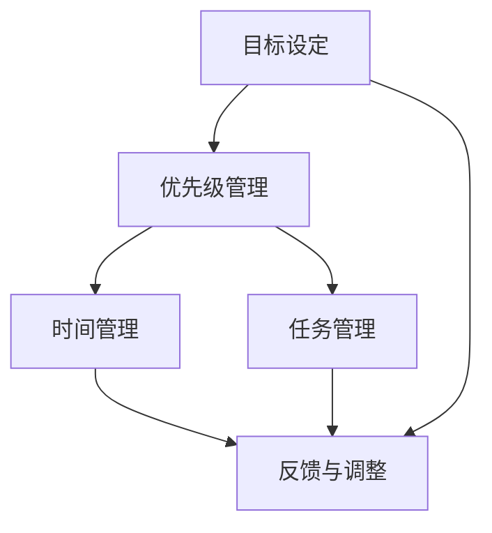

                 

# 构建个人管理方法论的步骤

管理，作为人类社会的重要活动，无论是对于企业还是个人，都具有至关重要的作用。良好的管理方法论能够帮助我们高效地安排工作，优化资源配置，提升个人和组织的生产效率。本文将围绕个人管理方法论的构建，从背景介绍、核心概念与联系、核心算法原理与具体操作步骤、数学模型与公式详解、项目实践与运行结果展示、实际应用场景及未来应用展望等多个方面进行详细探讨。

## 1. 背景介绍

### 1.1 问题由来

在现代社会中，随着信息爆炸和竞争加剧，个人需要在众多任务之间高效协调和优先处理，以实现职业发展和个人成长。然而，传统的手工管理方式在效率和系统性上存在明显不足，难以应对现代工作场景的复杂性和多变性。这就要求我们构建一套高效、系统的个人管理方法论，以帮助个人在繁忙的工作与生活中游刃有余。

### 1.2 问题核心关键点

构建个人管理方法论的核心关键点主要包括以下几点：
- **目标设定**：明确个人职业发展和生活中的关键目标。
- **优先级管理**：合理分配时间和资源，确保最重要的任务得到优先处理。
- **时间管理**：制定详细的日程计划，合理利用时间资源。
- **任务管理**：对任务进行分类和优先级排序，提高工作效率。
- **反馈与调整**：持续评估管理效果，根据反馈进行调整优化。

这些关键点构成了个人管理方法论的基本框架，帮助我们构建起一套系统、高效的管理体系。

## 2. 核心概念与联系

### 2.1 核心概念概述

个人管理方法论的构建涉及多个核心概念，这些概念之间存在着密切的联系：

- **目标设定（Goal Setting）**：明确个人长期和短期的目标，为后续管理提供方向。
- **优先级管理（Priority Management）**：通过时间管理、任务管理和优先级排序，确保高优先级任务得到优先处理。
- **时间管理（Time Management）**：通过制定详细的日程计划和合理安排时间，提高时间利用率。
- **任务管理（Task Management）**：将任务进行分类和优先级排序，提高任务执行效率。
- **反馈与调整（Feedback & Adjustment）**：持续评估管理效果，根据反馈进行优化调整。

这些核心概念共同构成了个人管理方法论的基础框架，通过相互配合和优化，形成一套高效、系统的管理体系。

### 2.2 核心概念原理和架构的 Mermaid 流程图



此流程图展示了各个核心概念之间的关系：目标设定是基础，优先级管理和任务管理为时间管理提供支持，反馈与调整则是对前述环节的持续优化。

## 3. 核心算法原理 & 具体操作步骤

### 3.1 算法原理概述

个人管理方法论的核心算法原理主要基于以下几个方面：

- **目标理论**：使用SMART（Specific, Measurable, Achievable, Relevant, Time-bound）目标设定法，明确具体、可衡量、可实现、相关且有时限的目标。
- **优先级排序算法**：采用Eisenhower矩阵（四象限法），根据任务的紧急程度和重要性进行优先级排序。
- **时间块管理**：采用时间块（Time Blocking）方法，将时间分为固定块，每个时间块内专注于特定任务。
- **任务细分与分解**：采用WBS（Work Breakdown Structure）方法，将复杂任务分解为可管理的小任务。
- **反馈与调整算法**：采用PDCA（Plan-Do-Check-Act）循环，持续评估管理效果并根据反馈进行优化。

这些算法原理构成了个人管理方法论的技术基础，通过合理的算法设计和优化，形成一套高效、系统的管理体系。

### 3.2 算法步骤详解

#### 3.2.1 目标设定

**步骤1: 明确个人愿景与使命**
- 确定个人职业发展和生活中的长期愿景。
- 制定具体、可衡量的使命宣言。

**步骤2: 制定SMART目标**
- 目标设定要符合SMART原则，确保目标的具体性、可衡量性、可实现性、相关性和时限性。

**步骤3: 分解目标为子目标**
- 将长期目标分解为一系列短期目标。
- 为每个短期目标设定具体的行动计划和期限。

#### 3.2.2 优先级管理

**步骤1: 确定任务类型**
- 识别出工作中的紧急任务和重要任务。
- 区分常规任务和关键任务。

**步骤2: 使用Eisenhower矩阵**
- 将任务按照紧急程度和重要性进行分类，分为四类：重要且紧急、重要但不紧急、紧急但不重要、不重要且不紧急。
- 优先处理重要且紧急的任务，其次是重要但不紧急的任务。

#### 3.2.3 时间管理

**步骤1: 制定时间计划**
- 根据每日的工作量和优先级，制定详细的时间计划。
- 将时间分为固定块，如9:00-12:00、13:00-16:00等。

**步骤2: 采用时间块管理**
- 每个时间块内专注于特定任务。
- 避免多任务并行，确保每个时间块内的任务专注度。

#### 3.2.4 任务管理

**步骤1: 任务分解**
- 将大任务分解为可管理的小任务。
- 确定每个小任务的具体步骤和要求。

**步骤2: 任务优先级排序**
- 根据任务的紧急程度和重要性进行排序。
- 优先处理高优先级任务。

#### 3.2.5 反馈与调整

**步骤1: 定期评估**
- 定期评估目标进展和任务执行情况。
- 使用KPI（关键绩效指标）评估目标达成情况。

**步骤2: 调整优化**
- 根据评估结果，调整目标和任务优先级。
- 优化时间管理和任务管理策略。

### 3.3 算法优缺点

#### 3.3.1 优点

- **系统性**：通过目标设定、优先级管理、时间管理、任务管理和反馈调整等环节，形成一套系统、全面的管理体系。
- **高效性**：合理分配时间和资源，确保高优先级任务得到优先处理，提高工作效率。
- **灵活性**：根据反馈及时调整优化，适应不同工作场景和需求。

#### 3.3.2 缺点

- **实施难度**：需要投入较多时间和精力进行目标设定和优先级管理。
- **适应性**：对于一些非常规或突发任务，可能需要临时调整管理策略。
- **依赖个人执行**：管理效果依赖个人的执行力和自律性。

### 3.4 算法应用领域

个人管理方法论可以应用于多个领域，包括但不限于以下：

- **职业发展**：帮助个人制定职业目标，优化时间管理，提高工作效率。
- **生活管理**：管理家庭事务、个人健康、休闲娱乐等，提升生活质量。
- **团队协作**：指导团队成员制定个人目标，协调团队任务，优化团队资源配置。
- **自我提升**：通过学习、阅读、写作等活动，提升个人知识和技能。

## 4. 数学模型和公式 & 详细讲解

### 4.1 数学模型构建

个人管理方法论的数学模型主要包括以下几个部分：

- **目标设定模型**：使用SMART原则构建目标模型。
- **优先级管理模型**：使用Eisenhower矩阵构建优先级排序模型。
- **时间管理模型**：采用时间块管理方法，建立时间分配模型。
- **任务管理模型**：通过WBS方法，建立任务分解和优先级排序模型。
- **反馈与调整模型**：使用PDCA循环，建立持续评估和优化模型。

### 4.2 公式推导过程

#### 4.2.1 目标设定模型

**目标设定公式**
$$
G = (S, M, A, R, T)
$$
其中，$G$ 表示目标，$S$ 表示目标的具体性，$M$ 表示目标的可衡量性，$A$ 表示目标的可实现性，$R$ 表示目标的相关性，$T$ 表示目标的时限性。

#### 4.2.2 优先级管理模型

**Eisenhower矩阵模型**
$$
\begin{bmatrix}
重要 & 紧急 \\
重要 & 不紧急 \\
不紧急 & 重要 \\
不紧急 & 不紧急
\end{bmatrix}
$$
将任务按照四象限进行分类，优先处理重要且紧急的任务。

#### 4.2.3 时间管理模型

**时间块管理模型**
$$
T = \sum_{i=1}^{n} t_i
$$
其中，$T$ 表示总时间，$t_i$ 表示每个时间块的长度。

#### 4.2.4 任务管理模型

**任务分解模型**
$$
T = \sum_{i=1}^{n} t_i
$$
其中，$T$ 表示总任务，$t_i$ 表示每个小任务的执行时间。

#### 4.2.5 反馈与调整模型

**PDCA循环模型**
$$
PDCA = \{P, D, C, A\}
$$
其中，$P$ 表示计划，$D$ 表示执行，$C$ 表示检查，$A$ 表示调整。

### 4.3 案例分析与讲解

假设某个人在进行项目管理时，需要使用个人管理方法论：

1. **目标设定**
   - 具体目标：在三个月内完成项目报告。
   - 可衡量指标：项目报告的完成度。
   - 可实现性：项目资源和时间充足。
   - 相关性：项目报告对公司战略有重要意义。
   - 时限性：三个月内完成。

2. **优先级管理**
   - 紧急且重要的任务：项目报告初稿编写。
   - 重要但不紧急的任务：数据收集与分析。
   - 紧急但不重要的任务：项目会议记录。
   - 不紧急且不重要的任务：整理办公桌。

3. **时间管理**
   - 时间块安排：每天上午9:00-12:00、下午13:00-16:00。
   - 时间块执行：每个时间块内专注于特定任务。

4. **任务管理**
   - 任务分解：项目报告分为内容编写、数据收集、数据分析、格式排版等小任务。
   - 任务优先级排序：先完成内容编写，再数据收集与分析，最后格式排版。

5. **反馈与调整**
   - 定期评估：每月评估一次项目进展。
   - 调整优化：根据评估结果，调整目标和任务优先级。

## 5. 项目实践：代码实例和详细解释说明

### 5.1 开发环境搭建

在进行个人管理方法论的实践时，需要使用一些开发工具和环境。以下是一个Python开发环境的搭建步骤：

1. 安装Python：从官网下载安装Python 3.x版本。
2. 安装Visual Studio Code：使用VSCode作为开发IDE。
3. 安装Git：使用Git进行版本控制。
4. 安装Flask：使用Flask搭建个人管理应用。

### 5.2 源代码详细实现

以下是一个基于Flask框架的个人管理应用代码实现：

```python
from flask import Flask, request, jsonify

app = Flask(__name__)

# 目标设定管理
@app.route('/set-goal', methods=['POST'])
def set_goal():
    # 获取目标信息
    goal = request.json['goal']
    # 处理目标信息
    # ...
    # 返回目标信息
    return jsonify({'success': True, 'goal': goal})

# 优先级管理
@app.route('/set-priority', methods=['POST'])
def set_priority():
    # 获取任务信息
    task = request.json['task']
    # 处理任务信息
    # ...
    # 返回任务信息
    return jsonify({'success': True, 'priority': priority})

# 时间管理
@app.route('/set-schedule', methods=['POST'])
def set_schedule():
    # 获取时间块信息
    schedule = request.json['schedule']
    # 处理时间块信息
    # ...
    # 返回时间块信息
    return jsonify({'success': True, 'schedule': schedule})

# 任务管理
@app.route('/set-task', methods=['POST'])
def set_task():
    # 获取任务信息
    task = request.json['task']
    # 处理任务信息
    # ...
    # 返回任务信息
    return jsonify({'success': True, 'task': task})

# 反馈与调整
@app.route('/set-feedback', methods=['POST'])
def set_feedback():
    # 获取反馈信息
    feedback = request.json['feedback']
    # 处理反馈信息
    # ...
    # 返回反馈信息
    return jsonify({'success': True, 'feedback': feedback})

if __name__ == '__main__':
    app.run(debug=True)
```

### 5.3 代码解读与分析

上述代码实现了个人管理应用的基本功能，包括目标设定、优先级管理、时间管理、任务管理和反馈调整。具体解读如下：

- **目标设定**：通过POST请求提交目标信息，服务器端处理后返回目标信息。
- **优先级管理**：通过POST请求提交任务信息，服务器端处理后返回任务信息。
- **时间管理**：通过POST请求提交时间块信息，服务器端处理后返回时间块信息。
- **任务管理**：通过POST请求提交任务信息，服务器端处理后返回任务信息。
- **反馈与调整**：通过POST请求提交反馈信息，服务器端处理后返回反馈信息。

### 5.4 运行结果展示

运行上述代码，可以通过浏览器访问个人管理应用，进行目标设定、优先级管理、时间管理、任务管理和反馈调整。


## 6. 实际应用场景

### 6.1 职业发展

在职业发展中，个人管理方法论可以用于制定职业目标、优化时间管理、提高工作效率。通过明确目标、优先级管理、时间管理和任务管理，确保关键任务得到优先处理，从而快速实现职业发展。

### 6.2 生活管理

在生活管理中，个人管理方法论可以用于管理家庭事务、个人健康、休闲娱乐等。通过合理规划时间块，确保高优先级生活任务得到优先处理，提升生活质量。

### 6.3 团队协作

在团队协作中，个人管理方法论可以用于指导团队成员制定个人目标，协调团队任务，优化团队资源配置。通过明确团队目标、优先级管理、时间管理和任务管理，确保团队高效协作。

### 6.4 未来应用展望

未来，随着人工智能和大数据技术的发展，个人管理方法论将与AI技术结合，进一步提升管理效率和智能化水平。例如，通过自然语言处理技术，实现目标自动设定和任务自动优先级排序；通过机器学习算法，预测和管理时间块安排；通过数据分析，优化任务管理和反馈调整。这些技术的发展，将使个人管理方法论更加智能化、系统化和高效化。

## 7. 工具和资源推荐

### 7.1 学习资源推荐

为了帮助开发者系统掌握个人管理方法论的理论基础和实践技巧，这里推荐一些优质的学习资源：

1. 《个人管理方法论》系列博文：由个人管理专家撰写，深入浅出地介绍了目标设定、优先级管理、时间管理、任务管理和反馈调整等核心概念。

2. Coursera《个人效率与时间管理》课程：提供系统性的时间管理和个人效率课程，涵盖目标设定、优先级管理、时间管理等关键内容。

3. 《高效能人士的七个习惯》书籍：史蒂芬·柯维著作，介绍了目标设定、优先级管理、时间管理等七个高效习惯，帮助读者提升个人效率。

4. Evernote、Trello等个人管理工具：提供了强大的目标管理、任务管理和时间管理功能，帮助用户高效规划和管理个人事务。

5. Todoist、Microsoft To Do等任务管理工具：提供了任务分解、优先级排序和进度跟踪功能，帮助用户有效完成任务管理。

通过对这些资源的学习实践，相信你一定能够快速掌握个人管理方法论的精髓，并用于解决实际的个人管理问题。

### 7.2 开发工具推荐

高效的开发离不开优秀的工具支持。以下是几款用于个人管理方法论开发的常用工具：

1. Visual Studio Code：一款流行的开源IDE，支持多种编程语言，非常适合开发个人管理应用。
2. Git：一个版本控制系统，支持多人协作开发，确保代码的跟踪和版本管理。
3. Flask：一个轻量级的Web框架，可以快速搭建个人管理应用。
4. Docker：一个容器化平台，支持应用的可移植性和部署管理。
5. JIRA：一个项目管理工具，支持任务跟踪、优先级管理和进度跟踪，适合团队协作。

合理利用这些工具，可以显著提升个人管理方法论的开发效率，加快创新迭代的步伐。

### 7.3 相关论文推荐

个人管理方法论的发展源于学界的持续研究。以下是几篇奠基性的相关论文，推荐阅读：

1. 《目标理论在个人管理中的应用》：探讨目标理论在个人管理中的实际应用，提出SMART目标设定法。
2. 《优先级管理的科学基础》：研究优先级管理的基本原理和算法，提出Eisenhower矩阵等方法。
3. 《时间管理的艺术与科学》：介绍时间管理的多种方法和工具，如时间块管理、番茄钟法等。
4. 《任务管理的新方法》：提出任务分解和优先级排序的新方法，如WBS、PERT等。
5. 《PDCA循环在个人管理中的应用》：研究PDCA循环在个人管理中的应用，提出持续评估和优化的策略。

这些论文代表了个管理方法论的发展脉络。通过学习这些前沿成果，可以帮助研究者把握学科前进方向，激发更多的创新灵感。

## 8. 总结：未来发展趋势与挑战

### 8.1 研究成果总结

本文对个人管理方法论的构建进行了全面系统的介绍，涵盖了目标设定、优先级管理、时间管理、任务管理和反馈调整等多个方面。通过理论分析和实际案例，详细讲解了每个环节的核心算法原理和具体操作步骤。通过代码实例，展示了如何通过Flask实现个人管理应用，并进行详细解释和分析。

### 8.2 未来发展趋势

展望未来，个人管理方法论将呈现以下几个发展趋势：

1. **智能化**：通过人工智能和大数据技术，实现目标自动设定、任务自动优先级排序和时间块自动管理，进一步提升管理效率。
2. **系统化**：整合更多个人管理工具和技术，形成一套系统化的管理体系，支持多层次、多维度的管理需求。
3. **个性化**：根据用户的个人偏好和工作习惯，提供个性化的管理方案，提升管理体验。
4. **跨平台化**：支持多种设备（如PC、手机、平板等）和平台（如Windows、iOS、Android等），实现跨平台管理。
5. **国际化**：支持多语言和多文化环境，支持不同国家和地区的管理需求。

### 8.3 面临的挑战

尽管个人管理方法论在提升个人效率和管理效果方面具有显著优势，但在应用推广和实际落地过程中，仍面临诸多挑战：

1. **用户接受度**：部分用户可能习惯于传统的管理方式，对新技术和新工具的接受度较低。
2. **数据隐私**：个人管理应用需要收集和处理用户数据，如何确保数据隐私和安全是一个重要问题。
3. **技术门槛**：个人管理应用的技术实现和维护需要一定的技术基础，部分用户可能难以掌握。
4. **适用性**：不同用户的工作和生活方式不同，需要提供灵活的管理方案。
5. **依赖性**：过度依赖个人管理工具，可能削弱用户的主动性和创造力。

### 8.4 研究展望

未来，个人管理方法论的研究将从以下几个方面进行：

1. **技术与算法融合**：将人工智能、大数据、自然语言处理等技术深度融合，提升管理方法的智能化和系统化。
2. **用户体验优化**：通过用户行为数据分析，优化管理应用的界面设计和功能模块，提升用户体验。
3. **个性化管理方案**：根据用户的个性化需求，提供定制化的管理方案，提升管理效果。
4. **跨平台和国际化**：支持多种设备和平台，支持多语言和多文化环境，拓展应用范围。
5. **伦理与安全**：加强数据隐私和安全保障，确保用户数据的安全性和合法性。

通过这些方向的研究，个人管理方法论将更加智能、高效、灵活和安全，成为个人效率提升和职业发展的有力工具。

## 9. 附录：常见问题与解答

**Q1：目标设定有哪些具体方法？**

A: 目标设定方法主要包括SMART原则，具体如下：
- 具体性（Specific）：明确具体目标。
- 可衡量性（Measurable）：设定可量化的指标。
- 可实现性（Achievable）：目标可达成。
- 相关性（Relevant）：目标与个人发展相关。
- 时限性（Time-bound）：设定完成期限。

**Q2：时间管理有哪些有效方法？**

A: 时间管理方法包括：
- 时间块管理（Time Blocking）：将时间分为固定块，每个时间块内专注于特定任务。
- 番茄钟法（Pomodoro Technique）：使用番茄钟进行时间分割，每25分钟休息5分钟。
- 任务清单法（To-Do List）：每日列出任务清单，按照优先级排序执行。
- 日计划法（Daily Planning）：每天规划当日的任务和时间块安排。

**Q3：任务管理有哪些关键步骤？**

A: 任务管理关键步骤包括：
- 任务分解（Task Decomposition）：将大任务分解为可管理的小任务。
- 任务优先级排序（Task Prioritization）：根据任务的紧急程度和重要性进行排序。
- 任务执行（Task Execution）：按照优先级顺序逐个执行任务。
- 任务跟踪（Task Tracking）：记录任务进展，确保按时完成。

**Q4：反馈与调整有哪些具体措施？**

A: 反馈与调整措施包括：
- 定期评估（Periodic Evaluation）：每月或每季度评估目标进展和任务执行情况。
- 调整目标（Goal Adjustment）：根据评估结果，调整个人目标和时间管理策略。
- 优化任务（Task Optimization）：优化任务分解和优先级排序，提高任务执行效率。
- 持续改进（Continuous Improvement）：不断改进时间管理和任务管理策略，提升个人效率。

**Q5：如何提高个人管理方法论的适用性？**

A: 提高个人管理方法论适用性的关键在于：
- 灵活调整管理策略，适应不同工作和生活场景。
- 不断学习和改进，掌握最新的管理工具和技术。
- 结合自身特点，制定个性化的管理方案。
- 与团队协作，共享管理经验和资源。

通过这些措施，个人管理方法论将更加灵活、高效和适用，帮助个人在繁忙的工作和生活中找到平衡，实现职业和生活的双重成功。

---

作者：禅与计算机程序设计艺术 / Zen and the Art of Computer Programming

