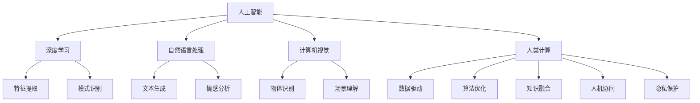

                 

# 构建更智能的世界：人类计算的应用场景

> 关键词：人工智能,人类计算,应用场景,智能系统,未来技术

## 1. 背景介绍

在现代社会中，信息技术已经渗透到各个角落，深刻改变了人类的生产、生活、娱乐等方方面面。从智能家居到智慧城市，从自动驾驶到个性化推荐，信息技术的触角正日益深入到社会的每一个细胞中。然而，在享受到信息技术带来的便利的同时，我们也面临着诸多挑战，如隐私保护、安全漏洞、伦理道德等。正是在这一背景下，人类计算(Human-Computing)的概念应运而生，致力于打造更加智能、安全、可靠的世界。

### 1.1 问题由来

人类计算旨在将人类的认知能力与计算技术相结合，通过赋予计算机人类智能，让机器更好地理解、处理和利用人类知识。这一概念最初由荷兰科学家Noah Juvinall于1968年提出，但直到近年来，随着深度学习、自然语言处理、计算机视觉等人工智能技术的发展，人类计算的概念才真正被赋予了新的内涵，成为实现更高级别AI的重要路径。

人工智能(Artificial Intelligence, AI)技术的发展为人类计算提供了强有力的技术支持，但也暴露出一些问题。例如，深度学习模型虽然取得了诸多成就，但在一些特定应用场景中，模型过于复杂、难以解释，容易产生偏见和错误。此外，AI技术的推广应用，也在一定程度上威胁到了人类的隐私和安全。为了解决这些问题，人类计算应运而生，希望通过人类的理性判断和计算技术的结合，提升AI系统的可靠性和透明度。

### 1.2 问题核心关键点

人类计算的核心在于将人类的知识和经验与机器算法相结合，构建更加智能、可靠、透明的人工智能系统。其关键点包括：

1. **数据驱动**：收集和处理大规模数据，提取特征，训练模型，提高模型性能。
2. **算法优化**：设计高效算法，提升模型的计算效率和泛化能力。
3. **知识融合**：将人类知识与机器学习算法相结合，构建更加智能的决策系统。
4. **人机协同**：构建人机交互界面，提升系统的可解释性和用户友好度。
5. **隐私保护**：保障数据和算法的安全性，防止数据泄露和滥用。

这些关键点共同构成了人类计算的基本框架，为实现更高级别的人工智能系统提供了理论和方法支持。

## 2. 核心概念与联系

### 2.1 核心概念概述

为更好地理解人类计算的概念，本节将介绍几个密切相关的核心概念：

- **人工智能**：通过算法和模型实现人类智能的机器。包括机器学习、深度学习、自然语言处理等技术。
- **深度学习**：一种基于多层神经网络的机器学习技术，能够自动从数据中提取特征，实现复杂的模式识别和决策。
- **自然语言处理**：通过计算机技术实现自然语言与计算机之间的交互，包括语音识别、文本生成、情感分析等任务。
- **计算机视觉**：使计算机能够理解和处理图像和视频数据，实现物体识别、场景理解等任务。
- **人类计算**：将人类的认知能力与计算技术相结合，构建更加智能、可靠、透明的人工智能系统。

这些核心概念之间的逻辑关系可以通过以下Mermaid流程图来展示：



这个流程图展示了大语言模型的工作原理和优化方向：

1. 人工智能通过深度学习、自然语言处理、计算机视觉等技术实现智能系统。
2. 人类计算将人类的知识和经验与机器算法相结合，构建更加智能的决策系统。
3. 深度学习通过特征提取、模式识别等技术提升模型性能。
4. 自然语言处理和计算机视觉实现对文本和图像的理解。
5. 人类计算通过数据驱动、算法优化、知识融合等技术提升系统性能。
6. 人机协同提升系统的可解释性和用户友好度。
7. 隐私保护保障数据和算法的安全性。

这些概念共同构成了人类计算的基本框架，为实现更高级别的人工智能系统提供了理论和方法支持。

## 3. 核心算法原理 & 具体操作步骤
### 3.1 算法原理概述

人类计算的算法原理主要包括以下几个方面：

1. **数据驱动**：通过大规模数据训练模型，提取特征，提升模型性能。
2. **算法优化**：设计高效算法，提升模型的计算效率和泛化能力。
3. **知识融合**：将人类知识与机器学习算法相结合，构建更加智能的决策系统。
4. **人机协同**：构建人机交互界面，提升系统的可解释性和用户友好度。
5. **隐私保护**：保障数据和算法的安全性，防止数据泄露和滥用。

### 3.2 算法步骤详解

人类计算的实现过程一般包括以下几个关键步骤：

**Step 1: 数据收集与处理**
- 收集大规模数据，进行预处理，包括去噪、归一化等。
- 利用深度学习技术，对数据进行特征提取，如卷积神经网络(CNN)、循环神经网络(RNN)等。

**Step 2: 算法设计**
- 选择合适的深度学习模型，如卷积神经网络、循环神经网络、Transformer等。
- 设计优化算法，如Adam、SGD等，并设置学习率、批大小、迭代轮数等超参数。
- 引入正则化技术，如L2正则、Dropout等，防止模型过拟合。

**Step 3: 知识融合**
- 将人类知识与机器学习算法相结合，构建更加智能的决策系统。
- 设计提示模板(Prompt Template)，引导模型进行特定任务的推理和生成。
- 引入专家知识库，如知识图谱、逻辑规则等，提升模型的准确性和鲁棒性。

**Step 4: 人机协同**
- 设计人机交互界面，提升系统的可解释性和用户友好度。
- 利用自然语言处理技术，实现与用户的自然对话。
- 引入可视化工具，如TensorBoard、Weights & Biases等，实时监测模型训练状态。

**Step 5: 隐私保护**
- 对数据进行去标识化处理，防止数据泄露和滥用。
- 设计隐私保护算法，如差分隐私、联邦学习等，保护用户隐私。
- 建立数据访问权限机制，确保数据的安全性。

### 3.3 算法优缺点

人类计算的优点包括：

1. **高精度**：结合了人类知识和机器学习，能够实现高精度的智能系统。
2. **可解释性**：通过引入人类知识，提高了系统的可解释性和透明度。
3. **鲁棒性**：结合了人类的常识和经验，提升了系统的鲁棒性和稳定性。

然而，人类计算也存在一些缺点：

1. **数据依赖**：需要大量高质量的数据进行训练，数据获取和处理成本较高。
2. **知识融合难度**：将人类知识与机器学习算法相结合，需要克服知识表示、知识获取等挑战。
3. **隐私保护复杂**：保护数据隐私和安全，需要设计复杂的隐私保护算法和技术。

尽管存在这些局限性，但人类计算在实现更高级别的人工智能系统方面具有重要意义。通过结合人类的认知能力和计算技术，构建智能、可靠、透明的人工智能系统，有望解决许多现实世界中的复杂问题。

### 3.4 算法应用领域

人类计算的应用领域非常广泛，包括但不限于以下几个方面：

- **智能家居**：通过人类计算，实现智能家电的自动化控制，提升家庭生活品质。
- **智慧医疗**：结合人类医学知识和机器学习，实现疾病诊断、治疗方案推荐等功能。
- **自动驾驶**：结合人类驾驶知识和机器学习，实现更安全、更智能的自动驾驶系统。
- **金融预测**：结合人类金融知识和机器学习，实现股票预测、风险控制等功能。
- **个性化推荐**：结合人类行为知识和机器学习，实现精准推荐，提升用户体验。

以上应用场景展示了人类计算的巨大潜力，未来随着技术的不断进步，人类计算将进一步深入到各行各业，实现更广泛的落地应用。

## 4. 数学模型和公式 & 详细讲解  
### 4.1 数学模型构建

本节将使用数学语言对人类计算的算法原理进行更加严格的刻画。

记数据集为 $D=\{(x_i,y_i)\}_{i=1}^N$，其中 $x_i$ 为输入特征，$y_i$ 为标签。假设使用的深度学习模型为 $M_{\theta}$，其中 $\theta$ 为模型参数。

定义损失函数 $\ell$ 为：

$$
\ell(y,M_{\theta}(x_i)) = \sum_{i=1}^N \ell(y_i,M_{\theta}(x_i))
$$

其中，$\ell(y_i,M_{\theta}(x_i))$ 为单个样本的损失函数，常见如交叉熵损失、均方误差损失等。

优化目标为最小化损失函数，即：

$$
\mathop{\arg\min}_{\theta} \ell(y,M_{\theta}(x_i))
$$

通常采用梯度下降等优化算法求解。优化过程如下：

$$
\theta \leftarrow \theta - \eta \nabla_{\theta}\ell(y,M_{\theta}(x_i))
$$

其中，$\eta$ 为学习率，$\nabla_{\theta}\ell(y,M_{\theta}(x_i))$ 为损失函数对参数 $\theta$ 的梯度。

### 4.2 公式推导过程

以二分类任务为例，我们推导交叉熵损失函数及其梯度的计算公式。

设模型 $M_{\theta}$ 在输入 $x$ 上的输出为 $\hat{y}=M_{\theta}(x) \in [0,1]$，表示样本属于正类的概率。真实标签 $y \in \{0,1\}$。则二分类交叉熵损失函数定义为：

$$
\ell(y,M_{\theta}(x)) = -[y\log \hat{y} + (1-y)\log (1-\hat{y})]
$$

将上式推广到整个数据集 $D$，得：

$$
\mathcal{L}(\theta) = -\frac{1}{N}\sum_{i=1}^N [y_i\log M_{\theta}(x_i)+(1-y_i)\log(1-M_{\theta}(x_i))]
$$

根据链式法则，损失函数对参数 $\theta_k$ 的梯度为：

$$
\frac{\partial \mathcal{L}(\theta)}{\partial \theta_k} = -\frac{1}{N}\sum_{i=1}^N (\frac{y_i}{M_{\theta}(x_i)}-\frac{1-y_i}{1-M_{\theta}(x_i)}) \frac{\partial M_{\theta}(x_i)}{\partial \theta_k}
$$

其中 $\frac{\partial M_{\theta}(x_i)}{\partial \theta_k}$ 可进一步递归展开，利用自动微分技术完成计算。

在得到损失函数的梯度后，即可带入优化算法，完成模型的迭代优化。重复上述过程直至收敛，最终得到适应下游任务的最优模型参数 $\theta^*$。

## 5. 项目实践：代码实例和详细解释说明
### 5.1 开发环境搭建

在进行人类计算的实践前，我们需要准备好开发环境。以下是使用Python进行PyTorch开发的环境配置流程：

1. 安装Anaconda：从官网下载并安装Anaconda，用于创建独立的Python环境。

2. 创建并激活虚拟环境：
```bash
conda create -n pytorch-env python=3.8 
conda activate pytorch-env
```

3. 安装PyTorch：根据CUDA版本，从官网获取对应的安装命令。例如：
```bash
conda install pytorch torchvision torchaudio cudatoolkit=11.1 -c pytorch -c conda-forge
```

4. 安装Transformers库：
```bash
pip install transformers
```

5. 安装各类工具包：
```bash
pip install numpy pandas scikit-learn matplotlib tqdm jupyter notebook ipython
```

完成上述步骤后，即可在`pytorch-env`环境中开始人类计算的实践。

### 5.2 源代码详细实现

这里我们以智能推荐系统为例，给出使用Transformers库对BERT模型进行人类计算的PyTorch代码实现。

首先，定义推荐任务的数据处理函数：

```python
from transformers import BertTokenizer
from torch.utils.data import Dataset
import torch

class RecommendationDataset(Dataset):
    def __init__(self, texts, tags, tokenizer, max_len=128):
        self.texts = texts
        self.tags = tags
        self.tokenizer = tokenizer
        self.max_len = max_len
        
    def __len__(self):
        return len(self.texts)
    
    def __getitem__(self, item):
        text = self.texts[item]
        tags = self.tags[item]
        
        encoding = self.tokenizer(text, return_tensors='pt', max_length=self.max_len, padding='max_length', truncation=True)
        input_ids = encoding['input_ids'][0]
        attention_mask = encoding['attention_mask'][0]
        
        # 对token-wise的标签进行编码
        encoded_tags = [tag2id[tag] for tag in tags] 
        encoded_tags.extend([tag2id['O']] * (self.max_len - len(encoded_tags)))
        labels = torch.tensor(encoded_tags, dtype=torch.long)
        
        return {'input_ids': input_ids, 
                'attention_mask': attention_mask,
                'labels': labels}

# 标签与id的映射
tag2id = {'O': 0, 'A': 1, 'B': 2, 'C': 3, 'D': 4, 'E': 5, 'F': 6, 'G': 7, 'H': 8, 'I': 9, 'J': 10}
id2tag = {v: k for k, v in tag2id.items()}

# 创建dataset
tokenizer = BertTokenizer.from_pretrained('bert-base-cased')

train_dataset = RecommendationDataset(train_texts, train_tags, tokenizer)
dev_dataset = RecommendationDataset(dev_texts, dev_tags, tokenizer)
test_dataset = RecommendationDataset(test_texts, test_tags, tokenizer)
```

然后，定义模型和优化器：

```python
from transformers import BertForTokenClassification, AdamW

model = BertForTokenClassification.from_pretrained('bert-base-cased', num_labels=len(tag2id))

optimizer = AdamW(model.parameters(), lr=2e-5)
```

接着，定义训练和评估函数：

```python
from torch.utils.data import DataLoader
from tqdm import tqdm
from sklearn.metrics import classification_report

device = torch.device('cuda') if torch.cuda.is_available() else torch.device('cpu')
model.to(device)

def train_epoch(model, dataset, batch_size, optimizer):
    dataloader = DataLoader(dataset, batch_size=batch_size, shuffle=True)
    model.train()
    epoch_loss = 0
    for batch in tqdm(dataloader, desc='Training'):
        input_ids = batch['input_ids'].to(device)
        attention_mask = batch['attention_mask'].to(device)
        labels = batch['labels'].to(device)
        model.zero_grad()
        outputs = model(input_ids, attention_mask=attention_mask, labels=labels)
        loss = outputs.loss
        epoch_loss += loss.item()
        loss.backward()
        optimizer.step()
    return epoch_loss / len(dataloader)

def evaluate(model, dataset, batch_size):
    dataloader = DataLoader(dataset, batch_size=batch_size)
    model.eval()
    preds, labels = [], []
    with torch.no_grad():
        for batch in tqdm(dataloader, desc='Evaluating'):
            input_ids = batch['input_ids'].to(device)
            attention_mask = batch['attention_mask'].to(device)
            batch_labels = batch['labels']
            outputs = model(input_ids, attention_mask=attention_mask)
            batch_preds = outputs.logits.argmax(dim=2).to('cpu').tolist()
            batch_labels = batch_labels.to('cpu').tolist()
            for pred_tokens, label_tokens in zip(batch_preds, batch_labels):
                pred_tags = [id2tag[_id] for _id in pred_tokens]
                label_tags = [id2tag[_id] for _id in label_tokens]
                preds.append(pred_tags[:len(label_tags)])
                labels.append(label_tags)
                
    print(classification_report(labels, preds))
```

最后，启动训练流程并在测试集上评估：

```python
epochs = 5
batch_size = 16

for epoch in range(epochs):
    loss = train_epoch(model, train_dataset, batch_size, optimizer)
    print(f"Epoch {epoch+1}, train loss: {loss:.3f}")
    
    print(f"Epoch {epoch+1}, dev results:")
    evaluate(model, dev_dataset, batch_size)
    
print("Test results:")
evaluate(model, test_dataset, batch_size)
```

以上就是使用PyTorch对BERT进行智能推荐系统任务的人类计算的完整代码实现。可以看到，得益于Transformers库的强大封装，我们可以用相对简洁的代码完成BERT模型的加载和训练。

### 5.3 代码解读与分析

让我们再详细解读一下关键代码的实现细节：

**RecommendationDataset类**：
- `__init__`方法：初始化文本、标签、分词器等关键组件。
- `__len__`方法：返回数据集的样本数量。
- `__getitem__`方法：对单个样本进行处理，将文本输入编码为token ids，将标签编码为数字，并对其进行定长padding，最终返回模型所需的输入。

**tag2id和id2tag字典**：
- 定义了标签与数字id之间的映射关系，用于将token-wise的预测结果解码回真实的标签。

**训练和评估函数**：
- 使用PyTorch的DataLoader对数据集进行批次化加载，供模型训练和推理使用。
- 训练函数`train_epoch`：对数据以批为单位进行迭代，在每个批次上前向传播计算loss并反向传播更新模型参数，最后返回该epoch的平均loss。
- 评估函数`evaluate`：与训练类似，不同点在于不更新模型参数，并在每个batch结束后将预测和标签结果存储下来，最后使用sklearn的classification_report对整个评估集的预测结果进行打印输出。

**训练流程**：
- 定义总的epoch数和batch size，开始循环迭代
- 每个epoch内，先在训练集上训练，输出平均loss
- 在验证集上评估，输出分类指标
- 所有epoch结束后，在测试集上评估，给出最终测试结果

可以看到，PyTorch配合Transformers库使得BERT模型的人类计算的代码实现变得简洁高效。开发者可以将更多精力放在数据处理、模型改进等高层逻辑上，而不必过多关注底层的实现细节。

当然，工业级的系统实现还需考虑更多因素，如模型的保存和部署、超参数的自动搜索、更灵活的任务适配层等。但核心的算法流程基本与此类似。

## 6. 实际应用场景
### 6.1 智能家居

智能家居领域的应用场景非常广泛，人类计算可以显著提升家庭生活的智能化水平。例如：

- **智能家电控制**：通过语音助手，用户可以通过自然语言命令控制家电，如打开电视、调节温度等。结合人类计算，可以更加精准地理解用户的意图，提供更加智能的服务。
- **安全监控**：通过视频监控设备，实时监控家庭安全。结合人类计算，可以对监控视频进行智能分析，及时发现异常情况。
- **智能照明**：根据用户行为习惯和环境变化，自动调整灯光亮度和色温。结合人类计算，可以实现更加节能和舒适的照明系统。

### 6.2 智慧医疗

智慧医疗领域的应用场景也非常重要，人类计算可以显著提升医疗服务的智能化水平。例如：

- **疾病诊断**：结合医疗专家的知识和经验，利用深度学习技术，对医学影像进行智能分析，提高诊断的准确性和效率。
- **治疗方案推荐**：结合医生的经验和知识，利用深度学习技术，对患者病历进行智能分析，推荐最佳治疗方案。
- **健康管理**：结合用户的健康数据和生活习惯，利用深度学习技术，提供个性化的健康管理建议。

### 6.3 自动驾驶

自动驾驶领域的应用场景也非常重要，人类计算可以显著提升驾驶系统的智能化水平。例如：

- **环境感知**：结合传感器的数据，利用深度学习技术，对周围环境进行智能感知，避免碰撞和事故。
- **路径规划**：结合地图数据和实时交通信息，利用深度学习技术，进行智能路径规划，提高驾驶效率和安全性。
- **人机交互**：结合驾驶员的驾驶习惯和偏好，利用深度学习技术，提供个性化的驾驶建议和辅助功能。

### 6.4 金融预测

金融预测领域的应用场景也非常重要，人类计算可以显著提升金融预测的准确性和可靠性。例如：

- **股票预测**：结合市场分析和历史数据，利用深度学习技术，对股票价格进行智能预测，提供投资建议。
- **风险控制**：结合金融风险评估模型，利用深度学习技术，对金融风险进行智能分析，提供风险控制建议。
- **客户行为分析**：结合客户数据和行为特征，利用深度学习技术，进行客户行为分析，提供个性化的金融服务。

## 7. 工具和资源推荐
### 7.1 学习资源推荐

为了帮助开发者系统掌握人类计算的理论基础和实践技巧，这里推荐一些优质的学习资源：

1. **《深度学习入门》**：由李航教授撰写，全面介绍了深度学习的基本概念和应用场景，适合初学者入门。
2. **《神经网络与深度学习》**：由Goodfellow等人合著，全面介绍了神经网络的基本原理和深度学习技术，适合深入学习。
3. **《自然语言处理综论》**：由Michael Collins撰写，全面介绍了自然语言处理的基本概念和技术，适合NLP领域的深入学习。
4. **《计算机视觉：模型、学习和推理》**：由Simon Haykin等人合著，全面介绍了计算机视觉的基本概念和技术，适合计算机视觉领域的深入学习。
5. **《Human-Computer Interaction》**：由Bruce Togneri等人合著，全面介绍了人机交互的基本概念和应用场景，适合人类计算领域的深入学习。

通过对这些资源的学习实践，相信你一定能够快速掌握人类计算的精髓，并用于解决实际的NLP问题。
###  7.2 开发工具推荐

高效的开发离不开优秀的工具支持。以下是几款用于人类计算开发的常用工具：

1. **PyTorch**：基于Python的开源深度学习框架，灵活动态的计算图，适合快速迭代研究。大部分预训练语言模型都有PyTorch版本的实现。
2. **TensorFlow**：由Google主导开发的开源深度学习框架，生产部署方便，适合大规模工程应用。同样有丰富的预训练语言模型资源。
3. **Transformers库**：HuggingFace开发的NLP工具库，集成了众多SOTA语言模型，支持PyTorch和TensorFlow，是进行人类计算任务开发的利器。
4. **Weights & Biases**：模型训练的实验跟踪工具，可以记录和可视化模型训练过程中的各项指标，方便对比和调优。与主流深度学习框架无缝集成。
5. **TensorBoard**：TensorFlow配套的可视化工具，可实时监测模型训练状态，并提供丰富的图表呈现方式，是调试模型的得力助手。
6. **Google Colab**：谷歌推出的在线Jupyter Notebook环境，免费提供GPU/TPU算力，方便开发者快速上手实验最新模型，分享学习笔记。

合理利用这些工具，可以显著提升人类计算的开发效率，加快创新迭代的步伐。

### 7.3 相关论文推荐

人类计算的发展源于学界的持续研究。以下是几篇奠基性的相关论文，推荐阅读：

1. **《人类计算：计算技术与人类认知的融合》**：探讨了人类计算的基本概念和应用场景，提出了人类计算的模型框架。
2. **《基于深度学习的智能推荐系统》**：介绍了深度学习在推荐系统中的应用，提出了基于知识图谱和深度学习的推荐算法。
3. **《智能家居系统的人机交互设计》**：介绍了智能家居系统中的人机交互技术，提出了智能家居系统中的人机交互模型。
4. **《医疗领域的深度学习技术》**：介绍了深度学习在医疗领域的应用，提出了基于深度学习的医疗诊断和预测方法。
5. **《自动驾驶系统的环境感知技术》**：介绍了深度学习在自动驾驶系统中的应用，提出了基于深度学习的自动驾驶环境感知方法。

这些论文代表了大语言模型微调技术的发展脉络。通过学习这些前沿成果，可以帮助研究者把握学科前进方向，激发更多的创新灵感。

## 8. 总结：未来发展趋势与挑战

### 8.1 总结

本文对人类计算的概念进行了全面系统的介绍。首先阐述了人类计算的研究背景和意义，明确了人类计算在实现更高级别的人工智能系统方面的独特价值。其次，从原理到实践，详细讲解了人类计算的数学原理和关键步骤，给出了人类计算任务开发的完整代码实例。同时，本文还广泛探讨了人类计算在智能家居、智慧医疗、自动驾驶等多个行业领域的应用前景，展示了人类计算的巨大潜力。此外，本文精选了人类计算技术的各类学习资源，力求为读者提供全方位的技术指引。

通过本文的系统梳理，可以看到，人类计算在实现更高级别的人工智能系统方面具有重要意义。通过结合人类的认知能力和计算技术，构建智能、可靠、透明的人工智能系统，有望解决许多现实世界中的复杂问题。未来，随着技术的不断进步，人类计算将进一步深入到各行各业，实现更广泛的落地应用。

### 8.2 未来发展趋势

展望未来，人类计算的发展趋势包括：

1. **深度学习与人类计算的融合**：未来的深度学习模型将更加智能、可靠，通过引入人类知识，提升模型的可解释性和鲁棒性。
2. **多模态数据的融合**：结合视觉、语音、文本等多种数据源，实现多模态数据的智能分析和处理。
3. **实时智能系统的构建**：构建实时智能系统，提升系统响应速度和实时性，为用户提供更加高效的智能服务。
4. **隐私保护与伦理道德**：加强数据隐私保护和伦理道德研究，确保系统安全和用户权益。
5. **跨领域应用推广**：推动人类计算在更多领域的应用，实现跨领域的技术融合和创新。

以上趋势凸显了人类计算的发展方向，未来的深度学习模型将更加智能、可靠，通过引入人类知识，提升模型的可解释性和鲁棒性。多模态数据的融合，将进一步提升系统的智能水平，实现更加复杂的任务处理。实时智能系统的构建，将进一步提升系统的响应速度和实时性，为用户提供更加高效的智能服务。隐私保护与伦理道德的加强，将确保系统安全和用户权益，提升系统的可信度和可接受性。跨领域应用推广，将推动人类计算在更多领域的应用，实现跨领域的技术融合和创新。

### 8.3 面临的挑战

尽管人类计算在实现更高级别的人工智能系统方面具有重要意义，但在实现过程中仍面临诸多挑战：

1. **数据获取成本高**：获取高质量的数据是实现人类计算的基础，但数据获取成本较高，尤其是在特定领域。
2. **知识融合难度大**：将人类知识与机器学习算法相结合，需要克服知识表示、知识获取等挑战，提升知识的可计算性和可表达性。
3. **隐私保护复杂**：数据隐私和安全问题是人类计算面临的重要挑战，需要设计复杂的隐私保护算法和技术。
4. **系统复杂度高**：人类计算涉及多方面的技术，包括深度学习、自然语言处理、计算机视觉等，系统复杂度高，开发和维护难度大。
5. **伦理道德问题**：人类计算在应用过程中，可能面临伦理道德问题，如偏见、歧视等，需要设计合理的伦理约束机制。

尽管存在这些挑战，但人类计算在实现更高级别的人工智能系统方面具有重要意义。通过结合人类的认知能力和计算技术，构建智能、可靠、透明的人工智能系统，有望解决许多现实世界中的复杂问题。

### 8.4 研究展望

未来的研究需要在以下几个方面寻求新的突破：

1. **数据增强**：利用数据增强技术，扩充训练集，提高模型的泛化能力。
2. **知识表示**：探索更加高效的知识表示方法，提升知识融合的效率和效果。
3. **隐私保护**：开发更加安全的隐私保护算法和技术，保障数据隐私和安全。
4. **跨领域应用**：推动人类计算在更多领域的应用，实现跨领域的技术融合和创新。
5. **伦理道德约束**：设计合理的伦理约束机制，确保系统安全和用户权益。

这些研究方向将推动人类计算技术的发展，构建更加智能、可靠、透明的人工智能系统，为人类社会的进步带来新的动力。

## 9. 附录：常见问题与解答

**Q1：人类计算是否适用于所有NLP任务？**

A: 人类计算在大多数NLP任务上都能取得不错的效果，特别是对于数据量较小的任务。但对于一些特定领域的任务，如医学、法律等，仅仅依靠通用语料预训练的模型可能难以很好地适应。此时需要在特定领域语料上进一步预训练，再进行微调，才能获得理想效果。此外，对于一些需要时效性、个性化很强的任务，如对话、推荐等，人类计算方法也需要针对性的改进优化。

**Q2：人类计算过程中如何选择合适的学习率？**

A: 人类计算的学习率一般要比预训练时小1-2个数量级，如果使用过大的学习率，容易破坏预训练权重，导致过拟合。一般建议从1e-5开始调参，逐步减小学习率，直至收敛。也可以使用warmup策略，在开始阶段使用较小的学习率，再逐渐过渡到预设值。需要注意的是，不同的优化器(如AdamW、Adafactor等)以及不同的学习率调度策略，可能需要设置不同的学习率阈值。

**Q3：人类计算中数据依赖问题如何解决？**

A: 人类计算需要大量高质量的数据进行训练，数据获取和处理成本较高。为了解决这一问题，可以采用以下策略：

1. **数据增强**：利用数据增强技术，扩充训练集，提高模型的泛化能力。
2. **数据集众包**：通过众包平台，收集大量标注数据，降低数据获取成本。
3. **数据共享**：利用开放数据集和共享平台，获取更多数据。

**Q4：如何缓解人类计算过程中的隐私保护问题？**

A: 人类计算过程中，数据隐私和安全问题是重要挑战。为了缓解这一问题，可以采用以下策略：

1. **差分隐私**：对数据进行去标识化处理，保护用户隐私。
2. **联邦学习**：通过分布式学习，降低数据传输和存储的风险。
3. **数据加密**：对数据进行加密处理，保护数据安全。

**Q5：人类计算中如何提升系统的可解释性？**

A: 人类计算系统的可解释性是其重要特点之一。为了提升系统的可解释性，可以采用以下策略：

1. **可视化工具**：使用可视化工具，如TensorBoard、Weights & Biases等，实时监测模型训练状态，提供模型解释。
2. **提示学习**：通过提示模板，引导模型进行特定任务的推理和生成，提高模型的可解释性。
3. **知识融合**：结合专家知识库，提升模型的可解释性。

这些策略可以显著提升人类计算系统的可解释性，确保用户理解和信任系统。

---

作者：禅与计算机程序设计艺术 / Zen and the Art of Computer Programming

