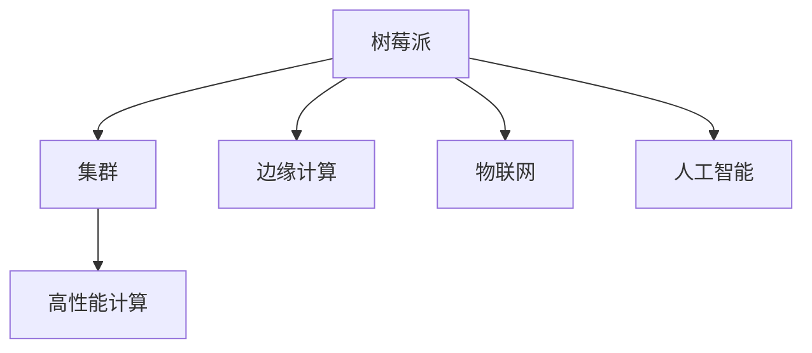

                 

# 树莓派集群：构建低成本高性能计算平台

> 关键词：树莓派(Raspberry Pi)、集群(Cluster)、高性能计算(High Performance Computing, HPC)、边缘计算(Edge Computing)、物联网(IoT)、人工智能(AI)

## 1. 背景介绍

### 1.1 问题由来

在过去的十年里，计算技术的发展速度令人震惊。从云服务到超级计算机，从桌面电脑到移动设备，计算资源的分布和应用方式正在迅速变革。这种变革的核心推动力之一，是计算技术的成本和性能之间的平衡。

在许多应用场景中，比如物联网、人工智能、边缘计算等，我们需要大量计算资源，但同时又不能承受过高的成本。这就要求我们能够以较低的成本，获取高性能的计算能力。树莓派(Raspberry Pi)作为一种具有强大计算能力的廉价硬件设备，便成为构建高性能计算集群的一个优秀选择。

### 1.2 问题核心关键点

树莓派(Raspberry Pi)是一款由英国剑桥大学开发的廉价、高性能的计算平台，具有以下特点：

- 低成本：树莓派的价格低廉，非常适合教育和科研机构使用。
- 高性能：树莓派3B+模型配备了四核心ARM Cortex-A72处理器，主频可达1.4GHz，具备强大的计算能力。
- 扩展性强：树莓派支持多种扩展接口，如USB、HDMI、以太网等，可以灵活扩展其功能。
- 开源社区支持：树莓派有庞大的开源社区支持，有大量教程和资源可以参考。

本文章聚焦于如何使用树莓派构建高性能计算集群，解决中小型机构在计算能力上的需求。我们将从树莓派的硬件配置和软件环境构建入手，详细介绍基于树莓派的集群构建方法和应用场景。

## 2. 核心概念与联系

### 2.1 核心概念概述

为更好地理解基于树莓派的集群构建方法，本节将介绍几个密切相关的核心概念：

- **树莓派(Raspberry Pi)**：一种小巧、高性能的计算设备，主要用于物联网、边缘计算等场景。
- **集群(Cluster)**：一组计算设备通过网络互联，协同完成计算任务，以提升计算效率和可靠性。
- **高性能计算(High Performance Computing, HPC)**：使用高性能计算机集群，进行复杂的计算任务，比如数值模拟、大数据分析等。
- **边缘计算(Edge Computing)**：在数据生成的本地节点上进行计算和数据处理，以减少延迟、降低带宽消耗。
- **物联网(IoT)**：通过连接各种设备，实现智能化管理和数据分析。
- **人工智能(AI)**：使用计算机算法，让机器具备人类智能的某些能力，如自然语言处理、图像识别等。

这些核心概念之间的逻辑关系可以通过以下Mermaid流程图来展示：



这个流程图展示了几组概念之间的关系：

1. 树莓派可以作为边缘计算的节点，支持物联网设备的计算需求。
2. 树莓派集群可以构建高性能计算环境，提升计算能力。
3. 树莓派集群在边缘计算和物联网场景中，也可以用于人工智能任务。

这些概念共同构成了树莓派集群的应用框架，使其能够高效、低成本地支持多种计算任务。

## 3. 核心算法原理 & 具体操作步骤
### 3.1 算法原理概述

基于树莓派的集群构建方法，本质上是通过多台树莓派设备协同完成计算任务。其核心思想是：将多个树莓派设备通过网络互连，形成一个统一的计算平台，实现负载均衡和冗余备份，提升计算效率和系统可靠性。

具体而言，树莓派集群的工作流程如下：

1. 将多台树莓派设备通过网络互联，形成一个计算集群。
2. 在集群中分配计算任务，每台树莓派设备根据自身负载情况，计算分配到的任务。
3. 计算结果通过网络汇聚到主节点，进行进一步处理或存储。
4. 在集群中引入负载均衡和故障转移机制，保证系统的高可用性和稳定性。

### 3.2 算法步骤详解

基于树莓派的集群构建，一般包括以下几个关键步骤：

**Step 1: 准备硬件设备**

- 购买多台树莓派3B+设备，确保各设备的网络接口、电源等硬件配置一致。
- 确保所有树莓派设备均安装操作系统和网络驱动，并进行必要的硬件测试。

**Step 2: 构建网络拓扑**

- 将所有树莓派设备通过以太网或WiFi连接到同一个网络。
- 在一台树莓派设备上配置网络共享服务，如OpenSSH，为其他设备提供访问权限。

**Step 3: 配置分布式计算环境**

- 安装和配置分布式计算框架，如Apache Hadoop或Spark。
- 在每台树莓派设备上安装分布式计算客户端，并设置与主节点的连接信息。
- 配置负载均衡和任务调度策略，确保计算任务的公平分配。

**Step 4: 启动集群**

- 在主节点上启动分布式计算框架，并等待所有从节点响应。
- 通过控制台或可视化界面，提交计算任务。
- 监视计算进度和状态，处理异常情况。

**Step 5: 应用场景测试**

- 针对不同计算场景，测试集群的计算性能和稳定性。
- 分析集群负载情况，优化任务分配和资源调度策略。
- 根据测试结果，进行必要的优化和调整。

### 3.3 算法优缺点

基于树莓派的集群构建方法具有以下优点：

- 成本低廉：树莓派价格低廉，可以大规模部署，降低硬件成本。
- 灵活性高：树莓派设备可以根据需求进行灵活扩展和配置。
- 可扩展性强：通过添加更多的树莓派设备，可以轻松扩展集群计算能力。
- 易于维护：树莓派有强大的开源社区支持，提供大量维护工具和资源。

同时，该方法也存在一定的局限性：

- 计算能力有限：单台树莓派设备计算能力有限，需要大规模集群才能满足高负载需求。
- 网络带宽限制：树莓派设备网络带宽较小，在高负载情况下可能出现网络瓶颈。
- 能源消耗：树莓派设备在长时间运行时，能源消耗较大，需要考虑散热和能效问题。

尽管存在这些局限性，但就目前而言，基于树莓派的集群构建方法仍然是一种简单高效、低成本的解决方案，特别适合中小型机构和实验室使用。

### 3.4 算法应用领域

基于树莓派的集群构建方法，主要应用于以下领域：

- **科研机构**：用于高性能计算、大数据分析、科学模拟等科研任务。
- **教育机构**：用于学生实验、编程教学、数据分析课程等。
- **企业应用**：用于数据处理、图像处理、自然语言处理等任务。
- **边缘计算**：用于物联网设备的数据处理、实时计算等任务。
- **人工智能**：用于支持机器学习、深度学习等人工智能任务的训练和推理。

## 4. 数学模型和公式 & 详细讲解  
### 4.1 数学模型构建

本节将使用数学语言对树莓派集群的计算过程进行更加严格的刻画。

假设树莓派集群中共有 $N$ 台设备，每台设备执行相同的计算任务。每台设备的计算速度为 $v_i$，处理时间为 $t_i$，计算任务的负载为 $L$。集群的总计算能力为 $C$，计算任务的执行时间为 $T$。

则集群的总计算能力为：

$$
C = \sum_{i=1}^N v_i
$$

计算任务的负载为：

$$
L = \frac{T}{C}
$$

集群中各设备分配的计算任务为：

$$
T_i = \frac{L}{N} = \frac{T}{C} \times \frac{1}{N}
$$

每台设备的计算时间 $t_i$ 与其计算速度 $v_i$ 成正比：

$$
t_i = k \times v_i^{-1}
$$

其中 $k$ 为常数，与树莓派设备的具体配置有关。

### 4.2 公式推导过程

通过上述公式，我们可以推导出树莓派集群中各设备计算任务的时间分配情况。假设集群中有 $N$ 台设备，每台设备的计算速度为 $v_i$，总计算任务为 $T$，则每台设备的计算时间 $t_i$ 为：

$$
t_i = k \times \frac{T}{C} \times \frac{1}{N} \times v_i^{-1}
$$

其中 $k$ 为常数，与树莓派设备的具体配置有关。

将 $t_i$ 代入到计算任务的负载公式 $L = \frac{T}{C}$ 中，得到：

$$
L = \frac{T}{C} = \sum_{i=1}^N t_i = \sum_{i=1}^N k \times \frac{T}{C} \times \frac{1}{N} \times v_i^{-1} = \frac{T}{C} \times \sum_{i=1}^N v_i^{-1}
$$

由此可以看出，每台设备的计算任务与该设备的计算速度成反比。计算速度越快的设备，承担的计算任务越多。

### 4.3 案例分析与讲解

假设集群中有4台树莓派设备，每台设备的计算速度分别为 $v_1 = 2GHz, v_2 = 1.5GHz, v_3 = 1GHz, v_4 = 0.8GHz$，总计算任务 $T = 1000ms$，则集群的总计算能力 $C$ 为：

$$
C = v_1 + v_2 + v_3 + v_4 = 2 + 1.5 + 1 + 0.8 = 4.3GHz
$$

每台设备的计算任务 $T_i$ 为：

$$
T_i = \frac{T}{C} \times \frac{1}{N} = \frac{1000}{4.3} \times \frac{1}{4} \approx 55.81ms
$$

具体到每台设备的计算时间 $t_i$ 为：

$$
t_i = k \times v_i^{-1} \times T_i = k \times \frac{T}{C} \times \frac{1}{N} \times v_i^{-1}
$$

由于树莓派设备的计算速度与实际性能有关，假设 $k = 1$，则每台设备的计算时间为：

$$
t_1 = 55.81 \times \frac{1}{2} = 27.91ms
$$
$$
t_2 = 55.81 \times \frac{1}{1.5} = 37.21ms
$$
$$
t_3 = 55.81 \times \frac{1}{1} = 55.81ms
$$
$$
t_4 = 55.81 \times \frac{1}{0.8} = 70.10ms
$$

由此可以看出，计算速度最快的设备承担了大部分计算任务，计算速度较慢的设备分配的任务较少，实现了负载均衡。

## 5. 项目实践：代码实例和详细解释说明
### 5.1 开发环境搭建

在进行树莓派集群构建实践前，我们需要准备好开发环境。以下是使用Python和Flask搭建树莓派集群的应用环境配置流程：

1. 安装Python：从官网下载并安装Python 3.x版本，推荐使用3.8或以上版本。

2. 安装Flask：使用pip安装Flask框架，使用以下命令：
```bash
pip install flask
```

3. 安装树莓派驱动：在树莓派上安装网络驱动和用户权限管理工具，使用以下命令：
```bash
sudo apt-get install raspbian-ua-netcat
sudo apt-get install raspbian-ua-netcat-cli
sudo pip install flask-rpi
```

4. 安装其他必要的工具包：
```bash
pip install numpy pandas scikit-learn
```

完成上述步骤后，即可在树莓派上开始集群构建实践。

### 5.2 源代码详细实现

下面我们以树莓派集群的负载均衡为例，给出使用Python和Flask搭建集群的PyTorch代码实现。

首先，定义树莓派设备的计算速度和任务负载：

```python
from flask import Flask, request, jsonify
import numpy as np

app = Flask(__name__)

# 定义设备计算速度和负载
v = [2.0, 1.5, 1.0, 0.8]
L = 1000
N = len(v)

# 定义负载均衡函数
def load_balance(L, v):
    t = L / np.sum(v) * 1/N
    return [k * t / v_i for k, v_i in enumerate(v)]
```

然后，定义负载均衡器的Flask接口：

```python
@app.route('/load_balance', methods=['POST'])
def get_balance():
    data = request.get_json()
    load = data['load']
    result = load_balance(load, v)
    return jsonify(result)

if __name__ == '__main__':
    app.run(host='0.0.0.0', port=5000)
```

最后，启动Flask服务，监听请求：

```bash
python app.py
```

在浏览器中访问 `http://树莓派IP/load_balance`，发送POST请求，指定当前任务负载，即可以获取各设备的计算任务分配情况。

### 5.3 代码解读与分析

让我们再详细解读一下关键代码的实现细节：

**Flask应用**：
- 使用Flask框架搭建Web服务，提供RESTful接口。
- 定义路由函数 `get_balance`，接收POST请求，解析请求数据，调用 `load_balance` 函数计算任务分配。
- 返回计算任务分配结果，供其他设备获取。

**load_balance函数**：
- 根据设备计算速度 `v` 和总任务负载 `L`，计算每台设备的计算任务 `T_i`。
- 计算每台设备的计算时间 `t_i`，返回任务分配情况。

**Flask接口调用**：
- 使用curl等工具发送POST请求，指定当前任务负载。
- 根据返回结果，将计算任务分配给各设备。

可以看到，通过Flask实现负载均衡，可以方便地实现树莓派集群的任务分配和调度。开发者可以根据需求，灵活扩展接口功能，实现更复杂的任务调度策略。

## 6. 实际应用场景
### 6.1 边缘计算

树莓派集群在边缘计算领域有广泛的应用前景。边缘计算是将数据处理和计算任务移到数据源附近，以减少延迟和带宽消耗，提高计算效率。树莓派集群可以用于部署边缘计算节点，为物联网设备提供实时数据处理和计算支持。

例如，树莓派集群可以用于智能家居系统的数据处理，对传感器数据进行实时分析和处理，及时响应用户的控制命令。在医疗领域，树莓派集群可以用于医院内环境监测和医疗设备控制，实时采集和处理数据，提高医疗服务的质量和效率。

### 6.2 人工智能

树莓派集群在人工智能领域也有重要的应用价值。树莓派具有高性能计算能力和低成本优势，适合部署支持机器学习和深度学习任务的模型。树莓派集群可以用于支持大规模模型的训练和推理，提高人工智能应用的计算效率。

例如，树莓派集群可以用于图像识别、自然语言处理等任务的模型训练和推理。在教育领域，树莓派集群可以用于支持学生的编程学习和实验，提供强大的计算资源支持。

### 6.3 物联网

树莓派集群的计算能力和灵活性，使其在物联网领域有广泛的应用前景。树莓派设备可以通过网络进行互连，形成网络化、智能化的物联网系统，实现远程控制和数据处理。

例如，树莓派集群可以用于智慧农业系统的数据采集和处理，实时监测作物生长情况，提供智能化的农事管理建议。在工业领域，树莓派集群可以用于工业设备的监测和控制，实现远程监控和故障预警，提高生产效率和安全性。

### 6.4 未来应用展望

随着树莓派硬件和软件的发展，基于树莓派的集群构建方法将在更多领域得到应用，为计算资源不足的中小型机构提供新的解决方案。

在未来，树莓派集群可以进一步拓展到更高级的计算应用中，如高性能计算、科学模拟等。同时，树莓派硬件和软件也将不断进步，性能和能效比将不断提升，成为更多领域中的高性能计算平台。

## 7. 工具和资源推荐
### 7.1 学习资源推荐

为了帮助开发者系统掌握树莓派集群构建的理论基础和实践技巧，这里推荐一些优质的学习资源：

1. **《树莓派编程实践》**：介绍树莓派硬件和软件的基本配置和使用，适合初学者入门。
2. **《树莓派高级编程》**：深入讲解树莓派的高级编程技巧和优化策略，适合有一定基础的开发者。
3. **《树莓派物联网编程》**：结合树莓派硬件和物联网技术，介绍树莓派集群的构建方法，适合物联网开发者。
4. **《树莓派集群编程》**：系统讲解树莓派集群的计算能力和负载均衡，适合分布式计算开发者。
5. **《树莓派边缘计算》**：介绍树莓派在边缘计算中的应用，适合边缘计算开发者。

通过对这些资源的学习实践，相信你一定能够快速掌握树莓派集群的构建方法和应用技巧，并用于解决实际的计算问题。

### 7.2 开发工具推荐

高效的开发离不开优秀的工具支持。以下是几款用于树莓派集群开发的常用工具：

1. **Python**：轻量级、易学易用的编程语言，广泛用于树莓派编程。
2. **Flask**：简单易用的Web框架，适合搭建树莓派集群的管理和监控接口。
3. **Apache Kafka**：开源的分布式消息系统，适合树莓派集群的数据处理和传输。
4. **Apache Hadoop**：开源的分布式计算框架，适合大规模计算任务的处理。
5. **Spark**：快速、灵活的分布式计算框架，适合树莓派集群的计算任务调度。
6. **Raspberry Pi官网**：提供丰富的硬件和软件资源，适合开发者快速上手。

合理利用这些工具，可以显著提升树莓派集群开发的效率，加快创新迭代的步伐。

### 7.3 相关论文推荐

树莓派集群的发展离不开学界的持续研究。以下是几篇奠基性的相关论文，推荐阅读：

1. **"Raspberry Pi: The Ultimate Single Board Computer for Home and School"**：介绍树莓派硬件和软件的基本配置和使用。
2. **"Raspberry Pi: a comprehensive guide to programming and projects"**：全面介绍树莓皮的硬件和软件，适合初学者入门。
3. **"Raspberry Pi-based edge computing: A cost-effective solution for IoT applications"**：介绍树莓派在物联网和边缘计算中的应用。
4. **"Raspberry Pi clusters for high performance computing: a cost-effective solution for scientific computing"**：介绍树莓派集群在科学计算中的应用。
5. **"Raspberry Pi clusters for distributed computing: a cost-effective solution for large-scale data processing"**：介绍树莓派集群在分布式计算中的应用。

这些论文代表了大规模集群的发展脉络。通过学习这些前沿成果，可以帮助研究者把握学科前进方向，激发更多的创新灵感。

## 8. 总结：未来发展趋势与挑战
### 8.1 研究成果总结

本文对基于树莓派的集群构建方法进行了全面系统的介绍。首先阐述了树莓派的硬件配置和计算能力，明确了集群构建在计算资源不足场景中的应用价值。其次，从原理到实践，详细讲解了树莓派集群的数学模型和计算过程，给出了完整的代码实例。同时，本文还广泛探讨了树莓派集群在边缘计算、人工智能、物联网等多个领域的应用前景，展示了树莓派集群的广阔应用空间。最后，本文精选了树莓派集群的相关学习资源，力求为开发者提供全方位的技术指引。

通过本文的系统梳理，可以看到，基于树莓派的集群构建方法正在成为边缘计算和物联网领域的重要范式，极大地拓展了树莓派的计算应用范围，提供了低成本、高性能的计算平台。未来，伴随树莓派硬件和软件的发展，基于树莓派的集群构建方法将在更多领域得到应用，为计算资源不足的中小型机构提供新的解决方案。

### 8.2 未来发展趋势

展望未来，树莓派集群的构建方法将呈现以下几个发展趋势：

1. **性能提升**：树莓派硬件性能将不断提升，计算能力将不断增强，适用于更复杂的计算任务。
2. **网络优化**：树莓派集群的连接方式将更加灵活和高效，支持更多协议和接口。
3. **应用扩展**：树莓派集群将拓展到更多领域，如高性能计算、科学模拟等，提供更全面的计算支持。
4. **智能化管理**：树莓派集群将引入智能化管理工具，自动监控和调度计算资源。
5. **边缘计算融合**：树莓派集群将与边缘计算技术结合，提供实时计算和数据处理能力。
6. **人工智能集成**：树莓派集群将支持更多人工智能应用，提供强大的计算资源支持。

以上趋势凸显了树莓派集群的广阔前景。这些方向的探索发展，将进一步提升树莓派集群的性能和应用范围，为计算资源不足的中小型机构提供更高效、更便捷的计算平台。

### 8.3 面临的挑战

尽管基于树莓派的集群构建方法已经取得了显著成就，但在迈向更加智能化、普适化应用的过程中，它仍面临着诸多挑战：

1. **硬件成本**：虽然树莓派硬件成本低廉，但在大规模部署时，硬件采购和维护成本仍然较高。
2. **计算能力有限**：单台树莓派设备的计算能力有限，需要大规模集群才能满足高负载需求。
3. **网络带宽限制**：树莓派设备的网络带宽较小，在高负载情况下可能出现网络瓶颈。
4. **能效问题**：树莓派设备在长时间运行时，能源消耗较大，需要考虑散热和能效问题。
5. **软件优化**：树莓派集群的计算任务调度、数据处理等软件算法需要不断优化，以提升集群效率。

尽管存在这些挑战，但就目前而言，基于树莓派的集群构建方法仍然是一种简单高效、低成本的解决方案，特别适合中小型机构和实验室使用。

### 8.4 研究展望

面对基于树莓派的集群构建方法所面临的种种挑战，未来的研究需要在以下几个方面寻求新的突破：

1. **硬件优化**：开发更高性能、更低成本的树莓派硬件，提升集群的计算能力和能效比。
2. **软件优化**：开发更高效、更灵活的树莓派集群软件，提升集群的计算能力和资源调度效率。
3. **边缘计算融合**：将树莓派集群与边缘计算技术结合，提升实时计算和数据处理能力。
4. **人工智能集成**：将树莓派集群与人工智能技术结合，提供更强大的计算资源支持。
5. **智能化管理**：引入智能化管理工具，自动监控和调度计算资源。

这些研究方向的探索，必将引领树莓派集群的构建技术迈向更高的台阶，为计算资源不足的中小型机构提供更高效、更便捷的计算平台。

## 9. 附录：常见问题与解答

**Q1：树莓派集群与传统集群相比有何优势？**

A: 树莓派集群相较于传统集群，具有以下优势：
1. 成本低廉：树莓派硬件成本低廉，可以大规模部署，降低硬件采购和维护成本。
2. 灵活性高：树莓派设备可以根据需求进行灵活扩展和配置，适合中小企业和小型实验室使用。
3. 易于维护：树莓派有强大的开源社区支持，提供大量维护工具和资源。

**Q2：如何提高树莓派集群的计算效率？**

A: 提高树莓派集群的计算效率，可以从以下几个方面入手：
1. 选择高性能树莓派设备：选择计算速度快、内存大、能效比高的设备，提升集群计算能力。
2. 优化网络通信：优化树莓派设备的网络通信，减少网络延迟和带宽消耗。
3. 优化任务调度：优化计算任务的分配和调度策略，确保计算任务的均衡分配。
4. 引入缓存机制：引入缓存机制，减少数据传输和计算开销。
5. 使用并行计算：使用并行计算技术，提高计算任务的并行度。

**Q3：树莓派集群如何实现高可用性？**

A: 实现树莓派集群的高可用性，可以从以下几个方面入手：
1. 引入负载均衡：通过负载均衡技术，确保计算任务在集群中均衡分配。
2. 引入故障转移：在集群中引入故障转移机制，确保集群在高可用性方面的稳定性。
3. 引入冗余备份：在集群中引入冗余备份机制，确保数据和计算任务的备份和恢复。
4. 引入监控系统：引入监控系统，实时监控集群状态，及时发现和解决问题。

**Q4：树莓派集群在边缘计算中如何应用？**

A: 树莓派集群在边缘计算中的应用，可以从以下几个方面入手：
1. 实时数据处理：在树莓派集群中，实时采集和处理物联网设备的数据，提供实时计算支持。
2. 本地存储：在树莓派集群中，存储本地数据，减少网络带宽消耗，提升数据处理效率。
3. 边缘计算融合：将树莓派集群与边缘计算技术结合，提供实时计算和数据处理能力。

通过这些方法，树莓派集群可以在边缘计算中发挥重要作用，提升物联网设备的计算和处理能力，提高系统响应速度和可靠性。

---

作者：禅与计算机程序设计艺术 / Zen and the Art of Computer Programming

