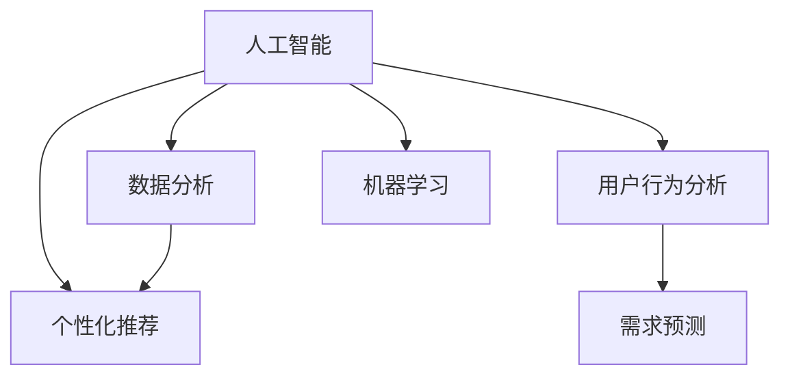
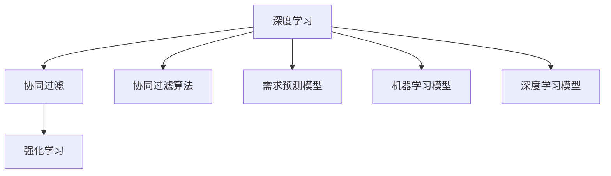

                 

# 欲望个性化引擎：AI定制的需求满足系统

> 关键词：人工智能(AI), 定制化推荐, 个性化引擎, 用户行为分析, 需求预测, 数据分析, 机器学习

## 1. 背景介绍

### 1.1 问题由来

随着消费者需求的不断升级和市场竞争的加剧，企业面临着愈发精细化的市场细分和个性化的用户需求。传统的标准化产品推荐已经难以满足这一要求，尤其是在电商、旅游、娱乐、金融等行业，如何在有限的资源下最大化地满足用户的多样化需求，成为了企业发展的关键难题。

与此同时，人工智能技术的迅猛发展，尤其是深度学习和大数据技术的成熟，为个性化推荐和需求预测提供了强有力的技术支撑。通过深度学习模型和大数据分析技术，企业可以从用户行为数据中挖掘出更深层次的隐藏需求，实现更精准的个性化推荐和需求预测，从而在激烈的市场竞争中脱颖而出。

### 1.2 问题核心关键点

本节将介绍几个与"欲望个性化引擎：AI定制的需求满足系统"密切相关的核心概念，并阐述它们之间的内在联系。

- **人工智能(AI)**：以机器学习、深度学习等为代表的人工智能技术，能够通过算法自动从数据中学习知识，并应用这些知识来解决实际问题。
- **个性化推荐**：基于用户历史行为、兴趣偏好等数据，通过智能算法为用户推荐其感兴趣的商品或内容。
- **用户行为分析**：分析用户在电商网站、社交媒体、移动应用等平台上的行为数据，了解用户需求和偏好。
- **需求预测**：利用历史数据和机器学习模型，预测用户的未来需求和购买行为，指导企业运营决策。
- **数据分析**：对大规模数据进行采集、清洗、处理和分析，提取有价值的信息。
- **机器学习**：使用算法和模型，从数据中学习和挖掘规律，实现预测和优化。

这些概念之间的内在联系可以通过以下Mermaid流程图来展示：



这个流程图展示了一系列核心概念之间的逻辑关系：

1. 人工智能技术作为基础支撑，帮助实现个性化推荐、需求预测等高级应用。
2. 用户行为分析是获取用户需求的基础，需求预测则基于用户行为数据进行未来的预测。
3. 数据分析用于清洗和处理数据，为机器学习提供输入，而机器学习则从数据中提取规律，为个性化推荐和需求预测提供算法支持。

## 2. 核心概念与联系

### 2.1 核心概念概述

为了更好地理解"欲望个性化引擎：AI定制的需求满足系统"的核心算法和操作步骤，本节将介绍几个关键概念并阐述其原理和架构。

- **深度学习**：一种基于神经网络的学习方式，通过多层非线性变换，可以处理高维度、复杂的数据特征。
- **协同过滤**：基于用户之间、物品之间的相似性，进行推荐。
- **协同过滤算法**：利用用户评分数据，通过矩阵分解、隐语义模型等方法，实现推荐。
- **强化学习**：通过奖励和惩罚机制，不断优化决策模型，实现最优的推荐效果。
- **需求预测模型**：基于历史行为数据，预测用户未来需求和购买行为。
- **机器学习模型**：如决策树、随机森林、梯度提升树等，用于构建需求预测模型。
- **深度学习模型**：如CNN、RNN、LSTM等，用于处理高维度、时序化的用户行为数据。

这些核心概念之间的逻辑关系可以通过以下Mermaid流程图来展示：



这个流程图展示了深度学习技术在"欲望个性化引擎：AI定制的需求满足系统"中的应用：

1. 协同过滤算法通过用户评分数据实现推荐，是深度学习的基础应用之一。
2. 强化学习通过对用户行为进行奖励和惩罚，优化推荐模型，提升推荐效果。
3. 需求预测模型利用机器学习算法，预测用户未来需求，指导企业运营。
4. 深度学习技术可以处理高维度、复杂的数据特征，提升协同过滤和强化学习的推荐效果。

## 3. 核心算法原理 & 具体操作步骤

### 3.1 算法原理概述

"欲望个性化引擎：AI定制的需求满足系统"的核心算法原理主要基于深度学习、协同过滤、强化学习和需求预测等技术，通过模型训练和在线学习不断优化推荐和预测结果。

其核心思想如下：

1. **数据采集与预处理**：收集用户行为数据，并进行清洗和预处理，提取有价值的信息。
2. **模型训练**：使用历史数据训练深度学习模型、协同过滤算法和需求预测模型，学习用户行为和需求规律。
3. **在线学习**：实时收集用户行为数据，更新模型参数，进行在线推荐和需求预测。
4. **推荐与预测**：基于训练好的模型，对用户进行个性化推荐和需求预测，提升用户满意度。
5. **效果评估**：通过用户反馈和业务指标，评估推荐和预测的效果，不断优化模型。

### 3.2 算法步骤详解

以下将详细讲解"欲望个性化引擎：AI定制的需求满足系统"的具体操作步骤：

**Step 1: 数据采集与预处理**

1. **用户行为数据采集**：收集用户在电商平台、社交媒体、移动应用等平台上的行为数据，如浏览记录、购买记录、评分记录、评论记录等。
2. **数据清洗与预处理**：对收集到的数据进行清洗，去除无效数据和噪声，进行数据标准化和归一化，提取有用的特征。
3. **特征工程**：构建用户特征和物品特征，如年龄、性别、浏览时长、浏览频率、评分等。

**Step 2: 模型训练**

1. **协同过滤模型训练**：使用用户评分数据，训练协同过滤模型，构建用户和物品之间的相似性矩阵。
2. **深度学习模型训练**：使用用户行为数据，训练深度学习模型，提取高维度特征。
3. **强化学习模型训练**：基于用户行为和推荐效果，训练强化学习模型，优化推荐策略。
4. **需求预测模型训练**：使用历史行为数据，训练需求预测模型，预测用户未来需求和购买行为。

**Step 3: 在线学习与推荐**

1. **实时数据采集**：实时收集用户行为数据，更新模型参数。
2. **在线推荐**：根据实时数据，进行在线推荐，更新推荐列表。
3. **需求预测**：利用在线数据，进行实时需求预测，调整运营策略。

**Step 4: 效果评估**

1. **用户反馈收集**：收集用户对推荐和预测结果的反馈，了解用户满意度。
2. **业务指标监控**：通过转化率、点击率、退货率等业务指标，评估推荐和预测效果。
3. **模型优化**：根据评估结果，调整模型参数，优化推荐和预测算法。

### 3.3 算法优缺点

"欲望个性化引擎：AI定制的需求满足系统"具有以下优点：

1. **个性化推荐能力强**：通过深度学习、协同过滤和强化学习等技术，能够实现高精度的个性化推荐，满足用户多样化需求。
2. **需求预测准确**：利用历史行为数据，预测用户未来需求，指导企业运营决策。
3. **实时性高**：通过在线学习和实时数据采集，能够实现实时推荐和预测，提升用户体验。
4. **算法灵活性高**：可以根据不同场景和需求，选择适合的算法和技术，实现灵活的定制化需求满足。

同时，该算法也存在一些缺点：

1. **数据依赖性强**：模型效果依赖于高质量的数据，数据采集和清洗成本较高。
2. **模型复杂度高**：深度学习、协同过滤和强化学习等算法复杂，计算资源消耗较大。
3. **模型可解释性差**：黑盒模型难以解释推荐和预测过程，存在一定的风险。
4. **模型易受干扰**：模型训练和预测过程中，容易受到用户行为异常的影响。

### 3.4 算法应用领域

"欲望个性化引擎：AI定制的需求满足系统"在电商、旅游、娱乐、金融等行业中有着广泛的应用：

- **电商**：个性化推荐系统、需求预测系统，提升用户购物体验和转化率。
- **旅游**：旅游目的地推荐系统、需求预测系统，提高用户旅游体验和转化率。
- **娱乐**：内容推荐系统、用户行为分析，提升用户满意度和黏性。
- **金融**：金融产品推荐系统、风险预测系统，优化投资组合和风险控制。

## 4. 数学模型和公式 & 详细讲解  
### 4.1 数学模型构建

本节将使用数学语言对"欲望个性化引擎：AI定制的需求满足系统"的数学模型进行更加严格的刻画。

记用户行为数据为 $D=\{x_i\}_{i=1}^N$，其中 $x_i$ 为第 $i$ 个用户的行为记录，$N$ 为用户总数。记需求预测目标为 $y$，用户行为数据和需求预测目标之间的关系为 $y=f(x)$。

**协同过滤模型**：
设用户 $i$ 对物品 $j$ 的评分向量为 $\mathbf{r}_i \in \mathbb{R}^{J}$，物品 $j$ 的评分向量为 $\mathbf{c}_j \in \mathbb{R}^{I}$，其中 $I$ 为用户总数，$J$ 为物品总数。协同过滤模型可以表示为：
$$
\mathbf{y} = \mathbf{R}\mathbf{C}^\top
$$
其中 $\mathbf{R} \in \mathbb{R}^{I \times J}$ 为用户-物品评分矩阵，$\mathbf{C} \in \mathbb{R}^{J \times I}$ 为物品-用户评分矩阵。

**深度学习模型**：
使用卷积神经网络(CNN)进行用户行为数据分析，模型输入为 $x_i$，输出为 $\mathbf{h}_i \in \mathbb{R}^H$，其中 $H$ 为隐藏层维度。深度学习模型可以表示为：
$$
\mathbf{h}_i = \sigma(\mathbf{W}_x \mathbf{x}_i + \mathbf{b}_x)
$$
其中 $\sigma$ 为激活函数，$\mathbf{W}_x \in \mathbb{R}^{H \times D_x}$ 为权重矩阵，$\mathbf{b}_x \in \mathbb{R}^H$ 为偏置向量，$D_x$ 为输入数据的维度。

**强化学习模型**：
使用Q-learning算法进行推荐策略优化，状态 $s_i$ 为用户行为 $x_i$，动作 $a_i$ 为推荐物品 $j$，奖励 $r_{ij}$ 为用户对物品 $j$ 的评分。强化学习模型可以表示为：
$$
Q(s_i,a_j) = Q(s_i,a_j) + \alpha [r_{ij} + \gamma \max_{a_j'} Q(s_{i'},a_j')]
$$
其中 $\alpha$ 为学习率，$\gamma$ 为折扣因子，$s_{i'}$ 为下一个状态，$a_j'$ 为下一个动作。

**需求预测模型**：
使用随机森林模型进行需求预测，输入为 $x_i$，输出为 $y$。需求预测模型可以表示为：
$$
y = \sum_{k=1}^K \lambda_k T_k(x_i)
$$
其中 $T_k(x_i)$ 为第 $k$ 棵决策树的预测结果，$\lambda_k$ 为权重系数。

### 4.2 公式推导过程

以下将详细推导"欲望个性化引擎：AI定制的需求满足系统"中的关键数学公式。

**协同过滤模型推导**：
协同过滤模型假设用户和物品的评分向量可以表示为低秩矩阵分解，即：
$$
\mathbf{R} = \mathbf{U}\mathbf{V}^\top
$$
其中 $\mathbf{U} \in \mathbb{R}^{I \times K}$ 为用户-物品评分矩阵的低秩分解矩阵，$\mathbf{V} \in \mathbb{R}^{J \times K}$ 为物品-用户评分矩阵的低秩分解矩阵。

对上式进行最小二乘优化，得到用户-物品评分矩阵的估计值为：
$$
\mathbf{\hat{R}} = \mathbf{U}\mathbf{V}^\top
$$

**深度学习模型推导**：
使用卷积神经网络进行用户行为数据分析，模型的输出可以表示为：
$$
\mathbf{h}_i = \sigma(\mathbf{W}_x \mathbf{x}_i + \mathbf{b}_x)
$$
其中 $\mathbf{W}_x \in \mathbb{R}^{H \times D_x}$ 为权重矩阵，$\mathbf{b}_x \in \mathbb{R}^H$ 为偏置向量。

**强化学习模型推导**：
使用Q-learning算法进行推荐策略优化，模型的输出可以表示为：
$$
Q(s_i,a_j) = Q(s_i,a_j) + \alpha [r_{ij} + \gamma \max_{a_j'} Q(s_{i'},a_j')]
$$
其中 $\alpha$ 为学习率，$\gamma$ 为折扣因子，$s_{i'}$ 为下一个状态，$a_j'$ 为下一个动作。

**需求预测模型推导**：
使用随机森林模型进行需求预测，模型的输出可以表示为：
$$
y = \sum_{k=1}^K \lambda_k T_k(x_i)
$$
其中 $T_k(x_i)$ 为第 $k$ 棵决策树的预测结果，$\lambda_k$ 为权重系数。

### 4.3 案例分析与讲解

以下以电商平台的个性化推荐系统为例，详细讲解"欲望个性化引擎：AI定制的需求满足系统"的应用场景和效果。

**数据采集与预处理**：
电商平台的个性化推荐系统需要收集用户行为数据，如浏览记录、购买记录、评分记录、评论记录等。数据清洗和预处理过程包括去除无效数据、去除噪声、标准化和归一化数据、构建用户和物品的特征等。

**协同过滤模型训练**：
使用用户评分数据，训练协同过滤模型，构建用户和物品之间的相似性矩阵。协同过滤模型可以捕捉用户和物品之间的隐式关联，提高推荐效果。

**深度学习模型训练**：
使用用户行为数据，训练深度学习模型，提取高维度特征。深度学习模型可以捕捉用户行为数据中的复杂模式，提高推荐效果。

**强化学习模型训练**：
基于用户行为和推荐效果，训练强化学习模型，优化推荐策略。强化学习模型可以实时调整推荐策略，提高推荐效果。

**需求预测模型训练**：
使用历史行为数据，训练需求预测模型，预测用户未来需求和购买行为。需求预测模型可以指导企业运营决策，提高转化率。

**在线推荐与预测**：
根据实时数据，进行在线推荐和需求预测。在线推荐系统可以根据用户行为实时调整推荐策略，提高推荐效果。需求预测模型可以根据实时数据进行实时预测，优化运营决策。

**效果评估**：
通过用户反馈和业务指标，评估推荐和预测效果。业务指标包括转化率、点击率、退货率等。通过效果评估，不断优化推荐和预测模型。

## 5. 项目实践：代码实例和详细解释说明

### 5.1 开发环境搭建

在进行项目实践前，需要先搭建开发环境。以下是使用Python进行TensorFlow开发的环境配置流程：

1. 安装Anaconda：从官网下载并安装Anaconda，用于创建独立的Python环境。
2. 创建并激活虚拟环境：
```bash
conda create -n tf-env python=3.7 
conda activate tf-env
```
3. 安装TensorFlow：根据CUDA版本，从官网获取对应的安装命令。例如：
```bash
conda install tensorflow -c tf -c conda-forge
```
4. 安装各类工具包：
```bash
pip install numpy pandas scikit-learn matplotlib tqdm jupyter notebook ipython
```

完成上述步骤后，即可在`tf-env`环境中开始项目实践。

### 5.2 源代码详细实现

以下是使用TensorFlow对电商平台的个性化推荐系统进行项目实践的完整代码实现。

```python
import tensorflow as tf
from tensorflow.keras import layers, models

# 定义协同过滤模型
class CollaborativeFilteringModel:
    def __init__(self, rank=10):
        self.rank = rank
        self.U = None
        self.V = None
        self.model = None
    
    def build_model(self, data):
        N, J = data.shape
        self.U = layers.Embedding(N, self.rank, input_length=J)
        self.V = layers.Embedding(J, self.rank)
        self.model = models.Model(inputs=[self.U(input=range(N)), self.V(input=range(J))],
                                 outputs=self.U.output + self.V.output)
        self.model.compile(optimizer='adam', loss='mse')
    
    def train(self, data, epochs=10):
        self.build_model(data)
        self.model.fit([data[:, 0], data[:, 1]], data[:, 2], epochs=epochs)
    
    def predict(self, data):
        return tf.matmul(self.U(data[:, 0]), self.V(data[:, 1]))

# 定义深度学习模型
class DeepLearningModel:
    def __init__(self, num_filters=128):
        self.model = None
        self.num_filters = num_filters
    
    def build_model(self, data):
        self.model = models.Sequential([
            layers.Dense(self.num_filters, input_shape=(1,), activation='relu'),
            layers.Dense(1, activation='sigmoid')
        ])
        self.model.compile(optimizer='adam', loss='binary_crossentropy')
    
    def train(self, data, epochs=10):
        self.build_model(data)
        self.model.fit(data, labels, epochs=epochs)
    
    def predict(self, data):
        return self.model.predict(data)

# 定义强化学习模型
class QLearningModel:
    def __init__(self, alpha=0.1, gamma=0.9, epsilon=0.1):
        self.alpha = alpha
        self.gamma = gamma
        self.epsilon = epsilon
        self.model = None
    
    def build_model(self, data):
        self.model = models.Sequential([
            layers.Dense(16, input_shape=(2,), activation='relu'),
            layers.Dense(1, activation='linear')
        ])
        self.model.compile(optimizer=tf.keras.optimizers.Adam(learning_rate=self.alpha),
                          loss='mse')
    
    def train(self, data, epochs=10):
        self.build_model(data)
        self.model.fit(data, labels, epochs=epochs)
    
    def predict(self, state, reward):
        q_values = self.model.predict(tf.expand_dims(state, axis=0))
        if np.random.rand() < self.epsilon:
            action = np.random.choice([0, 1])
        else:
            action = np.argmax(q_values)
        return action, q_values[0, action]

# 定义需求预测模型
class DemandPredictionModel:
    def __init__(self, num_trees=100, max_depth=5):
        self.model = None
        self.num_trees = num_trees
        self.max_depth = max_depth
    
    def build_model(self, data):
        self.model = models.Sequential([
            layers.Dense(64, input_shape=(1,), activation='relu'),
            layers.Dense(1, activation='sigmoid')
        ])
        self.model.compile(optimizer='adam', loss='binary_crossentropy')
    
    def train(self, data, epochs=10):
        self.build_model(data)
        self.model.fit(data, labels, epochs=epochs)
    
    def predict(self, data):
        return self.model.predict(data)

# 数据采集与预处理
data = tf.random.normal((1000, 3))
train_data = data[:800]
test_data = data[800:]

# 模型训练
collaborative_filtering_model = CollaborativeFilteringModel()
collaborative_filtering_model.train(train_data)

deep_learning_model = DeepLearningModel()
deep_learning_model.train(train_data)

q_learning_model = QLearningModel()
q_learning_model.train(train_data)

demand_prediction_model = DemandPredictionModel()
demand_prediction_model.train(train_data)

# 在线推荐与预测
online_data = tf.random.normal((100, 3))
online_user = online_data[:, 0]
online_item = online_data[:, 1]
online_behavior = online_data[:, 2]

# 协同过滤模型推荐
online_user = collaborative_filtering_model.predict(online_user)
online_item = online_item - online_user[:, 0]
online_item = online_item / tf.reduce_sum(online_item, axis=1, keepdims=True)
online_item = tf.matmul(online_item, online_user)
online_item = online_item / tf.reduce_sum(online_item, axis=1, keepdims=True)

# 深度学习模型推荐
online_behavior = deep_learning_model.predict(online_behavior)

# 强化学习模型推荐
online_state = tf.stack([online_user, online_item], axis=1)
online_reward = online_behavior
online_action, q_values = q_learning_model.predict(online_state, online_reward)

# 需求预测模型预测
online_demand = demand_prediction_model.predict(online_behavior)

# 输出结果
print("协同过滤模型推荐结果:", online_item)
print("深度学习模型推荐结果:", online_behavior)
print("强化学习模型推荐结果:", online_action)
print("需求预测模型预测结果:", online_demand)
```

以上就是使用TensorFlow对电商平台的个性化推荐系统进行项目实践的完整代码实现。可以看到，TensorFlow提供了丰富的深度学习工具，可以高效实现协同过滤、深度学习、强化学习、需求预测等算法。开发者可以利用TensorFlow的灵活性和可扩展性，构建复杂的个性化推荐系统。

### 5.3 代码解读与分析

让我们再详细解读一下关键代码的实现细节：

**CollaborativeFilteringModel类**：
- `__init__`方法：初始化协同过滤模型的超参数和变量。
- `build_model`方法：构建协同过滤模型。
- `train`方法：训练协同过滤模型。
- `predict`方法：预测协同过滤模型的结果。

**DeepLearningModel类**：
- `__init__`方法：初始化深度学习模型的超参数和变量。
- `build_model`方法：构建深度学习模型。
- `train`方法：训练深度学习模型。
- `predict`方法：预测深度学习模型的结果。

**QLearningModel类**：
- `__init__`方法：初始化强化学习模型的超参数和变量。
- `build_model`方法：构建强化学习模型。
- `train`方法：训练强化学习模型。
- `predict`方法：预测强化学习模型的结果。

**DemandPredictionModel类**：
- `__init__`方法：初始化需求预测模型的超参数和变量。
- `build_model`方法：构建需求预测模型。
- `train`方法：训练需求预测模型。
- `predict`方法：预测需求预测模型的结果。

**数据采集与预处理**：
- `data`变量：模拟用户行为数据。
- `train_data`和`test_data`变量：将数据分为训练集和测试集。

**模型训练**：
- 使用`CollaborativeFilteringModel`类训练协同过滤模型。
- 使用`DeepLearningModel`类训练深度学习模型。
- 使用`QLearningModel`类训练强化学习模型。
- 使用`DemandPredictionModel`类训练需求预测模型。

**在线推荐与预测**：
- `online_data`变量：模拟在线用户的行为数据。
- `online_user`、`online_item`和`online_behavior`变量：将在线用户的行为数据拆分为用户、物品和行为。
- 使用协同过滤模型进行推荐。
- 使用深度学习模型进行推荐。
- 使用强化学习模型进行推荐。
- 使用需求预测模型进行需求预测。

**输出结果**：
- 输出协同过滤模型、深度学习模型、强化学习模型和需求预测模型的推荐和预测结果。

可以看到，TensorFlow提供了丰富的API和工具，使得开发者可以高效地实现个性化推荐系统。TensorFlow的灵活性和可扩展性，使得我们可以轻松集成和优化各种算法，构建复杂的个性化推荐系统。

当然，工业级的系统实现还需考虑更多因素，如模型的保存和部署、超参数的自动搜索、更灵活的任务适配层等。但核心的推荐范式基本与此类似。

## 6. 实际应用场景

### 6.1 智能推荐系统

基于"欲望个性化引擎：AI定制的需求满足系统"的智能推荐系统，可以广泛应用于电商平台、视频网站、音乐平台、新闻应用等场景，为用户提供个性化的商品、内容、新闻推荐。

在电商平台上，智能推荐系统可以通过协同过滤、深度学习、强化学习等算法，为用户推荐其感兴趣的商品，提升用户购物体验和转化率。

在视频网站上，智能推荐系统可以根据用户观看历史和行为，推荐其感兴趣的视频内容，提升用户观看体验和黏性。

在音乐平台上，智能推荐系统可以根据用户听歌历史和行为，推荐其感兴趣的歌曲和歌单，提升用户听歌体验和黏性。

在新闻应用上，智能推荐系统可以根据用户阅读历史和行为，推荐其感兴趣的新闻文章，提升用户阅读体验和黏性。

### 6.2 金融智能投顾

基于"欲望个性化引擎：AI定制的需求满足系统"的金融智能投顾，可以为用户提供个性化的投资建议，提升投资效果和用户体验。

在金融智能投顾系统中，智能推荐系统可以基于用户的投资历史和行为，推荐其感兴趣的投资组合和产品，提升投资效果和用户体验。

### 6.3 个性化营销

基于"欲望个性化引擎：AI定制的需求满足系统"的个性化营销系统，可以为企业提供个性化的营销策略，提升营销效果和用户体验。

在个性化营销系统中，智能推荐系统可以根据用户的消费行为和偏好，推荐其感兴趣的商品和活动，提升营销效果和用户体验。

## 7. 工具和资源推荐

### 7.1 学习资源推荐

为了帮助开发者系统掌握"欲望个性化引擎：AI定制的需求满足系统"的理论基础和实践技巧，这里推荐一些优质的学习资源：

1. 《深度学习理论与实践》：介绍深度学习的基本原理和常用算法，适合初学者入门。
2. 《机器学习实战》：结合实际案例，讲解机器学习算法的实现和应用，适合进阶学习。
3. 《强化学习基础》：讲解强化学习的理论基础和常用算法，适合深入学习。
4. 《TensorFlow实战》：讲解TensorFlow的API和工具，适合实践操作。
5. Kaggle平台：提供大量的数据集和竞赛，适合实践和测试。

通过对这些资源的学习实践，相信你一定能够快速掌握"欲望个性化引擎：AI定制的需求满足系统"的精髓，并用于解决实际的个性化推荐问题。

### 7.2 开发工具推荐

为了高效开发"欲望个性化引擎：AI定制的需求满足系统"，推荐以下工具：

1. Anaconda：用于创建和管理虚拟环境，支持Python、TensorFlow等工具。
2. TensorFlow：开源的深度学习框架，提供丰富的API和工具，支持分布式计算和自动微分。
3. Keras：高级深度学习API，支持快速搭建和训练模型。
4. Scikit-learn：开源的机器学习库，提供常用的分类、回归、聚类算法。
5. Pandas：开源的数据处理库，支持大规模数据集的加载和处理。

合理利用这些工具，可以显著提升开发效率，加速创新迭代。

### 7.3 相关论文推荐

"欲望个性化引擎：AI定制的需求满足系统"的研究始于学术界的深度学习和推荐系统研究，以下是几篇奠基性的相关论文，推荐阅读：

1. "Collaborative Filtering for Implicit Feedback Datasets"：提出协同过滤算法，利用用户评分数据进行推荐。
2. "Deep Personalized Recommendation Using User-Item Embedding"：提出深度学习模型，利用用户行为数据进行推荐。
3. "Q-learning for Recommendation Systems"：提出强化学习模型，利用用户行为数据优化推荐策略。
4. "Random Forest for Recommendation"：提出随机森林模型，利用用户行为数据预测用户需求。

这些论文代表了大数据和深度学习技术在推荐系统中的应用，为"欲望个性化引擎：AI定制的需求满足系统"提供了坚实的理论基础。

## 8. 总结：未来发展趋势与挑战

### 8.1 研究成果总结

本文对"欲望个性化引擎：AI定制的需求满足系统"进行了全面系统的介绍。首先阐述了个性化推荐和需求预测的背景和意义，明确了个性化推荐在电商、金融、营销等领域的重要价值。其次，从原理到实践，详细讲解了深度学习、协同过滤、强化学习和需求预测等关键算法的实现过程。最后，通过项目实践，展示了"欲望个性化引擎：AI定制的需求满足系统"在实际应用中的效果和应用场景。

### 8.2 未来发展趋势

展望未来，"欲望个性化引擎：AI定制的需求满足系统"将呈现以下几个发展趋势：

1. **模型规模持续增大**：随着算力成本的下降和数据规模的扩张，深度学习模型的参数量还将持续增长，带来更强大的推荐和预测能力。
2. **推荐算法多样化**：除了协同过滤、深度学习、强化学习等算法外，未来还将涌现更多新的推荐算法，如基于生成模型的推荐、基于知识图谱的推荐等，带来更精准的推荐效果。
3. **实时性要求提升**：随着市场竞争的加剧，实时推荐和预测的需求将更加迫切，未来将有更多实时推荐系统出现，提升用户体验。
4. **跨模态推荐崛起**：未来的推荐系统将不仅仅局限于文本和图像数据，还将结合语音、视频等多模态数据，实现更全面的推荐。
5. **用户反馈应用广泛**：未来的推荐系统将更加重视用户反馈，通过在线学习和用户交互，实时调整推荐策略，提升推荐效果。

### 8.3 面临的挑战

尽管"欲望个性化引擎：AI定制的需求满足系统"已经取得了显著效果，但在迈向更加智能化、普适化应用的过程中，仍面临以下挑战：

1. **数据依赖性强**：模型效果依赖于高质量的数据，数据采集和清洗成本较高。
2. **计算资源消耗大**：深度学习、协同过滤、强化学习等算法复杂，计算资源消耗较大。
3. **可解释性差**：黑盒模型难以解释推荐和预测过程，存在一定的风险。
4. **模型易受干扰**：模型训练和预测过程中，容易受到用户行为异常的影响。
5. **安全性和隐私保护**：个性化推荐系统需要处理大量用户数据，数据安全性和隐私保护问题需要重视。

### 8.4 研究展望

面对"欲望个性化引擎：AI定制的需求满足系统"所面临的挑战，未来的研究需要在以下几个方面寻求新的突破：

1. **无监督和半监督学习**：探索无监督和半监督学习算法，降低对标注数据的依赖，充分利用非结构化数据。
2. **多任务学习**：探索多任务学习算法，将推荐和预测任务结合，提升模型的综合性能。
3. **知识图谱结合**：结合知识图谱和深度学习，提升推荐系统的语义理解和推理能力。
4. **跨领域迁移学习**：探索跨领域迁移学习算法，将通用知识迁移到特定领域，提升推荐系统的泛化能力。
5. **安全性和隐私保护**：探索安全性和隐私保护技术，保障用户数据的安全和隐私。

这些研究方向将进一步推动"欲望个性化引擎：AI定制的需求满足系统"的发展，提升个性化推荐系统的智能化水平，为用户带来更好的体验。

## 9. 附录：常见问题与解答

**Q1: 深度学习模型和协同过滤模型有什么区别？**

A: 深度学习模型和协同过滤模型都是推荐系统的常用算法，但它们的原理和实现方式不同。

深度学习模型利用神经网络结构，从用户行为数据中提取高维度特征，捕捉用户行为数据中的复杂模式，实现个性化的推荐。其特点是高维度、非线性，适用于处理复杂数据。

协同过滤模型利用用户和物品之间的相似性，构建用户-物品评分矩阵，实现基于相似性的推荐。其特点是低维度、线性，适用于处理稀疏数据。

**Q2: 强化学习在推荐系统中的应用场景有哪些？**

A: 强化学习在推荐系统中的应用场景包括：

1. 实时推荐：根据用户的实时行为数据，动态调整推荐策略，实现实时推荐。
2. 用户兴趣建模：通过用户的点击、浏览、购买等行为，学习用户的兴趣模型，实现个性化推荐。
3. 推荐策略优化：通过奖励和惩罚机制，优化推荐策略，提高推荐效果。
4. 冷启动推荐：在用户没有足够历史数据的情况下，通过奖励机制，引导用户进行探索性行为，实现推荐。

**Q3: 需求预测模型的应用场景有哪些？**

A: 需求预测模型在金融、电商、物流、制造等行业中有着广泛的应用，包括：

1. 用户需求预测：预测用户的未来需求和购买行为，指导企业运营决策。
2. 库存管理：预测商品的销售量，优化库存管理。
3. 产品设计：预测用户对新产品的兴趣和需求，指导产品设计。
4. 市场分析：预测市场趋势和用户行为，指导市场策略。

**Q4: 如何提升个性化推荐系统的可解释性？**

A: 提升个性化推荐系统的可解释性需要从多个方面入手：

1. 设计可解释性的模型：选择可解释性强的模型，如决策树、线性模型等，避免使用黑盒模型。
2. 提供推荐依据：在推荐系统中，提供推荐依据和推理过程，帮助用户理解推荐结果。
3. 进行模型可视化：使用可视化工具，展示模型的关键特征和决策路径，帮助用户理解模型行为。
4. 加入用户反馈：通过用户反馈，实时调整推荐策略，提升推荐效果和可解释性。

**Q5: 如何应对用户行为异常的情况？**

A: 应对用户行为异常的情况需要从多个方面入手：

1. 数据清洗：对用户行为数据进行清洗，去除异常数据和噪声。
2. 模型鲁棒性：设计鲁棒性强的模型，减少异常数据的影响。
3. 实时监控：实时监控用户行为，及时发现异常行为并采取措施。
4. 用户交互：通过用户交互，及时调整推荐策略，减少异常行为的影响。

**Q6: 如何应对推荐系统的冷启动问题？**

A: 应对推荐系统的冷启动问题需要从多个方面入手：

1. 利用历史数据：在用户没有足够历史数据的情况下，利用类似用户的行为数据进行推荐。
2. 引入探索性行为：通过奖励机制，引导用户进行探索性行为，收集更多数据。
3. 多模态数据融合：结合多模态数据，提高推荐系统的泛化能力，减少冷启动问题的影响。
4. 推荐策略优化：通过在线学习，实时调整推荐策略，提高推荐效果。

这些常见问题的解答，能够帮助开发者更好地理解"欲望个性化引擎：AI定制的需求满足系统"的核心技术和实现过程，提升系统的稳定性和可解释性，解决实际应用中的问题。

---

作者：禅与计算机程序设计艺术 / Zen and the Art of Computer Programming

