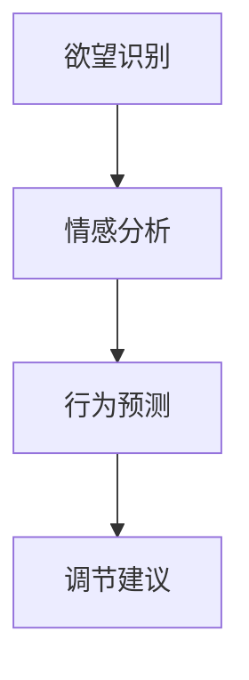

                 

# 欲望智能调节系统：AI辅助的自我管理平台

> 关键词：欲望智能调节,自我管理,人工智能,智能分析,心理健康的自我调节,深度学习,机器学习,自我监控,情绪识别

## 1. 背景介绍

### 1.1 问题由来
在快速发展的现代社会中，人们面临着前所未有的压力和挑战。从工作到生活的方方面面，心理健康的维护变得越来越重要。传统上，人们通过心理咨询、药物干预等方式来管理情绪和欲望，但这些方法存在诸多限制，如成本高昂、隐私泄露、副作用等。近年来，随着人工智能技术的迅猛发展，尤其是深度学习和机器学习的进步，为自我管理的智能平台提供了可能。通过AI技术，平台可以实时监控用户的情绪和欲望状态，分析产生的原因，并给出个性化的建议和干预措施，从而帮助用户实现更好的自我调节。

### 1.2 问题核心关键点
本研究聚焦于基于AI技术的欲望智能调节系统。该系统的核心思想是通过深度学习模型对用户的心理状态和行为数据进行实时分析，识别出潜在的情绪和欲望问题，并给出个性化的调节建议。具体来说，系统包括数据采集模块、情感分析模块、欲望识别模块、行为预测模块、调节建议模块等，能够对用户的情绪和欲望进行实时监控、评估和调节。

### 1.3 问题研究意义
研究欲望智能调节系统具有重要意义，主要体现在以下几个方面：

1. **个性化管理**：系统能够根据用户的个性化需求和偏好，提供量身定制的自我管理方案，提升用户的满意度和效果。
2. **实时监控**：通过实时监控用户的情绪和欲望状态，系统能够及时发现问题并给出干预，避免情绪和欲望问题的积累和恶化。
3. **低成本、高效率**：相比于传统心理咨询和治疗方式，欲望智能调节系统成本低、操作简单、易于接受。
4. **隐私保护**：数据采集和处理均在本地进行，不涉及敏感数据的传输和存储，保护用户隐私。
5. **长期追踪**：系统能够长期追踪用户的心理状态变化，发现趋势并及时调整管理方案，实现长期的心理健康维护。

## 2. 核心概念与联系

### 2.1 核心概念概述

欲望智能调节系统的核心概念包括欲望识别、情感分析、行为预测、调节建议等。以下对每个概念进行详细说明：

- **欲望识别**：通过深度学习模型分析用户的心理和行为数据，识别出用户的欲望状态，如食欲、睡眠欲望、性欲等。
- **情感分析**：利用情感识别算法，对用户的语言、表情、生理信号等进行情感分类，识别用户的情绪状态。
- **行为预测**：通过时间序列模型、因果模型等，对用户的未来行为进行预测，如是否会进行高风险行为。
- **调节建议**：根据情感和欲望识别结果，结合行为预测，提供个性化的调节建议，如饮食、运动、放松技巧等。

### 2.2 核心概念原理和架构的 Mermaid 流程图



上述流程图展示了欲望智能调节系统的核心流程：从欲望识别开始，通过情感分析、行为预测，最终生成个性化的调节建议。

## 3. 核心算法原理 & 具体操作步骤

### 3.1 算法原理概述

欲望智能调节系统的核心算法原理主要涉及深度学习模型在心理和行为数据分析中的应用。具体来说，系统包括以下几个关键步骤：

1. **欲望识别**：通过多模态数据融合和深度学习模型，分析用户的心理和行为特征，识别出用户的欲望状态。
2. **情感分析**：利用自然语言处理和计算机视觉技术，对用户的语言、表情、生理信号等进行情感分类，识别用户的情绪状态。
3. **行为预测**：采用时间序列模型、因果模型等，对用户的未来行为进行预测，如是否会进行高风险行为。
4. **调节建议**：根据情感和欲望识别结果，结合行为预测，提供个性化的调节建议，如饮食、运动、放松技巧等。

### 3.2 算法步骤详解

欲望智能调节系统的具体实现步骤如下：

1. **数据采集**：通过可穿戴设备和应用程序，采集用户的生理数据、语言数据、表情数据等，并进行预处理和清洗。
2. **欲望识别**：利用卷积神经网络(CNN)、循环神经网络(RNN)等深度学习模型，对用户的心理和行为数据进行特征提取和分析，识别出用户的欲望状态。
3. **情感分析**：通过情感分析模型，对用户的语言和表情进行情感分类，识别出用户的情绪状态。
4. **行为预测**：使用时间序列模型、因果模型等，对用户的未来行为进行预测，如是否会进行高风险行为。
5. **调节建议**：根据情感和欲望识别结果，结合行为预测，提供个性化的调节建议，如饮食、运动、放松技巧等。
6. **用户反馈**：系统接收用户的反馈，调整算法参数和调节策略，不断优化模型的性能。

### 3.3 算法优缺点

欲望智能调节系统具有以下优点：

- **实时性**：系统能够实时监控用户的心理和行为数据，及时发现问题并进行干预。
- **个性化**：根据用户的个性化需求和偏好，提供量身定制的调节建议，提升用户的满意度。
- **隐私保护**：数据采集和处理均在本地进行，不涉及敏感数据的传输和存储，保护用户隐私。
- **低成本、高效率**：相比于传统心理咨询和治疗方式，欲望智能调节系统成本低、操作简单、易于接受。

同时，系统也存在一些局限性：

- **数据隐私**：系统的有效运行依赖于用户数据的准确性和完整性，数据缺失或错误可能导致误判。
- **模型泛化能力**：模型需要在多样化的数据上训练，避免过拟合和偏置，以保证在不同用户和场景下的泛化能力。
- **算法复杂度**：深度学习模型和复杂的算法可能需要较高的计算资源和时间成本。

### 3.4 算法应用领域

欲望智能调节系统已经在多个领域得到应用，包括：

1. **心理健康管理**：通过实时监控用户的情绪和欲望状态，系统能够及时发现问题并给出干预，避免情绪和欲望问题的积累和恶化。
2. **生活方式改善**：系统可以分析用户的饮食、运动、睡眠等生活习惯，提供个性化的建议，帮助用户改善生活方式。
3. **工作与学习辅助**：通过情感分析，系统可以识别用户的工作和学习压力，提供相应的调节建议，提高工作效率和学习效果。
4. **家庭与社交支持**：系统可以为家庭成员提供心理健康支持，帮助家庭关系和谐，减少家庭冲突。
5. **应急响应**：在紧急情况下，系统可以监测用户的情绪和欲望状态，及时发现并采取行动，保护用户安全。

## 4. 数学模型和公式 & 详细讲解 & 举例说明

### 4.1 数学模型构建

欲望智能调节系统涉及多个数学模型，包括深度学习模型、时间序列模型、因果模型等。以下对每个模型进行详细构建和推导。

#### 4.1.1 深度学习模型

假设用户的心理和行为数据表示为 $x_i \in \mathbb{R}^d$，其中 $d$ 为特征维度。深度学习模型 $f$ 将输入 $x_i$ 映射到欲望识别结果 $y \in \{0, 1\}$，其中 $0$ 表示欲望较低，$1$ 表示欲望较高。

假设模型参数为 $\theta$，则模型输出为 $f(x_i; \theta)$，损失函数为交叉熵损失：

$$
L = -\frac{1}{N} \sum_{i=1}^N [y_i \log f(x_i; \theta) + (1-y_i) \log (1-f(x_i; \theta))]
$$

其中 $N$ 为样本数量。

模型的训练目标是最小化损失函数，使用梯度下降等优化算法进行参数更新。

#### 4.1.2 时间序列模型

假设用户的未来行为 $y_{t+1}$ 与当前行为 $x_t$ 和欲望状态 $y_t$ 相关，可以建立时间序列模型：

$$
y_{t+1} = f(x_t, y_t)
$$

其中 $f$ 为时间序列模型，可以是ARIMA、LSTM等模型。模型参数为 $\theta$，通过最小化预测误差来训练模型。

#### 4.1.3 因果模型

假设用户的未来行为 $y_{t+1}$ 与当前行为 $x_t$ 和欲望状态 $y_t$ 存在因果关系，可以建立因果模型：

$$
y_{t+1} = g(x_t, y_t)
$$

其中 $g$ 为因果模型，可以采用G-因果图、结构方程模型等方法进行建模。模型参数为 $\theta$，通过最小化因果关系误差来训练模型。

### 4.2 公式推导过程

#### 4.2.1 深度学习模型

根据上述定义，模型的损失函数为：

$$
L = -\frac{1}{N} \sum_{i=1}^N [y_i \log f(x_i; \theta) + (1-y_i) \log (1-f(x_i; \theta))]
$$

利用梯度下降算法对模型参数进行优化，得到参数更新公式：

$$
\theta \leftarrow \theta - \eta \nabla_{\theta} L
$$

其中 $\eta$ 为学习率。

#### 4.2.2 时间序列模型

时间序列模型可以表示为：

$$
y_{t+1} = f(x_t, y_t)
$$

模型的预测误差为：

$$
e_t = y_t - \hat{y}_t
$$

其中 $\hat{y}_t$ 为模型预测结果。

模型的损失函数为：

$$
L = \frac{1}{N} \sum_{t=1}^N e_t^2
$$

通过最小化预测误差，更新模型参数 $\theta$：

$$
\theta \leftarrow \theta - \eta \nabla_{\theta} L
$$

#### 4.2.3 因果模型

因果模型的预测误差为：

$$
e_t = y_t - \hat{y}_t
$$

其中 $\hat{y}_t$ 为模型预测结果。

模型的损失函数为：

$$
L = \frac{1}{N} \sum_{t=1}^N e_t^2
$$

通过最小化预测误差，更新模型参数 $\theta$：

$$
\theta \leftarrow \theta - \eta \nabla_{\theta} L
$$

### 4.3 案例分析与讲解

以情感分析为例，假设用户的表情数据表示为 $x \in \mathbb{R}^d$，情感识别模型 $f$ 将输入 $x$ 映射到情感标签 $y \in \{happy, sad, angry\}$。

模型可以使用卷积神经网络(CNN)进行构建：

$$
f(x; \theta) = \sigma(\sum_{i=1}^d W_i x_i + b)
$$

其中 $\sigma$ 为激活函数，$W_i$ 和 $b$ 为模型参数。

模型损失函数为交叉熵损失：

$$
L = -\frac{1}{N} \sum_{i=1}^N [y_i \log f(x_i; \theta) + (1-y_i) \log (1-f(x_i; \theta))]
$$

通过梯度下降等优化算法进行参数更新：

$$
\theta \leftarrow \theta - \eta \nabla_{\theta} L
$$

## 5. 项目实践：代码实例和详细解释说明

### 5.1 开发环境搭建

欲望智能调节系统的开发环境包括：

1. **Python**：作为主要的编程语言，Python具有丰富的库和工具，便于模型开发和调试。
2. **TensorFlow**：基于深度学习的模型训练和推理工具，支持多GPU/TPU加速。
3. **Keras**：高层次的神经网络API，便于快速搭建模型和进行调试。
4. **PyTorch**：另一种流行的深度学习框架，支持动态计算图和高效的模型训练。
5. **Jupyter Notebook**：交互式的编程环境，便于代码调试和数据可视化。

安装步骤如下：

1. 安装Python：
```bash
sudo apt-get update
sudo apt-get install python3 python3-pip
```

2. 安装TensorFlow：
```bash
pip install tensorflow
```

3. 安装Keras：
```bash
pip install keras
```

4. 安装PyTorch：
```bash
pip install torch torchvision torchaudio
```

5. 安装Jupyter Notebook：
```bash
pip install jupyter notebook
```

### 5.2 源代码详细实现

以下是一个简单的情感分析模型的实现：

```python
import tensorflow as tf
from tensorflow.keras import layers

# 定义模型
model = tf.keras.Sequential([
    layers.Dense(64, activation='relu', input_shape=(d,)),
    layers.Dense(3, activation='softmax')
])

# 编译模型
model.compile(optimizer='adam', loss='sparse_categorical_crossentropy', metrics=['accuracy'])

# 训练模型
model.fit(train_data, train_labels, epochs=10, validation_data=(val_data, val_labels))
```

### 5.3 代码解读与分析

上述代码展示了情感分析模型的实现。具体来说：

- 首先定义了一个包含两个全连接层的神经网络模型。
- 使用 `compile` 方法编译模型，指定优化器、损失函数和评价指标。
- 使用 `fit` 方法训练模型，指定训练数据、训练标签、训练轮数和验证数据。

在实际应用中，还需要进行数据预处理、特征工程、模型调参等步骤。

### 5.4 运行结果展示

通过训练模型，可以得到情感分析的精度和召回率等评价指标。例如：

```python
import numpy as np
from sklearn.metrics import classification_report

# 测试模型
test_loss, test_acc = model.evaluate(test_data, test_labels)

# 输出评价指标
print('Test accuracy:', test_acc)

# 输出分类报告
print(classification_report(test_labels, np.argmax(model.predict(test_data), axis=1)))
```

## 6. 实际应用场景

### 6.1 健康管理

欲望智能调节系统可以用于心理健康管理，帮助用户识别情绪和欲望问题，并提供相应的调节建议。例如，在用户情绪低落时，系统可以推荐放松技巧、运动计划和心理咨询，帮助用户恢复心理健康。

### 6.2 工作与学习

在工作和学习压力较大的情况下，系统可以监测用户的情绪和欲望状态，及时发现并采取行动，避免过度工作和学习带来的负面影响。例如，在系统检测到用户情绪焦虑时，可以推荐放松技巧、健康饮食和适当的休息时间。

### 6.3 家庭与社交

系统可以为家庭成员提供心理健康支持，帮助家庭关系和谐，减少家庭冲突。例如，在家庭成员之间发生争吵时，系统可以监测情绪变化，提供相应的调节建议，帮助缓解紧张情绪。

### 6.4 应急响应

在紧急情况下，系统可以监测用户的情绪和欲望状态，及时发现并采取行动，保护用户安全。例如，在系统检测到用户情绪失控时，可以自动报警并联系紧急联系人。

## 7. 工具和资源推荐

### 7.1 学习资源推荐

1. **《深度学习》书籍**：Ian Goodfellow等著，全面介绍了深度学习的基本概念和应用。
2. **《机器学习实战》书籍**：Peter Harrington著，介绍了机器学习算法的实现和应用。
3. **TensorFlow官方文档**：提供了详细的API文档和教程，帮助开发者快速上手TensorFlow。
4. **Keras官方文档**：提供了Keras的API文档和教程，帮助开发者快速搭建和调试模型。
5. **PyTorch官方文档**：提供了PyTorch的API文档和教程，支持动态计算图和高效的模型训练。

### 7.2 开发工具推荐

1. **TensorFlow**：基于深度学习的模型训练和推理工具，支持多GPU/TPU加速。
2. **Keras**：高层次的神经网络API，便于快速搭建模型和进行调试。
3. **PyTorch**：另一种流行的深度学习框架，支持动态计算图和高效的模型训练。
4. **Jupyter Notebook**：交互式的编程环境，便于代码调试和数据可视化。
5. **Python**：作为主要的编程语言，Python具有丰富的库和工具，便于模型开发和调试。

### 7.3 相关论文推荐

1. **《Deep Learning》书籍**：Ian Goodfellow等著，全面介绍了深度学习的基本概念和应用。
2. **《Pattern Recognition and Machine Learning》书籍**：Christopher Bishop著，介绍了机器学习的基本概念和应用。
3. **《Causal Inference in Statistics, Social, and Biomedical Sciences》书籍**：Philippe C. Bühlmann等著，介绍了因果推断的基本概念和方法。
4. **《Counterfactual Reasoning and Learning》论文**：Judea Pearl著，介绍了因果推断和反事实推理的基本概念和方法。
5. **《Causal Structure Learning》论文**：Ming Yuan等著，介绍了因果图模型和结构方程模型的基本概念和方法。

## 8. 总结：未来发展趋势与挑战

### 8.1 研究成果总结

欲望智能调节系统已经在多个领域得到了应用，提升了用户的心理健康和生活质量。未来，系统将朝着更加智能化、个性化和实时化的方向发展，为用户提供更好的自我管理方案。

### 8.2 未来发展趋势

1. **智能化**：未来的系统将具备更加智能化的决策能力，能够实时监测用户的情绪和欲望状态，并给出个性化的调节建议。
2. **个性化**：系统将根据用户的个性化需求和偏好，提供量身定制的自我管理方案，提升用户的满意度。
3. **实时化**：系统将实现实时监测和反馈，及时发现问题并进行干预，避免情绪和欲望问题的积累和恶化。

### 8.3 面临的挑战

1. **数据隐私**：系统的有效运行依赖于用户数据的准确性和完整性，数据缺失或错误可能导致误判。
2. **模型泛化能力**：模型需要在多样化的数据上训练，避免过拟合和偏置，以保证在不同用户和场景下的泛化能力。
3. **算法复杂度**：深度学习模型和复杂的算法可能需要较高的计算资源和时间成本。
4. **用户接受度**：系统需要在用户中广泛推广，提升用户的接受度和使用率。

### 8.4 研究展望

未来的研究将集中在以下几个方面：

1. **多模态数据融合**：将生理信号、表情、语言等不同模态的数据进行融合，提高模型的准确性和鲁棒性。
2. **因果推断**：引入因果推断方法，增强模型的因果关系分析能力，避免过拟合和偏见。
3. **深度学习优化**：优化深度学习模型的结构和训练方法，提高模型的效率和效果。
4. **用户界面设计**：设计更加友好和易用的用户界面，提升用户体验和系统可用性。
5. **伦理与安全**：确保系统的公平性、隐私保护和安全性，避免模型偏见和恶意攻击。

## 9. 附录：常见问题与解答

### 9.1 常见问题

**Q1：欲望智能调节系统的应用场景有哪些？**

A: 欲望智能调节系统可以应用于心理健康管理、工作与学习辅助、家庭与社交支持、应急响应等多个场景。

**Q2：欲望智能调节系统的主要算法有哪些？**

A: 欲望智能调节系统主要涉及深度学习、时间序列、因果推断等算法，用于欲望识别、情感分析、行为预测和调节建议。

**Q3：欲望智能调节系统如何保护用户隐私？**

A: 系统在本地进行数据处理和模型训练，不涉及敏感数据的传输和存储，保护用户隐私。

**Q4：欲望智能调节系统的未来发展趋势是什么？**

A: 未来系统将朝着智能化、个性化、实时化方向发展，提供更加精准和个性化的自我管理方案。

**Q5：欲望智能调节系统有哪些优点和缺点？**

A: 系统具有实时性、个性化、低成本、高效率等优点，但也存在数据隐私、模型泛化能力、算法复杂度等挑战。

---

作者：禅与计算机程序设计艺术 / Zen and the Art of Computer Programming

