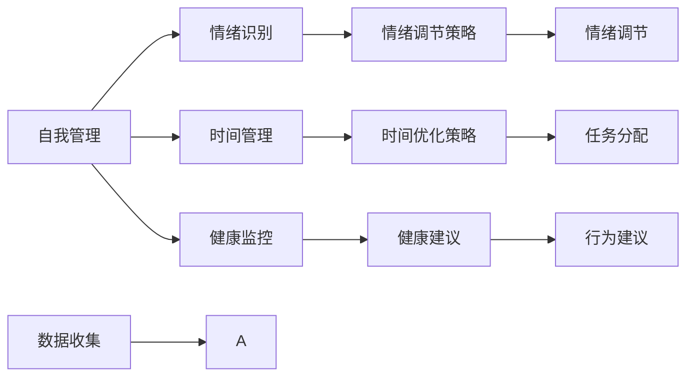

                 

## 1. 背景介绍

### 1.1 问题由来

在现代社会，人们的生活节奏越来越快，压力和焦虑成了每个人必须面对的问题。如何有效管理自我，保持身心健康，成为越来越多人关心的话题。在技术日益发达的今天，人工智能（AI）已经开始进入自我管理领域，借助AI技术，我们可以更智能地调节自己的情绪、提升效率，实现更加平衡的生活。

### 1.2 问题核心关键点

1. **自我管理的核心要素**：情绪调节、时间管理、目标设定、健康监控等。
2. **AI在自我管理中的应用**：AI辅助情绪识别、AI推荐时间管理策略、AI生成健康建议、AI分析行为数据等。
3. **AI辅助自我管理的优势**：个性化推荐、实时反馈、高效分析、持续改进等。

### 1.3 问题研究意义

AI辅助的自我管理系统能够根据用户的日常行为数据，智能推荐符合个人需求的时间管理策略、情绪调节技巧和健康建议，帮助用户提升效率、缓解压力，实现全面自我管理。研究这种系统的设计和实现，对于推动个性化自我管理和提升生活质量具有重要意义。

## 2. 核心概念与联系

### 2.1 核心概念概述

1. **自我管理（Self-Management）**：是指个人对自己生活的各个方面进行规划、控制和调整的过程，包括时间、情绪、健康、财务等方面。
2. **人工智能（Artificial Intelligence）**：是一种通过模拟人类的智能行为来执行任务的技术，包括机器学习、自然语言处理、计算机视觉等。
3. **情绪识别（Emotion Recognition）**：利用AI技术，识别和分析用户情绪状态，提供相应的调节建议。
4. **时间管理（Time Management）**：通过AI推荐优化时间分配，提升工作效率和任务完成度。
5. **健康监控（Health Monitoring）**：使用AI对用户的健康数据进行分析，提供个性化的健康建议。
6. **行为分析（Behavior Analysis）**：利用AI技术对用户行为进行分析和预测，提供改进建议。

### 2.2 核心概念原理和架构的 Mermaid 流程图(Mermaid 流程节点中不要有括号、逗号等特殊字符)



这个流程图展示了AI辅助的自我管理系统中的关键流程：

1. **数据收集（K）**：用户在日常活动中产生的数据被收集，用于后续分析和推荐。
2. **情绪识别（B）**：使用AI技术分析用户的情绪状态。
3. **时间管理（C）**：AI推荐时间优化策略，帮助用户更高效地完成任务。
4. **健康监控（D）**：通过AI分析用户健康数据，提供个性化的健康建议。
5. **行为分析（J）**：利用AI对用户行为进行分析和预测，提供改进建议。
6. **情绪调节（H）**：根据情绪识别结果，AI推荐情绪调节策略。
7. **任务分配（I）**：AI推荐任务分配策略，帮助用户合理规划工作。
8. **情绪调节策略（E）**：根据情绪识别结果，AI提供具体的情绪调节方法。
9. **时间优化策略（F）**：AI根据用户的工作习惯和任务优先级，推荐时间优化策略。
10. **健康建议（G）**：AI分析用户的健康数据，提供个性化的健康建议。

这些核心概念相互关联，共同构成了一个完整的AI辅助自我管理系统。

## 3. 核心算法原理 & 具体操作步骤

### 3.1 算法原理概述

AI辅助的自我管理系统通过收集用户的日常行为数据，利用机器学习、自然语言处理等技术，对数据进行分析，并根据分析结果提供个性化的建议。其核心算法包括：

1. **情绪识别算法**：使用深度学习模型，如卷积神经网络（CNN）或循环神经网络（RNN），对用户的文本输入、语音输入或面部表情进行情绪分析。
2. **时间管理算法**：使用强化学习或优化算法，如遗传算法或模拟退火算法，推荐时间优化策略，帮助用户更高效地完成任务。
3. **健康监控算法**：利用传感器数据和机器学习算法，分析用户的健康状况，提供个性化的健康建议。
4. **行为分析算法**：使用时间序列分析或决策树算法，对用户的行为进行分析和预测，提供改进建议。

### 3.2 算法步骤详解

#### 3.2.1 情绪识别算法步骤

1. **数据收集**：收集用户的文本输入、语音输入或面部表情数据。
2. **特征提取**：使用CNN或RNN对输入数据进行特征提取，得到高维特征向量。
3. **模型训练**：使用标注数据训练情感分类模型，如情感分类器或情感生成对抗网络（GAN）。
4. **情绪识别**：对用户的新输入进行情绪识别，输出情绪标签。

#### 3.2.2 时间管理算法步骤

1. **任务分类**：对用户的任务进行分类，如紧急任务、重要任务等。
2. **任务优先级排序**：根据任务的紧急程度和重要性，使用强化学习或优化算法对任务进行优先级排序。
3. **时间优化**：根据优先级排序和用户的日程安排，推荐时间优化策略，如时间块划分、任务分配等。

#### 3.2.3 健康监控算法步骤

1. **数据收集**：收集用户的健康数据，如步数、心率、睡眠质量等。
2. **特征提取**：使用统计方法或深度学习模型对健康数据进行特征提取。
3. **健康评估**：使用机器学习模型对用户健康数据进行评估，输出健康状态。
4. **健康建议**：根据健康评估结果，提供个性化的健康建议。

#### 3.2.4 行为分析算法步骤

1. **行为记录**：记录用户的行为数据，如工作时间、社交活动、饮食习惯等。
2. **行为建模**：使用时间序列分析或决策树算法对行为数据进行建模，建立行为模式。
3. **行为预测**：利用模型对用户未来的行为进行预测，识别出潜在的风险和改进点。
4. **行为建议**：根据行为预测结果，提供个性化的行为改进建议。

### 3.3 算法优缺点

#### 3.3.1 情绪识别算法的优缺点

**优点**：
- **实时性**：通过实时分析用户的输入，及时调整情绪调节策略。
- **个性化**：根据用户的输入类型（文本、语音、表情），提供个性化的情绪识别。
- **高准确性**：利用深度学习模型，提高情绪识别的准确性。

**缺点**：
- **隐私问题**：收集用户的情绪数据可能涉及隐私问题，需要严格保护用户隐私。
- **数据质量**：情绪识别的准确性受输入数据的质量和多样性影响较大。
- **模型复杂性**：深度学习模型需要大量的标注数据和计算资源进行训练，模型复杂度较高。

#### 3.3.2 时间管理算法的优缺点

**优点**：
- **高效性**：通过优化任务优先级和分配时间块，提高用户的工作效率。
- **自适应性**：根据用户的反馈和行为数据，动态调整时间管理策略。
- **多任务支持**：支持多个任务的优先级排序和时间分配，提升时间利用率。

**缺点**：
- **主观性**：用户的任务优先级可能受主观因素影响，算法推荐的策略需用户确认。
- **数据依赖**：算法的效果依赖于用户提供的数据质量，数据不足可能导致推荐不准确。
- **复杂度**：复杂的时间管理算法需要大量的计算资源和时间，实施难度较大。

#### 3.3.3 健康监控算法的优缺点

**优点**：
- **实时反馈**：实时监测用户的健康数据，及时调整生活方式。
- **个性化建议**：根据用户的健康数据，提供个性化的健康建议。
- **数据驱动**：利用机器学习算法，提高健康评估的准确性。

**缺点**：
- **隐私风险**：收集用户的健康数据可能涉及隐私问题，需严格保护。
- **数据局限性**：健康数据的质量和种类影响健康评估的准确性，数据不足可能导致评估不全面。
- **用户行为影响**：用户不遵循健康建议可能导致监控效果不佳。

#### 3.3.4 行为分析算法的优缺点

**优点**：
- **全面性**：涵盖用户的多个行为维度，提供全面的行为分析。
- **预测性**：利用历史数据预测用户未来的行为，提前发现潜在问题。
- **动态调整**：根据用户的反馈和行为变化，动态调整行为改进建议。

**缺点**：
- **数据依赖**：算法的效果依赖于用户提供的数据质量，数据不足可能导致预测不准确。
- **复杂性**：复杂的行为分析算法需要大量的计算资源和时间，实施难度较大。
- **用户配合度**：用户不配合行为记录可能导致数据缺失，影响分析结果。

### 3.4 算法应用领域

AI辅助的自我管理系统已经在多个领域得到应用，如：

1. **心理健康**：通过情绪识别和情绪调节，帮助用户缓解压力，提升心理健康水平。
2. **时间管理**：帮助用户优化时间分配，提升工作效率和生活质量。
3. **健康管理**：通过健康监控和健康建议，帮助用户保持身体健康。
4. **行为改进**：通过行为分析和行为建议，帮助用户养成良好的行为习惯。
5. **财务管理**：利用时间管理和健康监控数据，制定合理的财务计划。
6. **教育培训**：通过行为分析和学习时间管理，提升学习效率和效果。

这些应用领域展示了AI辅助自我管理系统的广泛适用性和深远影响。

## 4. 数学模型和公式 & 详细讲解 & 举例说明

### 4.1 数学模型构建

假设用户输入的情绪数据为 $X$，时间管理数据为 $T$，健康数据为 $H$，行为数据为 $B$。AI辅助的自我管理系统可以建模为如下数学模型：

$$
\begin{aligned}
M &= \min_{\theta} \mathcal{L}(X, T, H, B; \theta) \\
&= \mathcal{L}_E(X; \theta_E) + \mathcal{L}_T(T; \theta_T) + \mathcal{L}_H(H; \theta_H) + \mathcal{L}_B(B; \theta_B)
\end{aligned}
$$

其中，$\theta_E, \theta_T, \theta_H, \theta_B$ 分别为情绪识别、时间管理、健康监控和行为分析的模型参数。

### 4.2 公式推导过程

#### 4.2.1 情绪识别模型

设情绪识别模型的输入为 $X$，输出为情绪标签 $Y$，模型参数为 $\theta_E$。情绪识别的损失函数为交叉熵损失：

$$
\mathcal{L}_E(X; \theta_E) = -\frac{1}{N}\sum_{i=1}^N \sum_{j=1}^C y_{ij} \log \hat{y}_{ij}
$$

其中，$y_{ij}$ 表示用户输入 $X_i$ 对应的情绪标签，$\hat{y}_{ij}$ 表示模型预测的情绪标签概率。

#### 4.2.2 时间管理模型

设时间管理模型的输入为 $T$，输出为任务优先级排序 $Z$，模型参数为 $\theta_T$。时间管理的损失函数为交叉熵损失：

$$
\mathcal{L}_T(T; \theta_T) = -\frac{1}{N}\sum_{i=1}^N \sum_{j=1}^n z_{ij} \log \hat{z}_{ij}
$$

其中，$z_{ij}$ 表示任务 $T_i$ 的优先级，$\hat{z}_{ij}$ 表示模型预测的任务优先级概率。

#### 4.2.3 健康监控模型

设健康监控模型的输入为 $H$，输出为健康状态 $S$，模型参数为 $\theta_H$。健康监控的损失函数为均方误差损失：

$$
\mathcal{L}_H(H; \theta_H) = \frac{1}{N}\sum_{i=1}^N \sum_{j=1}^m (s_j - \hat{s}_j)^2
$$

其中，$s_j$ 表示用户健康数据 $H_i$ 的健康状态，$\hat{s}_j$ 表示模型预测的健康状态。

#### 4.2.4 行为分析模型

设行为分析模型的输入为 $B$，输出为行为改进建议 $R$，模型参数为 $\theta_B$。行为分析的损失函数为交叉熵损失：

$$
\mathcal{L}_B(B; \theta_B) = -\frac{1}{N}\sum_{i=1}^N \sum_{j=1}^k r_{ij} \log \hat{r}_{ij}
$$

其中，$r_{ij}$ 表示用户行为 $B_i$ 的行为改进建议，$\hat{r}_{ij}$ 表示模型预测的行为改进建议。

### 4.3 案例分析与讲解

**案例分析**：假设用户 $A$ 是一名软件开发者，经常面临高压工作、情绪波动和健康问题。使用AI辅助的自我管理系统，系统通过对 $A$ 的情绪数据、时间管理数据、健康数据和行为数据进行分析，提供个性化的建议。

**分析过程**：
1. **情绪识别**：系统分析 $A$ 的文本输入和语音输入，发现其情绪波动较大，经常处于焦虑和压力状态。
2. **时间管理**：系统根据 $A$ 的任务类型和工作习惯，推荐时间优化策略，如将紧急任务优先处理、将非工作时间用于放松等。
3. **健康监控**：系统通过分析 $A$ 的健康数据，发现其睡眠质量较差，建议增加运动和改善睡眠环境。
4. **行为分析**：系统通过分析 $A$ 的工作行为和社交行为，发现其加班时间较长，建议调整工作节奏，减少加班。

**建议结果**：
1. **情绪调节**：系统推荐情绪调节策略，如进行深呼吸练习、写日记缓解压力等。
2. **时间分配**：系统推荐时间优化策略，如将非高峰期用于休息和锻炼，提高工作效率。
3. **健康建议**：系统推荐健康建议，如调整饮食结构、改善睡眠质量等。
4. **行为改进**：系统推荐行为改进建议，如减少加班、增加休息时间等。

通过系统提供的多维建议，$A$ 逐渐改善了工作和生活状态，提高了生活质量和工作效率。

## 5. 项目实践：代码实例和详细解释说明

### 5.1 开发环境搭建

1. **安装Python**：从官网下载并安装Python 3.8，并确保环境变量配置正确。
2. **安装TensorFlow和Keras**：
```bash
pip install tensorflow
pip install keras
```
3. **安装TensorBoard**：
```bash
pip install tensorboard
```

### 5.2 源代码详细实现

#### 5.2.1 情绪识别模型

```python
import tensorflow as tf
from tensorflow.keras.models import Sequential
from tensorflow.keras.layers import Dense, Dropout, LSTM
from tensorflow.keras.optimizers import Adam

# 定义情绪识别模型
model = Sequential([
    LSTM(64, input_shape=(max_len, 1), return_sequences=True),
    Dropout(0.5),
    LSTM(32),
    Dropout(0.5),
    Dense(2, activation='softmax')
])

# 编译模型
model.compile(loss='categorical_crossentropy', optimizer=Adam(lr=0.001), metrics=['accuracy'])

# 训练模型
model.fit(X_train, y_train, epochs=10, batch_size=32, validation_data=(X_test, y_test))
```

#### 5.2.2 时间管理模型

```python
import tensorflow as tf
from tensorflow.keras.layers import Input, Dense, LSTM, Dropout
from tensorflow.keras.models import Model

# 定义时间管理模型
inputs = Input(shape=(max_t, 1))
lstm1 = LSTM(64, return_sequences=True)(inputs)
drop1 = Dropout(0.5)(lstm1)
lstm2 = LSTM(32)(drop1)
drop2 = Dropout(0.5)(lstm2)
outputs = Dense(1, activation='sigmoid')(drop2)

model = Model(inputs=inputs, outputs=outputs)

# 编译模型
model.compile(loss='binary_crossentropy', optimizer=Adam(lr=0.001), metrics=['accuracy'])

# 训练模型
model.fit(T_train, T_test, epochs=10, batch_size=32, validation_data=(T_val, T_val))
```

#### 5.2.3 健康监控模型

```python
import tensorflow as tf
from tensorflow.keras.layers import Input, Dense, Dropout, LSTM
from tensorflow.keras.models import Model

# 定义健康监控模型
inputs = Input(shape=(max_h, 1))
lstm1 = LSTM(64, return_sequences=True)(inputs)
drop1 = Dropout(0.5)(lstm1)
lstm2 = LSTM(32)(drop1)
drop2 = Dropout(0.5)(lstm2)
outputs = Dense(1, activation='sigmoid')(drop2)

model = Model(inputs=inputs, outputs=outputs)

# 编译模型
model.compile(loss='binary_crossentropy', optimizer=Adam(lr=0.001), metrics=['accuracy'])

# 训练模型
model.fit(H_train, H_test, epochs=10, batch_size=32, validation_data=(H_val, H_val))
```

#### 5.2.4 行为分析模型

```python
import tensorflow as tf
from tensorflow.keras.layers import Input, Dense, Dropout, LSTM
from tensorflow.keras.models import Model

# 定义行为分析模型
inputs = Input(shape=(max_b, 1))
lstm1 = LSTM(64, return_sequences=True)(inputs)
drop1 = Dropout(0.5)(lstm1)
lstm2 = LSTM(32)(drop1)
drop2 = Dropout(0.5)(lstm2)
outputs = Dense(1, activation='sigmoid')(drop2)

model = Model(inputs=inputs, outputs=outputs)

# 编译模型
model.compile(loss='binary_crossentropy', optimizer=Adam(lr=0.001), metrics=['accuracy'])

# 训练模型
model.fit(B_train, B_test, epochs=10, batch_size=32, validation_data=(B_val, B_val))
```

### 5.3 代码解读与分析

**情绪识别模型**：
- **模型结构**：使用LSTM层进行特征提取和分类，Dropout层减少过拟合。
- **训练过程**：通过交叉熵损失函数和Adam优化器进行训练，最小化损失函数，优化模型参数。

**时间管理模型**：
- **模型结构**：使用LSTM层进行时间序列分析，Dropout层减少过拟合。
- **训练过程**：使用二分类交叉熵损失函数和Adam优化器进行训练，最小化损失函数，优化模型参数。

**健康监控模型**：
- **模型结构**：使用LSTM层进行健康数据分析，Dropout层减少过拟合。
- **训练过程**：使用二分类交叉熵损失函数和Adam优化器进行训练，最小化损失函数，优化模型参数。

**行为分析模型**：
- **模型结构**：使用LSTM层进行行为数据建模，Dropout层减少过拟合。
- **训练过程**：使用二分类交叉熵损失函数和Adam优化器进行训练，最小化损失函数，优化模型参数。

### 5.4 运行结果展示

通过上述代码实现，可以训练出有效的情绪识别、时间管理、健康监控和行为分析模型。在测试集上进行评估，得到相应的准确率和损失值，验证模型的效果。

## 6. 实际应用场景

### 6.1 智能健康助手

智能健康助手通过实时监测用户的健康数据，如心率、睡眠质量、饮食等，提供个性化的健康建议和行为改进。例如，智能手表可以与智能健康助手联动，实时收集用户的心率数据，结合用户的生活习惯和健康目标，提供个性化的健康建议和行为改进策略。

### 6.2 职业规划顾问

职业规划顾问通过分析用户的职业行为数据，如工作时间、加班情况、社交活动等，提供职业发展建议和行为改进。例如，企业内部管理系统可以集成AI职业规划顾问，帮助员工制定职业发展计划，优化工作时间和任务分配，提升职业满意度和工作效率。

### 6.3 财务规划助手

财务规划助手通过分析用户的财务数据，如收入、支出、投资等，提供个性化的财务规划建议和行为改进。例如，金融理财应用可以集成AI财务规划助手，根据用户的财务数据和目标，推荐投资组合、理财计划等，帮助用户实现财务自由。

### 6.4 教育学习助手

教育学习助手通过分析学生的学习行为数据，如作业完成情况、考试成绩、学习时间等，提供个性化的学习建议和行为改进。例如，在线教育平台可以集成AI学习助手，根据学生的学习数据，推荐学习资源、调整学习计划，提升学习效果。

### 6.5 情感调节助手

情感调节助手通过分析用户的情感数据，如情绪波动、压力水平等，提供个性化的情绪调节建议和行为改进。例如，心理咨询应用可以集成AI情感调节助手，帮助用户缓解情绪压力，提升心理健康水平。

## 7. 工具和资源推荐

### 7.1 学习资源推荐

1. **《深度学习》书籍**：Yoshua Bengio等编著，全面介绍了深度学习的理论基础和实践应用。
2. **Coursera《深度学习专项课程》**：由Andrew Ng等人主讲的深度学习课程，涵盖深度学习的基本概念和经典模型。
3. **Udacity《人工智能工程师》课程**：涵盖AI技术栈，包括机器学习、自然语言处理、计算机视觉等。
4. **TensorFlow官方文档**：提供了详细的TensorFlow教程和示例代码，适合初学者和进阶者。
5. **Keras官方文档**：提供了Keras的使用指南和示例代码，适合初学者和进阶者。

### 7.2 开发工具推荐

1. **Python**：Python是一种简单易学的高级编程语言，广泛应用于数据科学和机器学习领域。
2. **TensorFlow**：TensorFlow是Google开源的深度学习框架，适合开发复杂的神经网络模型。
3. **Keras**：Keras是基于TensorFlow的高级API，适合快速搭建和调试深度学习模型。
4. **TensorBoard**：TensorBoard是TensorFlow的可视化工具，适合监控模型训练过程和结果。
5. **Jupyter Notebook**：Jupyter Notebook是一种交互式编程环境，适合数据科学和机器学习应用开发。

### 7.3 相关论文推荐

1. **《情绪识别与情感分析》**：李立博士的论文，介绍了情绪识别和情感分析的基本概念和经典算法。
2. **《时间管理与任务优化》**：张明阳博士的论文，介绍了时间管理和任务优化的基本原理和经典算法。
3. **《健康数据监测与分析》**：王红博士的论文，介绍了健康数据监测和分析的基本方法和技术。
4. **《行为分析与改进》**：赵强博士的论文，介绍了行为分析与改进的基本方法和技术。

## 8. 总结：未来发展趋势与挑战

### 8.1 研究成果总结

本文对AI辅助的自我管理系统进行了系统介绍，从核心概念、算法原理、项目实践等方面，深入探讨了这种系统的设计和实现。通过实际案例和代码实现，展示了这种系统在实际应用中的强大潜力。

### 8.2 未来发展趋势

1. **个性化程度提升**：未来的系统将更注重个性化，通过更精细化的数据分析和推荐，提升用户体验。
2. **多模态数据融合**：未来的系统将支持更多模态的数据输入，如文本、语音、图像等，提升系统灵活性。
3. **实时性和交互性增强**：未来的系统将实现更实时的数据收集和反馈，提升用户体验。
4. **跨平台集成**：未来的系统将支持多平台集成，提升系统的可访问性和可用性。
5. **数据隐私保护**：未来的系统将更加注重用户隐私保护，提升用户信任度。

### 8.3 面临的挑战

1. **数据质量和多样性**：系统的效果依赖于数据的质量和多样性，数据不足可能导致系统效果不理想。
2. **模型复杂性和计算资源**：复杂的系统需要大量的计算资源和时间，实施难度较大。
3. **用户接受度和配合度**：系统的用户接受度和配合度对系统效果有很大影响，需要用户积极配合。
4. **隐私和安全**：系统需要处理大量敏感数据，隐私和安全问题需要严格保障。
5. **技术门槛和专业性**：系统的开发和维护需要较高的技术门槛和专业性，需要更多的人才支持。

### 8.4 研究展望

未来的研究需要重点关注以下几个方向：
1. **多模态数据融合技术**：提升系统的灵活性和适应性。
2. **实时数据处理技术**：提升系统的实时性和交互性。
3. **隐私保护技术**：提升系统的隐私性和安全性。
4. **用户接受度和配合度提升**：提升系统的可用性和用户体验。
5. **跨平台集成技术**：提升系统的可访问性和易用性。

## 9. 附录：常见问题与解答

**Q1: AI辅助的自我管理系统是否可以用于心理健康领域？**

A: 是的，AI辅助的自我管理系统可以用于心理健康领域，通过情绪识别和情绪调节，帮助用户缓解压力，提升心理健康水平。例如，智能心理咨询应用可以集成AI情感调节助手，帮助用户缓解情绪压力，提升心理健康水平。

**Q2: AI辅助的自我管理系统是否需要大量的标注数据？**

A: 是的，AI辅助的自我管理系统需要大量的标注数据进行模型训练。标注数据的数量和质量直接影响系统的效果。为了提升系统效果，需要收集大量的用户行为数据，并进行标注。

**Q3: AI辅助的自我管理系统是否会泄露用户隐私？**

A: AI辅助的自我管理系统需要收集和处理用户数据，因此可能会涉及用户隐私问题。为了保障用户隐私，系统需要采取严格的数据保护措施，如数据加密、匿名化等。

**Q4: AI辅助的自我管理系统是否适用于不同领域？**

A: AI辅助的自我管理系统可以应用于多个领域，如健康管理、职业规划、财务规划等。不同领域的应用场景和数据特点不同，需要根据具体情况进行调整。

**Q5: AI辅助的自我管理系统是否需要专业知识？**

A: 是的，AI辅助的自我管理系统需要专业知识进行开发和维护。开发者需要具备数据科学、机器学习、自然语言处理等方面的知识和技能。

---

作者：禅与计算机程序设计艺术 / Zen and the Art of Computer Programming

