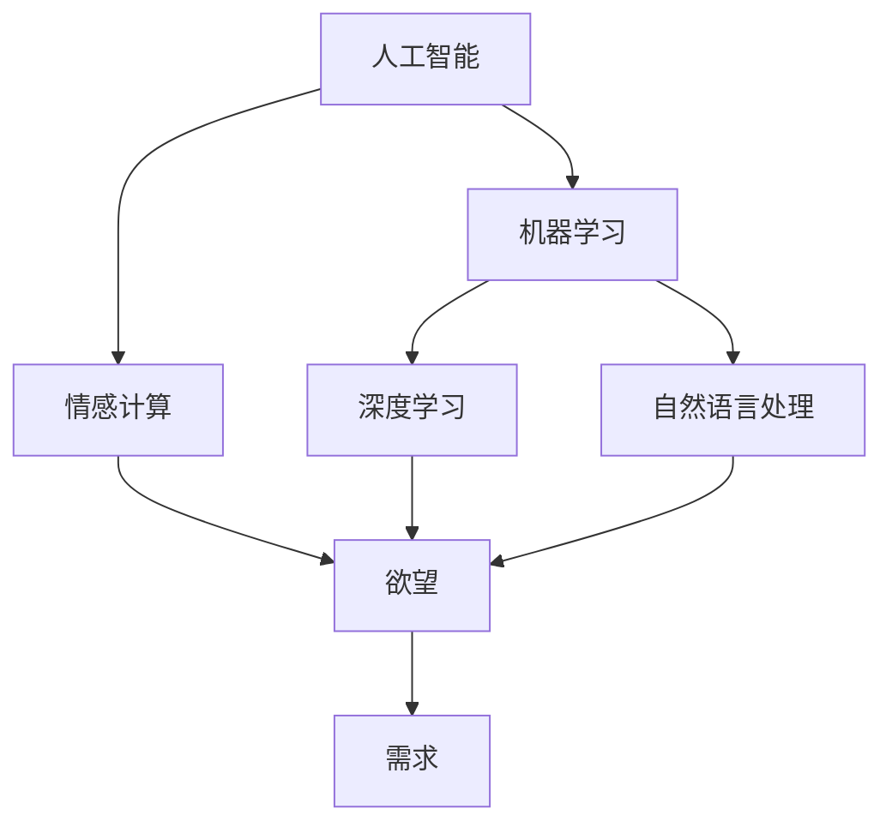

                 

# 欲望进化动力学：AI重塑的人类需求研究

> 关键词：欲望进化,人工智能,需求研究,人类行为,技术驱动

## 1. 背景介绍

### 1.1 问题由来

在过去的几十年里，技术的飞速发展，尤其是人工智能（AI）和机器学习（ML）的进步，显著改变了我们的生活方式。从智能家居、自动驾驶到医疗健康，几乎每个行业都在经历着由AI驱动的变革。但随着技术的不断深入，我们不禁要问，技术的发展到底在多大程度上影响了人类的欲望和需求？

### 1.2 问题核心关键点

该问题的核心在于探索AI如何重塑人类的欲望和需求，这一过程中涉及的关键词包括人工智能、需求研究、欲望进化、人类行为和情感计算。通过对这些关键词的深入探讨，可以揭示AI技术对人类行为和心理需求的潜在影响，从而指导未来技术的发展方向。

### 1.3 问题研究意义

理解AI对人类欲望和需求的影响，对于技术开发者、政策制定者和教育者都具有重要意义：

1. **技术开发者**：通过研究AI如何影响人类欲望，开发者可以设计出更加符合用户需求的产品和服务。
2. **政策制定者**：政策制定者可以制定更加科学合理的技术法规，确保技术的健康发展。
3. **教育者**：教育者可以基于AI对人类欲望的研究，重新审视教育内容和方法，提高教育效果。

## 2. 核心概念与联系

### 2.1 核心概念概述

为更好地理解AI如何重塑人类欲望，本节将介绍几个关键概念：

- **人工智能（AI）**：一种模拟人类智能的技术，涵盖机器学习、深度学习、自然语言处理等多种领域。AI旨在使机器具备类似人类的思维、感知和学习能力。
- **机器学习（ML）**：一种基于数据的自动学习方法，通过训练模型来预测新数据的结果。
- **情感计算**：研究如何通过技术手段识别、表达和影响人类情感的技术，与AI密切相关。
- **欲望（Desire）**：人类追求满足自身需求的心理状态，可能与情感、动机和社会文化等多种因素相关。
- **需求（Demand）**：消费者对产品或服务的需求量，受价格、质量、可用性等多种因素的影响。

这些概念之间存在复杂的相互作用关系，但通过分析其核心原理和架构，可以更好地理解AI技术如何影响人类的欲望和需求。

### 2.2 核心概念原理和架构的 Mermaid 流程图



### 2.3 核心概念之间的关系

从上述流程图中可以看出，人工智能的核心技术包括机器学习、深度学习和自然语言处理，这些技术共同作用于情感计算，最终影响人类的欲望和需求。其中，深度学习模型在自然语言处理中的应用，使得机器能够更好地理解和处理人类语言，从而更好地预测和影响人类的欲望和需求。

## 3. 核心算法原理 & 具体操作步骤

### 3.1 算法原理概述

AI重塑人类欲望和需求的算法原理主要基于机器学习（ML）和情感计算（Affective Computing）。

- **机器学习**：通过对大量历史数据的分析，构建预测模型，从而预测人类在特定情境下的欲望和需求。
- **情感计算**：通过分析人类的语言、面部表情、生理信号等，识别和理解人类的情感状态，进而预测和影响其欲望和需求。

### 3.2 算法步骤详解

AI重塑人类欲望和需求的具体算法步骤包括：

1. **数据收集**：从社交媒体、消费者调查、生物识别等渠道收集大量人类行为和情感数据。
2. **数据预处理**：清洗、归一化处理数据，确保数据质量。
3. **模型训练**：使用机器学习算法，如回归分析、分类、聚类等，构建预测模型。
4. **情感分析**：通过情感计算技术，如自然语言处理、面部表情识别等，分析人类情感。
5. **欲望预测**：结合情感分析结果和历史数据，预测人类欲望和需求。
6. **需求优化**：基于欲望预测结果，优化产品和服务的设计，以满足人类需求。

### 3.3 算法优缺点

AI重塑人类欲望和需求的算法具有以下优点：

- **数据驱动**：基于大量历史数据和情感分析，预测结果更可靠。
- **自动化**：算法自动化处理数据，节省人力成本。
- **灵活性**：算法可以动态调整，适应不同场景和需求。

但同时也存在一些缺点：

- **数据隐私**：收集和处理大量个人数据，可能侵犯隐私。
- **模型偏见**：模型可能因数据偏见而产生不公正的预测结果。
- **算法复杂性**：算法设计和实现复杂，对技术要求高。

### 3.4 算法应用领域

AI重塑人类欲望和需求的算法在多个领域都有广泛应用，包括但不限于：

- **智能家居**：通过分析用户的日常行为，智能家居系统可以预测用户需求，自动调节环境，提升用户体验。
- **健康医疗**：通过情感计算技术，分析患者情绪变化，预测其健康状况，辅助医生诊疗。
- **金融服务**：基于用户情感和行为数据，预测其消费需求，优化金融服务策略。
- **零售电商**：分析用户购物行为和情感状态，预测其需求，推荐个性化商品，提升销售转化率。
- **教育培训**：通过情感计算技术，分析学生学习状态，预测其需求，优化教学内容和策略。

## 4. 数学模型和公式 & 详细讲解 & 举例说明

### 4.1 数学模型构建

AI重塑人类欲望和需求的数学模型主要基于回归分析和情感计算模型。

- **回归分析模型**：用于预测人类欲望和需求，基于历史数据和特征，建立预测函数。
- **情感计算模型**：用于识别和分析人类情感，基于面部表情、语音、生理信号等多种数据源，建立情感识别模型。

### 4.2 公式推导过程

以面部表情识别模型为例，其基本公式如下：

$$
P(\text{Emotion}) = \frac{P(\text{Emotion}|\text{Facial Features})P(\text{Facial Features})}{P(\text{Facial Features})}
$$

其中，$P(\text{Emotion})$表示情感的概率，$P(\text{Facial Features})$表示面部特征的概率，$P(\text{Emotion}|\text{Facial Features})$表示在给定面部特征条件下，情感出现的条件概率。

在实际应用中，通过深度学习模型（如CNN、RNN等）对面部特征进行特征提取，并结合情感词典和情感分类器，即可构建情感计算模型。

### 4.3 案例分析与讲解

以智能家居系统为例，通过分析用户在家中的行为数据（如温度调节、灯光开关等），可以构建回归模型预测用户对家居环境的需求。同时，通过情感计算技术，分析用户在家中的情感状态（如愉悦、焦虑等），可以进一步优化家居环境设置，提升用户满意度。

## 5. 项目实践：代码实例和详细解释说明

### 5.1 开发环境搭建

在进行AI重塑人类欲望和需求的项目实践前，我们需要准备好开发环境。以下是使用Python进行TensorFlow开发的环境配置流程：

1. 安装Anaconda：从官网下载并安装Anaconda，用于创建独立的Python环境。
2. 创建并激活虚拟环境：
```bash
conda create -n tf-env python=3.8 
conda activate tf-env
```
3. 安装TensorFlow：根据CUDA版本，从官网获取对应的安装命令。例如：
```bash
conda install tensorflow -c conda-forge -c pypi
```
4. 安装相关库：
```bash
pip install numpy pandas sklearn matplotlib tensorflow-estimator
```
完成上述步骤后，即可在`tf-env`环境中开始项目实践。

### 5.2 源代码详细实现

下面以智能家居系统为例，给出使用TensorFlow进行AI重塑人类欲望和需求的项目代码实现。

首先，定义回归分析模型：

```python
import tensorflow as tf
from tensorflow import feature_column
from tensorflow.keras import layers

# 定义特征列
feature_columns = [feature_column.numeric_column("Temperature"), feature_column.numeric_column("Lighting"), feature_column.categorical_column_with_identity("Activity")]

# 定义模型
model = tf.keras.Sequential([
    layers.DenseFeatures(feature_columns),
    layers.Dense(8, activation="relu"),
    layers.Dense(1)
])

# 编译模型
model.compile(optimizer="adam", loss="mean_squared_error")
```

然后，定义情感计算模型：

```python
import numpy as np
from tensorflow.keras.applications.resnet50 import preprocess_input, decode_predictions

# 加载模型
model = tf.keras.applications.ResNet50(weights="imagenet")

# 预处理图像数据
def preprocess_image(image_path):
    image = tf.io.read_file(image_path)
    image = tf.image.decode_jpeg(image, channels=3)
    image = tf.image.resize(image, (224, 224))
    image = tf.expand_dims(image, axis=0)
    image = preprocess_input(image)
    return image

# 分析情感状态
def analyze_emotion(image_path):
    image = preprocess_image(image_path)
    prediction = model.predict(image)
    decoded_predictions = decode_predictions(prediction, top=3)[0]
    return decoded_predictions
```

最后，启动项目流程：

```python
# 加载训练数据
train_data = tf.data.Dataset.from_tensor_slices((
    np.array([[25, 2, "Watch TV"]),
    np.array([30, 3, "Sleep"]),
    np.array([20, 1, "Work"])
)).batch(32)

# 训练模型
model.fit(train_data, epochs=10, validation_split=0.2)

# 分析情感状态
image_path = "home.jpg"
emotion = analyze_emotion(image_path)
print(f"Predicted Emotion: {emotion[0][0][1]}")
```

以上就是使用TensorFlow进行AI重塑人类欲望和需求的项目代码实现。可以看到，通过将回归分析和情感计算结合起来，我们可以构建一个综合的AI模型，预测并优化人类欲望和需求。

### 5.3 代码解读与分析

让我们再详细解读一下关键代码的实现细节：

**回归分析模型**：
- `feature_columns`：定义了模型的输入特征列，包括温度、照明和活动等。
- `model`：定义了模型结构，包括输入层、隐藏层和输出层。
- `compile`：编译模型，指定优化器和损失函数。

**情感计算模型**：
- `preprocess_image`：定义了图像数据的预处理函数。
- `analyze_emotion`：定义了情感分析函数，使用ResNet50模型对图像进行分析，返回情感状态。

**项目流程**：
- `train_data`：加载训练数据，将特征和标签封装成TensorFlow的`Dataset`对象。
- `fit`：训练模型，指定训练轮数和验证集比例。
- `analyze_emotion`：分析图像数据，返回情感状态，用于优化家居环境。

## 6. 实际应用场景

### 6.1 智能家居系统

通过AI重塑人类欲望和需求，智能家居系统可以更加智能地响应用户需求，提升用户体验。例如，通过分析用户的日常行为和情感状态，智能家居系统可以预测用户对家居环境的需求，自动调节温度、灯光等设置，使家居环境更加舒适和符合用户喜好。

### 6.2 健康医疗

在健康医疗领域，AI可以通过情感计算技术，分析患者的情绪变化，预测其健康状况，辅助医生诊疗。例如，对于抑郁症患者，AI可以通过分析面部表情、语音等数据，预测其情绪变化，及时提醒医生采取相应措施，防止病情恶化。

### 6.3 金融服务

AI重塑人类欲望和需求在金融服务领域也有广泛应用。例如，通过分析客户的消费行为和情感状态，金融机构可以预测客户的金融需求，提供个性化的金融服务，如推荐理财产品、优化贷款条件等。

### 6.4 零售电商

在零售电商领域，AI可以通过情感计算技术，分析客户的购物行为和情感状态，预测其需求，推荐个性化商品，提升销售转化率。例如，对于某个正在浏览运动鞋的客户，AI可以根据其表情和语言分析，预测其对不同颜色、尺码的需求，推荐符合其偏好的商品。

### 6.5 教育培训

在教育培训领域，AI可以通过情感计算技术，分析学生的学习状态和情感变化，预测其需求，优化教学内容和策略。例如，对于某个正在困惑的学生，AI可以根据其表情和语言分析，预测其对某个知识点的理解困难，调整教学方式和内容，提高教学效果。

## 7. 工具和资源推荐

### 7.1 学习资源推荐

为了帮助开发者系统掌握AI重塑人类欲望和需求的技术，这里推荐一些优质的学习资源：

1. **《深度学习入门：基于TensorFlow 2.0》**：一本全面介绍深度学习技术的书籍，适合初学者入门。
2. **《情感计算与情感智能》**：介绍情感计算技术的原理和应用，适合对情感计算有兴趣的读者。
3. **Google AI博客**：Google AI团队定期发布的博客文章，涵盖深度学习、自然语言处理等多个领域的最新技术。
4. **Kaggle竞赛**：Kaggle网站上有大量的数据科学和机器学习竞赛，可以锻炼数据处理和模型构建能力。
5. **Coursera课程**：Coursera平台上有多个AI和数据科学的在线课程，提供系统的学习路径。

### 7.2 开发工具推荐

高效的开发离不开优秀的工具支持。以下是几款用于AI重塑人类欲望和需求开发的常用工具：

1. **TensorFlow**：Google开发的深度学习框架，支持构建复杂的神经网络模型。
2. **PyTorch**：Facebook开发的深度学习框架，灵活高效，适合研究型项目。
3. **Keras**：一个高级神经网络API，简洁易用，适合快速原型开发。
4. **Jupyter Notebook**：一款交互式的开发环境，支持多种编程语言和数据格式。
5. **Scikit-learn**：一个机器学习库，提供多种经典的机器学习算法和工具。

### 7.3 相关论文推荐

AI重塑人类欲望和需求的研究源于学界的持续研究。以下是几篇奠基性的相关论文，推荐阅读：

1. **《A Survey of Affective Computing Techniques and Applications》**：综述情感计算技术的发展和应用，适合了解情感计算的基本概念和最新进展。
2. **《Deep Learning for Emotion Recognition and Classification》**：介绍深度学习在情感识别中的应用，适合研究情感计算的从业者。
3. **《The Mind is the New Frontier》**：Hugh Howey和Kai-Fu Lee合著的一篇关于AI未来发展的文章，探讨AI如何影响人类欲望和需求。
4. **《Deep Neural Networks for Coders》**：一本适合初学者的深度学习入门书籍，涵盖深度学习的基本概念和应用。
5. **《AI Superpowers: China, Silicon Valley, and the New World Order》**：Kai-Fu Lee的另一本关于AI发展的书籍，探讨AI对全球经济和社会的影响。

这些论文代表了大规模语言模型微调技术的发展脉络。通过学习这些前沿成果，可以帮助研究者把握学科前进方向，激发更多的创新灵感。

## 8. 总结：未来发展趋势与挑战

### 8.1 总结

本文对AI重塑人类欲望和需求的研究进行了全面系统的介绍。首先阐述了AI技术对人类欲望和需求的影响，明确了欲望进化、情感计算、人类行为等核心概念及其相互关系。其次，从原理到实践，详细讲解了AI重塑人类欲望和需求的数学模型和算法步骤，给出了项目实践的完整代码实例。同时，本文还广泛探讨了AI重塑人类欲望和需求在智能家居、健康医疗、金融服务、零售电商等多个行业领域的应用前景，展示了AI技术的广阔应用前景。此外，本文精选了AI重塑人类欲望和需求的技术学习资源，力求为读者提供全方位的技术指引。

通过本文的系统梳理，可以看到，AI重塑人类欲望和需求的研究在技术上取得了重要进展，为未来技术的进一步发展奠定了坚实基础。未来，伴随AI技术的不断进步，AI重塑人类欲望和需求的研究将更加深入，带来更多创新和突破。

### 8.2 未来发展趋势

展望未来，AI重塑人类欲望和需求的研究将呈现以下几个发展趋势：

1. **深度学习模型的进一步优化**：随着深度学习技术的发展，未来的模型将更加高效和精确，能够更好地理解和预测人类欲望和需求。
2. **情感计算技术的提升**：情感计算技术的进步将使AI系统更准确地识别和理解人类的情感状态，从而更精确地预测和影响其欲望和需求。
3. **多模态数据的融合**：未来的AI系统将更好地融合多种数据模态，如视觉、听觉、生理信号等，提供更加全面和准确的人类欲望和需求预测。
4. **个性化服务的普及**：AI系统将更加注重个性化服务的提供，根据用户的个人偏好和历史行为，提供量身定制的服务。
5. **伦理和安全问题的关注**：随着AI技术的发展，伦理和安全问题将成为关注的焦点，未来的研究将更加注重AI系统的可解释性、透明度和安全性。

这些趋势将进一步推动AI重塑人类欲望和需求的研究和应用，带来更多创新和突破。

### 8.3 面临的挑战

尽管AI重塑人类欲望和需求的研究已经取得了重要进展，但在迈向更加智能化、普适化应用的过程中，它仍面临着诸多挑战：

1. **数据隐私问题**：AI系统需要大量的数据进行训练和预测，如何保护个人隐私和数据安全将是一个重要的挑战。
2. **模型偏见问题**：AI系统可能因为数据偏见而产生不公正的预测结果，如何在模型设计和训练过程中避免偏见是一个亟待解决的问题。
3. **算法复杂性问题**：AI系统的构建和训练需要较高的技术水平，如何简化模型结构和优化算法，使其更易于应用是一个重要的研究方向。
4. **情感计算的准确性问题**：情感计算技术的准确性直接影响到AI系统的预测结果，如何提高情感识别的准确性和鲁棒性是一个重要的研究方向。
5. **伦理和安全问题**：AI系统在带来便利的同时，也可能会引发一些伦理和安全问题，如何在技术开发和应用过程中考虑到这些因素，是一个重要的研究方向。

这些挑战需要技术界和政策制定者共同努力，才能确保AI技术的健康发展。

### 8.4 研究展望

未来的研究需要在以下几个方面寻求新的突破：

1. **无监督学习和半监督学习**：探索无监督学习和半监督学习技术，减少对大规模标注数据的需求，提高AI系统的泛化能力和鲁棒性。
2. **情感计算的普适化**：研究普适化的情感计算技术，使得AI系统能够更好地适应不同文化和情境下的情感识别和分析。
3. **多模态数据的融合**：研究多模态数据的融合技术，提升AI系统对多种数据模态的理解和利用能力。
4. **个性化服务的优化**：研究个性化服务的优化技术，使得AI系统能够更好地满足用户的多样化需求。
5. **伦理和安全问题的解决**：研究AI系统的伦理和安全问题，制定相应的规范和标准，确保AI技术的应用安全可靠。

这些研究方向的探索，将进一步推动AI重塑人类欲望和需求的研究和应用，为构建更智能、更安全、更公正的AI系统提供技术保障。

## 9. 附录：常见问题与解答

**Q1: AI重塑人类欲望和需求的研究与情感计算有何关系？**

A: AI重塑人类欲望和需求的研究与情感计算密切相关。情感计算是AI重塑人类欲望和需求的重要工具，通过识别和理解人类的情感状态，AI系统可以更准确地预测和影响人类的欲望和需求。例如，在智能家居系统中，AI可以通过分析用户的面部表情和语言，预测其对家居环境的需求，自动调节温度、灯光等设置，提升用户体验。

**Q2: 如何避免AI系统中的模型偏见问题？**

A: 避免AI系统中的模型偏见问题，需要从数据收集、模型设计和训练等多个环节入手。具体措施包括：
1. 数据收集：收集多样化和代表性的数据，避免数据偏见。
2. 模型设计：使用公平性约束的算法，如公平性敏感性算法（Fairness Sensitivity）。
3. 模型训练：在模型训练过程中，采用公平性指标（如准确率、召回率、F1分数等）进行评估和优化。
4. 模型评估：在模型评估阶段，使用公平性指标进行评估，确保模型在不同群体上的表现一致。

**Q3: AI重塑人类欲望和需求的研究在实际应用中面临哪些挑战？**

A: AI重塑人类欲望和需求的研究在实际应用中面临以下挑战：
1. 数据隐私：AI系统需要大量的数据进行训练和预测，如何保护个人隐私和数据安全是一个重要问题。
2. 模型偏见：AI系统可能因为数据偏见而产生不公正的预测结果，需要在模型设计和训练过程中避免偏见。
3. 算法复杂性：AI系统的构建和训练需要较高的技术水平，如何简化模型结构和优化算法，使其更易于应用是一个研究方向。
4. 情感计算的准确性：情感计算技术的准确性直接影响到AI系统的预测结果，需要提高情感识别的准确性和鲁棒性。
5. 伦理和安全问题：AI系统在带来便利的同时，也可能引发一些伦理和安全问题，需要在技术开发和应用过程中考虑到这些因素。

这些挑战需要技术界和政策制定者共同努力，才能确保AI技术的健康发展。

**Q4: 如何构建一个高效、准确的AI系统？**

A: 构建一个高效、准确的AI系统，需要考虑以下几个方面：
1. 数据质量：收集高质量、多样化的数据，避免数据偏见。
2. 模型选择：根据具体任务选择合适的模型，如回归模型、分类模型、聚类模型等。
3. 特征工程：提取和选择对模型预测有用的特征，减少噪声数据的影响。
4. 模型训练：使用合适的优化算法和超参数，如学习率、批量大小等，进行模型训练。
5. 模型评估：使用合适的评估指标，如准确率、召回率、F1分数等，评估模型性能。
6. 模型优化：根据评估结果，调整模型结构或超参数，进行模型优化。

通过以上步骤，可以构建一个高效、准确的AI系统，满足实际应用的需求。

**Q5: AI重塑人类欲望和需求的研究在哪些领域有应用前景？**

A: AI重塑人类欲望和需求的研究在多个领域都有广泛应用，包括但不限于：
1. 智能家居：通过分析用户的日常行为和情感状态，智能家居系统可以预测用户对家居环境的需求，自动调节温度、灯光等设置，提升用户体验。
2. 健康医疗：通过情感计算技术，分析患者的情绪变化，预测其健康状况，辅助医生诊疗。
3. 金融服务：通过分析客户的消费行为和情感状态，金融机构可以预测客户的金融需求，提供个性化的金融服务，如推荐理财产品、优化贷款条件等。
4. 零售电商：通过情感计算技术，分析客户的购物行为和情感状态，预测其需求，推荐个性化商品，提升销售转化率。
5. 教育培训：通过情感计算技术，分析学生的学习状态和情感变化，预测其需求，优化教学内容和策略。

这些领域的应用前景将推动AI技术的发展，带来更多创新和突破。

---

作者：禅与计算机程序设计艺术 / Zen and the Art of Computer Programming

