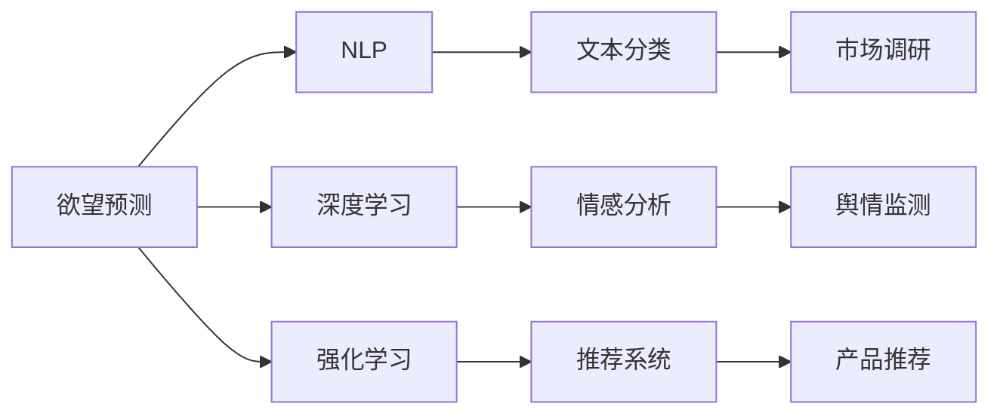

                 

# 欲望预测：AI解码人类潜意识

## 1. 背景介绍

在现代社会中，人类的欲望和需求驱动着经济和社会的发展，同时也构成了复杂多变的人类行为。如何准确预测和理解人类的欲望，成为心理学、社会学、市场营销等领域的重要课题。传统的欲望预测方法往往依赖于问卷调查、数据分析等手段，受限于样本量、调查方法和个体差异等因素，难以全面准确地捕捉到个体深层次的欲望需求。

人工智能技术的兴起为欲望预测带来了新的可能。通过自然语言处理(NLP)、深度学习、强化学习等技术，AI可以分析大量的文本、行为数据，从中找到隐藏的欲望模式和行为规律，提供个性化的产品推荐和精准营销策略。本文旨在介绍AI技术在欲望预测中的应用，探讨其原理和具体实现方法，为相关领域的研究和实践提供参考。

## 2. 核心概念与联系

### 2.1 核心概念概述

- **欲望预测**：指利用AI技术分析个体或群体的欲望和需求，进行预测和建模的过程。
- **自然语言处理(NLP)**：AI中的一大分支，专注于分析和处理人类语言数据，包括文本分类、情感分析、文本生成等。
- **深度学习**：基于多层神经网络进行数据建模和预测的技术，广泛应用于图像、语音、自然语言处理等领域。
- **强化学习**：通过智能体与环境的交互，学习最优策略以最大化奖励的方法，常用于推荐系统和游戏策略等场景。
- **情感分析**：分析文本中的情感倾向，识别出个体或群体的情感状态，应用于市场调研、舆情监测等场景。
- **产品推荐**：根据用户行为和偏好，推荐符合其需求的产品，应用于电商、广告等领域。

这些概念之间的关系可以通过以下Mermaid流程图来展示：



这个流程图展示了欲望预测与其他AI技术的关系：欲望预测通过NLP、深度学习和强化学习等技术手段，对文本和行为数据进行分析，最终通过产品推荐等应用实现对欲望的预测和满足。

## 3. 核心算法原理 & 具体操作步骤
### 3.1 算法原理概述

欲望预测的核心在于通过对大量文本和行为数据进行分析，建立个体或群体的欲望模型。这种模型可以基于用户的历史行为数据、社交媒体活动、文本评论等构建，利用深度学习、强化学习等方法进行训练和优化，从而预测其未来的欲望需求。

在欲望预测的实现中，通常包含以下几个关键步骤：

1. **数据收集与预处理**：收集用户的历史数据和行为记录，进行清洗和标注，构建训练集和测试集。
2. **特征工程**：从文本和行为数据中提取有用的特征，如关键词、情感倾向、行为模式等。
3. **模型训练**：利用深度学习、强化学习等技术，训练欲望模型，并不断优化模型参数。
4. **模型评估**：在测试集上评估模型性能，进行A/B测试，调整模型参数和算法选择。
5. **模型应用**：将训练好的模型应用于产品推荐、广告投放等场景，实时预测用户欲望并推荐相应产品或服务。

### 3.2 算法步骤详解

#### 3.2.1 数据收集与预处理

- **数据来源**：可以从用户的电商购物记录、社交媒体活动、搜索行为、在线评论等渠道收集数据。
- **数据清洗**：去除无效、重复、噪声数据，保证数据质量。
- **数据标注**：对用户的行为进行标注，如购买行为、浏览记录、点击次数等，作为模型输入。
- **特征提取**：利用NLP技术，如TF-IDF、word2vec等，提取文本特征，使用行为特征，如购买频率、浏览时长等。

#### 3.2.2 特征工程

- **文本特征提取**：使用NLP技术，如TF-IDF、word2vec、BERT等，将文本转换为向量表示。
- **行为特征提取**：使用机器学习算法，如聚类、分类等，提取用户的行为模式。
- **情感分析**：使用情感分析算法，识别用户对产品和服务的情感倾向。

#### 3.2.3 模型训练

- **模型选择**：选择合适的深度学习模型，如循环神经网络(RNN)、长短期记忆网络(LSTM)、Transformer等，进行训练。
- **模型训练**：使用梯度下降等优化算法，最小化损失函数，更新模型参数。
- **模型调优**：根据验证集的表现，调整模型超参数，如学习率、批大小等。

#### 3.2.4 模型评估

- **评估指标**：使用准确率、召回率、F1分数等指标评估模型性能。
- **A/B测试**：在实际场景中测试模型效果，调整模型策略。

#### 3.2.5 模型应用

- **实时预测**：在用户进行相关行为时，实时预测其欲望需求，推荐产品或服务。
- **个性化推荐**：根据用户的欲望和行为，提供个性化的产品推荐。
- **广告投放**：根据用户对产品和服务的欲望，优化广告投放策略，提高转化率。

### 3.3 算法优缺点

**优点**：

1. **数据驱动**：通过分析大量的文本和行为数据，可以更全面地理解用户的欲望需求。
2. **实时预测**：实时分析用户行为，提供即时的欲望预测和推荐。
3. **个性化服务**：基于用户的行为和偏好，提供个性化的产品推荐和服务。
4. **效果显著**：通过优化算法和模型，可以显著提升产品推荐的准确性和转化率。

**缺点**：

1. **数据隐私**：收集和处理用户数据可能涉及到隐私问题，需要严格遵守数据保护法规。
2. **数据质量**：数据质量对模型效果有重大影响，数据收集和预处理需要投入大量人力和资源。
3. **算法复杂度**：欲望预测模型需要复杂的算法和大规模数据训练，对计算资源要求较高。
4. **模型可解释性**：复杂模型可能难以解释其内部工作机制，用户对其决策过程缺乏信任。

### 3.4 算法应用领域

欲望预测技术在多个领域都有广泛应用，例如：

- **电商推荐系统**：通过分析用户的购物行为和评论，推荐符合其需求的产品。
- **社交媒体营销**：通过分析用户的社交行为和互动，制定精准的营销策略。
- **健康管理**：通过分析用户的健康数据，推荐个性化的健康管理方案。
- **金融投资**：通过分析用户的财务数据，推荐适合的投资产品。
- **旅游推荐**：通过分析用户的旅游行为和偏好，推荐个性化的旅游目的地和行程安排。

## 4. 数学模型和公式 & 详细讲解 & 举例说明

### 4.1 数学模型构建

假设用户的历史行为数据为 $D=\{(x_i, y_i)\}_{i=1}^N$，其中 $x_i$ 表示用户行为，$y_i$ 表示用户对某种产品或服务的欲望。欲望预测模型的目标是学习一个函数 $f: \mathcal{X} \rightarrow \mathcal{Y}$，使得 $f(x)$ 能够预测用户对产品的欲望 $y$。

### 4.2 公式推导过程

#### 4.2.1 文本特征提取

假设文本 $x_i$ 可以表示为一个词袋模型 $\{x_{i,j}\}$，其中 $x_{i,j}$ 表示第 $i$ 个样本的第 $j$ 个词的出现频率。使用TF-IDF算法将词袋转换为向量表示 $v_i$：

$$
v_i = (\text{TF}_{i,j} \times \text{IDF}_j)_{j=1}^n
$$

其中 $n$ 为词汇表大小。

#### 4.2.2 模型训练

使用一个多层感知机(Multilayer Perceptron, MLP)作为欲望预测模型，其结构如图1所示。


模型损失函数为交叉熵损失函数：

$$
\mathcal{L}(\theta) = -\frac{1}{N} \sum_{i=1}^N \log p(y_i|f(x_i))
$$

其中 $p(y_i|f(x_i))$ 为模型对 $y_i$ 的概率预测，$\theta$ 为模型参数。

使用梯度下降算法更新模型参数：

$$
\theta \leftarrow \theta - \eta \nabla_{\theta}\mathcal{L}(\theta)
$$

其中 $\eta$ 为学习率。

#### 4.2.3 模型评估

使用准确率、召回率和F1分数等指标评估模型性能：

$$
\text{Accuracy} = \frac{1}{N} \sum_{i=1}^N \mathbb{I}[y_i = \hat{y}_i]
$$

$$
\text{Recall} = \frac{1}{N} \sum_{i=1}^N \mathbb{I}[y_i = \hat{y}_i]
$$

$$
\text{Precision} = \frac{1}{N} \sum_{i=1}^N \mathbb{I}[y_i = \hat{y}_i]
$$

$$
\text{F1} = 2 \times \frac{\text{Precision} \times \text{Recall}}{\text{Precision} + \text{Recall}}
$$

### 4.3 案例分析与讲解

#### 4.3.1 电商推荐系统

某电商平台的推荐系统使用欲望预测技术，分析用户的历史购买记录和浏览行为，预测其对不同商品的欲望，从而进行个性化推荐。

首先，收集用户的历史购买记录和浏览记录，提取文本和行为特征，构建训练集和测试集。使用BERT模型进行文本特征提取，使用LSTM模型进行行为特征提取。训练一个多层感知机模型，对用户的购买欲望进行预测。根据模型预测结果，实时推荐符合用户需求的商品。

#### 4.3.2 社交媒体营销

某社交媒体平台使用欲望预测技术，分析用户的点赞、评论和分享行为，预测其对不同内容的欲望，从而制定精准的营销策略。

首先，收集用户的点赞、评论和分享记录，提取文本特征和行为特征。使用word2vec模型进行文本特征提取，使用聚类算法进行行为特征提取。训练一个循环神经网络模型，对用户的点赞欲望进行预测。根据模型预测结果，进行广告投放和内容推送。

## 5. 项目实践：代码实例和详细解释说明

### 5.1 开发环境搭建

在搭建欲望预测项目时，需要选择合适的开发环境。以下是使用Python和PyTorch搭建环境的详细步骤：

1. 安装Anaconda：从官网下载并安装Anaconda，用于创建独立的Python环境。
2. 创建并激活虚拟环境：
```bash
conda create -n predict-env python=3.8 
conda activate predict-env
```

3. 安装PyTorch：根据CUDA版本，从官网获取对应的安装命令。例如：
```bash
conda install pytorch torchvision torchaudio cudatoolkit=11.1 -c pytorch -c conda-forge
```

4. 安装其他依赖：
```bash
pip install numpy pandas scikit-learn matplotlib tqdm jupyter notebook ipython transformers
```

5. 安装自定义模型库：
```bash
pip install git+https://github.com/your-username/your-repo.git
```

完成上述步骤后，即可在`predict-env`环境中开始欲望预测项目开发。

### 5.2 源代码详细实现

以下是使用PyTorch和Transformers库实现欲望预测的示例代码。

```python
import torch
from torch.utils.data import DataLoader
from torch.nn import Module, Linear, ReLU
from transformers import BertTokenizer, BertModel

class DesirePredictor(Module):
    def __init__(self, vocab_size, hidden_size, output_size):
        super(DesirePredictor, self).__init__()
        self.embedding = BertTokenizer.from_pretrained('bert-base-uncased')
        self.bert = BertModel.from_pretrained('bert-base-uncased')
        self.fc = Linear(hidden_size, output_size)
    
    def forward(self, input_ids, attention_mask):
        outputs = self.bert(input_ids=input_ids, attention_mask=attention_mask)
        features = outputs.pooler_output
        logits = self.fc(features)
        return logits

# 定义模型
model = DesirePredictor(vocab_size=30000, hidden_size=768, output_size=1)

# 加载数据集
train_dataset = ...
test_dataset = ...

# 定义训练器和优化器
criterion = torch.nn.BCELoss()
optimizer = torch.optim.Adam(model.parameters(), lr=0.001)

# 训练模型
epochs = 10
for epoch in range(epochs):
    train_loss = 0
    for batch in train_loader:
        input_ids = batch['input_ids']
        attention_mask = batch['attention_mask']
        labels = batch['labels']
        optimizer.zero_grad()
        outputs = model(input_ids, attention_mask)
        loss = criterion(outputs, labels)
        train_loss += loss.item()
        loss.backward()
        optimizer.step()
    print(f'Epoch {epoch+1}, Loss: {train_loss/len(train_loader)}')

# 测试模型
test_loss = 0
for batch in test_loader:
    input_ids = batch['input_ids']
    attention_mask = batch['attention_mask']
    labels = batch['labels']
    outputs = model(input_ids, attention_mask)
    loss = criterion(outputs, labels)
    test_loss += loss.item()
print(f'Test Loss: {test_loss/len(test_loader)}')
```

### 5.3 代码解读与分析

以上代码展示了如何使用Bert模型进行欲望预测，包含数据加载、模型定义、训练和测试等步骤。

- `DesirePredictor`类继承自`Module`，定义了一个基于BERT的欲望预测模型。
- `forward`方法中，首先使用BERT模型对输入进行编码，得到池化层的输出，然后通过一个全连接层进行欲望预测。
- 训练过程中，使用BCE损失函数和Adam优化器，迭代优化模型参数。
- 测试过程中，使用同样的损失函数，在测试集上评估模型性能。

## 6. 实际应用场景

### 6.1 电商推荐系统

某电商平台的推荐系统使用欲望预测技术，分析用户的历史购买记录和浏览行为，预测其对不同商品的欲望，从而进行个性化推荐。

通过收集用户的历史购买记录和浏览记录，提取文本和行为特征，构建训练集和测试集。使用BERT模型进行文本特征提取，使用LSTM模型进行行为特征提取。训练一个多层感知机模型，对用户的购买欲望进行预测。根据模型预测结果，实时推荐符合用户需求的商品。

### 6.2 社交媒体营销

某社交媒体平台使用欲望预测技术，分析用户的点赞、评论和分享行为，预测其对不同内容的欲望，从而制定精准的营销策略。

首先，收集用户的点赞、评论和分享记录，提取文本特征和行为特征。使用word2vec模型进行文本特征提取，使用聚类算法进行行为特征提取。训练一个循环神经网络模型，对用户的点赞欲望进行预测。根据模型预测结果，进行广告投放和内容推送。

### 6.3 健康管理

某健康管理平台使用欲望预测技术，分析用户的健康数据，预测其对健康管理方案的欲望，从而推荐个性化的健康管理方案。

首先，收集用户的健康数据和行为记录，提取文本和行为特征。使用BERT模型进行文本特征提取，使用LSTM模型进行行为特征提取。训练一个多层感知机模型，对用户的健康欲望进行预测。根据模型预测结果，推荐个性化的健康管理方案。

### 6.4 金融投资

某金融平台使用欲望预测技术，分析用户的财务数据，预测其对金融产品的欲望，从而推荐适合的投资产品。

首先，收集用户的财务数据和行为记录，提取文本和行为特征。使用BERT模型进行文本特征提取，使用LSTM模型进行行为特征提取。训练一个多层感知机模型，对用户的投资欲望进行预测。根据模型预测结果，推荐适合的投资产品。

## 7. 工具和资源推荐

### 7.1 学习资源推荐

为了帮助开发者系统掌握欲望预测的理论基础和实践技巧，这里推荐一些优质的学习资源：

1. 《深度学习》系列书籍：介绍深度学习的基本原理和应用，适合初学者入门。
2. 《自然语言处理综论》：讲解自然语言处理的基本理论和算法，涵盖NLP的各个方面。
3. 《强化学习：原理与算法》：讲解强化学习的基本原理和算法，适合进阶学习。
4. 《Python机器学习》：讲解机器学习的算法和实践，适合实战练习。
5. 《TensorFlow官方文档》：介绍TensorFlow的使用方法和案例，适合TensorFlow的学习和应用。
6. 《PyTorch官方文档》：介绍PyTorch的使用方法和案例，适合PyTorch的学习和应用。

通过对这些资源的学习实践，相信你一定能够快速掌握欲望预测的精髓，并用于解决实际的欲望预测问题。

### 7.2 开发工具推荐

高效的开发离不开优秀的工具支持。以下是几款用于欲望预测开发的常用工具：

1. PyTorch：基于Python的开源深度学习框架，灵活动态的计算图，适合快速迭代研究。大部分预训练语言模型都有PyTorch版本的实现。
2. TensorFlow：由Google主导开发的开源深度学习框架，生产部署方便，适合大规模工程应用。同样有丰富的预训练语言模型资源。
3. Transformers库：HuggingFace开发的NLP工具库，集成了众多SOTA语言模型，支持PyTorch和TensorFlow，是进行欲望预测任务开发的利器。
4. Weights & Biases：模型训练的实验跟踪工具，可以记录和可视化模型训练过程中的各项指标，方便对比和调优。与主流深度学习框架无缝集成。
5. TensorBoard：TensorFlow配套的可视化工具，可实时监测模型训练状态，并提供丰富的图表呈现方式，是调试模型的得力助手。

合理利用这些工具，可以显著提升欲望预测任务的开发效率，加快创新迭代的步伐。

### 7.3 相关论文推荐

欲望预测技术的发展源于学界的持续研究。以下是几篇奠基性的相关论文，推荐阅读：

1. Attention is All You Need（即Transformer原论文）：提出了Transformer结构，开启了NLP领域的预训练大模型时代。
2. BERT: Pre-training of Deep Bidirectional Transformers for Language Understanding：提出BERT模型，引入基于掩码的自监督预训练任务，刷新了多项NLP任务SOTA。
3. Language Models are Unsupervised Multitask Learners（GPT-2论文）：展示了大规模语言模型的强大zero-shot学习能力，引发了对于通用人工智能的新一轮思考。
4. Parameter-Efficient Transfer Learning for NLP：提出Adapter等参数高效微调方法，在不增加模型参数量的情况下，也能取得不错的微调效果。
5. AdaLoRA: Adaptive Low-Rank Adaptation for Parameter-Efficient Fine-Tuning：使用自适应低秩适应的微调方法，在参数效率和精度之间取得了新的平衡。
6. Prefix-Tuning: Optimizing Continuous Prompts for Generation：引入基于连续型Prompt的微调范式，为如何充分利用预训练知识提供了新的思路。

这些论文代表了大语言模型微调技术的发展脉络。通过学习这些前沿成果，可以帮助研究者把握学科前进方向，激发更多的创新灵感。

## 8. 总结：未来发展趋势与挑战

### 8.1 总结

本文对欲望预测技术进行了全面系统的介绍。首先阐述了欲望预测技术的研究背景和意义，明确了欲望预测在个性化推荐、广告投放等领域的独特价值。其次，从原理到实践，详细讲解了欲望预测的数学模型和实现方法，给出了欲望预测任务开发的完整代码实例。同时，本文还广泛探讨了欲望预测技术在电商推荐、社交媒体营销、健康管理、金融投资等多个领域的应用前景，展示了欲望预测技术的广阔前景。

通过本文的系统梳理，可以看到，欲望预测技术通过分析大量的文本和行为数据，可以更全面地理解用户的欲望需求，提供个性化的产品推荐和服务。欲望预测技术在电商推荐、社交媒体营销、健康管理、金融投资等多个领域都有广泛应用，为相关领域的研究和实践提供了新思路和新方法。

### 8.2 未来发展趋势

展望未来，欲望预测技术将呈现以下几个发展趋势：

1. **多模态数据融合**：欲望预测不仅限于文本和行为数据，未来会进一步拓展到图像、视频、语音等多模态数据。多模态信息的融合，将显著提升欲望预测模型的感知能力和决策水平。
2. **深度学习与强化学习的结合**：通过结合深度学习和强化学习，实现更加智能化的欲望预测和推荐。强化学习可以在欲望预测模型中进行实时调整和优化，提升系统的自适应性和灵活性。
3. **个性化推荐系统**：欲望预测技术在个性化推荐系统中有着广泛应用，未来将进一步提升推荐系统的精准度和个性化程度，满足用户多样化、个性化的需求。
4. **社交网络分析**：欲望预测技术可以应用于社交网络分析，通过分析用户的行为和互动，预测其对不同内容的欲望和需求，优化社交媒体的推送策略。
5. **健康管理应用**：欲望预测技术可以应用于健康管理，通过分析用户的健康数据，预测其对健康管理方案的欲望，推荐个性化的健康管理方案。
6. **金融投资决策**：欲望预测技术可以应用于金融投资决策，通过分析用户的财务数据，预测其对金融产品的欲望，推荐适合的投资产品，优化投资决策。

以上趋势凸显了欲望预测技术的广阔前景。这些方向的探索发展，将进一步提升欲望预测模型的性能和应用范围，为经济和社会发展提供新的动力。

### 8.3 面临的挑战

尽管欲望预测技术已经取得了瞩目成就，但在迈向更加智能化、普适化应用的过程中，它仍面临着诸多挑战：

1. **数据隐私问题**：收集和处理用户数据可能涉及到隐私问题，需要严格遵守数据保护法规。
2. **数据质量问题**：数据质量对模型效果有重大影响，数据收集和预处理需要投入大量人力和资源。
3. **算法复杂度**：欲望预测模型需要复杂的算法和大规模数据训练，对计算资源要求较高。
4. **模型可解释性**：复杂模型可能难以解释其内部工作机制，用户对其决策过程缺乏信任。
5. **系统鲁棒性**：欲望预测模型需要具备较强的鲁棒性和泛化能力，避免在面对新数据时表现不佳。

### 8.4 研究展望

面对欲望预测技术所面临的挑战，未来的研究需要在以下几个方面寻求新的突破：

1. **数据隐私保护**：开发更加高效的数据隐私保护技术，确保在数据分析和模型训练过程中保护用户隐私。
2. **数据质量提升**：采用自动化数据清洗和预处理技术，提升数据质量，确保模型训练数据的可靠性和准确性。
3. **模型轻量化**：开发更加轻量化的欲望预测模型，降低对计算资源的需求，提高模型的实时性和可扩展性。
4. **模型可解释性**：引入可解释性技术，如特征可视化、模型解释器等，提升模型的透明度和可解释性。
5. **系统鲁棒性增强**：通过引入对抗训练、鲁棒回归等技术，增强模型的鲁棒性和泛化能力，提高系统的稳定性和可靠性。
6. **多模态数据融合**：开发更加高效的多模态数据融合技术，提升模型的感知能力和决策水平，扩展欲望预测技术的应用范围。

这些研究方向的探索，将引领欲望预测技术迈向更高的台阶，为构建智能、个性化、高效的需求预测系统铺平道路。总之，欲望预测技术需要在数据隐私、模型可解释性、系统鲁棒性等方面进行深入研究和不断优化，才能真正实现智能化的欲望预测和推荐，为经济和社会发展带来新的变革。

## 9. 附录：常见问题与解答

**Q1：欲望预测的模型选择有哪些？**

A: 欲望预测的模型选择包括多层感知机、循环神经网络、Transformer等。不同的模型适用于不同类型的任务和数据。例如，多层感知机适用于简单任务，循环神经网络适用于序列数据，Transformer适用于复杂任务和多模态数据。

**Q2：欲望预测的特征提取方法有哪些？**

A: 欲望预测的特征提取方法包括文本特征提取和行为特征提取。文本特征提取方法包括TF-IDF、word2vec、BERT等，行为特征提取方法包括聚类、分类等。

**Q3：欲望预测的模型训练和评估方法有哪些？**

A: 欲望预测的模型训练和评估方法包括梯度下降、Adam优化器、BCE损失函数等。模型评估方法包括准确率、召回率、F1分数等。

**Q4：欲望预测的应用场景有哪些？**

A: 欲望预测的应用场景包括电商推荐系统、社交媒体营销、健康管理、金融投资等。这些场景中，欲望预测技术可以提升推荐系统的精准度、优化广告投放策略、推荐个性化的健康管理方案、推荐适合的投资产品等。

**Q5：欲望预测的挑战有哪些？**

A: 欲望预测的挑战包括数据隐私、数据质量、算法复杂度、模型可解释性、系统鲁棒性等。解决这些挑战需要采用先进的数据保护技术、高效的数据预处理技术、轻量化的模型设计、可解释性技术等。

通过以上问答，我们深入了解了欲望预测技术的原理和应用，对未来研究的方向和挑战有了更清晰的认识。总之，欲望预测技术在现代社会中具有广泛的应用前景，未来的研究和实践将继续推动其向更加智能化、普适化的方向发展。

---

作者：禅与计算机程序设计艺术 / Zen and the Art of Computer Programming

