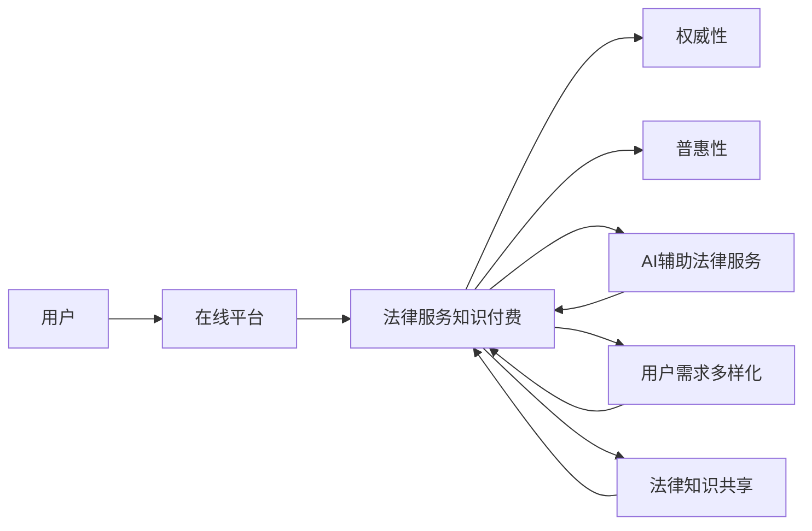

                 

# 法律服务领域知识付费要权威性与普惠性

## 1. 背景介绍

随着互联网技术的迅速发展和普及，在线法律服务已成为法律行业的重要组成部分。传统的法律服务往往需要耗费大量人力物力，且需要面对客户咨询的多样化和专业化的需求，因此，知识付费服务在法律服务领域应运而生。知识付费服务通常指通过在线平台，用户支付一定的费用来获取专业的法律知识和咨询服务。

但在线法律服务也面临一些挑战，比如用户对平台的专业性、权威性存疑，以及由于技术或经济条件的限制，一些需要法律服务的群体无法支付高昂的咨询费用。因此，如何平衡法律服务的权威性与普惠性，成为法律服务知识付费领域的一大课题。

## 2. 核心概念与联系

### 2.1 核心概念概述

为了更好地理解法律服务知识付费领域的问题，这里介绍了几个核心概念：

- **法律服务知识付费**：指用户为获取专业的法律知识或咨询服务，需支付一定费用。这种服务通常通过在线平台提供，如微信、小程序、App等。

- **权威性与普惠性**：权威性指的是法律服务的提供者具备合法资质、专业知识，以及足够的案例经验来确保服务质量。普惠性则指服务能够覆盖更多的用户，无论其经济条件如何，都能得到专业的法律服务。

- **AI辅助法律服务**：人工智能（AI）技术，如自然语言处理（NLP）、机器学习等，被用于提升法律服务的效率和质量。AI技术可以分析大量法律文本、案例，生成法律意见，辅助律师工作。

- **用户需求多样化**：法律服务需求覆盖从日常咨询到复杂案件处理等多个层面，用户需求复杂多样。

- **法律知识共享**：通过在线平台，法律知识可以被更广泛地传播和分享，有助于法律服务的普惠性。

### 2.2 核心概念原理和架构的 Mermaid 流程图



这个流程图展示了核心概念之间的联系：

1. 用户通过在线平台获取法律服务知识付费。
2. 平台需要确保服务具有权威性，让用户信任。
3. 平台还需保证普惠性，让更多用户都能享受到服务。
4. AI辅助技术提升服务效率和质量。
5. 用户需求多样化，平台需提供多样化服务。
6. 法律知识共享，增强服务的普惠性。

## 3. 核心算法原理 & 具体操作步骤

### 3.1 算法原理概述

为了实现法律服务的权威性与普惠性，平台需要构建一套完善的算法体系。核心算法包括：

- **用户需求匹配算法**：通过分析用户问题、需求，匹配合适的律师或AI模型，以提供精准的咨询服务。
- **专家知识库构建**：收集、整理、更新法律专家、案例的知识库，构建丰富的知识体系。
- **AI模型训练**：利用机器学习算法训练AI模型，提供即时的法律分析和咨询建议。

### 3.2 算法步骤详解

具体步骤如下：

1. **用户需求采集**：用户在平台填写咨询问题或提交案件，平台收集用户需求。

2. **需求匹配**：利用算法模型，将用户需求与专家或AI模型匹配，确保匹配结果的专业性和权威性。

3. **知识库查询**：平台根据匹配结果，查询专家知识库，提取相关的法律知识、案例信息。

4. **AI辅助分析**：AI模型对查询结果进行深度分析，生成法律意见和建议。

5. **专家审核**：由专业律师对AI生成的结果进行审核，确保权威性和准确性。

6. **用户反馈与优化**：用户反馈结果，平台根据反馈优化算法和知识库。

### 3.3 算法优缺点

#### 优点

- **提升服务效率**：AI技术能够快速处理大量法律咨询，减少人工工作量。
- **覆盖更广用户**：AI技术可以提供24/7全天候服务，覆盖更多用户群体。
- **精准匹配**：算法可以高效匹配用户需求与合适专家或AI模型，提升服务质量。
- **持续优化**：平台可以通过用户反馈持续优化算法和知识库，保证服务的权威性和普惠性。

#### 缺点

- **准确性挑战**：AI模型可能存在误判，影响服务质量。
- **依赖专家经验**：AI模型依赖专家知识库，专家库内容的完整性和准确性影响服务质量。
- **技术门槛高**：算法和知识库的构建需要较高技术门槛。
- **法律风险**：AI生成的法律意见可能存在法律风险，需要专业律师审核。

### 3.4 算法应用领域

法律服务知识付费的算法主要应用于以下领域：

- **法律咨询**：用户在线咨询法律问题，平台提供专业解答。
- **案件处理**：用户提交案件，平台提供法律分析和建议。
- **法律文书生成**：用户需要生成合同、诉状等法律文书，平台提供模板和指导。
- **法律课程学习**：用户学习法律知识，平台提供课程和资源。

## 4. 数学模型和公式 & 详细讲解 & 举例说明

### 4.1 数学模型构建

设法律服务的用户需求为 $U$，专家信息为 $E$，AI模型为 $M$，平台算法为 $A$，则：

- **需求匹配算法**：将用户需求 $U$ 与专家 $E$ 和AI模型 $M$ 进行匹配，计算匹配得分 $\text{Score}(U,E,M)$。

- **专家知识库查询**：根据匹配结果 $\text{Score}(U,E,M)$，查询专家知识库，生成知识向量 $\text{Knowledge}_{E,M}(U)$。

- **AI辅助分析**：AI模型对知识向量 $\text{Knowledge}_{E,M}(U)$ 进行深度分析，生成法律意见 $\text{LegalAdvice}(U,E,M)$。

- **专家审核**：专家对法律意见 $\text{LegalAdvice}(U,E,M)$ 进行审核，输出审核结果 $\text{Review}(U,E,M)$。

- **用户反馈**：用户根据审核结果 $\text{Review}(U,E,M)$ 给出反馈，平台根据反馈更新算法和知识库。

### 4.2 公式推导过程

设 $\text{Score}(U,E,M)$ 为需求 $U$ 与专家 $E$ 和AI模型 $M$ 的匹配得分，则推导过程如下：

1. **需求表示**：将用户需求 $U$ 转换为向量表示 $\mathbf{u}$。
2. **专家表示**：将专家信息 $E$ 转换为向量表示 $\mathbf{e}$。
3. **AI模型表示**：将AI模型 $M$ 转换为向量表示 $\mathbf{m}$。
4. **匹配得分**：计算匹配得分 $\text{Score}(U,E,M)=\mathbf{u}\cdot\mathbf{e}+\mathbf{u}\cdot\mathbf{m}$。

### 4.3 案例分析与讲解

**案例**：用户在线咨询“交通事故赔偿问题”。

1. **需求表示**：将“交通事故赔偿问题”转换为向量表示 $\mathbf{u}$。
2. **专家表示**：从专家库中提取“交通事故”和“赔偿”相关专家信息，转换为向量表示 $\mathbf{e}$。
3. **AI模型表示**：将AI模型在交通事故赔偿相关案例上训练，转换为向量表示 $\mathbf{m}$。
4. **匹配得分**：计算匹配得分 $\text{Score}(\mathbf{u},\mathbf{e},\mathbf{m})=\mathbf{u}\cdot\mathbf{e}+\mathbf{u}\cdot\mathbf{m}$。
5. **知识库查询**：查询与匹配得分最高专家和AI模型相关的知识库，提取交通事故赔偿的相关法律规定、案例信息。
6. **AI辅助分析**：AI模型对提取的法律规定、案例信息进行分析，生成法律意见 $\text{LegalAdvice}(\mathbf{u},\mathbf{e},\mathbf{m})$。
7. **专家审核**：专业律师对AI生成的法律意见进行审核，输出审核结果 $\text{Review}(\mathbf{u},\mathbf{e},\mathbf{m})$。
8. **用户反馈**：用户根据审核结果，提出进一步咨询，平台根据用户反馈优化算法和知识库。

## 5. 项目实践：代码实例和详细解释说明

### 5.1 开发环境搭建

为了实现上述算法，需要搭建一个包含数据库、Web应用、AI模型的全栈平台。以下是一些推荐的环境搭建方法：

1. **数据库**：选用MySQL或MongoDB等关系型或非关系型数据库，存储用户信息、专家信息、AI模型等。
2. **Web应用**：使用Python的Flask或Django框架，搭建前端和后端应用，实现用户需求采集、匹配、AI辅助分析等功能。
3. **AI模型**：使用TensorFlow或PyTorch等深度学习框架，训练和部署AI模型，实现法律文本分析、案例匹配等。
4. **云服务**：使用阿里云、腾讯云等云服务，提供高性能计算和存储资源。

### 5.2 源代码详细实现

以下是简化的代码示例，展示用户需求匹配和AI辅助分析的部分实现：

**需求匹配算法**

```python
import tensorflow as tf
from tensorflow.keras import layers

# 用户需求表示
def user_vectorization(user_text):
    # 将用户文本转换为向量
    # ...
    return user_vector

# 专家表示
def expert_vectorization(expert_text):
    # 将专家文本转换为向量
    # ...
    return expert_vector

# 专家匹配得分计算
def expert_score(user_vector, expert_vector):
    # 计算用户与专家匹配得分
    # ...
    return score

# 需求匹配
def demand_matching(user_text, expert_text, ai_model):
    user_vector = user_vectorization(user_text)
    expert_vector = expert_vectorization(expert_text)
    score = expert_score(user_vector, expert_vector)
    return score
```

**AI辅助分析**

```python
import tensorflow as tf
from tensorflow.keras import layers

# 法律文本分析
def legal_text_analysis(text):
    # 将法律文本转换为向量
    # ...
    return text_vector

# 案例匹配
def case_matching(case_text):
    # 将案例文本转换为向量
    # ...
    return case_vector

# AI模型分析
def ai_analysis(user_vector, case_vector):
    # 使用AI模型分析用户和案例向量
    # ...
    return analysis

# 法律意见生成
def legal_advice(user_text, expert_text, ai_model):
    user_vector = user_vectorization(user_text)
    case_vector = case_matching(expert_text)
    analysis = ai_analysis(user_vector, case_vector)
    return analysis
```

### 5.3 代码解读与分析

**代码示例解读**：

1. **用户需求表示**：将用户需求转换为向量表示，用于匹配专家和AI模型。
2. **专家表示**：将专家信息转换为向量表示，用于匹配用户需求。
3. **专家匹配得分计算**：计算用户需求与专家信息的匹配得分，用于需求匹配算法。
4. **需求匹配**：将用户需求与专家信息进行匹配，生成匹配得分。
5. **法律文本分析**：将法律文本转换为向量表示，用于AI模型分析。
6. **案例匹配**：将案例文本转换为向量表示，用于AI模型分析。
7. **AI模型分析**：使用AI模型分析用户和案例向量，生成法律意见。
8. **法律意见生成**：将用户需求与专家信息、AI分析结果结合，生成法律意见。

### 5.4 运行结果展示

**运行结果展示**：

1. **匹配结果**：展示用户需求与专家信息、AI模型的匹配得分。
2. **法律意见**：展示AI模型生成的法律意见，专业律师审核结果。
3. **用户反馈**：展示用户对法律意见的反馈，用于优化算法和知识库。

## 6. 实际应用场景

### 6.4 未来应用展望

未来，法律服务知识付费领域将面临更多机遇和挑战：

1. **多语言支持**：实现法律服务的多语言支持，覆盖更多国际用户。
2. **跨领域扩展**：将法律服务与医疗、财务、人力资源等跨领域服务结合，提供更全面的智能服务。
3. **AI模型优化**：利用最新的AI技术，优化算法模型，提高服务质量。
4. **普惠性提升**：通过多种渠道和方式，降低用户使用成本，提升服务的普惠性。
5. **法律风险规避**：引入法律专家团队，确保AI生成的法律意见合法合规。

## 7. 工具和资源推荐

### 7.1 学习资源推荐

1. **Coursera**：提供大量关于NLP、机器学习、深度学习的课程，适合初学者入门。
2. **DeepLearning.AI**：提供专业课程和项目实践，涵盖从基础到高级的AI技术。
3. **斯坦福大学自然语言处理课程**：提供NLP领域的最新研究成果和实用技能。
4. **法律领域的AI资源**：如LegalAI、LawMind等，提供法律AI技术的最新进展和应用案例。
5. **GitHub上的开源项目**：如TensorFlow、PyTorch等，可以学习和借鉴其他项目代码。

### 7.2 开发工具推荐

1. **TensorFlow**：适用于深度学习模型训练和部署，支持多GPU训练。
2. **PyTorch**：适用于动态图模型，易于调试和优化。
3. **Flask**：适用于搭建Web应用，简单易用，适合快速开发。
4. **Django**：适用于搭建复杂Web应用，具备丰富的功能和模板。
5. **MySQL**：适用于关系型数据库存储。
6. **MongoDB**：适用于非关系型数据库存储，灵活高效。

### 7.3 相关论文推荐

1. **《AI辅助法律服务：理论与实践》**：介绍了AI在法律服务中的应用，提出多领域融合的新思路。
2. **《法律服务的普惠性与权威性》**：探讨了法律服务知识付费的权威性和普惠性问题，提出多角度解决方案。
3. **《基于深度学习的法律文本分析》**：利用深度学习技术对法律文本进行分析和分类，提升法律服务的效率和质量。
4. **《法律服务的个性化推荐系统》**：通过推荐系统，为用户提供个性化的法律服务，提升用户满意度。

## 8. 总结：未来发展趋势与挑战

### 8.1 研究成果总结

本文详细介绍了法律服务领域知识付费的权威性与普惠性问题，提出了一套完善的算法体系，涵盖用户需求匹配、AI辅助分析、专家审核等多个环节。通过分析算法原理、具体操作步骤，展示了平台建设的可行性。

### 8.2 未来发展趋势

未来，法律服务知识付费领域将呈现以下趋势：

1. **AI技术融合**：AI技术将更深入地应用于法律服务各个环节，提高服务效率和质量。
2. **多语言支持**：随着全球化发展，法律服务将覆盖更多国际用户。
3. **跨领域融合**：法律服务将与其他领域结合，提供更全面的智能服务。
4. **普惠性提升**：通过多种渠道降低使用成本，提升服务的普惠性。
5. **法律风险规避**：引入专家团队，确保AI生成的法律意见合法合规。

### 8.3 面临的挑战

尽管法律服务知识付费领域充满机遇，但也面临以下挑战：

1. **数据隐私问题**：用户隐私保护是一个重要问题，需采取措施确保数据安全。
2. **技术门槛高**：构建高质量平台需要较高的技术门槛，需培养更多AI人才。
3. **法律风险**：AI生成的法律意见需专业审核，确保合法合规。
4. **服务质量**：AI模型需持续优化，确保服务质量。
5. **用户信任**：需建立用户信任机制，提高用户粘性。

### 8.4 研究展望

未来需关注以下研究方向：

1. **隐私保护技术**：开发隐私保护算法，确保用户数据安全。
2. **跨领域融合**：将法律服务与其他领域结合，提升综合服务能力。
3. **AI模型优化**：通过更多数据和算法优化，提升AI模型的准确性和鲁棒性。
4. **法律知识库**：构建和更新法律知识库，确保平台的专业性。
5. **用户信任机制**：建立用户信任机制，提高用户粘性。

## 9. 附录：常见问题与解答

### Q1：如何确保AI生成的法律意见合法合规？

A: 引入法律专家团队，对AI生成的法律意见进行审核。同时，在AI模型训练时加入法律约束，确保生成的意见符合法律规范。

### Q2：法律服务知识付费如何降低成本？

A: 利用AI技术，提供24/7全天候服务，降低人工成本。同时，通过自动化流程和知识库共享，减少运营成本。

### Q3：如何提升AI模型的准确性？

A: 收集更多高质量的法律数据，优化训练算法，引入专家指导，确保模型准确性和鲁棒性。

### Q4：法律服务的普惠性如何提升？

A: 提供免费试用、会员订阅、积分系统等多种优惠方式，降低用户使用成本。同时，利用多渠道传播，提升服务的覆盖面。

### Q5：如何建立用户信任机制？

A: 平台需公开透明，展示专家团队资质、服务流程等信息。同时，引入用户评价机制，及时处理用户反馈，增强用户信任。

---

作者：禅与计算机程序设计艺术 / Zen and the Art of Computer Programming

