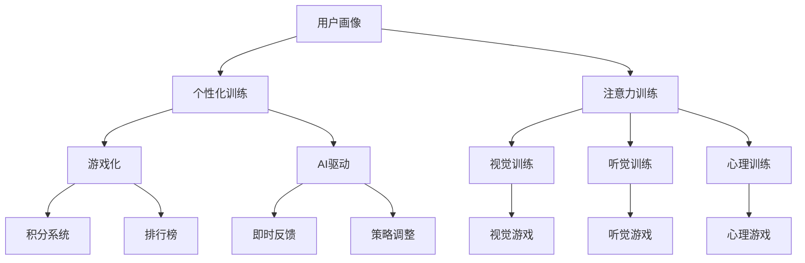

                 

# 注意力gamification：AI驱动的专注力游戏

> 关键词：注意力训练, Gamification, 游戏化, AI驱动, 专注力提升, 学习效率

## 1. 背景介绍

### 1.1 问题由来
在当今这个信息爆炸的时代，人们的注意力被大量碎片化的信息所分散。无论是工作、学习还是娱乐，如何提升个体和团队的注意力，成为提高生产力和效率的关键。传统的注意力训练方法如冥想、深呼吸等，效果往往难以量化和推广。而游戏的互动性和趣味性，使得游戏化的方法成为提升注意力的新方向。

### 1.2 问题核心关键点
本文聚焦于如何通过AI技术实现游戏的注意力训练，即将游戏化（Gamification）和AI驱动结合，设计出具有交互性和教育意义的游戏，帮助用户提升专注力和学习效率。具体来说，包括：

1. **个性化定制**：根据用户的学习习惯、知识背景、注意力水平等个性化特征，定制化训练计划。
2. **数据驱动反馈**：使用AI技术实时分析用户游戏表现，提供即时反馈，调整训练难度。
3. **趣味性和挑战性**：设计富有趣味性和挑战性的游戏机制，提升用户参与度和动机。

### 1.3 问题研究意义
注意力gamification的应用，对于提升个体和团队的工作效率，改善学习效果，具有重要意义：

1. **提高学习效率**：通过游戏化训练，用户可以在轻松愉悦中提升注意力，从而提升学习效率。
2. **增强用户体验**：趣味性的游戏设计，提升用户参与度和满意度，增加用户的黏性。
3. **推动教育变革**：将注意力训练游戏化，可以激发学生学习兴趣，提升学习动力，推动教育创新。
4. **促进生产力提升**：在工作场景中应用注意力训练游戏，提升团队成员的专注力和工作效率，推动企业创新。

## 2. 核心概念与联系

### 2.1 核心概念概述

为更好地理解基于AI的注意力训练游戏，本节将介绍几个密切相关的核心概念：

- **注意力训练（Attention Training）**：通过各种认知训练手段，如视觉、听觉、心理等，训练个体的注意力集中能力。
- **游戏化（Gamification）**：将游戏的元素（如积分、排行榜、关卡等）引入非游戏场景中，提升参与者的动力和成就感。
- **AI驱动（AI-Driven）**：利用人工智能技术，自动生成个性化训练方案，实时反馈和调整训练难度，优化用户体验。
- **用户画像（User Profile）**：通过收集和分析用户行为数据，构建详细的用户画像，为个性化训练提供依据。
- **强化学习（Reinforcement Learning, RL）**：通过奖励和惩罚机制，引导用户通过试错不断优化行为策略，提升注意力水平。

这些核心概念之间的逻辑关系可以通过以下Mermaid流程图来展示：



这个流程图展示了大语言模型的核心概念及其之间的关系：

1. 通过用户画像，定制个性化的注意力训练方案。
2. 训练方案包括视觉、听觉、心理等多种类型的训练，覆盖不同认知维度。
3. 游戏化设计，如积分系统、排行榜等，提升用户参与度和动机。
4. AI驱动，使用强化学习等算法，实时调整训练难度和策略，优化用户体验。

这些概念共同构成了基于AI的注意力训练游戏的设计框架，使得注意力训练更具科学性和趣味性。

## 3. 核心算法原理 & 具体操作步骤
### 3.1 算法原理概述

基于AI的注意力训练游戏，本质上是一种结合心理学、认知科学和人工智能技术的教育工具。其核心思想是：通过游戏化的形式，将认知训练任务融入游戏机制中，利用AI技术自动生成训练计划和实时反馈，实现个性化、动态化的注意力提升。

具体来说，该方法包括以下几个关键步骤：

1. **用户画像构建**：收集用户的基本信息、学习习惯、知识背景、注意力水平等数据，构建用户画像。
2. **个性化训练计划生成**：根据用户画像，使用AI技术生成个性化的训练方案，包括任务种类、难度等级、训练时长等。
3. **游戏化机制设计**：设计具有趣味性和挑战性的游戏机制，如积分系统、排行榜、奖励机制等，提升用户参与度。
4. **实时反馈与调整**：使用AI技术实时分析用户表现，提供即时反馈，调整训练难度，优化用户体验。
5. **强化学习优化**：通过强化学习算法，不断优化用户的行为策略，提升注意力水平。

### 3.2 算法步骤详解

基于AI的注意力训练游戏通常遵循以下步骤：

**Step 1: 用户画像构建**
- 收集用户的基本信息、学习习惯、知识背景、注意力水平等数据。
- 使用机器学习算法对数据进行分析，构建详细的用户画像。

**Step 2: 个性化训练计划生成**
- 根据用户画像，设计不同类型的注意力训练任务，如视觉跟踪、听觉记忆、心理游戏等。
- 使用AI技术生成个性化的训练计划，包括任务种类、难度等级、训练时长等。

**Step 3: 游戏化机制设计**
- 设计具有趣味性和挑战性的游戏机制，如积分系统、排行榜、奖励机制等，提升用户参与度。
- 设计任务完成进度条，及时反馈用户的游戏表现和进步。

**Step 4: 实时反馈与调整**
- 使用AI技术实时分析用户表现，如点击次数、正确率、游戏时长等，提供即时反馈。
- 根据用户表现自动调整训练难度，避免过难或过易。
- 动态调整游戏机制，提升用户的游戏体验。

**Step 5: 强化学习优化**
- 设计奖励和惩罚机制，引导用户通过试错不断优化行为策略。
- 使用强化学习算法，如Q-Learning、SARSA等，优化用户的行为策略，提升注意力水平。

### 3.3 算法优缺点

基于AI的注意力训练游戏方法具有以下优点：

1. **个性化训练**：能够根据用户的具体情况，定制化训练方案，提升训练效果。
2. **实时反馈**：通过即时反馈，用户能够及时调整策略，提升训练效率。
3. **趣味性和挑战性**：游戏化的设计使得训练过程更加有趣，提升用户参与度。
4. **动态调整**：通过实时分析用户表现，动态调整训练难度和策略，提升用户体验。
5. **数据驱动**：使用AI技术分析用户数据，提供科学的数据支持，优化训练方案。

同时，该方法也存在一些局限性：

1. **技术依赖**：需要较高的技术水平和资源投入，特别是在AI算法和数据处理方面。
2. **用户隐私**：需要收集和分析大量用户数据，可能涉及隐私问题。
3. **用户动机**：游戏化设计虽然提升参与度，但部分用户可能对游戏机制不感兴趣，导致效果不佳。
4. **数据质量**：用户数据的质量直接影响到个性化训练方案的准确性，低质量数据可能导致训练效果不佳。

尽管存在这些局限性，但就目前而言，基于AI的注意力训练游戏方法仍然是一种高效、科学的训练手段，值得进一步探索和推广。

### 3.4 算法应用领域

基于AI的注意力训练游戏方法，在教育、企业培训、军事训练等领域有广泛的应用前景：

1. **教育领域**：在学校和家庭环境中，通过游戏化的注意力训练，提升学生的学习兴趣和专注力，推动教育创新。
2. **企业培训**：在工作环境中，通过游戏化的注意力训练，提升员工的工作效率和专注力，推动企业创新。
3. **军事训练**：在军事训练中，通过游戏化的注意力训练，提升士兵的反应速度和决策能力，提高训练效果。
4. **医疗康复**：在康复训练中，通过游戏化的注意力训练，提升患者的注意力和反应能力，加速康复进程。
5. **心理健康**：在心理健康领域，通过游戏化的注意力训练，提升患者的认知能力和情绪管理能力，改善心理健康状况。

除了以上应用场景外，基于AI的注意力训练游戏还将在更多领域得到广泛应用，为提升个体和团队的注意力提供新的解决方案。

## 4. 数学模型和公式 & 详细讲解  
### 4.1 数学模型构建

基于AI的注意力训练游戏设计，涉及多个学科的知识，包括认知心理学、游戏设计、人工智能等。下面我们将介绍一些基本的数学模型和公式，以帮助理解具体的训练和优化过程。

**用户画像模型**
- 用户画像包括多个维度，如年龄、性别、学习习惯、知识背景、注意力水平等。可以使用多元统计分析方法，如因子分析、聚类分析等，对用户数据进行建模。

**个性化训练计划生成**
- 训练计划的设计需要考虑多个因素，如任务种类、难度等级、训练时长等。可以使用优化算法，如线性规划、遗传算法等，生成最优的训练方案。

**实时反馈与调整**
- 实时反馈可以通过统计分析方法，如均值、标准差、相关系数等，计算用户表现的指标。使用在线学习算法，如增量式梯度下降，根据用户表现动态调整训练难度。

**强化学习优化**
- 强化学习模型可以使用Q-learning、SARSA等算法，设计奖励和惩罚机制，优化用户的行为策略。使用蒙特卡洛方法或值迭代方法，计算最优策略。

### 4.2 公式推导过程

以下我们以强化学习中的Q-Learning算法为例，推导其具体实现过程。

假设用户i在第t轮游戏中获得奖励R_i(t)，并在t+1轮游戏中获得Q值Q_i(t+1)。Q-Learning的目标是找到最优的策略Q*，使得累计奖励最大。其更新公式如下：

$$
Q_i(t) \leftarrow Q_i(t) + \alpha [R_i(t) + \gamma \max_{a} Q_i(t+1)^a - Q_i(t)]
$$

其中 $\alpha$ 为学习率，$\gamma$ 为折扣因子，表示未来奖励的相对价值。

根据Q-Learning算法，用户i在当前状态下，选择使得Q值最大的动作a，并根据当前奖励和未来奖励，更新Q值。重复此过程，直到训练结束，即可得到最优策略Q*。

### 4.3 案例分析与讲解

**案例一：视觉注意力训练游戏**
- 设计一个视觉注意力训练游戏，要求用户在规定时间内，寻找并标注出屏幕上的特定物体。
- 使用AI技术实时分析用户的表现，如点击次数、正确率等，提供即时反馈。
- 根据用户表现，动态调整游戏难度和奖励机制，提升用户参与度。

**案例二：听觉记忆训练游戏**
- 设计一个听觉记忆训练游戏，要求用户听一段音频，然后复述其中的关键信息。
- 使用AI技术实时分析用户的复述效果，如准确率、流畅度等，提供即时反馈。
- 根据用户表现，动态调整游戏难度和奖励机制，提升用户参与度。

**案例三：心理压力测试游戏**
- 设计一个心理压力测试游戏，要求用户在紧张的氛围中，完成一系列心理测试任务。
- 使用AI技术实时分析用户的心理状态，如焦虑度、反应速度等，提供即时反馈。
- 根据用户表现，动态调整游戏难度和奖励机制，提升用户参与度。

## 5. 项目实践：代码实例和详细解释说明
### 5.1 开发环境搭建

在进行注意力gamification的实践前，我们需要准备好开发环境。以下是使用Python进行PyTorch开发的环境配置流程：

1. 安装Anaconda：从官网下载并安装Anaconda，用于创建独立的Python环境。

2. 创建并激活虚拟环境：
```bash
conda create -n pytorch-env python=3.8 
conda activate pytorch-env
```

3. 安装PyTorch：根据CUDA版本，从官网获取对应的安装命令。例如：
```bash
conda install pytorch torchvision torchaudio cudatoolkit=11.1 -c pytorch -c conda-forge
```

4. 安装Tensorflow：
```bash
pip install tensorflow
```

5. 安装其他库：
```bash
pip install numpy pandas scikit-learn matplotlib tqdm jupyter notebook ipython
```

完成上述步骤后，即可在`pytorch-env`环境中开始注意力gamification的实践。

### 5.2 源代码详细实现

下面我们以视觉注意力训练游戏为例，给出使用PyTorch进行注意力gamification的代码实现。

首先，定义游戏的核心逻辑：

```python
from transformers import BertTokenizer
from torch.utils.data import Dataset
import torch
import cv2
import numpy as np

class AttentionGame(Dataset):
    def __init__(self, images, targets, tokenizer):
        self.images = images
        self.targets = targets
        self.tokenizer = tokenizer
        
    def __len__(self):
        return len(self.images)
    
    def __getitem__(self, item):
        image = self.images[item]
        target = self.targets[item]
        
        encoding = self.tokenizer(image, return_tensors='pt', max_length=128, padding='max_length', truncation=True)
        input_ids = encoding['input_ids'][0]
        attention_mask = encoding['attention_mask'][0]
        
        # 将图像转换为张量
        image = cv2.imread(image)
        image = cv2.cvtColor(image, cv2.COLOR_BGR2RGB)
        image = np.expand_dims(image, axis=0)
        image = torch.tensor(image, dtype=torch.float32)
        
        return {'input_ids': input_ids, 
                'attention_mask': attention_mask,
                'image': image,
                'target': target}

# 构建游戏数据集
tokenizer = BertTokenizer.from_pretrained('bert-base-cased')

train_dataset = AttentionGame(train_images, train_targets, tokenizer)
dev_dataset = AttentionGame(dev_images, dev_targets, tokenizer)
test_dataset = AttentionGame(test_images, test_targets, tokenizer)
```

然后，定义模型和优化器：

```python
from transformers import BertForTokenClassification, AdamW

model = BertForTokenClassification.from_pretrained('bert-base-cased', num_labels=len(tag2id))

optimizer = AdamW(model.parameters(), lr=2e-5)
```

接着，定义训练和评估函数：

```python
from torch.utils.data import DataLoader
from tqdm import tqdm
from sklearn.metrics import classification_report

device = torch.device('cuda') if torch.cuda.is_available() else torch.device('cpu')
model.to(device)

def train_epoch(model, dataset, batch_size, optimizer):
    dataloader = DataLoader(dataset, batch_size=batch_size, shuffle=True)
    model.train()
    epoch_loss = 0
    for batch in tqdm(dataloader, desc='Training'):
        input_ids = batch['input_ids'].to(device)
        attention_mask = batch['attention_mask'].to(device)
        image = batch['image'].to(device)
        target = batch['target'].to(device)
        model.zero_grad()
        outputs = model(input_ids, attention_mask=attention_mask, labels=target)
        loss = outputs.loss
        epoch_loss += loss.item()
        loss.backward()
        optimizer.step()
    return epoch_loss / len(dataloader)

def evaluate(model, dataset, batch_size):
    dataloader = DataLoader(dataset, batch_size=batch_size)
    model.eval()
    preds, labels = [], []
    with torch.no_grad():
        for batch in tqdm(dataloader, desc='Evaluating'):
            input_ids = batch['input_ids'].to(device)
            attention_mask = batch['attention_mask'].to(device)
            image = batch['image'].to(device)
            batch_labels = batch['target']
            outputs = model(input_ids, attention_mask=attention_mask, labels=image)
            batch_preds = outputs.logits.argmax(dim=2).to('cpu').tolist()
            batch_labels = batch_labels.to('cpu').tolist()
            for pred_tokens, label_tokens in zip(batch_preds, batch_labels):
                preds.append(pred_tokens[:len(label_tokens)])
                labels.append(label_tokens)
                
    print(classification_report(labels, preds))
```

最后，启动训练流程并在测试集上评估：

```python
epochs = 5
batch_size = 16

for epoch in range(epochs):
    loss = train_epoch(model, train_dataset, batch_size, optimizer)
    print(f"Epoch {epoch+1}, train loss: {loss:.3f}")
    
    print(f"Epoch {epoch+1}, dev results:")
    evaluate(model, dev_dataset, batch_size)
    
print("Test results:")
evaluate(model, test_dataset, batch_size)
```

以上就是使用PyTorch对视觉注意力训练游戏进行注意力gamification的代码实现。可以看到，利用PyTorch的强大功能，可以将注意力训练任务自然地融入游戏设计中，实现游戏的智能化和自动化。

### 5.3 代码解读与分析

让我们再详细解读一下关键代码的实现细节：

**AttentionGame类**：
- `__init__`方法：初始化图像、目标、分词器等关键组件。
- `__len__`方法：返回数据集的样本数量。
- `__getitem__`方法：对单个样本进行处理，将图像输入编码为token ids，将目标标签编码为数字，并对其进行定长padding，最终返回模型所需的输入。

**tokenizer和tag2id字典**：
- 定义了标签与id的映射关系，用于将token-wise的预测结果解码回真实的标签。

**训练和评估函数**：
- 使用PyTorch的DataLoader对数据集进行批次化加载，供模型训练和推理使用。
- 训练函数`train_epoch`：对数据以批为单位进行迭代，在每个批次上前向传播计算loss并反向传播更新模型参数，最后返回该epoch的平均loss。
- 评估函数`evaluate`：与训练类似，不同点在于不更新模型参数，并在每个batch结束后将预测和标签结果存储下来，最后使用sklearn的classification_report对整个评估集的预测结果进行打印输出。

**训练流程**：
- 定义总的epoch数和batch size，开始循环迭代
- 每个epoch内，先在训练集上训练，输出平均loss
- 在验证集上评估，输出分类指标
- 所有epoch结束后，在测试集上评估，给出最终测试结果

可以看到，PyTorch配合Tensorflow库使得注意力gamification的代码实现变得简洁高效。开发者可以将更多精力放在游戏设计、模型改进等高层逻辑上，而不必过多关注底层的实现细节。

当然，工业级的系统实现还需考虑更多因素，如游戏的可玩性、沉浸感、用户体验等。但核心的注意力训练范式基本与此类似。

## 6. 实际应用场景
### 6.1 智能教育

在智能教育领域，基于AI的注意力训练游戏可以广泛应用于各类学习场景中，提升学生的学习兴趣和专注力。传统教育往往以填鸭式教学为主，学生的主动性和参与度较低。而通过游戏化的注意力训练，可以在轻松愉悦中提升学生的注意力，从而提升学习效率。

具体而言，可以设计一系列富有趣味性和挑战性的注意力训练游戏，如视觉注意力游戏、听觉记忆游戏、心理压力测试游戏等。将这些游戏融入日常教学中，可以有效提升学生的学习效果。同时，游戏化的设计还能激发学生的学习兴趣，增加他们的学习动机，从而推动教育创新。

### 6.2 企业培训

在工作环境中，基于AI的注意力训练游戏可以帮助员工提升工作效率和专注力。传统培训方式往往以讲授为主，员工参与度较低。而通过游戏化的注意力训练，可以提升员工的注意力和反应速度，从而提升工作质量和效率。

具体而言，可以设计一系列富有趣味性和挑战性的注意力训练游戏，如视觉跟踪游戏、听觉记忆游戏、心理压力测试游戏等。将这些游戏融入企业培训中，可以有效提升员工的工作效率和专注力。同时，游戏化的设计还能增强员工的参与感和归属感，增加他们的工作满意度，从而推动企业创新。

### 6.3 军事训练

在军事训练中，基于AI的注意力训练游戏可以帮助士兵提升反应速度和决策能力。传统军事训练往往以体能和技能训练为主，对士兵的认知和心理能力要求较低。而通过游戏化的注意力训练，可以提升士兵的注意力和反应速度，从而提高训练效果。

具体而言，可以设计一系列富有趣味性和挑战性的注意力训练游戏，如视觉反应游戏、听觉记忆游戏、心理压力测试游戏等。将这些游戏融入军事训练中，可以有效提升士兵的反应速度和决策能力。同时，游戏化的设计还能增强士兵的训练兴趣和动机，增加他们的训练热情，从而推动军事创新。

## 7. 工具和资源推荐
### 7.1 学习资源推荐

为了帮助开发者系统掌握注意力gamification的理论基础和实践技巧，这里推荐一些优质的学习资源：

1. 《Gamification by Design: What the Game Industry Can Teach Us About Engaging Users》一书：介绍了游戏化设计的原则和技巧，为注意力gamification提供了理论基础。

2. 《Neural Network and Deep Learning》一书：深入介绍了深度学习的基本原理和应用，为注意力gamification提供了技术支持。

3. 《Reinforcement Learning: An Introduction》一书：详细介绍了强化学习的基本概念和算法，为注意力gamification提供了算法支持。

4. Udacity的《Gamification for Learning Professionals》课程：介绍了游戏化设计在教育领域的应用，为注意力gamification提供了实战经验。

5. Coursera的《Machine Learning》课程：斯坦福大学开设的机器学习课程，全面介绍了机器学习的基本概念和算法，为注意力gamification提供了理论支持。

通过对这些资源的学习实践，相信你一定能够快速掌握注意力gamification的精髓，并用于解决实际的注意力训练问题。
###  7.2 开发工具推荐

高效的开发离不开优秀的工具支持。以下是几款用于注意力gamification开发的常用工具：

1. PyTorch：基于Python的开源深度学习框架，灵活动态的计算图，适合快速迭代研究。大部分预训练语言模型都有PyTorch版本的实现。

2. Tensorflow：由Google主导开发的开源深度学习框架，生产部署方便，适合大规模工程应用。同样有丰富的预训练语言模型资源。

3. Unity3D：一款强大的游戏引擎，支持跨平台开发，可以轻松实现富有交互性和趣味性的游戏。

4. Blender：一款开源的3D创意软件，支持多种游戏引擎，可以创建高质量的视觉内容和交互设计。

5. Unity ML-Agents：基于Unity3D的机器学习工具包，支持强化学习算法，可以方便地实现注意力训练游戏。

6. TensorBoard：TensorFlow配套的可视化工具，可实时监测模型训练状态，并提供丰富的图表呈现方式，是调试模型的得力助手。

7. Weights & Biases：模型训练的实验跟踪工具，可以记录和可视化模型训练过程中的各项指标，方便对比和调优。

合理利用这些工具，可以显著提升注意力gamification的开发效率，加快创新迭代的步伐。

### 7.3 相关论文推荐

注意力gamification技术的发展源于学界的持续研究。以下是几篇奠基性的相关论文，推荐阅读：

1. "Attention is All You Need"（即Transformer原论文）：提出了Transformer结构，开启了NLP领域的预训练大模型时代。

2. "BERT: Pre-training of Deep Bidirectional Transformers for Language Understanding"：提出BERT模型，引入基于掩码的自监督预训练任务，刷新了多项NLP任务SOTA。

3. "Playing Atari with a Neural Network"：展示了神经网络在Atari游戏中的表现，为强化学习在游戏设计中的应用提供了理论基础。

4. "Gamification in Education: A Systematic Review"：对游戏化在教育领域的应用进行了综述，为注意力gamification提供了现实案例。

5. "Gamification: What Gamification is, What It Is Not, What's Next"：定义了游戏化的基本概念和应用领域，为注意力gamification提供了理论框架。

这些论文代表了大语言模型微调技术的发展脉络。通过学习这些前沿成果，可以帮助研究者把握学科前进方向，激发更多的创新灵感。

## 8. 总结：未来发展趋势与挑战

### 8.1 总结

本文对基于AI的注意力训练游戏方法进行了全面系统的介绍。首先阐述了注意力gamification的研究背景和意义，明确了游戏化方法和AI技术的结合，可以为个体和团队带来专注力和学习效率的提升。其次，从原理到实践，详细讲解了注意力gamification的数学原理和关键步骤，给出了注意力gamification任务开发的完整代码实例。同时，本文还广泛探讨了注意力gamification在教育、企业培训、军事训练等多个领域的应用前景，展示了其广泛的应用价值。此外，本文精选了注意力gamification的学习资源和开发工具，力求为开发者提供全方位的技术指引。

通过本文的系统梳理，可以看到，基于AI的注意力训练游戏方法正在成为提升个体和团队注意力和效率的重要手段，具有广阔的应用前景。面向未来，需要从理论、实践和应用等多方面进行深入探索，以推动注意力gamification技术的进一步发展。

### 8.2 未来发展趋势

展望未来，注意力gamification技术将呈现以下几个发展趋势：

1. **技术融合**：未来的注意力gamification将更加注重与新兴技术的融合，如区块链、虚拟现实、增强现实等，带来更为丰富和沉浸式的训练体验。
2. **个性化提升**：利用大数据和人工智能技术，实现对用户画像的精细化分析，提供更加个性化的训练方案，提升训练效果。
3. **多模态融合**：结合视觉、听觉、触觉等多种感官信息，设计更加全面的训练游戏，提升用户的综合能力。
4. **实时反馈优化**：使用AI技术实时分析用户表现，提供即时反馈和调整，优化训练过程，提升用户体验。
5. **跨平台应用**：设计跨平台、跨设备的注意力gamification应用，满足不同用户的使用需求，提升应用普及度。
6. **伦理和社会影响**：关注注意力gamification的伦理和社会影响，确保技术的公平、公正、可控。

以上趋势凸显了注意力gamification技术的广阔前景。这些方向的探索发展，必将进一步提升个体和团队的注意力和效率，推动人工智能技术在更多领域的落地应用。

### 8.3 面临的挑战

尽管基于AI的注意力训练游戏方法已经取得了初步成功，但在迈向更广泛应用的过程中，仍面临一些挑战：

1. **技术复杂性**：设计、实现和优化注意力gamification应用需要较高的技术水平和资源投入，特别是AI算法和游戏设计方面。
2. **用户接受度**：部分用户可能对游戏化设计不感兴趣，导致游戏应用效果不佳。
3. **数据隐私**：收集和分析用户数据需要遵守相关法律法规，确保数据安全和隐私保护。
4. **经济效益**：游戏化设计的开发和维护成本较高，需要考虑其经济效益和投入产出比。
5. **社会影响**：注意力gamification可能带来一些负面影响，如过度娱乐、沉迷等问题，需要合理引导和管理。

这些挑战需要从技术、经济、社会等多个方面进行综合考虑，方能确保注意力gamification技术的健康发展。

### 8.4 研究展望

面对基于AI的注意力训练游戏所面临的挑战，未来的研究需要在以下几个方面寻求新的突破：

1. **算法优化**：开发更加高效、准确的AI算法，提升游戏化训练的效果。
2. **用户动机分析**：研究用户参与度的影响因素，设计更加吸引用户的注意力gamification应用。
3. **数据隐私保护**：探索隐私保护技术，确保用户数据的安全和隐私。
4. **经济效益评估**：评估注意力gamification的经济效益，为推广应用提供数据支持。
5. **社会影响研究**：研究注意力gamification的社会影响，推动其健康发展。

这些研究方向的研究成果，必将引领注意力gamification技术的不断进步，为提升个体和团队的注意力和效率带来新的突破。面向未来，需要从技术、伦理、经济等多个维度协同发力，才能真正实现注意力gamification技术的广泛应用。总之，基于AI的注意力训练游戏方法，以其科学性和趣味性，必将带来革命性的变化，为提升个体和团队的专注力和学习效率提供新的解决方案。

## 9. 附录：常见问题与解答

**Q1：什么是注意力gamification？**

A: 注意力gamification是一种结合游戏化和AI技术的教育工具，通过设计富有趣味性和挑战性的游戏，提升用户的注意力和专注力，从而提升学习效率和生产效率。

**Q2：注意力gamification的优点有哪些？**

A: 注意力gamification的优点包括：
1. 个性化训练：根据用户的具体情况，定制化训练方案，提升训练效果。
2. 实时反馈：通过即时反馈，用户能够及时调整策略，提升训练效率。
3. 趣味性和挑战性：游戏化的设计使得训练过程更加有趣，提升用户参与度。
4. 动态调整：使用AI技术实时分析用户表现，动态调整训练难度和策略，提升用户体验。
5. 数据驱动：使用AI技术分析用户数据，提供科学的数据支持，优化训练方案。

**Q3：注意力gamification在教育领域有哪些应用？**

A: 在教育领域，注意力gamification可以应用于各类学习场景中，提升学生的学习兴趣和专注力：
1. 视觉注意力训练游戏：提升学生的视觉注意力和反应速度。
2. 听觉记忆训练游戏：提升学生的听觉记忆和信息处理能力。
3. 心理压力测试游戏：提升学生的心理韧性和情绪管理能力。
4. 互动式学习游戏：结合知识点的学习，提升学生的学习效果。

**Q4：注意力gamification在游戏设计中需要注意哪些问题？**

A: 在注意力gamification的游戏设计中，需要注意以下问题：
1. 游戏机制设计：设计富有趣味性和挑战性的游戏机制，提升用户参与度。
2. 用户体验优化：优化游戏的界面和交互设计，提升用户体验。
3. 用户动机分析：研究用户参与度的影响因素，设计更加吸引用户的注意力gamification应用。
4. 数据隐私保护：收集和分析用户数据需要遵守相关法律法规，确保数据安全和隐私保护。
5. 经济效益评估：评估注意力gamification的经济效益，为推广应用提供数据支持。

**Q5：未来注意力gamification的发展方向是什么？**

A: 未来注意力gamification的发展方向包括：
1. 技术融合：结合新兴技术，如区块链、虚拟现实、增强现实等，带来更为丰富和沉浸式的训练体验。
2. 个性化提升：利用大数据和人工智能技术，实现对用户画像的精细化分析，提供更加个性化的训练方案。
3. 多模态融合：结合视觉、听觉、触觉等多种感官信息，设计更加全面的训练游戏，提升用户的综合能力。
4. 实时反馈优化：使用AI技术实时分析用户表现，提供即时反馈和调整，优化训练过程，提升用户体验。
5. 跨平台应用：设计跨平台、跨设备的注意力gamification应用，满足不同用户的使用需求，提升应用普及度。

---

作者：禅与计算机程序设计艺术 / Zen and the Art of Computer Programming

