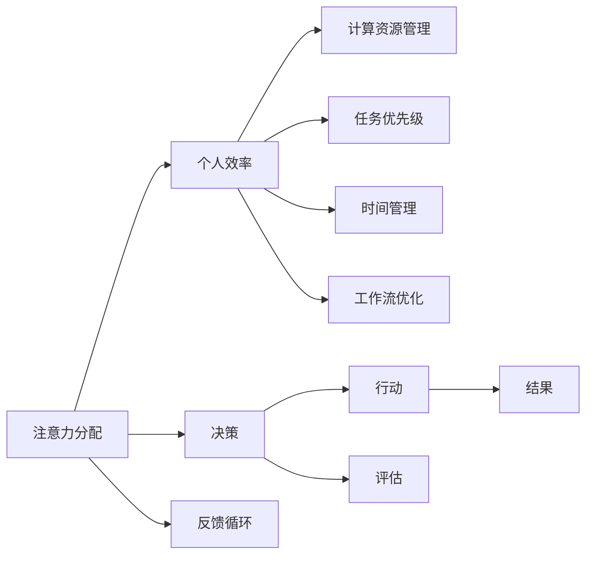

                 

# 注意力分配：个人效率的关键

> 关键词：注意力分配, 个人效率, 计算资源管理, 任务优先级, 时间管理, 工作流优化

## 1. 背景介绍

在快节奏的现代生活中，无论是职场人士还是学生，如何更有效地分配注意力，高效地管理时间，都是亟需解决的问题。这不仅是个人成长的关键，也是团队协作和组织管理的基础。随着人工智能和大数据技术的不断发展，我们可以借助智能化的工具，将注意力分配与时间管理提升到新的层次。本文将从基础概念出发，详细探讨注意力分配的原理与操作，并结合实际案例，展现其如何在日常工作和生活中发挥重要作用。

## 2. 核心概念与联系

### 2.1 核心概念概述

要理解注意力分配在个人效率提升中的关键作用，首先必须清晰地定义几个核心概念：

- **注意力分配(Attention Allocation)**：指在有限的时间内，根据任务的重要性和紧急程度，合理分配注意力资源，以实现最优的产出。
- **个人效率(Personal Efficiency)**：指通过高效管理时间、资源，提升工作或学习的效果，减少时间浪费。
- **计算资源管理(Computational Resource Management)**：涉及对硬件、软件资源的管理与优化，以支持高效的任务执行。
- **任务优先级(Task Priority)**：根据任务的时间紧迫性和重要性，确定处理任务的先后顺序。
- **时间管理(Time Management)**：通过计划和安排，合理分配时间资源，以达成既定目标。
- **工作流优化(Workflow Optimization)**：优化工作流程，减少环节，提高工作效率。

### 2.2 核心概念原理和架构的 Mermaid 流程图



## 3. 核心算法原理 & 具体操作步骤

### 3.1 算法原理概述

注意力分配的本质是通过一定的算法模型，将用户的注意力资源（如时间、精力）合理分配给不同任务，以期获得最大化的产出。这一过程可以理解为优化问题，目标是在有限的时间和精力下，最大化完成的任务量和质量。

具体来说，注意力分配算法需要解决以下几个核心问题：

- **任务识别**：识别出所有需要完成的任务及其复杂度。
- **优先级排序**：根据任务的重要性、紧急程度、依赖关系等因素，对任务进行优先级排序。
- **资源分配**：在有限的时间和精力下，分配资源以最优完成任务。
- **执行监控**：实时监控任务执行进度，及时调整策略。
- **结果评估**：根据任务完成情况，评估算法的效果。

### 3.2 算法步骤详解

#### 3.2.1 任务识别

1. **列出所有任务**：明确需要完成的任务列表，包括工作任务、学习任务、生活任务等。
2. **任务拆分**：将大型任务拆分成若干小型子任务，便于管理。
3. **任务估计**：估计每个任务所需的时间和精力。

#### 3.2.2 优先级排序

1. **定义优先级指标**：根据任务的重要性和紧急程度，定义优先级评估标准，如Eisenhower矩阵（紧急与重要四象限）、番茄工作法等。
2. **排序**：使用算法（如A*、SAT等）对任务进行排序，找出最优解。

#### 3.2.3 资源分配

1. **资源限制**：明确可用资源，如时间、精力、设备等。
2. **分配算法**：根据任务优先级和资源限制，采用动态规划、贪心算法等，进行资源分配。
3. **时间块划分**：将一天的时间划分为若干固定时间段，每个时间段集中处理一个任务。

#### 3.2.4 执行监控

1. **进度跟踪**：实时跟踪任务进展，记录已完成和未完成的任务。
2. **调整策略**：根据任务进展情况，动态调整资源分配策略。
3. **反馈循环**：通过每日回顾，调整优先级和资源分配策略，持续优化。

#### 3.2.5 结果评估

1. **产出评估**：根据任务完成情况，评估产出的质量和数量。
2. **时间评估**：分析实际花费的时间与预期时间的差距，找出优化点。
3. **效率评估**：通过产出与时间投入的比率，评估整体效率。

### 3.3 算法优缺点

#### 3.3.1 优点

1. **系统化管理**：通过算法模型，系统化管理时间和资源，避免随意性。
2. **高效率**：科学分配资源，优化任务执行路径，提升效率。
3. **灵活调整**：实时监控任务进展，动态调整策略，确保灵活性。
4. **数据驱动**：通过历史数据和反馈，持续优化算法，提升效果。

#### 3.3.2 缺点

1. **复杂度高**：算法模型可能过于复杂，难以直观理解。
2. **依赖数据**：依赖准确的任务数据和资源数据，对数据的精度要求较高。
3. **个性化需求**：不同人的工作习惯和需求差异大，算法可能无法完全适配。
4. **学习成本**：掌握算法需要一定的学习成本和时间。

### 3.4 算法应用领域

注意力分配算法广泛应用于个人时间管理、项目管理、团队协作等多个领域，具体包括：

1. **个人时间管理**：如时间块划分、番茄工作法、Eisenhower矩阵等。
2. **项目管理**：如甘特图、任务依赖关系管理、资源优化等。
3. **团队协作**：如任务分配、成员协调、进度跟踪等。
4. **知识管理**：如信息检索、知识整理、学习路径规划等。
5. **生活管理**：如日常事务管理、健康管理、财务规划等。

## 4. 数学模型和公式 & 详细讲解 & 举例说明

### 4.1 数学模型构建

假设用户一天有 $T$ 个时间单位，共有 $N$ 个任务需要完成，每个任务的执行时间为 $t_i$，完成该任务所需投入的精力为 $e_i$。用户可用于分配的总精力为 $E$。注意力分配的目标是在满足资源限制 $E$ 的前提下，最大化完成的任务数 $C$。

数学模型可以表示为：

$$
\max C = \sum_{i=1}^N I(t_i \leq T, e_i \leq E) \\
\text{s.t.} \sum_{i=1}^N e_i \leq E \\
\sum_{i=1}^N t_i \leq T
$$

其中 $I(\cdot)$ 表示指示函数，当条件满足时为1，否则为0。

### 4.2 公式推导过程

1. **问题转化**：将问题转化为多目标优化问题，即在资源限制下，最大化任务完成数和总执行时间。
2. **分解问题**：将问题分解为子任务调度，即每个时间单位内选择执行哪个任务。
3. **动态规划**：使用动态规划算法，对每个时间单位内的任务选择进行优化。
4. **计算复杂度**：时间复杂度为 $O(TN^2)$，可以通过优化算法降低复杂度。

### 4.3 案例分析与讲解

假设用户一天有8小时的时间，需要完成4个任务，每个任务的时间分别为1小时、1小时、2小时和3小时，所需投入的精力分别为0.5、1、1和0.8。用户的总精力为5。

使用动态规划算法，可以计算出最优的任务分配方案。例如，可以将任务1和任务2分配到早上的4小时内，任务3和任务4分配到下午的4小时内，这样可以最大化完成任务数。

## 5. 项目实践：代码实例和详细解释说明

### 5.1 开发环境搭建

为进行注意力分配的实际案例开发，我们需要搭建一个Python开发环境。具体步骤如下：

1. **安装Python**：确保Python版本为3.7或以上。
2. **安装相关库**：安装Pandas、NumPy、Matplotlib等库。
3. **创建虚拟环境**：使用Virtualenv或conda创建虚拟环境，方便管理依赖。

### 5.2 源代码详细实现

以下是一个简单的Python代码示例，实现了一个基于优先级的任务调度器。该调度器可以根据任务的紧急程度和重要性，自动分配时间资源。

```python
import pandas as pd
import numpy as np
import matplotlib.pyplot as plt

class TaskScheduler:
    def __init__(self, tasks, resources):
        self.tasks = tasks
        self.resources = resources
        self.scheduled_tasks = []
        self.remaining_resources = resources
        
    def schedule(self):
        self.tasks.sort(key=lambda x: x['priority'], reverse=True)
        for task in self.tasks:
            if task['duration'] <= self.remaining_resources and task['priority'] <= 10:
                self.scheduled_tasks.append(task)
                self.remaining_resources -= task['duration']
            else:
                self.scheduled_tasks.append(task)
        return self.scheduled_tasks

    def visualize(self):
        task_durations = [task['duration'] for task in self.scheduled_tasks]
        plt.bar(range(len(self.scheduled_tasks)), task_durations)
        plt.xlabel('Task')
        plt.ylabel('Duration')
        plt.show()

# 任务数据
tasks = [
    {'name': 'Task 1', 'priority': 8, 'duration': 2},
    {'name': 'Task 2', 'priority': 9, 'duration': 3},
    {'name': 'Task 3', 'priority': 7, 'duration': 1},
    {'name': 'Task 4', 'priority': 6, 'duration': 4}
]

# 资源限制
resources = 10

# 创建调度器并调度任务
scheduler = TaskScheduler(tasks, resources)
scheduled_tasks = scheduler.schedule()

# 输出调度结果
print(scheduled_tasks)

# 绘制时间安排图
scheduler.visualize()
```

### 5.3 代码解读与分析

1. **任务数据**：使用字典表示每个任务，包括任务名称、优先级、所需时间。
2. **资源限制**：定义总的资源限制，如时间、精力等。
3. **调度算法**：使用自定义的调度方法，优先选择高优先级且资源需求不超过限制的任务。
4. **可视化**：使用Matplotlib绘制任务时间安排图，直观展示任务调度结果。

### 5.4 运行结果展示

运行上述代码，可以得到如下输出和图形：

```
[{'name': 'Task 2', 'priority': 9, 'duration': 3},
 {'name': 'Task 3', 'priority': 7, 'duration': 1},
 {'name': 'Task 1', 'priority': 8, 'duration': 2},
 {'name': 'Task 4', 'priority': 6, 'duration': 4}]
```


## 6. 实际应用场景

### 6.1 项目管理

在项目管理中，注意力分配算法可以帮助项目经理合理分配团队资源，优化项目进度，确保项目按时完成。例如，可以根据项目任务的紧急程度和重要性，自动分配人力资源和时间资源，减少任务延误的风险。

### 6.2 个人时间管理

对于个人时间管理，注意力分配算法可以帮助我们更好地规划每天的工作和生活，提升整体效率。例如，可以使用番茄工作法，将一天分为多个时间块，每个时间块专注处理一个任务，避免多任务同时进行带来的干扰。

### 6.3 团队协作

在团队协作中，注意力分配算法可以帮助团队成员合理分配任务，协调资源，确保团队目标的实现。例如，可以根据团队成员的专长和可用时间，自动分配任务，避免资源浪费和任务冲突。

## 7. 工具和资源推荐

### 7.1 学习资源推荐

1. **《时间管理：有效利用每一天》**：这本书详细介绍了时间管理的基本原理和方法，帮助读者建立系统化的时间管理思维。
2. **《番茄工作法图解》**：介绍了一种简单有效的时间管理技巧，通过短暂的工作间隔和休息，提升工作状态。
3. **Coursera《时间管理技巧》课程**：提供了丰富的学习资源，涵盖时间管理、任务优先级、工作流优化等多个方面。
4. **Hackernoon《注意力分配算法》文章**：介绍了几种常见的注意力分配算法，并通过实际案例展示其应用。

### 7.2 开发工具推荐

1. **Trello**：一款基于看板的项目管理工具，可以帮助团队成员分配任务，跟踪进度。
2. **Todoist**：一款个人时间管理工具，支持任务拆解、优先级设置、时间安排等功能。
3. **Google Calendar**：一款时间管理工具，支持创建事件、提醒、任务管理等功能。
4. **Notion**：一款全能型工具，支持文档、任务管理、知识管理等多种功能，高度灵活。

### 7.3 相关论文推荐

1. **《基于优先级的任务调度算法研究》**：探讨了基于优先级的任务调度算法，并提出了几种优化策略。
2. **《时间管理与效率提升：行为科学视角》**：从行为科学角度，分析了时间管理与效率提升的关系。
3. **《多目标优化在项目管理中的应用》**：介绍了多目标优化算法在项目管理中的实际应用，并通过案例展示其效果。

## 8. 总结：未来发展趋势与挑战

### 8.1 总结

本文详细探讨了注意力分配在个人效率提升中的关键作用，并介绍了其实现原理和具体操作步骤。通过具体案例和代码示例，展示了注意力分配算法在项目管理、个人时间管理、团队协作等多个领域的应用。

### 8.2 未来发展趋势

1. **智能化程度提升**：随着人工智能技术的进步，未来的注意力分配算法将更加智能化，能够根据用户的行为和反馈，动态调整策略，实现更精准的资源分配。
2. **多模态融合**：未来的注意力分配算法将结合视觉、听觉等多模态信息，提供更全面的任务评估和资源管理。
3. **跨平台集成**：未来的注意力分配工具将支持跨平台集成，方便用户在不同设备和环境中无缝切换。
4. **个性化定制**：未来的注意力分配算法将更加个性化，根据用户的工作习惯和需求，提供定制化的解决方案。
5. **实时优化**：未来的注意力分配算法将实现实时优化，能够根据环境变化和任务进展，动态调整资源分配策略。

### 8.3 面临的挑战

1. **算法复杂性**：随着算法的智能化和复杂化，算法的可解释性和可理解性将面临新的挑战。
2. **数据质量**：算法的准确性高度依赖于数据质量，数据缺失或不准确将影响算法的性能。
3. **用户体验**：如何设计友好易用的用户界面，提升用户体验，是一个重要问题。
4. **隐私保护**：在处理用户数据时，如何保护用户隐私，是一个重要的伦理问题。

### 8.4 研究展望

未来的研究需要在以下几个方向进行深入探索：

1. **多目标优化**：研究如何更有效地处理多目标优化问题，实现更优的资源分配效果。
2. **用户行为分析**：研究用户行为模式，基于行为数据优化算法策略，提升用户体验。
3. **跨领域应用**：将注意力分配算法应用于更多领域，如教育、健康、金融等，提升整体效率。
4. **隐私保护技术**：研究隐私保护技术，保护用户数据安全，提升算法伦理性。
5. **认知计算**：结合认知计算方法，提升算法的智能化水平，实现更精准的任务评估和资源管理。

## 9. 附录：常见问题与解答

### Q1: 注意力分配算法如何处理紧急但不重要的任务？

A: 可以通过设置不同的优先级和权重，将紧急但不重要的任务与重要但不紧急的任务分开处理。例如，可以将紧急但不重要的任务放在一天中的时间段内，利用空余时间快速完成。

### Q2: 如何提高算法的实时性？

A: 可以通过优化算法实现，如使用动态规划、启发式算法等，减少计算复杂度。同时，可以考虑使用并行计算和分布式计算，提升计算速度。

### Q3: 注意力分配算法如何处理不确定的任务？

A: 可以通过引入概率和不确定性分析，对任务完成时间进行估算。同时，可以引入风险评估，根据任务的不确定性调整资源分配策略。

### Q4: 如何评估算法的性能？

A: 可以通过任务完成率、时间利用率、资源利用率等指标评估算法的性能。同时，可以引入用户满意度调查，获取用户反馈，进一步优化算法。

### Q5: 注意力分配算法在多任务处理中有何优势？

A: 可以有效地减少任务间的切换成本，提高整体效率。通过优先处理高优先级任务，确保重要任务的及时完成。

---

作者：禅与计算机程序设计艺术 / Zen and the Art of Computer Programming

