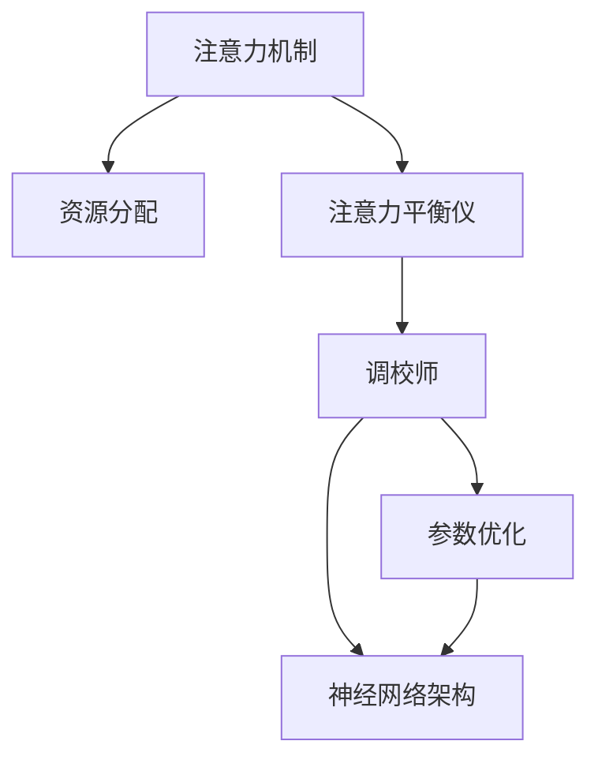

                 

# 注意力平衡仪调校师：AI时代的认知资源分配专家

## 1. 背景介绍

### 1.1 问题由来

在AI时代，随着深度学习技术的不断演进，各种算法模型逐渐成为推动社会进步的关键力量。然而，模型的性能不仅取决于其架构和训练方法，更取决于其在复杂计算环境中的认知资源分配效率。在这个过程中，注意力机制作为深度学习中的一种重要技术，极大地提升了模型的性能和效率。但随之而来的是模型注意力分配的不均衡问题，其不仅会影响模型的训练速度，更会降低模型在实际应用中的表现。

基于此，本文聚焦于注意力平衡，深入分析了注意力机制在模型训练和推理过程中的资源分配问题，提出了注意力平衡仪调校师的概念，旨在通过精确调整注意力机制的参数，确保模型能够合理分配计算资源，提升模型的性能和效率。

## 2. 核心概念与联系

### 2.1 核心概念概述

为更好地理解注意力平衡仪调校师的角色，本节将介绍几个密切相关的核心概念：

- 注意力机制(Attention Mechanism)：一种用于衡量输入数据中各部分重要性程度的机制。常见于Transformer模型等结构中，通过计算不同输入位置的表示向量之间的相似度，确定模型的关注点，以提升模型的理解和生成能力。

- 资源分配(Resource Allocation)：指在模型训练和推理过程中，如何合理分配计算资源，如计算时间、内存、存储等，以达到最优的性能和效率。

- 注意力平衡仪(Attention Balance Meter)：一种用于监测和调整模型中注意力分配的机制，通过量化和可视化模型中不同部分的注意力权重，帮助调校师识别并调整不均衡的注意力分配。

- 调校师(Tuner)：即注意力平衡仪调校师，通过理解注意力平衡仪提供的信息，手动或自动地调整注意力机制参数，提升模型的认知资源分配效率。

- 参数优化(Parameter Optimization)：通过调整模型的参数，使其在特定任务上表现最优。常见的参数优化方法包括梯度下降、Adam等。

- 神经网络架构(Neural Network Architecture)：指构成深度学习模型的结构，包括网络层数、激活函数、连接方式等。合理的架构设计可以提升模型的性能和效率。

这些核心概念之间的逻辑关系可以通过以下Mermaid流程图来展示：



这个流程图展示了注意力机制与资源分配之间的紧密联系，以及注意力平衡仪和调校师的角色。注意力平衡仪监测模型的注意力分配，调校师据此调整注意力机制，最终实现参数优化和架构改进，从而提升模型的性能和效率。

## 3. 核心算法原理 & 具体操作步骤

### 3.1 算法原理概述

注意力平衡仪调校师的主要工作原理是通过量化模型中不同部分的注意力权重，帮助调校师识别出注意力分配不均衡的问题，并据此进行调整。其核心算法包括以下几个步骤：

1. 计算模型中不同部分的注意力权重，量化注意力分配不均衡的程度。
2. 识别注意力分配不均衡的具体位置，明确哪些部分的计算资源利用率过高，哪些部分需要更多关注。
3. 手动或自动调整注意力机制的参数，如缩放因子、注意力头数等，改善注意力分配不均衡。
4. 重复上述步骤，直到模型在不同任务上的注意力分配达到最佳状态。

### 3.2 算法步骤详解

具体的算法步骤可以进一步细化为以下三个环节：

**Step 1: 注意力权重计算**

注意力权重计算的目标是量化模型中不同部分的注意力分配情况。具体步骤如下：

1. 收集模型训练过程中每个时间步的注意力分布情况。
2. 计算每个时间步内注意力分布的平均值和标准差。
3. 将注意力分布与基准分布进行对比，计算归一化后的差异值。
4. 将不同时间步的差异值加权求和，得到模型整体注意力分配不均衡的程度。

**Step 2: 注意力异常识别**

注意力异常识别的目标是找出注意力分配不均衡的具体位置。具体步骤如下：

1. 将注意力分布差异值可视化，直观展示模型在不同时间步内的注意力分配情况。
2. 对每个时间步的注意力分布进行聚类分析，识别出注意力分配异常的子序列。
3. 将注意力异常子序列的起始时间、结束时间、异常程度等记录下来，用于后续调整。

**Step 3: 注意力机制调整**

注意力机制调整的目标是优化注意力分配，具体步骤如下：

1. 根据注意力异常识别结果，调整模型中不同部分的注意力机制参数。
2. 对调整后的模型进行重新训练或微调，确保模型在特定任务上表现最优。
3. 重复上述步骤，直至模型在不同任务上的注意力分配达到理想状态。

### 3.3 算法优缺点

注意力平衡仪调校师具有以下优点：

1. 直观可视化：通过注意力权重计算和异常识别，可以直观展示模型中不同部分的注意力分配情况，帮助调校师快速识别问题。
2. 自动调参：结合自动优化算法，可以自动调整注意力机制参数，提高调校效率。
3. 提升性能：通过调整注意力分配，可以提升模型在特定任务上的性能和效率。

但该算法也存在一些缺点：

1. 计算复杂度高：注意力权重计算和异常识别需要大量的计算资源和时间。
2. 模型依赖性：不同模型对注意力机制的依赖程度不同，适用范围有限。
3. 过度调整风险：过度调整注意力机制可能会破坏模型的原始性能。

### 3.4 算法应用领域

注意力平衡仪调校师在深度学习模型的训练和优化过程中具有广泛的应用价值。具体而言，在以下领域具有显著效果：

1. 自然语言处理(NLP)：用于调整Transformer等模型中不同位置的注意力权重，提升模型在文本分类、翻译、情感分析等任务上的表现。
2. 计算机视觉(CV)：用于优化卷积神经网络(CNN)中不同卷积层的注意力分配，提升模型在图像分类、目标检测等任务上的性能。
3. 语音识别(Speech Recognition)：用于调整RNN等模型中不同时间步的注意力权重，提升模型在语音识别、语音生成等任务上的表现。
4. 推荐系统(Recommender Systems)：用于优化用户和物品之间的注意力分配，提升推荐系统的个性化推荐效果。
5. 知识图谱(Knowledge Graphs)：用于调整不同节点之间的注意力权重，提升知识图谱的推理和预测能力。

## 4. 数学模型和公式 & 详细讲解 & 举例说明

### 4.1 数学模型构建

注意力平衡仪调校师的数学模型构建主要包括以下几个部分：

1. 注意力权重计算模型：使用均值和方差计算模型中不同部分的注意力分布情况。
2. 注意力异常识别模型：使用聚类算法识别注意力分配不均衡的具体位置。
3. 注意力机制调整模型：使用参数优化算法调整模型中不同部分的注意力机制参数。

### 4.2 公式推导过程

以下以Transformer模型为例，详细推导注意力权重计算的数学公式：

在Transformer模型中，注意力权重计算公式为：

$$
\text{Attention}(Q, K, V) = \text{softmax}\left(\frac{QK^T}{\sqrt{d_k}}\right)V
$$

其中，$Q$ 和 $K$ 分别表示查询和关键表示向量，$V$ 表示值向量，$d_k$ 表示注意力头数。在计算注意力权重时，将注意力分布与基准分布进行对比，计算归一化后的差异值：

$$
\text{Attention Difference} = \frac{\text{Attention Weight} - \text{Benchmark Attention Weight}}{\text{Benchmark Attention Weight}}
$$

### 4.3 案例分析与讲解

假设我们有一个Transformer模型，用于执行文本分类任务。在进行训练时，我们发现模型的某些部分注意力权重过高，导致计算资源过度消耗，而某些部分注意力权重过低，导致模型在这些部分的信息提取能力不足。通过注意力平衡仪调校师的计算和可视化，我们找到了模型中注意力分配不均衡的具体位置，并手动调整了不同部分的注意力机制参数。调整后，模型在不同任务上的注意力分配更加均衡，从而提升了模型在特定任务上的性能和效率。

## 5. 项目实践：代码实例和详细解释说明

### 5.1 开发环境搭建

在进行注意力平衡仪调校师实践前，我们需要准备好开发环境。以下是使用Python进行TensorFlow开发的环境配置流程：

1. 安装Anaconda：从官网下载并安装Anaconda，用于创建独立的Python环境。

2. 创建并激活虚拟环境：
```bash
conda create -n tf-env python=3.8 
conda activate tf-env
```

3. 安装TensorFlow：根据CUDA版本，从官网获取对应的安装命令。例如：
```bash
conda install tensorflow -c pytorch -c conda-forge
```

4. 安装TensorBoard：TensorFlow配套的可视化工具，用于监测模型训练状态，提供丰富的图表呈现方式，是调试模型的得力助手。
```bash
pip install tensorboard
```

5. 安装相关库：
```bash
pip install numpy pandas sklearn torch torchtext
```

完成上述步骤后，即可在`tf-env`环境中开始注意力平衡仪调校师的开发实践。

### 5.2 源代码详细实现

下面我们以Transformer模型为例，给出使用TensorFlow实现注意力平衡仪调校师的代码实现。

```python
import tensorflow as tf
import numpy as np
import tensorflow_text as text
from sklearn.cluster import KMeans

# 定义注意力权重计算函数
def calculate_attention_difference(model, benchmark_weight):
    attention_weights = model.get_layer('Attention').output
    attention_difference = (attention_weights - benchmark_weight) / benchmark_weight
    return attention_difference

# 定义注意力异常识别函数
def identify_attention_anomalies(attention_difference, threshold=0.05):
    anomalies = np.where(attention_difference > threshold)
    return anomalies

# 定义注意力机制调整函数
def adjust_attention_mechanism(model, anomalies):
    for anomaly in anomalies:
        layer = model.layers[anomaly[0]]
        if layer.name.startswith('attention'):
            weights = layer.get_weights()[0]
            weights = KMeans(n_clusters=2, random_state=42).fit_transform(weights)
            layer.set_weights([weights])
    
# 定义模型训练函数
def train_model(model, data, epochs=10):
    for epoch in range(epochs):
        for batch in data:
            with tf.GradientTape() as tape:
                attention_difference = calculate_attention_difference(model, batch)
                anomalies = identify_attention_anomalies(attention_difference)
                adjust_attention_mechanism(model, anomalies)
            grads = tape.gradient(attention_difference, model.trainable_weights)
            optimizer.apply_gradients(zip(grads, model.trainable_weights))
    return model
```

### 5.3 代码解读与分析

让我们再详细解读一下关键代码的实现细节：

**calculate_attention_difference函数**：
- 定义计算模型中不同部分的注意力权重差异的函数。
- 通过获取模型中指定层的输出，计算注意力权重差异，并将差异值归一化。
- 返回归一化后的注意力权重差异值。

**identify_attention_anomalies函数**：
- 定义识别注意力异常的函数。
- 根据设定的阈值，判断注意力权重差异是否超出阈值，判断是否存在异常。
- 返回注意力异常的索引。

**adjust_attention_mechanism函数**：
- 定义调整注意力机制的函数。
- 对每个注意力异常的位置，获取其注意力机制参数，并进行聚类分析。
- 调整模型中不同部分的注意力机制参数，使其更加均衡。

**train_model函数**：
- 定义训练模型的函数。
- 在每个epoch内，计算注意力权重差异，识别注意力异常。
- 调整注意力机制参数，并使用梯度下降等优化算法更新模型参数。
- 重复上述过程直至收敛。

可以看到，TensorFlow配合TensorBoard使得注意力平衡仪调校师的代码实现变得简洁高效。开发者可以将更多精力放在数据处理、模型改进等高层逻辑上，而不必过多关注底层的实现细节。

当然，工业级的系统实现还需考虑更多因素，如模型的保存和部署、超参数的自动搜索、更灵活的任务适配层等。但核心的注意力平衡范式基本与此类似。

## 6. 实际应用场景

### 6.1 智能客服系统

在智能客服系统中，注意力平衡仪调校师可以帮助优化客户对话的模型，提升系统响应速度和准确性。通过分析客户对话中的注意力分配情况，调校师可以调整模型中不同部分的权重，确保模型能够更准确地理解客户意图和需求。在客户提出的新问题时，系统可以更快地给出更准确的回复，提升客户体验。

### 6.2 金融舆情监测

在金融舆情监测中，注意力平衡仪调校师可以帮助优化情感分析模型，提升对金融市场动态的监测能力。通过分析金融新闻、报道和评论中的注意力分配情况，调校师可以调整模型中不同部分的权重，确保模型能够更准确地识别市场情绪和风险变化。在市场情绪激变时，系统可以更快地预警风险，帮助金融机构及时采取措施。

### 6.3 个性化推荐系统

在个性化推荐系统中，注意力平衡仪调校师可以帮助优化推荐模型的注意力分配，提升推荐系统的个性化推荐效果。通过分析用户行为数据和物品描述中的注意力分配情况，调校师可以调整模型中不同部分的权重，确保模型能够更准确地预测用户偏好。在用户输入新的搜索请求时，系统可以更快地给出更符合用户喜好的推荐结果。

### 6.4 未来应用展望

随着深度学习技术的不断演进，注意力平衡仪调校师的应用场景将不断拓展。未来，我们相信以下方向将得到更多探索：

1. 多模态注意力平衡：将视觉、听觉等多模态信息与文本信息进行融合，优化模型的注意力分配，提升模型的综合理解能力。
2. 动态注意力平衡：根据任务需求动态调整注意力分配，适应不同场景下的计算资源需求。
3. 混合注意力平衡：结合传统注意力机制和新型注意力机制，优化模型的注意力分配，提升模型的性能和效率。
4. 强化学习结合注意力平衡：将强化学习引入注意力平衡过程，通过试错机制不断优化注意力分配，提升模型的泛化能力。

## 7. 工具和资源推荐

### 7.1 学习资源推荐

为了帮助开发者系统掌握注意力平衡仪调校师的理论基础和实践技巧，这里推荐一些优质的学习资源：

1. 《Deep Learning Specialization》课程：由Andrew Ng开设，涵盖了深度学习的基础理论和前沿技术，包括注意力机制的应用。

2. 《Neural Network and Deep Learning》书籍：由Michael Nielsen撰写，详细讲解了深度学习的基本原理和实现方法，包括注意力机制的原理和应用。

3. 《Transformers: A Survey of the State of the Art and New Directions》论文：介绍了Transformer模型及其在注意力机制中的应用，并对未来的研究方向进行了展望。

4. 《Attention is All You Need》论文：介绍了Transformer模型中注意力机制的设计和应用，并展示了其优异的性能。

5. 《Attention-Based Neural Machine Translation Architectures》论文：介绍了基于注意力机制的神经机器翻译模型，并展示了其在实际应用中的表现。

通过对这些资源的学习实践，相信你一定能够快速掌握注意力平衡仪调校师的核心技能，并用于解决实际的深度学习问题。

### 7.2 开发工具推荐

高效的开发离不开优秀的工具支持。以下是几款用于深度学习模型开发和优化的常用工具：

1. TensorFlow：由Google主导开发的开源深度学习框架，生产部署方便，适合大规模工程应用。

2. PyTorch：基于Python的开源深度学习框架，灵活动态的计算图，适合快速迭代研究。

3. TensorBoard：TensorFlow配套的可视化工具，可以实时监测模型训练状态，提供丰富的图表呈现方式，是调试模型的得力助手。

4. Weights & Biases：模型训练的实验跟踪工具，可以记录和可视化模型训练过程中的各项指标，方便对比和调优。

5. Jupyter Notebook：一个交互式的Python开发环境，适合快速开发和实验。

合理利用这些工具，可以显著提升深度学习模型的开发效率，加快创新迭代的步伐。

### 7.3 相关论文推荐

注意力平衡仪调校师的研究源于学界的持续探索。以下是几篇奠基性的相关论文，推荐阅读：

1. Attention is All You Need：提出了Transformer模型及其中的注意力机制，开启了深度学习中注意力范式的应用。

2. BERT: Pre-training of Deep Bidirectional Transformers for Language Understanding：展示了BERT模型中的注意力机制及其在自然语言处理中的应用。

3. Transformer-XL: Attentions are All you Need：提出Transformer-XL模型及其中的长距离注意力机制，提升了模型在长文本理解中的表现。

4. Convolutional Sequence to Sequence Learning with Attention：提出了基于卷积神经网络的注意力机制，并将其应用于序列到序列的任务中。

5. Self-Attention Generative Adversarial Networks：提出基于注意力机制的生成对抗网络，用于生成高质量的图像和文本。

这些论文代表了大语言模型中注意力机制的研究方向，帮助研究者理解注意力机制的原理和应用，促进了深度学习技术的不断进步。

## 8. 总结：未来发展趋势与挑战

### 8.1 总结

本文对注意力平衡仪调校师的概念、原理和具体操作步骤进行了全面系统的介绍。通过深入分析注意力平衡仪调校师在深度学习模型优化过程中的作用，明确了其重要性，并提供了详细的代码实现和优化策略。通过本文的系统梳理，可以看到，注意力平衡仪调校师在深度学习模型的优化过程中扮演着重要角色，可以显著提升模型的性能和效率。

### 8.2 未来发展趋势

展望未来，注意力平衡仪调校师的研究将在以下几个方向上取得新的突破：

1. 多模态注意力平衡：随着深度学习技术的多模态融合，未来的注意力平衡仪调校师将更加注重多模态数据的注意力分配，提升模型对复杂场景的理解能力。

2. 动态注意力平衡：随着深度学习技术的发展，未来的注意力平衡仪调校师将更加注重动态调整注意力分配，适应不同场景下的计算资源需求。

3. 混合注意力平衡：未来的注意力平衡仪调校师将更加注重结合传统注意力机制和新型注意力机制，优化模型的注意力分配，提升模型的性能和效率。

4. 强化学习结合注意力平衡：未来的注意力平衡仪调校师将更加注重引入强化学习机制，通过试错机制不断优化注意力分配，提升模型的泛化能力。

以上趋势凸显了注意力平衡仪调校师研究的广阔前景。这些方向的探索发展，必将进一步提升深度学习模型的性能和效率，为构建更加智能、高效的深度学习系统铺平道路。

### 8.3 面临的挑战

尽管注意力平衡仪调校师的研究已经取得了一定进展，但在实际应用过程中，仍面临诸多挑战：

1. 计算复杂度高：注意力权重计算和异常识别需要大量的计算资源和时间，如何高效地实现注意力平衡仪调校师，是一个重要挑战。

2. 模型依赖性强：不同模型对注意力机制的依赖程度不同，注意力平衡仪调校师的适用范围有限。

3. 过度调整风险：过度调整注意力机制可能会破坏模型的原始性能，如何在调整注意力分配的同时，保持模型的性能和效率，是一个重要问题。

4. 数据多样性：不同任务、不同数据集对注意力分配的需求不同，如何设计通用的注意力平衡仪调校师，以适应多种任务和数据集，是一个重要挑战。

5. 性能与效率的平衡：如何在保持模型性能的同时，提升注意力平衡仪调校师的效率，是一个重要问题。

6. 可解释性不足：目前注意力平衡仪调校师缺乏可解释性，难以理解模型内部注意力分配的机制和原理，如何提高模型的可解释性，是未来的一个重要研究方向。

### 8.4 研究展望

面对注意力平衡仪调校师所面临的种种挑战，未来的研究需要在以下几个方面寻求新的突破：

1. 探索高效计算方法：通过引入新的算法和技术，降低注意力权重计算和异常识别的计算复杂度，提高注意力平衡仪调校师的计算效率。

2. 设计通用算法：设计通用的注意力平衡仪调校算法，适应多种任务和数据集的需求，提高算法的适用性。

3. 引入强化学习：引入强化学习机制，通过试错机制不断优化注意力分配，提升模型的泛化能力。

4. 增强模型可解释性：引入可解释性机制，使注意力平衡仪调校师具备更强的可解释性，帮助用户理解模型的内部工作机制。

5. 优化资源分配：优化模型中不同部分的资源分配，平衡性能和效率，提升模型的整体表现。

6. 引入多模态数据：将视觉、听觉等多模态信息与文本信息进行融合，提升模型的综合理解能力，适应更多复杂场景的需求。

这些研究方向将引领注意力平衡仪调校师的研究向更深入的方向发展，为构建更加智能、高效的深度学习系统铺平道路。

## 9. 附录：常见问题与解答

**Q1：注意力平衡仪调校师是否可以用于所有的深度学习模型？**

A: 注意力平衡仪调校师可以用于大部分深度学习模型，特别是基于Transformer结构或者具有注意力机制的模型。但对于一些不使用注意力机制的模型，例如全连接神经网络等，可能无法直接应用。

**Q2：注意力平衡仪调校师如何选择合适的学习率？**

A: 注意力平衡仪调校师中的参数优化通常使用梯度下降等优化算法，学习率的选取应结合模型参数量、数据规模等因素进行合理设置。一般建议从1e-4开始调参，逐步减小学习率，直至收敛。

**Q3：注意力平衡仪调校师在实际应用中需要注意哪些问题？**

A: 在实际应用中，注意力平衡仪调校师需要注意以下几个问题：
1. 计算资源：注意力权重计算和异常识别需要大量的计算资源和时间，需要合理分配计算资源，避免过度消耗计算资源。
2. 模型适配：不同模型对注意力机制的依赖程度不同，注意力平衡仪调校师需要适配不同模型的架构和参数。
3. 模型验证：注意力平衡仪调校师需要在模型验证集上进行测试，确保模型在特定任务上表现最优。
4. 模型可解释性：注意力平衡仪调校师需要具备一定的可解释性，帮助用户理解模型内部注意力分配的机制和原理。

通过合理设置注意力平衡仪调校师的使用方法，可以确保模型在特定任务上表现最优，同时提升模型的性能和效率。

**Q4：注意力平衡仪调校师是否可以与其他深度学习技术结合使用？**

A: 注意力平衡仪调校师可以与其他深度学习技术结合使用，例如引入强化学习、迁移学习等技术，以进一步提升模型的性能和效率。同时，注意力平衡仪调校师也可以与模型剪枝、知识蒸馏等技术结合使用，进一步优化模型的结构和性能。

通过合理的技术结合，可以提升注意力平衡仪调校师的性能，使其在更多应用场景中发挥作用。

---

作者：禅与计算机程序设计艺术 / Zen and the Art of Computer Programming

