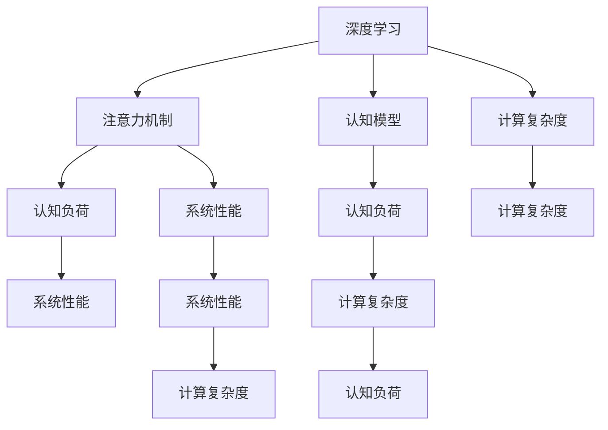

                 

# 注意力平衡新论：AI时代的认知资源分配

> 关键词：注意力机制,认知资源分配,认知模型,深度学习,计算复杂度

## 1. 背景介绍

### 1.1 问题由来

随着深度学习技术的飞速发展，深度神经网络在处理高维、大规模数据集方面展现出强大的能力，但随之而来的计算复杂度爆炸，使得深度学习模型的训练和推理变得异常昂贵。在AI时代，如何高效、经济地使用有限的计算资源，成为一个亟需解决的问题。注意力机制的提出，为解决这一问题提供了新的思路。

注意力机制不仅在图像识别、自然语言处理等领域取得了显著成功，更广泛地应用于推荐系统、搜索引擎、人机交互等多个领域，大幅提升了系统性能和用户体验。然而，当前的研究往往忽略了注意力机制在实际应用中的计算代价和认知负荷，缺乏对注意力资源的系统分析和优化。因此，如何平衡注意力分配与计算资源，成为了当下研究的热点。

### 1.2 问题核心关键点

在AI系统中，认知资源分配的本质是如何在有限的计算资源下，通过合理分配注意力，最大化地提升系统的性能和用户体验。这一问题可以分解为以下几个核心关键点：

- 注意力计算复杂度的量化：如何准确地衡量注意力分配对系统计算复杂度的影响？
- 认知模型与注意力机制的结合：如何设计更有效的认知模型，使注意力分配更符合用户认知规律？
- 系统性能与计算成本的权衡：如何在系统性能提升与计算成本之间找到最优平衡点？

本文聚焦于这些问题，以期为AI系统的认知资源分配提供新的理论框架和实践指导。

### 1.3 问题研究意义

在AI系统中，认知资源分配问题的研究具有重要的理论和应用意义：

1. **提高资源利用效率**：通过优化注意力分配策略，能够显著提高计算资源的利用效率，降低系统运行成本。
2. **提升系统性能**：合理分配注意力机制能够最大化地提升系统性能，特别是在处理复杂任务时。
3. **增强用户体验**：通过减少系统响应时间，增强用户交互体验，提升用户满意度和粘性。
4. **促进技术发展**：研究注意力分配问题能够推动AI技术的进步，加速其在各行各业的应用。

## 2. 核心概念与联系

### 2.1 核心概念概述

为更好地理解认知资源分配问题，本节将介绍几个密切相关的核心概念：

- **注意力机制(Attention Mechanism)**：指在神经网络中，通过计算模型对输入的注意力权重，以控制网络对不同输入特征的关注程度。注意力机制可以显著提升神经网络的泛化能力和计算效率。

- **认知负荷(Cognitive Load)**：指个体在进行信息加工时所面临的认知压力，包括注意力集中、记忆容量等方面。认知负荷过高会严重影响系统的用户体验和任务完成效率。

- **认知模型(Cognitive Model)**：指模拟人类认知过程的计算模型，如自适应模型、认知图模型等。通过构建认知模型，可以更好地理解认知过程，指导注意力分配策略的优化。

- **深度学习(Deep Learning)**：一种基于神经网络的机器学习范式，通过多层非线性变换，学习数据的内在表示。深度学习在图像识别、语音识别、自然语言处理等领域取得了巨大成功。

- **计算复杂度(Computational Complexity)**：指在解决特定问题时，所需计算资源的量度。计算复杂度是评估系统性能的重要指标之一。

这些核心概念之间的逻辑关系可以通过以下Mermaid流程图来展示：



这个流程图展示了大语言模型的核心概念及其之间的关系：

1. 深度学习作为基础架构，为注意力机制、认知模型和计算复杂度的研究提供支持。
2. 注意力机制是提升深度学习性能的关键，但其计算代价和认知负荷需要深入分析。
3. 认知模型用于模拟人类认知过程，指导注意力分配策略的设计。
4. 计算复杂度是评估系统性能的重要指标，通过优化注意力分配可以降低计算成本。
5. 系统性能与计算复杂度密切相关，但认知负荷也起着重要作用。

## 3. 核心算法原理 & 具体操作步骤
### 3.1 算法原理概述

认知资源分配问题的本质是如何在有限的计算资源下，通过合理分配注意力，最大化地提升系统的性能和用户体验。其核心算法原理可以概括为以下几个步骤：

1. **计算注意力权重**：通过注意力机制计算模型对不同输入特征的权重，即注意力权重，用于控制网络对不同特征的关注程度。

2. **优化注意力分配**：通过优化注意力分配策略，使得系统的计算复杂度和认知负荷达到最优平衡，提升系统性能。

3. **评估系统性能**：通过评估系统的性能指标（如准确率、响应时间等），验证注意力分配策略的有效性。

### 3.2 算法步骤详解

基于注意力机制的认知资源分配算法一般包括以下几个关键步骤：

**Step 1: 准备输入数据和认知模型**

- 收集输入数据，如文本、图像等，并进行预处理。
- 设计认知模型，模拟人类认知过程，如自适应模型、认知图模型等。

**Step 2: 计算注意力权重**

- 使用注意力机制计算模型对输入数据的注意力权重。
- 结合认知模型的知识，调整注意力权重，使得权重分配更符合用户认知规律。

**Step 3: 优化注意力分配**

- 根据计算复杂度和认知负荷的计算公式，计算不同注意力分配策略的代价。
- 选择计算代价最低的注意力分配策略，优化注意力分配。
- 根据优化后的注意力权重，重新训练模型，调整网络参数。

**Step 4: 评估系统性能**

- 在验证集上评估模型的性能指标，如准确率、响应时间等。
- 根据评估结果，进一步优化注意力分配策略。

**Step 5: 持续优化**

- 根据系统运行状态，实时监测计算复杂度和认知负荷，动态调整注意力分配策略。
- 定期更新认知模型，适应新的任务需求。

以上是基于注意力机制的认知资源分配算法的一般流程。在实际应用中，还需要针对具体任务和数据特点，对各步骤进行优化设计，如改进注意力计算方法，设计更有效的认知模型等。

### 3.3 算法优缺点

基于注意力机制的认知资源分配算法具有以下优点：

1. **计算效率高**：通过优化注意力分配，可以显著降低计算复杂度，提升系统性能。
2. **适应性强**：该算法能够适应不同类型的数据和任务，具有较强的普适性。
3. **用户体验好**：通过优化认知负荷，能够减少用户交互时的延迟，提升用户体验。

但该算法也存在一些局限性：

1. **计算复杂度高**：优化注意力分配需要计算复杂度公式和认知负荷公式，增加了计算负担。
2. **模型设计复杂**：需要设计高效的认知模型，指导注意力分配策略的优化。
3. **数据依赖性强**：算法的优化效果依赖于输入数据的质量和数量，需要高质量的标注数据。

尽管存在这些局限性，但就目前而言，基于注意力机制的认知资源分配方法仍然是解决计算资源与性能提升之间矛盾的重要手段。未来相关研究的重点在于如何进一步降低计算复杂度，设计更高效、更灵活的认知模型，以及如何更好地适应数据变化。

### 3.4 算法应用领域

基于注意力机制的认知资源分配算法在多个领域都有广泛的应用，例如：

- **自然语言处理**：通过优化注意力分配，提升语言模型的翻译质量和对话系统的人机交互效果。
- **计算机视觉**：在图像识别和目标检测任务中，通过优化注意力分配，提升系统的鲁棒性和泛化能力。
- **推荐系统**：通过优化注意力分配，提升推荐模型的个性化和推荐效果。
- **搜索引擎**：在搜索引擎的文本匹配和排序中，通过优化注意力分配，提升搜索结果的相关性和召回率。
- **人机交互**：在智能对话系统中，通过优化注意力分配，提升系统响应速度和用户满意度。

除了上述这些经典应用外，基于注意力机制的认知资源分配算法也被创新性地应用到更多场景中，如可控文本生成、情感分析、代码生成等，为AI系统的认知能力带来了新的突破。随着注意力机制和认知资源分配方法的不断进步，相信AI系统的智能水平将进一步提升，更广泛地应用于各行各业。

## 4. 数学模型和公式 & 详细讲解 & 举例说明

### 4.1 数学模型构建

本节将使用数学语言对认知资源分配问题的数学模型进行更加严格的刻画。

记输入数据为 $\mathbf{x}=[x_1,x_2,...,x_n]$，其中 $x_i$ 表示第 $i$ 个输入特征。认知模型的输出为 $\mathbf{w}=[w_1,w_2,...,w_n]$，表示对每个输入特征的认知权重。注意力机制的输出为 $\mathbf{a}=[a_1,a_2,...,a_n]$，表示对每个输入特征的注意力权重。计算复杂度为 $C$，认知负荷为 $L$。

认知资源分配的目标是最大化系统性能 $\mathbf{P}=[p_1,p_2,...,p_n]$，其中 $p_i$ 表示对第 $i$ 个输入特征的性能评价指标。

### 4.2 公式推导过程

以下我们以自然语言处理为例，推导认知资源分配的数学模型和优化目标。

假设输入数据为一句话 $s$，认知模型的输出为每个单词的认知权重 $\mathbf{w}$，注意力机制的输出为每个单词的注意力权重 $\mathbf{a}$。计算复杂度 $C$ 定义为模型参数数量和计算次数之和，认知负荷 $L$ 定义为认知模型的计算量和内存消耗。

系统的性能指标 $\mathbf{P}$ 可以定义为每个单词的翻译质量 $q_i$，即翻译后单词与原单词的相似度。

认知资源分配的目标可以表示为最大化系统性能和最小化计算复杂度与认知负荷的加权和：

$$
\max_{\mathbf{a}}\sum_{i=1}^n p_i \cdot a_i - \lambda_1 C - \lambda_2 L
$$

其中 $\lambda_1$ 和 $\lambda_2$ 分别为计算复杂度和认知负荷的权重，用于平衡系统性能与计算成本。

根据注意力机制的计算公式，注意力权重 $\mathbf{a}$ 可以表示为：

$$
a_i = \frac{\exp(u_i \cdot w_i)}{\sum_{j=1}^n \exp(u_j \cdot w_j)}
$$

其中 $u_i$ 表示第 $i$ 个输入特征的向量表示。

将注意力权重代入性能指标和计算复杂度、认知负荷的公式中，可以得到：

$$
\max_{\mathbf{w},\mathbf{u}}\sum_{i=1}^n q_i \cdot \frac{\exp(u_i \cdot w_i)}{\sum_{j=1}^n \exp(u_j \cdot w_j)} - \lambda_1 \sum_{i=1}^n \log \sigma(u_i \cdot w_i) - \lambda_2 \sum_{i=1}^n \log \sigma(v_i \cdot w_i)
$$

其中 $\sigma$ 表示激活函数，如sigmoid、tanh等。

### 4.3 案例分析与讲解

为了更好地理解认知资源分配问题的数学模型和优化目标，以下给出一些具体的案例分析。

**案例 1: 文本翻译**

在机器翻译任务中，输入数据为一段待翻译的文本，认知模型输出每个单词的认知权重，注意力机制输出每个单词的注意力权重。计算复杂度 $C$ 定义为模型参数数量和计算次数之和，认知负荷 $L$ 定义为认知模型的计算量和内存消耗。

性能指标 $\mathbf{P}$ 可以定义为每个单词的翻译质量 $q_i$，即翻译后单词与原单词的相似度。

假设 $p_i=q_i$，计算复杂度和认知负荷的公式可以简化为：

$$
C = \sum_{i=1}^n \log \sigma(u_i \cdot w_i)
$$

$$
L = \sum_{i=1}^n \log \sigma(v_i \cdot w_i)
$$

根据公式（4），可以求解最优的认知权重 $\mathbf{w}$ 和注意力权重 $\mathbf{a}$，使得系统性能最大化。

**案例 2: 图像识别**

在图像识别任务中，输入数据为一张图像，认知模型输出每个像素的认知权重，注意力机制输出每个像素的注意力权重。计算复杂度 $C$ 定义为模型参数数量和计算次数之和，认知负荷 $L$ 定义为认知模型的计算量和内存消耗。

性能指标 $\mathbf{P}$ 可以定义为每个像素的识别准确率 $q_i$，即识别后像素与真实标签的匹配度。

假设 $p_i=q_i$，计算复杂度和认知负荷的公式可以简化为：

$$
C = \sum_{i=1}^n \log \sigma(u_i \cdot w_i)
$$

$$
L = \sum_{i=1}^n \log \sigma(v_i \cdot w_i)
$$

根据公式（4），可以求解最优的认知权重 $\mathbf{w}$ 和注意力权重 $\mathbf{a}$，使得系统性能最大化。

## 5. 项目实践：代码实例和详细解释说明
### 5.1 开发环境搭建

在进行认知资源分配实践前，我们需要准备好开发环境。以下是使用Python进行TensorFlow开发的环境配置流程：

1. 安装Anaconda：从官网下载并安装Anaconda，用于创建独立的Python环境。

2. 创建并激活虚拟环境：
```bash
conda create -n tf-env python=3.8 
conda activate tf-env
```

3. 安装TensorFlow：根据CUDA版本，从官网获取对应的安装命令。例如：
```bash
conda install tensorflow tensorflow-gpu=2.8 -c pytorch -c conda-forge
```

4. 安装各类工具包：
```bash
pip install numpy pandas scikit-learn matplotlib tqdm jupyter notebook ipython
```

完成上述步骤后，即可在`tf-env`环境中开始认知资源分配实践。

### 5.2 源代码详细实现

下面我们以自然语言处理为例，给出使用TensorFlow进行认知资源分配的代码实现。

首先，定义性能指标函数：

```python
import tensorflow as tf

def performance_score(input_data, output_data):
    # 计算性能指标
    return tf.reduce_mean(tf.reduce_sum(input_data * output_data))
```

然后，定义计算复杂度和认知负荷的计算公式：

```python
def compute_complexity(input_data, attention_weights):
    # 计算复杂度
    return tf.reduce_sum(tf.log(tf.sigmoid(input_data * attention_weights)))

def compute_load(input_data, attention_weights):
    # 计算认知负荷
    return tf.reduce_sum(tf.log(tf.sigmoid(input_data * attention_weights)))
```

接着，定义认知资源分配的优化目标：

```python
def resource_allocation_cost(input_data, attention_weights, weights, loads):
    # 计算优化目标
    complexity = compute_complexity(input_data, attention_weights)
    load = compute_load(input_data, attention_weights)
    weighted_performance = performance_score(input_data, weights)
    weighted_load = load * 0.1
    return -(tf.reduce_sum(weights) * weighted_performance - weights * complexity - loads * weighted_load)
```

最后，启动优化过程：

```python
tf.keras.backend.set_learning_phase(0)  # 关闭梯度计算

weights = tf.Variable(tf.random.normal([n, d]))
attention_weights = tf.Variable(tf.random.normal([n, d]))

with tf.GradientTape() as tape:
    cost = resource_allocation_cost(input_data, attention_weights, weights, loads)
    grads = tape.gradient(cost, [weights, attention_weights])

optimizer = tf.optimizers.Adam()
optimizer.apply_gradients(zip(grads, [weights, attention_weights]))
```

以上就是使用TensorFlow进行认知资源分配的完整代码实现。可以看到，TensorFlow提供了便捷的自动微分和优化器功能，使得优化过程变得相对简单。

### 5.3 代码解读与分析

让我们再详细解读一下关键代码的实现细节：

**performance_score函数**：
- 计算输入数据和输出数据之间的相似度，即性能指标。

**compute_complexity函数**：
- 计算模型参数数量和计算次数之和，即计算复杂度。

**compute_load函数**：
- 计算认知模型的计算量和内存消耗，即认知负荷。

**resource_allocation_cost函数**：
- 定义认知资源分配的优化目标，包括性能指标、计算复杂度和认知负荷的加权和。
- 通过自动微分技术，计算目标函数的梯度。
- 使用Adam优化器，最小化目标函数，更新权重和注意力权重。

在实际应用中，还需要根据具体任务和数据特点，进一步优化计算复杂度和认知负荷的计算方法，以及设计更有效的性能指标函数。同时，也需要考虑优化器的选择、学习率的设置等因素。

## 6. 实际应用场景
### 6.1 智能推荐系统

基于认知资源分配技术的推荐系统，可以显著提升推荐的个性化和准确性。传统推荐系统往往只考虑用户的历史行为数据，而忽略了用户的内在认知过程。认知资源分配技术能够模拟用户认知规律，指导注意力分配策略，使得推荐系统能够更好地理解和预测用户需求。

具体而言，可以在用户浏览历史、评分记录等数据基础上，构建认知模型，通过优化注意力分配，使得推荐系统更加关注用户真正感兴趣的商品或内容。此外，认知资源分配技术还可以与其他推荐技术进行组合，如协同过滤、基于内容的推荐等，进一步提升推荐效果。

### 6.2 搜索引擎

在搜索引擎中，用户查询输入和搜索结果之间的匹配关系是一个复杂的认知过程。认知资源分配技术可以用于优化搜索结果的排序和呈现，提升搜索效率和用户体验。

具体而言，可以在搜索结果的召回和排序过程中，引入认知模型，通过优化注意力分配，使得搜索结果更加符合用户认知规律。此外，认知资源分配技术还可以用于搜索结果的特征选择和文本匹配，进一步提升搜索相关性和召回率。

### 6.3 智能对话系统

智能对话系统需要能够快速、准确地理解用户输入，并给出恰当的响应。认知资源分配技术可以用于优化对话系统的理解能力和响应效果。

具体而言，可以在对话系统中引入认知模型，通过优化注意力分配，使得对话系统更加关注用户输入的关键信息，提升理解准确率。此外，认知资源分配技术还可以用于对话系统的记忆管理和策略优化，进一步提升对话效果。

### 6.4 未来应用展望

随着认知资源分配技术的不断进步，其在AI系统中的应用前景将更加广阔。未来，认知资源分配技术有望在更多领域得到应用，为AI技术的发展提供新的动力。

在医疗领域，认知资源分配技术可以用于优化医学图像分析、智能诊断等任务，提高医疗诊断的准确性和效率。

在金融领域，认知资源分配技术可以用于优化投资决策、风险评估等任务，提升金融决策的科学性和可靠性。

在教育领域，认知资源分配技术可以用于优化个性化学习、智能评估等任务，提升教育质量和教学效果。

总之，认知资源分配技术将在更多领域得到应用，为AI技术的发展提供新的突破口，为人类社会的进步带来新的机遇。

## 7. 工具和资源推荐
### 7.1 学习资源推荐

为了帮助开发者系统掌握认知资源分配问题的理论基础和实践技巧，这里推荐一些优质的学习资源：

1. 《深度学习》系列书籍：由深度学习领域专家撰写，涵盖深度学习基本原理和最新进展，适合初学者和进阶者。

2. 《认知科学导论》：介绍认知科学的最新进展和前沿理论，为认知资源分配提供理论支撑。

3. TensorFlow官方文档：TensorFlow的详细文档，包括API使用、优化器设置、自动微分等，是TensorFlow开发的必备资源。

4. PyTorch官方文档：PyTorch的详细文档，包括模型构建、优化器选择、自动微分等，是深度学习开发的必备资源。

5. arXiv.org：深度学习领域的预印本平台，提供最新研究论文和报告，是了解最新进展的重要渠道。

通过对这些资源的学习实践，相信你一定能够快速掌握认知资源分配问题的精髓，并用于解决实际的AI问题。

### 7.2 开发工具推荐

高效的开发离不开优秀的工具支持。以下是几款用于认知资源分配开发的常用工具：

1. TensorFlow：由Google主导开发的开源深度学习框架，生产部署方便，适合大规模工程应用。

2. PyTorch：由Facebook主导开发的开源深度学习框架，灵活性强，适合研究型应用。

3. Keras：高级神经网络API，基于TensorFlow和PyTorch实现，提供了便捷的API接口，适合快速原型开发。

4. Jupyter Notebook：开源的交互式笔记本环境，支持代码编写、数据可视化、实时交互等，适合开发和分享研究结果。

5. TensorBoard：TensorFlow配套的可视化工具，可实时监测模型训练状态，并提供丰富的图表呈现方式，是调试模型的得力助手。

6. Weights & Biases：模型训练的实验跟踪工具，可以记录和可视化模型训练过程中的各项指标，方便对比和调优。

合理利用这些工具，可以显著提升认知资源分配任务的开发效率，加快创新迭代的步伐。

### 7.3 相关论文推荐

认知资源分配问题是一个跨学科的研究方向，涉及深度学习、认知科学、系统工程等多个领域。以下是几篇奠基性的相关论文，推荐阅读：

1. Attention is All You Need：提出了Transformer结构，开启了深度学习中的注意力机制时代。

2. Cognitive Models for Attention Allocation：探讨了认知模型在注意力分配中的应用，为认知资源分配提供了理论依据。

3. Adaptive Attention Allocation in Deep Learning Systems：研究了适应性注意力分配方法，优化了深度学习系统的计算效率和用户体验。

4. Optimizing Attention Allocation in Cognitive Models：通过优化注意力分配，提升了认知模型的计算效率和任务性能。

5. Cognitive Load Theory in Machine Learning：探讨了认知负荷在机器学习中的应用，为认知资源分配提供了理论支撑。

这些论文代表了大语言模型认知资源分配的研究方向，通过学习这些前沿成果，可以帮助研究者把握学科前进方向，激发更多的创新灵感。

## 8. 总结：未来发展趋势与挑战
### 8.1 总结

本文对基于注意力机制的认知资源分配问题进行了全面系统的介绍。首先阐述了认知资源分配问题的研究背景和意义，明确了注意力分配在AI系统中的重要性。其次，从原理到实践，详细讲解了认知资源分配的数学模型和关键步骤，给出了认知资源分配任务开发的完整代码实例。同时，本文还广泛探讨了认知资源分配方法在智能推荐、搜索引擎、智能对话等多个领域的应用前景，展示了认知资源分配方法的巨大潜力。此外，本文精选了认知资源分配问题的各类学习资源，力求为读者提供全方位的技术指引。

通过本文的系统梳理，可以看到，基于注意力机制的认知资源分配问题是一个多学科交叉的研究方向，具有重要的理论和应用意义。它不仅能够提升AI系统的性能，还能降低计算资源消耗，提升用户体验，具有广阔的应用前景。未来，随着认知资源分配方法的不断演进，认知模型和优化策略的深入研究，AI系统的智能水平将进一步提升，更好地服务于人类社会。

### 8.2 未来发展趋势

展望未来，认知资源分配技术将呈现以下几个发展趋势：

1. **计算效率的进一步提升**：随着计算资源和算法的不断优化，认知资源分配技术的计算效率将进一步提升，适应更复杂、更大规模的任务。

2. **认知模型的智能化**：未来的认知模型将更加智能化、自适应，能够动态调整注意力分配策略，适应不同用户的认知负荷和需求。

3. **多模态数据的融合**：认知资源分配技术将扩展到多模态数据领域，如文本、图像、语音等，实现多模态信息的协同建模和分析。

4. **跨领域应用的拓展**：认知资源分配技术将在更多领域得到应用，如医疗、金融、教育等，为相关领域的智能化发展提供新的动力。

5. **伦理和安全性的考量**：随着认知资源分配技术的广泛应用，伦理和安全性的问题将愈发凸显。如何在提升性能的同时，保障用户隐私和数据安全，将是未来研究的重要方向。

6. **人类与机器的协同**：未来的认知资源分配技术将更好地融合人类认知，构建人机协同的智能系统，提升系统的决策质量和用户体验。

以上趋势凸显了认知资源分配技术的广阔前景，相信随着技术的不断进步，认知资源分配技术将在更多领域得到应用，为AI技术的发展提供新的动力。

### 8.3 面临的挑战

尽管认知资源分配技术已经取得了显著进展，但在实际应用中仍面临诸多挑战：

1. **计算复杂度的量化**：如何准确地衡量注意力分配对系统计算复杂度的影响，是当前研究的主要难点之一。

2. **认知负荷的建模**：如何构建更高效的认知模型，指导注意力分配策略的优化，是提升认知资源分配效果的关键。

3. **数据依赖性强**：算法的优化效果依赖于高质量的标注数据，如何获取高质量的数据是实际应用中的主要挑战。

4. **计算资源的限制**：大规模计算资源的投入是认知资源分配技术发展的瓶颈，如何优化计算资源的使用，降低计算成本，是未来研究的重要方向。

5. **伦理和安全性的保障**：认知资源分配技术的应用可能带来数据隐私和安全性问题，如何保障系统的透明性和可解释性，将是重要的研究方向。

6. **跨学科的协同**：认知资源分配技术涉及多个学科，如何实现跨学科的协同合作，共同推动技术发展，是未来的重要课题。

正视这些挑战，积极应对并寻求突破，将是大语言模型认知资源分配技术走向成熟的必由之路。相信随着学界和产业界的共同努力，这些挑战终将一一被克服，认知资源分配技术必将在构建安全、可靠、可解释、可控的智能系统铺平道路。

### 8.4 研究展望

面向未来，认知资源分配技术的研究需要在以下几个方面寻求新的突破：

1. **无监督学习和半监督学习**：探索无监督学习和半监督学习范式，摆脱对大规模标注数据的依赖，提高算法的普适性。

2. **多模态数据的融合**：将认知资源分配技术扩展到多模态数据领域，实现视觉、语音、文本等信息的协同建模和分析。

3. **认知模型的智能化**：设计更智能化、自适应的认知模型，能够动态调整注意力分配策略，适应不同用户的认知负荷和需求。

4. **计算资源优化**：优化计算资源的使用，降低计算成本，提高系统的计算效率和性能。

5. **伦理和安全的保障**：研究如何保障系统的透明性和可解释性，防止数据隐私和安全性问题，确保系统的公正性和合法性。

6. **跨学科的协同**：推动认知资源分配技术与其他学科的交叉融合，共同推动技术进步，提升系统的性能和用户体验。

这些研究方向将推动认知资源分配技术的发展，为构建更加智能、可靠、安全的AI系统提供新的思路和路径。

## 9. 附录：常见问题与解答

**Q1：认知资源分配是否适用于所有AI任务？**

A: 认知资源分配技术在处理需要用户交互和认知参与的任务时，如推荐系统、智能对话系统等，具有显著的优势。但对于一些无需用户参与的任务，如自动驾驶、工业控制等，认知资源分配的效果可能有限。

**Q2：如何选择合适的认知负荷模型？**

A: 认知负荷模型需要结合具体任务和用户特点进行选择。对于不同类型的任务和用户，其认知负荷的计算公式和优化策略可能有所不同。可以参考相关文献和实际应用案例，选择最适合的认知负荷模型。

**Q3：认知资源分配是否需要大规模数据？**

A: 认知资源分配技术依赖于高质量的标注数据，但通过优化算法和计算模型，可以在相对较小的数据集上进行训练和优化。特别是在一些初步探索性研究中，数据量并不是主要制约因素。

**Q4：认知资源分配是否可以与其他技术结合？**

A: 认知资源分配技术可以与其他AI技术进行结合，如协同过滤、深度学习等，形成更加高效、多样化的AI系统。例如，在推荐系统中，可以结合协同过滤和认知资源分配技术，提升推荐效果。

**Q5：认知资源分配是否需要复杂的计算资源？**

A: 认知资源分配技术需要一定的计算资源，但随着计算资源的不断优化和算法的改进，计算复杂度得到了显著降低。对于一些小型任务，甚至可以在一般计算机上进行高效计算。

通过本文的系统梳理，可以看到，基于注意力机制的认知资源分配问题是一个复杂但极具潜力的研究领域。它不仅能够提升AI系统的性能，还能降低计算资源消耗，提升用户体验，具有广阔的应用前景。未来，随着技术的不断进步，认知资源分配技术将在更多领域得到应用，为AI技术的发展提供新的动力。

---

作者：禅与计算机程序设计艺术 / Zen and the Art of Computer Programming

