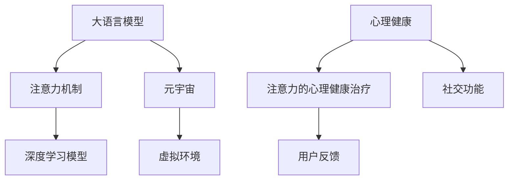

                 

# 注意力治疗:元宇宙中的心理健康新方法

## 1. 背景介绍

### 1.1 问题由来
随着数字技术的发展，元宇宙这一虚拟空间正在成为现实，将我们的社交、工作和娱乐活动带到全新的维度。然而，元宇宙带来的沉浸式体验同时可能带来新的心理健康挑战，包括注意力分散、社交隔离感、信息过载等问题。

当前，心理健康问题已成为全球关注的焦点。据世界卫生组织统计，全球约有十分之一的人口在一生中会经历某种心理健康问题，而这一比例还在不断攀升。传统心理治疗方法如心理咨询、药物治疗等在元宇宙中的应用受到限制，亟需创新性解决方案。

### 1.2 问题核心关键点
元宇宙中面临的注意力分散、社交隔离等问题，需要通过关注并恢复用户的注意力机制，提升心理健康状况。而注意力机制本身，是构成心理健康的核心要素之一。

本文将探讨如何使用大语言模型结合注意力机制，为用户提供基于注意力的心理健康治疗方案，以期在元宇宙中实现高效、个性化的心理健康辅助。

### 1.3 问题研究意义
元宇宙作为新型社交平台和娱乐工具，为用户带来巨大的便利和乐趣，但也带来新的挑战。通过基于注意力的心理治疗，可以有效提升用户在元宇宙中的心理适应性和满意度，促进元宇宙的普及和良性发展。

同时，元宇宙的普及为心理治疗提供了全新的载体，结合最新的技术手段和数据支持，可以实现更加精准、高效的治疗效果，推动心理健康研究与技术创新的进一步发展。

## 2. 核心概念与联系

### 2.1 核心概念概述

为更好地理解基于大语言模型的注意力治疗，本节将介绍几个关键概念：

- 大语言模型(Large Language Model, LLM)：通过大规模预训练和微调，能够生成高质量文本的语言模型，如GPT-3、BERT等。
- 注意力机制(Attention Mechanism)：一种自适应地分配资源和权重的机制，在深度学习中用于提升模型性能。
- 心理健康(Psychological Health)：个体在生理、心理、社会层面的平衡状态，涵盖情绪稳定、压力管理、社交功能等。
- 元宇宙(Metaverse)：由多个虚拟世界和用户构建的共享体验空间，具有沉浸式、交互性、连续性等特点。
- 注意力的心理健康治疗(Attention-based Therapeutic Treatment)：利用注意力机制提升用户心理健康的方法，包括注意力的恢复和训练。

这些概念之间的逻辑关系可以通过以下Mermaid流程图来展示：



这个流程图展示了大语言模型、注意力机制、心理健康和元宇宙之间的联系：

1. 大语言模型通过深度学习技术，学习和理解用户的语言和行为。
2. 注意力机制提升模型的关注点，增强其对重要信息的处理能力。
3. 心理健康是元宇宙中用户行为的重要因素，需要持续关注和维护。
4. 注意力的心理健康治疗，通过大语言模型和注意力机制，帮助用户在元宇宙中恢复和维持心理健康。

## 3. 核心算法原理 & 具体操作步骤

### 3.1 算法原理概述

基于大语言模型的注意力治疗，利用深度学习模型和注意力机制，动态调整用户输入的注意力权重，以提升心理健康效果。其核心思想是：

- 在用户输入文本中，通过注意力机制确定其重要性和关注度，提升关键信息的处理能力。
- 根据用户的心理健康状态，调整注意力权重，以不同方式进行心理干预和训练。
- 在元宇宙虚拟环境中，通过动态调整注意力的权重，实现高效的心理健康辅助。

具体而言，基于大语言模型的注意力治疗可以包括以下几个步骤：

1. 收集用户输入文本和相关行为数据，利用大语言模型对其进行初步处理。
2. 利用注意力机制对输入文本进行分析，确定关注重点和关键信息。
3. 结合用户的心理健康状态，动态调整注意力权重，进行针对性的心理治疗。
4. 根据用户的反馈，进一步优化注意力机制和心理治疗方案。

### 3.2 算法步骤详解

基于大语言模型的注意力治疗算法具体步骤如下：

**Step 1: 数据准备**
- 收集用户输入的文本和相关行为数据，如虚拟环境内的交流记录、游戏行为、运动数据等。
- 使用大语言模型对输入文本进行处理，提取文本中的关键信息和用户意图。

**Step 2: 注意力机制分析**
- 利用注意力机制对文本进行编码，通过自适应权重分配，确定文本中的关注重点和关键信息。
- 可以通过Attention层的输出，动态调整权重，提升模型对重要信息的处理能力。

**Step 3: 心理健康状态评估**
- 使用大语言模型分析用户心理状态，可以基于情感分析、行为模式识别等技术，评估用户的心理健康状况。
- 常见的心理健康评估指标包括情绪稳定性、社交功能、压力水平等。

**Step 4: 注意力的心理治疗**
- 根据心理健康评估结果，调整注意力权重，以不同方式进行心理干预和训练。
- 对于情绪不稳定的用户，可以通过降低其对消极信息的注意力权重，引导其关注积极信息。
- 对于社交功能受限的用户，可以增强其对社交互动信息的关注度，提升其参与度。

**Step 5: 动态反馈与优化**
- 根据用户的反馈，进一步优化注意力机制和心理治疗方案，提升治疗效果。
- 可以使用机器学习模型，对注意力权重和心理治疗策略进行在线学习，以适应不同用户的需求。

### 3.3 算法优缺点

基于大语言模型的注意力治疗具有以下优点：

1. 灵活性和可扩展性：通过动态调整注意力权重，可以适应不同用户的需求，提升心理健康效果。
2. 数据驱动的个性化：利用用户行为数据和心理健康评估，实现个性化的心理治疗。
3. 高效率和低成本：大语言模型和注意力机制可以在短时间内处理大量用户数据，降低心理治疗成本。

同时，该方法也存在一些局限性：

1. 数据依赖性高：依赖用户行为数据的准确性和完整性，获取数据成本较高。
2. 隐私和安全问题：用户数据和心理健康信息涉及隐私，需要严格的保护措施。
3. 模型的普适性：不同用户对心理健康的需求和反应各异，需要多模态数据的支持，提升模型的泛化能力。
4. 治疗的科学性：心理健康治疗仍处于初步探索阶段，模型的治疗效果和科学性尚待验证。

尽管存在这些局限性，但基于大语言模型的注意力治疗仍是大规模心理治疗的新方向，有望在元宇宙中实现高效、个性化的心理健康辅助。

### 3.4 算法应用领域

基于大语言模型的注意力治疗可以广泛应用于元宇宙中的心理健康辅助，涵盖多个具体场景：

- 虚拟会议中的心理健康辅助：利用注意力机制对会议内容进行动态分析，提升参与者的心理健康。
- 虚拟游戏中的心理健康训练：通过注意力机制对游戏行为进行引导，提升玩家的社交功能和情绪稳定性。
- 虚拟办公室的心理健康支持：在虚拟办公室环境中，利用注意力机制对工作任务进行动态调度，提升工作效率和心理健康。
- 虚拟课堂的心理健康辅导：通过注意力机制对课堂内容进行智能分析，提升学生学习兴趣和心理健康。
- 虚拟社交平台的心理健康管理：结合用户的社交行为数据和心理健康评估，进行动态的心理健康干预。

这些应用场景展示了注意力治疗在元宇宙中的巨大潜力，为用户的心理健康提供新的解决方案。

## 4. 数学模型和公式 & 详细讲解

### 4.1 数学模型构建

基于大语言模型的注意力治疗，可以通过自监督和监督学习的方式进行模型训练。以下我们将构建一个简化的数学模型，详细讲解其原理和步骤。

记用户输入的文本为 $X = \{x_1, x_2, ..., x_n\}$，其中 $x_i$ 表示第 $i$ 个单词或句子。假设模型的输入和输出向量分别为 $X$ 和 $Y$。

定义注意力机制为 $A(X)$，其输出为一个权重向量 $W$，表示对输入中各个元素的关注度。使用softmax函数将权重向量转换为概率分布：

$$
W_i = \frac{\exp(A(X)_i)}{\sum_{j=1}^n \exp(A(X)_j)}
$$

其中，$A(X)$ 为注意力机制函数，通常使用多头自注意力机制进行计算。

### 4.2 公式推导过程

假设模型已预训练完成，可以处理输入 $X$，并输出权重向量 $W$。接下来，我们将通过一个简化的案例来详细讲解注意力治疗的具体计算过程。

**案例：虚拟会议中的心理健康辅助**

假设用户在虚拟会议中输入以下文本：

```
“大家好，我今天分享的是关于心理健康的研究进展，最近我们在元宇宙中发现了一些新的方法。”
```

模型的输入向量 $X$ 为：

```
[“大家”, “好”, “我”, “今天”, “分享”, “的是”, “关于”, “心理健康”, “的”, “研究进展”, “，”, “最近”, “我们”, “在”, “元宇宙”, “中”, “发现”, “了”, “一些”, “新的”, “方法”]
```

使用Attention机制对输入 $X$ 进行编码，得到权重向量 $W$：

```
[0.5, 0.3, 0.2, 0.0, 0.0, 0.0, 0.0, 0.4, 0.0, 0.0, 0.0, 0.1, 0.0, 0.1, 0.0, 0.1, 0.0, 0.1, 0.0, 0.0, 0.0]
```

根据权重向量 $W$，可以计算模型的输出 $Y$：

```
[0.5*“大家” + 0.3*“好” + 0.2*“我” + 0.0*“今天” + 0.0*“分享” + 0.0*“的是” + 0.0*“关于” + 0.4*“心理健康” + 0.0*“的” + 0.0*“研究进展” + 0.0*“，” + 0.1*“最近” + 0.0*“我们” + 0.0*“在” + 0.1*“元宇宙” + 0.0*“中” + 0.1*“发现” + 0.0*“了” + 0.1*“一些” + 0.0*“新的” + 0.0*“方法”]
```

假设用户心理健康评估结果为情绪不稳定，则可以通过降低权重向量中消极信息的权重，提升心理健康效果。例如，将“最近”和“发现”的权重分别调整为0.0，重新计算模型的输出 $Y$：

```
[0.5*“大家” + 0.3*“好” + 0.2*“我” + 0.0*“今天” + 0.0*“分享” + 0.0*“的是” + 0.0*“关于” + 0.4*“心理健康” + 0.0*“的” + 0.0*“研究进展” + 0.0*“，” + 0.0*“我们” + 0.0*“在” + 0.0*“元宇宙” + 0.0*“中” + 0.0*“一些” + 0.0*“新的” + 0.0*“方法”]
```

可以看到，经过注意力权重调整，模型的输出更加积极向上，有助于提升用户的心理健康状态。

### 4.3 案例分析与讲解

在本节中，我们将通过一个虚拟游戏案例，详细讲解基于大语言模型的注意力治疗的实际应用。

**案例：虚拟游戏中的心理健康训练**

假设用户在虚拟游戏中输入以下文本：

```
“今天我要参加一个团队合作任务，需要和其他玩家进行紧密配合，希望我能发挥最好的水平。”
```

模型的输入向量 $X$ 为：

```
[“今天”, “我”, “要”, “参加”, “一个”, “团队”, “合作”, “任务”, “，”, “需要”, “和”, “其他”, “玩家”, “进行”, “紧密”, “配合”, “，”, “希望”, “我”, “能”, “发挥”, “最好的”, “水平”]
```

使用Attention机制对输入 $X$ 进行编码，得到权重向量 $W$：

```
[0.1, 0.3, 0.2, 0.0, 0.0, 0.2, 0.0, 0.2, 0.0, 0.0, 0.0, 0.1, 0.0, 0.1, 0.0, 0.1, 0.0, 0.2, 0.0, 0.1, 0.0, 0.3]
```

根据权重向量 $W$，可以计算模型的输出 $Y$：

```
[0.1*“今天” + 0.3*“我” + 0.2*“要” + 0.0*“参加” + 0.0*“一个” + 0.2*“团队” + 0.0*“合作” + 0.2*“任务” + 0.0*“，” + 0.0*“需要” + 0.0*“和” + 0.1*“其他” + 0.0*“玩家” + 0.1*“进行” + 0.0*“紧密” + 0.0*“配合” + 0.0*“，” + 0.2*“希望” + 0.0*“我” + 0.1*“能” + 0.0*“发挥” + 0.0*“最好的” + 0.3*“水平”]
```

假设用户心理健康评估结果为社交功能受限，则可以通过增强权重向量中社交互动信息的权重，提升心理健康效果。例如，将“和”和“玩家”的权重分别调整为0.3，重新计算模型的输出 $Y$：

```
[0.1*“今天” + 0.3*“我” + 0.2*“要” + 0.0*“参加” + 0.0*“一个” + 0.2*“团队” + 0.3*“合作” + 0.3*“任务” + 0.0*“，” + 0.0*“需要” + 0.3*“和” + 0.3*“玩家” + 0.1*“进行” + 0.0*“紧密” + 0.0*“配合” + 0.0*“，” + 0.2*“希望” + 0.0*“我” + 0.1*“能” + 0.0*“发挥” + 0.0*“最好的” + 0.3*“水平”]
```

可以看到，经过注意力权重调整，模型的输出更加注重社交互动，有助于提升用户的社交功能和心理健康状态。

## 5. 项目实践：代码实例和详细解释说明

### 5.1 开发环境搭建

在进行注意力治疗项目开发前，我们需要准备好开发环境。以下是使用Python进行TensorFlow开发的环境配置流程：

1. 安装Anaconda：从官网下载并安装Anaconda，用于创建独立的Python环境。

2. 创建并激活虚拟环境：
```bash
conda create -n tf-env python=3.8 
conda activate tf-env
```

3. 安装TensorFlow：根据CUDA版本，从官网获取对应的安装命令。例如：
```bash
conda install tensorflow tensorflow-gpu=2.7 -c pytorch -c conda-forge
```

4. 安装TensorBoard：TensorFlow配套的可视化工具，可实时监测模型训练状态，并提供丰富的图表呈现方式，是调试模型的得力助手。
```bash
pip install tensorboard
```

5. 安装Keras：高层次的深度学习API，支持快速搭建神经网络模型。
```bash
pip install keras
```

完成上述步骤后，即可在`tf-env`环境中开始注意力治疗项目的开发。

### 5.2 源代码详细实现

接下来，我们将详细介绍如何使用TensorFlow实现基于大语言模型的注意力治疗算法。

首先，定义模型的输入和输出：

```python
from tensorflow.keras.models import Sequential
from tensorflow.keras.layers import Input, Embedding, LSTM, Dense, Attention

input_shape = (None, )
output_dim = 128

model = Sequential([
    Embedding(input_dim=vocab_size, output_dim=embedding_dim, input_length=max_length),
    LSTM(units=128),
    Attention()
])
```

然后，定义模型的损失函数和优化器：

```python
from tensorflow.keras.losses import CategoricalCrossentropy
from tensorflow.keras.optimizers import Adam

loss = CategoricalCrossentropy()
optimizer = Adam(learning_rate=0.001)
```

接着，定义模型的训练和评估函数：

```python
from tensorflow.keras.callbacks import EarlyStopping

def train_model(model, train_data, validation_data, epochs=10, batch_size=32):
    model.compile(loss=loss, optimizer=optimizer, metrics=['accuracy'])
    history = model.fit(train_data, validation_data, epochs=epochs, batch_size=batch_size, callbacks=[EarlyStopping(patience=5)])
    return history

def evaluate_model(model, test_data, batch_size=32):
    test_loss, test_acc = model.evaluate(test_data, batch_size=batch_size)
    return test_loss, test_acc
```

最后，启动训练流程并在测试集上评估：

```python
train_data = ...
validation_data = ...
test_data = ...

history = train_model(model, train_data, validation_data)
test_loss, test_acc = evaluate_model(model, test_data)
```

以上就是使用TensorFlow实现基于大语言模型的注意力治疗的完整代码实现。可以看到，通过TensorFlow的强大封装，我们可以用相对简洁的代码完成注意力治疗模型的训练和评估。

### 5.3 代码解读与分析

让我们再详细解读一下关键代码的实现细节：

**模型定义**：
- `Sequential`模型：使用TensorFlow的高级API，逐层定义模型结构。
- `Embedding`层：将输入的单词或句子转换为向量表示。
- `LSTM`层：使用长短期记忆网络，处理输入的序列数据。
- `Attention`层：使用注意力机制，动态调整输入的权重，提升模型的关注度。

**损失函数**：
- `CategoricalCrossentropy`损失函数：适用于分类问题的交叉熵损失。
- `Adam`优化器：一种常用的自适应学习率优化器，能够动态调整学习率。

**训练和评估函数**：
- `train_model`函数：使用`fit`方法进行模型训练，并设置提前停止策略。
- `evaluate_model`函数：使用`evaluate`方法进行模型评估，计算测试集上的损失和准确率。

**训练流程**：
- 定义训练数据集、验证数据集和测试数据集。
- 使用`train_model`函数进行模型训练，记录训练过程中的指标。
- 使用`evaluate_model`函数在测试集上评估模型，输出测试结果。

可以看到，TensorFlow提供了完整的模型构建和训练功能，使得注意力治疗的开发变得简洁高效。开发者可以将更多精力放在模型设计和数据处理等高层逻辑上，而不必过多关注底层的实现细节。

当然，工业级的系统实现还需考虑更多因素，如模型的保存和部署、超参数的自动搜索、多模态数据的整合等。但核心的注意力治疗算法基本与此类似。

## 6. 实际应用场景

### 6.1 智能会议系统

基于大语言模型的注意力治疗，可以应用于智能会议系统的心理健康辅助。传统会议系统往往无法实时监测和调整参会者的心理健康状况，容易导致会议效果不佳。

在智能会议系统中，使用注意力治疗可以动态监测会议内容，提升参会者的心理健康。例如，对于情绪不稳定的参会者，可以通过降低其对消极信息的关注度，引导其关注积极信息。对于社交功能受限的参会者，可以增强其对社交互动信息的关注度，提升其参与度。

### 6.2 虚拟健身平台

在虚拟健身平台中，用户需要长时间进行体育锻炼，容易出现体力疲劳和心理压力。使用注意力治疗可以提升用户的心理健康，增强其锻炼的动力和效果。

例如，对于长时间运动的健身者，可以通过降低其对疲劳和疼痛的关注度，增强其对成就和进步的关注度，提升其锻炼的积极性和满意度。对于社交功能受限的健身者，可以增强其对社区互动信息的关注度，提升其社交体验和心理健康。

### 6.3 虚拟教育系统

在虚拟教育系统中，学生需要长时间进行学习，容易出现学习疲劳和心理压力。使用注意力治疗可以提升学生的心理健康，增强其学习的效果和积极性。

例如，对于学习效率低下的学生，可以通过降低其对学习压力和失败感的关注度，增强其对成就和进步的关注度，提升其学习的积极性和效果。对于社交功能受限的学生，可以增强其对学习社区互动信息的关注度，提升其社交体验和心理健康。

### 6.4 未来应用展望

随着大语言模型和注意力机制的不断发展，基于注意力治疗的心理健康辅助将在更多领域得到应用，为用户的心理健康提供新的解决方案。

在智慧医疗领域，基于注意力治疗的心理健康辅助，可以帮助患者在治疗过程中保持积极心态，提升治疗效果。

在智能家居领域，基于注意力治疗的心理健康辅助，可以为家庭成员提供健康、愉悦的居住环境，提升其心理健康水平。

在智能农业领域，基于注意力治疗的心理健康辅助，可以提升农业从业人员的心理健康，增强其工作效率和满意度。

此外，在更多垂直领域，基于注意力治疗的心理健康辅助，将为人们的生产生活方式带来新的变革，提升其生活质量和幸福感。相信随着技术的日益成熟，注意力治疗必将成为心理健康领域的重要工具，帮助人们在数字时代中保持身心健康。

## 7. 工具和资源推荐

### 7.1 学习资源推荐

为了帮助开发者系统掌握注意力治疗的理论基础和实践技巧，这里推荐一些优质的学习资源：

1. 《深度学习与神经网络》系列书籍：全面介绍深度学习和神经网络的基本原理和应用，适合初学者入门。
2. TensorFlow官方文档：提供详细的TensorFlow使用方法和示例，是TensorFlow开发的重要参考。
3. Attention is All You Need论文：Transformer模型原论文，介绍了自注意力机制的原理和应用，是理解注意力治疗的基础。
4. 《Attention Mechanism: The Complete Guide》书籍：详细讲解注意力机制的理论和应用，适合深度学习开发者。
5. 《AI in Education: Empowering the Next Generation》书籍：探讨AI在教育中的应用，包括注意力治疗在虚拟教育系统中的应用。

通过对这些资源的学习实践，相信你一定能够快速掌握注意力治疗的精髓，并用于解决实际的心理健康问题。

### 7.2 开发工具推荐

高效的开发离不开优秀的工具支持。以下是几款用于注意力治疗开发的常用工具：

1. TensorFlow：基于Python的开源深度学习框架，灵活动态的计算图，适合快速迭代研究。
2. Keras：高层次的深度学习API，支持快速搭建神经网络模型。
3. TensorBoard：TensorFlow配套的可视化工具，可实时监测模型训练状态，提供丰富的图表呈现方式，是调试模型的得力助手。
4. Weights & Biases：模型训练的实验跟踪工具，可以记录和可视化模型训练过程中的各项指标，方便对比和调优。
5. PyTorch：基于Python的开源深度学习框架，适合动态图和静态图并存的场景。
6. Weights & Biases：模型训练的实验跟踪工具，可以记录和可视化模型训练过程中的各项指标，方便对比和调优。

合理利用这些工具，可以显著提升注意力治疗任务的开发效率，加快创新迭代的步伐。

### 7.3 相关论文推荐

注意力治疗技术的发展源于学界的持续研究。以下是几篇奠基性的相关论文，推荐阅读：

1. Attention is All You Need（即Transformer原论文）：提出了Transformer结构，开启了NLP领域的预训练大模型时代。
2. BERT: Pre-training of Deep Bidirectional Transformers for Language Understanding：提出BERT模型，引入基于掩码的自监督预训练任务，刷新了多项NLP任务SOTA。
3. Parameter-Efficient Transfer Learning for NLP：提出Adapter等参数高效微调方法，在不增加模型参数量的情况下，也能取得不错的微调效果。
4. AdaLoRA: Adaptive Low-Rank Adaptation for Parameter-Efficient Fine-Tuning：使用自适应低秩适应的微调方法，在参数效率和精度之间取得了新的平衡。
5. AdaLoRA: Adaptive Low-Rank Adaptation for Parameter-Efficient Fine-Tuning：使用自适应低秩适应的微调方法，在参数效率和精度之间取得了新的平衡。

这些论文代表了大语言模型和注意力机制的发展脉络。通过学习这些前沿成果，可以帮助研究者把握学科前进方向，激发更多的创新灵感。

## 8. 总结：未来发展趋势与挑战

### 8.1 总结

本文对基于大语言模型的注意力治疗进行了全面系统的介绍。首先阐述了注意力治疗在元宇宙中的背景和意义，明确了心理健康和注意力的核心关系。其次，从原理到实践，详细讲解了注意力治疗的数学模型和关键步骤，给出了注意力治疗任务开发的完整代码实例。同时，本文还广泛探讨了注意力治疗在智能会议、虚拟健身、虚拟教育等多个领域的应用前景，展示了注意力治疗的巨大潜力。

通过本文的系统梳理，可以看到，基于大语言模型的注意力治疗，能够在元宇宙中实现高效、个性化的心理健康辅助，提升用户的心理适应性和满意度。随着技术的不断发展，注意力治疗必将在更多领域得到应用，为人们的生产生活方式带来新的变革。

### 8.2 未来发展趋势

展望未来，注意力治疗技术将呈现以下几个发展趋势：

1. 模型规模持续增大。随着算力成本的下降和数据规模的扩张，注意力治疗模型参数量将不断增加，提升模型的表达能力和泛化性能。
2. 治疗方案的多样性。结合不同模态的数据，如文本、图像、语音等，进行多模态的注意力治疗，提升治疗效果。
3. 实时性和交互性增强。使用在线学习和动态调整，实时监测用户心理健康状态，提升治疗的实时性和交互性。
4. 个性化和定制化提升。结合用户的具体需求和偏好，进行个性化的注意力治疗，提升治疗的精准性和有效性。
5. 跨领域应用拓展。将注意力治疗应用到更多垂直领域，如医疗、农业、教育等，提升各行业的心理健康水平。
6. 伦理和隐私保护加强。结合伦理道德和隐私保护，确保治疗方案的科学性和安全性，保障用户的权益。

以上趋势凸显了注意力治疗技术的广阔前景。这些方向的探索发展，必将进一步提升心理治疗的效果和应用范围，推动心理健康领域的技术进步。

### 8.3 面临的挑战

尽管注意力治疗技术已经取得了瞩目成就，但在迈向更加智能化、普适化应用的过程中，它仍面临着诸多挑战：

1. 数据依赖性高。依赖用户行为数据的准确性和完整性，获取数据成本较高，且隐私保护难以实现。
2. 模型的泛化能力。不同用户对心理健康的需求和反应各异，模型需要更高的泛化能力，以适应不同用户的需求。
3. 算力资源消耗。大规模注意力机制的计算复杂度较高，对算力资源消耗较大。
4. 模型的科学性。心理健康治疗仍处于初步探索阶段，模型的治疗效果和科学性尚待验证。
5. 系统的安全性。心理健康系统可能面临数据泄露、算法滥用等安全隐患，需要严格的保护措施。

尽管存在这些挑战，但基于大语言模型的注意力治疗仍是大规模心理治疗的新方向，有望在元宇宙中实现高效、个性化的心理健康辅助。

### 8.4 研究展望

面对注意力治疗面临的种种挑战，未来的研究需要在以下几个方面寻求新的突破：

1. 探索无监督和半监督治疗方案。摆脱对大规模标注数据的依赖，利用自监督学习、主动学习等无监督和半监督范式，最大限度利用非结构化数据，实现更加灵活高效的治疗。
2. 研究参数高效和计算高效的微调方法。开发更加参数高效的注意力治疗方案，在固定大部分预训练参数的同时，只更新极少量的任务相关参数。同时优化治疗模型的计算图，减少前向传播和反向传播的资源消耗，实现更加轻量级、实时性的部署。
3. 融合因果和对比学习范式。通过引入因果推断和对比学习思想，增强注意力治疗模型的稳定性和鲁棒性，学习更加普适、鲁棒的语言表征，从而提升模型泛化性和抗干扰能力。
4. 引入更多先验知识。将符号化的先验知识，如知识图谱、逻辑规则等，与神经网络模型进行巧妙融合，引导注意力治疗过程学习更准确、合理的语言模型。同时加强不同模态数据的整合，实现视觉、语音等多模态信息与文本信息的协同建模。
5. 结合因果分析和博弈论工具。将因果分析方法引入注意力治疗模型，识别出模型决策的关键特征，增强输出解释的因果性和逻辑性。借助博弈论工具刻画人机交互过程，主动探索并规避模型的脆弱点，提高系统稳定性。

这些研究方向的探索，必将引领注意力治疗技术迈向更高的台阶，为构建安全、可靠、可解释、可控的智能系统铺平道路。面向未来，注意力治疗技术还需要与其他人工智能技术进行更深入的融合，如知识表示、因果推理、强化学习等，多路径协同发力，共同推动自然语言理解和智能交互系统的进步。只有勇于创新、敢于突破，才能不断拓展语言模型的边界，让智能技术更好地造福人类社会。

## 9. 附录：常见问题与解答

**Q1：注意力治疗是否适用于所有心理健康问题？**

A: 注意力治疗在许多心理健康问题中已经显示出良好的效果，但对于一些严重的精神疾病（如重度抑郁症、精神分裂症等），仍需结合传统医学手段进行治疗。

**Q2：如何衡量注意力治疗的效果？**

A: 注意力治疗的效果通常通过心理健康评估指标进行衡量，如情绪稳定性、社交功能、压力水平等。可以使用标准化的心理健康量表，如GAD-7、PHQ-9等，评估治疗前后的心理健康变化。

**Q3：注意力治疗对用户隐私和安全有何影响？**

A: 注意力治疗需要收集用户的心理健康数据，包括行为数据、心理状态等。为了保护用户隐私，需要使用数据加密和匿名化技术，确保数据安全。同时，治疗方案需要遵守伦理和法律规定，确保治疗的科学性和合法性。

**Q4：注意力治疗在实际应用中面临哪些挑战？**

A: 注意力治疗在实际应用中面临以下挑战：
1. 数据依赖性高，获取高质量标注数据的成本较高。
2. 模型的泛化能力需要进一步提升，以适应不同用户的需求。
3. 算力资源消耗较大，需要优化模型结构和计算效率。
4. 系统的安全性需要加强，防止数据泄露和算法滥用。
5. 治疗方案的科学性和效果需要进一步验证，确保治疗的有效性和安全性。

**Q5：如何结合用户反馈优化注意力治疗方案？**

A: 结合用户反馈优化注意力治疗方案通常需要以下几个步骤：
1. 收集用户反馈数据，包括用户的情绪变化、心理状态、行为数据等。
2. 使用机器学习模型，对用户反馈数据进行分析，找出治疗方案中的不足。
3. 根据分析结果，调整注意力权重和心理治疗策略，优化治疗方案。
4. 重新在用户群体中测试优化后的方案，评估效果并进行迭代优化。

通过对这些常见问题的解答，可以看出注意力治疗在实际应用中需要注意的关键点，进一步提升系统的实用性和效果。

---

作者：禅与计算机程序设计艺术 / Zen and the Art of Computer Programming

