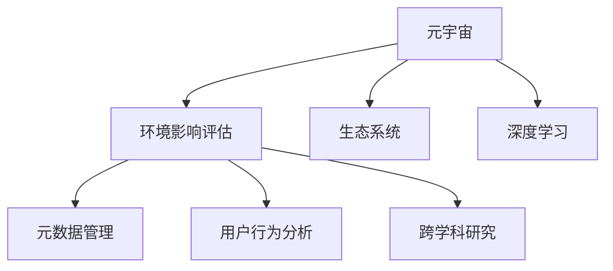

                 

# 注意力环境影响评估:元宇宙开发的生态考量

> 关键词：元宇宙, 注意力环境, 环境影响评估, 生态系统, 深度学习, 元数据管理, 用户行为分析, 跨学科研究

## 1. 背景介绍

### 1.1 问题由来

随着虚拟现实（VR）、增强现实（AR）和区块链技术的快速发展，元宇宙（Metaverse）这一虚拟世界概念再次进入公众视野。元宇宙是一种融合了互联网、虚拟现实、数字孪生等多维技术的共生型平台，旨在构建一个数字化的虚拟世界。然而，元宇宙的开发和运营不仅涉及技术实现，更是一个复杂的生态系统，需要综合考虑经济、社会、环境等多个层面的影响。

元宇宙的兴起不仅为数字娱乐、社交、商业、教育等领域带来了新的机遇，也引发了对其可能带来环境影响的讨论。近年来，环境影响评估（EIA）已广泛应用于各类大型工程项目和生态保护领域，帮助决策者提前预判并降低潜在的环境风险。而元宇宙作为一个新型平台，其环境影响评估涉及诸多新的挑战，需要探索创新的方法和工具。

### 1.2 问题核心关键点

元宇宙环境影响评估的关键点包括：

1. **生态系统复杂性**：元宇宙生态系统由虚拟环境、用户、人工智能、应用内容等多个元素构成，交互和影响模式复杂多变。
2. **数据多样性**：涉及大量异构数据源，包括用户行为数据、环境参数、能源消耗等。
3. **跨学科融合**：环境影响评估需要整合环境科学、计算机科学、社会科学等多学科知识，需进行跨学科研究和合作。
4. **隐私与伦理**：评估过程中需要考虑用户隐私保护和伦理问题，确保数据使用的透明和公正。

这些问题要求评估方法和工具具有高度的灵活性、可扩展性以及隐私和伦理保障。

## 2. 核心概念与联系

### 2.1 核心概念概述

为更好地理解元宇宙环境影响评估，本节将介绍几个核心概念：

1. **元宇宙（Metaverse）**：一个沉浸式、多维度的虚拟世界，用户可以体验、交互和创造虚拟内容。
2. **环境影响评估（EIA）**：在规划或开发某个项目前，评估其对环境可能造成的影响，并提出预防或减弱的措施。
3. **生态系统（Ecosystem）**：包括用户、人工智能、应用内容等多个元素构成的动态系统。
4. **深度学习（Deep Learning）**：一种模拟人类深度神经网络的学习方法，应用于数据处理和模式识别。
5. **元数据管理（Metadata Management）**：组织和存储有关数据的数据，包括数据来源、属性、使用情况等。
6. **用户行为分析（User Behavior Analysis）**：利用数据科学方法分析用户行为模式和趋势。
7. **跨学科研究（Interdisciplinary Research）**：融合环境科学、计算机科学、社会科学等多学科知识进行研究。

这些概念之间的逻辑关系可以通过以下Mermaid流程图来展示：



这个流程图展示了大语言模型的核心概念及其之间的关系：

1. 元宇宙通过深度学习等技术，构建了一个复杂的生态系统。
2. 环境影响评估需要考虑这个生态系统的各个方面。
3. 元数据管理和用户行为分析是评估的重要组成部分。
4. 跨学科研究是理解元宇宙环境影响的必要手段。

## 3. 核心算法原理 & 具体操作步骤

### 3.1 算法原理概述

元宇宙环境影响评估的核心算法基于注意力机制（Attention Mechanism）。注意力机制源于深度学习领域，用于处理序列数据的重点关注和优先级排序。在元宇宙中，注意力机制可用于模拟用户对虚拟环境或内容的关注度和影响力度，从而进行环境影响的评估和预测。

具体来说，假设元宇宙生态系统由多个节点（如用户、应用程序、环境实体等）组成，每个节点对环境的影响可以用一个向量表示。注意力机制通过学习不同节点的关注度权重，将对环境的影响赋予不同的优先级，从而进行综合评估。

### 3.2 算法步骤详解

基于注意力机制的元宇宙环境影响评估包括以下关键步骤：

**Step 1: 数据采集与预处理**
- 收集元宇宙生态系统内的各类数据，包括用户行为数据、环境参数、能源消耗等。
- 对数据进行去噪、标准化、归一化等预处理操作。

**Step 2: 构建注意力网络**
- 设计基于注意力机制的神经网络模型，用于计算不同节点对环境的关注度权重。
- 使用深度学习技术（如Transformer模型）实现注意力机制，学习不同节点间的交互模式。

**Step 3: 注意力计算与影响评估**
- 输入预处理后的数据到注意力网络中，计算每个节点的关注度权重。
- 根据权重向量，计算每个节点对环境的综合影响。

**Step 4: 影响预测与优化**
- 利用机器学习模型（如回归模型）对环境影响进行预测。
- 根据预测结果，提出优化措施和建议，减少潜在的环境风险。

### 3.3 算法优缺点

基于注意力机制的环境影响评估方法具有以下优点：

1. **动态适应性**：注意力机制可以根据不同时间段的关注点动态调整，适应元宇宙生态系统变化。
2. **数据高效利用**：通过学习不同节点间的交互模式，能够高效利用海量数据，提高评估的准确性。
3. **跨学科融合**：结合环境科学、计算机科学、社会科学等多学科知识，提供全面的环境评估视角。

同时，该方法也存在以下局限性：

1. **数据依赖性强**：需要大量高质量的实时数据，对于数据采集和处理要求较高。
2. **模型复杂度高**：注意力机制和深度学习模型本身较为复杂，对计算资源和算法实现要求高。
3. **隐私风险**：需要处理大量用户数据，可能涉及用户隐私和数据安全问题。
4. **伦理挑战**：评估过程中需要考虑公平性和透明度，避免算法偏见和伦理问题。

尽管存在这些局限性，但基于注意力机制的元宇宙环境影响评估方法在理论和实践中都展示了良好的应用前景，值得进一步探索和优化。

### 3.4 算法应用领域

基于注意力机制的元宇宙环境影响评估方法在多个领域具有广泛的应用前景，包括但不限于：

1. **虚拟城市开发**：评估虚拟城市建设对环境的影响，包括资源消耗、能源利用、污染排放等。
2. **虚拟经济活动**：分析虚拟市场、游戏等活动对环境的影响，如数字货币交易、虚拟物品制造等。
3. **虚拟教育与培训**：评估虚拟教室和培训平台对环境的影响，如虚拟实验室的能源消耗等。
4. **虚拟娱乐与社交**：分析虚拟娱乐和社交活动对环境的影响，如虚拟活动的数据传输和存储需求等。

这些应用场景展示了元宇宙环境影响评估的广泛适用性和巨大潜力。

## 4. 数学模型和公式 & 详细讲解 & 举例说明

### 4.1 数学模型构建

假设元宇宙生态系统内有 $n$ 个节点，每个节点的影响用向量 $x_i \in \mathbb{R}^d$ 表示。注意力网络通过计算每个节点的关注度权重 $a_i \in [0,1]$，综合评估其对环境的影响 $y_i \in \mathbb{R}$。

注意力机制的数学模型可以表示为：

$$
a_i = \frac{e^{\mathbf{W}^\top \mathbf{U}_i \mathbf{V}_i^\top x_j}}{\sum_{k=1}^n e^{\mathbf{W}^\top \mathbf{U}_k \mathbf{V}_k^\top x_j}}
$$

其中，$\mathbf{W}$ 为注意力权重向量，$\mathbf{U}_i$ 和 $\mathbf{V}_i$ 为注意力矩阵，$x_j$ 为输入数据。

### 4.2 公式推导过程

对于任意节点 $i$，计算其关注度权重 $a_i$ 的过程如下：

1. 将输入数据 $x_j$ 和注意力矩阵 $\mathbf{U}_i$、$\mathbf{V}_i$ 进行矩阵乘法操作，得到中间结果 $\mathbf{U}_i \mathbf{V}_i^\top x_j$。
2. 将中间结果通过注意力权重向量 $\mathbf{W}$ 进行加权求和，得到权重值 $e^{\mathbf{W}^\top \mathbf{U}_i \mathbf{V}_i^\top x_j}$。
3. 对所有节点的权重值进行归一化，得到每个节点的关注度权重 $a_i$。

在计算完所有节点的关注度权重后，可以进一步计算其对环境的综合影响：

$$
y_i = \mathbf{U}_i a_i
$$

其中 $\mathbf{U}_i$ 为节点 $i$ 对环境的综合影响系数。

### 4.3 案例分析与讲解

以虚拟城市开发为例，具体步骤如下：

1. 收集虚拟城市内所有用户的行为数据、能源消耗数据、环境参数等，作为输入数据 $x_j$。
2. 使用注意力机制计算每个用户对虚拟城市的关注度权重 $a_i$。
3. 结合用户行为和关注度权重，预测虚拟城市的能源消耗和环境污染水平。
4. 根据预测结果，提出优化建议，如调整建筑设计、提升能源效率等。

通过这个案例，可以看出注意力机制在元宇宙环境影响评估中的应用价值。

## 5. 项目实践：代码实例和详细解释说明

### 5.1 开发环境搭建

在进行元宇宙环境影响评估的开发前，我们需要准备好开发环境。以下是使用Python进行TensorFlow开发的环境配置流程：

1. 安装Anaconda：从官网下载并安装Anaconda，用于创建独立的Python环境。

2. 创建并激活虚拟环境：
```bash
conda create -n tf-env python=3.8 
conda activate tf-env
```

3. 安装TensorFlow：根据CUDA版本，从官网获取对应的安装命令。例如：
```bash
conda install tensorflow tensorflow-gpu -c conda-forge
```

4. 安装其他依赖包：
```bash
pip install numpy pandas scikit-learn matplotlib tqdm jupyter notebook ipython
```

完成上述步骤后，即可在`tf-env`环境中开始开发实践。

### 5.2 源代码详细实现

以下是基于注意力机制的元宇宙环境影响评估的代码实现：

```python
import tensorflow as tf
from tensorflow.keras.layers import Input, Dense, Attention
from tensorflow.keras.models import Model

# 定义输入层
input_layer = Input(shape=(d,), name='input')

# 定义注意力机制
attention_layer = Attention()([input_layer, input_layer])

# 定义输出层
output_layer = Dense(1, activation='sigmoid', name='output')(input_layer)

# 构建模型
model = Model(inputs=input_layer, outputs=output_layer)

# 编译模型
model.compile(optimizer='adam', loss='binary_crossentropy', metrics=['accuracy'])

# 训练模型
model.fit(x_train, y_train, validation_data=(x_val, y_val), epochs=10, batch_size=32)

# 评估模型
model.evaluate(x_test, y_test)
```

代码中的`Attention`层是TensorFlow自带的注意力机制实现，用于计算节点间的关注度权重。输入数据 `x_train`, `x_val`, `x_test` 是经过预处理的数据，`y_train`, `y_val`, `y_test` 是对应的标签数据。

### 5.3 代码解读与分析

让我们再详细解读一下关键代码的实现细节：

**Attention层**：
- 输入为两个相同的输入层，进行矩阵乘法和加权求和计算，得到节点的关注度权重。

**输出层**：
- 将输入数据通过输出层进行线性变换，得到节点对环境的综合影响。

**模型编译和训练**：
- 使用Adam优化器和二元交叉熵损失函数进行模型训练。

**模型评估**：
- 在测试集上评估模型的准确率。

这个代码实现展示了TensorFlow如何构建和训练基于注意力机制的环境影响评估模型。开发者可以根据具体任务，修改输入和输出层的维度、调整注意力机制的参数等，以适应不同的评估需求。

## 6. 实际应用场景

### 6.1 虚拟城市开发

基于注意力机制的环境影响评估在虚拟城市开发中具有重要应用。通过评估虚拟城市建设对环境的影响，可以帮助决策者选择最环保的设计方案，优化资源配置，减少潜在的负面环境影响。

### 6.2 虚拟经济活动

元宇宙中虚拟市场的交易活动会产生大量的数据传输和存储需求，对环境造成影响。通过注意力机制评估虚拟市场的资源消耗和能源使用情况，可以提出优化措施，降低虚拟经济活动对环境的影响。

### 6.3 虚拟教育与培训

虚拟教室和培训平台在教学过程中会产生大量的计算和数据存储需求，可能对环境造成影响。使用注意力机制评估虚拟教育平台的环境影响，提出优化建议，如使用云计算服务、优化数据存储方案等。

### 6.4 虚拟娱乐与社交

虚拟娱乐和社交活动可能涉及大量的用户数据传输和存储，对环境造成影响。通过注意力机制评估虚拟娱乐活动的环境影响，提出优化建议，如优化数据传输协议、使用节能设备等。

## 7. 工具和资源推荐

### 7.1 学习资源推荐

为了帮助开发者系统掌握基于注意力机制的环境影响评估方法，这里推荐一些优质的学习资源：

1. TensorFlow官方文档：详细介绍了TensorFlow框架的使用方法，包括构建注意力机制的神经网络。
2. Deep Learning with TensorFlow书籍：介绍了使用TensorFlow进行深度学习开发的技术细节。
3. Attention Mechanism in Natural Language Processing论文：介绍了注意力机制在自然语言处理中的应用，对元宇宙环境影响评估具有参考价值。
4. Environmental Data Science公开课：介绍了环境数据科学的基本概念和常用技术，包括元宇宙环境影响评估。
5. Kaggle比赛：参与相关领域的Kaggle比赛，实践注意力机制在环境影响评估中的应用。

通过对这些资源的学习实践，相信你一定能够快速掌握基于注意力机制的环境影响评估方法，并用于解决实际的元宇宙环境问题。

### 7.2 开发工具推荐

高效的开发离不开优秀的工具支持。以下是几款用于基于注意力机制的环境影响评估开发的常用工具：

1. TensorFlow：基于Python的开源深度学习框架，灵活动态的计算图，适合快速迭代研究。
2. Jupyter Notebook：用于编写和运行Python代码，支持丰富的数据可视化和代码解释。
3. Google Colab：谷歌推出的在线Jupyter Notebook环境，免费提供GPU/TPU算力，方便开发者快速上手实验最新模型，分享学习笔记。
4. Weights & Biases：模型训练的实验跟踪工具，可以记录和可视化模型训练过程中的各项指标，方便对比和调优。

合理利用这些工具，可以显著提升基于注意力机制的环境影响评估任务的开发效率，加快创新迭代的步伐。

### 7.3 相关论文推荐

环境影响评估技术的最新进展，涉及多方面的前沿研究。以下是几篇相关的顶级论文，推荐阅读：

1. Sustainability Assessment of the Digital City: A Multi-objective Decision Support System based on Dempster-Shafer Evidence Theory: 提出了一种基于D-S证据理论的多目标决策支持系统，用于评估数字城市的环境影响。
2. Environmental impact assessment using multi-agent system and artificial neural network：利用多智能体系统和神经网络，构建了环境影响评估框架。
3. The Sustainable Design of Digital Twin Cities through Data-Driven Adaptive System (DSAS): 提出了基于数据驱动的适应性系统，用于优化数字孪生城市的设计。

这些论文代表了环境影响评估技术的最新进展，通过学习这些前沿成果，可以帮助研究者把握学科前进方向，激发更多的创新灵感。

## 8. 总结：未来发展趋势与挑战

### 8.1 总结

本文对基于注意力机制的元宇宙环境影响评估方法进行了全面系统的介绍。首先阐述了元宇宙环境影响评估的研究背景和意义，明确了评估在元宇宙开发中的重要性。其次，从原理到实践，详细讲解了注意力机制的数学模型和计算过程，给出了元宇宙环境影响评估的代码实现。同时，本文还广泛探讨了注意力机制在元宇宙环境影响评估的应用场景，展示了其在虚拟城市、虚拟经济、虚拟教育等领域的广泛适用性。最后，本文精选了注意力机制的应用工具和研究资源，力求为读者提供全方位的技术指引。

通过本文的系统梳理，可以看到，基于注意力机制的环境影响评估方法在元宇宙生态系统的各个层面具有重要应用价值，不仅能够评估和预测环境影响，还能提出优化建议，减少潜在的环境风险。未来，随着元宇宙技术的进一步发展，该方法必将在构建绿色、可持续的虚拟世界中发挥更大的作用。

### 8.2 未来发展趋势

展望未来，元宇宙环境影响评估技术将呈现以下几个发展趋势：

1. **跨模态数据融合**：结合元宇宙内的文本、图像、视频等多种数据源，综合评估环境影响，提供更全面、准确的环境评估。
2. **实时动态评估**：使用实时数据流和动态学习技术，实现对元宇宙环境影响的实时监测和预测。
3. **分布式计算**：利用分布式计算技术，提高数据处理和模型训练的效率，支持大规模元宇宙生态系统的评估。
4. **可解释性增强**：结合因果分析和博弈论工具，增强模型输出的可解释性，提供透明的环境评估结果。
5. **多学科协同**：进一步加强与环境科学、计算机科学、社会科学等领域的合作，提升环境评估的全面性和科学性。

这些趋势展示了元宇宙环境影响评估技术的发展方向，为构建更加绿色、可持续的数字生态系统提供了有力支持。

### 8.3 面临的挑战

尽管元宇宙环境影响评估技术在理论和实践上取得了一定的进展，但仍面临以下挑战：

1. **数据多样性与异构性**：元宇宙内的数据源多种多样，包括用户行为数据、环境参数、能源消耗等，如何整合和管理这些数据是主要挑战。
2. **计算资源需求**：注意力机制和深度学习模型本身较为复杂，对计算资源和算法实现要求高，如何在资源有限的情况下进行高效评估是难题。
3. **隐私与伦理问题**：评估过程中需要处理大量用户数据，可能涉及用户隐私和数据安全问题，如何平衡隐私保护和数据利用是关键。
4. **公平性与透明度**：评估过程中需要考虑公平性和透明度，避免算法偏见和伦理问题，确保评估结果公正客观。

这些挑战需要在技术、伦理、政策等多个层面进行综合应对，才能确保元宇宙环境影响评估技术的可持续发展。

### 8.4 研究展望

面对元宇宙环境影响评估所面临的诸多挑战，未来的研究需要在以下几个方面寻求新的突破：

1. **跨模态数据融合技术**：开发跨模态数据融合算法，整合文本、图像、视频等多种数据源，提供更全面的环境评估。
2. **实时动态评估方法**：结合实时数据流和动态学习技术，实现对元宇宙环境影响的实时监测和预测。
3. **分布式计算框架**：开发分布式计算框架，提高数据处理和模型训练的效率，支持大规模元宇宙生态系统的评估。
4. **可解释性增强技术**：结合因果分析和博弈论工具，增强模型输出的可解释性，提供透明的环境评估结果。
5. **隐私保护机制**：设计隐私保护机制，确保用户数据的安全和匿名性，同时满足数据利用的需求。
6. **公平性与透明性研究**：研究公平性与透明性方法，避免算法偏见和伦理问题，确保评估结果公正客观。

这些研究方向的探索，必将引领元宇宙环境影响评估技术迈向更高的台阶，为构建绿色、可持续的数字生态系统提供有力支持。

## 9. 附录：常见问题与解答

**Q1：元宇宙环境影响评估是否适用于所有元宇宙应用？**

A: 元宇宙环境影响评估适用于大多数元宇宙应用，特别是那些具有显著环境影响的应用场景。例如，虚拟城市、虚拟经济活动、虚拟教育和培训等。但对于某些完全依赖于个人虚拟资产的交易应用，如虚拟房地产等，其影响评估可能更为复杂，需要结合具体应用场景进行考虑。

**Q2：如何平衡数据利用和隐私保护？**

A: 在元宇宙环境影响评估中，数据利用和隐私保护是一对矛盾。一种可能的解决方案是采用差分隐私技术，通过引入噪声和扰动，在数据利用和隐私保护之间取得平衡。此外，可以设计匿名化数据处理流程，确保数据源无法追溯到具体个人。

**Q3：如何应对数据多样性与异构性？**

A: 针对数据多样性与异构性的问题，可以采用联邦学习技术，将不同节点的数据聚合起来进行模型训练，减少对单节点数据的依赖。同时，可以使用标准化处理技术，对不同数据源进行统一处理，提高数据的可用性和一致性。

**Q4：注意力机制在环境影响评估中是否存在局限性？**

A: 注意力机制在环境影响评估中存在一些局限性，如数据依赖性强、模型复杂高等问题。为了克服这些局限性，可以结合其他评估方法，如因果分析和统计学方法，形成多模态的评估框架。同时，可以使用分布式计算和并行算法，提高数据处理和模型训练的效率。

**Q5：如何确保元宇宙环境影响评估的公平性与透明性？**

A: 确保元宇宙环境影响评估的公平性与透明性，需要从多个层面进行努力。例如，在设计评估模型时，可以引入公平性约束，确保不同节点对环境的关注度权重公平分配。同时，可以使用可解释性技术，提供透明的评估结果和解释，增强评估的公正性和可信度。

通过回答这些问题，可以看出，元宇宙环境影响评估虽然面临诸多挑战，但通过不断的技术创新和政策完善，可以实现绿色、可持续的数字生态系统建设。希望本文能为元宇宙环境影响评估提供有益的参考，推动技术进步和社会发展。

---

作者：禅与计算机程序设计艺术 / Zen and the Art of Computer Programming

