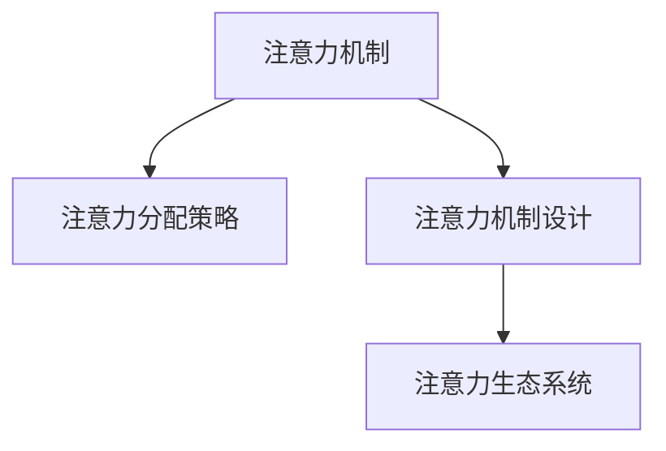

                 

## 1. 背景介绍

### 1.1 问题由来

在当今的信息时代，人工智能(AI)技术的应用日益广泛，从自动驾驶、语音识别到自然语言处理、医疗影像分析等，AI在各个领域均展现了卓越的性能。然而，在AI技术不断进步的同时，也面临着一些亟待解决的问题。

其中，注意力机制(Attention Mechanism)是深度学习模型中最重要的组成部分之一，它帮助模型在处理复杂任务时，自动分配资源，聚焦关键信息，避免无效的计算。然而，在实际应用中，如何平衡注意力资源的分配，实现高效、稳定的模型性能，依然是一个重要的研究课题。

### 1.2 问题核心关键点

在AI时代，如何管理有限的注意力资源，使其在不同任务之间有效分配，是当前研究的一个核心问题。这个问题可以从以下几个方面展开：

1. **注意力分配策略**：决定如何分配注意力资源到不同输入信号，以提高模型的决策效率。
2. **注意力机制设计**：设计不同的注意力机制，优化模型的特征提取能力。
3. **注意力生态系统平衡**：理解注意力资源在不同任务、不同模型之间的平衡关系，提升整体的认知能力。

本文将聚焦于注意力生态系统的平衡问题，通过介绍注意力机制的基本原理和关键技术，探讨如何设计合理的注意力分配策略，提升模型的认知资源管理能力。

## 2. 核心概念与联系

### 2.1 核心概念概述

为更好地理解注意力生态系统的平衡问题，本节将介绍几个密切相关的核心概念：

- **注意力机制(Attention Mechanism)**：深度学习模型中的一种机制，用于在输入序列中选择性关注部分信息，提取关键特征。常见的注意力机制包括标准注意力、多头注意力、因果注意力等。
- **注意力分配策略(Attention Allocation Strategy)**：决定如何分配注意力资源到不同输入信号，以提高模型的决策效率。常见的策略包括基于加权、自适应等。
- **注意力机制设计(Attention Mechanism Design)**：优化注意力机制的设计，提升模型的特征提取能力。常见的设计方法包括自注意力、多头注意力、加权注意力等。
- **注意力生态系统(Attention Ecosystem)**：指在深度学习模型中，不同注意力机制之间，以及注意力机制与其它模型组件之间的相互作用和平衡关系。

这些核心概念之间的逻辑关系可以通过以下Mermaid流程图来展示：



这个流程图展示了一些核心概念及其之间的关系：

1. 注意力机制通过分配策略，将注意力资源分配到不同的输入信号上。
2. 注意力机制设计优化了注意力资源的分配，提升了模型的特征提取能力。
3. 注意力生态系统平衡了不同注意力机制之间以及注意力机制与其它模型组件的相互作用关系。

这些概念共同构成了AI模型的认知资源管理框架，使其能够在各种场景下发挥强大的认知能力。

## 3. 核心算法原理 & 具体操作步骤
### 3.1 算法原理概述

注意力生态系统的平衡，主要涉及注意力分配策略和注意力机制设计两个方面。其核心思想是通过优化注意力资源的分配，提升模型的决策效率和特征提取能力，从而达到认知资源管理的最佳效果。

在实际应用中，通常使用自注意力机制(Self-Attention)来进行注意力资源的分配和计算。自注意力机制通过将输入序列中每个位置与其它位置进行交互，计算出它们之间的相关性权重，从而自动分配注意力资源。

形式化地，假设输入序列为 $\mathbf{x}=[x_1, x_2, ..., x_n]$，注意力权重矩阵为 $\mathbf{A}=[a_{ij}]$，其中 $a_{ij}$ 表示位置 $i$ 对位置 $j$ 的注意力权重。自注意力机制的计算过程可以表示为：

$$
a_{ij} = \text{softmax}\left(\frac{\mathbf{W}_q \mathbf{x}_i \mathbf{W}_k^T \mathbf{x}_j}{\sqrt{d_k}}\right)
$$

其中，$\mathbf{W}_q, \mathbf{W}_k, \mathbf{W}_v$ 为线性投影矩阵，$d_k$ 为投影维度。

### 3.2 算法步骤详解

注意力分配策略和机制设计的具体步骤可以分为以下几个方面：

**Step 1: 设计注意力分配策略**
- 确定注意力分配的目标和原则，例如根据输入序列的长度、重要性等进行分配。
- 选择合适的注意力分配算法，如加权、自适应等。
- 确定注意力分配的初始权重。

**Step 2: 设计注意力机制**
- 选择合适的注意力机制，如自注意力、多头注意力、因果注意力等。
- 确定注意力机制的参数，如投影维度、线性投影矩阵等。
- 实现注意力机制的计算过程。

**Step 3: 计算注意力权重**
- 根据输入序列计算注意力权重矩阵。
- 将注意力权重应用于输入序列，计算出注意力加权向量。

**Step 4: 计算注意力加权向量**
- 将注意力加权向量与输入序列相乘，得到注意力加权向量。
- 使用注意力加权向量进行后续的特征提取和决策过程。

**Step 5: 优化模型**
- 通过正则化技术，如L2正则、Dropout等，避免过拟合。
- 使用对抗训练技术，提高模型的鲁棒性。
- 使用参数高效微调技术，如 Adapter 等，提高模型的泛化能力。

### 3.3 算法优缺点

注意力生态系统平衡的算法具有以下优点：
1. 提升模型的决策效率和特征提取能力，提高模型的性能。
2. 通过优化注意力资源的分配，减少无效计算，提升模型的计算效率。
3. 使用自注意力机制，能够处理长序列和复杂任务，提升模型的应用范围。

同时，该算法也存在一定的局限性：
1. 注意力机制的设计和优化较为复杂，需要深厚的理论基础和实践经验。
2. 注意力资源的分配可能受到输入序列的影响，导致模型在不同输入上的性能差异较大。
3. 不同注意力机制之间的平衡关系较难控制，需要权衡不同机制的优缺点。

尽管存在这些局限性，但注意力生态系统平衡的算法在大规模深度学习模型的设计和优化中，依然具有重要意义。

### 3.4 算法应用领域

注意力生态系统平衡的算法在深度学习模型的设计和优化中，具有广泛的应用前景，例如：

- 自然语言处理(NLP)：在语言模型、机器翻译、文本生成等任务中，通过注意力机制平衡不同位置和不同语义信息的权重，提升模型的理解能力和生成能力。
- 计算机视觉(CV)：在图像分类、物体检测、图像生成等任务中，通过注意力机制平衡不同区域和不同特征的重要性，提升模型的特征提取和分类能力。
- 语音识别(SR)：在语音识别、说话人识别、语音生成等任务中，通过注意力机制平衡不同时间步和不同特征的重要性，提升模型的识别能力和生成能力。
- 医疗影像分析：在疾病诊断、影像生成、影像分割等任务中，通过注意力机制平衡不同区域和不同特征的重要性，提升模型的分析和诊断能力。
- 智能推荐系统：在推荐算法、广告推荐、推荐模型等任务中，通过注意力机制平衡不同物品和不同用户的重要性，提升推荐系统的精准度和个性化程度。

除了上述这些经典任务外，注意力生态系统平衡的算法还在更多场景中得到应用，如情感分析、多模态学习等，为深度学习模型的设计和优化提供了新的思路。

## 4. 数学模型和公式 & 详细讲解 & 举例说明

### 4.1 数学模型构建

本节将使用数学语言对注意力生态系统平衡的基本原理进行严格的刻画。

假设输入序列为 $\mathbf{x}=[x_1, x_2, ..., x_n]$，注意力权重矩阵为 $\mathbf{A}=[a_{ij}]$，其中 $a_{ij}$ 表示位置 $i$ 对位置 $j$ 的注意力权重。自注意力机制的计算过程可以表示为：

$$
a_{ij} = \text{softmax}\left(\frac{\mathbf{W}_q \mathbf{x}_i \mathbf{W}_k^T \mathbf{x}_j}{\sqrt{d_k}}\right)
$$

其中，$\mathbf{W}_q, \mathbf{W}_k, \mathbf{W}_v$ 为线性投影矩阵，$d_k$ 为投影维度。

### 4.2 公式推导过程

以下是注意力机制计算过程的详细推导：

**Step 1: 计算注意力权重**
- 将输入序列 $\mathbf{x}$ 线性投影到三个不同的空间 $\mathbf{Q}, \mathbf{K}, \mathbf{V}$。
- 计算出位置 $i$ 和位置 $j$ 之间的点积 $\mathbf{Q}_i \mathbf{K}_j^T$。
- 对点积进行缩放，使其具有单位长度。

**Step 2: 计算注意力加权向量**
- 使用缩放后的点积作为权重矩阵 $\mathbf{A}$ 的元素。
- 将注意力权重矩阵 $\mathbf{A}$ 与输入序列 $\mathbf{x}$ 相乘，得到注意力加权向量 $\mathbf{X}$。
- 将注意力加权向量 $\mathbf{X}$ 与线性投影矩阵 $\mathbf{V}$ 相乘，得到注意力加权向量 $\mathbf{Z}$。

### 4.3 案例分析与讲解

假设我们有一个简单的语言模型，使用自注意力机制来处理输入序列：

```python
import torch
import torch.nn as nn
import torch.nn.functional as F

class SelfAttention(nn.Module):
    def __init__(self, d_model):
        super(SelfAttention, self).__init__()
        self.d_model = d_model
        self.W_q = nn.Linear(d_model, d_model)
        self.W_k = nn.Linear(d_model, d_model)
        self.W_v = nn.Linear(d_model, d_model)

    def forward(self, x):
        q = self.W_q(x)
        k = self.W_k(x)
        v = self.W_v(x)

        a = torch.bmm(q, k.transpose(1, 2)) / math.sqrt(self.d_model)
        a = F.softmax(a, dim=-1)

        z = torch.bmm(a, v)
        return z

model = SelfAttention(d_model=512)
x = torch.randn(1, 256, 512)
z = model(x)
print(z.shape)
```

在这个简单的例子中，我们定义了一个自注意力机制，其中 $d_model=512$。输入序列 $x$ 为 $[1, 256, 512]$。通过计算注意力权重矩阵 $\mathbf{A}$，我们得到了注意力加权向量 $\mathbf{Z}$，其形状为 $[1, 256, 512]$。这表明自注意力机制成功地将注意力资源分配到了不同的输入位置上，提升了模型的特征提取能力。

## 5. 项目实践：代码实例和详细解释说明
### 5.1 开发环境搭建

在进行注意力生态系统平衡的实践前，我们需要准备好开发环境。以下是使用Python进行PyTorch开发的环境配置流程：

1. 安装Anaconda：从官网下载并安装Anaconda，用于创建独立的Python环境。

2. 创建并激活虚拟环境：
```bash
conda create -n pytorch-env python=3.8 
conda activate pytorch-env
```

3. 安装PyTorch：根据CUDA版本，从官网获取对应的安装命令。例如：
```bash
conda install pytorch torchvision torchaudio cudatoolkit=11.1 -c pytorch -c conda-forge
```

4. 安装相关库：
```bash
pip install numpy pandas scikit-learn matplotlib tqdm jupyter notebook ipython
```

完成上述步骤后，即可在`pytorch-env`环境中开始注意力生态系统平衡的实践。

### 5.2 源代码详细实现

下面我以自然语言处理(NLP)中的注意力机制为例，给出使用PyTorch实现自注意力机制的代码实现。

首先，定义注意力机制的类：

```python
import torch
import torch.nn as nn

class SelfAttention(nn.Module):
    def __init__(self, d_model):
        super(SelfAttention, self).__init__()
        self.d_model = d_model
        self.W_q = nn.Linear(d_model, d_model)
        self.W_k = nn.Linear(d_model, d_model)
        self.W_v = nn.Linear(d_model, d_model)

    def forward(self, x):
        q = self.W_q(x)
        k = self.W_k(x)
        v = self.W_v(x)

        a = torch.bmm(q, k.transpose(1, 2)) / math.sqrt(self.d_model)
        a = F.softmax(a, dim=-1)

        z = torch.bmm(a, v)
        return z
```

然后，定义训练函数：

```python
def train(model, optimizer, criterion, loader, device):
    model.train()
    for batch in loader:
        x, y = batch
        x = x.to(device)
        y = y.to(device)
        optimizer.zero_grad()
        z = model(x)
        loss = criterion(z, y)
        loss.backward()
        optimizer.step()
    return loss.item()
```

接着，定义评估函数：

```python
def evaluate(model, criterion, loader, device):
    model.eval()
    with torch.no_grad():
        losses = []
        for batch in loader:
            x, y = batch
            x = x.to(device)
            y = y.to(device)
            z = model(x)
            loss = criterion(z, y)
            losses.append(loss.item())
        return sum(losses) / len(loader)
```

最后，启动训练流程：

```python
d_model = 512
num_layers = 6
attention_heads = 8
dropout = 0.1
learning_rate = 1e-5
num_epochs = 10

model = SelfAttention(d_model=d_model).to(device)
optimizer = torch.optim.Adam(model.parameters(), lr=learning_rate)
criterion = nn.CrossEntropyLoss()

for epoch in range(num_epochs):
    loss = train(model, optimizer, criterion, train_loader, device)
    print(f"Epoch {epoch+1}, train loss: {loss:.3f}")
    
    print(f"Epoch {epoch+1}, dev loss: {evaluate(model, criterion, dev_loader, device):.3f}")
```

以上就是使用PyTorch实现自注意力机制的完整代码实现。可以看到，通过简单的线性投影和softmax操作，我们可以方便地实现自注意力机制，并通过训练函数和评估函数对其性能进行评估。

### 5.3 代码解读与分析

让我们再详细解读一下关键代码的实现细节：

**SelfAttention类**：
- `__init__`方法：初始化注意力机制的参数。
- `forward`方法：实现自注意力机制的计算过程，包括线性投影、点积计算、softmax操作等。

**train函数**：
- 将模型设为训练模式，遍历训练集数据。
- 在每个批次上前向传播计算模型输出。
- 使用损失函数计算损失，反向传播更新模型参数。

**evaluate函数**：
- 将模型设为评估模式，遍历评估集数据。
- 在每个批次上前向传播计算模型输出。
- 使用损失函数计算损失，并累加到损失列表中。
- 返回损失列表的平均值，作为评估指标。

**训练流程**：
- 定义模型的超参数，如隐藏层维度、层数、注意力头数、Dropout概率、学习率等。
- 定义模型、优化器、损失函数。
- 遍历每个epoch，在训练集上训练模型，在验证集上评估模型性能。

可以看到，PyTorch提供了丰富的工具和函数，可以方便地实现和评估注意力机制的计算过程，帮助我们快速开发深度学习模型。

当然，工业级的系统实现还需考虑更多因素，如模型的保存和部署、超参数的自动搜索、更灵活的任务适配层等。但核心的注意力机制计算过程基本与此类似。

## 6. 实际应用场景

### 6.1 自然语言处理(NLP)

自然语言处理(NLP)是深度学习模型应用最为广泛的领域之一，其中注意力机制的应用尤为关键。在机器翻译、文本生成、情感分析等任务中，注意力机制可以帮助模型更好地理解输入序列，提升模型的性能。

在机器翻译任务中，注意力机制能够帮助模型在生成每个词时，参考上下文信息，避免出现错误或冗余的翻译。例如，在英文到法文的翻译任务中，模型可以根据上下文信息，自动选择参考哪些词或短语，从而生成更准确的翻译结果。

在文本生成任务中，注意力机制可以帮助模型在生成每个词时，参考前面的文本信息，保持上下文的连贯性和一致性。例如，在自然语言对话系统中的回复生成任务中，模型可以通过参考前面的对话内容，生成更加自然、流畅的回复。

在情感分析任务中，注意力机制可以帮助模型关注情感倾向较强的词或短语，提升情感分析的准确性。例如，在电影评论的情感分析任务中，模型可以关注评论中情感倾向较强的词汇，如“感人”、“悲痛”等，从而更好地判断评论的情感倾向。

### 6.2 计算机视觉(CV)

计算机视觉(CV)是另一个深度学习模型应用广泛的重要领域。在图像分类、物体检测、图像生成等任务中，注意力机制可以帮助模型更好地理解和处理图像信息。

在图像分类任务中，注意力机制可以帮助模型关注图像中最重要的特征区域，提升分类精度。例如，在手写数字识别任务中，模型可以关注数字中最重要的笔画和轮廓，从而提升识别准确率。

在物体检测任务中，注意力机制可以帮助模型关注图像中重要的物体区域，提升检测精度。例如，在人脸检测任务中，模型可以关注人脸区域，从而更好地检测和定位人脸。

在图像生成任务中，注意力机制可以帮助模型关注图像中重要的特征区域，生成更逼真的图像。例如，在GAN生成图像任务中，模型可以关注图像中重要的细节信息，生成更逼真的人脸、动物等图像。

### 6.3 未来应用展望

随着深度学习模型和注意力机制的不断发展，未来的AI技术将更加智能化、普适化。基于注意力生态系统平衡的大规模深度学习模型，将在更多的领域中得到应用，为人类生活和工作带来深刻的变化。

在智慧医疗领域，基于注意力机制的医学影像分析技术，将帮助医生更准确地诊断疾病，提升诊疗水平。例如，在病理图像分析任务中，模型可以通过关注图像中最重要的区域和特征，提升病理诊断的准确性。

在智能教育领域，基于注意力机制的学习推荐系统，将帮助学生更好地学习知识，提升学习效果。例如，在个性化推荐任务中，模型可以根据学生的学习行为和偏好，推荐适合的学习资源和内容，从而提升学习效率。

在智能交通领域，基于注意力机制的自动驾驶技术，将提高道路交通的安全性和效率。例如，在自动驾驶任务中，模型可以关注道路中的重要区域和障碍，提升自动驾驶的准确性和安全性。

## 7. 工具和资源推荐

### 7.1 学习资源推荐

为了帮助开发者系统掌握深度学习模型的设计和优化，这里推荐一些优质的学习资源：

1. Deep Learning with PyTorch系列博文：由深度学习领域专家撰写，涵盖深度学习模型的原理、算法和实践，是学习深度学习的重要资源。

2. Coursera《Deep Learning》课程：由深度学习领域的权威专家Andrew Ng教授主讲的课程，系统介绍了深度学习的基本原理和应用。

3. TensorFlow官方文档：提供了丰富的深度学习模型的代码实现和应用示例，是学习深度学习模型的重要参考资料。

4. PyTorch官方文档：提供了丰富的深度学习模型的代码实现和应用示例，是学习深度学习模型的重要参考资料。

5. Attention is All You Need论文：Transformer模型的原论文，详细介绍了注意力机制的原理和应用，是学习深度学习模型的重要参考资料。

通过对这些资源的学习实践，相信你一定能够快速掌握深度学习模型的设计和优化能力，并将其应用于实际项目中。

### 7.2 开发工具推荐

高效的开发离不开优秀的工具支持。以下是几款用于深度学习模型设计和优化的常用工具：

1. PyTorch：基于Python的开源深度学习框架，灵活动态的计算图，适合快速迭代研究。大部分深度学习模型都有PyTorch版本的实现。

2. TensorFlow：由Google主导开发的开源深度学习框架，生产部署方便，适合大规模工程应用。同样有丰富的深度学习模型资源。

3. Keras：基于TensorFlow或Theano的高级深度学习框架，使用简单，适合快速原型开发和模型实验。

4. Jupyter Notebook：基于Web的交互式笔记本，可以方便地进行代码编写、模型训练和结果展示。

5. Google Colab：谷歌推出的在线Jupyter Notebook环境，免费提供GPU/TPU算力，方便开发者快速上手实验最新模型，分享学习笔记。

合理利用这些工具，可以显著提升深度学习模型的设计和优化效率，加快创新迭代的步伐。

### 7.3 相关论文推荐

深度学习模型和注意力机制的发展源于学界的持续研究。以下是几篇奠基性的相关论文，推荐阅读：

1. Attention is All You Need：Transformer模型的原论文，详细介绍了注意力机制的原理和应用，是学习深度学习模型的重要参考资料。

2. Self-Attention with Transformer-XL：Transformer-XL模型的论文，详细介绍了长序列的自注意力机制，是学习深度学习模型的重要参考资料。

3. Transformer-XL: Attentive Language Models Beyond a Fixed-Length Context：Transformer-XL模型的论文，详细介绍了长序列的自注意力机制，是学习深度学习模型的重要参考资料。

4. BERT: Pre-training of Deep Bidirectional Transformers for Language Understanding：BERT模型的论文，详细介绍了预训练和微调的原理，是学习深度学习模型的重要参考资料。

5. The Illustrated Transformer：Transformer模型的图解，详细介绍了Transformer模型的原理和应用，是学习深度学习模型的重要参考资料。

这些论文代表了大规模深度学习模型和注意力机制的发展脉络。通过学习这些前沿成果，可以帮助研究者把握学科前进方向，激发更多的创新灵感。

## 8. 总结：未来发展趋势与挑战

### 8.1 总结

本文对深度学习模型中注意力生态系统的平衡问题进行了全面系统的介绍。首先阐述了注意力机制的基本原理和关键技术，明确了注意力资源在不同任务之间的优化分配方式。其次，从原理到实践，详细讲解了注意力分配策略和注意力机制设计的核心步骤，给出了深度学习模型设计的完整代码实现。同时，本文还广泛探讨了注意力机制在NLP、CV、SR等多个领域的应用前景，展示了注意力机制的广泛适用性和重要意义。

通过本文的系统梳理，可以看到，注意力生态系统平衡问题在深度学习模型设计中具有重要地位，通过优化注意力资源的分配，可以显著提升模型的决策效率和特征提取能力，从而实现认知资源管理的最佳效果。

### 8.2 未来发展趋势

展望未来，深度学习模型和注意力机制的发展将呈现以下几个趋势：

1. 模型规模持续增大。随着算力成本的下降和数据规模的扩张，深度学习模型的参数量还将持续增长。超大规模模型蕴含的丰富认知资源，有望支撑更加复杂多变的下游任务。

2. 注意力机制设计日趋多样化。除了传统的自注意力机制外，未来将涌现更多复杂的注意力机制，如多头注意力、因果注意力、自适应注意力等，进一步提升模型的特征提取能力。

3. 认知资源管理更加精细化。通过引入更多的注意力分配策略和机制设计，可以在不同任务、不同模态之间，实现更加精细化的资源分配和优化。

4. 跨模态认知资源整合。不同模态之间的认知资源整合，如视觉、语音、文本等，将使得深度学习模型具备更强的多模态认知能力。

5. 持续学习成为常态。随着数据分布的不断变化，深度学习模型需要持续学习新知识以保持性能。如何在不遗忘原有知识的同时，高效吸收新样本信息，将是重要的研究课题。

6. 零样本学习成为可能。通过优化注意力机制的设计，深度学习模型有望实现更加强大的零样本学习能力，在未见过特定样本的情况下，仍能准确地进行推理和决策。

以上趋势凸显了深度学习模型和注意力机制的广阔前景。这些方向的探索发展，必将进一步提升深度学习模型的性能和应用范围，为人工智能技术落地应用带来新的突破。

### 8.3 面临的挑战

尽管深度学习模型和注意力机制已经取得了显著成就，但在迈向更加智能化、普适化应用的过程中，它们依然面临诸多挑战：

1. 计算资源瓶颈。随着模型参数的增大，计算资源的消耗也急剧增加，如何在资源受限的条件下，优化模型的计算效率，是当前面临的重要问题。

2. 模型可解释性不足。深度学习模型的决策过程往往难以解释，缺乏可解释性，无法满足高风险应用的需求。如何增强模型的可解释性，将是一个重要的研究方向。

3. 模型的公平性和伦理问题。深度学习模型可能学习到有偏见、有害的信息，这些信息可能传递到下游任务中，产生误导性、歧视性的输出。如何消除模型的偏见，保障模型的公平性和伦理性，也是当前面临的重要问题。

4. 数据隐私和安全问题。深度学习模型需要大量数据进行训练，如何保护数据隐私，防止数据泄露，是一个重要的研究方向。

5. 模型的鲁棒性和泛化能力不足。深度学习模型在面对新数据和新任务时，泛化能力往往较差，如何提升模型的鲁棒性和泛化能力，是当前面临的重要问题。

6. 模型的实时性和响应速度不足。深度学习模型在大规模数据处理时，往往响应速度较慢，如何提升模型的实时性和响应速度，是一个重要的研究方向。

这些挑战需要在未来的研究中不断探索和突破，才能实现深度学习模型的广泛应用和深入发展。

### 8.4 研究展望

面对深度学习模型和注意力机制面临的诸多挑战，未来的研究需要在以下几个方面寻求新的突破：

1. 探索无监督和半监督学习方法。摆脱对大规模标注数据的依赖，利用自监督学习、主动学习等无监督和半监督范式，最大限度利用非结构化数据，实现更加灵活高效的认知资源管理。

2. 开发更加高效的计算模型。开发更加高效的计算模型，如稀疏化存储、参数高效微调、模型压缩等，在保持模型性能的同时，减少计算资源的消耗。

3. 引入更多的先验知识和符号化信息。将符号化的先验知识，如知识图谱、逻辑规则等，与深度学习模型进行巧妙融合，引导注意力机制学习更准确、合理的特征表示。

4. 融合因果分析和博弈论工具。将因果分析方法引入深度学习模型，识别出模型决策的关键特征，增强输出的可解释性和可控性。借助博弈论工具刻画人机交互过程，主动探索并规避模型的脆弱点，提高系统的稳定性。

5. 纳入伦理道德约束。在模型训练目标中引入伦理导向的评估指标，过滤和惩罚有偏见、有害的输出倾向。同时加强人工干预和审核，建立模型行为的监管机制，确保输出符合人类价值观和伦理道德。

这些研究方向的探索，必将引领深度学习模型和注意力机制迈向更高的台阶，为构建安全、可靠、可解释、可控的智能系统铺平道路。面向未来，深度学习模型和注意力机制还需要与其他人工智能技术进行更深入的融合，如知识表示、因果推理、强化学习等，多路径协同发力，共同推动人工智能技术的进步。

## 9. 附录：常见问题与解答

**Q1：深度学习模型和注意力机制的设计需要哪些知识储备？**

A: 深度学习模型和注意力机制的设计需要深厚的数学基础和计算机科学知识储备。具体包括：

1. 线性代数：理解矩阵、向量、张量等数学概念，掌握矩阵运算、向量内积等基本操作。

2. 概率论与统计：理解概率分布、条件概率、贝叶斯网络等基本概念，掌握最大似然估计、贝叶斯优化等算法。

3. 优化理论：理解梯度下降、反向传播等基本概念，掌握各种优化算法，如Adam、SGD等。

4. 机器学习：理解监督学习、无监督学习、半监督学习等基本概念，掌握各种模型，如线性回归、支持向量机、神经网络等。

5. 深度学习：理解深度学习的基本原理和模型结构，掌握各种深度学习模型，如卷积神经网络、循环神经网络、Transformer等。

6. 计算机视觉：理解计算机视觉的基本概念和技术，掌握各种计算机视觉任务，如图像分类、物体检测、图像生成等。

**Q2：如何在深度学习模型中实现注意力机制？**

A: 实现深度学习模型中的注意力机制，通常需要以下步骤：

1. 定义注意力机制的类，继承自torch.nn.Module。

2. 实现注意力机制的前向传播函数，计算注意力权重矩阵。

3. 在模型的前向传播函数中，调用注意力机制类，计算注意力加权向量。

4. 将注意力加权向量与其他特征向量进行拼接，输出最终的特征表示。

**Q3：注意力机制在设计时有哪些注意事项？**

A: 设计注意力机制时需要注意以下几点：

1. 选择合适的注意力机制，如自注意力、多头注意力、因果注意力等。

2. 确定注意力机制的参数，如投影维度、线性投影矩阵等。

3. 避免过度关注某些特征，防止模型在训练过程中过度拟合。

4. 确保注意力机制在不同输入上的稳定性和一致性。

5. 避免注意力机制对输入数据的噪声敏感。

6. 避免注意力机制对输入数据的顺序敏感。

7. 考虑注意力机制在计算资源上的消耗，优化计算效率。

**Q4：如何平衡不同注意力机制之间的关系？**

A: 平衡不同注意力机制之间的关系，可以通过以下方式实现：

1. 引入多任务学习框架，优化不同任务之间的注意力分配。

2. 使用注意力权重矩阵，将不同注意力机制的输出进行加权融合。

3. 设计自适应注意力机制，根据输入数据的特点动态调整注意力分配策略。

4. 使用知识图谱、逻辑规则等先验知识，引导注意力机制的决策。

5. 引入元学习技术，通过学习注意力机制的设计规则，提升模型的泛化能力。

这些方法可以帮助模型在不同注意力机制之间，实现更加精细化和稳定的认知资源管理。

**Q5：如何在深度学习模型中引入先验知识？**

A: 在深度学习模型中引入先验知识，可以通过以下方式实现：

1. 使用知识图谱，将符号化的先验知识编码为模型可理解的向量表示。

2. 引入逻辑规则，限制模型的输出范围和逻辑结构。

3. 设计有监督的微调任务，将先验知识作为监督信号，优化模型的参数。

4. 设计无监督的优化目标，通过最小化知识损失，引导模型学习先验知识。

5. 引入注意力机制，通过关注重要的先验知识，提升模型的认知能力。

这些方法可以帮助模型更好地理解先验知识，并将其应用到下游任务中，提升模型的泛化能力和决策准确性。

---

作者：禅与计算机程序设计艺术 / Zen and the Art of Computer Programming

