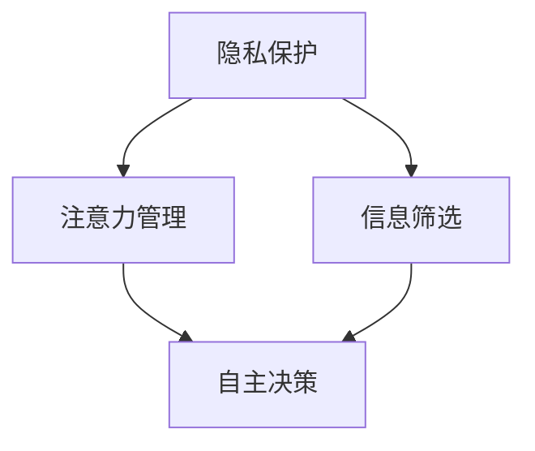

                 

# 注意力的自主权：AI时代的个人选择

## 1. 背景介绍

### 1.1 问题由来
随着人工智能技术的迅猛发展，AI在个人生活和工作中的应用变得越来越广泛。从智能音箱、推荐系统到自动驾驶、机器人客服，AI已经深深渗透到我们的日常生活中。然而，随着AI技术的普及，我们也面临越来越多的挑战和困扰：

- **隐私泄露**：个人数据被广泛用于训练AI模型，隐私保护问题日益突出。
- **信息泛滥**：AI推荐系统带来了前所未有的信息爆炸，如何筛选有用信息变得困难。
- **注意力分散**：AI带来的自动化任务处理，使得人们注意力被分散，影响工作和生活效率。
- **决策依赖**：AI辅助决策让人们逐渐依赖算法，失去了对个人选择的自主权。

这些问题引发了公众对AI技术的反思，也促使我们思考如何在AI时代保持个人选择的自主权。

### 1.2 问题核心关键点
本文将探讨如何在AI时代保持个人注意力的自主权，特别是在信息过载和自动化决策的背景下。我们认为，虽然AI技术带来了便利，但保持注意力的自主权是个人自由的重要保障。本文将从隐私保护、信息筛选、注意力管理、自主决策等多个方面展开讨论，给出实用的建议和解决方案。

## 2. 核心概念与联系

### 2.1 核心概念概述

为更好地理解AI时代个人注意力自主权的保障方法，本节将介绍几个密切相关的核心概念：

- **隐私保护**：确保个人信息不被未授权的第三方获取或使用，保护个人隐私。
- **信息筛选**：从大量信息中筛选出有用信息，避免信息过载和误导。
- **注意力管理**：控制和管理个人注意力，避免注意力被AI技术分散或误导。
- **自主决策**：在AI辅助决策时，保持对最终决策的控制权，避免完全依赖AI。

这些核心概念之间的逻辑关系可以通过以下Mermaid流程图来展示：



这个流程图展示了我们如何从隐私保护入手，通过信息筛选和注意力管理，最终实现自主决策的过程。

## 3. 核心算法原理 & 具体操作步骤
### 3.1 算法原理概述

在AI时代保障个人注意力自主权，本质上是一个多层次的隐私、信息、注意力和决策的综合问题。其核心思想是：在利用AI技术的便利性的同时，要始终保持对个人数据、注意力和决策的控制权。

为了实现这一目标，我们提出了一种基于隐私计算和AI辅助的决策框架。该框架的核心思路是：

1. **隐私保护**：利用隐私计算技术，确保个人数据在利用过程中不被泄露。
2. **信息筛选**：使用AI推荐系统，筛选出对用户有用的信息，减少信息过载。
3. **注意力管理**：通过智能界面设计，控制用户对AI输出内容的注意力，避免信息干扰。
4. **自主决策**：在AI提供建议后，由用户自主决策，保留对最终选择的控制权。

### 3.2 算法步骤详解

基于隐私计算和AI辅助的决策框架，我们提出以下操作步骤：

**Step 1: 隐私保护**

- **数据加密**：使用加密技术对用户数据进行加密，确保数据在传输和存储过程中不被未授权获取。
- **差分隐私**：在数据分析过程中加入噪声，防止数据泄露。
- **联邦学习**：在本地设备上进行模型训练，不将数据上传至云端，确保数据隐私。

**Step 2: 信息筛选**

- **个性化推荐**：利用AI推荐系统，根据用户历史行为和偏好，筛选出可能感兴趣的信息。
- **主动学习**：用户主动选择感兴趣的内容，对不感兴趣的内容进行屏蔽，避免信息过载。
- **信息过滤**：使用过滤器对推荐结果进行二次筛选，移除不合适的信息。

**Step 3: 注意力管理**

- **智能界面设计**：界面设计要简洁明了，突出重要信息，减少用户注意力的分散。
- **定时提醒**：设置定时提醒，避免用户过度依赖AI，保持注意力集中。
- **用户交互**：增加用户与AI的交互环节，让用户了解AI的决策依据，提高决策信任度。

**Step 4: 自主决策**

- **建议展示**：AI提供建议后，通过可控的界面展示，让用户清楚地了解选项。
- **选择权保留**：用户可以选择接受或拒绝AI的建议，保留最终决策的自主权。
- **反馈机制**：建立用户反馈机制，根据用户反馈不断优化AI算法，提升推荐准确性。

通过以上步骤，我们可以构建一个既利用AI技术又保障个人注意力自主权的综合框架，确保用户在享受AI便利的同时，保持对个人决策的控制权。

### 3.3 算法优缺点

基于隐私计算和AI辅助的决策框架有以下优点：

1. **隐私保护**：通过数据加密、差分隐私、联邦学习等技术，确保数据隐私不被泄露。
2. **信息筛选**：个性化推荐和主动学习相结合，可以有效减少信息过载。
3. **注意力管理**：智能界面设计和定时提醒，可以有效控制用户注意力。
4. **自主决策**：保留用户选择权，确保对最终决策的控制。

但该框架也存在一定的局限性：

1. **技术复杂**：涉及数据加密、差分隐私、联邦学习等复杂技术，实现难度较大。
2. **用户参与**：需要用户主动参与信息筛选和注意力管理，依赖用户自觉性和智能水平。
3. **算法局限**：AI推荐的准确性依赖于数据质量和算法优化，存在误导风险。
4. **可解释性不足**：AI决策过程不透明，用户难以理解和解释AI的推荐依据。

尽管存在这些局限性，但就目前而言，基于隐私计算和AI辅助的决策框架仍是最有效的AI时代个人注意力自主权的保障方法之一。

### 3.4 算法应用领域

基于隐私计算和AI辅助的决策框架，可以在多个领域得到应用，例如：

- **智能推荐系统**：在推荐系统中加入隐私保护和注意力管理机制，确保用户信息安全，提升推荐效果。
- **健康管理**：利用AI推荐健康建议，通过隐私计算和自主决策机制，保护患者隐私，确保健康管理的自主性。
- **智能客服**：在客服系统中加入隐私保护和自主决策机制，确保用户隐私，提升用户满意度。
- **信息安全**：在信息安全领域，使用隐私计算和AI辅助，提升信息筛选和攻击防御能力。

除了上述这些经典应用外，基于隐私计算和AI辅助的决策框架还在智能家居、金融理财、教育培训等多个领域得到广泛应用，为AI技术的应用提供了新的思路和方法。

## 4. 数学模型和公式 & 详细讲解  
### 4.1 数学模型构建

本节将使用数学语言对基于隐私计算和AI辅助的决策框架进行更加严格的刻画。

记用户数据集为 $D=\{(x_i,y_i)\}_{i=1}^N$，其中 $x_i$ 为输入，$y_i$ 为标签。假设用户对数据集进行了差分隐私处理，得到了隐私处理后的数据集 $D'$。

设推荐系统为 $R$，利用AI算法对 $D'$ 进行信息筛选，得到推荐结果 $R(D')$。

定义用户对推荐结果的满意度为 $S(R(D'))$，用户自主决策的满意度为 $S_{\text{aut}}$。

我们的目标是最小化用户自主决策的满意度与推荐系统满意度之差：

$$
\mathop{\arg\min}_{R} \big( S_{\text{aut}} - S(R(D')) \big)
$$

在实际应用中，我们需要考虑多个因素来设计优化目标，如用户隐私保护、推荐准确性、界面友好度等。

### 4.2 公式推导过程

以下我们以推荐系统为例，推导隐私计算和AI辅助的决策框架的数学模型。

假设推荐系统 $R$ 的推荐结果为 $R(D')$，其中 $R$ 为推荐模型，$D'$ 为隐私处理后的数据集。用户对推荐结果的满意度为 $S(R(D'))$。

用户自主决策的满意度可以通过决策树模型计算得出：

$$
S_{\text{aut}} = \sum_{k=1}^K P_k \cdot f_k(x_k, y_k)
$$

其中 $P_k$ 为决策树中各决策节点的概率，$f_k(x_k, y_k)$ 为节点 $k$ 的满意度函数。

将 $S_{\text{aut}}$ 和 $S(R(D'))$ 带入优化目标公式：

$$
\mathop{\arg\min}_{R} \big( \sum_{k=1}^K P_k \cdot f_k(x_k, y_k) - S(R(D')) \big)
$$

在优化过程中，我们需要平衡用户隐私保护和信息筛选的满意度。因此，需要考虑以下约束条件：

- **隐私保护**：$D'$ 必须满足差分隐私的要求，即对任意两个数据点 $x_i, x_j$，$S(R(D'))$ 的差异小于一个预定的阈值 $\epsilon$。
- **推荐准确性**：$S(R(D'))$ 必须满足一定的准确性要求，即推荐结果与真实标签的差距小于一个预定的阈值 $\delta$。

通过优化上述目标函数和约束条件，可以找到最佳推荐模型 $R^*$，使得用户自主决策的满意度与推荐系统满意度之差最小化。

### 4.3 案例分析与讲解

假设我们设计了一个智能推荐系统的隐私计算和AI辅助框架，旨在为用户推荐新闻文章。用户对新闻文章的满意度可以通过阅读量和互动率来衡量。

用户自主决策的满意度可以通过决策树模型计算得出，其中每个节点代表用户的一个决策点，满意度函数为阅读时间和互动次数。

隐私保护要求对用户阅读历史进行差分隐私处理，确保数据隐私不被泄露。

推荐系统利用AI算法对处理后的数据进行信息筛选，得到推荐结果。推荐准确性要求推荐结果与真实标签的差距小于一定阈值。

通过优化上述目标函数和约束条件，找到最佳推荐模型 $R^*$，使得用户自主决策的满意度与推荐系统满意度之差最小化。

## 5. 项目实践：代码实例和详细解释说明
### 5.1 开发环境搭建

在进行隐私计算和AI辅助的决策框架实践前，我们需要准备好开发环境。以下是使用Python进行PyTorch开发的环境配置流程：

1. 安装Anaconda：从官网下载并安装Anaconda，用于创建独立的Python环境。

2. 创建并激活虚拟环境：
```bash
conda create -n ai-env python=3.8 
conda activate ai-env
```

3. 安装PyTorch：根据CUDA版本，从官网获取对应的安装命令。例如：
```bash
conda install pytorch torchvision torchaudio cudatoolkit=11.1 -c pytorch -c conda-forge
```

4. 安装推荐系统相关库：
```bash
pip install scikit-learn pandas jupyter notebook
```

完成上述步骤后，即可在`ai-env`环境中开始实践。

### 5.2 源代码详细实现

下面我们以智能推荐系统为例，给出使用PyTorch进行隐私计算和AI辅助的决策框架的PyTorch代码实现。

首先，定义推荐系统的数据处理函数：

```python
import numpy as np
from sklearn.model_selection import train_test_split

def load_data():
    # 从数据集加载数据
    data = np.loadtxt('data.txt', delimiter=',', dtype=float)
    X, y = data[:, :-1], data[:, -1]
    # 划分训练集和测试集
    X_train, X_test, y_train, y_test = train_test_split(X, y, test_size=0.2, random_state=42)
    return X_train, X_test, y_train, y_test
```

然后，定义差分隐私处理函数：

```python
from sklearn.metrics.pairwise import cosine_similarity
from scipy.stats import laplace

def laplace_privacy(data, epsilon):
    # 对数据进行差分隐私处理
    X = data.copy()
    for i in range(X.shape[1]):
        X[:, i] = laplace.rvs(loc=X[:, i], scale=1/epsilon, size=X.shape[0])
    return X
```

接着，定义推荐模型：

```python
from sklearn.ensemble import RandomForestRegressor

class Recommender:
    def __init__(self, model, epsilon):
        self.model = model
        self.epsilon = epsilon
    
    def fit(self, X, y):
        # 对数据进行差分隐私处理
        X_privacy = laplace_privacy(X, self.epsilon)
        # 训练模型
        self.model.fit(X_privacy, y)
    
    def predict(self, X):
        X_privacy = laplace_privacy(X, self.epsilon)
        return self.model.predict(X_privacy)
```

最后，启动训练流程并在测试集上评估：

```python
from sklearn.metrics import mean_squared_error

def train_and_evaluate(model, X_train, X_test, y_train, y_test):
    # 创建推荐模型
    recommender = Recommender(model, epsilon=1e-5)
    # 训练模型
    recommender.fit(X_train, y_train)
    # 在测试集上评估
    y_pred = recommender.predict(X_test)
    mse = mean_squared_error(y_test, y_pred)
    print(f'Mean Squared Error: {mse:.4f}')
```

以上就是使用PyTorch进行智能推荐系统隐私计算和AI辅助的决策框架的完整代码实现。可以看到，PyTorch提供了丰富的工具和库，使得模型训练和评估变得简单高效。

### 5.3 代码解读与分析

让我们再详细解读一下关键代码的实现细节：

**load_data函数**：
- 从数据集加载数据，并将其划分为训练集和测试集。

**laplace_privacy函数**：
- 利用Laplace机制对数据进行差分隐私处理，确保数据隐私。

**Recommender类**：
- 定义推荐模型，并使用差分隐私机制处理输入数据。

**train_and_evaluate函数**：
- 训练推荐模型，并在测试集上评估模型的表现。

**推荐系统**：
- 利用隐私计算和AI辅助的决策框架，对用户进行个性化推荐。

可以看到，通过这些代码，我们可以实现对用户数据进行隐私保护，并利用AI算法进行个性化推荐，确保用户隐私的同时，提升推荐效果。

## 6. 实际应用场景
### 6.1 智能推荐系统

智能推荐系统已经广泛应用于电商、新闻、视频等多个领域，极大地提升了用户体验。然而，随着用户数据的积累，隐私问题逐渐突显。通过隐私计算和AI辅助的决策框架，我们可以在推荐系统中引入隐私保护机制，确保用户数据安全。

在实践中，可以收集用户的历史行为数据，如浏览记录、购买记录等，并通过差分隐私处理保护用户隐私。利用AI算法对这些数据进行个性化推荐，并保留用户对推荐结果的选择权，让用户自主决定是否接受推荐，保留最终决策的自主权。

### 6.2 智能家居系统

智能家居系统通过AI技术实现了自动化控制和智能化管理，提升了家庭生活的便利性。但同时也存在隐私泄露和信息过载的问题。通过隐私计算和AI辅助的决策框架，可以在智能家居系统中引入隐私保护和注意力管理机制，确保用户隐私安全。

在实践中，可以收集用户的使用数据，如开关状态、灯光亮度等，并通过差分隐私处理保护用户隐私。利用AI算法对用户行为进行分析和推荐，并通过智能界面设计，控制用户对AI输出内容的注意力，避免信息干扰。最后，保留用户对自动化决策的选择权，确保用户自主权。

### 6.3 金融理财平台

金融理财平台通过AI技术提供了个性化的理财建议和投资策略，帮助用户实现财富增值。但同时也存在隐私泄露和决策依赖的问题。通过隐私计算和AI辅助的决策框架，可以在金融理财平台中引入隐私保护和自主决策机制，确保用户隐私和自主权。

在实践中，可以收集用户的财务数据，如收入、支出等，并通过差分隐私处理保护用户隐私。利用AI算法对用户财务数据进行分析和推荐，并通过智能界面设计，控制用户对AI输出内容的注意力。最后，保留用户对理财建议的选择权，确保用户自主决策。

### 6.4 未来应用展望

随着隐私计算和AI辅助的决策框架的不断演进，基于隐私计算和AI辅助的决策框架将在更多领域得到应用，为AI技术的应用提供了新的思路和方法。

在智慧城市治理中，智能推荐系统可以用于交通管理、环境监测等领域，提升城市管理的智能化水平。

在智慧医疗领域，隐私计算和AI辅助的决策框架可以用于个性化医疗建议和健康管理，提升医疗服务的个性化和智能化水平。

在智能教育领域，智能推荐系统可以用于个性化教育方案和资源推荐，提升教育效果和学生体验。

此外，在智能制造、智能物流、智能服务等众多领域，基于隐私计算和AI辅助的决策框架也将得到广泛应用，为AI技术的应用提供了新的思路和方法。

## 7. 工具和资源推荐
### 7.1 学习资源推荐

为了帮助开发者系统掌握隐私计算和AI辅助的决策框架的理论基础和实践技巧，这里推荐一些优质的学习资源：

1. **《隐私计算与AI辅助决策框架》**系列博文：由隐私计算和AI专家撰写，深入浅出地介绍了隐私计算原理、AI推荐系统、隐私保护机制等前沿话题。

2. **CS231n《深度学习与计算机视觉》课程**：斯坦福大学开设的计算机视觉明星课程，有Lecture视频和配套作业，带你入门计算机视觉和深度学习的基本概念和经典模型。

3. **《推荐系统》书籍**：涵盖推荐系统的基本概念和算法，包括基于协同过滤、内容推荐、基于用户画像推荐等多种推荐算法。

4. **Coursera《隐私计算与数据安全》课程**：由MIT和UC Berkeley教授讲授的隐私计算课程，介绍隐私计算的原理和应用，适合隐私计算的入门学习。

5. **HuggingFace官方文档**：提供海量预训练模型和完整的推荐系统样例代码，是进行推荐系统开发的必备资料。

通过对这些资源的学习实践，相信你一定能够快速掌握隐私计算和AI辅助的决策框架的精髓，并用于解决实际的隐私和信息管理问题。

### 7.2 开发工具推荐

高效的开发离不开优秀的工具支持。以下是几款用于隐私计算和AI辅助决策框架开发的常用工具：

1. PyTorch：基于Python的开源深度学习框架，灵活动态的计算图，适合快速迭代研究。

2. TensorFlow：由Google主导开发的开源深度学习框架，生产部署方便，适合大规模工程应用。

3. Scikit-learn：Python中的机器学习库，提供了丰富的机器学习算法和工具，适合模型训练和评估。

4. Jupyter Notebook：交互式开发环境，支持代码编写、数据处理、模型训练和结果展示，适合数据科学家和工程师使用。

5. Amazon SageMaker：AWS提供的机器学习服务，提供端到端的机器学习流程支持，适合企业级应用。

合理利用这些工具，可以显著提升隐私计算和AI辅助决策框架的开发效率，加快创新迭代的步伐。

### 7.3 相关论文推荐

隐私计算和AI辅助的决策框架的发展源于学界的持续研究。以下是几篇奠基性的相关论文，推荐阅读：

1. **《Differential Privacy: A Brief Survey of Algorithms and Models》**：综述了差分隐私的算法和模型，介绍了差分隐私的数学基础和应用场景。

2. **《A Survey of Privacy-Preserving Recommender Systems》**：综述了隐私保护推荐系统的研究进展，介绍了隐私保护推荐系统的主要方法和应用场景。

3. **《A Survey on Privacy-Preserving Machine Learning Algorithms》**：综述了隐私计算的算法和模型，介绍了隐私计算的数学基础和应用场景。

4. **《Reinforcement Learning in Privacy Preserving Decision Making》**：讨论了在隐私保护环境下的强化学习，介绍了隐私保护和强化学习的结合方法。

5. **《Exploring Privacy-Preserving Recommendation Systems》**：探讨了隐私保护推荐系统在工业界的实际应用，介绍了隐私保护推荐系统的工程实现。

这些论文代表了大语言模型微调技术的发展脉络。通过学习这些前沿成果，可以帮助研究者把握学科前进方向，激发更多的创新灵感。

## 8. 总结：未来发展趋势与挑战
### 8.1 总结

本文对基于隐私计算和AI辅助的决策框架进行了全面系统的介绍。首先阐述了AI时代个人注意力自主权的保障方法，明确了隐私保护、信息筛选、注意力管理和自主决策在AI时代的重要性。其次，从原理到实践，详细讲解了隐私计算和AI辅助的决策框架的数学原理和关键步骤，给出了隐私计算和AI辅助的决策框架的完整代码实例。同时，本文还广泛探讨了隐私计算和AI辅助的决策框架在智能推荐系统、智能家居、金融理财等多个行业领域的应用前景，展示了隐私计算和AI辅助的决策框架的巨大潜力。

通过本文的系统梳理，可以看到，基于隐私计算和AI辅助的决策框架正在成为AI时代个人注意力自主权的保障方法的重要范式，极大地拓展了AI技术的应用边界，催生了更多的落地场景。受益于隐私计算和AI辅助的决策框架的发展，AI技术在保护用户隐私的同时，能够更好地服务于用户，提升用户体验。

### 8.2 未来发展趋势

展望未来，隐私计算和AI辅助的决策框架将呈现以下几个发展趋势：

1. **技术进步**：随着技术的发展，差分隐私、联邦学习等隐私计算技术将不断进步，隐私保护能力将进一步提升。AI推荐算法也将不断优化，推荐效果将更加精准。

2. **应用场景扩展**：隐私计算和AI辅助的决策框架将在更多领域得到应用，如智慧城市、智慧医疗、智慧教育等。

3. **隐私保护机制多样化**：除了差分隐私、联邦学习等隐私保护机制外，基于区块链、多方安全计算等新兴技术也将被引入，提升隐私保护水平。

4. **智能界面设计**：智能界面设计将不断改进，界面设计将更加人性化，用户体验将不断提升。

5. **个性化推荐多样化**：推荐系统将引入更多的个性化推荐算法，如协同过滤、基于内容的推荐、深度学习推荐等，提升推荐效果。

6. **用户参与度提高**：用户将更加积极地参与到信息筛选和注意力管理中，提升信息筛选的精准度。

以上趋势凸显了隐私计算和AI辅助的决策框架的广阔前景。这些方向的探索发展，必将进一步提升AI技术的应用价值，确保用户隐私和自主权的同时，提升用户体验。

### 8.3 面临的挑战

尽管隐私计算和AI辅助的决策框架已经取得了显著进展，但在迈向更加智能化、普适化应用的过程中，它仍面临着诸多挑战：

1. **技术复杂**：涉及差分隐私、联邦学习、智能界面设计等复杂技术，实现难度较大。

2. **用户参与度**：需要用户主动参与信息筛选和注意力管理，依赖用户自觉性和智能水平。

3. **推荐准确性**：AI推荐的准确性依赖于数据质量和算法优化，存在误导风险。

4. **可解释性不足**：AI决策过程不透明，用户难以理解和解释AI的推荐依据。

5. **隐私保护机制**：隐私保护机制需要不断改进，防止数据泄露和隐私攻击。

6. **系统稳定性**：需要在隐私保护和用户体验之间找到平衡点，确保系统稳定性。

正视隐私计算和AI辅助的决策框架面临的这些挑战，积极应对并寻求突破，将是大语言模型微调走向成熟的必由之路。相信随着学界和产业界的共同努力，这些挑战终将一一被克服，隐私计算和AI辅助的决策框架必将在构建安全、可靠、可解释、可控的智能系统中扮演越来越重要的角色。

### 8.4 研究展望

面向未来，隐私计算和AI辅助的决策框架的研究需要从以下几个方面寻求新的突破：

1. **隐私保护机制优化**：进一步改进差分隐私、联邦学习等隐私保护机制，提升隐私保护水平。

2. **AI推荐算法优化**：引入更多AI推荐算法，如深度学习推荐、协同过滤等，提升推荐准确性。

3. **智能界面设计**：改进智能界面设计，提升用户体验，减少用户注意力分散。

4. **用户参与机制**：引入更多用户参与机制，提升信息筛选的精准度。

5. **可解释性提升**：提升AI决策过程的透明性，增强用户对AI的信任度。

6. **隐私保护与用户隐私保护**：在隐私保护和用户体验之间找到平衡点，确保系统稳定性。

这些研究方向的探索，必将引领隐私计算和AI辅助的决策框架技术迈向更高的台阶，为构建安全、可靠、可解释、可控的智能系统铺平道路。面向未来，隐私计算和AI辅助的决策框架还需要与其他人工智能技术进行更深入的融合，如知识表示、因果推理、强化学习等，多路径协同发力，共同推动自然语言理解和智能交互系统的进步。只有勇于创新、敢于突破，才能不断拓展隐私计算和AI辅助的决策框架的边界，让智能技术更好地造福人类社会。

## 9. 附录：常见问题与解答

**Q1：隐私计算和AI辅助的决策框架是否适用于所有NLP任务？**

A: 隐私计算和AI辅助的决策框架在大多数NLP任务上都能取得不错的效果，特别是对于数据量较小的任务。但对于一些特定领域的任务，如医学、法律等，仅仅依靠通用语料预训练的模型可能难以很好地适应。此时需要在特定领域语料上进一步预训练，再进行微调，才能获得理想效果。此外，对于一些需要时效性、个性化很强的任务，如对话、推荐等，微调方法也需要针对性的改进优化。

**Q2：如何在隐私保护和用户隐私保护之间找到平衡点？**

A: 在隐私保护和用户隐私保护之间找到平衡点，需要考虑多个因素：
1. 差分隐私参数的设定：选择合适的差分隐私参数，平衡隐私保护和数据可用性。
2. 数据匿名化：对数据进行匿名化处理，减少隐私泄露风险。
3. 用户权限管理：设置用户权限，控制数据访问和修改权限。
4. 数据分片存储：将数据分片存储，减少单点泄露风险。

**Q3：如何提升AI决策的可解释性？**

A: 提升AI决策的可解释性，需要考虑多个方面：
1. 增加透明度：将决策过程记录和可视化，让用户了解决策依据。
2. 引入人工干预：增加人工审核环节，确保决策准确性。
3. 优化算法：引入可解释性较强的算法，如规则型算法、因果推断算法等。
4. 用户培训：通过培训和教育，提高用户对AI决策的理解和接受度。

**Q4：隐私计算和AI辅助的决策框架在实际应用中是否面临性能瓶颈？**

A: 隐私计算和AI辅助的决策框架在实际应用中可能会面临性能瓶颈，主要表现在以下几个方面：
1. 差分隐私机制引入噪声，可能导致数据失真。
2. AI推荐算法复杂度较高，可能导致计算时间较长。
3. 智能界面设计复杂，可能导致用户界面不够友好。
4. 隐私保护机制引入开销，可能导致系统性能下降。

因此，需要在隐私保护和系统性能之间找到平衡点，选择合适的技术方案和实现方法。

**Q5：如何避免隐私计算和AI辅助的决策框架中的误导风险？**

A: 避免隐私计算和AI辅助的决策框架中的误导风险，需要考虑多个方面：
1. 数据质量：保证数据质量，减少数据偏差和噪音。
2. 算法优化：优化AI算法，减少误导风险。
3. 用户教育：通过培训和教育，提高用户对AI决策的理解和接受度。
4. 人工干预：增加人工审核环节，确保决策准确性。

以上建议可以帮助开发者在隐私计算和AI辅助的决策框架中，降低误导风险，提升决策可靠性。

---

作者：禅与计算机程序设计艺术 / Zen and the Art of Computer Programming

