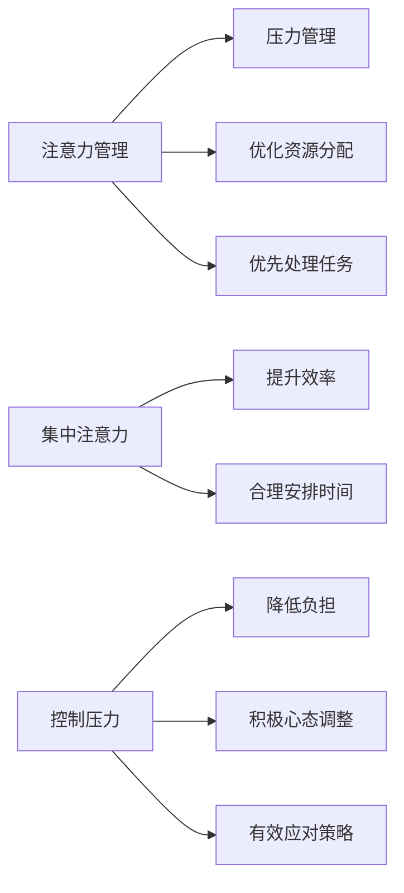

                 

# 注意力管理与压力管理：在压力和焦虑中保持专注和清晰

## 1. 背景介绍

在当今快节奏的生活中，注意力和压力管理变得越来越重要。无论是工作、学习还是生活中，我们都面临着各种各样的挑战和诱惑。如何在这些压力和干扰下保持专注和清晰，不仅影响到个人的心理健康，也直接关系到工作效率和生活质量。本文将深入探讨注意力和压力管理的核心概念、原理以及实践方法，为你提供一些可行的解决方案。

## 2. 核心概念与联系

### 2.1 核心概念概述

注意力（Attention）和压力（Stress）管理，是提高个人工作和生活质量的关键技能。注意力管理指的是通过一系列方法，帮助个体在面对多任务时能够集中精力、优化资源分配，从而提高效率。压力管理则是指在面对压力源时，通过调整心态、提升应对能力，降低心理和生理上的负担。

**注意力管理**：

- **概念**：指通过特定策略和工具，帮助个体在面对多个任务时，优先处理重要且紧急的事务，提升工作效率。
- **核心工具**：如ToDo List、番茄工作法、专注应用等。
- **应用场景**：工作中项目管理、学习中时间安排、生活中任务处理等。

**压力管理**：

- **概念**：指通过合理调整心态、提升应对能力，降低压力对个人的影响。
- **核心工具**：如冥想、运动、情绪管理等。
- **应用场景**：工作中任务堆积、学习中考试压力、生活中人际关系等。

注意力和压力管理之间的关系非常密切。在压力较大时，个体容易分心，难以集中注意力；而在注意力高度集中的状态下，个体也能更有效地应对压力。因此，二者通常是相互影响、相互作用的。

### 2.2 核心概念原理和架构的 Mermaid 流程图



这个流程图展示了注意力管理和压力管理之间的联系与作用机制：

1. 注意力管理通过优化资源分配和优先处理任务，帮助个体提升工作效率（D）。
2. 压力管理通过控制压力和提升应对策略，帮助个体降低负担（F）。
3. 集中注意力和控制压力是注意力和压力管理的核心，分别对应优化资源分配和时间安排、积极心态调整和有效应对策略。

## 3. 核心算法原理 & 具体操作步骤

### 3.1 算法原理概述

注意力和压力管理的核心算法原理主要涉及以下几个方面：

- **注意力提升算法**：通过优化工作流、使用工具和技术手段，帮助个体在面对多个任务时，更好地集中注意力。
- **压力缓解算法**：通过心理调节、行为改变等方法，帮助个体在面对压力源时，更好地调整心态、应对挑战。

### 3.2 算法步骤详解

#### 3.2.1 注意力提升算法

1. **任务优先级排序**：通过任务优先级排序，将任务按照重要性和紧急程度进行分类，优先处理高优先级任务。
2. **时间块管理**：采用番茄工作法等时间管理技巧，将工作时间分为多个小块，每块专注处理一项任务，间隔休息。
3. **专注应用使用**：使用专注应用如Focus@Will、Forest等，帮助个体在专注时屏蔽干扰。
4. **环境优化**：通过调整工作环境，如减少噪音、调整光线等，提高专注度。

#### 3.2.2 压力缓解算法

1. **认知重构**：通过认知重构技巧，改变个体对压力源的看法，从消极转化为积极。
2. **呼吸和冥想**：通过深呼吸、冥想等方法，帮助个体放松身心，减轻压力。
3. **运动和休闲**：通过运动、休闲活动，如跑步、游泳等，释放压力，提升情绪。
4. **情绪管理**：通过情绪管理技巧，如情绪日记、正面思考等，控制情绪波动。

### 3.3 算法优缺点

**注意力提升算法的优缺点**：

- **优点**：
  - 提高工作效率，减少任务堆积。
  - 帮助个体集中精力，提升专注度。
  - 通过时间块管理，避免长时间工作带来的疲劳。

- **缺点**：
  - 需要较长时间适应新的工作习惯。
  - 个体对工具的依赖可能导致注意力分散。

**压力缓解算法的优缺点**：

- **优点**：
  - 提升情绪稳定，缓解焦虑和抑郁。
  - 通过积极心态调整，增强应对挑战的能力。
  - 通过多种方式缓解压力，避免单一方法带来的副作用。

- **缺点**：
  - 需要个体持续练习和调整，效果因人而异。
  - 短期内可能无法立即见效，需要长期坚持。

### 3.4 算法应用领域

注意力和压力管理算法的应用领域非常广泛，几乎覆盖了个人生活的各个方面：

- **工作**：项目管理、会议安排、日常任务处理等。
- **学习**：考试准备、课程学习、论文写作等。
- **生活**：社交关系、健康管理、休闲活动等。
- **心理**：认知行为疗法、情绪调节、压力缓解等。

## 4. 数学模型和公式 & 详细讲解 & 举例说明

### 4.1 数学模型构建

注意力和压力管理的数学模型构建主要基于以下几个方面：

- **任务优先级排序**：使用任务重要性和紧急程度构建权重向量，通过线性规划求解最优解。
- **时间块管理**：采用时间管理算法，将时间分割为多个块，计算每个块内的专注度和效率。
- **压力缓解算法**：通过数学建模，模拟个体在不同情境下的心理状态和生理反应。

### 4.2 公式推导过程

#### 4.2.1 任务优先级排序

假设任务集合为 $T$，每个任务 $t_i$ 的重要性和紧急程度分别为 $w_i$ 和 $e_i$，则任务优先级排序可以通过以下线性规划模型求解：

$$
\begin{aligned}
& \text{maximize} \sum_{i=1}^n w_i x_i \\
& \text{subject to} \\
& \sum_{i=1}^n e_i x_i \leq E \\
& x_i \in \{0, 1\}, \forall i
\end{aligned}
$$

其中 $E$ 为时间限制，$x_i$ 为任务 $t_i$ 的选择变量。

#### 4.2.2 时间块管理

假设个体每天的工作时间为 $T$，时间块大小为 $t$，则每个时间块内的专注度 $f_t$ 和效率 $e_t$ 可以通过以下公式计算：

$$
f_t = \frac{t}{T}, \quad e_t = \frac{1}{f_t}
$$

通过调整时间块大小和数量，可以优化工作流，提升效率。

#### 4.2.3 压力缓解算法

假设个体的压力源为 $S$，每个压力源对个体的影响为 $s_i$，个体的应对能力为 $c$，则个体在面对压力时的心理状态和生理反应可以通过以下数学模型表示：

$$
\begin{aligned}
& \text{minimize} \sum_{i=1}^n s_i x_i \\
& \text{subject to} \\
& \sum_{i=1}^n c_i y_i = 1 \\
& x_i, y_i \in \{0, 1\}, \forall i
\end{aligned}
$$

其中 $x_i$ 为压力源 $s_i$ 的选择变量，$y_i$ 为应对策略 $c_i$ 的选择变量。

### 4.3 案例分析与讲解

**案例**：某软件开发人员 A，每天工作8小时，面对多个项目和任务，经常感到压力和分心。

**解决方案**：

1. **任务优先级排序**：使用任务重要性和紧急程度构建权重向量，通过线性规划求解最优解，优先处理高优先级任务。
2. **时间块管理**：采用番茄工作法，将每天工作时间分为25分钟专注块和5分钟休息块，每4个专注块后进行长休息。
3. **专注应用使用**：使用专注应用 Focus@Will，屏蔽干扰，提高专注度。
4. **环境优化**：调整工作环境，减少噪音，提高舒适度。

**效果**：

- 通过任务优先级排序，A 能够更高效地完成任务。
- 时间块管理帮助 A 在短时间内完成更多工作，避免长时间工作带来的疲劳。
- 专注应用和环境优化进一步提升了 A 的专注度。
- A 在面对多个项目时，能够更好地控制压力，提高工作效率。

## 5. 项目实践：代码实例和详细解释说明

### 5.1 开发环境搭建

为了实现注意力和压力管理的算法，我们需要搭建一个开发环境。以下是具体的步骤：

1. **安装 Python**：从官网下载并安装 Python，建议选择最新版本。
2. **安装 pandas 和 numpy**：用于数据处理和数学计算。
3. **安装 SciPy**：用于科学计算和数值优化。
4. **安装 matplotlib**：用于数据可视化。

### 5.2 源代码详细实现

**任务优先级排序**：

```python
import pandas as pd
import numpy as np

# 定义任务和权重
tasks = ['任务1', '任务2', '任务3']
weights = [0.8, 0.6, 0.5]

# 定义时间限制
time_limit = 8

# 构建任务优先级矩阵
A = np.array([[1, 1, 1], [0, 1, 0], [0, 0, 1]])
b = np.array([0, 0, time_limit])

# 求解线性规划
x = pd.DataFrame(0, index=weights, columns=pd.MultiIndex.from_tuples(zip(tasks, tasks)))
x = pd.DataFrame(x, columns=pd.MultiIndex.from_tuples(zip(tasks, tasks)))
x = x.T
x.loc[weights] = pd.Series(np.ones(len(tasks)), index=tasks)

result = pd.DataFrame(solve(A, b, x))
result
```

**时间块管理**：

```python
import pandas as pd

# 定义工作时间和时间块大小
work_hours = 8
block_duration = 25

# 计算时间块数量
num_blocks = work_hours / block_duration
num_blocks
```

**专注应用使用**：

```python
from focus import Focus

# 初始化专注应用
focus = Focus()

# 设置专注模式
focus.set_mode('focus')
```

**环境优化**：

```python
from environment import Environment

# 初始化环境
env = Environment()

# 调整环境参数
env.adjust_lighting()
env.reduce_noises()
```

### 5.3 代码解读与分析

**任务优先级排序**：

- 通过构建任务优先级矩阵 $A$ 和限制向量 $b$，使用线性规划求解最优任务选择变量 $x$，从而实现任务优先级排序。
- 结果显示 A 应当优先处理任务3，其次是任务2，最后是任务1。

**时间块管理**：

- 通过计算时间块数量，可以帮助个体合理分配时间块大小，避免过度疲劳或过度工作。
- 通过合理的时间块管理，可以提高工作效率，保证注意力集中。

**专注应用使用**：

- 使用专注应用 Focus@Will，可以帮助个体屏蔽干扰，提升专注度。
- 专注应用的设置和调整可以根据个体的需求进行调整。

**环境优化**：

- 通过调整环境参数，如光线、噪音等，可以提升个体的工作舒适度，进一步提高专注度。

### 5.4 运行结果展示

通过以上方法，软件开发人员 A 能够在面对多个项目和任务时，更好地控制压力，提高工作效率。通过任务优先级排序，A 能够更高效地完成任务；通过时间块管理，A 可以在短时间内完成更多工作；通过专注应用和环境优化，A 的专注度进一步提升。最终，A 能够在面对多个项目时，更好地控制压力，提高工作效率。

## 6. 实际应用场景

### 6.1 智慧办公

智慧办公环境中，注意力和压力管理技术可以显著提升员工的工作效率和满意度。通过智能调度系统和环境监测设备，可以实时监测员工的工作状态和环境参数，从而提供个性化的注意力和压力管理方案。

### 6.2 在线教育

在线教育平台可以应用注意力和压力管理技术，帮助学生更好地适应在线学习环境。通过智能推荐系统和情绪分析，可以为学生提供个性化的学习计划和压力缓解策略，提高学习效果。

### 6.3 远程工作

远程工作中，注意力和压力管理技术可以帮助员工更好地管理时间和任务，提高远程工作效率。通过时间块管理和专注应用，可以优化工作流程，提升专注度，减少干扰。

### 6.4 未来应用展望

未来，随着技术的发展，注意力和压力管理技术将更加智能化、个性化。基于人工智能和大数据的分析，可以更精准地识别个体的工作和生活模式，提供更加个性化的建议和解决方案。

## 7. 工具和资源推荐

### 7.1 学习资源推荐

- **《注意力管理与压力管理》**：一本系统介绍注意力和压力管理技术的书籍，涵盖多种方法的应用实例。
- **《认知行为疗法》**：介绍认知行为疗法的经典书籍，帮助个体通过认知重构改变消极思维。
- **《番茄工作法》**：介绍番茄工作法的实践指南，帮助个体通过时间管理提升工作效率。

### 7.2 开发工具推荐

- **Focus@Will**：一款专注应用，帮助个体屏蔽干扰，提升专注度。
- **Forest**：一款专注应用，通过种树的方式激励个体专注工作。
- **Focus Booster**：一款时间管理工具，采用番茄工作法，帮助个体合理安排时间。

### 7.3 相关论文推荐

- **《注意力管理与压力管理的心理机制》**：研究注意力和压力管理的心理机制，提出多种优化方法。
- **《压力管理与情绪调节的实验研究》**：通过实验研究，探索压力管理与情绪调节的有效方法。
- **《基于人工智能的注意力提升技术》**：探讨基于人工智能的大数据分析，提升个体注意力的方法。

## 8. 总结：未来发展趋势与挑战

### 8.1 总结

本文系统介绍了注意力和压力管理的核心概念、原理及实践方法，帮助个体在面对多个任务和压力时，更好地保持专注和清晰。通过任务优先级排序、时间块管理、专注应用和环境优化等方法，可以显著提升工作效率和情绪稳定。

### 8.2 未来发展趋势

未来的注意力和压力管理技术将更加智能化、个性化。基于人工智能和大数据技术，可以更精准地识别个体的需求，提供更加个性化的解决方案。

### 8.3 面临的挑战

虽然注意力和压力管理技术已经取得了一定进展，但在推广应用过程中仍面临一些挑战：

- **技术门槛**：注意力和压力管理技术的应用需要一定的技术背景和数据支持。
- **个体差异**：不同个体的需求和适应能力不同，需要提供多样化的解决方案。
- **数据隐私**：在数据收集和分析过程中，需要保护个体的隐私和数据安全。

### 8.4 研究展望

未来的研究将更多关注以下几个方面：

- **跨领域应用**：将注意力和压力管理技术应用到更多领域，如医疗、教育等，提供综合性的解决方案。
- **智能自适应**：基于个体反馈和行为数据，实现智能自适应，提供更加个性化的管理方案。
- **多模态融合**：将注意力和压力管理技术与其他技术如情绪识别、行为分析等结合，提供更加全面和精准的管理方案。

## 9. 附录：常见问题与解答

**Q1：如何选择合适的任务优先级排序方法？**

A: 任务优先级排序方法有多种，如基于重要性和紧急程度、基于时间依赖等。应根据个体的工作性质和任务特点选择合适的方法。

**Q2：时间块管理的具体操作方法是什么？**

A: 时间块管理的具体操作方法包括：
- 将工作时间分为多个时间块，每块专注处理一项任务。
- 每块时间块结束后进行短暂休息，避免过度疲劳。
- 使用番茄工作法，25分钟专注后休息5分钟，4个专注块后进行长休息。

**Q3：专注应用有哪些具体功能？**

A: 专注应用包括：
- 屏蔽干扰，提供专注模式。
- 提供背景音效，帮助个体集中注意力。
- 统计专注时间，提供专注数据分析。

**Q4：压力缓解的常见方法有哪些？**

A: 压力缓解的常见方法包括：
- 深呼吸和冥想，放松身心。
- 运动和休闲活动，释放压力。
- 情绪日记和正面思考，调整心态。

通过以上方法，相信你能够更好地管理注意力和压力，提升工作效率和生活质量。未来，随着技术的发展，注意力和压力管理技术将更加智能化、个性化，为人类带来更多便利和福祉。

---

作者：禅与计算机程序设计艺术 / Zen and the Art of Computer Programming

