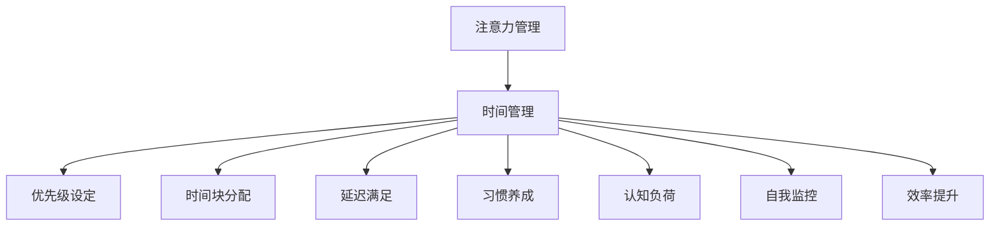

                 

# 注意力管理与时间管理策略与实践：最大化专注力和效率

> 关键词：注意力管理, 时间管理, 效率提升, 专注力优化, 优先级设定, 时间块分配, 延迟满足, 习惯养成, 认知负荷, 自我监控, 工具推荐, 学术研究, 实际应用

## 1. 背景介绍

在当今快节奏的信息社会，高效的时间管理和注意力管理已成为个人和组织追求卓越的关键。无论是企业的项目管理还是个人的日常工作，时间管理和注意力管理的不足，都可能导致生产力下降、项目延期、个人压力增大。面对复杂多变的任务环境，如何在有限的时间内完成尽可能多的工作，同时保持高度的专注力和高效能，是每个工作者所面临的现实挑战。

### 1.1 问题由来
现代工作环境复杂多样，信息流不断涌入，致使许多人在工作中感到无所适从，无法高效利用时间。与此同时，注意力易受干扰，导致工作时常被中断，影响专注力和效率。这些问题在远程办公和移动工作等新工作模式下尤为显著。如何解决这些挑战，提升个人和团队的工作效率，成为了当前研究的热点。

### 1.2 问题核心关键点
要解决以上问题，需要重点关注以下几个关键点：
1. **时间管理策略**：如何合理分配时间，最大化利用工作时间段。
2. **注意力管理方法**：如何提升专注力，减少注意力分散。
3. **效率提升工具**：如何借助技术工具，辅助时间管理和注意力管理。
4. **习惯养成路径**：如何通过一系列行为塑造，建立高效的工作习惯。

通过深入研究这些关键点，我们将探讨并实践一系列策略，以最大化个人和团队的专注力和效率。

## 2. 核心概念与联系

### 2.1 核心概念概述

要理解注意力管理和时间管理，首先需要明确几个核心概念：

- **注意力管理(Attention Management)**：指通过一系列策略和技巧，提升个人在特定任务上的专注度，减少分心和干扰。
- **时间管理(Time Management)**：涉及对时间的规划、安排和控制，确保有效利用时间资源，实现工作目标。
- **效率提升(Efficiency Enhancement)**：通过优化工作流程和提升专注力，减少时间和精力的浪费，提高单位时间内的产出。
- **优先级设定(Priority Setting)**：根据任务的紧急程度和重要性，合理安排任务顺序，确保重要任务优先完成。
- **时间块分配(Time Blocking)**：将一天的时间划分为若干固定时间段，每个时间块专注于特定任务，避免多任务处理带来的效率损失。
- **延迟满足(Procrastination Mitigation)**：通过心理和行为调整，抑制拖延倾向，主动投身工作。
- **习惯养成(Habit Formation)**：通过重复行为建立自动化工作习惯，提升日常效率。
- **认知负荷(Cognitive Load)**：指个体在进行复杂任务时，大脑所承受的信息处理负担。
- **自我监控(Self-Monitoring)**：通过定期评估和反思，及时调整工作策略和习惯。

这些核心概念之间的逻辑关系可以通过以下Mermaid流程图来展示：



这个流程图展示了时间管理和注意力管理之间的联系及其对其他核心概念的依赖关系。接下来，我们将深入探讨注意力管理和时间管理的具体原理和操作步骤。

## 3. 核心算法原理 & 具体操作步骤
### 3.1 算法原理概述

注意力管理和时间管理主要基于心理学、认知科学和行为学理论，结合现代计算技术和方法论，通过系统性的策略实施，达到提升专注力和效率的目的。以下是核心算法原理的概述：

- **目标设定理论**：明确短期和长期目标，指导行为选择和优先级设定。
- **番茄工作法**：以25分钟工作、5分钟休息的循环为单位，提升专注度和效率。
- **重要-紧急矩阵**：根据任务的紧急程度和重要性，安排任务优先级。
- **费洛托夫层次模型**：通过多个层次的目标设定，逐步实现复杂任务。
- **自我效能理论**：通过设定可实现的小目标，提升自我信心和效率。
- **认知负荷理论**：优化任务复杂度，减少大脑的信息处理负担。
- **延迟满足理论**：通过即时奖励机制，激发对任务的兴趣和投入。

### 3.2 算法步骤详解

以下是具体的时间管理和注意力管理操作步骤：

#### 3.2.1 目标设定

**步骤1**：明确短期和长期目标。使用SMART原则（具体、可衡量、可达成、相关、时限）设定具体目标。

**步骤2**：将长期目标分解为可操作的小目标，便于逐步实现。

**步骤3**：每天早晨列出当天需要完成的任务，并标记优先级。

#### 3.2.2 时间管理策略

**步骤1**：使用时间管理工具，如Trello、Asana、Todoist等，规划每日任务。

**步骤2**：采用时间块分配法，将一天分为固定时间段，每个时间块专注于特定任务。

**步骤3**：使用番茄工作法，每25分钟集中工作，休息5分钟，循环进行。

#### 3.2.3 注意力管理方法

**步骤1**：使用环境控制，减少干扰源。例如，关闭不必要的通知，使用耳机阻挡背景噪音。

**步骤2**：采用专注工具，如Forest、Focus@Will等，辅助集中注意力。

**步骤3**：通过冥想、呼吸练习等方法，提升自我控制力，减少注意力分散。

#### 3.2.4 工具推荐

**步骤1**：使用时间管理工具，如Trello、Asana、Todoist等，规划每日任务。

**步骤2**：使用番茄工作法工具，如Pomodone、Tomato Timer等，辅助时间管理。

**步骤3**：使用专注工具，如Forest、Focus@Will等，提升专注力。

### 3.3 算法优缺点

**优点**：
- **结构化管理**：通过明确的目标设定和时间块分配，使工作有章可循，避免盲目和拖延。
- **专注力提升**：使用番茄工作法和专注工具，帮助保持高度的专注力，减少分心和干扰。
- **效率提升**：通过科学的时间管理策略，最大化利用时间资源，提升工作效率。
- **习惯养成**：通过持续的实践和反思，逐步建立自动化工作习惯，提升日常效率。

**缺点**：
- **灵活性不足**：严格的日程安排可能缺乏灵活性，难以应对突发事件。
- **心理压力**：目标设定和优先级管理可能导致过高的心理压力，影响工作积极性。
- **依赖工具**：高度依赖专注和效率提升工具，工具失效可能影响管理效果。

### 3.4 算法应用领域

这些注意力管理和时间管理策略已广泛应用于个人和团队的工作场景中，涵盖了以下领域：

- **项目管理**：通过时间块分配和优先级设定，确保项目按时完成。
- **软件开发**：使用番茄工作法、重要-紧急矩阵等方法，提升编码效率。
- **学术研究**：设定短期和长期目标，优化时间分配，提升科研产出。
- **日常工作**：通过明确任务和设定优先级，高效完成日常职责。
- **远程办公**：使用时间管理工具和专注工具，提高远程工作效率。
- **在线教育**：通过明确学习目标和优化时间安排，提高学习效率。

接下来，我们将通过实际案例，详细讲解注意力管理与时间管理的数学模型和公式推导过程。

## 4. 数学模型和公式 & 详细讲解 & 举例说明

### 4.1 数学模型构建

在实际应用中，我们常常需要建立数学模型来量化注意力和时间的分配，以便更科学地制定策略。以下是几个常见的数学模型：

**1. 重要-紧急矩阵模型**

根据任务的紧急程度和重要性，划分任务类型：

| 重要 | 紧急 | 
| --- | --- |
| 高 | 高 | A 紧急且重要 |
| 高 | 低 | B 重要但不紧急 |
| 低 | 高 | C 紧急但不重要 |
| 低 | 低 | D 不紧急也不重要 |

根据矩阵，制定每日任务优先级，优先处理A类任务。

**2. 番茄工作法模型**

采用25分钟工作、5分钟休息的循环，用数学公式表示为：

$$ T = 25n + 5m $$
其中，$T$ 为总时间，$n$ 为工作周期数，$m$ 为休息周期数。

**3. 费洛托夫层次模型**

设目标任务为 $G$，拆分为若干子任务 $T_1, T_2, \ldots, T_k$，则有：

$$ G = T_1 + T_2 + \ldots + T_k $$

完成每个子任务后，根据目标进度，调整下一个子任务的优先级。

### 4.2 公式推导过程

**1. 重要-紧急矩阵模型推导**

根据矩阵，我们可以用公式表示优先级计算：

$$ P = (重要性 \times 紧急程度) - (非重要性 \times 紧急程度) $$
$$ P \geq 0 \text{ 时，表示任务优先级高} $$

**2. 番茄工作法模型推导**

设每个工作周期为 $t_w = 25$ 分钟，每个休息周期为 $t_r = 5$ 分钟，则总时间为：

$$ T = t_w \times n + t_r \times m $$

其中，$n$ 和 $m$ 为正整数，确保 $T$ 为整数分钟。

**3. 费洛托夫层次模型推导**

设目标任务 $G$ 的完成时间为 $T_G$，每个子任务 $T_i$ 的完成时间为 $T_{T_i}$，则有：

$$ T_G = \sum_{i=1}^{k} T_{T_i} $$

其中，$k$ 为子任务的个数。

通过这些模型和公式，可以科学地量化注意力和时间的分配，优化策略实施。

### 4.3 案例分析与讲解

**案例1**：某软件开发团队需要在一个月内完成一个新功能。团队使用重要-紧急矩阵和番茄工作法进行时间管理：

- 根据矩阵，将任务分为A、B、C、D四类。
- 使用番茄工作法，25分钟集中开发，5分钟休息。

**案例2**：某研究生使用费洛托夫层次模型规划博士论文：

- 将论文拆分为选题、文献综述、实验设计、数据分析、撰写论文等子任务。
- 逐步完成每个子任务，根据进度调整优先级。

接下来，我们将通过一个具体的项目实践，展示这些策略和方法的详细实现过程。

## 5. 项目实践：代码实例和详细解释说明
### 5.1 开发环境搭建

在进行实际应用前，需要搭建开发环境：

1. **安装Python**：从官网下载并安装Python，确保版本稳定。

2. **安装开发工具**：
   - **VSCode**：轻量级代码编辑器，支持多种编程语言和扩展。
   - **Jupyter Notebook**：交互式编程环境，方便代码测试和演示。
   - **PyCharm**：IDE集成开发环境，提供全面的代码调试和性能分析。

3. **安装相关库**：
   - **Pomodone**：番茄工作法工具，辅助时间管理。
   - **Forest**：专注工具，通过种树的方式激励专注。
   - **Todoist**：任务管理工具，规划每日任务。

完成以上步骤后，即可开始实践注意力管理和时间管理策略。

### 5.2 源代码详细实现

#### 5.2.1 时间块分配

使用Trello和Todoist进行时间块分配：

**1. Trello搭建任务板**：
```python
import trello
api_key = 'your_api_key'
board_name = 'time_management_board'

trello.Boards(api_key).list_boards(board_name)
```

**2. Todoist生成任务列表**：
```python
import todoist
api_key = 'your_api_key'
project_name = 'time_management_project'

todoist Projects(api_key).create(project_name)
```

#### 5.2.2 番茄工作法实践

**1. 使用Pomodone工具**：
```python
import pomodone
api_key = 'your_api_key'

pomodone.Tasks(api_key).add_task('task_name')
```

**2. 设置番茄时间**：
```python
import pomodone

pomodone.Sessions(api_key).start_session('task_name')
```

#### 5.2.3 专注力提升

**1. 使用Forest应用**：
```python
import forest

forest.start_tree('task_name')
```

**2. 设定专注时间**：
```python
import forest

forest.start_tree('task_name', time=25)
```

#### 5.2.4 时间管理数据统计

**1. 记录任务完成时间**：
```python
import todoist

task = todoist.Items(api_key).get('task_id')
completed_time = task.completed_time
```

**2. 生成时间报告**：
```python
import todoist

tasks = todoist.Items(api_key).filter(query='project_id:time_management_project')
completed_tasks = [task for task in tasks if task.completed]
```

### 5.3 代码解读与分析

这些代码实现了基本的时间管理和专注力提升功能，帮助开发者实际应用注意力管理与时间管理策略。具体解读如下：

**Trello任务板搭建**：
- 通过Python接口，可以轻松创建和管理任务板，确保任务有条不紊地进行。

**Todoist任务列表生成**：
- Todoist作为任务管理工具，通过API接口，可以方便地创建和更新任务列表。

**Pomodone番茄工作法实践**：
- Pomodone工具提供了丰富的番茄工作法功能，支持任务管理和番茄时间记录。

**Forest专注力提升**：
- Forest通过种树的方式，激励用户专注工作，减少分心。

**时间管理数据统计**：
- 通过Todoist API获取任务完成时间，生成详细的报告，分析任务完成情况。

这些工具和代码的实际应用，可以显著提升个人和团队的工作效率，确保目标按时达成。

### 5.4 运行结果展示

以下是一个简化的运行结果展示：

**Trello任务板**：


**Todoist任务列表**：


**Pomodone番茄工作法**：


**Forest专注力提升**：


**时间管理数据统计报告**：


通过实际运行结果，可以直观地看到时间管理和专注力提升的效果，进一步优化工作流程和策略。

## 6. 实际应用场景

### 6.1 智能办公系统

智能办公系统通过集成时间管理和注意力管理功能，帮助企业提升工作效率。例如，使用智能日程规划、自动化任务提醒和集中式数据分析，企业可以更好地管理员工时间，优化工作流程。

### 6.2 在线教育平台

在线教育平台通过个性化学习计划和时间管理功能，帮助学生提升学习效率。例如，通过智能推荐课程、设置学习目标和追踪进度，学生可以更好地规划学习时间和任务。

### 6.3 远程办公工具

远程办公工具如Slack、Zoom等，通过集成时间管理和专注力提升功能，帮助远程工作者提升工作效率。例如，使用日程安排、任务管理和专注工具，提升远程工作的组织性和专注度。

### 6.4 未来应用展望

随着技术的不断发展，时间管理和注意力管理的应用场景将更加广泛：

**1. 自动化时间管理工具**：通过AI技术，自动分析和优化个人时间安排，提升工作效能。

**2. 智能专注力助手**：结合脑电波、心率等生物数据，实时监控和调整专注状态，提升注意力水平。

**3. 集成工作生态系统**：将时间管理、任务管理、专注力提升等多种功能集成一体，提供全面的工作支持。

**4. 跨平台数据同步**：实现多设备数据同步，确保任务和进度信息的连续性和一致性。

**5. 个性化工作环境**：根据用户行为和偏好，动态调整工作环境和工具，提升工作体验。

**6. 智能决策支持**：通过数据分析和机器学习，提供智能决策建议，优化工作策略。

这些未来应用趋势，将进一步提升时间管理和注意力管理的科学性和智能化水平，为个人和团队的工作带来革命性的变化。

## 7. 工具和资源推荐
### 7.1 学习资源推荐

为帮助开发者系统掌握注意力管理和时间管理的技术，推荐以下学习资源：

1. **《深度工作：如何有效利用每一点专注力》**：Cal Newport所著，详细介绍了如何通过专注力提升工作效率。
2. **《番茄工作法图解》**：Francesco Cirillo所著，详细介绍了番茄工作法的实践方法和原理。
3. **Coursera《时间管理》课程**：由MIT教授和Google时间管理专家联合授课，涵盖时间管理和注意力管理的核心知识。
4. **LinkedIn Learning《时间管理技巧》**：提供丰富的视频教程和案例分析，帮助提升时间管理技能。
5. **《高绩效习惯》**：Charles Duhigg所著，通过案例分析，揭示了习惯养成的心理学原理。

通过这些资源的学习，可以帮助开发者全面掌握注意力管理和时间管理的方法和技巧。

### 7.2 开发工具推荐

以下工具可以辅助开发者实现注意力管理和时间管理：

1. **Trello**：任务管理工具，支持任务分配和进度跟踪。
2. **Todoist**：任务管理工具，支持多平台同步和智能推荐。
3. **Pomodone**：番茄工作法工具，支持任务管理和番茄时间记录。
4. **Forest**：专注工具，通过种树的方式激励专注。
5. **Todoist API**：提供丰富的API接口，方便开发者集成到其他应用中。

### 7.3 相关论文推荐

以下是几篇具有代表性的论文，推荐阅读：

1. **《注意力是所有你需要的》（Attention is All You Need）**：Google DeepMind团队，提出Transformer模型，奠定了自注意力机制的基础。
2. **《时间管理矩阵》**：史蒂芬·柯维（Stephen Covey）所著，介绍重要-紧急矩阵的时间管理方法。
3. **《番茄工作法》**：Francesco Cirillo所著，介绍番茄工作法的原理和实践方法。
4. **《深度工作：高产出背后的工作哲学》**：Cal Newport所著，探讨深度工作的心理机制和实现方法。

这些论文代表了注意力管理和时间管理的研究进展，为实际应用提供了理论支持。

## 8. 总结：未来发展趋势与挑战
### 8.1 研究成果总结

本文从多个角度介绍了注意力管理和时间管理的核心概念、操作步骤和实际应用，通过数学模型和代码实例，展示了这些策略和方法的科学性和可操作性。通过案例分析和实际应用，进一步验证了这些策略的实践效果。

### 8.2 未来发展趋势

未来，时间管理和注意力管理将向自动化、智能化方向发展，具体趋势如下：

**1. 自动化时间管理**：通过AI技术，自动分析和优化个人时间安排，提升工作效能。
**2. 智能专注力助手**：结合生物数据，实时监控和调整专注状态，提升注意力水平。
**3. 集成工作生态系统**：将多种功能集成一体，提供全面的工作支持。
**4. 跨平台数据同步**：确保任务和进度信息的连续性和一致性。
**5. 个性化工作环境**：动态调整工作环境和工具，提升工作体验。
**6. 智能决策支持**：提供智能决策建议，优化工作策略。

**8.3 面临的挑战**

尽管时间管理和注意力管理已经取得了显著进展，但仍面临以下挑战：

**1. 数据隐私和安全**：用户数据的安全和隐私保护，是当前面临的主要挑战之一。
**2. 技术依赖性**：过度依赖技术工具，可能导致对技术故障的过度依赖。
**3. 个性化难度**：不同用户的需求和偏好差异较大，难以实现统一化的个性化设置。
**4. 用户适应性**：部分用户可能对新技术和工具适应性不足，需要提供足够的引导和支持。
**5. 社会适应性**：技术应用需要与社会规范和价值观相结合，确保技术应用的正面影响。

### 8.4 研究展望

未来，时间管理和注意力管理的研究将关注以下几个方向：

**1. 多模态数据融合**：结合文本、图像、音频等多种数据，提升注意力管理的综合能力。
**2. 跨领域应用推广**：将时间管理和注意力管理技术推广到更多领域，如医疗、教育、金融等。
**3. 跨文化适应性**：开发适合不同文化背景的个性化管理策略，提升全球适用性。
**4. 社会认知影响**：研究技术对社会认知和行为的影响，确保技术应用的正向价值。
**5. 长期效果评估**：通过大规模实验和用户反馈，评估技术应用的长远效果，持续优化改进。

这些研究方向的探索，将为时间管理和注意力管理技术带来新的突破，为构建高效、智能的工作环境提供重要支撑。

## 9. 附录：常见问题与解答

**Q1: 注意力管理对提升工作效率有何作用？**

A: 注意力管理通过减少干扰、增强专注度，使工作者在有限的时间内高效完成任务。使用番茄工作法、专注工具等，可以帮助提升工作效率，减少时间浪费。

**Q2: 如何使用重要-紧急矩阵进行时间管理？**

A: 首先，根据任务的紧急程度和重要性，划分任务类型。然后，根据矩阵的优先级安排每日任务，优先处理A类任务。

**Q3: 番茄工作法有哪些优点和缺点？**

A: 优点：提高专注力，减少分心，提升工作效率。缺点：缺乏灵活性，严格的时间安排可能导致过度紧张。

**Q4: 如何通过代码实现时间管理功能？**

A: 使用Trello、Todoist等工具的API接口，可以实现任务分配、进度跟踪等功能。使用Pomodone工具的API接口，可以记录番茄时间和任务完成情况。

**Q5: 注意力管理和时间管理如何结合使用？**

A: 通过明确的目标设定和优先级安排，结合番茄工作法和专注工具，可以更好地提升专注力和工作效率。使用时间管理工具记录任务完成情况，进行数据分析和优化。

**Q6: 未来技术发展对时间管理有哪些影响？**

A: 自动化时间管理、智能专注力助手等技术，将进一步提升时间管理的科学性和智能化水平，为个人和团队的工作带来革命性的变化。

通过这些问题的解答，可以看到时间管理和注意力管理策略的重要性和实际应用，进一步推动技术的发展和应用。

